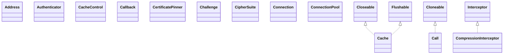

# okhttp-jvm-5.3.2.jar

[Group index](README.md) | [All archives](../README.md)

## Scope and provenance

- **Donor:** `SQX_145_REFERENCE_ROOT/internal/libs/okhttp-jvm-5.3.2.jar`.
- **SHA-256:** `c771f48075b763f6c322055e21129a94b7de4c1faf3f8f58ace320b0c9517a30`; accessed 2026-10-06; captured `2026-10-06T18:54:51.906614+00:00`.
- **Classes:** 336 raw entries; 336 unique entry names. Duplicate occurrence indices are zero-based.
- **Inspection:** read-only ZIP hashing and class-file structural parsing; signatures/descriptors, modifiers, hierarchy and references only. Bytecode bodies are hashed, not published.
- **Allocation:** proposed `FEAT-HOST-OKHTTP-JVM`, P02; [roadmap](../../sqx-full-application-roadmap.md). Domain README registration remains required.
- **Repository:** `01067f00031428613c6394064ca1bcadc1ba00ee`; review state unreviewed. Download label 145-dev1; installed build/activation and runtime equivalence unverified.
- **Limit:** every class/member is inventoried; declaration coverage does not establish consumed calls, defaults, formulas, failure semantics or algorithm parity.
- **Archive/resource index:** [084.json](../../../evidence/sqx145/archives/145/084.json).

## Complete member declarations

Member shards contain exact JVM names/descriptors, access flags, generic signatures, throws types, declared fields/methods, superclass/interfaces and referenced class names. All classes, nested/synthetic members and overloads are retained. Code length/hash is structural evidence, not a normalized algorithm comparison.

- [001.json](../../../evidence/sqx145/members/084/001.json) — SHA-256 `3046dc32bcdd9303fd80a1bc6069f53121fd7fbf5c2012256ace1ca41caba469`.
- [002.json](../../../evidence/sqx145/members/084/002.json) — SHA-256 `ba5e95f784fd01644b7a09fd9e7a8ceb937023a094746cd0b50ff0836d9eb8e8`.
- [003.json](../../../evidence/sqx145/members/084/003.json) — SHA-256 `2193c63956c90faeac65fad4ac96c9549ce78b33c205c21d3a10c88ecd2a062d`.
- [004.json](../../../evidence/sqx145/members/084/004.json) — SHA-256 `097813ce4aacbc7ba1b7f92468381256865a660215a6c91b53a482f7f21ac44d`.
- [005.json](../../../evidence/sqx145/members/084/005.json) — SHA-256 `69233f7002b3d91456a499ce07b1eb96d330649e559c95ccecbe4dfce2b07531`.

## Focused structural diagram

Up to twelve non-nested classes; arrows show declared inheritance/interfaces only. External type names are not evidence of an available body or an executed dependency.

## Class inventory

| Archive entry | Occurrence | Class SHA-256 | Fields | Methods |
| --- | ---: | --- | ---: | ---: |
| `META-INF/versions/9/module-info.class` | 0 | `e8e47f731f4b9b7cdc3ca32811f6c4d1896d15444fc06219fda87aa05ae73f99` | 0 | 0 |
| `okhttp3/Address.class` | 0 | `8aa7a9bc55d5e97b4dbd04eb6bcb02f8744dde424b50d0114a479c9d1b3e68fb` | 11 | 27 |
| `okhttp3/Authenticator$Companion$AuthenticatorNone.class` | 0 | `6cdab5ea31e3efad93e37c356e7984ef3cdbfdfc193b6ff1269a2309ecdd1540` | 0 | 2 |
| `okhttp3/Authenticator$Companion.class` | 0 | `081bff1e2370abf44b9b04acabe6d07ee833bbe9889b40d026ced5ec9a135c65` | 1 | 2 |
| `okhttp3/Authenticator.class` | 0 | `e9b383134b581b95e504eef04d65a91d0189fd736643ace59d94d42d8f3d1d73` | 3 | 2 |
| `okhttp3/Cache$CacheResponseBody$1.class` | 0 | `5e2df66086ea03070fd4e0480f177a73ae90c15443f5bb74f4f651b62bb62260` | 1 | 2 |
| `okhttp3/Cache$CacheResponseBody.class` | 0 | `ff4483e2457ba249033a7453244a7be98af945c3d26b315e81fbf743707d4271` | 4 | 5 |
| `okhttp3/Cache$Companion.class` | 0 | `a56feefef18bf0e9cf844207ca3bb3ca2cdb371bef5672c597783e9430129860` | 0 | 9 |
| `okhttp3/Cache$Entry$Companion.class` | 0 | `17194744c264ce1e6bf930ac2a714405cf0d721e769878298d5ea2236c657b5d` | 0 | 2 |
| `okhttp3/Cache$Entry.class` | 0 | `d1cec055f2717d93fca0c7b262cd086e7c826e9cdc0c80c45c39d5eadf135c8e` | 13 | 8 |
| `okhttp3/Cache$RealCacheRequest$1.class` | 0 | `4b669dbcca422e5a57c6deaa5817380116d9fe7bca9b8cdd19739fc1d2a20d3d` | 2 | 2 |
| `okhttp3/Cache$RealCacheRequest.class` | 0 | `ca91ae8b26ff567bd700cfdf709f5eaa56e170509e6429f08b8a069beff2fec4` | 5 | 6 |
| `okhttp3/Cache$urls$1.class` | 0 | `d12964407f772d5398d2df5560d14a279824f30fc56a80df3c1759d0d2219d54` | 3 | 5 |
| `okhttp3/Cache.class` | 0 | `20fadf33a55054213cdd44c66c2ec80fcabf8e6652d0a25a963a66373b3cb546` | 11 | 34 |
| `okhttp3/CacheControl$Builder.class` | 0 | `ff8ffc7007356b2c68f28d1a38d5c6007e11f066f2287d78f432407b7f515eb0` | 8 | 29 |
| `okhttp3/CacheControl$Companion.class` | 0 | `2ff30129f7054dc75c3d1f7653ec42e535c421850069b3af4e584d099f3d2c10` | 0 | 3 |
| `okhttp3/CacheControl.class` | 0 | `0e51afa8f3770376d4205c9314cf0131d2a9e1279a863c4dd5ab11b7600f8916` | 16 | 28 |
| `okhttp3/Call$Factory.class` | 0 | `678f8d26557d2276cbee004f7bc73f896601f22aedf33dde817c47b9dbd0d9d0` | 0 | 1 |
| `okhttp3/Call.class` | 0 | `0d2560bd08cef106b30e7824490ee97a601648ed0ceb5f44dbde3b36435e5fa7` | 0 | 12 |
| `okhttp3/Callback.class` | 0 | `0e56a0bd378ae5a28efc9d4f95c863c0aac225b7a70e33c2377ab956e809cf1e` | 0 | 2 |
| `okhttp3/CertificatePinner$Builder.class` | 0 | `153c9379130a1ba0ecf75cfc70d5b7ef194ce5efd44201cb238c9c24dd554c10` | 1 | 4 |
| `okhttp3/CertificatePinner$Companion.class` | 0 | `124624fe1af349a1b060d3fd04756b3bd7a1f021680a678ed6a69901be08774f` | 0 | 5 |
| `okhttp3/CertificatePinner$Pin.class` | 0 | `77b5dc5aea7d754857af6a46156c346f9df507750e7f76fbe64c304285627ac2` | 3 | 9 |
| `okhttp3/CertificatePinner.class` | 0 | `1e0320b1e53fb993028891ad60ae74f5e81096f89099bff62941c5b3c73b241f` | 4 | 16 |
| `okhttp3/Challenge.class` | 0 | `9cc67166ec632b8526f68ea0e2b39377bb1c0eefe1f7f2a5f1d8f6085b8a040f` | 2 | 14 |
| `okhttp3/CipherSuite$Companion$ORDER_BY_NAME$1.class` | 0 | `7e6eefa8dd95c891c9946dd4f963aa0bbb19c362fed02dc45f8695a633d2f8fc` | 0 | 3 |
| `okhttp3/CipherSuite$Companion.class` | 0 | `923437f8e59859a2bd3c9e934bb332306b793d8656cb7500652b05b31b4b14e4` | 0 | 7 |
| `okhttp3/CipherSuite.class` | 0 | `2576b2cbb3db310263af65bdf7f918669760128077791d3afba09d60f8f308ea` | 123 | 9 |
| `okhttp3/CompressionInterceptor$DecompressionAlgorithm.class` | 0 | `83c256990457dc5b38cbc6a46599095c71b4e8797d71f59f3a298fe119203f27` | 0 | 2 |
| `okhttp3/CompressionInterceptor.class` | 0 | `60e949bad688d2e9557906a2e89402a641caa7ef0e50178ed2f374abdba3acb6` | 2 | 6 |
| `okhttp3/Connection.class` | 0 | `d370c91f8b9351c3aa2a87b806fb15acc5c51f5be31a8f467fc50d7754d1d5d0` | 0 | 4 |
| `okhttp3/ConnectionPool.class` | 0 | `6425501518d9be3710a48bf620b9209866fbf72edda396065e88a7e6cbf5e164` | 1 | 12 |
| `okhttp3/ConnectionSpec$Builder.class` | 0 | `4523a2e5e2bbd7e49daf6941626fbb60e1429bd5fcb9d4836ec2e42e26b97bc3` | 4 | 18 |
| `okhttp3/ConnectionSpec$Companion.class` | 0 | `045da74fdce7aba34a2addc43a1e22fb0397057a9884cc2da5ebb5bcc557d359` | 0 | 2 |
| `okhttp3/ConnectionSpec.class` | 0 | `e80f47ade7144b18b6be537f268d468560fcef26d31cab48343b995256773377` | 11 | 17 |
| `okhttp3/Cookie$Builder.class` | 0 | `161175b39faa1daf44644f8ed0c102143fece3a804d99d0e4d59f2fa73772941` | 10 | 13 |
| `okhttp3/Cookie$Companion.class` | 0 | `ebd062564c4611034e281ac93182e7efd0a8c9a694046409a9b308b72b38eaa0` | 0 | 13 |
| `okhttp3/Cookie.class` | 0 | `73eefa9497aaa6494d2dffc2aecca6ec2d86ab53990a030317f47f123baa031c` | 15 | 34 |
| `okhttp3/CookieJar$Companion$NoCookies.class` | 0 | `0cf0c4d83b0ad95d290389a1d53c5a2fa0d16933c3bbedb90d2d205f22dac047` | 0 | 3 |
| `okhttp3/CookieJar$Companion.class` | 0 | `97901c28b4cf7c1b51e773a7e66d03ed95223e33b10011acb83570bf6e3b518d` | 1 | 2 |
| `okhttp3/CookieJar.class` | 0 | `641cdd33977f9b66dffc69661a45eea1d9e48945e0151b81c87ca5f54fabb83f` | 2 | 3 |
| `okhttp3/Credentials.class` | 0 | `a84631a1921fb5571b1fbbc08b4f1b65feb65f1dd5b1f8682bd9efc02df3561e` | 1 | 5 |
| `okhttp3/Dispatcher$promoteAndExecute$Effects.class` | 0 | `f25c1fb889d2871520abc9591d9ae13505f5fd29c58ac0d654fbf0286b8f53de` | 2 | 3 |
| `okhttp3/Dispatcher.class` | 0 | `ca7a59e383462e08e3c118de0c0c39e3ff931e502911ca60e1aca5c12c42372b` | 7 | 22 |
| `okhttp3/Dns$Companion$DnsSystem.class` | 0 | `20221e3fa4a3bc054c220db9b8751eccda1cc3c70d9d56bfe03c7cca126970d5` | 0 | 2 |
| `okhttp3/Dns$Companion.class` | 0 | `5a742753261fbb0bcd061270379f98a2e93e1bb5c52631c66ad87f44960bcc17` | 1 | 2 |
| `okhttp3/Dns.class` | 0 | `69090a8f4361ee4cf02f10bb9228524dd378dbad19256f6131d97679f68a8591` | 2 | 2 |
| `okhttp3/EventListener$AggregateEventListener.class` | 0 | `1fcff680e5875bb596bd458bae5712bf072377d9850e3a4a3a2aa548b34434dc` | 1 | 35 |
| `okhttp3/EventListener$Companion$NONE$1.class` | 0 | `c122ad5123a7ca18f9211b02cbfaf591b9cf39e760ce62db5b59159ed0e22507` | 0 | 1 |
| `okhttp3/EventListener$Companion.class` | 0 | `743ab51f28788438032fa8cea202dfb9d64fc846add709ed1d6c5fcef6f57b29` | 0 | 2 |
| `okhttp3/EventListener$Factory.class` | 0 | `2310dfcf5f2453076cc757db3088dfbf52cc4eee28222f271f166909e61574b0` | 0 | 1 |
| `okhttp3/EventListener.class` | 0 | `913e90f050a1d412ab178fbef22fa980a0bd79d89d6c76961470744dbb86d8d8` | 2 | 36 |
| `okhttp3/FormBody$Builder.class` | 0 | `407e24678ef548a04c8e9b696e206354d69f91e678c7a721200355b934e2b98c` | 3 | 6 |
| `okhttp3/FormBody$Companion.class` | 0 | `d09cd6112b673c5a03edae7f38894d24a1438b58959714fd2ec87076083a5c13` | 0 | 2 |
| `okhttp3/FormBody.class` | 0 | `7d7a48dc1f8c6a9889f165658f4f8724145dec5c2e6abbf7f59c657ecf668845` | 4 | 12 |
| `okhttp3/Gzip.class` | 0 | `2abeab699b560ea522b59e277f27ae6751f4f63729fc40e504600a4faea8b522` | 1 | 4 |
| `okhttp3/Handshake$Companion.class` | 0 | `2358897be80c769f404d3422fc7ef5b3e2af9320ea700ee6323ed3f5b15e4a40` | 0 | 7 |
| `okhttp3/Handshake.class` | 0 | `995648f2cb4001e986ae92abb42918b0c1af52dbbee6284fed9b17dfe80c18a8` | 5 | 21 |
| `okhttp3/Headers$Builder.class` | 0 | `16419b1bf5c03a075a0bc200fce57d81629c6f13656bb1083d2ce343bfef8829` | 1 | 16 |
| `okhttp3/Headers$Companion.class` | 0 | `c02e63b8ed5a2799fc5c76700147a7c8c51beffce42c20c2648781ebf87ec09a` | 0 | 6 |
| `okhttp3/Headers.class` | 0 | `5391e0e1ba149e3e8b9a659cbb1fed5e6901541a147b112bc33714d543cf7ce4` | 3 | 21 |
| `okhttp3/HttpUrl$Builder.class` | 0 | `ae4d10a5b59f75d7e56750f4252d5d85214bce76688a72c7f8ef7ded13e09edd` | 8 | 59 |
| `okhttp3/HttpUrl$Companion.class` | 0 | `5121360546e8c5c5b0044ae88386a0385c9142e4b4d5a08f047d718e608cc211` | 0 | 13 |
| `okhttp3/HttpUrl.class` | 0 | `a77c3321b335d90f293c66cee70f5b5474d7c3525624716a76b4fa114c13a912` | 10 | 59 |
| `okhttp3/Interceptor$Chain.class` | 0 | `348ef05b4682b001e43c0049b229b52680282db0816d7e1d38a2f981b305eaa5` | 0 | 10 |
| `okhttp3/Interceptor$Companion$invoke$1.class` | 0 | `5a4e0a1608c9ccab4a4876bfd0107fcb3b73c3d29dfddbe1fb81540563adcc08` | 1 | 2 |
| `okhttp3/Interceptor$Companion.class` | 0 | `11d9d9a7ada4781a742d102fce80a5a45b4113600ea915f9f3b969b75d0040f5` | 1 | 3 |
| `okhttp3/Interceptor.class` | 0 | `3e0c08141b1b21f32c77cfd652b1634241c730657f1dabd00068352baa064b8a` | 1 | 2 |
| `okhttp3/MediaType$Companion.class` | 0 | `9cca0580b9f79c85c6096709603626aa9a279f3eaa6ad79e2e2eb4f6722c354a` | 0 | 6 |
| `okhttp3/MediaType.class` | 0 | `56662c9e5aa54ea5d9b4f1d6f39071769b07364e711e3921f2893e94d7fd68c8` | 9 | 18 |
| `okhttp3/MultipartBody$Builder.class` | 0 | `5ef5ae9837db2f376e0ee0c67121657a7f5ff95c1c956f96bc61039137bf2d49` | 3 | 10 |
| `okhttp3/MultipartBody$Companion.class` | 0 | `1a5232e09234ddc530a47acdb196e96ee7f2be1e42baceda9232277393f70797` | 0 | 3 |
| `okhttp3/MultipartBody$Part$Companion.class` | 0 | `bbedf0d911abbcd36bf74f5c4128a1352bf49dcc388aa4f5bf2d183203052ff0` | 0 | 6 |
| `okhttp3/MultipartBody$Part.class` | 0 | `686a826ab9cdd14b47f5b018a95ea2ff38f94e6e338fbcb3d2e2e68e836ce05c` | 3 | 11 |
| `okhttp3/MultipartBody.class` | 0 | `90dae466a36311905b43cfd9f8008b3ae3640182ea3919fedc0024e956a0015a` | 14 | 16 |
| `okhttp3/MultipartReader$Companion.class` | 0 | `c7fa1f51674af5e6158d3d7f69c70c1bade24143c7fffa07b0b2b98cb97ff59b` | 0 | 3 |
| `okhttp3/MultipartReader$Part.class` | 0 | `875a437c1e435a39af70df8fe4ea5ee6414627794b6712eb48d1f31c46e50c7f` | 2 | 4 |
| `okhttp3/MultipartReader$PartSource.class` | 0 | `9bebae007ef0ad85c9f660daa92ca525ef50fd792ac36fd649d90c9490d7df36` | 2 | 4 |
| `okhttp3/MultipartReader.class` | 0 | `9412710651ff48165137e8f04ccdf944c405dcefd0a228646fe7b0dfcd5e5112` | 10 | 12 |
| `okhttp3/OkHttp.class` | 0 | `a98d2e76743dc7e95bac80159c7ff8f3a836f64af826d7b18e5812a8aee7014a` | 2 | 2 |
| `okhttp3/OkHttpClient$Builder$addInterceptor$2.class` | 0 | `11ca2ecbe1dc36664648ff553fbe98ad03ce1fbcf46b41add517df6444460582` | 1 | 2 |
| `okhttp3/OkHttpClient$Builder$addNetworkInterceptor$2.class` | 0 | `d53589289289c01925249dc0b166ff98c75c295ca6eff78496669bd1ddae06f3` | 1 | 2 |
| `okhttp3/OkHttpClient$Builder.class` | 0 | `2877ddbdc1e740905afaecf5958cda85fd7db14cae13d2058369c020eb2f5631` | 33 | 115 |
| `okhttp3/OkHttpClient$Companion.class` | 0 | `6878e826c549080566dd2ca52292abc300dd2c592c384f1a46499d5ca4dfa39d` | 0 | 4 |
| `okhttp3/OkHttpClient.class` | 0 | `522c7c5010b904296e3c3d1cb7ea6922880b15ef98654780545533466e072a4d` | 36 | 70 |
| `okhttp3/Protocol$Companion.class` | 0 | `95a971d5dfe8b595cd6311141ef8c41243c18a7d9d8d2694869109dccd207a10` | 0 | 3 |
| `okhttp3/Protocol.class` | 0 | `79e6c937016b6f2612b50519ecc87f9124cafc0fef4c19a00e42238e391a10f5` | 11 | 9 |
| `okhttp3/Request$Builder.class` | 0 | `68ed20d5e45275e02a42c5d88250ac48f101813e2428ec355c0125785ff2fa94` | 6 | 40 |
| `okhttp3/Request.class` | 0 | `d0fa2397ff381dc75a6f1592807a93d50b1475e297389bb7702e456852773616` | 7 | 28 |
| `okhttp3/RequestBody$Companion$asRequestBody$1.class` | 0 | `0d39336a37bbf60ed7a4e6d01cc7915ac9b86fe18fc20d100cf9739ffd619364` | 2 | 4 |
| `okhttp3/RequestBody$Companion$asRequestBody$2.class` | 0 | `7794231a1624f34c1fe8051c3f92a82c0c854a0140193fd77e0632595fbfce70` | 3 | 4 |
| `okhttp3/RequestBody$Companion$toRequestBody$1.class` | 0 | `bda272b95ee3f010e196ba8b27c13841b182f881ba7ebcd66b1e2b9ed287577c` | 2 | 4 |
| `okhttp3/RequestBody$Companion$toRequestBody$2.class` | 0 | `7a59f4e79a4c8351b5180dbb758e9862352d62783e36c950cc8d7e8edf67e89e` | 2 | 4 |
| `okhttp3/RequestBody$Companion$toRequestBody$3.class` | 0 | `35f3926396ed4fbff25fa0faeb09bc5a6bb4f8a866ea6755c2cf291dc21c64ff` | 4 | 4 |
| `okhttp3/RequestBody$Companion.class` | 0 | `0548cff9377b4ab481cf9379431fd2e7ccf3cda56b18b458c963fe7ef19e0778` | 0 | 24 |
| `okhttp3/RequestBody.class` | 0 | `588c69d33c0069a550fbb1b3f659188f5ff8a41218645e39bcd3e2a418417853` | 2 | 23 |
| `okhttp3/Response$Builder.class` | 0 | `91519dc04dfc7532e4028a5245c2e55aab5af5fe5b301d523ed43e2960607861` | 15 | 52 |
| `okhttp3/Response.class` | 0 | `a3b6b2a80f85822f53bcabf964624a2c331554025b7845f73fe7756fd4a39cb3` | 18 | 45 |
| `okhttp3/ResponseBody$BomAwareReader.class` | 0 | `49e1ddc8ca8a1c4a25bf7cf6fd3a5d9c7c60708ff001ae277a0ac6685202a5e5` | 4 | 3 |
| `okhttp3/ResponseBody$Companion$asResponseBody$1.class` | 0 | `fe86e2d7a879823c67b01a1001c5f61f9b71580dbdb5f478daa4c011b7291029` | 3 | 4 |
| `okhttp3/ResponseBody$Companion.class` | 0 | `dd597bcfc046e3ed4e6404b1d52328acd9cf7b99518f679f4a5539278a2286c6` | 0 | 14 |
| `okhttp3/ResponseBody.class` | 0 | `6cb2315db41a13b00c1d882da111fb97b036e7e2f286118bfe207753e06ad537` | 3 | 21 |
| `okhttp3/Route.class` | 0 | `a443ba42e0d935d6acfa95dcc4dd3d6ffc289db8ec4c642314af4686bcc598de` | 3 | 11 |
| `okhttp3/TlsVersion$Companion.class` | 0 | `eb155fef4ee5bd7635667abf0ca3cc4cadccf98decf1c780bda9677087dfaf57` | 0 | 3 |
| `okhttp3/TlsVersion.class` | 0 | `ab4c5ae980292078ca73708d630cdfb09189599993a6b3e62a4d91f4a2b29ce3` | 9 | 9 |
| `okhttp3/TrailersSource$Companion$EMPTY$1.class` | 0 | `21bda0556bd1f4e6162d3970fe20f10053182c0875ad74a6f028b625d15beeee` | 0 | 3 |
| `okhttp3/TrailersSource$Companion.class` | 0 | `62e82907a13457785163a1dfa5143261c268773750dbe4f626d9c38a9f897c64` | 1 | 2 |
| `okhttp3/TrailersSource$DefaultImpls.class` | 0 | `7fd61005d6a3b14e40e6d296e6a3e7addd36f1cab8e6c5f573e1bf151b91f61e` | 0 | 1 |
| `okhttp3/TrailersSource.class` | 0 | `b2fcbbc3e23df7954d3e3e65d70faab697ff21ef9b22ff8e38ad3630d045de15` | 2 | 4 |
| `okhttp3/WebSocket$Factory.class` | 0 | `110b76df65b74768662aa2b7c6929771cec0169fe9e54fcb7640901df2442a4e` | 0 | 1 |
| `okhttp3/WebSocket.class` | 0 | `518f1df508306f4f1e14ca6fff52e25c7ac68496618dc533ab9ac5513d5625aa` | 0 | 6 |
| `okhttp3/WebSocketListener.class` | 0 | `6ddc14549ed99087a31bad61645b425612401dfd112540ae5471f68042cbd90d` | 0 | 7 |
| `okhttp3/internal/EmptyTags.class` | 0 | `0b1c97198c53fa7ecf010ba6fa53b219ac17de258f316642bfec290921bc89b1` | 1 | 5 |
| `okhttp3/internal/Internal.class` | 0 | `5640feff088c37747d76634345ef3c8998f3d1964ebfd030473501a951e21e58` | 0 | 12 |
| `okhttp3/internal/IsProbablyUtf8Kt.class` | 0 | `5b62a7e96293a98d7da1b7cdda56e662172bef44cdf7ebc825bb63882e59c977` | 0 | 2 |
| `okhttp3/internal/LinkedTags.class` | 0 | `0de95bf462cbd6695b04a2728f82689eb300b0a405eacca3816b1fa50f50991d` | 3 | 6 |
| `okhttp3/internal/NativeImageTestsAccessorsKt.class` | 0 | `0b5ed17e32c453e9e689e19f45d0214362c9c4bb8d428903812982ca29644a92` | 0 | 6 |
| `okhttp3/internal/SuppressSignatureCheck.class` | 0 | `900104455150f1bd4c5f69d092d3def1c9dbd1205b2b0467d0c3749029d110e9` | 0 | 0 |
| `okhttp3/internal/Tags.class` | 0 | `73be49e1868400929a86b2d8f987da5da66923faef91146ded177d9326e8f694` | 0 | 4 |
| `okhttp3/internal/TagsKt.class` | 0 | `bae36230c78c1e28e47429cf72164a0cb51cb11ac4a1334ef0d538c6be441981` | 0 | 1 |
| `okhttp3/internal/UnreadableResponseBody.class` | 0 | `85ee90dfff7150b33f03dcc12a4c5d42da32c10c1bbdc841e9e765277801f890` | 2 | 7 |
| `okhttp3/internal/UnreadableResponseBodyKt.class` | 0 | `3e69c56284cda3dd25c1f1b19a0b74974bc2a8f9ef602ee4f49be13f06e1af17` | 0 | 1 |
| `okhttp3/internal/_CacheControlCommonKt.class` | 0 | `1d8cbda1b24a4f362522034b1a9b8046640369b1e0d47b4de1873f67a5f812e7` | 0 | 13 |
| `okhttp3/internal/_HeadersCommonKt.class` | 0 | `4c32c2d44ccbb4eb1ca295b30e4488c4d14d6fbba92821358f58db698eba2761` | 0 | 21 |
| `okhttp3/internal/_HostnamesCommonKt.class` | 0 | `e08a2852b65de7c8fe7d73cf72e15527f4bfcc0dbcdbf98a7b9841de0725739e` | 1 | 12 |
| `okhttp3/internal/_InternalVersionKt.class` | 0 | `263df26ccc82f26b3df51f569c1908f527cdbfb3c08b5bc4aad085bb5d968d6b` | 1 | 0 |
| `okhttp3/internal/_NormalizeJvmKt.class` | 0 | `ae5842e0c622b9f63f4006c3b5067ba8fc86e41e16b7a5e81597e77d19c9c2cd` | 0 | 1 |
| `okhttp3/internal/_UtilCommonKt.class` | 0 | `5ed0a9824900d860e05784b79f03cd02e50b09b89c23076142ff5b4304ad6827` | 3 | 39 |
| `okhttp3/internal/_UtilJvmKt.class` | 0 | `05d5fa65b1a6f1f2c320a7f8541f8f574d010c609f874e5ec1d7bb6d97932fad` | 3 | 32 |
| `okhttp3/internal/authenticator/JavaNetAuthenticator$WhenMappings.class` | 0 | `f2c38c7a98934937f4a7f924548c66aaf2209ab668ce2a655bda57da4c6f77fc` | 1 | 1 |
| `okhttp3/internal/authenticator/JavaNetAuthenticator.class` | 0 | `ef86eacec62938939f250e9c81ed7adcaa4289ae39122c0f8dd61d3f5edfdd8b` | 1 | 5 |
| `okhttp3/internal/cache/CacheInterceptor$Companion.class` | 0 | `6f4bc6614129e129d551e79ed4762ba7090045844ffb93390e4cd9a11531447c` | 0 | 6 |
| `okhttp3/internal/cache/CacheInterceptor$cacheWritingResponse$cacheWritingSource$1.class` | 0 | `0be003c805d1339e11ef9503beabe2610bcfb4e58131bf413c25ec77b8f95056` | 4 | 4 |
| `okhttp3/internal/cache/CacheInterceptor.class` | 0 | `b2cf1b310de6c9534331d4426af47cf495b8b94456a2187191e7c930f853af95` | 2 | 5 |
| `okhttp3/internal/cache/CacheInterceptorKt.class` | 0 | `1d858265fe43a946dba61baafc0f257b8a52a7a77b219afa6537cfcdab482798` | 0 | 2 |
| `okhttp3/internal/cache/CacheRequest.class` | 0 | `786558e79b8a92f3b1cbb92671fa50b5c9934662d8f29b5e6b189216df1d94bd` | 0 | 2 |
| `okhttp3/internal/cache/CacheStrategy$Companion.class` | 0 | `f906a444bee05d00a2dd6b1752e93782bf9ed05ac63612e1248d9d6706910826` | 0 | 3 |
| `okhttp3/internal/cache/CacheStrategy$Factory.class` | 0 | `c715b0ab813782442e25972513075be255ea2bb823f1bd77f1a0faf12bfb601b` | 12 | 8 |
| `okhttp3/internal/cache/CacheStrategy.class` | 0 | `9b1408a6f106e549a3bf37463b95795223d6d252b76a372b51c13a4011462076` | 3 | 4 |
| `okhttp3/internal/cache/DiskLruCache$Companion.class` | 0 | `66abbf03d679fa7f180291decf2ec71e224846f8f4224f7d3836ec970c4708ff` | 0 | 2 |
| `okhttp3/internal/cache/DiskLruCache$Editor.class` | 0 | `d94a9bc371187007c3c0f27275efabd308121a3b314bebe80db11904f467c623` | 4 | 9 |
| `okhttp3/internal/cache/DiskLruCache$Entry$newSource$1.class` | 0 | `b1cb035bbe6b6959f514c90d33726820e30518a7c3b6b90b05e6eeadba6a3b80` | 3 | 2 |
| `okhttp3/internal/cache/DiskLruCache$Entry.class` | 0 | `ba2852eba994aa3f844f66b719fdbf757fd65a72984971cf6114cfe4f29c61b6` | 10 | 20 |
| `okhttp3/internal/cache/DiskLruCache$Snapshot.class` | 0 | `932c3bd201ee6327fe970cda15005a346cf85e58e472a0a98a367add87afc046` | 5 | 6 |
| `okhttp3/internal/cache/DiskLruCache$cleanupTask$1.class` | 0 | `518f343dc2ec2d3c0c16b1b598db8c3ccdbf609c92d61cc6a8c948757c705f9b` | 1 | 2 |
| `okhttp3/internal/cache/DiskLruCache$fileSystem$1.class` | 0 | `a00dc3c0e044bbdbd3d1c51b8dbd2fe5556f3c3fff0de5d4c94648e68878cbe9` | 0 | 2 |
| `okhttp3/internal/cache/DiskLruCache$snapshots$1.class` | 0 | `3b8c7d17f074d1b681a98b5259d00fd1d84078f3eabbd054209262924080a625` | 4 | 5 |
| `okhttp3/internal/cache/DiskLruCache.class` | 0 | `b2637001ce1a263b65aaa6d42dabd8ff3a10ba6b83b13146584b937105b4f50f` | 33 | 44 |
| `okhttp3/internal/cache/FaultHidingSink.class` | 0 | `c809e521ab74a709be9f6a1c697d62d5a29bfcb8007349b1382472d325693b6b` | 2 | 5 |
| `okhttp3/internal/cache2/FileOperator.class` | 0 | `a06ef0b436733ee2b022992a18d022b3c6fd497432d0f38da2fddb5c2945c4bf` | 1 | 3 |
| `okhttp3/internal/cache2/Relay$Companion.class` | 0 | `4414c85da08bd2fbdf3a7dcdae221c1ee25e4fc96ede3911b7acbf6905c1b18c` | 0 | 4 |
| `okhttp3/internal/cache2/Relay$RelaySource.class` | 0 | `8fbd9c5e0748c41e6e885eb0630f662c23948586f545efd985067fdd3f06fc2a` | 4 | 4 |
| `okhttp3/internal/cache2/Relay.class` | 0 | `d7c79c9988804256a423d095c272d21808610526d4115ac4e5e803ca0538121a` | 16 | 25 |
| `okhttp3/internal/concurrent/Lockable.class` | 0 | `b6d575444ad1de7937f408edbcf185934bb8862397f8809059a4e4934d0ca5a9` | 0 | 0 |
| `okhttp3/internal/concurrent/LockableKt.class` | 0 | `f312da4ecab3ac1e7121cefcd65639f21956e5418cba0b396ae68897a32c42db` | 0 | 7 |
| `okhttp3/internal/concurrent/Task.class` | 0 | `9ad7ef794d30e8a19ce05cb717b1de46a0a24ee3c3296ce831cb1230f4dc721e` | 4 | 11 |
| `okhttp3/internal/concurrent/TaskLoggerKt.class` | 0 | `eddd5ebe2df4995917bf5e2fc11c055f50274c454260c5b7ce5a687c82eb407f` | 0 | 5 |
| `okhttp3/internal/concurrent/TaskQueue$AwaitIdleTask.class` | 0 | `f3940918dcc5f79138986e913239c994ed94314e0cd7982e8ca7027c4a27be52` | 1 | 3 |
| `okhttp3/internal/concurrent/TaskQueue$execute$1.class` | 0 | `400e680db51bf63e72c1f2bec8ea91e9585e7a13c0a8c846d547ec1e521cf809` | 1 | 2 |
| `okhttp3/internal/concurrent/TaskQueue$schedule$2.class` | 0 | `e06359a6e0f6f271c02dc8d1c9e2cd2e65ae7b38c8027b14888c802952af0080` | 1 | 2 |
| `okhttp3/internal/concurrent/TaskQueue.class` | 0 | `34bdae2bc89e3aee0816c26871a21295f2f8dab37decc7ce36682640a03d9c4a` | 6 | 23 |
| `okhttp3/internal/concurrent/TaskRunner$Backend.class` | 0 | `9da1636ed1cf76a5c3b7426d9a85b6b0dde931187ae785a643cbc6b5021eed95` | 0 | 5 |
| `okhttp3/internal/concurrent/TaskRunner$Companion.class` | 0 | `e4f1161c48021b9a6773a993b8671025bc4c9400eeb0f07592af131559014a6d` | 0 | 3 |
| `okhttp3/internal/concurrent/TaskRunner$RealBackend.class` | 0 | `46ba8be979fc84f75b2ae83b1ef9ca5675816bfeecdb9980d06eebf72060eba3` | 1 | 8 |
| `okhttp3/internal/concurrent/TaskRunner$runnable$1.class` | 0 | `923ac1c92270a287a74fc51c442a0d126a00bf159810cfe3b0b7464f998a2c68` | 1 | 2 |
| `okhttp3/internal/concurrent/TaskRunner.class` | 0 | `ace4ca83387dda3c3cb9a724581d537fd91ff199ff1794905948a92dd9b1f0d9` | 13 | 17 |
| `okhttp3/internal/connection/AddressPolicy.class` | 0 | `1537f4fac47046407fe7c78e540b558d988e3d4d233bed4f074fd8b31edbd489` | 3 | 3 |
| `okhttp3/internal/connection/BufferedSocket.class` | 0 | `8a08832d7a632e24c60d21f1bb6c6412ab878ed44a01de2380f746adbffc0197` | 0 | 2 |
| `okhttp3/internal/connection/BufferedSocketKt$asBufferedSocket$1.class` | 0 | `ba17c1a28acfddcf29f3ef075404726a2a0a817640942fca3c0c07f90ed0a313` | 3 | 6 |
| `okhttp3/internal/connection/BufferedSocketKt.class` | 0 | `9526a6167b1bc7a8f09a3558b57edc591732385380195bc21f741f3c21abc673` | 0 | 2 |
| `okhttp3/internal/connection/ConnectInterceptor.class` | 0 | `e0840705f2836f0c9f220f8b256a56a2b2c4562bfb171d1dae1875443e95781e` | 1 | 3 |
| `okhttp3/internal/connection/ConnectPlan$Companion.class` | 0 | `282490d51e75f31e05b65406c33be17fa2a9952a2ff0a6cde67babb7dce2626f` | 0 | 2 |
| `okhttp3/internal/connection/ConnectPlan$WhenMappings.class` | 0 | `09827e344cf45cc8611942647b61318af87a876e798f6c5af434edbfd859239e` | 1 | 1 |
| `okhttp3/internal/connection/ConnectPlan.class` | 0 | `7bec91ca11a09afcf1830084ede151f0781f631a56753b1f1de844d324b20645` | 26 | 27 |
| `okhttp3/internal/connection/ConnectionListener$Companion$NONE$1.class` | 0 | `8648253232fd05df791ec891934c101aa3ec81c32ef9c61819519cf777f9688b` | 0 | 1 |
| `okhttp3/internal/connection/ConnectionListener$Companion.class` | 0 | `438170ab0a9861c2395621398cdec83c170ddd481ec49154bb5efb35c3eb418d` | 0 | 3 |
| `okhttp3/internal/connection/ConnectionListener.class` | 0 | `4cd3440f5f56ab2b101ef15a810bc585a82c73d7eb81eba0bc897bdc78e4d25d` | 2 | 10 |
| `okhttp3/internal/connection/Exchange$RequestBodySink.class` | 0 | `d1a21be573d59b42edc1cd4ad8558163d985904f0a1f20d2c2fc588454b2a49f` | 7 | 5 |
| `okhttp3/internal/connection/Exchange$ResponseBodySource.class` | 0 | `ecb5bbf31ac3df10e13f2c3f26589c38f53f86d9b6c0ab84ea477bc8ac39ef67` | 7 | 4 |
| `okhttp3/internal/connection/Exchange$upgradeToSocket$1.class` | 0 | `003b7e07f3b03e1dcfad77dc75fd898fd2457eb711a99c5592e1750e01400048` | 3 | 6 |
| `okhttp3/internal/connection/Exchange.class` | 0 | `e5033a79b25bc64bde2b3a520aa56e7bf5a59e049574e363456ee563cbeafe23` | 6 | 26 |
| `okhttp3/internal/connection/ExchangeFinder.class` | 0 | `312a92756a020ed1a40afeb2bef483ab67c02ca6613fcb116975379394ee09bf` | 0 | 2 |
| `okhttp3/internal/connection/FailedPlan.class` | 0 | `674903def7da7bfabdfcc3a6f53cda733d285d809cf9dd36d77f0a53295c3a3b` | 2 | 11 |
| `okhttp3/internal/connection/FastFallbackExchangeFinder$launchTcpConnect$1.class` | 0 | `36b0ad722e779e4af74e7f8f7037c83a7591a21a08fd5ebcc50fd03e4923b995` | 2 | 2 |
| `okhttp3/internal/connection/FastFallbackExchangeFinder.class` | 0 | `9d666f2362e05c0ecd92fb7a8946c502ede2e9d0be6ad16bd5a56cf8544d7f59` | 6 | 8 |
| `okhttp3/internal/connection/ForceConnectRoutePlanner.class` | 0 | `669f43906cab4e4cb8e6e38a160cea4e6881673e40a5faa167a24b458b0858be` | 1 | 7 |
| `okhttp3/internal/connection/InetAddressOrderKt.class` | 0 | `d383d491eda29fcbb83fcf6fa366b5b3986a09c3fb3e804a333fb7bdfe162eae` | 0 | 1 |
| `okhttp3/internal/connection/RealCall$AsyncCall.class` | 0 | `791e366d5768915bbc6a7af4ac234703f7a4583e0ee111b954dc6ee4c9fd910a` | 3 | 10 |
| `okhttp3/internal/connection/RealCall$CallReference.class` | 0 | `91e31342432ca9c5dc0f8bbcfb82da457cecbf86b632c285b659b9559cb50b28` | 1 | 2 |
| `okhttp3/internal/connection/RealCall$timeout$1.class` | 0 | `9e998fff012110c0d544746d87db7de061a2cbb29aee6469cc26f3a32346b445` | 1 | 2 |
| `okhttp3/internal/connection/RealCall.class` | 0 | `09f467db2331876949a23517460d1741a3c88ffd2f277d3cebd25e90bbbd6a84` | 21 | 40 |
| `okhttp3/internal/connection/RealConnection$Companion$newTestConnection$bufferedSocket$1.class` | 0 | `ef916f24cb8b6741ce373dfe44f592cceb0e9371097619996264a1d5d3680348` | 2 | 8 |
| `okhttp3/internal/connection/RealConnection$Companion.class` | 0 | `d06294ec3643e3188683b4448554e566eb2b67fc86878aa6c160e95bfd171e15` | 0 | 3 |
| `okhttp3/internal/connection/RealConnection.class` | 0 | `d3c3ff7516a94e4856c5a2698a7b4f118a04068b477bc0863c80a06f31be2ff9` | 21 | 37 |
| `okhttp3/internal/connection/RealConnectionPool$Companion.class` | 0 | `a1cf8ee87b33600a77b236f1942f2b724e55b9af9c6958373b1ff6fba3fea9dd` | 0 | 3 |
| `okhttp3/internal/connection/RealConnectionPool$cleanupTask$1.class` | 0 | `0d998b9393d5a8363690a09a4dfa2229723739c4fa1c48b21165a6c7318a4370` | 1 | 2 |
| `okhttp3/internal/connection/RealConnectionPool.class` | 0 | `5b6364968c1ac3d3b671865febcec6e432e755f37e04057916a6399e2d515dac` | 7 | 13 |
| `okhttp3/internal/connection/RealRoutePlanner.class` | 0 | `4dfdaaafbcdfcf7add908d944524db8870012e7c3ac00218ae4cbd1efe8a838c` | 17 | 15 |
| `okhttp3/internal/connection/RetryTlsHandshakeKt.class` | 0 | `ebe02488331339f5440f1d869c1e9c536b8077a3d37f2d81a494d593e4f41113` | 0 | 1 |
| `okhttp3/internal/connection/ReusePlan.class` | 0 | `554855c42275c9a2db45e0e39e27874dd26a43d456e1a42591cddafc07fc0828` | 2 | 12 |
| `okhttp3/internal/connection/RouteDatabase.class` | 0 | `a8c2b92028d91fb65b1c79a74dc64e5b2cff35c74297934c8e353d8d358d1049` | 1 | 5 |
| `okhttp3/internal/connection/RoutePlanner$ConnectResult.class` | 0 | `657faaecd766805ebb3a752dcc3eafe0921c1a87413aba08226b9e5d2485a7ae` | 3 | 14 |
| `okhttp3/internal/connection/RoutePlanner$DefaultImpls.class` | 0 | `5a5f95a00a1faa37d3d793f078980ca11138f3560b4a23dd0fc2010fb1d1b8cf` | 0 | 1 |
| `okhttp3/internal/connection/RoutePlanner$Plan.class` | 0 | `279edb4c55ed8e2d09415f6e5fcdffc6c3ba13a49a1d4ea9305bb580e5820d94` | 0 | 6 |
| `okhttp3/internal/connection/RoutePlanner.class` | 0 | `98e66d9705035f235602ec3d9db364bc7a35df37f6b0282762d6b1bfc542eda3` | 0 | 7 |
| `okhttp3/internal/connection/RouteSelector$Companion.class` | 0 | `081a1fc609214cdbb2db3eb72062347232fef538fc2045799cd702db89e7ef7d` | 0 | 3 |
| `okhttp3/internal/connection/RouteSelector$Selection.class` | 0 | `819b20f0905ad32c8447934d970070292059191fb1263b45b549f23c7a49ed01` | 2 | 4 |
| `okhttp3/internal/connection/RouteSelector.class` | 0 | `cb79d937707d873f66eb7f7e0de25496775b22dbb25f0bae1607eb047a47dd6a` | 9 | 9 |
| `okhttp3/internal/connection/SequentialExchangeFinder.class` | 0 | `8bbff74f9d466b8d833f19ef11d3290efc6306cbb25a6010021aff4812befb38` | 1 | 3 |
| `okhttp3/internal/graal/OkHttpFeature.class` | 0 | `325df7465ead9899607a591f509ebb891672c77524de228bb4277f29a037ff82` | 0 | 2 |
| `okhttp3/internal/graal/TargetBouncyCastlePlatform.class` | 0 | `dfc0430b279faa325665fa6583106a3797028ef9750cbfd463fc433bc26b2e1b` | 0 | 1 |
| `okhttp3/internal/graal/TargetConscryptPlatform.class` | 0 | `f5b6359ddba109fc8c826e21cf4e62afa8117c174a642e97049a4aa2e303b428` | 0 | 1 |
| `okhttp3/internal/graal/TargetJdk8WithJettyBootPlatform.class` | 0 | `10ef10f6fcfb99efd5deef3cc478e1ddfc69e68637dfa44554e3bb14b8f546e7` | 0 | 1 |
| `okhttp3/internal/graal/TargetOpenJSSEPlatform.class` | 0 | `82ee9603ea445de151dc8dd760f9a2b71b7cf3b064140631458198ee173905a4` | 0 | 1 |
| `okhttp3/internal/graal/TargetPlatform.class` | 0 | `f5b4f1f63ad49ef0a5b76ef288cca402dfd2c85b7cfb9c2e49db1c0456ec6701` | 0 | 2 |
| `okhttp3/internal/http/BridgeInterceptor.class` | 0 | `4b5560ed82c3d3ed7ce0e064a3f4ee1b6c7dda9a5925baff0ba69c7fffe478cf` | 1 | 3 |
| `okhttp3/internal/http/CallServerInterceptor$intercept$1.class` | 0 | `0688cb0be9b54d664ec95c62c7e1bfcc9c1f16f72219cd392c14bbc3ca1f2263` | 2 | 3 |
| `okhttp3/internal/http/CallServerInterceptor.class` | 0 | `b1e3cc63f42c5d8ce689cf8891bae73bdb502a466a882aad80be5df8e4b39809` | 1 | 4 |
| `okhttp3/internal/http/DateFormattingKt$STANDARD_DATE_FORMAT$1.class` | 0 | `86bd427a86577cb847f2546bdb10a10f95b2785bc7865371cf3d3c39827b065a` | 0 | 3 |
| `okhttp3/internal/http/DateFormattingKt.class` | 0 | `7c69ee9036da4720bf8bd0f54e76a79bbcce1dd11ab3cccd7ca00cb59bd65f48` | 4 | 3 |
| `okhttp3/internal/http/ExchangeCodec$Carrier.class` | 0 | `da96235bae877a3dbd14af2bb03bedc56e7ac11bf945dd8e33fafaa2c32d2bf1` | 0 | 4 |
| `okhttp3/internal/http/ExchangeCodec$Companion.class` | 0 | `e66b4fb61a2112d527703530dbea4e194898f9d49ca12191849cc798d245955e` | 2 | 2 |
| `okhttp3/internal/http/ExchangeCodec.class` | 0 | `cbe4082f24080c1e9d4167b468d0d86766153d31db51fe8ba2b8bfa85bdba4e6` | 2 | 13 |
| `okhttp3/internal/http/GzipRequestBody.class` | 0 | `7bd00130a9314fa624809b643c22d504e42c356f4785666e7f8a6f7f468a4060` | 1 | 6 |
| `okhttp3/internal/http/HttpHeaders.class` | 0 | `8deafb278e62e63390ea89663dff58723c20cfdca5f613bdfff9ca697ca388c0` | 2 | 10 |
| `okhttp3/internal/http/HttpMethod.class` | 0 | `fd252c5054cd3157440637d4589ce9498d856a462925db57e031110ac153d793` | 1 | 8 |
| `okhttp3/internal/http/HttpStatusCodesKt.class` | 0 | `7fd7684fdea35d8ce49e57ab0aa418d59fdc61f2fcf3a27f709ba6542a900998` | 7 | 0 |
| `okhttp3/internal/http/RealInterceptorChain.class` | 0 | `018f61e04026e443e8895fd285a0e9023feb36cb3154d7d402cad834a8ec652a` | 9 | 19 |
| `okhttp3/internal/http/RealResponseBody.class` | 0 | `e174eb7005723a3c24a826c6c95a9a952089a16bd8b7e3b663874fa332e01085` | 3 | 4 |
| `okhttp3/internal/http/RequestLine.class` | 0 | `2af57db52f24408e7a6ccb1de3873348c770a6a761346f2b1ac4491c33c3767e` | 1 | 5 |
| `okhttp3/internal/http/RetryAndFollowUpInterceptor$Companion.class` | 0 | `357ea16aba8e50b5945a8bb42c1f7324d77397375977afe08b1d51af4482fcb4` | 0 | 2 |
| `okhttp3/internal/http/RetryAndFollowUpInterceptor.class` | 0 | `e7a5fc4425eff64063630de8f8441bd75286a8d77f78a2362a7185ca5af19c5d` | 3 | 9 |
| `okhttp3/internal/http/StatusLine$Companion.class` | 0 | `baaad886d02252cb71278ca724e1f1cea5ec6d711b56bd90a4f1b2b1efd7234c` | 0 | 4 |
| `okhttp3/internal/http/StatusLine.class` | 0 | `c9d0cf33505a81d070d0975acad146e88f19d104a93b8a67486c963a71a7471e` | 4 | 3 |
| `okhttp3/internal/http1/HeadersReader$Companion.class` | 0 | `49591042291efa21a97b4dc2a6e0807f2d165fc4ea3f6a77149ee5f84ed00aa3` | 0 | 2 |
| `okhttp3/internal/http1/HeadersReader.class` | 0 | `3335c47f1a8f49ea9c7c58cf9d83839ac814f9840a70053b27f657406324f887` | 4 | 5 |
| `okhttp3/internal/http1/Http1ExchangeCodec$AbstractSource.class` | 0 | `a908c70b59b2fb69aec3298d15f338404441c17f11f8b7f311faf574f6acc077` | 4 | 8 |
| `okhttp3/internal/http1/Http1ExchangeCodec$ChunkedSink.class` | 0 | `b7d85ca7dd42e5b13c809d88cb816e7a529b655e7a6108dbdb6febc64c2c9a9e` | 3 | 5 |
| `okhttp3/internal/http1/Http1ExchangeCodec$ChunkedSource.class` | 0 | `3658c687958e86e054b9ecd8ae260c2a1a60bbae7194f68a91e8676e8bd3b6be` | 3 | 4 |
| `okhttp3/internal/http1/Http1ExchangeCodec$Companion.class` | 0 | `f00ae7afe5889da186cbab5ac3aa3841c9c7f50992e4b221f7e1f4d76ef5f2cf` | 0 | 2 |
| `okhttp3/internal/http1/Http1ExchangeCodec$FixedLengthSource.class` | 0 | `d7ecb2119eda90b4b353cdd42e3737ca03078b249fd91549014715259094363f` | 2 | 3 |
| `okhttp3/internal/http1/Http1ExchangeCodec$KnownLengthSink.class` | 0 | `39bc2f5104dac6742bf2e4cf4f7ef788c4b2bc6364bff7a0c79a6b79c169cbe2` | 3 | 5 |
| `okhttp3/internal/http1/Http1ExchangeCodec$UnknownLengthSource.class` | 0 | `18f87e63ce2251c0e57055fb66f03b6a0f0f1d82d6e55da674a157a3aa483a88` | 2 | 3 |
| `okhttp3/internal/http1/Http1ExchangeCodec.class` | 0 | `27251ab78a60886a5beb31b510b9039c383f77807b091727192c126318eae8fa` | 16 | 32 |
| `okhttp3/internal/http2/ConnectionShutdownException.class` | 0 | `e66d8bd10e13eeebcadb0b4e18b1d65ee5c8a6aba9dcfb3454cc109e95fd3c6b` | 0 | 1 |
| `okhttp3/internal/http2/ErrorCode$Companion.class` | 0 | `483d8e364087a84f038dd44d4f73b9446af05d86b81c2f6388b5e18ec54dcadd` | 0 | 3 |
| `okhttp3/internal/http2/ErrorCode.class` | 0 | `fe20ac75792d73963b48d446e9cd399a85d14eed7d4a473db8dbbb8647b82827` | 18 | 7 |
| `okhttp3/internal/http2/FlowControlListener$None.class` | 0 | `7a3e3ccdfe093add141987ca9cc028a24ab01c582deeb56f1e97e146497190de` | 1 | 4 |
| `okhttp3/internal/http2/FlowControlListener.class` | 0 | `9169e7d5a9bfd328e4b1ff912d32215152ee019f3ac89f51706737e72bae7411` | 0 | 2 |
| `okhttp3/internal/http2/Header$Companion.class` | 0 | `5550629ec098bf8121c1cc740b61556a85b304c69d9d012a5c8d3c944d5a32b9` | 0 | 2 |
| `okhttp3/internal/http2/Header.class` | 0 | `f1a66bdb006486943bcd69d7f3737be14292e7308863d33123b44691fe6ef078` | 15 | 11 |
| `okhttp3/internal/http2/Hpack$Reader.class` | 0 | `7e2020455f0fe287e973a9acfca68da979b6f7ff70570752a9ca68f127b6569f` | 8 | 21 |
| `okhttp3/internal/http2/Hpack$Writer.class` | 0 | `e943ef77a00b63708c92dbd9ba5b2591c9e2e09008395c4ca14364a319c627e9` | 10 | 12 |
| `okhttp3/internal/http2/Hpack.class` | 0 | `1f0823255c1e0d0492cf7d4d5025cb217c70341b49e336dc90a2fe9ac1156ca6` | 9 | 6 |
| `okhttp3/internal/http2/Http2.class` | 0 | `84ca725c4b9a334f7622dff1a9fb7dac9a1a2e7687742bc394d4065647ee150d` | 24 | 6 |
| `okhttp3/internal/http2/Http2Connection$Builder.class` | 0 | `6edff11be6b676f7406cb937e22ab118512eeaca6939d1cead04b5c909ffdd7e` | 8 | 22 |
| `okhttp3/internal/http2/Http2Connection$Companion.class` | 0 | `d488685fa17df261bcefd94c277d206b4c2caacdb0bdccfd7c0577900b042105` | 0 | 3 |
| `okhttp3/internal/http2/Http2Connection$Listener$Companion$REFUSE_INCOMING_STREAMS$1.class` | 0 | `830c2ee184c3f832c7ea7d04b0893eb177743166d4f42f25ecf7f6855490f499` | 0 | 2 |
| `okhttp3/internal/http2/Http2Connection$Listener$Companion.class` | 0 | `184c7983bac53c105aa58990c27515a6d78b08899158120fbff2dbdcd6e4a5fb` | 0 | 2 |
| `okhttp3/internal/http2/Http2Connection$Listener.class` | 0 | `c8f1ce58d2a96073060fb35c995a62f230c3a36489d0d339f65b8fc09abc28ed` | 2 | 4 |
| `okhttp3/internal/http2/Http2Connection$ReaderRunnable.class` | 0 | `b731d7fe2a72ed6789f720d6cc42d7d31d63ab2b86dab455a662aa4c4582a448` | 2 | 20 |
| `okhttp3/internal/http2/Http2Connection.class` | 0 | `53c90d97c7298a22e6764520c8d3d77e505c076c1eec5f71c764ff795bfde317` | 36 | 74 |
| `okhttp3/internal/http2/Http2ExchangeCodec$Companion.class` | 0 | `476340d276cbab866021ba5c6003f3bbde6d39529ba979c1464b089b7a75f619` | 0 | 4 |
| `okhttp3/internal/http2/Http2ExchangeCodec.class` | 0 | `80cc8cfe53c705ccca127e29d4f860e406d795aec484ec3d8ccfa52605c5d140` | 17 | 16 |
| `okhttp3/internal/http2/Http2Reader$Companion.class` | 0 | `dc343e1d6c1468f61b93c809903aac1f7654d9a7cac8d1dbcf265e435970aea3` | 0 | 4 |
| `okhttp3/internal/http2/Http2Reader$ContinuationSource.class` | 0 | `2143630c57e2237f38f7e8065ccce7400c1b41146900a1398d89613230ca8d9c` | 6 | 15 |
| `okhttp3/internal/http2/Http2Reader$Handler.class` | 0 | `ba332628bdabbdf42f4d54d94eb1f8398e5eda5d0444c1966f6bc5d7ff8f8cd3` | 0 | 11 |
| `okhttp3/internal/http2/Http2Reader.class` | 0 | `70a63d7c1abbedae35b369a603ebdcde032af8231c84d7def8a90cb055b4c794` | 6 | 17 |
| `okhttp3/internal/http2/Http2Stream$Companion.class` | 0 | `3db9ea6a7c29aa65c3140afca2f329d41a09ed28a154e1c55150d3342b128e84` | 0 | 2 |
| `okhttp3/internal/http2/Http2Stream$FramingSink.class` | 0 | `2fb31a53489784cc8b9aaf43e50dd5854d37b9746d867dcdc6021a02df1a7e32` | 5 | 13 |
| `okhttp3/internal/http2/Http2Stream$FramingSource.class` | 0 | `67b2e9c458e696c43c4fea52aae38496d20f5e4534bd0f0b3fa2fe4e8513bb26` | 7 | 14 |
| `okhttp3/internal/http2/Http2Stream$StreamTimeout.class` | 0 | `a9a09a3795a5568fc0bb8cf333e123791fa0c052f7d7a7fd0a37a3e26ff464ea` | 1 | 4 |
| `okhttp3/internal/http2/Http2Stream.class` | 0 | `b67833a1e3edf8bf39baef3bb4cfc2c855797ba3874549ac472e95ffd0f6e125` | 15 | 42 |
| `okhttp3/internal/http2/Http2Writer$Companion.class` | 0 | `a18467879560111c4b419e57be23859ddaf9666c8b056de4119fa36399b6e573` | 0 | 2 |
| `okhttp3/internal/http2/Http2Writer.class` | 0 | `b81e83cdd29729d4c1d67708a04b2380d022d93acdbf1d1e747a990e540a89f0` | 8 | 19 |
| `okhttp3/internal/http2/Huffman$Node.class` | 0 | `f071a89ab66799f2cd58d0ba17a0c5db03c30ef84b54c081795f7c1c424a6809` | 3 | 5 |
| `okhttp3/internal/http2/Huffman.class` | 0 | `444f4153126a9eaf842eff0a722e052e6d1bc6d02a2e3cd3136d38ecd6bb34b8` | 4 | 6 |
| `okhttp3/internal/http2/PushObserver$Companion$PushObserverCancel.class` | 0 | `d8a36d48b363159bad53b489095c3430fc62020131739068a6a73b5e6f34de40` | 0 | 5 |
| `okhttp3/internal/http2/PushObserver$Companion.class` | 0 | `1143fb5bec8ae6d5bcd72b041f5ccd252f8ea882aa66bda4b3c22ae910268b9e` | 1 | 2 |
| `okhttp3/internal/http2/PushObserver.class` | 0 | `ebda3503f91638cb90972ab7da06ba20a1998200d7a0934384ed030fbdbfe6e1` | 2 | 5 |
| `okhttp3/internal/http2/Settings$Companion.class` | 0 | `c27106a88d517a7e7d2d70896eb92fad1ce6c8a27e3074f0928c9acf3de0712e` | 0 | 2 |
| `okhttp3/internal/http2/Settings.class` | 0 | `22a756d431464e488bdcb3d194a930dfd996fe583ceeb83a586f9787744b33ed` | 11 | 14 |
| `okhttp3/internal/http2/StreamResetException.class` | 0 | `fc662606775f98258e038473fe21d9268f3e6ddc6b408b3944d334cce48f9d00` | 1 | 1 |
| `okhttp3/internal/http2/flowcontrol/WindowCounter.class` | 0 | `8568736e973fdf29198d9f92506f80c2980917fe503fc57b8ff5a7ac60380be8` | 3 | 8 |
| `okhttp3/internal/idn/IdnaMappingTable.class` | 0 | `20c5f0e03b23d0ffb11b5e8adfb0d2089ee046e86b5cc096ddc24f5f2808f8fc` | 3 | 7 |
| `okhttp3/internal/idn/IdnaMappingTableInstanceKt.class` | 0 | `aded5be2794378390f66caaa6917ec2334d2d81ec2aea3f4151a21422aafa23e` | 1 | 2 |
| `okhttp3/internal/idn/IdnaMappingTableKt.class` | 0 | `2df2429b067301db097f9636b3177a40e9f616e25a6285d3e9a8d33b07208ec2` | 0 | 2 |
| `okhttp3/internal/idn/Punycode.class` | 0 | `37d290b3c441ad6e5be13ccb328adc14b4778b400cc236ed5da5f94972510373` | 10 | 12 |
| `okhttp3/internal/platform/BouncyCastlePlatform$Companion.class` | 0 | `dabc165eb1112c4bce8d17900c786f06c4601565764914a0bbff6949d3ad4dd2` | 0 | 4 |
| `okhttp3/internal/platform/BouncyCastlePlatform.class` | 0 | `e82a54bae020027ce65fd19dcee0874d9903a52df9bdf5d0ded2ad23b00bf8eb` | 3 | 9 |
| `okhttp3/internal/platform/ConscryptPlatform$Companion.class` | 0 | `5010a997fcc39cfaa2705edc8e260cfa087dc14a2c07711028b1c68737f3b1dc` | 0 | 6 |
| `okhttp3/internal/platform/ConscryptPlatform$DisabledHostnameVerifier.class` | 0 | `e11272fc8e9fdfdfd69451aadaf8250694f0ea3307814a710bf88e5bb477c3ac` | 1 | 4 |
| `okhttp3/internal/platform/ConscryptPlatform.class` | 0 | `26032054b6438e093089fdf0bda31113d383c4abf2e56d92b491906a119b28f4` | 3 | 10 |
| `okhttp3/internal/platform/Jdk8WithJettyBootPlatform$AlpnProvider.class` | 0 | `258573c69635122ee8b5799a58eafe451f1e55d535d431b9beed059522ffe7bb` | 3 | 6 |
| `okhttp3/internal/platform/Jdk8WithJettyBootPlatform$Companion.class` | 0 | `c2319711babc9aeba640fa3473e87bb573a0518e20ebe571e25186b1365bc097` | 0 | 3 |
| `okhttp3/internal/platform/Jdk8WithJettyBootPlatform.class` | 0 | `69a88778aca7a8c7a57e01562e84d7f0848ceb1a0206f3f411551254070ffddc` | 6 | 5 |
| `okhttp3/internal/platform/Jdk9Platform$Companion.class` | 0 | `315d81928ee762c6bc3488ffea2154be109f2a17052293b270499a533a0815f8` | 0 | 5 |
| `okhttp3/internal/platform/Jdk9Platform.class` | 0 | `0256cdfa1cb8b60878aa30f44e9dc8850438d3fbed32c09f25bab7394837935f` | 3 | 8 |
| `okhttp3/internal/platform/OpenJSSEPlatform$Companion.class` | 0 | `f56fb2211cd8a367a8d8b8a024cbfedfa22e738351cd0f7ea5508e584ec2271f` | 0 | 4 |
| `okhttp3/internal/platform/OpenJSSEPlatform.class` | 0 | `05fc635ff036feefdf7b7b56a2824c9f2c42f36559671ecae504f29c9c9b08ff` | 3 | 9 |
| `okhttp3/internal/platform/Platform$Companion.class` | 0 | `10abe2289739718890f653a2982e1ab7afbd4c516fa640754908950b0504a4bb` | 0 | 10 |
| `okhttp3/internal/platform/Platform.class` | 0 | `cbf41bbeac676f6965afc6844b3537268ef921b25171af1d2d586bfdbc00514c` | 5 | 23 |
| `okhttp3/internal/platform/PlatformRegistry.class` | 0 | `e487cd9eb6587f45cdf1ce72e43b03217024b2eb1f372a9493b4334b801aa851` | 1 | 7 |
| `okhttp3/internal/proxy/NullProxySelector.class` | 0 | `ad4133026df48bd25b136bb8fd0defa9a0881b0b05276d94501648f2478a947c` | 1 | 4 |
| `okhttp3/internal/publicsuffix/BasePublicSuffixList.class` | 0 | `21271b2524e1daaf72e7bcca9359eecbcec8b95e4212878e12d4858d1111d76d` | 5 | 10 |
| `okhttp3/internal/publicsuffix/PublicSuffixDatabase$Companion.class` | 0 | `7e23dd42656e1f0a97483601bc0d1d72cdf00040f0bc1ab80c225e7c972ded02` | 0 | 6 |
| `okhttp3/internal/publicsuffix/PublicSuffixDatabase.class` | 0 | `cf2fbebcc971fab3fc072efe5b7017f72a112a068177fd1b87a501c00272fde4` | 6 | 7 |
| `okhttp3/internal/publicsuffix/PublicSuffixList$Companion.class` | 0 | `167cdf7242cd4979cbe5f1f42ad6167b77fb169111c152f1efdf9f1b268eb448` | 1 | 2 |
| `okhttp3/internal/publicsuffix/PublicSuffixList.class` | 0 | `1108c8918eda1ad196dd50608a3897dd3d6db7806b8f4cb3cc9807f86a36046f` | 1 | 4 |
| `okhttp3/internal/publicsuffix/PublicSuffixList_jvmKt.class` | 0 | `039210cbac6674a2b1bb676618ef61cc1ab0cff25846936a469481a487d22b19` | 0 | 1 |
| `okhttp3/internal/publicsuffix/ResourcePublicSuffixList$Companion.class` | 0 | `887c5749613de34953acd032c30f68d823d24375a5a53ac21fe4e17a9b85aedf` | 0 | 2 |
| `okhttp3/internal/publicsuffix/ResourcePublicSuffixList.class` | 0 | `cbb38477a16c593f26662cc19492d01d01cb4f7d54989db3eb4dc7fdebe032d6` | 4 | 8 |
| `okhttp3/internal/tls/BasicCertificateChainCleaner$Companion.class` | 0 | `231f37bb8f1b5b6659a0333adcfe9c0a2c5079e9e6a87baf28b7fec6c862ddf1` | 0 | 2 |
| `okhttp3/internal/tls/BasicCertificateChainCleaner.class` | 0 | `eab8f60cc73629006cbf78bbdbc03662ee830b6dfcbd6538440c96eaad43c632` | 3 | 6 |
| `okhttp3/internal/tls/BasicTrustRootIndex.class` | 0 | `88059e3c0eede5189a2399e149772f4200b8551e8a8fefb7a17bf023dbde8f76` | 1 | 4 |
| `okhttp3/internal/tls/CertificateChainCleaner$Companion.class` | 0 | `b0187f4a18ad8ea7bbf4ab2eec4b7a22dd881c177ad0541fd914af77a4fb1b72` | 0 | 4 |
| `okhttp3/internal/tls/CertificateChainCleaner.class` | 0 | `7025ce4ac4d9413b43e12fab8e94cc907007c3e5f51bf31c57241e807dcb578a` | 1 | 3 |
| `okhttp3/internal/tls/OkHostnameVerifier.class` | 0 | `8ff4eb0fbf48665c3434c22839406db289a82e9272d4a8dfcb253ca50acc1dd5` | 3 | 11 |
| `okhttp3/internal/tls/TrustRootIndex.class` | 0 | `b5bb9878d878cbc0982b934f4d88dc8688747b914b71e838cd7337b11546b418` | 0 | 1 |
| `okhttp3/internal/url/_UrlKt.class` | 0 | `d1fd5db7d3185c3b8359548fa18fc06448415af54a741498bfeaa1bebc495d31` | 12 | 11 |
| `okhttp3/internal/ws/MessageDeflater.class` | 0 | `2558dafa9d15682f3f7e2db25161be9e28fe5749b2200db5d61a98208d29e11b` | 4 | 4 |
| `okhttp3/internal/ws/MessageDeflaterKt.class` | 0 | `e0153fd347a7af6a89cebdcf4a7dd1c21426b4549474d3f278d6b9eef7472262` | 2 | 2 |
| `okhttp3/internal/ws/MessageInflater.class` | 0 | `07a616f82eef3c7ac57bf983d575f1a26f7bfda022d269ca2204a7b86ec58de3` | 4 | 3 |
| `okhttp3/internal/ws/MessageInflaterKt.class` | 0 | `7d1a35a1c841850135a8c377647d80b55c3a815c3d1bf5f7e602f7fc471b20e5` | 1 | 0 |
| `okhttp3/internal/ws/RealWebSocket$Close.class` | 0 | `3d103ebdc3108717b2dec0ab227ccb89686428768df3f838f9a8a65880bb880d` | 3 | 4 |
| `okhttp3/internal/ws/RealWebSocket$Companion.class` | 0 | `63f31b87035b58a399f5809331e17c5fcebfb7dc0f6fd26ebd280edcaef0d103` | 0 | 2 |
| `okhttp3/internal/ws/RealWebSocket$Message.class` | 0 | `0b0775c755062ff793a065a884cb0366451f8191e8654b53c282cb673b16833f` | 2 | 3 |
| `okhttp3/internal/ws/RealWebSocket$WriterTask.class` | 0 | `8d9dc5f35363746b3f9942b29781875cb0fa561ff27181e62706438fb4e18980` | 1 | 2 |
| `okhttp3/internal/ws/RealWebSocket$connect$1.class` | 0 | `3e4c8f8416dc00e2b49b0ff1de9145774a5a36d60d1a1b37b387e1fc6c64f22d` | 2 | 3 |
| `okhttp3/internal/ws/RealWebSocket.class` | 0 | `d3fa9f8887fa70ee0866a2a14b5e1dc0af81e802aed9b0c915e058b6ed4107eb` | 31 | 43 |
| `okhttp3/internal/ws/WebSocketExtensions$Companion.class` | 0 | `7d9dcfcda02266ed20d1d8b18bba745d6122fd54cda9e8eaca6e5f2afb7ddae0` | 0 | 3 |
| `okhttp3/internal/ws/WebSocketExtensions.class` | 0 | `28006ba94b3e63018f467984b4851f21e5dc7089865f7dbddabe819fd347203d` | 8 | 16 |
| `okhttp3/internal/ws/WebSocketProtocol.class` | 0 | `90efd37a4915a6ab239adfb14474b1f2560e5bd98ee0e033e684bc9168aa8a91` | 23 | 6 |
| `okhttp3/internal/ws/WebSocketReader$FrameCallback.class` | 0 | `7d4add497de541f7964a25c45d9fb00d0e5c964f8e3045956e845da590f3111a` | 0 | 5 |
| `okhttp3/internal/ws/WebSocketReader.class` | 0 | `25af93ec73979412dd6ecc3e63f23d451e2662d1fe6fd374fc39b3d34b9e5448` | 16 | 9 |
| `okhttp3/internal/ws/WebSocketWriter.class` | 0 | `d38f65c9e594a1a94fa5b750cac336529118506f4ab77854da1d5e9d1cbb3231` | 12 | 9 |
