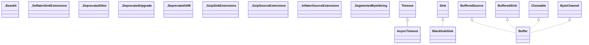

# okio-jvm-3.16.4.jar

[Group index](README.md) | [All archives](../README.md)

## Scope and provenance

- **Donor:** `SQX_145_REFERENCE_ROOT/internal/libs/okio-jvm-3.16.4.jar`.
- **SHA-256:** `2196b993cd34dbbd919e7e01f57a4781b58bee80f86106163e287c20343a96a7`; accessed 2026-10-06; captured `2026-10-06T18:54:51.906614+00:00`.
- **Classes:** 117 raw entries; 117 unique entry names. Duplicate occurrence indices are zero-based.
- **Inspection:** read-only ZIP hashing and class-file structural parsing; signatures/descriptors, modifiers, hierarchy and references only. Bytecode bodies are hashed, not published.
- **Allocation:** proposed `FEAT-HOST-OKIO-JVM`, P02; [roadmap](../../sqx-full-application-roadmap.md). Domain README registration remains required.
- **Repository:** `01067f00031428613c6394064ca1bcadc1ba00ee`; review state unreviewed. Download label 145-dev1; installed build/activation and runtime equivalence unverified.
- **Limit:** every class/member is inventoried; declaration coverage does not establish consumed calls, defaults, formulas, failure semantics or algorithm parity.
- **Archive/resource index:** [085.json](../../../evidence/sqx145/archives/145/085.json).

## Complete member declarations

Member shards contain exact JVM names/descriptors, access flags, generic signatures, throws types, declared fields/methods, superclass/interfaces and referenced class names. All classes, nested/synthetic members and overloads are retained. Code length/hash is structural evidence, not a normalized algorithm comparison.

- [001.json](../../../evidence/sqx145/members/085/001.json) — SHA-256 `2476bf06fa2c7ca16b4bc9c329a60028cf8cdeadfdb2c26f6a344687cb6f5bbe`.
- [002.json](../../../evidence/sqx145/members/085/002.json) — SHA-256 `251a4b5dcc649709353bb15dbb4ffb7f0a8c952b80d4774f7dcdc2ed9675391d`.

## Focused structural diagram

Up to twelve non-nested classes; arrows show declared inheritance/interfaces only. External type names are not evidence of an available body or an executed dependency.

## Class inventory

| Archive entry | Occurrence | Class SHA-256 | Fields | Methods |
| --- | ---: | --- | ---: | ---: |
| `okio/-Base64.class` | 0 | `5dc0daa7b9f6c279e146f054298da61878d522d262aaf7a609945bbe3501e6d1` | 2 | 6 |
| `okio/-DeflaterSinkExtensions.class` | 0 | `ae631869f1abcf35987fd2294473cf4c9302bca24ee0aca6bd17fe9cf507fa32` | 0 | 2 |
| `okio/-DeprecatedOkio.class` | 0 | `80fa7df43223affc7235870464300a56a4a4105f3a75b9b5484d1090c1ad7622` | 1 | 14 |
| `okio/-DeprecatedUpgrade.class` | 0 | `698ac6196db90c66e5f2cdabba6c2b2b0d77e7b26e3b04c3e42a0e8c6ef9de6f` | 2 | 3 |
| `okio/-DeprecatedUtf8.class` | 0 | `603aa98800d7ee77b05b9d4e968bb5f0c448c01ce292fbae6b74c55fc3d74062` | 1 | 4 |
| `okio/-GzipSinkExtensions.class` | 0 | `41feed794840b94143e2fc23793f61355a694b3ff4c543d97a429e40ec54f80c` | 0 | 1 |
| `okio/-GzipSourceExtensions.class` | 0 | `682253983982de6596ad279d148405cce24a89784939e52a256fcf9c81ee0bdd` | 8 | 2 |
| `okio/-InflaterSourceExtensions.class` | 0 | `c48a98539c5e2211fffb32a3db266e2b8e6607116a092eab432d77648d3d993b` | 0 | 2 |
| `okio/-SegmentedByteString.class` | 0 | `d3f42bb4b6bfa95672032e6323040f51abaaf417c2c6989955f68103d5cfb86a` | 2 | 24 |
| `okio/AsyncTimeout$Companion.class` | 0 | `e365328e7b2b4be845565c7745b845f245d89adf369c575909a87c6ffd2a2275` | 0 | 10 |
| `okio/AsyncTimeout$Watchdog.class` | 0 | `de85ba628180b7f944a9c3b6e4b4eca30e54402db2fa9438e719e8d891589a54` | 0 | 2 |
| `okio/AsyncTimeout$sink$1.class` | 0 | `50cfa868698493dc51fc9de6b7865c75c27bc1d839ff5d24d8424fd5ae6baa12` | 2 | 7 |
| `okio/AsyncTimeout$source$1.class` | 0 | `090304c2149b01d167d37660ffb7908ef60694af1acd45f0889ef8820f7587c2` | 2 | 6 |
| `okio/AsyncTimeout.class` | 0 | `428b24b73717b52260b94227f40f605d2f2845334e794161ec63bd69dd2ff0bf` | 15 | 24 |
| `okio/BlackholeSink.class` | 0 | `fb585324aa6e2ec85d9b3dc47bce42adf654c4d8f8b007c0d554448eb2282ea0` | 0 | 5 |
| `okio/Buffer$UnsafeCursor.class` | 0 | `44f266348bc816ae0718fbaa8084638704054a09b8da9886087439c2c39e5563` | 7 | 8 |
| `okio/Buffer$inputStream$1.class` | 0 | `17cc0b4a9e29166c09ce3b18348a796f7aa9ac1e2160b25fe7ec0d2cd04dd598` | 1 | 6 |
| `okio/Buffer$outputStream$1.class` | 0 | `5efb99b1f613a7f47ce9f148be93751bba97bc3cc5cf1e01d824716c07d69bd1` | 1 | 6 |
| `okio/Buffer.class` | 0 | `d526459e54ec035f0350e654a11b52f6b851d675ed47caf2458b3b4d905ea9a3` | 2 | 144 |
| `okio/BufferedSink.class` | 0 | `cf6652a86b635691bef28874577899418feb63bcfa33470254c81b8d5be1d0b0` | 0 | 26 |
| `okio/BufferedSource.class` | 0 | `be3737cb612a55e0bd4c3981a27977f145b3344cb96639b1df51aef94c39ac69` | 0 | 46 |
| `okio/ByteString$Companion.class` | 0 | `7651762629706048773597e98045a86859d96fb21d53500c57ceb532304a7461` | 0 | 19 |
| `okio/ByteString.class` | 0 | `d55ff57407185afa7c57add65f291cd300eb851158cb56e58842ed9602166ea1` | 6 | 73 |
| `okio/CipherSink.class` | 0 | `a31e7bec80956742ac1520016240c8e0d19d38badef3945509d07e5600532325` | 4 | 8 |
| `okio/CipherSource.class` | 0 | `390de294e3659061c432210b468da0cfe14108c7588522ea8849d485c8522b66` | 6 | 8 |
| `okio/DeflaterSink.class` | 0 | `89f0abadd30bcc5820203f627ad02bd3f89956ff01ed10cb53362c8554cfcd12` | 3 | 9 |
| `okio/ExperimentalFileSystem.class` | 0 | `d626183b0d59778291216028a5cd9db1a8574316872ef517d70f23f9f6e15054` | 0 | 0 |
| `okio/FileHandle$FileHandleSink.class` | 0 | `627977af5aceb043a69fc4033b37936133e40cce8e82ac1107f494ff45f6b135` | 3 | 10 |
| `okio/FileHandle$FileHandleSource.class` | 0 | `4b95f29721b906fd2fff6e1c36598e95b8bddb31ac60df51e6ff40326f5f3d32` | 3 | 9 |
| `okio/FileHandle.class` | 0 | `1384652e133c24541744b8a6a66cdcb35887f78dcba97742ca95d1cb5619a73c` | 4 | 33 |
| `okio/FileMetadata.class` | 0 | `62b72e76f3b9e4f514aefd842d742f8d7bc8bc6c57d620c115105d5b6c080b79` | 8 | 15 |
| `okio/FileSystem$Companion.class` | 0 | `5ab4b44cd1996cbafe8870cff222faa2c545099d3967d2f04e987c003fc7e9c6` | 0 | 3 |
| `okio/FileSystem.class` | 0 | `3471432fa757a0dddeb36adb9aad7e2dc31e65f2209a24cc73513deb59a7aa57` | 4 | 42 |
| `okio/ForwardingFileSystem.class` | 0 | `9c34b86f4dea7ddc08558a9b224c9e5bcb169c808fac992325c71329625f05e3` | 1 | 21 |
| `okio/ForwardingSink.class` | 0 | `70f98cb453b3fa79c82c84aba6876c7317c74b8d5e9fa39ce39218442b7d30b9` | 1 | 8 |
| `okio/ForwardingSource.class` | 0 | `1224159c366a652cb6caeab429cb1e48091474e614f72c7c756849c8b8295aba` | 1 | 7 |
| `okio/ForwardingTimeout.class` | 0 | `df64f331671935e603f724aee4011a9ba95645efac56074850f48202af3f4c37` | 1 | 15 |
| `okio/GzipSink.class` | 0 | `3dd18c6d4dcd079cb5d118fbca0f502106f7c14342ac870f25af5d22a222ed5d` | 5 | 9 |
| `okio/GzipSource.class` | 0 | `23e1de877852c7433bd4b6aa6ac1ef340769a08d30a570babebacce4872edc71` | 5 | 8 |
| `okio/HashingSink$Companion.class` | 0 | `4fdcf226e94579528134e3628192d02efdeb653bcb0c5039cebd736829362c23` | 0 | 9 |
| `okio/HashingSink.class` | 0 | `885436064b150cd776729dd5c4c149cb080d0208aebce84f0ddbe441776f8979` | 3 | 15 |
| `okio/HashingSource$Companion.class` | 0 | `cd1e7747b5184089ed71e8fe996881962729ab13b53ad96c2bf2ffc21c2235a6` | 0 | 9 |
| `okio/HashingSource.class` | 0 | `37c0055311391c93969fd2ede9c0669481582be61caed51f07aef872302ce0a4` | 3 | 15 |
| `okio/InflaterSource.class` | 0 | `e8cf0b870ee7fc8bf23a9fefebdcc8fe2ea96f7866fa2c8564ef2b3e05fa4ac5` | 4 | 8 |
| `okio/InputStreamSource.class` | 0 | `a93a0bb3a3470423769a547a9005e70c5682793c887e71481e7f468349e92ce8` | 2 | 5 |
| `okio/JvmFileHandle.class` | 0 | `e0f8d82fb828b90c7a9047f5adbb237f24c533da59467c938b9a82a2e952c14b` | 1 | 7 |
| `okio/JvmSystemFileSystem.class` | 0 | `2d2fe85360296741770435c38bc9eaf3b177d3562d38e37bbd847bd4039ce86e` | 0 | 18 |
| `okio/NioFileSystemFileHandle.class` | 0 | `9b62ba6b7b81f89d7926ce2a260da48f7b190de0db1f27bc1a8fe29eb1689e13` | 1 | 7 |
| `okio/NioFileSystemWrappingFileSystem.class` | 0 | `98d0e320a0745b0a03609afec546fb6484f046ec297ef63241e3edc77c07d61b` | 1 | 18 |
| `okio/NioSystemFileSystem.class` | 0 | `06bdfd7494f75b42bb087d844abb62e402f0ec79523874c3ffb289c9a522658b` | 0 | 7 |
| `okio/Okio.class` | 0 | `bdca9ec2ba90f8c34fb2eaf2f71590d4af4aa4d58038fd34e026a0b8cfb1414e` | 0 | 25 |
| `okio/Okio__JvmOkioKt.class` | 0 | `f6d494fc052e3139afe3dd5d45960411d65a17947d44099e19b4653dd78c6f34` | 0 | 20 |
| `okio/Okio__OkioKt.class` | 0 | `edef277887db7759efb60fe2abe76f29eea877244172576ec617d7627e6271a4` | 0 | 4 |
| `okio/Okio__ZlibOkioKt.class` | 0 | `c488389bf035ca6fd9287d2c7863e763658c1b9b8b4750f521c37817219ef2ae` | 0 | 1 |
| `okio/Options$Companion.class` | 0 | `e140c6b3caae67534d417eb31eb5a7a299c196de9c8d1e8f5ff92288ed300594` | 0 | 6 |
| `okio/Options.class` | 0 | `5d2da84a0b0fd9a2a681a855ac50f6eed33a1619c36739a55634fdbea64fc4b1` | 3 | 15 |
| `okio/OutputStreamSink.class` | 0 | `ed5e6e8bac0361929414b5965f806e1f55d4e9bcd960c22a4f9df2ff1f6d015c` | 2 | 6 |
| `okio/Path$Companion.class` | 0 | `58c2513af11891b720e9984d8c27643cadaa86e0731f979b5881479a764525a7` | 0 | 11 |
| `okio/Path.class` | 0 | `a848b9ca1e900839ceee2c443acfdaf564d6bae8ad026c03e163fdd6d08200d7` | 3 | 37 |
| `okio/PeekSource.class` | 0 | `025313adbed7ea3f75484e6c58d882625b611be53c398eb103da38d53e51633b` | 6 | 4 |
| `okio/Pipe$sink$1.class` | 0 | `f5a2760e91989b4ce20e9ca55c6d9aecf78ca7017edeefc89a54e7339eda3798` | 2 | 5 |
| `okio/Pipe$source$1.class` | 0 | `c57ac25f334ec7d85ca44d2ac52e3a7981ba730b76b90bc17ccc2466ca698734` | 2 | 4 |
| `okio/Pipe.class` | 0 | `10dc1eec1b26119bcecf0e40a27605822278facacd9f9f5ae7487be9674d8b11` | 10 | 20 |
| `okio/PriorityQueue.class` | 0 | `9fa3148440ae47d512771a2c761e2c5aa413c8dbbd1ee78f98757ce2e557f10c` | 2 | 7 |
| `okio/RealBufferedSink$outputStream$1.class` | 0 | `e63df1c8193bc205dd0f8199c8b2fa69f713ee00df770dd23bb26fbf83e27718` | 1 | 6 |
| `okio/RealBufferedSink.class` | 0 | `95ee0cefbde932b205999f2c4149dd9309b5296e14e2292a02f16316ea700316` | 3 | 34 |
| `okio/RealBufferedSource$inputStream$1.class` | 0 | `5992c05bbcfd0917b359e77ff45be113b239a753df7ea65e3ee1295cdd44fa03` | 1 | 7 |
| `okio/RealBufferedSource.class` | 0 | `22666b1b367ea44f73fe86ad7657ce6a421583e502f562ef52dbf61b812b00c0` | 3 | 54 |
| `okio/Segment$Companion.class` | 0 | `623110a2393a756d368268db5cc539bdc6df2c15e9ee4ac2eb640aefe05c6047` | 0 | 2 |
| `okio/Segment.class` | 0 | `b60439a3d43ef3c13c21f7523bdb002fc348014fe8cc427bf6c52916c1799d83` | 10 | 10 |
| `okio/SegmentPool.class` | 0 | `a37ea3b7b796a206d2c9e12079ab2dad09459a50928e9e6eaac088250b81a023` | 5 | 7 |
| `okio/SegmentedByteString.class` | 0 | `8c0016ab530356d4778c242b4c4d2e534a5f7d08be3b4850269c2b956e31f1e1` | 2 | 29 |
| `okio/Sink.class` | 0 | `f9a83594f010f3888a97798d206b0bf19ee87a60395d4b5b656de18cbf1591fa` | 0 | 4 |
| `okio/Socket.class` | 0 | `226aded66b254423604223c2d1597bfcbc273c9d95f69dc3bbb6dd80858a3ef9` | 0 | 3 |
| `okio/Source.class` | 0 | `7e4f4ad163c93ca0c2ea6c4a12b4cd968f8d08be0c9725a432f5401476da9fa6` | 0 | 3 |
| `okio/SystemFileSystem.class` | 0 | `fa048f1b42335286b5d9db80dbf747bb430c9f10c1a85bf711d956ea7049840f` | 0 | 2 |
| `okio/Throttler$sink$1.class` | 0 | `ace127226de7cf8b892d0d48d23be2c4ad59e5e8c3d3720fe318cb57f7fa4cb7` | 1 | 2 |
| `okio/Throttler$source$1.class` | 0 | `bfed2e69cd8a4f82fd2fba93863e4efc1504f3e3f7f4db05d3d666510dfc035a` | 1 | 2 |
| `okio/Throttler.class` | 0 | `8573d1fbd0a1461d4f2f588fe0f211ff97bc60892d03aaf5b5561d76096f41ce` | 6 | 14 |
| `okio/Timeout$Companion$NONE$1.class` | 0 | `99d762398cfe60d3b6bd9175402ac4add71ec8999218faa7d78ace73de26ebbc` | 0 | 4 |
| `okio/Timeout$Companion.class` | 0 | `a86370d3be22a788aeb8e8ca9e75cb426a3b6c851eee4c39588ab25fe8055661` | 0 | 5 |
| `okio/Timeout.class` | 0 | `e4fd89a112af6b2d915798e18ea07442bfc76d1d409efec970309a961cec8f92` | 6 | 15 |
| `okio/TypedOptions$Companion.class` | 0 | `b9c8d69b407294e2bb93718d36dce6c108f6c66c07ddded7833cd0ede6f524e3` | 0 | 3 |
| `okio/TypedOptions.class` | 0 | `caffdcd1d79ae496170d578b7d720663cebfb82e4e0c97dc76d5f6fb8eba0bf0` | 3 | 7 |
| `okio/Utf8.class` | 0 | `779475cdd2cd43baf777178aee95a420adac1832316774b9de4053b1f0ab82a1` | 8 | 12 |
| `okio/ZipFileSystem$Companion.class` | 0 | `694e8a6142e926c039058a3719c8ef2e3d350c7b24dfdd2fdcd16c3778f72492` | 0 | 3 |
| `okio/ZipFileSystem.class` | 0 | `5258b917a51d7e53789c5d3c8bf024a03f88642089c2e1baae2b4bd43754c25d` | 6 | 18 |
| `okio/_JvmPlatformKt.class` | 0 | `e0a7a395d26531f0973c8301eb7834bab6861af2ee7f7e84a345593975994f47` | 0 | 4 |
| `okio/internal/-Buffer.class` | 0 | `dd4e2cacb1eaad9210b02eb7eb34e0d31c8879ec4f07b5e633e0a6a8853d7ee3` | 5 | 68 |
| `okio/internal/-BufferedSource.class` | 0 | `ca116bca16cdacfa812bd193f7b49a3e3ce46aef0e00cf98a2484ab179caca33` | 0 | 1 |
| `okio/internal/-ByteString.class` | 0 | `eca8fb05a03307472268eda273a39224d65ab83f605615435fc45a5638382a19` | 1 | 34 |
| `okio/internal/-ByteStringNonJs.class` | 0 | `b9ab0dd316bccb562d537a086c0ec526b84e78a728640e40e46e897b9036a26f` | 0 | 3 |
| `okio/internal/-FileSystem$collectRecursively$1.class` | 0 | `3ee6fa5f703f5a443689b8dffc233ccdf39d35bdc10b41d8c8635352fc61bd4f` | 13 | 2 |
| `okio/internal/-FileSystem$commonDeleteRecursively$sequence$1.class` | 0 | `6f0f4dd5968ef760a75835787962d938984c708652927ce15d16c08fe0c790af` | 4 | 5 |
| `okio/internal/-FileSystem$commonListRecursively$1.class` | 0 | `360f1e1744cd89de723d9d5ce6b379680b47c2fd5e4436b35e54e19fabf1c2bb` | 8 | 5 |
| `okio/internal/-FileSystem.class` | 0 | `3831da8b425ed0fb4b8458e4e0844509a3c7badf96d87fbf4148a44fc31ea4a2` | 0 | 8 |
| `okio/internal/-Path.class` | 0 | `76a0cf6509745aa5365b107c0393d53df137f12f712e89d6858a1847f30af0e3` | 5 | 39 |
| `okio/internal/-RealBufferedSink.class` | 0 | `b2fc25ebee166e3e9d9b0cc3adb19e24aae2434c140a962320befbe00b6e2ea5` | 0 | 25 |
| `okio/internal/-RealBufferedSource.class` | 0 | `dbfe7c9ee61ad2d87777f3d65ae2941457b936a38225c26b348408aae02cbc30` | 0 | 38 |
| `okio/internal/-SegmentedByteString.class` | 0 | `8418106ad1a0c865c6741f63c7ca25b898f4665edba841b40d6d5f7a8cbcfde1` | 0 | 14 |
| `okio/internal/DefaultSocket$SocketSink.class` | 0 | `07fab02adc0a665ac1c9fb30d4299791b5dc806ce2cb5827ec8abf852f727db0` | 3 | 7 |
| `okio/internal/DefaultSocket$SocketSource.class` | 0 | `06b49f9f4f6be2f547e342f173f4c76f3cca0180ea2203f6ddfd85e0d1958d4f` | 3 | 6 |
| `okio/internal/DefaultSocket.class` | 0 | `aa814f03d0d5aeb586defdcc4fbb18912d0dbdde77318591972e17f86491b800` | 4 | 7 |
| `okio/internal/DefaultSocketKt.class` | 0 | `3d22d2c60d78885726dfd32cfa49665ddac931a19637f2ecba4f050e0c4cedaf` | 3 | 0 |
| `okio/internal/EocdRecord.class` | 0 | `8c9db8dda31d0171b51f0d923dbaec754e970256db66b83335790159c048bb28` | 3 | 4 |
| `okio/internal/FixedLengthSource.class` | 0 | `9de5198b14ee1799fc0f172a74323b3953bcc6bab7b90c2aad253de5908e83b9` | 3 | 3 |
| `okio/internal/PipeSocket.class` | 0 | `23185370f8eeb1c58f02c07169af1970b14ab3764fd275393931c8d6037cf527` | 2 | 6 |
| `okio/internal/ResourceFileSystem$Companion.class` | 0 | `48348665c9f5e3f8c569a6c3f432e97f24748f160e7397e1b02b168f0e3d533c` | 0 | 6 |
| `okio/internal/ResourceFileSystem.class` | 0 | `43c2a722dc580bfd88b8a20cebc1234b4efa46b78d4d1394234abab29eb49868` | 5 | 25 |
| `okio/internal/SocketAsyncTimeout.class` | 0 | `73d7eee713430bd25049b0c7fd723a79f7184d704abf01a0a3fd2b56613d91c8` | 1 | 3 |
| `okio/internal/ZipEntry.class` | 0 | `1097ce1c16e04fb8ac2d19946164b145af7313619d7e056d7480bda3fa5e3853` | 17 | 23 |
| `okio/internal/ZipFilesKt$buildIndex$$inlined$sortedBy$1.class` | 0 | `a450dfae41be938cae03e4d57c066b6e32dfd1a07a17cfbc76ec7ba3f29b3dc1` | 0 | 2 |
| `okio/internal/ZipFilesKt.class` | 0 | `06aa4f7ba3cc51bdaadaa5c938777d904e2c79dc72e39da8bd587f3dfe615e78` | 13 | 17 |
| `okio/internal/_AtomicKt.class` | 0 | `45e92345ae1f33ec5b4f94eea6453948ab7a8a6238abe0b56d69c2268052a4f6` | 0 | 1 |
| `okio/internal/_JavaIoKt.class` | 0 | `c3d879cc86f2a40850d592ddd080e34aab24674606c819359b2a6b87b5f39f15` | 1 | 3 |
| `okio/internal/_Utf8Kt.class` | 0 | `22c764450839d663d31fba1dc5ae82ffd6f4328e0adf02d359f626967883c296` | 0 | 3 |
| `okio/internal/_ZlibJvmKt.class` | 0 | `3f6ac53071096655de1f59d955f0d5826935e00f139d6cfa8648a1760a23eab6` | 2 | 4 |
