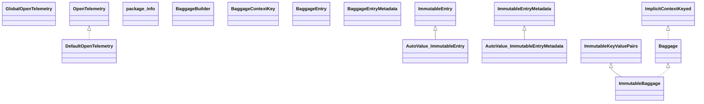

# opentelemetry-api-1.61.0.jar

[Group index](README.md) | [All archives](../README.md)

## Scope and provenance

- **Donor:** `SQX_145_REFERENCE_ROOT/internal/libs/opentelemetry-api-1.61.0.jar`.
- **SHA-256:** `ff5d610db14da2881eaa8f543f3bd6578a306163d02675254ff0669286c89158`; accessed 2026-10-06; captured `2026-10-06T18:54:51.906614+00:00`.
- **Classes:** 172 raw entries; 172 unique entry names. Duplicate occurrence indices are zero-based.
- **Inspection:** read-only ZIP hashing and class-file structural parsing; signatures/descriptors, modifiers, hierarchy and references only. Bytecode bodies are hashed, not published.
- **Allocation:** proposed `FEAT-HOST-OPENTELEMETRY-API`, P01; [roadmap](../../sqx-full-application-roadmap.md). Domain README registration remains required.
- **Repository:** `01067f00031428613c6394064ca1bcadc1ba00ee`; review state unreviewed. Download label 145-dev1; installed build/activation and runtime equivalence unverified.
- **Limit:** every class/member is inventoried; declaration coverage does not establish consumed calls, defaults, formulas, failure semantics or algorithm parity.
- **Archive/resource index:** [086.json](../../../evidence/sqx145/archives/145/086.json).

## Complete member declarations

Member shards contain exact JVM names/descriptors, access flags, generic signatures, throws types, declared fields/methods, superclass/interfaces and referenced class names. All classes, nested/synthetic members and overloads are retained. Code length/hash is structural evidence, not a normalized algorithm comparison.

- [001.json](../../../evidence/sqx145/members/086/001.json) — SHA-256 `e2444912796ff788bceea21acdc6b96a9ba85550351fb197092ea9e7142c2434`.
- [002.json](../../../evidence/sqx145/members/086/002.json) — SHA-256 `f023c79d38a32929f8d5194a412d190f6ff2e8980470c2ab1ff4fa960b488881`.
- [003.json](../../../evidence/sqx145/members/086/003.json) — SHA-256 `68b85997c6b431a7869be791c1c3162a943a29f3a67da3402509808fd14ebeea`.

## Focused structural diagram

Up to twelve non-nested classes; arrows show declared inheritance/interfaces only. External type names are not evidence of an available body or an executed dependency.

## Class inventory

| Archive entry | Occurrence | Class SHA-256 | Fields | Methods |
| --- | ---: | --- | ---: | ---: |
| `io/opentelemetry/api/DefaultOpenTelemetry.class` | 0 | `3c58b70385c50e7225ef7732a12ffc14db25e6bb8b9111788cf6ae5e0c5c5e02` | 2 | 8 |
| `io/opentelemetry/api/GlobalOpenTelemetry$ObfuscatedOpenTelemetry.class` | 0 | `24be421b72f2fa99dc0000103a90ab57c6c683d978a0dcd5f156de59713d84c9` | 1 | 6 |
| `io/opentelemetry/api/GlobalOpenTelemetry.class` | 0 | `ea0dd1b735d82bb51758dc5e4e4414b41544be8aba5e4267671d02c90636fcbf` | 5 | 18 |
| `io/opentelemetry/api/OpenTelemetry.class` | 0 | `42493331dedcfd88b97176c0287deb83dba8a94a9da44cb9f795fe84a9554436` | 0 | 11 |
| `io/opentelemetry/api/package-info.class` | 0 | `e0a9f812a8fcd2c2b49960e3899028c0171fac74f52171be5d273b40fd1460c0` | 0 | 0 |
| `io/opentelemetry/api/baggage/AutoValue_ImmutableEntry.class` | 0 | `7ad4e5ba16f29f990860c1a0cae0e7e76dfd4e8da7077191633d451a371545f3` | 2 | 6 |
| `io/opentelemetry/api/baggage/AutoValue_ImmutableEntryMetadata.class` | 0 | `366dc59f84eb952ac51745da592021544cd40319f9c95167d0def17da49ff2da` | 1 | 5 |
| `io/opentelemetry/api/baggage/Baggage.class` | 0 | `6617cd47f81e770df7f32e13e1491b24a220537268b7c14e06d685ba5d5d069a` | 0 | 14 |
| `io/opentelemetry/api/baggage/BaggageBuilder.class` | 0 | `0c6effb57241465f400311a8a9720f012576c60f69e2006fa50917cca508ea2e` | 0 | 4 |
| `io/opentelemetry/api/baggage/BaggageContextKey.class` | 0 | `42a44809aed512e1f4b6f2bbab4abf5af86ad6ff62f39955af0932ff8c0d3b80` | 1 | 2 |
| `io/opentelemetry/api/baggage/BaggageEntry.class` | 0 | `41ed2f98249ec16b1454bb5a4a729b323e93158584ab55fd28e56f1061c81341` | 0 | 2 |
| `io/opentelemetry/api/baggage/BaggageEntryMetadata.class` | 0 | `d2cc443081e8d36d9ef48371ef41f290660a6cf3011eb53e2b30ffb7d95bf9bf` | 0 | 3 |
| `io/opentelemetry/api/baggage/ImmutableBaggage$Builder.class` | 0 | `26f3e9abb8eb87b825e314b823022a0541187f9e1e73fb067fdc4b179ae11551` | 1 | 5 |
| `io/opentelemetry/api/baggage/ImmutableBaggage.class` | 0 | `b2300239b0a9cd595d3be440bfdeda5bc357afa2f8ca6de3577c26a2430d6301` | 1 | 9 |
| `io/opentelemetry/api/baggage/ImmutableEntry.class` | 0 | `73a5625d41a849c761e468f77c86ce4b3167784226b6b0e54d76c0b30d27aa4e` | 0 | 2 |
| `io/opentelemetry/api/baggage/ImmutableEntryMetadata.class` | 0 | `5cf44b4cfb59a531db096d5efc0350f264380c78a2a1f32300e0d2d8772e994d` | 1 | 4 |
| `io/opentelemetry/api/baggage/package-info.class` | 0 | `d7b07589831171bcd84bf3cfddf2ef213ffaa888586b9b2264d9b4b840e49736` | 0 | 0 |
| `io/opentelemetry/api/baggage/propagation/BaggageCodec.class` | 0 | `b960c1edfc212a232a41ab23c524b4b8ace9b33a9837b6fadf33bc1c13f2e92f` | 2 | 4 |
| `io/opentelemetry/api/baggage/propagation/Element.class` | 0 | `440f9ea5d7418811bb04556917cc3ef38437bd31b639fbfb4f3b771419cf36f9` | 9 | 15 |
| `io/opentelemetry/api/baggage/propagation/Parser$State.class` | 0 | `ff0bba41f77cc3fe23adf3c209b62f99b0515e1c0a4155d7ec358efa6407e938` | 4 | 5 |
| `io/opentelemetry/api/baggage/propagation/Parser.class` | 0 | `9208eccf1a4a51991e90d44a7e84631ae2020cf7b8da2d8f463732e0f229aaa3` | 7 | 6 |
| `io/opentelemetry/api/baggage/propagation/W3CBaggagePropagator.class` | 0 | `04664dc9a4b92d6286f1494a83ae481748ad67c02ed25d251f3aadaa53a9f790` | 4 | 15 |
| `io/opentelemetry/api/baggage/propagation/package-info.class` | 0 | `0187db1f7defb283464c0f2288912cdfdd1fc13a76dc021e6a18f379a3f46550` | 0 | 0 |
| `io/opentelemetry/api/common/ArrayBackedAttributes$1.class` | 0 | `9e0546338680eaa4eab8c3d633a9e0d96aeb187df91ba37fef9cfdf4ac7fef0a` | 1 | 1 |
| `io/opentelemetry/api/common/ArrayBackedAttributes.class` | 0 | `7c5204a0abff4a478f2755a688a94c0fb31cdb9aba32ce6bf0cd602337168553` | 2 | 11 |
| `io/opentelemetry/api/common/ArrayBackedAttributesBuilder$1.class` | 0 | `e23cba609f482e95463f0caefdbc57cb20a3b889d68f37792651387a6c8fa8ac` | 2 | 1 |
| `io/opentelemetry/api/common/ArrayBackedAttributesBuilder.class` | 0 | `a707303bcaa1224b2396f511d432a89d92693cca1d6dc0ecbb805731da8ac266` | 1 | 15 |
| `io/opentelemetry/api/common/AttributeKey.class` | 0 | `b1ee13e0f8ddfb1b42bcfba30bf80779a6be3794123f80b57ad25e3eb7d02640` | 0 | 11 |
| `io/opentelemetry/api/common/AttributeType.class` | 0 | `124204313ec130497d4477480ad8b3cb9394727ecde5288347bf78c622adb1bf` | 10 | 5 |
| `io/opentelemetry/api/common/Attributes.class` | 0 | `8c7b0cd41d99f4aa486f95d3d7ff15f4c2470bce842d5d6537320d5c73c272d2` | 0 | 14 |
| `io/opentelemetry/api/common/AttributesBuilder.class` | 0 | `436b8d0dcf4a7c8017214875465f544cef02a1a9fa5d6f23639a93db48262b89` | 0 | 16 |
| `io/opentelemetry/api/common/AutoValue_KeyValueImpl.class` | 0 | `12aa2616666e31690a639d6c3bc313c9a4b9c4a76cb0fba9c9d4c8c49a0da5bc` | 2 | 6 |
| `io/opentelemetry/api/common/Empty.class` | 0 | `6c9f82352a917c9f7264d5fa72024e48d858d582a4bbdf8ce5aaf7afd288d605` | 1 | 6 |
| `io/opentelemetry/api/common/JsonEncoding$1.class` | 0 | `bfbf35db795ffa2e321416c29bdb36dcee54ac798c82dbb13da4f0a09b6e4419` | 1 | 1 |
| `io/opentelemetry/api/common/JsonEncoding.class` | 0 | `667eb85ffc53e412fbd6f14dcba09c1ae9edb619f7c03f42c2e1879f3d01053d` | 1 | 8 |
| `io/opentelemetry/api/common/KeyValue.class` | 0 | `af5f2343f336cef43a29e6c7715e38a5fd87a8f08d837749f6bbc80c766578db` | 0 | 3 |
| `io/opentelemetry/api/common/KeyValueImpl.class` | 0 | `0bff0ed7701197a3b54a688ab6878f0db392e0bd10daeef10233bbc83e525e69` | 0 | 2 |
| `io/opentelemetry/api/common/KeyValueList.class` | 0 | `d3b025ff8597f95283edf4559f1d81a45657dacc8fe8aac3fd1f9677e4c512b5` | 1 | 12 |
| `io/opentelemetry/api/common/Value.class` | 0 | `8cff586b72dca96ceb3b4d5a4b0e283162561132fd9aa8019cbcde0ec5a33e18` | 0 | 13 |
| `io/opentelemetry/api/common/ValueArray.class` | 0 | `3ca3d62ab0253e7c03d107119e0207556b80ff91935d3f618e1e695e274924a8` | 1 | 10 |
| `io/opentelemetry/api/common/ValueBoolean.class` | 0 | `24f5762a540178d2633db6d0e3ef9a4e30364795197f2cff555eba9a36ff7715` | 1 | 9 |
| `io/opentelemetry/api/common/ValueBytes.class` | 0 | `ae25ac105d1505389a9e02fd6869d38b0e4e0d39bb2138a572008b73dfc1aa11` | 1 | 9 |
| `io/opentelemetry/api/common/ValueDouble.class` | 0 | `8f50225dbb18873121e99067e14016343cef38d944f17a61ddce227736a92eae` | 1 | 9 |
| `io/opentelemetry/api/common/ValueEmpty.class` | 0 | `761ed8c73f17940e05c15352f279281905032ed8af4caa803a4ccdcfe84580fa` | 1 | 10 |
| `io/opentelemetry/api/common/ValueLong.class` | 0 | `b42149e75e0635e88786cd7d3e7e7985ec09b340205836939e8b619100ff6cca` | 1 | 9 |
| `io/opentelemetry/api/common/ValueString.class` | 0 | `37c8b1765052b73b063cba9f702bba4bb7c00f86939fbd6ec51a10d30cac1a46` | 1 | 9 |
| `io/opentelemetry/api/common/ValueType.class` | 0 | `3aeaa12c3140ff2b812dc31be122be670ff80aadfd5e03807f979a917cb6ff2c` | 9 | 5 |
| `io/opentelemetry/api/common/package-info.class` | 0 | `1a5263d3b744784144bfaabd4594518ccd04b8fa80c8c6c4c26d54406fcfa0d9` | 0 | 0 |
| `io/opentelemetry/api/internal/ApiUsageLogger.class` | 0 | `36237b382cbad740589230442d3c7594a77042eeb5f383fa233481fc05dc5d51` | 1 | 4 |
| `io/opentelemetry/api/internal/AutoValue_ImmutableSpanContext.class` | 0 | `d8a4814efedb846f4dc22deb20869b5441dc9604d7adb9b6259efb963107bda2` | 6 | 10 |
| `io/opentelemetry/api/internal/ConfigUtil.class` | 0 | `35146f9b085908922aa23f01c720b2812651a8e9b2b00df943114afaba12fffd` | 0 | 9 |
| `io/opentelemetry/api/internal/Contract.class` | 0 | `583cea70d917b5144ef6d949d7b51e14f6b83a9e00480a66958117b58cc7576b` | 0 | 1 |
| `io/opentelemetry/api/internal/GuardedBy.class` | 0 | `7dc8b40eed72a231c0ac0012a2c15cb84f08974e5bdc856eaec16f686178137b` | 0 | 1 |
| `io/opentelemetry/api/internal/ImmutableKeyValuePairs.class` | 0 | `b6bd8c5b7e4d54bbc8c7773d42922aecc318223fa5fcd6deed5af126cbe24e9d` | 2 | 18 |
| `io/opentelemetry/api/internal/ImmutableSpanContext.class` | 0 | `658247a9b1099ef81ca278979a9da09da8632a90e48ab14af198cf634979f1e6` | 1 | 5 |
| `io/opentelemetry/api/internal/IncubatingUtil.class` | 0 | `3ee48d5a3125e634346b4c480576ae53def41cf3ad67b0c5f23bbe0f3400ab9d` | 0 | 3 |
| `io/opentelemetry/api/internal/InstrumentationUtil.class` | 0 | `ec884bd2d3f76dd22e263da57d66eb50671e2ee5c69a0e5a0783d3e912f886cf` | 1 | 4 |
| `io/opentelemetry/api/internal/InternalAttributeKeyImpl.class` | 0 | `1fd8bb56f84a08bdd1f9d64b61b660c7ced5c78b4ce0fb7abd57e585c8c68f9e` | 4 | 10 |
| `io/opentelemetry/api/internal/OtelEncodingUtils.class` | 0 | `698493574e4a122a106af4267f110ad4b896b569de8c7e8cd877a57c5c2ea771` | 8 | 14 |
| `io/opentelemetry/api/internal/PercentEscaper.class` | 0 | `53f17587ca325dcc22fc76950b45e8b6f42f4dd45a11ea3acd5ed96c679f15f2` | 4 | 10 |
| `io/opentelemetry/api/internal/ReadOnlyArrayMap$EntrySetView.class` | 0 | `2393a815e7fb6164a66803bca517021fec3825636201922f420de8efdb716651` | 1 | 4 |
| `io/opentelemetry/api/internal/ReadOnlyArrayMap$KeySetView.class` | 0 | `f9c32eaa17d29ae6ad75da5feb95ce7eae08885ba6074fd3cd93220a124d2947` | 1 | 3 |
| `io/opentelemetry/api/internal/ReadOnlyArrayMap$SetView$ReadOnlyIterator.class` | 0 | `1810bd0b3a3314a07878be1d057a5d2318bba51b2a6230a3de2a3e47f2d56b42` | 2 | 4 |
| `io/opentelemetry/api/internal/ReadOnlyArrayMap$SetView.class` | 0 | `35062460c7c774f325bad4875b1fa89afd61f07b569d3d097ec4bd34c45d9db6` | 1 | 15 |
| `io/opentelemetry/api/internal/ReadOnlyArrayMap$ValuesView.class` | 0 | `20d27bc2982d0df60967839f18e09fdc8db24e90bfa6de9f9b187115dd5e5a86` | 1 | 3 |
| `io/opentelemetry/api/internal/ReadOnlyArrayMap.class` | 0 | `2f96bd6b61aa8a1079b29769c75032126d0a58b7f5b4facf5659995033e49e50` | 2 | 20 |
| `io/opentelemetry/api/internal/StringUtils.class` | 0 | `ad719e37d1c0061bcf40a2d555f6eb4bbe14cfb05a324f04a53db12eb19760f2` | 0 | 6 |
| `io/opentelemetry/api/internal/TemporaryBuffers.class` | 0 | `545cb3785029c5c82e0ab1536cab47b208e0c28a0044fa2be60de3dce0502290` | 1 | 4 |
| `io/opentelemetry/api/internal/Utils.class` | 0 | `2a157b9958a929235283c4e00fbfec08631222d46a9ca5b9359d91143cff19a9` | 0 | 2 |
| `io/opentelemetry/api/internal/package-info.class` | 0 | `bd79040c57cbf1d4186b02057a0e4601a1c4257b4cec00e1fa221f53cd0e776b` | 0 | 0 |
| `io/opentelemetry/api/logs/DefaultLogger$1.class` | 0 | `6781f3538c6097448b9e9052338fc0af5dc76cd0075472a49f9b8a72c93b1c53` | 0 | 0 |
| `io/opentelemetry/api/logs/DefaultLogger$NoopLogRecordBuilder.class` | 0 | `20943c254ae74e4e336905a02ecd6247a528d042efefb62bfea20808d63765e3` | 0 | 13 |
| `io/opentelemetry/api/logs/DefaultLogger.class` | 0 | `a899600dae4a663ee74f2977e3ef4e38fc2face39a322c0ea82640f6c6a20e7d` | 2 | 5 |
| `io/opentelemetry/api/logs/DefaultLoggerProvider$1.class` | 0 | `c1ae4e559a996c2f8f48675b441a411858f571e719c632302def75e796daa57f` | 0 | 0 |
| `io/opentelemetry/api/logs/DefaultLoggerProvider$NoopLoggerBuilder.class` | 0 | `6a675fe474d25e05d2e94f9f81b19ee98063286c1bf360c7329bf8275ecebf7c` | 0 | 5 |
| `io/opentelemetry/api/logs/DefaultLoggerProvider.class` | 0 | `f111c9edeedc5e02bd159bcc2425285245f784c2c005e2d8c0d1d1ba0ac33f4f` | 2 | 4 |
| `io/opentelemetry/api/logs/LogRecordBuilder.class` | 0 | `21ce4f8fb74637b1b4cf311f3b2d9c883a4a3be9bb86e502f7beb8a9c69ebb66` | 0 | 20 |
| `io/opentelemetry/api/logs/Logger.class` | 0 | `4104aa23e8e6452000366a2bc452d95f2ac1389a084233fb8ab896376b4979f5` | 0 | 3 |
| `io/opentelemetry/api/logs/LoggerBuilder.class` | 0 | `632c6c690455f9c5b56b271fb9dc384307e3cbb8cae57ecb26ee6443ce348e18` | 0 | 3 |
| `io/opentelemetry/api/logs/LoggerProvider.class` | 0 | `487ac2ed0972cb8f5acd612f8f265d078c1e21973a96c4c54b7c43339fe0dace` | 0 | 3 |
| `io/opentelemetry/api/logs/Severity.class` | 0 | `61f9b2ab9b99266c59568b036345aa791f4538d041227bee661ed899ff7dcd26` | 27 | 6 |
| `io/opentelemetry/api/logs/package-info.class` | 0 | `4367b863174a901eccf08aae603a9051bcfbbb1eef9055573b31d37d27102432` | 0 | 0 |
| `io/opentelemetry/api/metrics/BatchCallback.class` | 0 | `ce4f4e100e8b7f7638a9337dd108bb361fc436d1f2ced0fa986deb4f64d7502a` | 0 | 1 |
| `io/opentelemetry/api/metrics/DefaultMeter$1.class` | 0 | `0a84a6e714f7763513d7dbc65fbd5239da01423000c71bf88f1f8d90c8657709` | 0 | 1 |
| `io/opentelemetry/api/metrics/DefaultMeter$NoopDoubleCounter.class` | 0 | `001bb86282cb6bd05042e2ae5b9fe4e48e37b160d46a50d0bccdaae5f1bd9471` | 0 | 6 |
| `io/opentelemetry/api/metrics/DefaultMeter$NoopDoubleCounterBuilder$1.class` | 0 | `836562c3535ceb9078a98fa043f55d60965ed811183542d03cb05191d12b34c5` | 0 | 1 |
| `io/opentelemetry/api/metrics/DefaultMeter$NoopDoubleCounterBuilder.class` | 0 | `7eeeb45666146199a585fb3788acf96cfb32d5ee3b07f29f7553c857c8b6b797` | 2 | 8 |
| `io/opentelemetry/api/metrics/DefaultMeter$NoopDoubleGauge.class` | 0 | `4b0f693e6e77d59f13127fbd288f4dcf1f2d9bc2dbed105c11de2dc77bc080c3` | 0 | 6 |
| `io/opentelemetry/api/metrics/DefaultMeter$NoopDoubleGaugeBuilder$1.class` | 0 | `31639dd808183a944224bae6d1ec659da59c08200cf1206a64610b139a865666` | 0 | 1 |
| `io/opentelemetry/api/metrics/DefaultMeter$NoopDoubleGaugeBuilder.class` | 0 | `9b6ae2865ad8f7c78a4702c37532abf609e593c7a8683f72f0841399a98ca935` | 3 | 9 |
| `io/opentelemetry/api/metrics/DefaultMeter$NoopDoubleHistogram.class` | 0 | `93483707a14038410abb56f6ca27c9a95a5636ecb3cb02a8b67eefc87d42ae37` | 0 | 6 |
| `io/opentelemetry/api/metrics/DefaultMeter$NoopDoubleHistogramBuilder.class` | 0 | `07525d7910d31a7c82d48dfe04d044eac0f46eca7f12686232465c42e086a372` | 2 | 7 |
| `io/opentelemetry/api/metrics/DefaultMeter$NoopDoubleUpDownCounter.class` | 0 | `9313f9364ffb06c0fedcafc873adcb7d9750ed7c2bf45e7846705f67b7a6a41c` | 0 | 6 |
| `io/opentelemetry/api/metrics/DefaultMeter$NoopDoubleUpDownCounterBuilder$1.class` | 0 | `cc42910a76d5ceec6203fb5ab5b062d867685ef4627d818f7227d0150aebac25` | 0 | 1 |
| `io/opentelemetry/api/metrics/DefaultMeter$NoopDoubleUpDownCounterBuilder$2.class` | 0 | `0f4714add2c272d7785ee0171194b221180b16cba0bd1ac408804f01680c87fe` | 0 | 1 |
| `io/opentelemetry/api/metrics/DefaultMeter$NoopDoubleUpDownCounterBuilder.class` | 0 | `ddae613111f2880b44ca79089b55bdfad9fc76a9e7c864d354f0a38d92fcce29` | 2 | 8 |
| `io/opentelemetry/api/metrics/DefaultMeter$NoopLongCounter.class` | 0 | `6a19aac9c41b3f84b5741c6e820cc40461e5bed27c65bc516f8108cfa4b8e7c5` | 0 | 6 |
| `io/opentelemetry/api/metrics/DefaultMeter$NoopLongCounterBuilder$1.class` | 0 | `ee3fe463d6d93f11a15bb6e681ba347898c55d4c9c3591fb93e55f4a9c098c27` | 0 | 1 |
| `io/opentelemetry/api/metrics/DefaultMeter$NoopLongCounterBuilder.class` | 0 | `178f7e3974903a45bbd26718300e7942523faa78c315b52998774735238fc0bd` | 3 | 9 |
| `io/opentelemetry/api/metrics/DefaultMeter$NoopLongGauge.class` | 0 | `ee4179f86cf77756c265950e9228e3a9dae0e2ce3c12348d12bf34e6a2738d1b` | 0 | 6 |
| `io/opentelemetry/api/metrics/DefaultMeter$NoopLongGaugeBuilder$1.class` | 0 | `7b1c0c56c4bacfc8842396021dc51211a014eacf93fb9a4bfe3f54a9b6c31748` | 0 | 1 |
| `io/opentelemetry/api/metrics/DefaultMeter$NoopLongGaugeBuilder.class` | 0 | `1bc7200f362e1c09d92cb884f6f747441686ce67c7c4bf37943f0cee2052fe15` | 2 | 8 |
| `io/opentelemetry/api/metrics/DefaultMeter$NoopLongHistogram.class` | 0 | `9d0eb80995c577bb394255ca11f158b421458a45484a0339db8090b136c20d8b` | 0 | 6 |
| `io/opentelemetry/api/metrics/DefaultMeter$NoopLongHistogramBuilder.class` | 0 | `a9af69b99c259fcd8e1d5975224686e3074caf898417abde6ec77f2770ee1107` | 1 | 6 |
| `io/opentelemetry/api/metrics/DefaultMeter$NoopLongUpDownCounter.class` | 0 | `019aa70d702a90ec305d6b6c79c8e556b9fdf7cb25488d345f7722cf3baf54d7` | 0 | 6 |
| `io/opentelemetry/api/metrics/DefaultMeter$NoopLongUpDownCounterBuilder$1.class` | 0 | `bfac6722f6cad5ce438a7a0a49678810eb43d0e4fd50019d00ecce225d48da92` | 0 | 1 |
| `io/opentelemetry/api/metrics/DefaultMeter$NoopLongUpDownCounterBuilder$2.class` | 0 | `2cdb06e204f9f61011283c9499520c4cf1f515734d216dbee546dcacccee8e48` | 0 | 1 |
| `io/opentelemetry/api/metrics/DefaultMeter$NoopLongUpDownCounterBuilder.class` | 0 | `ce9a16b8c0460db89db5cc9dbbf7738126fed7b9f15c44359992b0e85d20e8e3` | 3 | 9 |
| `io/opentelemetry/api/metrics/DefaultMeter$NoopObservableDoubleMeasurement.class` | 0 | `ce83a401352aa32a24e939adfedd341ba0682073a8555dec63f3ac20159eaad8` | 0 | 4 |
| `io/opentelemetry/api/metrics/DefaultMeter$NoopObservableLongMeasurement.class` | 0 | `ac834c80119c1f92ac818618934c01fafe1b402469d15d225532b0c914ec657f` | 0 | 4 |
| `io/opentelemetry/api/metrics/DefaultMeter.class` | 0 | `06a792a0386b2bd654b463a248fe19e0a8156fc3646324708a68d199b191a00d` | 8 | 10 |
| `io/opentelemetry/api/metrics/DefaultMeterProvider$1.class` | 0 | `7e9a5eaca988486bc78bc10749007bd27ef819bf3089596bf7aade24c732d74b` | 0 | 0 |
| `io/opentelemetry/api/metrics/DefaultMeterProvider$NoopMeterBuilder.class` | 0 | `91de2de4d3f6d99cd247865610d4e10c216d43d9023ea4a10e59d8e526c7dfb8` | 0 | 5 |
| `io/opentelemetry/api/metrics/DefaultMeterProvider.class` | 0 | `e443a01d640f6c207d651a081d9cf896261dd2a606588b5b310f8db9e82137de` | 2 | 4 |
| `io/opentelemetry/api/metrics/DoubleCounter.class` | 0 | `66685d1d3b225b889401b60ceaed3081af5f0ccb8c6d620dc46b837e26a26c2f` | 0 | 4 |
| `io/opentelemetry/api/metrics/DoubleCounterBuilder.class` | 0 | `934800d63780c66b50bb66570ac1b96fa0c977e035f2423a5df96fa51739c9ea` | 0 | 5 |
| `io/opentelemetry/api/metrics/DoubleGauge.class` | 0 | `3adb83890bd41c59ba69496b1b3339098decdc50ea74952b14a25de83b978312` | 0 | 4 |
| `io/opentelemetry/api/metrics/DoubleGaugeBuilder.class` | 0 | `b093934c1ea7161c5a597b2e43996a627fa1abf588478161c309e49c4a9ab962` | 0 | 6 |
| `io/opentelemetry/api/metrics/DoubleHistogram.class` | 0 | `46c3519e3dc7d436dc7121c59f7dceacf1a071206d5ec1f56f4e2613b9da27d6` | 0 | 4 |
| `io/opentelemetry/api/metrics/DoubleHistogramBuilder.class` | 0 | `d27d50fff46da388b7858d5c2de6a5802b9a2ef101675c430be4edc63a7ee33c` | 0 | 5 |
| `io/opentelemetry/api/metrics/DoubleUpDownCounter.class` | 0 | `e25a0aeaf61bd2b5a6dfdaf88db658ccc25fb8b62bd5a019de476c1f1cf89b5c` | 0 | 4 |
| `io/opentelemetry/api/metrics/DoubleUpDownCounterBuilder.class` | 0 | `2c5bc6f39d6eb700ec5f1c42ad46a0acb98922b9d25dcf7731c03ebc45905207` | 0 | 5 |
| `io/opentelemetry/api/metrics/LongCounter.class` | 0 | `69e4d384d7024a37184cf3896d9c3097c8394ecd61a47d92d5fdd507a65a7887` | 0 | 4 |
| `io/opentelemetry/api/metrics/LongCounterBuilder.class` | 0 | `eb4d24df2383db40b82cfbc0bb82d5dbde4c325db2eb51a321229e3de8d0bbee` | 0 | 6 |
| `io/opentelemetry/api/metrics/LongGauge.class` | 0 | `d68307b06eee42b725feb33daf83e78cd62da254f2e658522a2a72daf841a999` | 0 | 4 |
| `io/opentelemetry/api/metrics/LongGaugeBuilder.class` | 0 | `3e3f5f2ee605e175710c9d3b21666e42d1be56a79b00dc3a26a9f14048f80b02` | 0 | 5 |
| `io/opentelemetry/api/metrics/LongHistogram.class` | 0 | `5b6ec12054f2f7c21df219ed1502e0aa8198621157188a8441b14668f10fabbe` | 0 | 4 |
| `io/opentelemetry/api/metrics/LongHistogramBuilder.class` | 0 | `3fb6a212ec50f87f6cad6e971cdc4d59886283b0a4a72695da4a570ae52f71a0` | 0 | 4 |
| `io/opentelemetry/api/metrics/LongUpDownCounter.class` | 0 | `aafc958dfc6d58d5973f84c4b0daf9b6b46405b11faf40594fd2482d2950f67e` | 0 | 4 |
| `io/opentelemetry/api/metrics/LongUpDownCounterBuilder.class` | 0 | `f05185c58130fa668c19c2f685a3d1f494af46d8fc55529ea6a6a14e600e357e` | 0 | 6 |
| `io/opentelemetry/api/metrics/Meter.class` | 0 | `1ffd9ac7f8d0f0aecd29de084d8cdbf3cf6730d071917040999c7ce366c023ef` | 0 | 5 |
| `io/opentelemetry/api/metrics/MeterBuilder.class` | 0 | `47b801303770f3caade1f44a82cdc5078c94a7ce5f8725825c4805f6feac4ba0` | 0 | 3 |
| `io/opentelemetry/api/metrics/MeterProvider.class` | 0 | `597c05eea1b5a58217121341ff1a1e998ea1004e6c07d4c08291fdf603b26033` | 0 | 3 |
| `io/opentelemetry/api/metrics/ObservableDoubleCounter.class` | 0 | `b958784c40c40bec42219910ce656bd6dad7c6cc2179bb4ea1b37047518c6c07` | 0 | 1 |
| `io/opentelemetry/api/metrics/ObservableDoubleGauge.class` | 0 | `5e832a5104276a7b1e12932ba858f10d653db0371ed72c39997ec3c7b61d3b81` | 0 | 1 |
| `io/opentelemetry/api/metrics/ObservableDoubleMeasurement.class` | 0 | `1d5d86530b69e355320fa07e7c93dea43adc0c73645d1190d4cf25a90cdf27f3` | 0 | 2 |
| `io/opentelemetry/api/metrics/ObservableDoubleUpDownCounter.class` | 0 | `da5762c6c68ce1efb9391393e45ea9de1ef5d33246ea81826b92abe4a49fb4a2` | 0 | 1 |
| `io/opentelemetry/api/metrics/ObservableLongCounter.class` | 0 | `8c1ee9a92a007888b76560a18d0a4df4aea981f2e62a18e497dd85f358c7cf2d` | 0 | 1 |
| `io/opentelemetry/api/metrics/ObservableLongGauge.class` | 0 | `eba30283ec88b60168be3a56e3cd050a04cbcf6b5beeddf5341225bde410b8c5` | 0 | 1 |
| `io/opentelemetry/api/metrics/ObservableLongMeasurement.class` | 0 | `652f6b68b8e1e57cf545f8c986072248da24856bf6b137d25ed5483e773fa34f` | 0 | 2 |
| `io/opentelemetry/api/metrics/ObservableLongUpDownCounter.class` | 0 | `a3e6571332f4a3abaf02f09fbe17964667576359eb0812aa0b960ee4b0537c08` | 0 | 1 |
| `io/opentelemetry/api/metrics/ObservableMeasurement.class` | 0 | `11f877c183b1109d32d16525748e0be7d9f6538c870312f92b105406dd522f6c` | 0 | 0 |
| `io/opentelemetry/api/metrics/package-info.class` | 0 | `ec81c5bd44b1fc35f6e72c7e20f841806cdf074662a6d3de4456d935a1b7e5f4` | 0 | 0 |
| `io/opentelemetry/api/trace/ArrayBasedTraceState.class` | 0 | `d6299300262b71dce29d335464c5e8b08568b7cd565cdb8134402b61cd4139c9` | 0 | 9 |
| `io/opentelemetry/api/trace/ArrayBasedTraceStateBuilder.class` | 0 | `517fc226e0636390d25d56474cf23bf699b3429bca8759d8b7a1d79a6b2c0167` | 8 | 12 |
| `io/opentelemetry/api/trace/AutoValue_ArrayBasedTraceState.class` | 0 | `738fbf82dcc2e5d63a60b6fd495c31f2ae89c7bc14b651549595216722bb1551` | 1 | 5 |
| `io/opentelemetry/api/trace/DefaultTracer$NoopSpanBuilder.class` | 0 | `e8dee3f35e474a1eba7f88dac710542eb7a72e9588af334b15d3927b3505a07f` | 1 | 27 |
| `io/opentelemetry/api/trace/DefaultTracer.class` | 0 | `dfe18458eb6be6ce626ee2fad163b840d46fb3795c2bfcf7908f7c8d0fe6a55b` | 1 | 5 |
| `io/opentelemetry/api/trace/DefaultTracerBuilder.class` | 0 | `6ce927364ca2c3635e0e798ddd1307bb902deb784991ebd7503286b17a6e5c09` | 1 | 6 |
| `io/opentelemetry/api/trace/DefaultTracerProvider.class` | 0 | `92dc3ecaf99fceb9101451df9c3fb56dfcec4ada8b983384dbcdd0d94332dd28` | 1 | 5 |
| `io/opentelemetry/api/trace/ImmutableTraceFlags.class` | 0 | `5606957c49dda46cbe42d54d2d1959be24c8c776d5c0ad52febfe54f22d422dd` | 8 | 15 |
| `io/opentelemetry/api/trace/PropagatedSpan.class` | 0 | `b6641d73bfe44ea1c3748dfb96fd95b943ac31ebe3efc978b5881b94a63c7b82` | 2 | 23 |
| `io/opentelemetry/api/trace/Span.class` | 0 | `ef3abdb50367f7b7043356a3bf46cb032c544f0b6f015883b228c4f1f1a13181` | 0 | 32 |
| `io/opentelemetry/api/trace/SpanBuilder.class` | 0 | `f7f9d5dbbff0a1421d4c56e892156598de256992a8f2e60a824d7f26cdf0aa98` | 0 | 16 |
| `io/opentelemetry/api/trace/SpanContext.class` | 0 | `fe0add166459471d62d9c629138e1e614873f56bd3a08f54620bebe8642e739e` | 0 | 12 |
| `io/opentelemetry/api/trace/SpanContextKey.class` | 0 | `30eb7ab62aebb3089d5f0b988bdf547f7bdb7906f149b0a8e50784ab54869edc` | 1 | 2 |
| `io/opentelemetry/api/trace/SpanId.class` | 0 | `647e22a380321de1f217d955c0be2a632e5a1682526ee5576080019984a30d90` | 3 | 6 |
| `io/opentelemetry/api/trace/SpanKind.class` | 0 | `314db9f3d98ec1c500642590af5451a353bc1210e935db5a7f8e4bf08b3fe042` | 6 | 5 |
| `io/opentelemetry/api/trace/StatusCode.class` | 0 | `edc7d06f069fc5e0d07213fc04dedecc9d1db5af6da609eabf5b32f441f2f517` | 4 | 5 |
| `io/opentelemetry/api/trace/TraceFlags.class` | 0 | `708b7fa534f603f4db58879f7aa3bfa0fa0bfd1b1dd14d8860f433a11dae721a` | 0 | 10 |
| `io/opentelemetry/api/trace/TraceFlagsBuilder.class` | 0 | `07aa1c64ae14eef9e089ce0605db4cd45aa2d7b02bf7a106ff364c686b61a585` | 0 | 3 |
| `io/opentelemetry/api/trace/TraceId.class` | 0 | `84b50d4d3c5e723ae4182a21857a11842cbfffcb905a696b7cc325e81e453646` | 3 | 6 |
| `io/opentelemetry/api/trace/TraceState.class` | 0 | `a895ded39c41b714f89116ff0f0723debe173681028ef8af92a57443d3f7f80f` | 0 | 8 |
| `io/opentelemetry/api/trace/TraceStateBuilder.class` | 0 | `f6c156be86b4929f3ee0863b857b37ad49d6eb67871e54671838e67e4061a55b` | 0 | 3 |
| `io/opentelemetry/api/trace/Tracer.class` | 0 | `833faadf500a2958cdda0a91f020f4bcd8a2be29ed1499aadcd3a2edb99c8c8c` | 0 | 2 |
| `io/opentelemetry/api/trace/TracerBuilder.class` | 0 | `56260d05a43185c52c7511009df46f364f48be6b27b7bcdbdf55a08af216ec3d` | 0 | 3 |
| `io/opentelemetry/api/trace/TracerProvider.class` | 0 | `7b96337b7c9361404352749f5fe7a03ac656793c719f4139cbe74b8b5425fce1` | 0 | 4 |
| `io/opentelemetry/api/trace/package-info.class` | 0 | `bd55edd4f1333fe6bbb2ddd8b3fbd3948af9a78eb80f9c278925eaf1bcc72e90` | 0 | 0 |
| `io/opentelemetry/api/trace/propagation/W3CTraceContextPropagator.class` | 0 | `5d4428232981ccf9cb31aba81bf3b093ffe8fa386325881deda9861e2e04849a` | 18 | 9 |
| `io/opentelemetry/api/trace/propagation/package-info.class` | 0 | `8555fd5a0ecb612e8381117e6a46b7668d6f6ced5e1cd3c11c170241e2955488` | 0 | 0 |
| `io/opentelemetry/api/trace/propagation/internal/W3CTraceContextEncoding.class` | 0 | `76671567aee6e9f0edc063c46882b6d3fa208e655bba5ad07655f0dee1d6fd4f` | 5 | 5 |
| `io/opentelemetry/api/trace/propagation/internal/package-info.class` | 0 | `e08a78c5ee15a29256e4924c884f61ec8a24bec220fff816af5ddb3dc6e0f0b1` | 0 | 0 |
