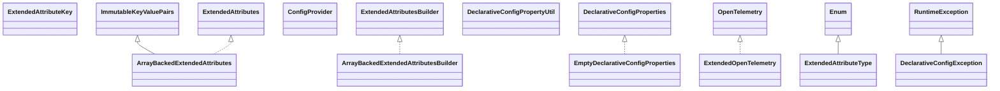

# opentelemetry-api-incubator-1.61.0-alpha.jar

[Group index](README.md) | [All archives](../README.md)

## Scope and provenance

- **Donor:** `SQX_145_REFERENCE_ROOT/internal/libs/opentelemetry-api-incubator-1.61.0-alpha.jar`.
- **SHA-256:** `0f3f4eacb0a29579cb56e94bfbb75fab6aa4e893e7c1e37e91da874d06dbc7ce`; accessed 2026-10-06; captured `2026-10-06T18:54:51.906614+00:00`.
- **Classes:** 87 raw entries; 87 unique entry names. Duplicate occurrence indices are zero-based.
- **Inspection:** read-only ZIP hashing and class-file structural parsing; signatures/descriptors, modifiers, hierarchy and references only. Bytecode bodies are hashed, not published.
- **Allocation:** proposed `FEAT-HOST-OPENTELEMETRY-API-INCUBATOR`, P01; [roadmap](../../sqx-full-application-roadmap.md). Domain README registration remains required.
- **Repository:** `01067f00031428613c6394064ca1bcadc1ba00ee`; review state unreviewed. Download label 145-dev1; installed build/activation and runtime equivalence unverified.
- **Limit:** every class/member is inventoried; declaration coverage does not establish consumed calls, defaults, formulas, failure semantics or algorithm parity.
- **Archive/resource index:** [087.json](../../../evidence/sqx145/archives/145/087.json).

## Complete member declarations

Member shards contain exact JVM names/descriptors, access flags, generic signatures, throws types, declared fields/methods, superclass/interfaces and referenced class names. All classes, nested/synthetic members and overloads are retained. Code length/hash is structural evidence, not a normalized algorithm comparison.

- [001.json](../../../evidence/sqx145/members/087/001.json) — SHA-256 `bf35ae89e196e725117cf64a2a11451947580c50275bd9e9b80f6a27dfbc65e1`.
- [002.json](../../../evidence/sqx145/members/087/002.json) — SHA-256 `dcd4dfdfe0f8719058505cae82608cbbfed14cb9285ce7d0b8666beefef12911`.

## Focused structural diagram

Up to twelve non-nested classes; arrows show declared inheritance/interfaces only. External type names are not evidence of an available body or an executed dependency.

## Class inventory

| Archive entry | Occurrence | Class SHA-256 | Fields | Methods |
| --- | ---: | --- | ---: | ---: |
| `io/opentelemetry/api/incubator/ExtendedOpenTelemetry.class` | 0 | `819db7081039d5e6cbc0110bd0468bfb9a34d722d3962658b4568404ffd0c022` | 0 | 3 |
| `io/opentelemetry/api/incubator/common/ArrayBackedExtendedAttributes$1.class` | 0 | `34404d76201f053586a6b8ba98d85bad1fe3feb0ea39d2e21b8024319aa2f3c0` | 1 | 1 |
| `io/opentelemetry/api/incubator/common/ArrayBackedExtendedAttributes.class` | 0 | `fca61a2164d97d76eccfc21f8a09161e7fd2c3c07baff7c358c3561313ab836d` | 3 | 13 |
| `io/opentelemetry/api/incubator/common/ArrayBackedExtendedAttributesBuilder$1.class` | 0 | `3711f5e7730b4846ff361ead4475aabec34f2ac95e8a2d18e3ffdece65a4047c` | 2 | 1 |
| `io/opentelemetry/api/incubator/common/ArrayBackedExtendedAttributesBuilder.class` | 0 | `fde442add10849067d581c33c080335321bf00302c6792c95ce3f2fc9d3b5c80` | 1 | 10 |
| `io/opentelemetry/api/incubator/common/ExtendedAttributeKey.class` | 0 | `f0bb5f78c89f64b04067a9b7160ff94e36909ab739a06deb2df557d39f30cd12` | 0 | 14 |
| `io/opentelemetry/api/incubator/common/ExtendedAttributeType.class` | 0 | `1e490f11b6b7cca3ebc072d76757c091d217aa7b86683e4d7d162b707ded6cb6` | 11 | 5 |
| `io/opentelemetry/api/incubator/common/ExtendedAttributes.class` | 0 | `779c7606caf79ece5a2d91a84337df924eb65ce77e208bd655fcff82890e822d` | 0 | 10 |
| `io/opentelemetry/api/incubator/common/ExtendedAttributesBuilder.class` | 0 | `4a0cb448c6ad73a36d0833ff44aa93c757014f4383da46d9e6b9dd6bed6db50f` | 0 | 21 |
| `io/opentelemetry/api/incubator/config/ConfigProvider.class` | 0 | `2ce143f5e02a081c16566bb71789cdb0b23b910eed451ffdad8192617c9d8a63` | 0 | 4 |
| `io/opentelemetry/api/incubator/config/DeclarativeConfigException.class` | 0 | `774f4ed957ceeccd7c06b8f1f05921b7056e92b19471d34f702760ee96c49cc6` | 1 | 2 |
| `io/opentelemetry/api/incubator/config/DeclarativeConfigProperties.class` | 0 | `b6f78b8458f039eacef31af0e40dc7bdbcac5dd5add48a57b883044bf8bb0d09` | 0 | 21 |
| `io/opentelemetry/api/incubator/config/DeclarativeConfigPropertyUtil.class` | 0 | `3a7e9592d0eb63c3979216cfc1a2fdfd8035bb2580b4bfe8cfaaf231da40d165` | 1 | 15 |
| `io/opentelemetry/api/incubator/config/EmptyDeclarativeConfigProperties.class` | 0 | `950464fa49ff3a58e0fe44dbc6b62fd12553baa5d7d28371690b013640a6787e` | 2 | 13 |
| `io/opentelemetry/api/incubator/config/InstrumentationConfigUtil.class` | 0 | `19803a16f6cedf53aa88e917d0f090e467ed9e4a95e8914e795e55a7212da478` | 0 | 16 |
| `io/opentelemetry/api/incubator/internal/InternalExtendedAttributeKeyImpl$1.class` | 0 | `27f7a5e85a04bd118656cd3f47d1e711a994f05fdd4fc1939fed97df4000a9a8` | 2 | 1 |
| `io/opentelemetry/api/incubator/internal/InternalExtendedAttributeKeyImpl.class` | 0 | `901e4910b9d4c62aeaaf97a75ce52ea6342caf4e7c8c1372b0f007dd385181b1` | 5 | 13 |
| `io/opentelemetry/api/incubator/internal/ObfuscatedExtendedOpenTelemetry.class` | 0 | `79d4f80921e1193992e07b9c1a1bdcb3849715388d1e4e0e725274e52e825f2d` | 1 | 7 |
| `io/opentelemetry/api/incubator/logs/ExtendedDefaultLogger$1.class` | 0 | `e25ec1fe2fc58976aef618c3636c21e5edd318b9c456c3617e14d6e79d94e5fd` | 0 | 0 |
| `io/opentelemetry/api/incubator/logs/ExtendedDefaultLogger$NoopExtendedLogRecordBuilder.class` | 0 | `75dabb2ebb004af8d6ac6a615044abe823912c8c77b237078c7fd755b1748a58` | 0 | 28 |
| `io/opentelemetry/api/incubator/logs/ExtendedDefaultLogger.class` | 0 | `d5c4108dbf32b3bcafed10b41f5da939136e856133bfe1bb065fe1dafef8cc28` | 2 | 6 |
| `io/opentelemetry/api/incubator/logs/ExtendedDefaultLoggerProvider$1.class` | 0 | `333da1bdcb2f59e11104bf7f160dd6f0cdb5f23d49220751ba6119852a6cdbc9` | 0 | 0 |
| `io/opentelemetry/api/incubator/logs/ExtendedDefaultLoggerProvider$NoopLoggerBuilder.class` | 0 | `1b422d7cfad8a29a0c47c8e1673da809cbb6c406713fad76431f8cfbb732e2bb` | 0 | 5 |
| `io/opentelemetry/api/incubator/logs/ExtendedDefaultLoggerProvider.class` | 0 | `9b8390b822fff8056be59999a4abb5aa69cebce536be9f2c31d0ced432bd8edb` | 2 | 4 |
| `io/opentelemetry/api/incubator/logs/ExtendedLogRecordBuilder.class` | 0 | `2a4e20e148750d4a552761e23e8c719bfe163bf91c64897f7d1290162cb031ce` | 0 | 30 |
| `io/opentelemetry/api/incubator/logs/ExtendedLogger.class` | 0 | `b30e86a6a7ee00138cb5fad357a286829fce337b4f332e96e97897b9fc8cbfd9` | 0 | 2 |
| `io/opentelemetry/api/incubator/metrics/ExtendedDefaultMeter$1.class` | 0 | `a9c1cd2d61d91a50685d35c99987b04f64ca6aeb8e2e4e1528c49668a72875cc` | 0 | 1 |
| `io/opentelemetry/api/incubator/metrics/ExtendedDefaultMeter$NoopDoubleCounter.class` | 0 | `7ec2a8c12be1ef319d45d0f2d0f4b809f4c17332dc4c161af93b78f5d94c935e` | 0 | 6 |
| `io/opentelemetry/api/incubator/metrics/ExtendedDefaultMeter$NoopDoubleCounterBuilder$1.class` | 0 | `80f81ed2d87fc79377817700bd9e5a8d87807a11fb30ca6328d9ea8f2fe9b319` | 0 | 1 |
| `io/opentelemetry/api/incubator/metrics/ExtendedDefaultMeter$NoopDoubleCounterBuilder.class` | 0 | `0108d8e7479b0acd42285a7060987c248dd4657997d62e2bb56b64396f99b15d` | 2 | 8 |
| `io/opentelemetry/api/incubator/metrics/ExtendedDefaultMeter$NoopDoubleGauge.class` | 0 | `565189e59efa3e2d51a904471133bfc1f55eb3379541d3e197c98d8961256865` | 0 | 6 |
| `io/opentelemetry/api/incubator/metrics/ExtendedDefaultMeter$NoopDoubleGaugeBuilder$1.class` | 0 | `d84925af250dd447ff145ee98b9925494a92e7d330f2389f81b26158ff33ea1b` | 0 | 1 |
| `io/opentelemetry/api/incubator/metrics/ExtendedDefaultMeter$NoopDoubleGaugeBuilder.class` | 0 | `07f6c0f47491aef190ed6e57c47e7ee972d3752558f3a263e7106d27248bb4ad` | 3 | 9 |
| `io/opentelemetry/api/incubator/metrics/ExtendedDefaultMeter$NoopDoubleHistogram.class` | 0 | `290e3caafb55419beba04472371a269d955d73eade3f91d573a50dcbd3458a34` | 0 | 6 |
| `io/opentelemetry/api/incubator/metrics/ExtendedDefaultMeter$NoopDoubleHistogramBuilder.class` | 0 | `669477e0d17f0abd601b0eba9880dfa0e5340edc84dfbf726019c5d8444e6d60` | 2 | 7 |
| `io/opentelemetry/api/incubator/metrics/ExtendedDefaultMeter$NoopDoubleUpDownCounter.class` | 0 | `ea8ed7ad065e6345c076370b712f3fdd422d2e330567f79f31db581f8c818a4d` | 0 | 6 |
| `io/opentelemetry/api/incubator/metrics/ExtendedDefaultMeter$NoopDoubleUpDownCounterBuilder$1.class` | 0 | `fab615289ef51d4c3c9dee04dde2cb85d5a8c1ad8cd4219b92994c186ab6b4d7` | 0 | 1 |
| `io/opentelemetry/api/incubator/metrics/ExtendedDefaultMeter$NoopDoubleUpDownCounterBuilder$2.class` | 0 | `08cf0024da8df9a258d63548b1ed0c1b78024a615c76e1b123aa349cf796d813` | 0 | 1 |
| `io/opentelemetry/api/incubator/metrics/ExtendedDefaultMeter$NoopDoubleUpDownCounterBuilder.class` | 0 | `8d1300d47d844de756a312130c18a03fdd829bbc4ac29446782dad1c24f84457` | 2 | 8 |
| `io/opentelemetry/api/incubator/metrics/ExtendedDefaultMeter$NoopLongCounter.class` | 0 | `d5b3969899c7f48c9489baa6e4391c84e54b18326e214125cf2616e619d5ca01` | 0 | 6 |
| `io/opentelemetry/api/incubator/metrics/ExtendedDefaultMeter$NoopLongCounterBuilder$1.class` | 0 | `46fb18a4f9a7ddfe116962ac2793270a1192bbe032383c2e91a2f9874ab14274` | 0 | 1 |
| `io/opentelemetry/api/incubator/metrics/ExtendedDefaultMeter$NoopLongCounterBuilder.class` | 0 | `f6a5434f7858763896ee413bf03b49ea5c9b6b4ef6c2344720ed1ecfe4270724` | 3 | 9 |
| `io/opentelemetry/api/incubator/metrics/ExtendedDefaultMeter$NoopLongGauge.class` | 0 | `67051b0441910d0f375d163d1999a16f1f7bd37aadc646c11a96ea486881b4b7` | 0 | 6 |
| `io/opentelemetry/api/incubator/metrics/ExtendedDefaultMeter$NoopLongGaugeBuilder$1.class` | 0 | `1a392fedd366e6263d7aaa2794c5e78d4477e4e7d507fe3c898028be209880fd` | 0 | 1 |
| `io/opentelemetry/api/incubator/metrics/ExtendedDefaultMeter$NoopLongGaugeBuilder.class` | 0 | `840727b37d7dfeedda9f86bf2248f51103631290ed1fa9533315407b0df4d0a3` | 2 | 8 |
| `io/opentelemetry/api/incubator/metrics/ExtendedDefaultMeter$NoopLongHistogram.class` | 0 | `eaf6103a99371c16950320396d4fbdfc9e95bb333c7354a31768cf00e0133936` | 0 | 6 |
| `io/opentelemetry/api/incubator/metrics/ExtendedDefaultMeter$NoopLongHistogramBuilder.class` | 0 | `56575d05ef472b3d330a6bf05038d15ac321257fe7c429afcde7d45d10ea086a` | 1 | 6 |
| `io/opentelemetry/api/incubator/metrics/ExtendedDefaultMeter$NoopLongUpDownCounter.class` | 0 | `c346b096096345ba05648db0b6513c82488b70e6d4514b4108b30718e59a6a9c` | 0 | 6 |
| `io/opentelemetry/api/incubator/metrics/ExtendedDefaultMeter$NoopLongUpDownCounterBuilder$1.class` | 0 | `9dcd625b5e0d3c80327868a201941c2cd2ca4dd32420507c8055bb651f255d6f` | 0 | 1 |
| `io/opentelemetry/api/incubator/metrics/ExtendedDefaultMeter$NoopLongUpDownCounterBuilder$2.class` | 0 | `c5ad18f0005dc1c9649c5ecfeb0d9b00d7ffa2352ace59fa1755adb9f7a61c23` | 0 | 1 |
| `io/opentelemetry/api/incubator/metrics/ExtendedDefaultMeter$NoopLongUpDownCounterBuilder.class` | 0 | `87ad1051b3bcf84e6e22ec7c0d427beac4b6be013ca93f0479537cac459b1d25` | 3 | 9 |
| `io/opentelemetry/api/incubator/metrics/ExtendedDefaultMeter$NoopObservableDoubleMeasurement.class` | 0 | `742415e2e239375d48d17f20116f75851eec17c81e7c99088f71df96e18ed96e` | 0 | 4 |
| `io/opentelemetry/api/incubator/metrics/ExtendedDefaultMeter$NoopObservableLongMeasurement.class` | 0 | `0474626128e5f4230e0ad4ec40e5531faaa96c1c8279b03719bc81cea7ca8bf2` | 0 | 4 |
| `io/opentelemetry/api/incubator/metrics/ExtendedDefaultMeter.class` | 0 | `08053c815348b9507862dd18ee0e599b445cdddb0656b77ef4527c1609d60f31` | 8 | 10 |
| `io/opentelemetry/api/incubator/metrics/ExtendedDefaultMeterProvider$1.class` | 0 | `ddacb67a026ebe426327bea79f7e05490b69f96feaa4a29b66654fd868ddbf28` | 0 | 0 |
| `io/opentelemetry/api/incubator/metrics/ExtendedDefaultMeterProvider$NoopMeterBuilder.class` | 0 | `9e53db13b028fc453f561ef0e56dc4c009a5e2144c6547227f7721f923155bf3` | 0 | 5 |
| `io/opentelemetry/api/incubator/metrics/ExtendedDefaultMeterProvider.class` | 0 | `70a8cba3cf6eb363a134984610163bfc9c62e0762958019d79d2696be4328cca` | 2 | 4 |
| `io/opentelemetry/api/incubator/metrics/ExtendedDoubleCounter.class` | 0 | `04f0dc680bf846044d5aa7baa2a5b37ce840e87cc3ca0a40aacbd3913587279d` | 0 | 0 |
| `io/opentelemetry/api/incubator/metrics/ExtendedDoubleCounterBuilder.class` | 0 | `ccaea62409856731090aed7484b63a918fe2a60232def4d22d894f40464d716c` | 0 | 1 |
| `io/opentelemetry/api/incubator/metrics/ExtendedDoubleGauge.class` | 0 | `bd612b94ab72dcffb8c5ad98a65142323627b96d7d70db4db7af12470b3df1ae` | 0 | 0 |
| `io/opentelemetry/api/incubator/metrics/ExtendedDoubleGaugeBuilder.class` | 0 | `86e8e50dddf2ce830ad1d0ea3aa6cc5bac37f126aa734eae014f5b9fd67e3db7` | 0 | 1 |
| `io/opentelemetry/api/incubator/metrics/ExtendedDoubleHistogram.class` | 0 | `65f44f8014cc132480c7891dd2343539f1198244d38d6874ca703909cb80528a` | 0 | 0 |
| `io/opentelemetry/api/incubator/metrics/ExtendedDoubleHistogramBuilder.class` | 0 | `891f76dc3e424e08031cfeeda3431078378fb1941104e4684f7b6e802dc419c7` | 0 | 1 |
| `io/opentelemetry/api/incubator/metrics/ExtendedDoubleUpDownCounter.class` | 0 | `31a9b9c49cc425f301c89774f9e9ea1a63bf1b911a8f7c21807af771de234b52` | 0 | 0 |
| `io/opentelemetry/api/incubator/metrics/ExtendedDoubleUpDownCounterBuilder.class` | 0 | `a787adf4da65f344a9d2ebcd2c70e96887039866cd7fa05fd276bd227d101344` | 0 | 1 |
| `io/opentelemetry/api/incubator/metrics/ExtendedLongCounter.class` | 0 | `fa8fa3e1e3732e66b00eb367fd963d4c629aa185aabfeef7b6b427fa1b68a6ff` | 0 | 0 |
| `io/opentelemetry/api/incubator/metrics/ExtendedLongCounterBuilder.class` | 0 | `7a877181c6df52de1af3e4dd1fab62843e4ffe548ec74d8e3a96e29f35f57e03` | 0 | 1 |
| `io/opentelemetry/api/incubator/metrics/ExtendedLongGauge.class` | 0 | `1c9e6896e660d3301c42fc37cd4e835aaa9fa22c7eb16b4894bd413d0d608214` | 0 | 0 |
| `io/opentelemetry/api/incubator/metrics/ExtendedLongGaugeBuilder.class` | 0 | `617bc4c81ea5af1163b9df7a8c377c5f7dc8f4ef069cd41016452d8ab2b32fc7` | 0 | 1 |
| `io/opentelemetry/api/incubator/metrics/ExtendedLongHistogram.class` | 0 | `9868006d3d8d9a95d9174822892dffed5af1f0e0aa4ba46b423ed9124b3d5392` | 0 | 0 |
| `io/opentelemetry/api/incubator/metrics/ExtendedLongHistogramBuilder.class` | 0 | `4a83fdd2e324ef31d5fdc6a9da09a3739c701d634a3ca76bd9d31274805005eb` | 0 | 1 |
| `io/opentelemetry/api/incubator/metrics/ExtendedLongUpDownCounter.class` | 0 | `512c91593280505c0de0c15e688871f2e92bb340a2f97b0a1cf6892c1f707f2a` | 0 | 0 |
| `io/opentelemetry/api/incubator/metrics/ExtendedLongUpDownCounterBuilder.class` | 0 | `ad183783f6cb8a043835199c64ebb89e0a6436a750669c64862a92cc1d1bd9cd` | 0 | 1 |
| `io/opentelemetry/api/incubator/propagation/CaseInsensitiveMap.class` | 0 | `ddb6e89e3bbc53391dce54f8849da32570fb9eb75e35254969c3e63b81f4015a` | 1 | 8 |
| `io/opentelemetry/api/incubator/propagation/EnvironmentGetter.class` | 0 | `bce9f259a666ec506822e29ef87363f9cb222a2d5c0368033cae30fa752b98c3` | 3 | 8 |
| `io/opentelemetry/api/incubator/propagation/EnvironmentSetter.class` | 0 | `7b74bdf5da61ba33bdfa29a1a35387a33cc206b6cf0e2bba0e2b8d95af8580a4` | 1 | 7 |
| `io/opentelemetry/api/incubator/propagation/ExtendedContextPropagators$1.class` | 0 | `34a6ea4d8181050bfb13ba4a2d6d6c1c381c09017a46ae0edd0202d1d23a8e83` | 0 | 5 |
| `io/opentelemetry/api/incubator/propagation/ExtendedContextPropagators.class` | 0 | `7a54da49c79ebef2245ff4a4aea7c0fd190d3e71d2346c304a6a628c3a758ae5` | 1 | 5 |
| `io/opentelemetry/api/incubator/propagation/PassThroughPropagator.class` | 0 | `5009921cdfdefa6d2df760e4e779546323b1b482a18b0f8bfda280944ff645b2` | 2 | 9 |
| `io/opentelemetry/api/incubator/trace/ExtendedDefaultTracer$NoopSpanBuilder.class` | 0 | `de999a40c03d7dd6e91d3446ee0b963cef40ce030bfe1db76d5f270be64558fb` | 1 | 45 |
| `io/opentelemetry/api/incubator/trace/ExtendedDefaultTracer.class` | 0 | `1ebd925c113d0e28baa62c1581d7d0b13c4657d795ba678be358e37ebe00aebd` | 1 | 6 |
| `io/opentelemetry/api/incubator/trace/ExtendedDefaultTracerBuilder.class` | 0 | `b45090a53d914c69c61805e6538ee512bb3b28c9beede6e546e4d337880320f7` | 1 | 6 |
| `io/opentelemetry/api/incubator/trace/ExtendedDefaultTracerProvider.class` | 0 | `9085f806a832757260ed46ca653c6207951a139a42d46779dfdc5158b2877cb6` | 1 | 6 |
| `io/opentelemetry/api/incubator/trace/ExtendedSpanBuilder.class` | 0 | `0f6c9a7baa02b46d539d077d049a02f0a33df7c4e0deab90002f71330bf8031b` | 0 | 31 |
| `io/opentelemetry/api/incubator/trace/ExtendedTracer.class` | 0 | `37aa00f5f1bc9721deeddc929a5bf451b1fe5a1f7a341d03b435fa2336efb901` | 0 | 2 |
| `io/opentelemetry/api/incubator/trace/SpanCallable.class` | 0 | `bea49ad8af5b3ec433fce3725bc1dce4d37d07cbaefe44ca481612fc04387d32` | 0 | 1 |
| `io/opentelemetry/api/incubator/trace/SpanRunnable.class` | 0 | `37fb681a92058b093adfe88f5660050fbf9ea4e309840c2363a49c60946c845a` | 0 | 1 |
