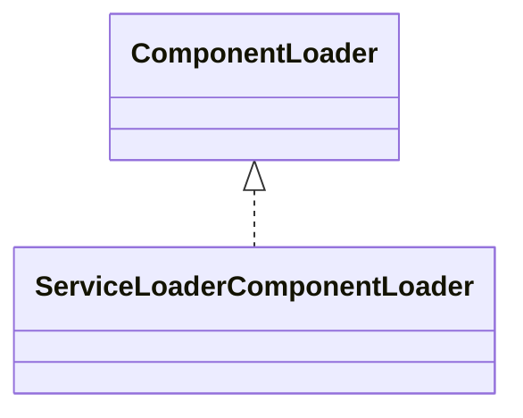

# opentelemetry-common-1.61.0.jar

[Group index](README.md) | [All archives](../README.md)

## Scope and provenance

- **Donor:** `SQX_145_REFERENCE_ROOT/internal/libs/opentelemetry-common-1.61.0.jar`.
- **SHA-256:** `618bd894feb3f65a563209603d27cbab534310be22705f78c525fc0e799e8e91`; accessed 2026-10-06; captured `2026-10-06T18:54:51.906614+00:00`.
- **Classes:** 2 raw entries; 2 unique entry names. Duplicate occurrence indices are zero-based.
- **Inspection:** read-only ZIP hashing and class-file structural parsing; signatures/descriptors, modifiers, hierarchy and references only. Bytecode bodies are hashed, not published.
- **Allocation:** proposed `FEAT-HOST-OPENTELEMETRY-COMMON`, P01; [roadmap](../../sqx-full-application-roadmap.md). Domain README registration remains required.
- **Repository:** `01067f00031428613c6394064ca1bcadc1ba00ee`; review state unreviewed. Download label 145-dev1; installed build/activation and runtime equivalence unverified.
- **Limit:** every class/member is inventoried; declaration coverage does not establish consumed calls, defaults, formulas, failure semantics or algorithm parity.
- **Archive/resource index:** [088.json](../../../evidence/sqx145/archives/145/088.json).

## Complete member declarations

Member shards contain exact JVM names/descriptors, access flags, generic signatures, throws types, declared fields/methods, superclass/interfaces and referenced class names. All classes, nested/synthetic members and overloads are retained. Code length/hash is structural evidence, not a normalized algorithm comparison.

- [001.json](../../../evidence/sqx145/members/088/001.json) — SHA-256 `d0dcc6f71a73dc932e3c4b24a30a445665fcb44f065e10a9c1251da2e0f64e7c`.

## Focused structural diagram

Up to twelve non-nested classes; arrows show declared inheritance/interfaces only. External type names are not evidence of an available body or an executed dependency.

## Class inventory

| Archive entry | Occurrence | Class SHA-256 | Fields | Methods |
| --- | ---: | --- | ---: | ---: |
| `io/opentelemetry/common/ComponentLoader.class` | 0 | `db3d1b27828f5967745a5b1852dc14d846035f447ee76b9a8e72584ad1a6671d` | 0 | 3 |
| `io/opentelemetry/common/ServiceLoaderComponentLoader.class` | 0 | `ad4b16105c60853c501b63710de705d4dd05e80e209741c6ad3786b92ca4546b` | 1 | 3 |
