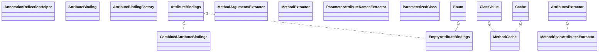

# opentelemetry-instrumentation-annotations-support-2.27.0-alpha.jar

[Group index](README.md) | [All archives](../README.md)

## Scope and provenance

- **Donor:** `SQX_145_REFERENCE_ROOT/internal/libs/opentelemetry-instrumentation-annotations-support-2.27.0-alpha.jar`.
- **SHA-256:** `e144b9e11b70d2c0090ab0ccf32432e78f8311910f31b6a304d9cb90a2e02e17`; accessed 2026-10-06; captured `2026-10-06T18:54:51.906614+00:00`.
- **Classes:** 27 raw entries; 27 unique entry names. Duplicate occurrence indices are zero-based.
- **Inspection:** read-only ZIP hashing and class-file structural parsing; signatures/descriptors, modifiers, hierarchy and references only. Bytecode bodies are hashed, not published.
- **Allocation:** proposed `FEAT-HOST-OPENTELEMETRY-INSTRUMENTATION-ANNOTATIONS-SUPPORT`, P01; [roadmap](../../sqx-full-application-roadmap.md). Domain README registration remains required.
- **Repository:** `01067f00031428613c6394064ca1bcadc1ba00ee`; review state unreviewed. Download label 145-dev1; installed build/activation and runtime equivalence unverified.
- **Limit:** every class/member is inventoried; declaration coverage does not establish consumed calls, defaults, formulas, failure semantics or algorithm parity.
- **Archive/resource index:** [090.json](../../../evidence/sqx145/archives/145/090.json).

## Complete member declarations

Member shards contain exact JVM names/descriptors, access flags, generic signatures, throws types, declared fields/methods, superclass/interfaces and referenced class names. All classes, nested/synthetic members and overloads are retained. Code length/hash is structural evidence, not a normalized algorithm comparison.

- [001.json](../../../evidence/sqx145/members/090/001.json) — SHA-256 `5b14ef3099bff185ece26d3b633acdf0e494e51cda3102849eab810617360c77`.

## Focused structural diagram

Up to twelve non-nested classes; arrows show declared inheritance/interfaces only. External type names are not evidence of an available body or an executed dependency.

## Class inventory

| Archive entry | Occurrence | Class SHA-256 | Fields | Methods |
| --- | ---: | --- | ---: | ---: |
| `io/opentelemetry/instrumentation/api/annotation/support/AnnotationReflectionHelper.class` | 0 | `3c1f92826b7c0746ed8624c22e2ed3f5f4c86e63450318868d3355ef99e2e69c` | 0 | 4 |
| `io/opentelemetry/instrumentation/api/annotation/support/AttributeBinding.class` | 0 | `fafb8ee7ef7d799e410f5b2a9c66e1d9110aae693c5d464f0e3fb9832e689465` | 0 | 1 |
| `io/opentelemetry/instrumentation/api/annotation/support/AttributeBindingFactory$1.class` | 0 | `27d149d8efde6d119b7060731f78cd7ee3d34fb8f7481829e8a1b7c76de4e4a9` | 1 | 4 |
| `io/opentelemetry/instrumentation/api/annotation/support/AttributeBindingFactory$2.class` | 0 | `4e3c8e19e20ad12b912f4f2032591ff2e49d8ebebb21293d2cbca6f804a6010e` | 1 | 4 |
| `io/opentelemetry/instrumentation/api/annotation/support/AttributeBindingFactory$3.class` | 0 | `74e6a93ef6b3294f2ae90d5799549970bea54edda092f9ce187726e9d063ce05` | 1 | 4 |
| `io/opentelemetry/instrumentation/api/annotation/support/AttributeBindingFactory$4.class` | 0 | `c85ea815d812985b40b3407697a084a9256a60ebf6694824a0301e7f19abb64e` | 1 | 4 |
| `io/opentelemetry/instrumentation/api/annotation/support/AttributeBindingFactory$5.class` | 0 | `7515f4bff7dd4ffd02ac6c8a33b9244f8258f2b19427c4c102271805a4117adc` | 1 | 4 |
| `io/opentelemetry/instrumentation/api/annotation/support/AttributeBindingFactory$6.class` | 0 | `bf1e20a224570325eefc04c681f5bf590d5937e78ef8f4dc9b785a699a66f1ea` | 1 | 4 |
| `io/opentelemetry/instrumentation/api/annotation/support/AttributeBindingFactory$7.class` | 0 | `3e64126fcccd059fa0eefcdfff37104159584431a6ff1caac7930a91474c21f5` | 1 | 4 |
| `io/opentelemetry/instrumentation/api/annotation/support/AttributeBindingFactory$8.class` | 0 | `8885f14057beb1b028405d17c9b7d614df7ee55148c6c6bec276b4dfd8bfdd88` | 1 | 4 |
| `io/opentelemetry/instrumentation/api/annotation/support/AttributeBindingFactory$9.class` | 0 | `56ec3fa6b850f483a3482ff01287b1887c2a0c0f949c5ed978c741627872cbbc` | 2 | 3 |
| `io/opentelemetry/instrumentation/api/annotation/support/AttributeBindingFactory.class` | 0 | `d421d0881032ae714cf43fd614058077c5e9bcf1dd644a104a904880b04cf5af` | 0 | 44 |
| `io/opentelemetry/instrumentation/api/annotation/support/AttributeBindings.class` | 0 | `6841e5896a2852ee87cd6d10378424c8e0444a468a305a5a2ce6f607538a5cf7` | 0 | 3 |
| `io/opentelemetry/instrumentation/api/annotation/support/CombinedAttributeBindings.class` | 0 | `3b7fbca4891c78fda71b76aad1bd6685b0440805de07294249820abfd02be326` | 3 | 3 |
| `io/opentelemetry/instrumentation/api/annotation/support/EmptyAttributeBindings.class` | 0 | `b605b203fe3692b81bd900b5a9365b8ce0996b4b4f3faa2f44a4481329a9498c` | 2 | 7 |
| `io/opentelemetry/instrumentation/api/annotation/support/MethodArgumentsExtractor.class` | 0 | `033d5d630ea664841f87f51119e05f69b86b94719e341926693ba5eeb2dad72c` | 0 | 1 |
| `io/opentelemetry/instrumentation/api/annotation/support/MethodCache.class` | 0 | `1a865640c15887d436441edb7e30c2b6cae68b3e3fb10349e0bbbd905bf30f94` | 0 | 11 |
| `io/opentelemetry/instrumentation/api/annotation/support/MethodExtractor.class` | 0 | `fbbaed04a00d153cb889ecf860aca089373873cc342bf8876857f2e96236525a` | 0 | 1 |
| `io/opentelemetry/instrumentation/api/annotation/support/MethodSpanAttributesExtractor.class` | 0 | `2e3b1f265e5b1c7d58a01f421b1d6e1b3f79f0536749e0784b9ce68dd70055a3` | 4 | 5 |
| `io/opentelemetry/instrumentation/api/annotation/support/ParameterAttributeNamesExtractor.class` | 0 | `adcdfc5a8c9f9619b052f018714dda3accb1688df3c1a22c6e8930bb97f3a408` | 0 | 1 |
| `io/opentelemetry/instrumentation/api/annotation/support/ParameterizedClass.class` | 0 | `474d2bbee0f8cb1bdf53a7f92531b44682943ac66838e799bea6e5238e06431b` | 2 | 12 |
| `io/opentelemetry/instrumentation/api/annotation/support/SpanAttributesExtractor.class` | 0 | `55df53809046705f135728b3f71ee2568ad79f3a25e73901a92bae343f84c8c5` | 2 | 4 |
| `io/opentelemetry/instrumentation/api/annotation/support/async/AsyncOperationEndStrategies.class` | 0 | `7382b06addd5d20c5ea093e916a1ac78a55f30c3f8c6019d63c81ac89eb40f2e` | 1 | 6 |
| `io/opentelemetry/instrumentation/api/annotation/support/async/AsyncOperationEndStrategiesImpl.class` | 0 | `b6054a75d23d483ea61ab19e7bd05967b5b9ced1d6d8707fd004266df6d34685` | 1 | 4 |
| `io/opentelemetry/instrumentation/api/annotation/support/async/AsyncOperationEndStrategy.class` | 0 | `3d6a0498d7e51d22060562472a3dde9e5872c3098ee81491d8427a7364e74840` | 0 | 2 |
| `io/opentelemetry/instrumentation/api/annotation/support/async/AsyncOperationEndSupport.class` | 0 | `80c12958aa47808565790c525dd920e8322daae034c1fc68346079e2d09ba844` | 4 | 4 |
| `io/opentelemetry/instrumentation/api/annotation/support/async/Jdk8AsyncOperationEndStrategy.class` | 0 | `424b8e3d85079d7f408f83ff9c14bb1c8c65bca0255772da15c4d4ef136e71ba` | 2 | 10 |
