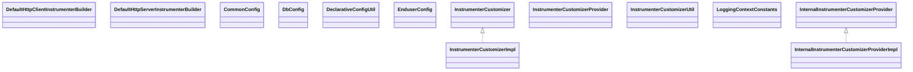

# opentelemetry-instrumentation-api-incubator-2.27.0-alpha.jar

[Group index](README.md) | [All archives](../README.md)

## Scope and provenance

- **Donor:** `SQX_145_REFERENCE_ROOT/internal/libs/opentelemetry-instrumentation-api-incubator-2.27.0-alpha.jar`.
- **SHA-256:** `991a817ef0cf97aa53e35744c8ab47667526c665701ab3084af00336cec7e3ed`; accessed 2026-10-06; captured `2026-10-06T18:54:51.906614+00:00`.
- **Classes:** 154 raw entries; 154 unique entry names. Duplicate occurrence indices are zero-based.
- **Inspection:** read-only ZIP hashing and class-file structural parsing; signatures/descriptors, modifiers, hierarchy and references only. Bytecode bodies are hashed, not published.
- **Allocation:** proposed `FEAT-HOST-OPENTELEMETRY-INSTRUMENTATION-API-INCUBATOR`, P01; [roadmap](../../sqx-full-application-roadmap.md). Domain README registration remains required.
- **Repository:** `01067f00031428613c6394064ca1bcadc1ba00ee`; review state unreviewed. Download label 145-dev1; installed build/activation and runtime equivalence unverified.
- **Limit:** every class/member is inventoried; declaration coverage does not establish consumed calls, defaults, formulas, failure semantics or algorithm parity.
- **Archive/resource index:** [092.json](../../../evidence/sqx145/archives/145/092.json).

## Complete member declarations

Member shards contain exact JVM names/descriptors, access flags, generic signatures, throws types, declared fields/methods, superclass/interfaces and referenced class names. All classes, nested/synthetic members and overloads are retained. Code length/hash is structural evidence, not a normalized algorithm comparison.

- [001.json](../../../evidence/sqx145/members/092/001.json) — SHA-256 `f3d1f8dc9448ac66fd9965fa81f30240b50d330ee430ee957a99346700d8108c`.
- [002.json](../../../evidence/sqx145/members/092/002.json) — SHA-256 `9c708e695921550ede20c62c82be37c9e9a00b75a871dae734b94b8fa0fa78f4`.

## Focused structural diagram

Up to twelve non-nested classes; arrows show declared inheritance/interfaces only. External type names are not evidence of an available body or an executed dependency.

## Class inventory

| Archive entry | Occurrence | Class SHA-256 | Fields | Methods |
| --- | ---: | --- | ---: | ---: |
| `io/opentelemetry/instrumentation/api/incubator/builder/internal/DefaultHttpClientInstrumenterBuilder.class` | 0 | `c895aa627684f87bf0a29c3ac3d37d2f0c243562784f80d4260e571ce377aa16` | 11 | 18 |
| `io/opentelemetry/instrumentation/api/incubator/builder/internal/DefaultHttpServerInstrumenterBuilder.class` | 0 | `895777756368dbc39ae3e278fcdbec4b4a211194782192a9563e5b9268de99a7` | 12 | 17 |
| `io/opentelemetry/instrumentation/api/incubator/config/internal/CommonConfig.class` | 0 | `ed18edf5a81f765aff362a5edbfd00eadf550d10e9dc5c43000131dc6fb21606` | 14 | 15 |
| `io/opentelemetry/instrumentation/api/incubator/config/internal/DbConfig.class` | 0 | `55635c2fa7a97348d14206fc661f2eabf0a860e05ba44ebbfd7a74cdb2a554fc` | 2 | 14 |
| `io/opentelemetry/instrumentation/api/incubator/config/internal/DeclarativeConfigUtil.class` | 0 | `9373aeb909a9b7bb5f67914e9f5432e7117c72f20d922277d86abe61151731bd` | 0 | 3 |
| `io/opentelemetry/instrumentation/api/incubator/config/internal/EnduserConfig.class` | 0 | `33814b114ec189af48f3f7f321ed11c6a00aec3e22fe869f479afd18368a96ca` | 3 | 5 |
| `io/opentelemetry/instrumentation/api/incubator/instrumenter/InstrumenterCustomizer$InstrumentationType.class` | 0 | `6df43d999a5b7a9b31d5aa9d2a0d8004ba4b3d1aeef36424fbaae589673e3ad1` | 9 | 5 |
| `io/opentelemetry/instrumentation/api/incubator/instrumenter/InstrumenterCustomizer.class` | 0 | `728d971edf593f18eedeb6fe6eb93dd70df5c21bd01d5f24375516392817789d` | 0 | 8 |
| `io/opentelemetry/instrumentation/api/incubator/instrumenter/InstrumenterCustomizerProvider.class` | 0 | `b84e3b0721925e02fdb476bbf406a62f417ea7e1b0812cdba29ad396a37bc21c` | 0 | 1 |
| `io/opentelemetry/instrumentation/api/incubator/instrumenter/internal/InstrumenterCustomizerImpl.class` | 0 | `23f637fbd307f890c9f8da2fbb71decf21b983b08b7a5dcae81f0dc15a268150` | 2 | 10 |
| `io/opentelemetry/instrumentation/api/incubator/instrumenter/internal/InstrumenterCustomizerUtil.class` | 0 | `7f2a0de1932145d0aa17b28154152e9f0b8d46326ee7ff0086e32977e23e8a63` | 0 | 2 |
| `io/opentelemetry/instrumentation/api/incubator/instrumenter/internal/InternalInstrumenterCustomizerProviderImpl.class` | 0 | `4f0f36f8b3dbba56d477c8c5be8690560fa811e5e792b46604ba7810b993e2c2` | 1 | 2 |
| `io/opentelemetry/instrumentation/api/incubator/log/LoggingContextConstants.class` | 0 | `b1710c2855cb2e810b285af84c2627776da19c122b6d3850e0cb9920430d66be` | 3 | 1 |
| `io/opentelemetry/instrumentation/api/incubator/semconv/code/CodeAttributesExtractor.class` | 0 | `8c28846f6e239fb4810b5abfaea6e189cf51741baf970642e6504853b082cf6a` | 3 | 5 |
| `io/opentelemetry/instrumentation/api/incubator/semconv/code/CodeAttributesGetter.class` | 0 | `98ecca93442c50cf102e3090c39c53c890669128e54beeb44f8401d4808be4fc` | 0 | 2 |
| `io/opentelemetry/instrumentation/api/incubator/semconv/code/CodeSpanNameExtractor.class` | 0 | `be9746ac5186201cb8dd853e118d3fb03d582fffc56bdc96eb7a55dd5f14e400` | 1 | 3 |
| `io/opentelemetry/instrumentation/api/incubator/semconv/db/AutoSqlSanitizer$1.class` | 0 | `15ab31d1acd7f4dd80454ed3b752dc1c9eded2d1921eef1d62d035c7471e1f84` | 0 | 0 |
| `io/opentelemetry/instrumentation/api/incubator/semconv/db/AutoSqlSanitizer$Alter.class` | 0 | `4e4953d2b835bc02b66a2574596a739b1d0111b54127e6e93ef3089ac3145b70` | 1 | 2 |
| `io/opentelemetry/instrumentation/api/incubator/semconv/db/AutoSqlSanitizer$Call.class` | 0 | `cfbd349a00e02290dc5759415284911504b5b2d02ea6415af18c84a00f5df591` | 1 | 3 |
| `io/opentelemetry/instrumentation/api/incubator/semconv/db/AutoSqlSanitizer$Create.class` | 0 | `9cca36972d71eefc457a093b92cc353d7ae1764973f7bd92f615d4c6d9ab9180` | 1 | 2 |
| `io/opentelemetry/instrumentation/api/incubator/semconv/db/AutoSqlSanitizer$DdlOperation.class` | 0 | `768836d0feec1ecfda3bd83502f819dc9259e3118d89305a8727de3b026fee50` | 3 | 7 |
| `io/opentelemetry/instrumentation/api/incubator/semconv/db/AutoSqlSanitizer$Delete.class` | 0 | `65d334e5aa1e8b246988d947e9d33392ad890ecd563d0ab5bfff99a2170c0e86` | 2 | 4 |
| `io/opentelemetry/instrumentation/api/incubator/semconv/db/AutoSqlSanitizer$Drop.class` | 0 | `0e1de2b7b1b650ae35aa5cec3ea526682df4715b89bea2a59fb22d2235d66d05` | 1 | 2 |
| `io/opentelemetry/instrumentation/api/incubator/semconv/db/AutoSqlSanitizer$Insert.class` | 0 | `ae46d46c08a47fd66658bf3b6d1752f13cc806bf7bb7b3493267bc634fc707fe` | 2 | 4 |
| `io/opentelemetry/instrumentation/api/incubator/semconv/db/AutoSqlSanitizer$Merge.class` | 0 | `c5d813e5c80c158bbeec5d484b37ec71c367eeb4d9fdf8966523135fc8180bbc` | 1 | 2 |
| `io/opentelemetry/instrumentation/api/incubator/semconv/db/AutoSqlSanitizer$NoOp.class` | 0 | `2db6e8a30684205fdb54959b786ec270388f19da0732cbec8b17be004a617223` | 1 | 3 |
| `io/opentelemetry/instrumentation/api/incubator/semconv/db/AutoSqlSanitizer$Operation.class` | 0 | `f80a79279cd495895f79c4836dc4df947a54c68149803e0bb8d55c265c3b9d56` | 1 | 11 |
| `io/opentelemetry/instrumentation/api/incubator/semconv/db/AutoSqlSanitizer$Select.class` | 0 | `fb0b9b5790cf3099f2c3fded59af4374c09f6cf65f18ae57ea0f5b063a452dbf` | 5 | 6 |
| `io/opentelemetry/instrumentation/api/incubator/semconv/db/AutoSqlSanitizer$SimpleOperation.class` | 0 | `5857df8d27c428a0a486545439da589bfe06ee46c39b676aa5e114f73eeee22f` | 1 | 3 |
| `io/opentelemetry/instrumentation/api/incubator/semconv/db/AutoSqlSanitizer$Update.class` | 0 | `ba9de7b010141b8ba5857bdc93858d8bfaf98d3389e94f221eb417b6db7e7711` | 1 | 2 |
| `io/opentelemetry/instrumentation/api/incubator/semconv/db/AutoSqlSanitizer.class` | 0 | `747dcccf8d188fca6100d9ee0bfed589b058eb6beed1a230c0f045b658e82f40` | 47 | 39 |
| `io/opentelemetry/instrumentation/api/incubator/semconv/db/AutoSqlSanitizerWithSummary$1.class` | 0 | `69bee4da9bba4c7352cc70a89cc6e2fe9a5c85fbcb66b43e98e9af78a2f3ca33` | 1 | 1 |
| `io/opentelemetry/instrumentation/api/incubator/semconv/db/AutoSqlSanitizerWithSummary$Alter.class` | 0 | `7e5c8076239d0f840a42abbf9c3dfe5061872848bfbda76891c08d7604541f86` | 1 | 2 |
| `io/opentelemetry/instrumentation/api/incubator/semconv/db/AutoSqlSanitizerWithSummary$Call.class` | 0 | `c8cd0eda672a8e596d022e0ca6a9e581ad751196912925a13c8e4b0f5b8b3f57` | 5 | 4 |
| `io/opentelemetry/instrumentation/api/incubator/semconv/db/AutoSqlSanitizerWithSummary$Create.class` | 0 | `a2e78c49329584baac01898f9aef20d93e15ec447bd331a6ef4ce76bb1f4ff7d` | 1 | 2 |
| `io/opentelemetry/instrumentation/api/incubator/semconv/db/AutoSqlSanitizerWithSummary$DdlOperation.class` | 0 | `8a75631924035afea79e3c78812559e746563e2d74dbae055332b001572638f4` | 7 | 7 |
| `io/opentelemetry/instrumentation/api/incubator/semconv/db/AutoSqlSanitizerWithSummary$Delete.class` | 0 | `eac726145e9709c2596c909ead454c01faafd4b8804295b29f97d36b1477fb88` | 3 | 5 |
| `io/opentelemetry/instrumentation/api/incubator/semconv/db/AutoSqlSanitizerWithSummary$Drop.class` | 0 | `47d8104cfec91fb992d78e7d97afa6827568e57db6a156715e0bc2c0270dd17d` | 1 | 2 |
| `io/opentelemetry/instrumentation/api/incubator/semconv/db/AutoSqlSanitizerWithSummary$Execute.class` | 0 | `1051a807d0317fa0d68e9b863482f5a991627673a7ef229b506cc08fe58168ec` | 1 | 3 |
| `io/opentelemetry/instrumentation/api/incubator/semconv/db/AutoSqlSanitizerWithSummary$Grant.class` | 0 | `bd2bc0b1af6a6346dc29c84f96d6dc0c6843a24baeccedffe7dfa7a9ce564993` | 1 | 2 |
| `io/opentelemetry/instrumentation/api/incubator/semconv/db/AutoSqlSanitizerWithSummary$Insert.class` | 0 | `51f0a9f677a3ee324757f3bd62f308659124571e43ff37f3f0ea34eb7887f934` | 2 | 5 |
| `io/opentelemetry/instrumentation/api/incubator/semconv/db/AutoSqlSanitizerWithSummary$Lock.class` | 0 | `8bd335a34159717cb13b556abcae8e9bbafbb9340cda310f0b72592549dacb60` | 3 | 3 |
| `io/opentelemetry/instrumentation/api/incubator/semconv/db/AutoSqlSanitizerWithSummary$Merge.class` | 0 | `3bad3285e37229f7c3c75757389375e17f7f586c59f7365004e255dde88a9987` | 1 | 2 |
| `io/opentelemetry/instrumentation/api/incubator/semconv/db/AutoSqlSanitizerWithSummary$Operation.class` | 0 | `5fe2a2800cad37e9f57d67420086f2865646ab5091a3e41f84206866b2897f03` | 1 | 16 |
| `io/opentelemetry/instrumentation/api/incubator/semconv/db/AutoSqlSanitizerWithSummary$Replace.class` | 0 | `1ab9ee32409a4926020dfc5705addd7adc300e3c7c98da5a34213c488885b037` | 3 | 4 |
| `io/opentelemetry/instrumentation/api/incubator/semconv/db/AutoSqlSanitizerWithSummary$Revoke.class` | 0 | `3a9fb40fc6946e5d79db7eab2a3d2a1ab2550f1235ff051628afa7a88c6ac82f` | 1 | 2 |
| `io/opentelemetry/instrumentation/api/incubator/semconv/db/AutoSqlSanitizerWithSummary$Select.class` | 0 | `a3bca2dcf0b81589b6ee8b164b37f029182af7d0aa9b5379e4c662924c484b3d` | 8 | 13 |
| `io/opentelemetry/instrumentation/api/incubator/semconv/db/AutoSqlSanitizerWithSummary$Show.class` | 0 | `09918616f9bfd1c848d5c1d43a15a1896471a60aa88b938d578070d405d70d9d` | 1 | 2 |
| `io/opentelemetry/instrumentation/api/incubator/semconv/db/AutoSqlSanitizerWithSummary$SimpleOperation.class` | 0 | `83d1d83b0f4b077099b38a4816d79a6cb45dd40f44d03cea914a317002410efd` | 2 | 3 |
| `io/opentelemetry/instrumentation/api/incubator/semconv/db/AutoSqlSanitizerWithSummary$TransactionControl.class` | 0 | `119ae4aa28da43cdcc776ddf0d6333ca3570f231dbb78b8c4c99392114001e09` | 2 | 3 |
| `io/opentelemetry/instrumentation/api/incubator/semconv/db/AutoSqlSanitizerWithSummary$Truncate.class` | 0 | `4731911b0d716f77132e6fcc9a46e2fbd9d140ed0422ea3b5090e5e75784b117` | 3 | 3 |
| `io/opentelemetry/instrumentation/api/incubator/semconv/db/AutoSqlSanitizerWithSummary$Update.class` | 0 | `4e04c4abfdc390668a10756e717bf4c35184e86e5875230a6c6f295e9a7b87e2` | 2 | 4 |
| `io/opentelemetry/instrumentation/api/incubator/semconv/db/AutoSqlSanitizerWithSummary$Use.class` | 0 | `a1ac0f124857d0be01ec96682c56b4b3f13bad113a6c713f108dda3fdaeb0edf` | 1 | 2 |
| `io/opentelemetry/instrumentation/api/incubator/semconv/db/AutoSqlSanitizerWithSummary$Values.class` | 0 | `7f30c3f59de50f53f333b21744cc5d155fe71cafea47b7faf3cd9df4cf6b07fa` | 1 | 2 |
| `io/opentelemetry/instrumentation/api/incubator/semconv/db/AutoSqlSanitizerWithSummary$With.class` | 0 | `838a2860acd6516579bc33fa979670068f7b7e9b9b1d99341e4b8406d1a52079` | 3 | 6 |
| `io/opentelemetry/instrumentation/api/incubator/semconv/db/AutoSqlSanitizerWithSummary.class` | 0 | `8e3ab7e1361bf4b004403ffc1227b6df7b718e49925be1dff8670480c5075c13` | 52 | 52 |
| `io/opentelemetry/instrumentation/api/incubator/semconv/db/AutoValue_DbClientMetrics_State.class` | 0 | `cbf4e18f2626c6e76eeec167d98c56b5fbe853b53716fc77f13a4ca0ced6436a` | 2 | 6 |
| `io/opentelemetry/instrumentation/api/incubator/semconv/db/AutoValue_SqlDialect$1.class` | 0 | `739e816382f0d197bea0feb3aaf8c624bcde1d349fa6396be9024ef898e043f6` | 0 | 0 |
| `io/opentelemetry/instrumentation/api/incubator/semconv/db/AutoValue_SqlDialect$Builder.class` | 0 | `77d89c536e2c92c647362aec546b7f502d14b9e3e26bb4c1a08f0a38c29bdba3` | 2 | 3 |
| `io/opentelemetry/instrumentation/api/incubator/semconv/db/AutoValue_SqlDialect.class` | 0 | `8901fb1527ab752f20a5f415fe156df474b1356a783eb796829ae039fe17d6aa` | 1 | 6 |
| `io/opentelemetry/instrumentation/api/incubator/semconv/db/AutoValue_SqlQuery.class` | 0 | `7134dfcc04babc72f94f2eb10a7dec3505fc0937828f7d8632ff8fe92bc4ce23` | 5 | 9 |
| `io/opentelemetry/instrumentation/api/incubator/semconv/db/AutoValue_SqlQueryAnalyzer_CacheKey.class` | 0 | `d46ac4e4c37f1ffd08e828248a51d35d605cacb2809d4dd10fedd06981c6606c` | 2 | 6 |
| `io/opentelemetry/instrumentation/api/incubator/semconv/db/DbClientAttributesExtractor.class` | 0 | `1e9c0e3cba2260af606cff354b9bafec98eff6c380e73112abd39e0efbcca5d3` | 11 | 9 |
| `io/opentelemetry/instrumentation/api/incubator/semconv/db/DbClientAttributesExtractorBuilder.class` | 0 | `fca0ea4d55755ac3495092869c6a3872ef24b5fa96a851ba040c69632e7c8e7c` | 2 | 3 |
| `io/opentelemetry/instrumentation/api/incubator/semconv/db/DbClientAttributesGetter.class` | 0 | `3fc72f6f3b9d346fad4cb92a71ce3f9db4abf1f17521414a61652d38f2819ad8` | 0 | 13 |
| `io/opentelemetry/instrumentation/api/incubator/semconv/db/DbClientMetrics$State.class` | 0 | `582eb3500345ddca124745fbb5d5b49e4e909bf251f64c5b99d30619c2ab42a6` | 0 | 3 |
| `io/opentelemetry/instrumentation/api/incubator/semconv/db/DbClientMetrics.class` | 0 | `710bc276bebbad70ec7e720e29e4b413f2925b31fb0ae975a36a496efd39b35f` | 4 | 6 |
| `io/opentelemetry/instrumentation/api/incubator/semconv/db/DbClientMetricsAdvice.class` | 0 | `978daaa755b18a6f808c32fdf7030f38780afe4fb17ae4de912fb824b995ec77` | 1 | 3 |
| `io/opentelemetry/instrumentation/api/incubator/semconv/db/DbClientSpanNameExtractor$1.class` | 0 | `93827557d9ae83a61345d0afa573881bf8ad8f715ed961e5ed568a3062e4bf40` | 0 | 0 |
| `io/opentelemetry/instrumentation/api/incubator/semconv/db/DbClientSpanNameExtractor$GenericDbClientSpanNameExtractor.class` | 0 | `7519f89be86a32c94d0664d078c02826034fc34cef86a333645175b4fdd00e24` | 1 | 3 |
| `io/opentelemetry/instrumentation/api/incubator/semconv/db/DbClientSpanNameExtractor$GenericOldSemconvSqlClientSpanNameExtractor.class` | 0 | `629b6d2cc95cf81650877ac208f762dfe14448a9d1938fc4f9665ed805b1b3ab` | 2 | 3 |
| `io/opentelemetry/instrumentation/api/incubator/semconv/db/DbClientSpanNameExtractor$SqlClientSpanNameExtractor.class` | 0 | `e1e426827c422d0438563164877a8dd9d0d6ad5a525ac3789edcd038b14df976` | 1 | 4 |
| `io/opentelemetry/instrumentation/api/incubator/semconv/db/DbClientSpanNameExtractor.class` | 0 | `22868e4893cf1a7390b5b0a0cf7bbb829fbeabb9b7c54bea58a0d8ecbec4be70` | 1 | 9 |
| `io/opentelemetry/instrumentation/api/incubator/semconv/db/DbConnectionPoolMetrics.class` | 0 | `89edc93732d483b2aebf0c530c63f4d877e664b300d6abc6b75211e295fe19ba` | 8 | 16 |
| `io/opentelemetry/instrumentation/api/incubator/semconv/db/MultiQuery$1.class` | 0 | `cea1dd1507f6cc9c6aea077655084b3254b91473a28399f7c7df48799a0a743b` | 0 | 0 |
| `io/opentelemetry/instrumentation/api/incubator/semconv/db/MultiQuery$UniqueValue.class` | 0 | `9fb9502f973a6f1891cd2189a895a3567f1895a402cd6e6c4ddd724f78bd4ef3` | 2 | 4 |
| `io/opentelemetry/instrumentation/api/incubator/semconv/db/MultiQuery.class` | 0 | `1c2a7ceaedc58333ee982eb9469e04ceb83232a8c7623930dbdf311908be8d91` | 3 | 5 |
| `io/opentelemetry/instrumentation/api/incubator/semconv/db/RedisCommandSanitizer$CommandAndNumArgs.class` | 0 | `2cb16222fcb4f55a18437fbc6a8aa3eaafa77f722d8b11aff021aff560bca433` | 1 | 2 |
| `io/opentelemetry/instrumentation/api/incubator/semconv/db/RedisCommandSanitizer$CommandSanitizer.class` | 0 | `e64b3f9382f5925201d7f23acea39a0ac8d426e189bfebd81bcbdb43588703be` | 0 | 1 |
| `io/opentelemetry/instrumentation/api/incubator/semconv/db/RedisCommandSanitizer$Eval.class` | 0 | `ac298eecf131035e4bdbc6fbd8d2a76ea7fa965bc3c3ad1f675ef2f722b65da3` | 2 | 6 |
| `io/opentelemetry/instrumentation/api/incubator/semconv/db/RedisCommandSanitizer$KeepAllArgs.class` | 0 | `12b2e10be6d1004523264678a7164da17392b8e7e69010a0ef023306c9121661` | 2 | 6 |
| `io/opentelemetry/instrumentation/api/incubator/semconv/db/RedisCommandSanitizer$MultiKeyValue.class` | 0 | `c2901a05c88e1f334751a330744ddd856e3c0c360246a6bcd588f8011575fbe4` | 1 | 2 |
| `io/opentelemetry/instrumentation/api/incubator/semconv/db/RedisCommandSanitizer.class` | 0 | `c1dfaef6008b4c0e1b6416fb124b2573eda76e3e730597dfbf1374300af100a1` | 4 | 9 |
| `io/opentelemetry/instrumentation/api/incubator/semconv/db/SqlClientAttributesExtractor.class` | 0 | `ca61bc972ed0fe0b9be2a5c176ae377dce472044f5999c70e0bc8db99b502cce` | 8 | 8 |
| `io/opentelemetry/instrumentation/api/incubator/semconv/db/SqlClientAttributesExtractorBuilder.class` | 0 | `08dda0ec34f93c7a3a07dff99b0f36c7fa755c4c47a76eeb1a7e1c340c1127a9` | 5 | 6 |
| `io/opentelemetry/instrumentation/api/incubator/semconv/db/SqlClientAttributesGetter.class` | 0 | `d148310f6eb3e39e815e25a92c02857336e57641490ca8237cd4071a44ee6bd9` | 0 | 6 |
| `io/opentelemetry/instrumentation/api/incubator/semconv/db/SqlDialect$Builder.class` | 0 | `7b9e38e0d0c8c3dd600784d351a0606bfe3a37e435ccfc30ad53d1ab1b29666e` | 0 | 3 |
| `io/opentelemetry/instrumentation/api/incubator/semconv/db/SqlDialect.class` | 0 | `e145e7826c015146a9e925b292bf37390e7703ba5108dab65d5d6138652d777a` | 2 | 4 |
| `io/opentelemetry/instrumentation/api/incubator/semconv/db/SqlQuery.class` | 0 | `dbe71884d67c59b71c8bfbd92ce475a189fe577b1c369021d87846bf815b91aa` | 2 | 9 |
| `io/opentelemetry/instrumentation/api/incubator/semconv/db/SqlQueryAnalyzer$CacheKey.class` | 0 | `31f178b93eb4da65e27504cb33a6fb86f0907df8770bc8187bcc9b91247f40c7` | 0 | 4 |
| `io/opentelemetry/instrumentation/api/incubator/semconv/db/SqlQueryAnalyzer.class` | 0 | `1cf726b2639d80cc49b2f75e8d370173683d19996bff8e3f6f1af4ab1bc1156b` | 5 | 12 |
| `io/opentelemetry/instrumentation/api/incubator/semconv/db/SqlQueryAnalyzerUtil.class` | 0 | `a5d57b77533c4f397a1719b5d20d112bcd372eb0d70f11a4ea05d56339e49be8` | 1 | 8 |
| `io/opentelemetry/instrumentation/api/incubator/semconv/db/internal/SqlCommenter.class` | 0 | `6e4943868e19c017983e4f5449c856e300b668b3dab02949488a7a0705301985` | 3 | 5 |
| `io/opentelemetry/instrumentation/api/incubator/semconv/db/internal/SqlCommenterBuilder.class` | 0 | `7d3a71f1bc2aeda53aa4808fd493486c5c00e246556327328878411bdf6efbad` | 3 | 11 |
| `io/opentelemetry/instrumentation/api/incubator/semconv/db/internal/SqlCommenterUtil.class` | 0 | `f835595cc41b2611d144753e9dad21f819581682adf44e9ffff8e9e8990894d7` | 0 | 5 |
| `io/opentelemetry/instrumentation/api/incubator/semconv/genai/AutoValue_GenAiClientMetrics_State.class` | 0 | `a13523ddc6dd0ba31c78bf83c623849447ace934b920d7f58f1555d9f760a365` | 2 | 6 |
| `io/opentelemetry/instrumentation/api/incubator/semconv/genai/GenAiAttributesExtractor.class` | 0 | `70e113bcd1405c16df0d811f0ae976fabfc41a6fa5cb80563bd07ae675f2b794` | 18 | 5 |
| `io/opentelemetry/instrumentation/api/incubator/semconv/genai/GenAiAttributesGetter.class` | 0 | `db0822d63b5a25eebd2b00d79fe63c48da35f296c33c0002e9871336555c6c7f` | 0 | 17 |
| `io/opentelemetry/instrumentation/api/incubator/semconv/genai/GenAiClientMetrics$State.class` | 0 | `fe5672b800de1ced5a264dddb5855b884fc164d9b377c8614115d50ecd99edbe` | 0 | 3 |
| `io/opentelemetry/instrumentation/api/incubator/semconv/genai/GenAiClientMetrics.class` | 0 | `a2255964d23be2a31213a17276897643607b48058b7c41ff1aa31e22986f6673` | 6 | 5 |
| `io/opentelemetry/instrumentation/api/incubator/semconv/genai/GenAiMetricsAdvice.class` | 0 | `001c1d3a8476dc15b8a0d06d1f0ca973102e35a235e6d58145af0ebb13cdf881` | 2 | 4 |
| `io/opentelemetry/instrumentation/api/incubator/semconv/genai/GenAiSpanNameExtractor.class` | 0 | `a61fcdf5c0420aa619bcf2c2b9e0766ca1c82c2e39ef6a9ede53d272011630a8` | 1 | 3 |
| `io/opentelemetry/instrumentation/api/incubator/semconv/http/HttpClientExperimentalAttributesGetter.class` | 0 | `88a084a196d9bae0df2dd90e8cc27f77d9a739f29f8bd6723c0e835cbb327f39` | 0 | 1 |
| `io/opentelemetry/instrumentation/api/incubator/semconv/http/HttpClientExperimentalMetrics.class` | 0 | `fc270d5eb88586207a62354410f2264c82b10ab9a31148e05c7b82fe71c9b598` | 4 | 5 |
| `io/opentelemetry/instrumentation/api/incubator/semconv/http/HttpClientServicePeerAttributesExtractor$1.class` | 0 | `3b7b5f5a05cc539cd42f9bc861b705a9a179c1c82e5352f6a8699add34c52a7a` | 0 | 0 |
| `io/opentelemetry/instrumentation/api/incubator/semconv/http/HttpClientServicePeerAttributesExtractor$EmptyAttributesExtractor.class` | 0 | `ee6631c885f20246c2a0bf851f4f980f64c07203cce8e98142ef72d9555bc2e9` | 0 | 4 |
| `io/opentelemetry/instrumentation/api/incubator/semconv/http/HttpClientServicePeerAttributesExtractor.class` | 0 | `d9882ee426d76f7f549b10d78e7edd6389bd4178be32b743269cf9076578d8cd` | 3 | 6 |
| `io/opentelemetry/instrumentation/api/incubator/semconv/http/HttpClientUrlTemplate$UrlTemplateState.class` | 0 | `76c9eb9a0800716447c3e5ebc213da2d824657c99d53862d2f84d6c818954581` | 2 | 5 |
| `io/opentelemetry/instrumentation/api/incubator/semconv/http/HttpClientUrlTemplate.class` | 0 | `932aa364f2e028afbcc8284f33c09e6b349f7b9c641c980aacab57cd2530b6e0` | 0 | 3 |
| `io/opentelemetry/instrumentation/api/incubator/semconv/http/HttpClientUrlTemplateCustomizer.class` | 0 | `a2c952a1eceaa741db6ebcf4357074ca372d33b3ebac315efa4b8bf75ddf151d` | 0 | 1 |
| `io/opentelemetry/instrumentation/api/incubator/semconv/http/HttpExperimentalAttributesExtractor.class` | 0 | `ad78ebed85193c04123daea8d9abbd4af7bf3c5efc175f12028afb8f83f1ee04` | 4 | 10 |
| `io/opentelemetry/instrumentation/api/incubator/semconv/http/HttpExperimentalMetricsAdvice.class` | 0 | `90d45ed9379a89dfaf1b22f563c5cf5ffaaa2866a0d829faf37ebe8ba09ec35e` | 1 | 5 |
| `io/opentelemetry/instrumentation/api/incubator/semconv/http/HttpMessageBodySizeUtil.class` | 0 | `87b1564164796128e3155f2e28e812ca37bab50673da3d393fe653ce7df036da` | 0 | 4 |
| `io/opentelemetry/instrumentation/api/incubator/semconv/http/HttpServerExperimentalMetrics.class` | 0 | `fb23a640f8d08f2feccce72edb8ec1a526a163c3ca13a8efd31e3a91a18113ac` | 5 | 5 |
| `io/opentelemetry/instrumentation/api/incubator/semconv/http/internal/HttpClientUrlTemplateUtil.class` | 0 | `5c20584f637bbcaae07732d6ba53cab3169c72f788919c95bbaa6a9de9382191` | 1 | 5 |
| `io/opentelemetry/instrumentation/api/incubator/semconv/messaging/AutoValue_MessagingConsumerMetrics_State.class` | 0 | `fbc7c21f68045599850740730d83cbb6e9b10204103774b241a8c32a623925df` | 2 | 6 |
| `io/opentelemetry/instrumentation/api/incubator/semconv/messaging/AutoValue_MessagingProducerMetrics_State.class` | 0 | `2cbc01d9967f414014aef872b934428b253d47c6f76f919bb715168d3c2fc7a2` | 2 | 6 |
| `io/opentelemetry/instrumentation/api/incubator/semconv/messaging/CapturedMessageHeadersUtil.class` | 0 | `ba446ffc19c431ba33bbaa5b15a08cb9bc1dcfff8d8856db0c15a455c9802603` | 1 | 5 |
| `io/opentelemetry/instrumentation/api/incubator/semconv/messaging/MessageOperation.class` | 0 | `c4e1fba154348ef720b139c9d1936c5b9979ca0159ff762cec970284ecbea5c7` | 4 | 6 |
| `io/opentelemetry/instrumentation/api/incubator/semconv/messaging/MessagingAttributesExtractor$1.class` | 0 | `15d7dcdb5619ee3a449296e05ac1884015eca226789b6d518eb03c03629cd8d5` | 1 | 1 |
| `io/opentelemetry/instrumentation/api/incubator/semconv/messaging/MessagingAttributesExtractor.class` | 0 | `1a20cd914cefd8108f0acb6b00258fe2f81e9ac872984c6338b54af7e5019f36` | 17 | 7 |
| `io/opentelemetry/instrumentation/api/incubator/semconv/messaging/MessagingAttributesExtractorBuilder.class` | 0 | `2e19194af67fc205ed47ec5dd483e9092ba62b25f6b4ce34e82f1de6a94b281d` | 3 | 3 |
| `io/opentelemetry/instrumentation/api/incubator/semconv/messaging/MessagingAttributesGetter.class` | 0 | `bf8b624660f509275df60dbc9ee43825d7ddda005de03ed7f3235a8ef802888f` | 0 | 13 |
| `io/opentelemetry/instrumentation/api/incubator/semconv/messaging/MessagingConsumerMetrics$State.class` | 0 | `2bcca2c2cbf27048d0ed6f1f903f37cd5241c9d145b1354d74acbd6d20097634` | 0 | 3 |
| `io/opentelemetry/instrumentation/api/incubator/semconv/messaging/MessagingConsumerMetrics.class` | 0 | `b038670fef489380485cc20da4cc85345a8719db575ba117f4ac9d30ff1558d5` | 6 | 6 |
| `io/opentelemetry/instrumentation/api/incubator/semconv/messaging/MessagingMetricsAdvice.class` | 0 | `e7c0885d4606b7512d9a6363974d5009352c95ef736b66c35012ca9671ad3d93` | 7 | 5 |
| `io/opentelemetry/instrumentation/api/incubator/semconv/messaging/MessagingProducerMetrics$State.class` | 0 | `5cdb9163d272c2649fe8a63acb2c0cfde15e6a5da2ccc1226616f8ddc0164214` | 0 | 3 |
| `io/opentelemetry/instrumentation/api/incubator/semconv/messaging/MessagingProducerMetrics.class` | 0 | `3091d417b36f4e45568f3f53950e624e5184223f78fce4187541c68b6ba8564c` | 4 | 5 |
| `io/opentelemetry/instrumentation/api/incubator/semconv/messaging/MessagingSpanNameExtractor.class` | 0 | `ec9c5c31e3004ba1125b71182ebc97760bba4f1960c97ad48350ea480d4349a5` | 2 | 3 |
| `io/opentelemetry/instrumentation/api/incubator/semconv/net/internal/UrlParser.class` | 0 | `621fdb66076de64075f122d2f091e30def51fc7d9fc59da2adc6debd75e6d313` | 0 | 13 |
| `io/opentelemetry/instrumentation/api/incubator/semconv/rpc/AutoValue_RpcClientMetrics_State.class` | 0 | `0a706f57789c536c339f0951b6db68af84ce1547396a161c4b555ce68c89aea5` | 3 | 7 |
| `io/opentelemetry/instrumentation/api/incubator/semconv/rpc/AutoValue_RpcServerMetrics_State.class` | 0 | `514dcb38cbb0b31c43347eeee34feb03b6556b76f54dac77a255f5d219043b9c` | 3 | 7 |
| `io/opentelemetry/instrumentation/api/incubator/semconv/rpc/RpcAttributesGetter.class` | 0 | `01c775f830c3d5125494ae9e53cbb59f0f54c69ca9f89b165989083de949839a` | 0 | 8 |
| `io/opentelemetry/instrumentation/api/incubator/semconv/rpc/RpcClientAttributesExtractor.class` | 0 | `06224f46e4c1e642bc702e46dbf5696b9f4ef804ea5270b054fe60362b15bb6b` | 0 | 3 |
| `io/opentelemetry/instrumentation/api/incubator/semconv/rpc/RpcClientMetrics$State.class` | 0 | `fe8385c944d8988df866dd06a47ff1085cb8dc3a8e52098664d9dec73890970b` | 0 | 4 |
| `io/opentelemetry/instrumentation/api/incubator/semconv/rpc/RpcClientMetrics.class` | 0 | `675c7dbc40151285afad8aac905f5203d22092cac249d2e65f1ef3f9f0d458d2` | 8 | 6 |
| `io/opentelemetry/instrumentation/api/incubator/semconv/rpc/RpcCommonAttributesExtractor.class` | 0 | `348cd8ff11da3abdc3fba5ab931a2ae93a20c39087113a75958b2be1509f694b` | 5 | 4 |
| `io/opentelemetry/instrumentation/api/incubator/semconv/rpc/RpcMetricsAdvice.class` | 0 | `934f3a28abe16e46f670cb38077c931dd2e89df10d4a782e969e49067ad2f4cb` | 4 | 8 |
| `io/opentelemetry/instrumentation/api/incubator/semconv/rpc/RpcMetricsContextCustomizers.class` | 0 | `bbe8e9499ae36d795934a6569789bb7098abe8f6913386552453e33a0a41d65d` | 1 | 4 |
| `io/opentelemetry/instrumentation/api/incubator/semconv/rpc/RpcServerAttributesExtractor.class` | 0 | `395c5946707c5d241eef7a2517989df365a870b273446603292da9b44730b68d` | 0 | 3 |
| `io/opentelemetry/instrumentation/api/incubator/semconv/rpc/RpcServerMetrics$State.class` | 0 | `f17b40ef8736aaee703bf1cda738a3ee595ace295962a841d35b71c5eba4efc3` | 0 | 4 |
| `io/opentelemetry/instrumentation/api/incubator/semconv/rpc/RpcServerMetrics.class` | 0 | `066a4d68cb7a87396dfddd436b00571e9f1718f06e6fc72a0fd0dd8bfb6465b1` | 8 | 6 |
| `io/opentelemetry/instrumentation/api/incubator/semconv/rpc/RpcSizeAttributesExtractor.class` | 0 | `110647967d2d402f5b46ca86b25aebf27c68338aa378db9ae38e70a0735cec25` | 3 | 5 |
| `io/opentelemetry/instrumentation/api/incubator/semconv/rpc/RpcSpanNameExtractor.class` | 0 | `e9e70f5bc24e64fe7b90efb80c2b02318bc9379d79eb00f268dd397756637549` | 1 | 3 |
| `io/opentelemetry/instrumentation/api/incubator/semconv/service/peer/ServicePeerAttributesExtractor$1.class` | 0 | `caddea424a2cd9124befecfbe59500fa7454740a11a254557f2dc3d6a5eea552` | 0 | 0 |
| `io/opentelemetry/instrumentation/api/incubator/semconv/service/peer/ServicePeerAttributesExtractor$EmptyAttributesExtractor.class` | 0 | `8869ef325c6b2a781188f9b25d65e53d56c6bf3cf11c2b259b192d9336dcc4b1` | 0 | 4 |
| `io/opentelemetry/instrumentation/api/incubator/semconv/service/peer/ServicePeerAttributesExtractor.class` | 0 | `18a39c3e5adcd611ce83dd6d073de3e01e751701d6c5947527f219e6d4c46064` | 2 | 5 |
| `io/opentelemetry/instrumentation/api/incubator/semconv/service/peer/internal/AutoValue_ServicePeerResolver_ServiceMatcher.class` | 0 | `4646a903749cc81eac2148b7849b0a2aae61ff6fda3cdb276498a453d826dcdd` | 2 | 6 |
| `io/opentelemetry/instrumentation/api/incubator/semconv/service/peer/internal/ServicePeerResolver$ServiceMatcher.class` | 0 | `05356597fe9de22ee98f9bdc670244974cf6b2fc96bed14249bf385264c1866d` | 0 | 5 |
| `io/opentelemetry/instrumentation/api/incubator/semconv/service/peer/internal/ServicePeerResolver$ServicePeer.class` | 0 | `955f8ec3eb1bb6018cfe6d6345de95ae939810fe068990007e7a89578be07ad2` | 2 | 3 |
| `io/opentelemetry/instrumentation/api/incubator/semconv/service/peer/internal/ServicePeerResolver.class` | 0 | `b68ff38f70fbaa90203df0b0f30d48949c3a7d065b790481f2c1e517da1b98de` | 6 | 10 |
| `io/opentelemetry/instrumentation/api/incubator/semconv/util/AutoValue_ClassAndMethod.class` | 0 | `610ecb76412846be277f4c84848d72c4e81bf4bcf872baa42455a3d75908dd98` | 2 | 6 |
| `io/opentelemetry/instrumentation/api/incubator/semconv/util/ClassAndMethod.class` | 0 | `d0cfe38fcce57c526183205646669a57f1551ecdbcc50937b2bdd78384f04a55` | 0 | 5 |
| `io/opentelemetry/instrumentation/api/incubator/semconv/util/ClassAndMethodAttributesGetter.class` | 0 | `2d4f9ee7ec13a144b4ec2127a43ec02b0324af3a54c4b7d5cc9b9366359a8a87` | 2 | 9 |
