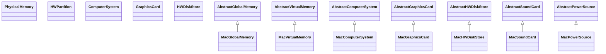

# oshi-core-5.8.5.jar

[Group index](README.md) | [All archives](../README.md)

## Scope and provenance

- **Donor:** `SQX_145_REFERENCE_ROOT/internal/libs/oshi-core-5.8.5.jar`.
- **SHA-256:** `fe16bd8836eecf3d152585c2151322273b68237d13f223e662e0db959dd13680`; accessed 2026-10-06; captured `2026-10-06T18:54:51.906614+00:00`.
- **Classes:** 482 raw entries; 482 unique entry names. Duplicate occurrence indices are zero-based.
- **Inspection:** read-only ZIP hashing and class-file structural parsing; signatures/descriptors, modifiers, hierarchy and references only. Bytecode bodies are hashed, not published.
- **Allocation:** proposed `FEAT-HOST-OSHI-CORE`, P01; [roadmap](../../sqx-full-application-roadmap.md). Domain README registration remains required.
- **Repository:** `01067f00031428613c6394064ca1bcadc1ba00ee`; review state unreviewed. Download label 145-dev1; installed build/activation and runtime equivalence unverified.
- **Limit:** every class/member is inventoried; declaration coverage does not establish consumed calls, defaults, formulas, failure semantics or algorithm parity.
- **Archive/resource index:** [096.json](../../../evidence/sqx145/archives/145/096.json).

## Complete member declarations

Member shards contain exact JVM names/descriptors, access flags, generic signatures, throws types, declared fields/methods, superclass/interfaces and referenced class names. All classes, nested/synthetic members and overloads are retained. Code length/hash is structural evidence, not a normalized algorithm comparison.

- [001.json](../../../evidence/sqx145/members/096/001.json) — SHA-256 `1927526e2fc0dafe678f4d028a5c9df922d66048c0ab8a297bb28b8e99b4cb87`.
- [002.json](../../../evidence/sqx145/members/096/002.json) — SHA-256 `c636542e7b4f92d3afe268a89cce8db65ff4a59d5e3ec7d6bc2649778dfc2cde`.
- [003.json](../../../evidence/sqx145/members/096/003.json) — SHA-256 `2d10839c2f16d33c931cbf51c82596e297f848d470628c3ba2f54b31c50e70d3`.
- [004.json](../../../evidence/sqx145/members/096/004.json) — SHA-256 `0bfa66ca1356260c1c072fd8a085bfdc3120081d104a02865b25bb2c3bff7627`.
- [005.json](../../../evidence/sqx145/members/096/005.json) — SHA-256 `d478d921f8b4b9a9b61b76839fd62239f59ce8ad45f04f2b046a522b56dd48e8`.
- [006.json](../../../evidence/sqx145/members/096/006.json) — SHA-256 `dcabd9ae3d6818d59a78b9c544427fffff279a372e8c09c9fd2105387770a2f9`.
- [007.json](../../../evidence/sqx145/members/096/007.json) — SHA-256 `3c373c495576a94971aa6e8ffd3dccada0bc8462772fa1dc5512ef8d01624ac0`.

## Focused structural diagram

Up to twelve non-nested classes; arrows show declared inheritance/interfaces only. External type names are not evidence of an available body or an executed dependency.

## Class inventory

| Archive entry | Occurrence | Class SHA-256 | Fields | Methods |
| --- | ---: | --- | ---: | ---: |
| `oshi/hardware/PhysicalMemory.class` | 0 | `1230b9b9195908868ab36e53dee2ff306b1d0af52d1e3c736afd8f443d7092f8` | 5 | 7 |
| `oshi/hardware/HWPartition.class` | 0 | `7ae2cb17f9da2c395747133e6ea6d1857b0ab75b3a34ec901f02ea84283e29b6` | 8 | 10 |
| `oshi/hardware/ComputerSystem.class` | 0 | `95564e207513d13048e255979e467b4b6272adb9bd384023026e82bd9a38913b` | 0 | 6 |
| `oshi/hardware/GraphicsCard.class` | 0 | `132ead76e247573e12c1deba3565900373f97acc5c15a09218cf6ee903f440b5` | 0 | 5 |
| `oshi/hardware/HWDiskStore.class` | 0 | `86df6a2910290bd827ba3008c49ee4e783d4ae6ae7aeff9edc43edb787616b20` | 0 | 13 |
| `oshi/hardware/NetworkIF$IfOperStatus.class` | 0 | `fa1ce012514f0528a2addab9cfd5bb97514c8c1f55ce7c2f097eb3067c7f9f37` | 9 | 8 |
| `oshi/hardware/platform/mac/MacHWDiskStore$CFKey.class` | 0 | `19e98f23c91f7a16fe60ada427327ef77a9c08f4472fd8573a015f9026780462` | 18 | 6 |
| `oshi/hardware/platform/mac/MacGlobalMemory.class` | 0 | `09a8cd38ef0b99bdeefc19d498f18af487c4fff84f9c9fb528865acedc0f3164` | 5 | 11 |
| `oshi/hardware/platform/mac/MacVirtualMemory.class` | 0 | `3b46f460c77de152d262a0cc266a078f2e6420c36bd927c3b80ab7d061a412ad` | 4 | 10 |
| `oshi/hardware/platform/mac/MacComputerSystem.class` | 0 | `5663570286e40437d31d1b3da3c02826752c0ec9cdd2e0b02f22c1dd1961b3ed` | 1 | 8 |
| `oshi/hardware/platform/mac/MacGraphicsCard.class` | 0 | `fe249f07aa34784b2964d4bff886865b7b0e6f902a4aa85147f16dfc2848f93e` | 0 | 2 |
| `oshi/hardware/platform/mac/MacHWDiskStore.class` | 0 | `e6b412aaa5f148cc91de809d2ca75b2fcb2a32df1fe89a64a15deb19c5e60d3e` | 11 | 14 |
| `oshi/hardware/platform/mac/MacSoundCard.class` | 0 | `632a7c0f1d4a2b2720cf90921ca1f9c0586e8c077eb7f861fc99ed9a32cfefcc` | 1 | 2 |
| `oshi/hardware/platform/mac/MacPowerSource.class` | 0 | `89f50f704ceefc305f931dc1a3d42ecafdf32bf0403bb92635e5a438cc22cf8a` | 2 | 3 |
| `oshi/hardware/platform/mac/MacUsbDevice.class` | 0 | `073b05bc7a1ec4daa77aa545f09d65e1f7e09467e7b4afb3563944d740c67bca` | 3 | 9 |
| `oshi/hardware/platform/mac/MacCentralProcessor.class` | 0 | `4d674e032eb763f07b4421a61c019f04a8489167bf852850751719dd994234d7` | 7 | 13 |
| `oshi/hardware/platform/mac/MacFirmware.class` | 0 | `3ca7abcec95fdb79e890bac2d5cdd3b1b4bbffc1e6e3222d6494edcacf79849d` | 1 | 7 |
| `oshi/hardware/platform/mac/MacNetworkIF.class` | 0 | `7ea55310123f5e882253843b5f06667e357e00338e1df790749f3fa7a4715307` | 12 | 17 |
| `oshi/hardware/platform/mac/MacLogicalVolumeGroup.class` | 0 | `6422fb31b31dba9f5fadb3ef1ee94dddaf33ef9c6000481914ec2ad942a9f0f0` | 4 | 5 |
| `oshi/hardware/platform/mac/MacHardwareAbstractionLayer.class` | 0 | `2803391e4d9d292f30852661be6f8100c33141315c527f33d9c28b6287b14b7e` | 0 | 13 |
| `oshi/hardware/platform/mac/MacDisplay.class` | 0 | `deb014796f8c12def8296fe3020e783b164d403fa12e4ba80b122d04307043ea` | 1 | 3 |
| `oshi/hardware/platform/mac/MacSensors.class` | 0 | `0f7b0caac7cc96b6ade137fe661554cee1096f4b3500a2fefc9bb1662cd891cc` | 1 | 4 |
| `oshi/hardware/platform/mac/MacBaseboard.class` | 0 | `9c24c973619902c600ff6f3fe319954966276b70b88a5bcb1d8c3ae328b132d5` | 1 | 6 |
| `oshi/hardware/platform/unix/freebsd/FreeBsdHWDiskStore.class` | 0 | `bf70d4a5c236abcddc9119b7dab0de656009edce83f670bb61225d4999948b91` | 8 | 11 |
| `oshi/hardware/platform/unix/freebsd/FreeBsdFirmware.class` | 0 | `ecb7c1106d5131e223984d965f324263f6f46cf83c86e87373fd91c174613028` | 1 | 5 |
| `oshi/hardware/platform/unix/freebsd/FreeBsdSensors.class` | 0 | `e6b13a40e7662ebea30513e28ae8295ff50d8c4e42acfa1c7910954378e45d59` | 0 | 5 |
| `oshi/hardware/platform/unix/freebsd/FreeBsdHardwareAbstractionLayer.class` | 0 | `7286ad8f7924504263ac223bb2cde56fadb6c9f75cc45a1dc4d78e39cb16ca78` | 0 | 12 |
| `oshi/hardware/platform/unix/freebsd/FreeBsdVirtualMemory.class` | 0 | `4b771b232ea385041cf99fe648a585f6040ec34dd6cd0241d8884289dd1d1f17` | 5 | 11 |
| `oshi/hardware/platform/unix/freebsd/FreeBsdGraphicsCard.class` | 0 | `c5ad8c84f7f78364ea31f6191a3f72b4f1f5a838f307f7b939b027d361e5007d` | 1 | 2 |
| `oshi/hardware/platform/unix/freebsd/FreeBsdGlobalMemory.class` | 0 | `3158145e8efcc45a8d5afbf5b6fbf79f3996784c88ad7f972a1c78e1eb398ed4` | 4 | 9 |
| `oshi/hardware/platform/unix/freebsd/FreeBsdUsbDevice.class` | 0 | `e255d263332c723825ecb996577d2966fc2f2852cc5e10d235d351bab0761b53` | 0 | 6 |
| `oshi/hardware/platform/unix/freebsd/FreeBsdComputerSystem.class` | 0 | `f150c6b6445f4ec148256066d3c5d5e777d134c04a48931ed3bb6ccdeb2cbc05` | 1 | 9 |
| `oshi/hardware/platform/unix/freebsd/FreeBsdCentralProcessor.class` | 0 | `66b2d607f40d5676bd29cc88d76b7516d3609f44cc7ef666112726707a59b602` | 2 | 15 |
| `oshi/hardware/platform/unix/freebsd/FreeBsdSoundCard.class` | 0 | `0f4a891b898bfa958979b2ae034016ac4b53d3574468a19709e5d282399278fb` | 1 | 2 |
| `oshi/hardware/platform/unix/freebsd/FreeBsdPowerSource.class` | 0 | `fbb8dc6c2582616f4d1cf17d2af3fbaecf44a16e7753fe5596b520366ef62d14` | 0 | 3 |
| `oshi/hardware/platform/unix/UnixBaseboard.class` | 0 | `0af4f821f9939cfda6b3736a28fa9fb4cf1394b6a34cafff51ea21e58d082635` | 4 | 5 |
| `oshi/hardware/platform/unix/openbsd/OpenBsdGlobalMemory.class` | 0 | `c422a168a43b7969e5a85e52a57696f55d597faa6589f976cca07f3a63be1eff` | 4 | 9 |
| `oshi/hardware/platform/unix/openbsd/OpenBsdHWDiskStore.class` | 0 | `19696f2f95cd499b20ac21558d86e708415ae1d6b26344e4497b8ba9f111e6d1` | 9 | 12 |
| `oshi/hardware/platform/unix/openbsd/OpenBsdCentralProcessor.class` | 0 | `d890bde3056e087196347fe2d1c08de93687653d1b9d08b3d0135811fc0f5420` | 2 | 14 |
| `oshi/hardware/platform/unix/openbsd/OpenBsdSensors.class` | 0 | `6f39a2b20dc89235a4c73184305fb9e50cf7106394bdd8fffe05e68b17bb0a7a` | 1 | 6 |
| `oshi/hardware/platform/unix/openbsd/OpenBsdGraphicsCard.class` | 0 | `6a4b1fded576a51c2d0f71375c478f6f869e9bd8514ac41e713bd70954212d1b` | 2 | 3 |
| `oshi/hardware/platform/unix/openbsd/OpenBsdVirtualMemory.class` | 0 | `3ea8bc7b6d633dcc846bcd77084820779645fd1217b8319d15521d8abeaf0a42` | 3 | 9 |
| `oshi/hardware/platform/unix/openbsd/OpenBsdUsbDevice.class` | 0 | `f0d4cfbc4d8ed0cb98085943f9a44ad1e4e26151464a6c8b8c5101e9dbcc4ce2` | 0 | 6 |
| `oshi/hardware/platform/unix/openbsd/OpenBsdFirmware.class` | 0 | `c2058fa0e9a55d980f71545b6d9f44408c05b8ed72ad08ad3323723847f15904` | 1 | 5 |
| `oshi/hardware/platform/unix/openbsd/OpenBsdComputerSystem.class` | 0 | `e70619cca6f4bfb548181233e886558efa7282edcba46253b7cdb1e9e746e40d` | 4 | 11 |
| `oshi/hardware/platform/unix/openbsd/OpenBsdPowerSource.class` | 0 | `0da1b66bf773afd4d7cb4626fa7e4171870382bf3c00bed0c78a98e489d12e6b` | 0 | 3 |
| `oshi/hardware/platform/unix/openbsd/OpenBsdSoundCard.class` | 0 | `eec3819b7fb7e4b0929c0ba249c66e966c8608ab88038eae3b0073033cf72591` | 2 | 3 |
| `oshi/hardware/platform/unix/openbsd/OpenBsdHardwareAbstractionLayer.class` | 0 | `8e1274bbf1f64fb404f9442593fc3ee7980663d0dd4328923cfdbc75096510ed` | 0 | 12 |
| `oshi/hardware/platform/unix/BsdNetworkIF.class` | 0 | `979b814d7238ad2ed073ea61a19dda3dae5b926e23f8afb88387264b1c947ea1` | 10 | 14 |
| `oshi/hardware/platform/unix/UnixDisplay.class` | 0 | `b6712dfeba1f3c810b7ba15e5ed777608540486825552611aad8d072d7fc2e5e` | 0 | 2 |
| `oshi/hardware/platform/unix/solaris/SolarisGraphicsCard.class` | 0 | `418ead3446f368ec0b9d7fe9109d05e494dc61a86187f40466751dac22cc578d` | 1 | 2 |
| `oshi/hardware/platform/unix/solaris/SolarisVirtualMemory.class` | 0 | `d12ecb0951149eae0d3bc964da0e6458689ce6273e0e8b117d5cad736e3f410f` | 6 | 11 |
| `oshi/hardware/platform/unix/solaris/SolarisSensors.class` | 0 | `80017bdf48835cbb77f7ea7df4b768c731f6d5e92b7b4cc6e6c643b7189d2b43` | 0 | 4 |
| `oshi/hardware/platform/unix/solaris/SolarisHWDiskStore.class` | 0 | `d76b24012690ab03693bd0b5e961da4133a80d6174eb0c28baddfebf4135e4dc` | 8 | 12 |
| `oshi/hardware/platform/unix/solaris/SolarisComputerSystem.class` | 0 | `e52172d244ef4932282ea2e5596b0dc54fd93810ffb98a775bff5c52a43a2d64` | 1 | 10 |
| `oshi/hardware/platform/unix/solaris/SolarisGlobalMemory.class` | 0 | `dd9dadaea278626c3d77f9034e221e877627460e5e09c28933aef5ff0fedc22d` | 3 | 7 |
| `oshi/hardware/platform/unix/solaris/SolarisFirmware.class` | 0 | `f00d1d0d8914c1ac257a239ac0f7b7c7ac494ddf2d69229cd2f37ec41d2cd3b7` | 3 | 4 |
| `oshi/hardware/platform/unix/solaris/SolarisComputerSystem$1.class` | 0 | `4d10aeca3b70b4bcb6d0a1915092a93c9fc14f01206855b209eb3c57826b87e9` | 0 | 0 |
| `oshi/hardware/platform/unix/solaris/SolarisCentralProcessor.class` | 0 | `fad2a5a21ab65a37c550ee94f56840114fc663dddb5a8ed22232fd43cb2ed9e1` | 1 | 12 |
| `oshi/hardware/platform/unix/solaris/SolarisComputerSystem$SmbiosStrings.class` | 0 | `8f1ac9ee92be8f3610f38df120a904c33bb03b56cd3b87b2e45a11086921340f` | 11 | 13 |
| `oshi/hardware/platform/unix/solaris/SolarisPowerSource.class` | 0 | `99559d0cdc177393b817b8c518bd435c7058bb34ed221d0db1d6ff7c16690d7a` | 2 | 4 |
| `oshi/hardware/platform/unix/solaris/SolarisUsbDevice.class` | 0 | `ab2e12003b7206396ff3d3bf0e34e6c88a0f750cb171f228c02ca8d1cde4e9ff` | 1 | 6 |
| `oshi/hardware/platform/unix/solaris/SolarisNetworkIF.class` | 0 | `06e645ee77fa05013abb5c082aaf8f9edb587b6ca283fd04766a3a981810295e` | 11 | 14 |
| `oshi/hardware/platform/unix/solaris/SolarisHardwareAbstractionLayer.class` | 0 | `7c4a739376016711f7de4b8de5a9e3fc75ac98d484d160d5b58fd2a0235a2eb0` | 0 | 12 |
| `oshi/hardware/platform/unix/solaris/SolarisSoundCard.class` | 0 | `fa9787c12981345c4c6fe933f634d4dfb0b8b7c1306766e789c7cf04d3206afe` | 2 | 2 |
| `oshi/hardware/platform/unix/aix/AixGlobalMemory.class` | 0 | `bb2096e055789fc8e45032368ac103cea5d7eac01eee33ba2cd39e4b66eb7121` | 4 | 8 |
| `oshi/hardware/platform/unix/aix/AixGraphicsCard.class` | 0 | `a280ea0c303a82a0ad9a8760c5882af42d48503ea1d38eb80fd372fea61cba84` | 0 | 2 |
| `oshi/hardware/platform/unix/aix/AixComputerSystem$LsattrStrings.class` | 0 | `35961dd9786bb89f5b27fcc8a2afa4a1f7b65871ca6f0c3553697c7497f013ee` | 7 | 9 |
| `oshi/hardware/platform/unix/aix/AixVirtualMemory.class` | 0 | `9bd722f1143c7e25d0681a9ad9cca0dbd814ee7e1b023877c93440de75b413c0` | 2 | 7 |
| `oshi/hardware/platform/unix/aix/AixFirmware.class` | 0 | `36e1f8e5ad9da005f5f424cd1aae2b181e61c7d39a2649fac8057d636b0c36c7` | 3 | 4 |
| `oshi/hardware/platform/unix/aix/AixHWDiskStore.class` | 0 | `5c841d4897fc68646ddbea18efad96b5b62c72bf8648cd7293ca074f6b5e1720` | 9 | 13 |
| `oshi/hardware/platform/unix/aix/AixNetworkIF.class` | 0 | `0cf0b4a46e931cf872204690d900b964e1fe8bb79ca73a12980ad3489d70985f` | 12 | 14 |
| `oshi/hardware/platform/unix/aix/AixPowerSource.class` | 0 | `39bedc8953ac77f02f997b2234567b70f5b60d8e4f095e70e4542ac5c987273c` | 0 | 2 |
| `oshi/hardware/platform/unix/aix/AixUsbDevice.class` | 0 | `e7968a7df9711e1dcd3999bcc469bed6ce40ddcad019c9ff8808bdbf16b2ce22` | 0 | 2 |
| `oshi/hardware/platform/unix/aix/AixComputerSystem$1.class` | 0 | `d91075629064219505e5d14dfc0a47d58a3571b721409b07d7cc1b31c48f6e1b` | 0 | 0 |
| `oshi/hardware/platform/unix/aix/AixCentralProcessor.class` | 0 | `fc1bced7267a5fec199bcf539e7ed1a756ed6cfbe7b66db5d18c3fe25897caef` | 5 | 12 |
| `oshi/hardware/platform/unix/aix/AixSoundCard.class` | 0 | `beb5f057f59541bf5410c9e3fb3ab29da39409cfd4393265a408827a8e10eb3e` | 0 | 2 |
| `oshi/hardware/platform/unix/aix/AixHardwareAbstractionLayer.class` | 0 | `d7fc124b54158e9ef071ecd013aa1d6087be2339a7e0ef01c3be79e0c20dce51` | 2 | 12 |
| `oshi/hardware/platform/unix/aix/AixBaseboard.class` | 0 | `15abdb53f46564af6dab0fd7b851e713e28685adb82b614d50b6c7965d5d6082` | 4 | 5 |
| `oshi/hardware/platform/unix/aix/AixSensors.class` | 0 | `35fd46bbaa79f57508e43c5e641029734d622136af3cca5441c1fc5dea523243` | 1 | 4 |
| `oshi/hardware/platform/unix/aix/AixComputerSystem.class` | 0 | `a23cb69024482997007d6c76233a69430a32a27111e8ae9e52063d6f6f5a7b9d` | 2 | 8 |
| `oshi/hardware/platform/linux/LinuxHWDiskStore$UdevStat.class` | 0 | `61040bb9f351c6cee281be9a5fb632d2fa2bca35f72c1a2a26b6cbf3b0f38ed5` | 8 | 6 |
| `oshi/hardware/platform/linux/LinuxPowerSource.class` | 0 | `1b5d7fe046db0bebe8b5f3f979b2d84a0591aa4d82885410a716ddb26f47bfa8` | 1 | 2 |
| `oshi/hardware/platform/linux/LinuxVirtualMemory.class` | 0 | `c68dcc41d04ac7f62b21ff103c268099fa9621ecbb5d268d72d7f467150f3aed` | 3 | 10 |
| `oshi/hardware/platform/linux/LinuxFirmware$VcGenCmdStrings.class` | 0 | `457695bc04105145e3a3a613e86e7a95eaf80623ac03d1398ea8ed7b2678d492` | 5 | 7 |
| `oshi/hardware/platform/linux/LinuxHardwareAbstractionLayer.class` | 0 | `6b36dd5757d4b391421edc5ce8996a60c72e35d86d9cbe9ace74dee4b0fbcaa3` | 0 | 13 |
| `oshi/hardware/platform/linux/LinuxComputerSystem.class` | 0 | `835b34d1d6696efbf937dc1646729e58c2b33cde21013fe9b6cd12f30f867ffb` | 4 | 11 |
| `oshi/hardware/platform/linux/LinuxSoundCard.class` | 0 | `bb7b5567d9456faf167b9dc30511ef536f48b431a4e3ea0368363abbe9bf8fc6` | 4 | 7 |
| `oshi/hardware/platform/linux/LinuxCentralProcessor.class` | 0 | `9b44d5fa14d35138e4c2d77ec714f23142617aca68eb535b102675899853316d` | 1 | 13 |
| `oshi/hardware/platform/linux/LinuxGlobalMemory.class` | 0 | `e248354e6c1840037905b6cbe1846c1bf1f49d08504cd7d983e3cc77c60315f5` | 3 | 8 |
| `oshi/hardware/platform/linux/LinuxUsbDevice.class` | 0 | `6607525e8ed792d712ae73c7c02795f9b5c912c9b8f423d97fa8d1c3ca5b4a6b` | 7 | 6 |
| `oshi/hardware/platform/linux/LinuxLogicalVolumeGroup.class` | 0 | `bf8f58a354385bf536ef7bc5646788f27b463afd474d7b3bcca02f5fd7f06035` | 5 | 7 |
| `oshi/hardware/platform/linux/LinuxSensors.class` | 0 | `dd8e665fee89045450a490fa66606e54f29e204423c4d64376aa1a464a6089e7` | 10 | 12 |
| `oshi/hardware/platform/linux/LinuxNetworkIF.class` | 0 | `ac7833b0d321b52820dffd3ca30b86093beb0737fd8f1eb6fb834aa94b827fcc` | 15 | 20 |
| `oshi/hardware/platform/linux/LinuxGraphicsCard.class` | 0 | `e2c794a94dee4d9f91a039b8906c8a235ad5096b4b092c50bdfd21832a41da14` | 0 | 5 |
| `oshi/hardware/platform/linux/LinuxHWDiskStore.class` | 0 | `63312baf301cf49546b5e4c0edfa6c00735da31c1152322704e6655cdf8f9f5a` | 28 | 18 |
| `oshi/hardware/platform/linux/LinuxFirmware.class` | 0 | `71fcbaa5c612a557c5b3c96ff73e4e8e365051fb9e18f1a22b9141bfbb7b951f` | 8 | 13 |
| `oshi/hardware/platform/linux/LinuxFirmware$1.class` | 0 | `b7e0bfe82592362dce3de11bdf7f56961b7ba50692f56e4c8e560f5728f73c76` | 0 | 0 |
| `oshi/hardware/platform/linux/LinuxBaseboard.class` | 0 | `996042b0ac921e29e11b1bde747e0f11f972aa318a0bb2b7bf1954f4b645a2ae` | 5 | 9 |
| `oshi/hardware/platform/windows/WindowsHWDiskStore$PartitionMaps.class` | 0 | `5bdbd57d34e364ca7e46702d483a26be4db44a35bee28d06f5794f1375e9bf6f` | 3 | 5 |
| `oshi/hardware/platform/windows/WindowsBaseboard.class` | 0 | `193461e139152610232e27d30c1096523b0bdc5171fc3f09e2ca3593722fb3df` | 1 | 6 |
| `oshi/hardware/platform/windows/WindowsSoundCard.class` | 0 | `96e54bcb896bdd3527664d9e28da0d62b289c09838549b4c820508cabd87d606` | 1 | 2 |
| `oshi/hardware/platform/windows/WindowsFirmware.class` | 0 | `1ec2a8d69a75dd2d31897a433b14e2b56959ab2cd1d901f47f6b9526208b1e31` | 1 | 7 |
| `oshi/hardware/platform/windows/WindowsCentralProcessor.class` | 0 | `f5b2464708804a42f3b08f48d2a1c722bda7b55405045c4a59ec262323f63f68` | 2 | 13 |
| `oshi/hardware/platform/windows/WindowsUsbDevice.class` | 0 | `b52473ea9a8a12932940f835d09c6340942fe8fae09ed5d52599f2a04887df53` | 1 | 7 |
| `oshi/hardware/platform/windows/WindowsHWDiskStore.class` | 0 | `18827210935066cb0578825c594b5cb36d4c24c7346bbbb3a6bd59d4d3fd914c` | 12 | 16 |
| `oshi/hardware/platform/windows/WindowsHWDiskStore$DiskStats.class` | 0 | `e53b40496ee3d503c61aa6eb78b70cf71fc221bc9c35b10a3bb0cee8f0c9d69b` | 7 | 10 |
| `oshi/hardware/platform/windows/WindowsHardwareAbstractionLayer.class` | 0 | `fe2f8c3b1559e903d0eac82051de52fa44c3694313f650187b193e5a239bb85b` | 0 | 13 |
| `oshi/hardware/platform/windows/WindowsNetworkIF.class` | 0 | `c5a9445c995d446a7c926a029a3acbfcfa8fa69c56721ac8bb431c7d67d0c3bf` | 18 | 19 |
| `oshi/hardware/platform/windows/WindowsLogicalVolumeGroup.class` | 0 | `2e2af727447c8c3cd08614fe4357cc6774d9432b679097d2b54f3d52d581185b` | 5 | 3 |
| `oshi/hardware/platform/windows/WindowsPowerSource.class` | 0 | `4a6ec5fd34127787282934df6b438807d0f2caebe8777053fb35266265605e52` | 12 | 5 |
| `oshi/hardware/platform/windows/WindowsHWDiskStore$1.class` | 0 | `50fbf5b8c99842a2b47e167abde90059737303f56517a44a237812f46a927b36` | 0 | 0 |
| `oshi/hardware/platform/windows/WindowsGraphicsCard.class` | 0 | `b94750e384a9f01ccf8653dbd3499013a83e948165b228012e6fb051ffea6fb5` | 1 | 3 |
| `oshi/hardware/platform/windows/WindowsVirtualMemory.class` | 0 | `22fbbd066952efebafb59129ecc9f8c7921754ca5650dfdf0540097b0188f2fd` | 5 | 11 |
| `oshi/hardware/platform/windows/WindowsSensors.class` | 0 | `16124008667ffd0cb6c935b41dfaf33cff7cfc967ee34e4737b7b0e1764f19a4` | 2 | 11 |
| `oshi/hardware/platform/windows/WindowsGlobalMemory.class` | 0 | `0d65e8f753a324dbcd01d35dd3e9b36dac8deddb3ba40dbbcbf9339177b63ecd` | 4 | 11 |
| `oshi/hardware/platform/windows/WindowsComputerSystem.class` | 0 | `2a3c506d2c9bd2e4d527cf26971c7f0437b6ef2b5f60286f29b784a8250737e1` | 2 | 10 |
| `oshi/hardware/platform/windows/WindowsDisplay.class` | 0 | `d309790a94aab969c1b45659b9765f370ba95cef57701b2e5bdbae9c95e42b29` | 4 | 3 |
| `oshi/hardware/HardwareAbstractionLayer.class` | 0 | `f84fdd35b499cec8f81884c2fb0e82d310639f5113b31e62108c66544be93ca3` | 0 | 13 |
| `oshi/hardware/LogicalVolumeGroup.class` | 0 | `5a96a54b45a5747f4731fbd83a74e14dea37d5ae3698b93e2753cfd600f88e76` | 0 | 3 |
| `oshi/hardware/GlobalMemory.class` | 0 | `5df8f0020b2ea3c73448e8800bc64218424a10919250a06a4dde63162c5064ad` | 0 | 5 |
| `oshi/hardware/common/AbstractBaseboard.class` | 0 | `aa6d574819a9d30ae1eea4e9ae8a31b17c393adb615e3fc785691277727cc327` | 0 | 2 |
| `oshi/hardware/common/AbstractVirtualMemory.class` | 0 | `5c5854540d7b5209ccc41441a59c14244c8a19559c058ebf4401ea653f5b3480` | 0 | 2 |
| `oshi/hardware/common/AbstractNetworkIF.class` | 0 | `024ec0433d5196f527ed890de8248574a1d4daa80ff9efd9df44c1086a6394a9` | 13 | 20 |
| `oshi/hardware/common/AbstractFirmware.class` | 0 | `edb65eb4477f799fc319747e7600617e45edbaabb567e752fd2c535eb65d7b3a` | 0 | 5 |
| `oshi/hardware/common/AbstractHardwareAbstractionLayer.class` | 0 | `f1432c89e4ab2789f855cf8d484ca5adc2941372d94a5714613bdbc57e7dce3a` | 4 | 10 |
| `oshi/hardware/common/AbstractUsbDevice.class` | 0 | `1f1b4c6b340c5837cdc9ed5ed83bccbcae31255d3105a9ea94fb45fdc4702e28` | 7 | 12 |
| `oshi/hardware/common/AbstractCentralProcessor.class` | 0 | `e3996510139d61739918006e4e0924a0e5aaea8b2563269162075dcbba21702f` | 12 | 25 |
| `oshi/hardware/common/AbstractSoundCard.class` | 0 | `08cad54a36f0c7ab28de8d26b0e3b4db330bb33161d55638463222559f572925` | 3 | 5 |
| `oshi/hardware/common/AbstractHWDiskStore.class` | 0 | `eb750482d766165199dabdc14c940fde0e5da59d9f14d48766ef8e72bd5e17c4` | 4 | 6 |
| `oshi/hardware/common/AbstractPowerSource.class` | 0 | `59f51ca3104fc3086c06d6f264cde8baf1bbcc9c927eb3f91ab86132b1ed8bfe` | 21 | 26 |
| `oshi/hardware/common/AbstractGraphicsCard.class` | 0 | `8999a48d7e7ea85751df1c5b00ead139ad4f7f7656e9cff5daf0e4d3eefdf177` | 5 | 7 |
| `oshi/hardware/common/AbstractPowerSource$1.class` | 0 | `9d4c5cc5958e08d379ecc435d6300597bf238b91f2cf2e40f60b072977b8bca5` | 1 | 1 |
| `oshi/hardware/common/AbstractComputerSystem.class` | 0 | `fbd0e414738ecb068652326805931a07fc4c30337296292c9ee6fb184383ab93` | 2 | 6 |
| `oshi/hardware/common/AbstractSensors.class` | 0 | `9b685b2d7a45cf5c49f17680700a46203affa4f9d2dd9daa0123e53b08c20ff2` | 3 | 8 |
| `oshi/hardware/common/AbstractGlobalMemory.class` | 0 | `8cc27aad983f1a66a953361b5dd59a5dedebc30fc60428254ce85a97909eac9e` | 0 | 3 |
| `oshi/hardware/common/AbstractLogicalVolumeGroup.class` | 0 | `8a9e5e512ddcadcd525c563c564db10d518267dfcaafa003241023287048bf37` | 3 | 5 |
| `oshi/hardware/common/AbstractDisplay.class` | 0 | `f249a8bc1cb3599a835260631c9b372fa940f7c7af12452cca3a0d27570034d2` | 1 | 3 |
| `oshi/hardware/VirtualMemory.class` | 0 | `db292edb3236f093aa28c9493a507f005882af2b971c34c9da503960c8dc9d8a` | 0 | 6 |
| `oshi/hardware/CentralProcessor$LogicalProcessor.class` | 0 | `d30ec969dfe89184297ed05a4d286fe5710784878cdc5666d9e1bd34c9ef32ce` | 5 | 9 |
| `oshi/hardware/Display.class` | 0 | `f0224ca8b4234e561e80656567f339e1cd8538da770ed3eb6977622ace3e5ac1` | 0 | 1 |
| `oshi/hardware/Baseboard.class` | 0 | `bed9af2b0d6060c5b8948df0e45705873623d4c5760bf06f74504c5873b82ecd` | 0 | 4 |
| `oshi/hardware/Sensors.class` | 0 | `22f01fc9a17bec9d5f3bb63cb38bcb8d34511a074ce50873951f94d73708f833` | 0 | 3 |
| `oshi/hardware/CentralProcessor.class` | 0 | `c2a841527300beec55fb2b991377db14de9e2f2d284f2aa8bfe77d34c26dc960` | 0 | 14 |
| `oshi/hardware/CentralProcessor$TickType.class` | 0 | `4416c6f03ee46c792f72f29744632b8236269a687daee0fa3ad2e29bcaf08ed8` | 10 | 6 |
| `oshi/hardware/Firmware.class` | 0 | `cd28b11b6fb40f148d97a1891f5d78a4d029e3fd15866fa169dbe301546d6dfb` | 0 | 5 |
| `oshi/hardware/SoundCard.class` | 0 | `795e408f3f856926b495806bbb5ac71a8d354036083ac31b6fc73061af870905` | 0 | 3 |
| `oshi/hardware/PowerSource.class` | 0 | `9e78ec6fe4a5931bea933311cf9a2e56744b907485c2adee591bac6ca56118c9` | 0 | 22 |
| `oshi/hardware/PowerSource$CapacityUnits.class` | 0 | `663e3384034112b7e8aadc1d5830865adc3c2b3aeb19e0aff3cc049bb26a7e65` | 4 | 5 |
| `oshi/hardware/UsbDevice.class` | 0 | `fee3c9b1dc562aa681936092c8995fd25cec64053ff8595f09ff779e052a5a34` | 0 | 7 |
| `oshi/hardware/CentralProcessor$ProcessorIdentifier.class` | 0 | `d970354e011539c221aab371e67564af1edb19028a8a9958b02efe5c74513d05` | 11 | 14 |
| `oshi/hardware/NetworkIF.class` | 0 | `8856974eaaec302920878a880d218f8b23186ff8ec8bbe90a73b8a427307ea77` | 0 | 27 |
| `oshi/util/Constants.class` | 0 | `3fbae0d4c1f0b5cd2b2cc0f0b4007856c8662c169d96c4820ced59ca97071d63` | 3 | 2 |
| `oshi/util/Memoizer$1.class` | 0 | `9271b17f946f610fc2e18063bd12a92170acc4b5a41e0ff004f137c6afde2c2d` | 5 | 2 |
| `oshi/util/ExecutingCommand.class` | 0 | `ccce8f01c05a1d1d34eb8b572e632bcf2f97705773dd21411d52d1423c6127f8` | 2 | 9 |
| `oshi/util/tuples/Pair.class` | 0 | `791b4838fdf4e9f22cbed8dcf261982bb7904d41529217ee4de11947c8f58061` | 2 | 3 |
| `oshi/util/tuples/Quintet.class` | 0 | `13b93e0b93d61ecb6a277c29e8049f3aed09ae53c5da0f87f1e4a315ff06e961` | 5 | 6 |
| `oshi/util/tuples/Quartet.class` | 0 | `a9ad814e53c89d0da2321f85d5e9ae5d27081045eec4e45beb70b1a372b140ad` | 4 | 5 |
| `oshi/util/tuples/Triplet.class` | 0 | `45078b4483f29cf01a6a7f24f3488a57bef247f2cc759bd8541404ad1bbacbd2` | 3 | 4 |
| `oshi/util/platform/mac/SmcUtil$SMCKeyDataKeyInfo.class` | 0 | `1a4d0c4f077864030b05293fecc8c5147e0ab641bdca603e76795b2bd0926629` | 3 | 1 |
| `oshi/util/platform/mac/CFUtil.class` | 0 | `1b8b7c299965ca708ab2ca7f201841abdb13c0f52876e06e0007157b3a12e8fa` | 0 | 3 |
| `oshi/util/platform/mac/SysctlUtil.class` | 0 | `e7d95f5cedc707f3e69adaf00cdb5550e9ff4c43d4b6c58911b52974026ff502` | 2 | 7 |
| `oshi/util/platform/mac/SmcUtil$SMCVal.class` | 0 | `a3cc3afdbcf643961aae1f7e3a96206a4b9ea19a0adc353d5b6e4eab4f509044` | 4 | 1 |
| `oshi/util/platform/mac/SmcUtil$SMCKeyDataVers.class` | 0 | `5ef8548eb711bec7b9315f6ad1e7cb271b0c5c94971d97a4a33e4137180b3d51` | 5 | 1 |
| `oshi/util/platform/mac/SmcUtil$SMCKeyData.class` | 0 | `adeb402c9417a7da05e16a56278d0da5b876056f0d059d68bbc4712dd6112fb6` | 9 | 1 |
| `oshi/util/platform/mac/SmcUtil$SMCKeyDataPLimitData.class` | 0 | `b78f849dcd8b51939563066701ad1edaac12dd66b6cb3454de6809319133c1ad` | 5 | 1 |
| `oshi/util/platform/mac/SmcUtil.class` | 0 | `6d12fca9621bb31301a95b16bf4782026efcebe5e36c1766a8dec9add224e42f` | 13 | 9 |
| `oshi/util/platform/unix/freebsd/BsdSysctlUtil.class` | 0 | `6ab1f657da262582a30d9e9fe530aa07476bda24be64f636f17936c2f0418042` | 2 | 7 |
| `oshi/util/platform/unix/freebsd/ProcstatUtil.class` | 0 | `fbc95bf4165019cc5148da30f3016bce3a8296d53ecefbcd86e7a5367266045c` | 0 | 4 |
| `oshi/util/platform/unix/openbsd/OpenBsdSysctlUtil.class` | 0 | `83ae811d7067c29e71fe5d6469499af5f677adc553f9f8762eea490f8c1ac732` | 3 | 10 |
| `oshi/util/platform/unix/openbsd/FstatUtil.class` | 0 | `2a6dd0742aad7b300b7ad01b78f1a9f1905a4dd51b073a8f1adc782f295466ba` | 0 | 3 |
| `oshi/util/platform/unix/solaris/KstatUtil$1.class` | 0 | `005658f0e131e2076cf956dfa176d7675003b6b4a72bd1baaed0bb60459076a5` | 0 | 0 |
| `oshi/util/platform/unix/solaris/KstatUtil$KstatChain.class` | 0 | `d86d87363085c237d5e0eadaf57e16ceb6805563b110d95fac1f52854bc127ef` | 0 | 7 |
| `oshi/util/platform/unix/solaris/KstatUtil.class` | 0 | `a907d7f44f35d50467f8b001120487197786d147c04420ddcf1706ec194028fc` | 4 | 9 |
| `oshi/util/platform/linux/ProcPath.class` | 0 | `e57bef11968bc58088e1d27995b984e436cdc93cca7e0c8543ccb2b6a21af29f` | 26 | 3 |
| `oshi/util/platform/windows/WmiUtil.class` | 0 | `52c5d8c0e0527b5b3e2064ea8c1e5212603cd878a9d9b536ae07a8806e92171b` | 2 | 14 |
| `oshi/util/platform/windows/PerfDataUtil.class` | 0 | `e90802d2a4c5e7b4832901c81535c3d40329b0d1b0a32c7758ec3c5cfa0d63b1` | 5 | 9 |
| `oshi/util/platform/windows/PerfDataUtil$PerfCounter.class` | 0 | `8d0b9af4ced99be1ac27ff13bd481048d3ec36dddbeceec48715660f73ce29b6` | 3 | 5 |
| `oshi/util/platform/windows/PerfCounterQuery$PdhCounterProperty.class` | 0 | `aaefda10eddb508e84e4abfa94c2bc0be773699f3003a3b1eca43474d99bb2c8` | 0 | 2 |
| `oshi/util/platform/windows/PerfCounterQueryHandler.class` | 0 | `b5a2117c4ba9e5efc5ed37d392c021757734242e657c3825e10d67910f5da798` | 3 | 8 |
| `oshi/util/platform/windows/WmiQueryHandler.class` | 0 | `743038b3cc626afad74df506566a0b465e8e384c74583a653aa7a82f9ce2201b` | 9 | 15 |
| `oshi/util/platform/windows/PerfCounterWildcardQuery$PdhCounterWildcardProperty.class` | 0 | `682e3e5aef86875f12ad2377ef74f95412085ae3dd84f33906254a1142f84238` | 0 | 1 |
| `oshi/util/platform/windows/PerfCounterQuery.class` | 0 | `26bc0cb2ccfb4d6e2500fcf1ad0a9a8dc3d2ebfb2ca1ad7d2d0cc726b2930d55` | 8 | 7 |
| `oshi/util/platform/windows/PerfCounterWildcardQuery.class` | 0 | `3603cffa9e811375ea8e4115b0254ecc378681e659171d8b47c41d4aca6267f5` | 2 | 6 |
| `oshi/util/Memoizer.class` | 0 | `20174ea967f023409cbe8dd2dba518d63d40f347a4b98b91dde2b3ee001d41d4` | 1 | 6 |
| `oshi/util/Util.class` | 0 | `d49d64e0644bd76bd3c2ededbffd3f52446de1c8363d0be8b0aa63cc7c5d5fa8` | 1 | 6 |
| `oshi/util/GlobalConfig.class` | 0 | `dfaafbe5f1f7407924d694fec73e10473d106b0d39e1a17e951e2e67dc60004e` | 2 | 10 |
| `oshi/util/EdidUtil.class` | 0 | `7a7b43433990fff9a9ecad9ca4ccaa35b238b7432bb86d6c8fbda7a70ae09544` | 1 | 18 |
| `oshi/util/FileSystemUtil.class` | 0 | `b41a471ed01991c1d5646e2331240c9466db5cb8a649f0003eb73d308ebe6b94` | 2 | 5 |
| `oshi/util/FormatUtil.class` | 0 | `f3b39cd8aa614b411cb304171e893231e5e5213b9e6a72647f0aa91834ca0602` | 14 | 13 |
| `oshi/util/FileUtil.class` | 0 | `59d8d80b6c892dd200278cb555c3a762418465a42858b6ace92d10540b7e4cfb` | 3 | 14 |
| `oshi/util/GlobalConfig$PropertyException.class` | 0 | `9b50073a7e5330f1918c6f71550ffd01ea4a9bfa006078db3880487313541360` | 1 | 2 |
| `oshi/util/LsofUtil.class` | 0 | `d741b03133d5f2bb23a786faae750625ef465ab50c388b8b1627589493a928a9` | 0 | 4 |
| `oshi/util/ParseUtil.class` | 0 | `2e9736507d454d06e3cd49ab19c28cc58ea68be39ada1e6726e3288b94cd7431` | 27 | 56 |
| `oshi/SystemInfo.class` | 0 | `ea5c56a9a5c585528a6d80aa31323fdfe3963a06041f766db55424819f2e3e9d` | 4 | 8 |
| `oshi/driver/mac/net/NetStat$IFdata.class` | 0 | `912326c2786f7d6eb7b83da5602e5866579c576664691258e77f02ac321bb195` | 11 | 12 |
| `oshi/driver/mac/net/NetStat.class` | 0 | `735feec9eaf1108306e01052496a3e55b11229cde05b45eb04d47c42ff76f537` | 5 | 3 |
| `oshi/driver/mac/Who.class` | 0 | `9d5d42c42b1a2d90d17391e8480d91783065ba2d9118463fa3a69f4571880031` | 1 | 3 |
| `oshi/driver/mac/disk/Fsstat.class` | 0 | `7e7c600f49ed5558e51858af52df10cb17d600a2a31c17cfbf41a7535ec2ac29` | 0 | 4 |
| `oshi/driver/mac/WindowInfo.class` | 0 | `a39223f16e4b9cfe9f200975d74f902e28fa1035becaf632d5507d6977b57860` | 0 | 2 |
| `oshi/driver/mac/ThreadInfo$ThreadStats.class` | 0 | `2951dce55c748b56e57ed8eb582c6bf50008e4996e3f6ce0a8ecf50cbb172f01` | 6 | 7 |
| `oshi/driver/mac/ThreadInfo.class` | 0 | `8d3fbe19052a71468987209d89860e1f182cd2a60ad2cc846e8c8ede3c47d133` | 1 | 4 |
| `oshi/driver/unix/Xrandr.class` | 0 | `bc53ae995dfa87ed74b62c9c66fba2890aa3acc5a0836791b51271157aab6f0d` | 1 | 3 |
| `oshi/driver/unix/freebsd/Who.class` | 0 | `4e452689b8ef99fe6b31144392969c44c6488e6b8a0c3dfc2d9395c152750599` | 1 | 3 |
| `oshi/driver/unix/freebsd/disk/GeomPartList.class` | 0 | `14c7a3d7879744eee7c3aad56b140d195bef99d221f759ec6a7ed75a7faa0c15` | 2 | 2 |
| `oshi/driver/unix/freebsd/disk/GeomDiskList.class` | 0 | `61f47b7ef2297bda50a7e6603f778ac45ecb4cb0c5c2e910ccf4794067d1db4e` | 1 | 2 |
| `oshi/driver/unix/freebsd/disk/Mount.class` | 0 | `178fbef845f8d715750203f4cff242b4018b4db4e13c5c5339e542f50956b5a7` | 2 | 3 |
| `oshi/driver/unix/Who.class` | 0 | `b07dbb38437427734f5674ce7c08364ab61b16401ea136b555a6dfc6b44fdf39` | 4 | 5 |
| `oshi/driver/unix/openbsd/disk/Disklabel.class` | 0 | `50f00f6cc4af0fff66dfb1a55235d4ef4f3d10e1bbfdfbe1c719b40d3e7e8326` | 0 | 4 |
| `oshi/driver/unix/solaris/PsInfo$LwpsInfoT.class` | 0 | `401c0bdfdc93f132f3b50c44454608a06fc1f219aa1615b0000bc3d8a850d289` | 26 | 7 |
| `oshi/driver/unix/solaris/PsInfo$PsInfoT.class` | 0 | `e5405cee5ad31243f518a33cfe3d72006b6a234089f092ad82b118a859a938eb` | 39 | 7 |
| `oshi/driver/unix/solaris/Who.class` | 0 | `0e9ef942d1c19ef6c6265a712f5731e37ff109e97d07e88e1174e293a61e7953` | 1 | 3 |
| `oshi/driver/unix/solaris/disk/Lshal.class` | 0 | `845cc2aeb19ce0833b7f0b2ba55bfcde8f754b5ca83d6d57df4e28a32954e3dd` | 1 | 2 |
| `oshi/driver/unix/solaris/disk/Iostat.class` | 0 | `8e354d011538e1e4bd0233759741aede617e3377942632a182d2e6beca469c58` | 4 | 3 |
| `oshi/driver/unix/solaris/disk/Prtvtoc.class` | 0 | `a1dfbf6822f7cd987b05173127c01e2bed5494ce8669ec4f95056c2850f5b6a8` | 1 | 2 |
| `oshi/driver/unix/solaris/kstat/SystemPages.class` | 0 | `fdb796e3213dfda9f8feba3cfb919e21b1f7899267dddb407bedb2c7efa3a3d6` | 0 | 2 |
| `oshi/driver/unix/solaris/PsInfo.class` | 0 | `aa3a2f9fabe81369c8178b20f74c7cb34981e50193815294da2af911508457b3` | 6 | 9 |
| `oshi/driver/unix/NetStat.class` | 0 | `bc2b2bc2176f3ca48c4c72f416bfa427fd858b33c9cb0541f8db99f3b8c743e6` | 0 | 6 |
| `oshi/driver/unix/Xwininfo.class` | 0 | `12b3cf0f4e3907d2bdb37152af58c39071c096eddbb8434687dca05ac5fe279d` | 3 | 4 |
| `oshi/driver/unix/aix/Ls.class` | 0 | `a864faa31b57c7089fe9e9b349dc05a785b4fa5fea7920c859e6aee1cfe71a1d` | 0 | 2 |
| `oshi/driver/unix/aix/Uptime.class` | 0 | `dfc76833abbabc9461188c951e9dbbc4d0ae09168a017c8c29b11985874a5288` | 4 | 3 |
| `oshi/driver/unix/aix/Lssrad.class` | 0 | `7248bfbf04e651de278a366bfb7fcf30e276ca5f5c35f77e8f18b662971ca498` | 0 | 2 |
| `oshi/driver/unix/aix/perfstat/PerfstatProcess.class` | 0 | `408759c4a331ed11e203e863fa2f5792cc43c5e247018a73254942c08ea98410` | 1 | 3 |
| `oshi/driver/unix/aix/perfstat/PerfstatCpu.class` | 0 | `9c6c534dc7d57561056542489bc2be76a02b7b0a24ed6aec99a1a9a22b1d4d0b` | 1 | 5 |
| `oshi/driver/unix/aix/perfstat/PerfstatMemory.class` | 0 | `ab97ecec1059852ca754980a52f9e86196fad588a9c7fe9224ff41a50e2400f1` | 1 | 3 |
| `oshi/driver/unix/aix/perfstat/PerfstatProtocol.class` | 0 | `0799099f91e5e84dab1d1b0dda01c505b1363df287bf265091e80a430f7f4dcf` | 1 | 3 |
| `oshi/driver/unix/aix/perfstat/PerfstatDisk.class` | 0 | `d6dd140f3098a2990854901b43938f1dde96c80d168c00bb9a33d65bb876d21c` | 1 | 3 |
| `oshi/driver/unix/aix/perfstat/PerfstatConfig.class` | 0 | `3bf92ac637973d3661bb536d0fe4ff5db88654362748bd9dd160112a746a4da5` | 1 | 3 |
| `oshi/driver/unix/aix/perfstat/PerfstatNetInterface.class` | 0 | `1234f66ed3bba11f83441072da94b65733fc0fe5f0ebc2e16d2404d8c6b0822d` | 1 | 3 |
| `oshi/driver/unix/aix/Lscfg.class` | 0 | `738644c7a97f7e093a2b9b984e6420a497b5cb6d65fba835c52b0cb49c6954c8` | 0 | 4 |
| `oshi/driver/unix/aix/PsInfo$LwpsInfoT.class` | 0 | `17a687dbc046be18aef513c6957aa99caa24811ea099f4a23fbfe31cbf1ee880` | 16 | 7 |
| `oshi/driver/unix/aix/PsInfo$PsInfoT.class` | 0 | `8e2a3677d4c8eff58598f5c08e8b2391181e91cd5e64fe19136a43ca6b1c432d` | 30 | 7 |
| `oshi/driver/unix/aix/Lspv.class` | 0 | `86f6ac9b819d9f5e35b2a155a348f1cd11fcd58fe06ad8252c9d13d0d784e715` | 0 | 2 |
| `oshi/driver/unix/aix/Who.class` | 0 | `8af31a1be8ff5f6bb6d19b23b5e487755fd6985f755804a50d738f3aaae19436` | 2 | 3 |
| `oshi/driver/unix/aix/PsInfo.class` | 0 | `2586b0f983e53537a67186ffcfff6e34c48112ae804ba3b0eeb6fadece1c4085` | 5 | 9 |
| `oshi/driver/linux/proc/UpTime.class` | 0 | `a67b4e3bdd7aa65a60c6d96a9271731f3823fafd24c37d83cc72f48651a91d36` | 0 | 2 |
| `oshi/driver/linux/proc/ProcessStat$PidStatM.class` | 0 | `5c7c61618861d582c37cc892ddf78722d19a5587352a30d06ebf3bfae3466b31` | 8 | 5 |
| `oshi/driver/linux/proc/ProcessStat$PidStat.class` | 0 | `042ec16fde5e1cbd815742d3d7a73c325924c43a448fb1ec0eebe7de55dd47bf` | 53 | 5 |
| `oshi/driver/linux/proc/CpuInfo.class` | 0 | `f45aecd4f7694bac9d01df91df9a94597be9b7abf91c6cdc6f1a18d064deb7ac` | 0 | 4 |
| `oshi/driver/linux/proc/ProcessStat.class` | 0 | `389bd0c4b0e6a666b3a44c0bf11b4d54bbb2a2d05ee83e3f5e24635da37b3e06` | 3 | 13 |
| `oshi/driver/linux/proc/DiskStats$IoStat.class` | 0 | `c8dc77581efef3e416f7f983ee0a921d9777aaf2f861714b8c15243c157eb5f5` | 21 | 5 |
| `oshi/driver/linux/proc/CpuStat.class` | 0 | `23a13265f5dd2561ba841cb83ba05c6c0c2647430d86f2e74ff164050d04f853` | 0 | 6 |
| `oshi/driver/linux/proc/UserGroupInfo.class` | 0 | `b3fec59272ddff8f963d4ddac9f5de78915792f059aebc9d95d13bfdbc334633` | 2 | 6 |
| `oshi/driver/linux/proc/DiskStats.class` | 0 | `9828b2f4b020f30efdc58973cfc9481889129e4bd6500b1befce323d624f0fcc` | 0 | 2 |
| `oshi/driver/linux/Devicetree.class` | 0 | `f7242b4fa78e44e45af0ca56b855a72f55888ac1fa176798d1ded7799f6443db` | 0 | 2 |
| `oshi/driver/linux/Dmidecode.class` | 0 | `a316fdd91f2062eec26f3ccbb603ef557a92fff82cab06a0aa9e61294f963d5c` | 0 | 4 |
| `oshi/driver/linux/Sysfs.class` | 0 | `13506e529449d83986d9b1819946d8512d71370f7dc9210eab15e9a3bb427479` | 0 | 13 |
| `oshi/driver/linux/Lshal.class` | 0 | `3f2fab75866b57081114969e226f681e5fb9732be37380c06fe66313b92d8aed` | 0 | 3 |
| `oshi/driver/linux/Who.class` | 0 | `21e8390dd06a03be64e2d7a0719f3a84059108f4fb5000debf01c3b871d98aad` | 1 | 3 |
| `oshi/driver/linux/Lshw.class` | 0 | `13ddef12a3a35547de01235456b63cac6b5abe76f37e56fc55dc5e6922847700` | 0 | 5 |
| `oshi/driver/windows/perfmon/ProcessorInformation.class` | 0 | `4e7505dc41f8ef636b9c82ea0bf29a4b3808bae7fad42c1da5a9e3690fadf14f` | 6 | 5 |
| `oshi/driver/windows/perfmon/ProcessInformation$HandleCountProperty.class` | 0 | `bd6b75fece268c442ed877386885a2249acfafddf126dfe1fad81bed28be4292` | 4 | 6 |
| `oshi/driver/windows/perfmon/ProcessorInformation$ProcessorTickCountProperty.class` | 0 | `a29655d90faf770ca224db6abbbe916dcbaeb816bc0454d6c8c5b1e8c90e710c` | 8 | 6 |
| `oshi/driver/windows/perfmon/SystemInformation$ContextSwitchProperty.class` | 0 | `82ca3afb2470e9a449d162e24ff57284d8a52bda840376d01c585698c9cbda26` | 4 | 7 |
| `oshi/driver/windows/perfmon/ProcessorInformation$InterruptsProperty.class` | 0 | `c2fea0dfc57fd5f8a209c87bf139ee6d6297388f0c62a8a67c12ccde6a2beedf` | 4 | 7 |
| `oshi/driver/windows/perfmon/ProcessorInformation$ProcessorFrequencyProperty.class` | 0 | `e3fcb43b150067e7678cda8726c3ca3770df2b647ad8c3a7131675e1e07e667c` | 4 | 6 |
| `oshi/driver/windows/perfmon/ProcessInformation.class` | 0 | `57c5d2f22e414fa4277baf5544b22646a1a624379709dad4a68d486afd7bc526` | 3 | 3 |
| `oshi/driver/windows/perfmon/PhysicalDisk.class` | 0 | `9693618e0876f60f88cdf67ed87df0fba5282590700be56e6ad37dca7157b2f3` | 2 | 2 |
| `oshi/driver/windows/perfmon/PagingFile$PagingPercentProperty.class` | 0 | `1ce04dc5cb9aecbf7bf447fa947bf0ba314c58600216ba54c5809814f5d1d1a2` | 4 | 7 |
| `oshi/driver/windows/perfmon/MemoryInformation.class` | 0 | `281ed4439ab2074c3fcf624802c2a83ed1ada51a64578102dc53f83295e73c4c` | 2 | 2 |
| `oshi/driver/windows/perfmon/SystemInformation.class` | 0 | `4637dd86697fafd8110d2f8b6fa60dcffeb6f0b14389d9473d241a5527b8e041` | 2 | 2 |
| `oshi/driver/windows/perfmon/ProcessInformation$ProcessPerformanceProperty.class` | 0 | `92173fb30cc3b76a07b140059d325b1f567fe5f4ba038d20586de5f75d4025bc` | 11 | 6 |
| `oshi/driver/windows/perfmon/ThreadInformation.class` | 0 | `06de5573afaab166ea16d74d352897d4a6486619b84e2b41c1d6fa45154fb6f1` | 2 | 2 |
| `oshi/driver/windows/perfmon/ThreadInformation$ThreadPerformanceProperty.class` | 0 | `647d5fefd276aed37b44e799e1b381e66bd747ea096f1c79b7af62d6e9190568` | 13 | 6 |
| `oshi/driver/windows/perfmon/PagingFile.class` | 0 | `ab734c7dcfccefde96d9fd6c249ac4580c4337265b250c6a47823983000434ab` | 2 | 2 |
| `oshi/driver/windows/perfmon/MemoryInformation$PageSwapProperty.class` | 0 | `21e226569e61e3f52522d11af2181e66085ca570736f6acd7457f988d963f4f8` | 5 | 7 |
| `oshi/driver/windows/perfmon/PhysicalDisk$PhysicalDiskProperty.class` | 0 | `20085801f584a64f1c3da63dbf41a50de3f9fef9946fd36e72de3dde5e34493c` | 9 | 6 |
| `oshi/driver/windows/EnumWindows.class` | 0 | `2bf2f6612d720199fa63af28031dfab4692a31cbc8a64f9be3192daa8be1d59f` | 1 | 5 |
| `oshi/driver/windows/DeviceTree.class` | 0 | `216d0946401cea010d7b222c3abe025a8caa091640ebd15ff4f6a117efa89df8` | 3 | 5 |
| `oshi/driver/windows/wmi/Win32DiskDrive.class` | 0 | `7c3dd659542a0e3742aac134fba39684146ca816cb612613a7c4e91dc49e3417` | 1 | 2 |
| `oshi/driver/windows/wmi/Win32Bios$BiosProperty.class` | 0 | `5a7ffa96717527e121abbc896f8d27b862822714a5563ea0b6103c31d0fedbd2` | 6 | 5 |
| `oshi/driver/windows/wmi/Win32ComputerSystem.class` | 0 | `7e8875e2447af225001c478078e73e3efbd00aef35394a4fa2b02b50da341ef6` | 1 | 2 |
| `oshi/driver/windows/wmi/Win32PhysicalMemory.class` | 0 | `1a9a91ff54a84f616e4735cb92cb2423891ad7258b6684282b71d78786a7009f` | 1 | 3 |
| `oshi/driver/windows/wmi/Win32PhysicalMemory$PhysicalMemoryPropertyWin8.class` | 0 | `4444a62a5974aa41c7eb749ec563982a48eb21e35006b3587c7c95b8ea62cd43` | 6 | 5 |
| `oshi/driver/windows/wmi/Win32Processor$BitnessProperty.class` | 0 | `b166a7203471847eb70ffaa45b0f61b7ad6d4cc5a3c2056161d7cfd3be750507` | 2 | 5 |
| `oshi/driver/windows/wmi/Win32BaseBoard.class` | 0 | `ed88ac2de33653b6ecbba58c5f85f3285d7cedcaec87242cdd2640cb8bd70029` | 1 | 2 |
| `oshi/driver/windows/wmi/Win32Process.class` | 0 | `d20b2c061a22d70f45540a9afefc91f44e00ef64bb3f04a97212a5a692ee3158` | 1 | 3 |
| `oshi/driver/windows/wmi/Win32DiskPartition.class` | 0 | `d93aa2c84fbb567483c8ba9605cc52726cfc3287dfc5c2c6ae3e85918de8d27b` | 1 | 2 |
| `oshi/driver/windows/wmi/Win32BaseBoard$BaseBoardProperty.class` | 0 | `d03e7efa524537bf8d70c105d32a1db2b6aa0cab8fd49a08b1dc300d15855d5d` | 5 | 5 |
| `oshi/driver/windows/wmi/MSFTStorage$PhysicalDiskProperty.class` | 0 | `6f26d3b3eabd4b317810d9e61d6a88480e8bbb85bc29d46ba68505187d9ae0e4` | 4 | 5 |
| `oshi/driver/windows/wmi/Win32LogicalDiskToPartition$DiskToPartitionProperty.class` | 0 | `5003fd588f7a4d4428fce71b5b1940707b81f4e114357d8b8f736bc34881855b` | 5 | 5 |
| `oshi/driver/windows/wmi/Win32ComputerSystemProduct.class` | 0 | `081b3b326d108bb0523ef1f8b9e86d06fd5c4ed232f7c29008475527e6a973f1` | 1 | 2 |
| `oshi/driver/windows/wmi/Win32DiskPartition$DiskPartitionProperty.class` | 0 | `926f962adc879f1176bf82781bdf26c25d0397fa504d9c20fd11cff5c6808d73` | 8 | 5 |
| `oshi/driver/windows/wmi/OhmHardware$IdentifierProperty.class` | 0 | `b80acd9480103a0418e47c850374ae448a1f2cf75b42aac3187a811a86e8bbf8` | 2 | 5 |
| `oshi/driver/windows/wmi/Win32LogicalDiskToPartition.class` | 0 | `7ead3c1a4e8b711fae2eb0119bb8e005524420861b2954ad43d6334600bf2e5c` | 1 | 2 |
| `oshi/driver/windows/wmi/MSFTStorage$StoragePoolToPhysicalDiskProperty.class` | 0 | `d128e8ab894fa7170e4afd5022739cb723ad773f898ae540ae2c6971e7168b54` | 3 | 5 |
| `oshi/driver/windows/wmi/Win32DiskDriveToDiskPartition.class` | 0 | `16c9f9dd0c5dd79699db1eb33a554594197488464118df87f885858fc26bf6e2` | 1 | 2 |
| `oshi/driver/windows/wmi/Win32Process$ProcessXPProperty.class` | 0 | `b5047404885eed183f01de4ada2365f3ed734738ba03e600260eccc52213efeb` | 9 | 5 |
| `oshi/driver/windows/wmi/Win32ComputerSystemProduct$ComputerSystemProductProperty.class` | 0 | `5b1e802b8ce8c378b444eb48ad598cc979bb8aa1d771e575240fd3ad47afcc5d` | 3 | 5 |
| `oshi/driver/windows/wmi/Win32LogicalDisk.class` | 0 | `8bbcf77edfc4d04dd82b04263d9ef0a27f958ac5c0c8be9413abae843da3d2ee` | 1 | 2 |
| `oshi/driver/windows/wmi/Win32OperatingSystem$OSVersionProperty.class` | 0 | `06147b350a5890feddb04ec7a5794661f83f48187c7b75f97805842584f1a01a` | 6 | 5 |
| `oshi/driver/windows/wmi/MSFTStorage$StoragePoolProperty.class` | 0 | `fc88a458a767d7232eb75e13bb241e738ccb4f0d5f116aeeb824f81f6d77d304` | 3 | 5 |
| `oshi/driver/windows/wmi/Win32DiskDrive$DiskDriveProperty.class` | 0 | `ac20af410ccdc22fe3b4e421a4721c8a6a0b1684401ff6263c2654063f770b35` | 7 | 5 |
| `oshi/driver/windows/wmi/Win32ProcessCached.class` | 0 | `6bda9a04d4b2a08eed414bbbf3eee1d870e232fe55f8969427983b1ac443e15c` | 3 | 5 |
| `oshi/driver/windows/wmi/OhmSensor.class` | 0 | `8d5208607716ee8349157e6dc98dbb0d3aa5762c2ee68f815f65480cf79a655d` | 1 | 2 |
| `oshi/driver/windows/wmi/Win32Processor$VoltProperty.class` | 0 | `e6b1a87a8767d8376283b756424f93c910b876fccfc547f95618d92e68f927d5` | 3 | 5 |
| `oshi/driver/windows/wmi/OhmHardware.class` | 0 | `9bc5c4a32f909cd7d20d1c600bd307871c65a81ea7365e0a0c7c5c12027c6c9f` | 1 | 2 |
| `oshi/driver/windows/wmi/Win32Fan.class` | 0 | `3f4b4df8198342781d5c9e21ab1fdf5d364ca4be67ed620805e24df2bb057d73` | 1 | 2 |
| `oshi/driver/windows/wmi/Win32LogicalDisk$LogicalDiskProperty.class` | 0 | `37b1093a464ce0be780e0305ff270e9ab048d2c276f9ff2ceb8f1f4b5655614d` | 10 | 5 |
| `oshi/driver/windows/wmi/Win32VideoController$VideoControllerProperty.class` | 0 | `826f6e982989b83cce2884625c43fa042f8ce9b4f33d6c82d87dd9139ea85233` | 6 | 5 |
| `oshi/driver/windows/wmi/Win32PhysicalMemory$PhysicalMemoryProperty.class` | 0 | `b824543b21d774084b50051dbb3b34b557b8d75a800e5635d92c447f83a8a24b` | 6 | 5 |
| `oshi/driver/windows/wmi/Win32Bios$BiosSerialProperty.class` | 0 | `338f6b5b91f2d3923d037062f0ddb352852b49930c5e9530bffe3199bd3b33f7` | 2 | 5 |
| `oshi/driver/windows/wmi/MSAcpiThermalZoneTemperature$TemperatureProperty.class` | 0 | `e2d5fbb508786f1a2788c9a5c4034b3c94e96c6fbb2f94de7905988bf73a9f14` | 2 | 5 |
| `oshi/driver/windows/wmi/Win32VideoController.class` | 0 | `ae0b415f78e006b9e36d815b1e87035ed7d31f3456d2f59b69656ff80e1416a2` | 1 | 2 |
| `oshi/driver/windows/wmi/Win32OperatingSystem.class` | 0 | `8a645dd5ac11273961e3d9957b1bb389884cde4fc16133cc7237a333da8616f6` | 1 | 2 |
| `oshi/driver/windows/wmi/OhmSensor$ValueProperty.class` | 0 | `e3f76728820e206b85cce1f9b728c365f5d9775f01c3d9c0a412827fbf060c48` | 2 | 5 |
| `oshi/driver/windows/wmi/Win32DiskDriveToDiskPartition$DriveToPartitionProperty.class` | 0 | `8d12e3a4887ff453ee792382378f74fbb7347bf5a350e5e1bab91db0c4b7b30d` | 3 | 5 |
| `oshi/driver/windows/wmi/Win32Fan$SpeedProperty.class` | 0 | `c93522dd2115a9feeaa2e55711162b00e20c3750659d6859d5bee742cf860332` | 2 | 5 |
| `oshi/driver/windows/wmi/MSFTStorage$VirtualDiskProperty.class` | 0 | `fc083398edb4a7a84c10647692c065fce2905494f0f0a92850efb0d909bc47d0` | 3 | 5 |
| `oshi/driver/windows/wmi/MSAcpiThermalZoneTemperature.class` | 0 | `e09e246fbeacb63029e548240ca10ae3ec231f743ddb22f6caaefeece44c19e7` | 2 | 2 |
| `oshi/driver/windows/wmi/Win32Bios.class` | 0 | `4ad077ae36469b97d3a13546ef3ff53f474cd0b94267735d570e3a62dd9065c8` | 1 | 3 |
| `oshi/driver/windows/wmi/MSFTStorage.class` | 0 | `fff9effd6b09cdd0b3b3a88078de8d6dcaa815882a2989bcf8b00c4b0d1d41d9` | 5 | 5 |
| `oshi/driver/windows/wmi/Win32Processor$ProcessorIdProperty.class` | 0 | `be2e88af2d823a2f8212a399e5e214bb1707ef3ee46bb3756c2b2adb0496041b` | 2 | 5 |
| `oshi/driver/windows/wmi/Win32ComputerSystem$ComputerSystemProperty.class` | 0 | `d6536762636695da0b7100539c749c8f903279b86486c32df6ced5253dd3867f` | 3 | 5 |
| `oshi/driver/windows/wmi/Win32Processor.class` | 0 | `fddd3919f2cb2f164db8b142dce972feecc64c8823e374d86226e67233165806` | 1 | 4 |
| `oshi/driver/windows/wmi/Win32Process$CommandLineProperty.class` | 0 | `0f8a99783ed554cf1a5f056e7b19623cc3e8595d548bce34cad37302c2fb2252` | 3 | 5 |
| `oshi/driver/windows/registry/ThreadPerformanceData$PerfCounterBlock.class` | 0 | `c912d6c34679c5181323d83f9b6b14371cd4f95d80118102a3cd9a47b9db0f54` | 11 | 12 |
| `oshi/driver/windows/registry/HkeyPerformanceDataUtil.class` | 0 | `236ddd8182e180d3361dfaa63cede38d00571cc93f62b5e92d585fe49711a37a` | 4 | 6 |
| `oshi/driver/windows/registry/ThreadPerformanceData.class` | 0 | `893426e18ac323a3ca7e4bf67da1b2f8c33f3a899cac66690cfb636b0088abac` | 1 | 3 |
| `oshi/driver/windows/registry/NetSessionData.class` | 0 | `7128ff1ad1295e1e5a488dcdb6fc44b85754fd873a21feb8489e5f20af6adc8a` | 1 | 3 |
| `oshi/driver/windows/registry/ProcessPerformanceData$PerfCounterBlock.class` | 0 | `1ae40386f6c78d89a2ed0761dad8d472201239108b139bdf44a8c277642bdb01` | 9 | 10 |
| `oshi/driver/windows/registry/ProcessPerformanceData.class` | 0 | `03cbdeb2088e3cae400579ecc5701b54aaac0fbf60068c7174b793d4b4b82d55` | 3 | 4 |
| `oshi/driver/windows/registry/ProcessWtsData.class` | 0 | `33955e89dab2b23e19581c13f8721909271ce050cd92e13724333398d6c168e8` | 2 | 5 |
| `oshi/driver/windows/registry/SessionWtsData.class` | 0 | `17ed2610013e6301b778ccc8104867a2bfa7feddb473b421be0150fffafc2fc9` | 6 | 4 |
| `oshi/driver/windows/registry/HkeyUserData.class` | 0 | `46abf62bc6b3215de073ed971fb20832b33d8ebf3db0feca71c0f1611d05d8c2` | 6 | 3 |
| `oshi/driver/windows/registry/ProcessWtsData$WtsInfo.class` | 0 | `5278d93591a5d80ebcbb82656cb82674f61388a5e6fa484fd88770ff7f2e5899` | 7 | 8 |
| `oshi/driver/windows/LogicalProcessorInformation.class` | 0 | `25edfcb2552e00ca9e41c4c5938a81ab2ac97f4c21c5e896a0936a4d41e46ac9` | 0 | 9 |
| `oshi/PlatformEnum.class` | 0 | `a5eaa3964d4e1434eadc2276c6d9879cef60be426cde81e1afedb03d33892913` | 16 | 8 |
| `oshi/annotation/concurrent/ThreadSafe.class` | 0 | `969e48532d1011b0663c752b158b2f464d8b6a66c6ff25479053fdf745a69c57` | 0 | 0 |
| `oshi/annotation/concurrent/Immutable.class` | 0 | `7465349f800f24cd8a1d5d8a8cf99d859b7c6e3114a4cc9d5cbcc3e293f27eca` | 0 | 0 |
| `oshi/annotation/concurrent/GuardedBy.class` | 0 | `1a316a10fe6e2f1929301abacfb96c258ed980b4d3736a3d668f403ca57ea01a` | 0 | 1 |
| `oshi/annotation/concurrent/NotThreadSafe.class` | 0 | `f09b8f671c5ef94f238825f7aaa881faf52e2d603876afcb8320b529d1a3b468` | 0 | 0 |
| `oshi/software/common/AbstractOSProcess.class` | 0 | `909513721339d4dd02d0e23a527f87774ff3554fdf330351ae41619c9331d5a2` | 2 | 6 |
| `oshi/software/common/AbstractOSFileStore.class` | 0 | `a0867d8cbaeb0d8672591529326b5e3a473ad33202c1c1ef0c1aafe71370e31d` | 6 | 9 |
| `oshi/software/common/AbstractNetworkParams.class` | 0 | `41e84d93258d63f867e9eba504073de7c880bf2887815cbc6bf1b08522b9a30d` | 2 | 7 |
| `oshi/software/common/AbstractInternetProtocolStats.class` | 0 | `c0d9cfae7971b0f9cc358ae997ccf347f704790ece810fdeb90d00fce0293285` | 0 | 4 |
| `oshi/software/common/AbstractOSThread.class` | 0 | `2433041dfc6d7beddd30271a65fe873aba4697b8cf6bd27a70a2bfc2a07c349a` | 2 | 6 |
| `oshi/software/common/AbstractOperatingSystem.class` | 0 | `620095ce2a802b3ae2fe431f0e132e490120d67ff5f819763c09a0839524dcdb` | 5 | 25 |
| `oshi/software/common/AbstractFileSystem.class` | 0 | `fb37dd3fb359f4e4e81f03067b16945bf86b72cfea557a8b02918b1b4c43fefc` | 4 | 3 |
| `oshi/software/os/OperatingSystem$1.class` | 0 | `e9d3807b0f78e0cfaef1c17923a05d26e013217764a617590d51faf19cbb5ee4` | 1 | 1 |
| `oshi/software/os/InternetProtocolStats$TcpState.class` | 0 | `e595969e915cb30727db9c053b3fb30cd2d1b7184821b1fe6be0f769076a1df2` | 14 | 5 |
| `oshi/software/os/OperatingSystem$OSVersionInfo.class` | 0 | `a4184cd8d9e9f7a1eeea2fcfb0dd5d35ed272a1031033d9c02eba59841521996` | 4 | 5 |
| `oshi/software/os/OperatingSystem$ProcessSort.class` | 0 | `812a3795ad8984f790253f6bee30295948e82a3d82c3ff8381335276221f392c` | 8 | 5 |
| `oshi/software/os/OperatingSystem$ProcessSorting.class` | 0 | `9cd9e2531f86acb5072d058be906b03a6cddce8f30782316cfc8406f8d1886ff` | 8 | 5 |
| `oshi/software/os/InternetProtocolStats$UdpStats.class` | 0 | `e245faedd14c4f09b0e6d6c08f052f4ffd01f1d3842d0552aa4f985b049ba4f8` | 4 | 6 |
| `oshi/software/os/FileSystem.class` | 0 | `9f681ee5c603dfe7b928674c1d93e8d821100859ee733815523eaeb808f6c6fd` | 0 | 4 |
| `oshi/software/os/OSFileStore.class` | 0 | `ec218ebe336e9539ef74d9db2454ffde52fe03d04f6d2f68d1aac5bc4cbcff54` | 0 | 15 |
| `oshi/software/os/InternetProtocolStats$IPConnection.class` | 0 | `957d82502856ddbe344c16740688449a610d6d9af53c16147587afd8f4167d91` | 9 | 11 |
| `oshi/software/os/mac/MacFileSystem.class` | 0 | `8234b023b7cd29e00436c99d7b2e90aa1c4c7ce252fead1fbdbb2d556bed1371` | 33 | 8 |
| `oshi/software/os/mac/MacOSFileStore.class` | 0 | `e7974dcf66f934dd8cd07c54ab905c106f5ab93085f49287b13392a0c3d40de5` | 8 | 10 |
| `oshi/software/os/mac/MacOperatingSystem.class` | 0 | `bb2e9656020fbd71f4b8b12fbad43abdfa79d893a789919071b7a0591ca81e0a` | 9 | 25 |
| `oshi/software/os/mac/MacNetworkParams.class` | 0 | `2a994b3c8fd340c2683f6d47ffc8bc17c1ffe9e2a9f2f6e97405b8770a789576` | 4 | 6 |
| `oshi/software/os/mac/MacInternetProtocolStats.class` | 0 | `dd977d508b7cfef16d1cf4f27815bbf644ce3379acadc4dc05a9832cec3cb28f` | 6 | 13 |
| `oshi/software/os/mac/MacOSThread.class` | 0 | `c02922a0002422552fe9b06f15ed4249d75cc3d8c15a85db041be5a5c25badff` | 7 | 8 |
| `oshi/software/os/mac/MacOSProcess.class` | 0 | `6ee77d9044e27add24415fd0717722b557f48c232a399795d9d698bbc924dbac` | 36 | 34 |
| `oshi/software/os/unix/freebsd/FreeBsdOSProcess$PsThreadColumns.class` | 0 | `e4f847b46d5b067a106a29cbc2d656e04fb4610457446d3c7d9d1733223f3bfe` | 13 | 5 |
| `oshi/software/os/unix/freebsd/FreeBsdOperatingSystem$PsKeywords.class` | 0 | `f95c61962c64e22a0f08618f506df97e1e8b4ccf8aaeeb3eec75033b52116430` | 21 | 5 |
| `oshi/software/os/unix/freebsd/FreeBsdOSThread.class` | 0 | `43a20b829823d664de1680079f7e875d6d4dcefbf06360e3ff73223c81f75744` | 12 | 15 |
| `oshi/software/os/unix/freebsd/FreeBsdNetworkParams.class` | 0 | `6041c84d8d965955ec9370ac91fa13f979c6d487c8ffd7c8a6ebf9fd9348d026` | 2 | 6 |
| `oshi/software/os/unix/freebsd/FreeBsdOSFileStore.class` | 0 | `1eafe754b6a9039758782d918d6816fe88599efe87a4e3eae99aa639845538bb` | 8 | 10 |
| `oshi/software/os/unix/freebsd/FreeBsdOperatingSystem.class` | 0 | `e3333bfaee1b15db8b8bc0c8d9b0ec2aa160230942f827ae8284f73992a3f8e1` | 3 | 23 |
| `oshi/software/os/unix/freebsd/FreeBsdFileSystem.class` | 0 | `25bc87ef48ac50bfbd8c47d46e584f12b11c983e4b1330d1293b9ccc804a0916` | 8 | 5 |
| `oshi/software/os/unix/freebsd/FreeBsdOSProcess.class` | 0 | `185bf5739f73e50770fc5c0278551d14cf2182337c94fa4499e6fbfe4094759f` | 29 | 37 |
| `oshi/software/os/unix/freebsd/FreeBsdInternetProtocolStats.class` | 0 | `7182114f4953011b001cb4b95bf5a2e5754ea973f299e9b24024cf5acf78be2d` | 3 | 6 |
| `oshi/software/os/unix/openbsd/OpenBsdOSFileStore.class` | 0 | `478239bf0e124c6b1e2613d2743bd08868c7a0ba8c25f1f5f7836a189bb0b979` | 8 | 10 |
| `oshi/software/os/unix/openbsd/OpenBsdNetworkParams.class` | 0 | `3f615c379265555f429fff2e9d1d7eda27283825db099d1d442bddcf2650481c` | 0 | 3 |
| `oshi/software/os/unix/openbsd/OpenBsdOperatingSystem$PsKeywords.class` | 0 | `039002549ea3953310ec9eb5e4079d7270fd17ff1aa24edd4de435f46f217bca` | 19 | 5 |
| `oshi/software/os/unix/openbsd/OpenBsdInternetProtocolStats.class` | 0 | `347cd86c06c8046f6443523d826ee9ab52c79ed018476a9ca76f128cf0b68173` | 0 | 3 |
| `oshi/software/os/unix/openbsd/OpenBsdOSThread.class` | 0 | `14b26b503669c576cbd6fe5c381d7dc155fe98eafe7f6e0abb2c961c48b45013` | 12 | 15 |
| `oshi/software/os/unix/openbsd/OpenBsdOSProcess.class` | 0 | `3b54b250c74b9a976ce0825193d05f1ad3bc2e2b446b81d86f39e4ce84ba5a60` | 29 | 37 |
| `oshi/software/os/unix/openbsd/OpenBsdOperatingSystem.class` | 0 | `f2dbde23ef95d628c06614caece4da23b11f8a47489eb474e623d44034e172ce` | 3 | 22 |
| `oshi/software/os/unix/openbsd/OpenBsdFileSystem.class` | 0 | `563a8c29633e8496e515631c992c5f74d041eb11ebe978f38859c90fb836192d` | 8 | 7 |
| `oshi/software/os/unix/openbsd/OpenBsdOSProcess$PsThreadColumns.class` | 0 | `49fe234fdbb41fd39e9388133a93045cddbfe2f432785887c994c210ff3744cc` | 11 | 5 |
| `oshi/software/os/unix/solaris/SolarisOperatingSystem$PrstatKeywords.class` | 0 | `6ea3428145975691b692461bea5613d09edf13fbe74cd9c06b5f162ff8a52193` | 16 | 5 |
| `oshi/software/os/unix/solaris/SolarisNetworkParams.class` | 0 | `aba8518b2ec85dab5bc2fe3ce5d28dfce6a7a462956255c94b804beb62b74e7b` | 1 | 5 |
| `oshi/software/os/unix/solaris/SolarisOSFileStore.class` | 0 | `4a1c134d837b7bd4ddd4029cc493dec1c9c19d4ee78e9f36e5ce7cbbcc1cc985` | 8 | 10 |
| `oshi/software/os/unix/solaris/SolarisOSProcess$PsThreadColumns.class` | 0 | `d940337b089021eefcb50fd2589585032b74ccf1d4d53edaad01111934287476` | 7 | 5 |
| `oshi/software/os/unix/solaris/SolarisOperatingSystem$PsKeywords.class` | 0 | `6bd7d868163e44e4aa7fff62a56ad7f2d8b643c9a9846302c2eef5f8fc8f7f84` | 16 | 5 |
| `oshi/software/os/unix/solaris/SolarisInternetProtocolStats.class` | 0 | `4b8f5c639fd3d111ed5896328df975873da71035d659f0de3026277498ee1135` | 0 | 6 |
| `oshi/software/os/unix/solaris/SolarisOSProcess.class` | 0 | `7af6490e1542e665a9bac4a60de63eac3fe5280d70dad6c94e356865106320ff` | 24 | 35 |
| `oshi/software/os/unix/solaris/SolarisOSThread.class` | 0 | `83fb398c4c176bf33d7dc4551f72580ff67764bb84f74d9863cb97e4ceb9fc3f` | 9 | 12 |
| `oshi/software/os/unix/solaris/SolarisFileSystem.class` | 0 | `7be4be2b61db55c772aec317ca6aee4a931cfe9c107c250e1b19b701ac0b54be` | 8 | 7 |
| `oshi/software/os/unix/solaris/SolarisOperatingSystem.class` | 0 | `592bca2a4575a0cba80249cea0ff84a218bf5ab54b4ae000919f70e8ab12e9cc` | 2 | 25 |
| `oshi/software/os/unix/aix/AixOperatingSystem.class` | 0 | `9366635f0293024ed63bbac12ecae1921974a259d62ddbb29aa254234b0833e2` | 4 | 22 |
| `oshi/software/os/unix/aix/AixNetworkParams.class` | 0 | `cb78ff7e27831b237b959085d9dd7f9da3de2dcd11c72cacc053c4d86e78d867` | 1 | 6 |
| `oshi/software/os/unix/aix/AixOSFileStore.class` | 0 | `89737c21c4574f809565e6c24f09a626dbde44e4f08853c3fb2ac4b5c596697a` | 8 | 10 |
| `oshi/software/os/unix/aix/AixFileSystem.class` | 0 | `fcf782e8d70204eb4075a6feb51ea24a1321a5f00e126d90438d3971657d284b` | 8 | 7 |
| `oshi/software/os/unix/aix/AixOSThread.class` | 0 | `e6ce760891ca21eb0251e2e30e638fa6127817fbfe8fbbb8a651c3fe5c110a9c` | 8 | 11 |
| `oshi/software/os/unix/aix/AixOSProcess$PsThreadColumns.class` | 0 | `d575341b3e30bf6f09229630acca381b9527d16b281f73bbe11f2a00e5b82534` | 14 | 5 |
| `oshi/software/os/unix/aix/AixOperatingSystem$PsKeywords.class` | 0 | `41f96ceb8fff25be60556bbb3a10654908492497db3d5dc48083cbb61462cc92` | 17 | 5 |
| `oshi/software/os/unix/aix/AixOSProcess.class` | 0 | `b2c8f0b93edb2e425bdf83f113881b009940e5362cb4e999acea4251946a00af` | 25 | 34 |
| `oshi/software/os/unix/aix/AixInternetProtocolStats.class` | 0 | `05596209eeeddabf937f06d966ebcc684210e4e057dfe6baaaa4a7e3cc3bd7be` | 1 | 3 |
| `oshi/software/os/OperatingSystem.class` | 0 | `9a37c21b33ab68efc65ffc5461c93c7e000dd18422b549bac9e1287859847031` | 0 | 24 |
| `oshi/software/os/OSService$State.class` | 0 | `a77bccc31338a4a4f64ac6c477cd24580289262ca2fb98cfe8930d706a7491c5` | 4 | 5 |
| `oshi/software/os/OSProcess.class` | 0 | `8aaef0dcfe12a3e707e512bfab0ee0ac0f8aeb7aba2fd1ce40855dbf84b946c2` | 0 | 33 |
| `oshi/software/os/linux/LinuxOSThread$ThreadPidStat.class` | 0 | `b245b22ea00390c086a4ebda7913fb48eb2e1d5a481ce366a9d0f9bbb0a91e73` | 13 | 6 |
| `oshi/software/os/linux/LinuxInternetProtocolStats.class` | 0 | `037f31d6d9fadafec9c323ad6c05155eda511f04f7c2b9a6f78023a514899286` | 0 | 9 |
| `oshi/software/os/linux/LinuxOperatingSystem.class` | 0 | `5992c3e95af025b8d875686f53d64544cefad3e4e85fe49e8f4dab8555031a48` | 10 | 33 |
| `oshi/software/os/linux/LinuxNetworkParams.class` | 0 | `df737d637a2fe273e7bc4ad97e4a106baeffcdb1e85b26cef456c7d56f7238e0` | 4 | 6 |
| `oshi/software/os/linux/LinuxOSFileStore.class` | 0 | `7c9319981e1df04a5076791617050d87e296c3f20acc0f0ea0171ad472975884` | 8 | 10 |
| `oshi/software/os/linux/LinuxFileSystem.class` | 0 | `64cf21ded80cd2eb84430571edbfcedfd84fbd6816a73e62fc1d6eaf986a91fa` | 10 | 9 |
| `oshi/software/os/linux/LinuxOSThread.class` | 0 | `0cfc82fd037389d95cccd38c1836cc32b7292619d05630365300266e50907805` | 13 | 15 |
| `oshi/software/os/linux/LinuxOSProcess.class` | 0 | `116adead509c787dbe955a1c747ea94e7c2493d79f7fb675ae78183a85cf5ef2` | 27 | 38 |
| `oshi/software/os/linux/LinuxOSProcess$ProcPidStat.class` | 0 | `f19bf06c1675bbf6f1fed2f684c2a3a41e576f5d556d06ffa866c52299c20e9a` | 12 | 6 |
| `oshi/software/os/OSService.class` | 0 | `63db573e47fa33a9dd205db5180db228187e97638a55e268f0865fb7ea80dbbd` | 3 | 4 |
| `oshi/software/os/InternetProtocolStats$TcpStats.class` | 0 | `dabfdf492a70f72b335aaf14c2ee958008322c1be6ea2cbcb530547edc029b79` | 10 | 12 |
| `oshi/software/os/OSSession.class` | 0 | `e0e8ee7f91f0e294afbf492c0910f1856f74805817a185cea66301c4e4d22af8` | 5 | 7 |
| `oshi/software/os/InternetProtocolStats.class` | 0 | `cd293e882f26185a2fdc6d52de44e0b42763246c471a3ed07f0d8c16a3200f2c` | 0 | 5 |
| `oshi/software/os/windows/WindowsOSFileStore.class` | 0 | `9f2af03169090de90db374b10d9b8f5f9584e1c11ebd29d021fa163688d7af7e` | 8 | 10 |
| `oshi/software/os/windows/WindowsOSProcess.class` | 0 | `ca3a2573ebc391e19d7a7acd7600b99a73741fc66f4ab18d77190bb59af05446` | 30 | 40 |
| `oshi/software/os/windows/WindowsFileSystem.class` | 0 | `fdec6f4c8e8190399c9c2e145624de1fc36490104899e07ebd65d0fa9e75a21c` | 21 | 9 |
| `oshi/software/os/windows/WindowsInternetProtocolStats.class` | 0 | `701300c1b11b9ca05d8aee90e8a23e3c2280ce254768646bbfd815e52bbfc838` | 2 | 12 |
| `oshi/software/os/windows/WindowsOSSystemInfo.class` | 0 | `43543f34903b91bbb046bffbe9ce2d3f6a2f1830912e436bf50b27a1cb5751e4` | 2 | 5 |
| `oshi/software/os/windows/WindowsOSThread.class` | 0 | `f54842d86536d956425ac7123a03306ff8ec4833a65481007a2a5981b3841602` | 10 | 13 |
| `oshi/software/os/windows/WindowsOperatingSystem.class` | 0 | `e15bfb08cf959191eac1462b27a8578275058a10e7d70a964e8a42380805f23a` | 13 | 38 |
| `oshi/software/os/windows/WindowsNetworkParams.class` | 0 | `26be21e949918018feadfe90a172d2715b7e40760c8d8c6c25520d60ccd35125` | 2 | 9 |
| `oshi/software/os/NetworkParams.class` | 0 | `eb243e196e2dc15fef0afbb90b6496e4d4ff5d6209e6b9048db70e4e7edeeed6` | 0 | 5 |
| `oshi/software/os/OSDesktopWindow.class` | 0 | `887f23b31df54b084758a5dba4bc60f7b06738153a3b9710f0af162fa29ba598` | 7 | 9 |
| `oshi/software/os/OSProcess$State.class` | 0 | `59c6e5dc6a67ad406141bedd66c1733673336835fb8682f38eceada4ff8e5fd0` | 10 | 5 |
| `oshi/software/os/OSThread.class` | 0 | `0d6e7291a6e99cd016aaecd95efc305df3e629e6cbe76caa91ba4a549d1dc111` | 0 | 16 |
| `oshi/software/os/OperatingSystem$ProcessFiltering.class` | 0 | `9877d4c7fbc1ad8d9ecdc240013dae1885b2f6dbb886e98dd3a237e8f83fe64a` | 5 | 7 |
| `oshi/jna/platform/mac/SystemB$TcpSockInfo.class` | 0 | `52d48729e08e5a20a7b4af7c50493dcb99388ea533748f8bb505d90afa3a38a5` | 7 | 1 |
| `oshi/jna/platform/mac/SystemB.class` | 0 | `484533abe907666ee64b2560169a8eaacad6599deb83f9400be7dc5fa98c83d5` | 13 | 3 |
| `oshi/jna/platform/mac/CoreGraphics$CGSize.class` | 0 | `d7f40153cc3de7311314b7fd4ecf62eecfb0409d9ea50f3a16911454a1c3ca2b` | 2 | 1 |
| `oshi/jna/platform/mac/SystemConfiguration$SCNetworkInterfaceRef.class` | 0 | `40bf2f88ea884a72358d8433fb5dd3daad632feffa87b35e662b5dbbad40ff3b` | 0 | 2 |
| `oshi/jna/platform/mac/SystemB$Pri.class` | 0 | `4ece8e14087b20f5811cb50958c71b5397cd07598b85e46f4394404b68a6f75a` | 3 | 1 |
| `oshi/jna/platform/mac/SystemB$SocketFdInfo.class` | 0 | `fd0b4b4da308ccc37886ea346350ea7df7c13d2c8e24c7cbaed981d02963f0c3` | 2 | 1 |
| `oshi/jna/platform/mac/SystemB$InSockInfo.class` | 0 | `851caa0c8febec02a899c3d544f8fd87de6e1488da29b017f5e07a15014ac1fa` | 12 | 1 |
| `oshi/jna/platform/mac/IOKit.class` | 0 | `0398755cb01c6e8d0be0c51b2d5f11563e9c1ae67040c1ee244b57d09e201448` | 1 | 2 |
| `oshi/jna/platform/mac/CoreGraphics.class` | 0 | `32bbf0f96a097b06b1029edbfe67909b80e9f415d999a4b7bfd1baa59e8fc46f` | 8 | 3 |
| `oshi/jna/platform/mac/SystemB$ProcFileInfo.class` | 0 | `df10666419732734959e2371d266a8a9e8d11d6734e72d375dab8e2915f99dea` | 5 | 1 |
| `oshi/jna/platform/mac/CoreGraphics$CGPoint.class` | 0 | `f2a5acad5361544062889b2f1711902276b968ffbf122984e63ebbdb3e6cb465` | 2 | 1 |
| `oshi/jna/platform/mac/CoreGraphics$CGRect.class` | 0 | `c6c4700567934302cab0f668b1abc9492b5973d98542ccc41f1e9ac08419f7a8` | 2 | 1 |
| `oshi/jna/platform/mac/SystemConfiguration.class` | 0 | `73b7a812919bd525cfe5406c0c948c0a1c94d97a1d5a6e32e9741c4b9a1b109c` | 1 | 4 |
| `oshi/jna/platform/mac/SystemB$MacUtmpx.class` | 0 | `694db9a5894eb53e778b8862b2c8e11ad037e26932fe1043cee9993c56348700` | 8 | 1 |
| `oshi/jna/platform/mac/SystemB$SocketInfo.class` | 0 | `d51c826e514a5c96cb525380b4e3d53da9fd1976ef872a63d94029e421353881` | 20 | 1 |
| `oshi/jna/platform/mac/SystemB$ProcFdInfo.class` | 0 | `0312b96f7d08b7e1e7e355e318234bc3626f64a101ba1f4cf5e4c5ed5db81845` | 2 | 1 |
| `oshi/jna/platform/unix/CLibrary$BsdIpstat.class` | 0 | `b06c7e1923a20013918e4f4f224386b7791477103d8afc49ca878c05cce1424a` | 7 | 1 |
| `oshi/jna/platform/unix/CLibrary.class` | 0 | `396a18d74a4437175fc2bab8a0cf90eb43363b9fec3dd3401f2450b8fb40f481` | 6 | 11 |
| `oshi/jna/platform/unix/CLibrary$Addrinfo.class` | 0 | `570dcac804ce377529ad4a9903b2955744987cbfeb251970ca8cfd8a4e416d03` | 8 | 2 |
| `oshi/jna/platform/unix/CLibrary$BsdUdpstat.class` | 0 | `8a9c4c4c5c0973654c9dc70ff93ce8bf3c07aec45f7ca3740eb4b9f2c379fd6d` | 8 | 1 |
| `oshi/jna/platform/unix/CLibrary$Sockaddr$ByReference.class` | 0 | `c3d42fc7449103ef83733c653d43289b7bd29bb77720aa5fa1f48c02c7a9ad41` | 0 | 1 |
| `oshi/jna/platform/unix/CLibrary$Sockaddr.class` | 0 | `7d24b9b9d7c42ed4591b69ecee3e8fd490b0492f604d8e85fe49f8c68850010d` | 2 | 1 |
| `oshi/jna/platform/unix/freebsd/FreeBsdLibc$Timeval.class` | 0 | `72ca8ade58ff7c0f40f236a7090086844239d62e71eef3a15e411a70706b5a48` | 2 | 1 |
| `oshi/jna/platform/unix/freebsd/FreeBsdLibc$FreeBsdUtmpx.class` | 0 | `32a66628663fcb52b455e60347fefe6cfa8c67f8193596966e6a1835abd5022b` | 8 | 1 |
| `oshi/jna/platform/unix/freebsd/FreeBsdLibc$CpTime.class` | 0 | `c4018737720edfc80078bebbf3697fe5e1e5e503c2f822968db9943896cc11ca` | 1 | 1 |
| `oshi/jna/platform/unix/freebsd/FreeBsdLibc.class` | 0 | `01897442130618fff8f2a55537f8f71f1a0e61b931a143ba8822669d957f08d2` | 13 | 2 |
| `oshi/jna/platform/unix/CLibrary$BsdTcpstat.class` | 0 | `e4e5af596ae536d5ee10f7fcf44277d11393d67ae51cb46ed04d796192ae15e5` | 11 | 1 |
| `oshi/jna/platform/unix/openbsd/OpenBsdLibc$Timeval.class` | 0 | `da7ff9a36040b18bbef7e26da58f03667275b38b54ba8c02771db141dd8c11b4` | 2 | 1 |
| `oshi/jna/platform/unix/openbsd/OpenBsdLibc$Bcachestats.class` | 0 | `756983cd9ac86ca2ad75433e71fc81d9b0b688df46b3fecb32a9edd72c3f8e53` | 18 | 1 |
| `oshi/jna/platform/unix/openbsd/OpenBsdLibc.class` | 0 | `e444c56ee7ed2aec7f9c2567d875a41a325c2747c86464c8a442705dd5f7d86d` | 33 | 1 |
| `oshi/jna/platform/unix/solaris/SolarisLibc$Exit_status.class` | 0 | `c7044009b6fd4cd4151df2e813d1d1a61a497ec81b4a5987c724298d0d554e4d` | 2 | 1 |
| `oshi/jna/platform/unix/solaris/SolarisLibc$SolarisUtmpx.class` | 0 | `f63030c310158564469fa80b03c0b2162e6e630313353d507945e451e916244f` | 9 | 1 |
| `oshi/jna/platform/unix/solaris/SolarisLibc.class` | 0 | `fed3ecac61b366cfcb931ccba49c73563736bdf7cc79b84d24440338ab4ce3f5` | 5 | 2 |
| `oshi/jna/platform/unix/solaris/SolarisLibc$Timeval.class` | 0 | `ab001a535533498b3f2ebdf1baff61d9894a5870facd2dc83e499e12bcaf8a94` | 2 | 1 |
| `oshi/jna/platform/unix/CLibrary$BsdIp6stat.class` | 0 | `723d98ec38058e3677d00d07f7b65310906b925df4e304c3cba301847d7190e0` | 2 | 1 |
| `oshi/jna/platform/unix/CLibrary$Addrinfo$ByReference.class` | 0 | `6b97c8e6d2225dee3735426d80d23d116d4cc6b87b4b659bfe53c92dbb3208f0` | 0 | 1 |
| `oshi/jna/platform/unix/aix/AixLibc.class` | 0 | `eb4053f72e22c4f8145f5799fa8c95147cf7cc67b374307250453523e088ca0e` | 1 | 1 |
| `oshi/jna/platform/linux/LinuxLibc$Exit_status.class` | 0 | `fdf557a9756f5b9cf83010a5953f0e3ee70824a8b8c40acfeca2e8fc7abd4859` | 2 | 1 |
| `oshi/jna/platform/linux/LinuxLibc.class` | 0 | `7a1ddd00c179bd91cdac9b6b02f1bf5839c18d3f31bbcb4bf5fdf5853093ef48` | 1 | 2 |
| `oshi/jna/platform/linux/LinuxLibc$LinuxUtmpx.class` | 0 | `06550735f75a94fd869ef4cb0b23017b2170771374b8bc31c03934e0fa8f058d` | 11 | 1 |
| `oshi/jna/platform/linux/LinuxLibc$Ut_Tv.class` | 0 | `e78c1e4faa4753202d85c1a54423049a8eee5a707bc1443ea36e77bbb51a04dc` | 2 | 1 |
| `oshi/jna/platform/windows/NtDll$STRING.class` | 0 | `28f0a5d3eee1dd05c6ea31936d6bf5d20dc5d6b9cbf5736d3fd68003b2fc3fd1` | 3 | 1 |
| `oshi/jna/platform/windows/PowrProf$BATTERY_QUERY_INFORMATION.class` | 0 | `095676829aef034374a2f97768c97445fdbc68022018ca6b2975dfcd9e5132fc` | 3 | 1 |
| `oshi/jna/platform/windows/WinNT.class` | 0 | `695156a853a2f0bbdbc24f4f6dc6239c0135c5e23af2ff53f8c262ab56e0bfe5` | 0 | 0 |
| `oshi/jna/platform/windows/PowrProf.class` | 0 | `f7a1428db9b2f93f4ae0e0010fbe01cc00ce23ae814849d344ec3af9b31e325c` | 1 | 1 |
| `oshi/jna/platform/windows/PowrProf$BATTERY_INFORMATION.class` | 0 | `c5015b0b95a8b389a31b6f5a47c6de9e4da3be072bbe81a4b68eedc3930e9d0f` | 10 | 1 |
| `oshi/jna/platform/windows/NtDll$CURDIR.class` | 0 | `196d21ad7759cce4b2e0ef7094fff44c763e3c21223b7c0791172188b1963880` | 2 | 1 |
| `oshi/jna/platform/windows/PowrProf$BATTERY_MANUFACTURE_DATE.class` | 0 | `c21f7acbdf24a9bf30273411de06fddd6ed2eb25bc22176b81f6206a2b7c71b0` | 3 | 1 |
| `oshi/jna/platform/windows/NtDll$RTL_USER_PROCESS_PARAMETERS.class` | 0 | `6a119518b28c5a3a4a85c0d8f4a4f82ac77ce582e2069bb5dcc31b14226a8612` | 37 | 1 |
| `oshi/jna/platform/windows/NtDll$PROCESS_BASIC_INFORMATION.class` | 0 | `0fdb211ee7eeec9d7230da7bbd8fe896014b9dd2161c3845aac53107e1623468` | 3 | 1 |
| `oshi/jna/platform/windows/PowrProf$ProcessorPowerInformation.class` | 0 | `f9ae4a6889aa50b8127b55894c320b0192a588bbd17a1e5f7bf2cc80a0714954` | 6 | 2 |
| `oshi/jna/platform/windows/PowrProf$BATTERY_STATUS.class` | 0 | `f3cc9ef00203a26fe5978bcb749d370eafd4e4217055820a066afaed28dbf478` | 4 | 1 |
| `oshi/jna/platform/windows/NtDll$UNICODE_STRING.class` | 0 | `eeb92024d64176e61ffb62adc63a0f340a02cf421ce255c40aeed964a423527c` | 3 | 1 |
| `oshi/jna/platform/windows/WinNT$TOKEN_ELEVATION.class` | 0 | `71fbad220e16a9441dddb83af3acafa4c9f16629220dd4cb5f79993b25bdafcf` | 1 | 1 |
| `oshi/jna/platform/windows/PowrProf$BATTERY_WAIT_STATUS.class` | 0 | `e51bf2138e1dfdf3e10999c351cff2d19d0f370fff893852f3a95d24f01a3542` | 5 | 1 |
| `oshi/jna/platform/windows/NtDll$RTL_DRIVE_LETTER_CURDIR.class` | 0 | `15945dc897b7d6a2ad7c5f2bda44b73e70df44cdf5f32e1fedef040e6a21649e` | 4 | 1 |
| `oshi/jna/platform/windows/NtDll.class` | 0 | `78e92145623f022f6828ac34d63c7d062fbfc538b01bbf98de6e0d820cd06ff1` | 2 | 2 |
| `oshi/jna/platform/windows/PowrProf$BATTERY_QUERY_INFORMATION_LEVEL.class` | 0 | `a0cb9d55f680045a50a80ce54d061b40f54f7bd99687341387b801bb8ede81a4` | 10 | 5 |
| `oshi/jna/platform/windows/PowrProf$SystemBatteryState.class` | 0 | `ab60d836190f6823bf33f47fee47a50093112b25a9f6a3d4f1facd612441af70` | 12 | 2 |
| `oshi/jna/platform/windows/NtDll$PEB.class` | 0 | `310f32937ebac9c620ca0b5332d8329ae29598a5ba86ee57cb5b4c79bdb41897` | 3 | 1 |
| `oshi/SystemInfo$1.class` | 0 | `0df750f8d4278e43ff4dfeaf05a41ac8ead88375cb45e4d2379bb26103227192` | 1 | 1 |
