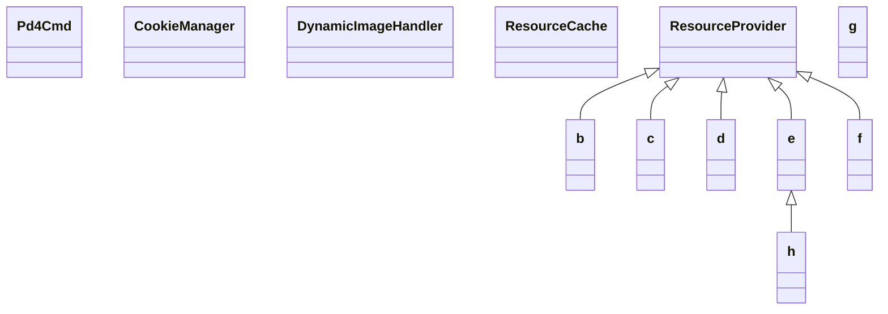

# pd4ml.jar

[Group index](README.md) | [All archives](../README.md)

## Scope and provenance

- **Donor:** `SQX_145_REFERENCE_ROOT/internal/libs/pd4ml.jar`.
- **SHA-256:** `679254d54d47d2373a2c3fe0f34a3658d583c06c51777a07c03abb2a0527d7d2`; accessed 2026-10-06; captured `2026-10-06T18:54:51.906614+00:00`.
- **Classes:** 397 raw entries; 397 unique entry names. Duplicate occurrence indices are zero-based.
- **Inspection:** read-only ZIP hashing and class-file structural parsing; signatures/descriptors, modifiers, hierarchy and references only. Bytecode bodies are hashed, not published.
- **Allocation:** proposed `FEAT-RESULTS-PD4ML`, P08; [roadmap](../../sqx-full-application-roadmap.md). Domain README registration remains required.
- **Repository:** `01067f00031428613c6394064ca1bcadc1ba00ee`; review state unreviewed. Download label 145-dev1; installed build/activation and runtime equivalence unverified.
- **Limit:** every class/member is inventoried; declaration coverage does not establish consumed calls, defaults, formulas, failure semantics or algorithm parity.
- **Archive/resource index:** [097.json](../../../evidence/sqx145/archives/145/097.json).

## Complete member declarations

Member shards contain exact JVM names/descriptors, access flags, generic signatures, throws types, declared fields/methods, superclass/interfaces and referenced class names. All classes, nested/synthetic members and overloads are retained. Code length/hash is structural evidence, not a normalized algorithm comparison.

- [001.json](../../../evidence/sqx145/members/097/001.json) — SHA-256 `92388cca56b6d861d3ee632dd230d621e252fdd8c3d617caa186f3c668171772`.
- [002.json](../../../evidence/sqx145/members/097/002.json) — SHA-256 `d6a2ad491b12c53cdcc208062c4ae5f5b6264f643f284f11b14f5a737ca0bb01`.
- [003.json](../../../evidence/sqx145/members/097/003.json) — SHA-256 `6a235e5f4fa268585b33db22dd666de92cc8b206fde1ce9782593ce8d0fb25c0`.
- [004.json](../../../evidence/sqx145/members/097/004.json) — SHA-256 `642c82c5b6080978299578245c0989ab2968a76459f32b34df9e9bf435096cc5`.
- [005.json](../../../evidence/sqx145/members/097/005.json) — SHA-256 `1211d1cbf29078aa4f0957bb253455674f610dddc30548eed09fb7fee51314f7`.

## Focused structural diagram

Up to twelve non-nested classes; arrows show declared inheritance/interfaces only. External type names are not evidence of an available body or an executed dependency.

## Class inventory

| Archive entry | Occurrence | Class SHA-256 | Fields | Methods |
| --- | ---: | --- | ---: | ---: |
| `Pd4Cmd.class` | 0 | `6083b0219c2b38843929ccf3f908a80cfcd0138d1ac4382ea570b0ea6a6a7e5f` | 46 | 6 |
| `org/zefer/cache/CookieManager.class` | 0 | `21444640f484dd80c1e043e6e4398d3609ba0fb92cbb70c813d467f50cf102c0` | 3 | 9 |
| `org/zefer/cache/DynamicImageHandler.class` | 0 | `2bb067d3f8417fed6ead5c181c5fe460cf8081157d52dfd18587ed4aba6785b0` | 0 | 2 |
| `org/zefer/cache/ResourceCache.class` | 0 | `337fbedea400c364dedd762b2193d298b7c45401b72052ed8dbd096a337a9f09` | 32 | 32 |
| `org/zefer/cache/ResourceProvider.class` | 0 | `3f80b668b56e0899aa06bedd9d5c4e60b33402770e3d9d578f7c515b21a2f17e` | 11 | 13 |
| `org/zefer/cache/b$_b.class` | 0 | `483578d4b0f872622637821f5a633b3a678b5d92ecf5468cad41b58802be5d8a` | 0 | 4 |
| `org/zefer/cache/b$_c.class` | 0 | `eb4fe627cce3831d0db2a1a9a86f8df9a909bb34733fefbbd90b819fee335111` | 0 | 2 |
| `org/zefer/cache/b.class` | 0 | `241a09ac8d813b87a7168f013d129f10a6a8310ba7bed4daadaa1e3df9974d6a` | 0 | 2 |
| `org/zefer/cache/c.class` | 0 | `50c3be79b3b629762d59992b4334960279e5c35f14bb0e098d3159e06254067c` | 1 | 6 |
| `org/zefer/cache/d$_b.class` | 0 | `8a27f887c57dc29c0e5fd96223727f703dcc5e94edfc68b0d637d2431459a970` | 0 | 4 |
| `org/zefer/cache/d$_c.class` | 0 | `4c2f6619550dae6672243b7d0b849c16f063eba9dd6f3c79116d4e6726c96596` | 0 | 2 |
| `org/zefer/cache/d.class` | 0 | `dfd143149630b5c5d2035b1d773b3f7838a9f8d22e0c1efce1728f51254bd31d` | 0 | 2 |
| `org/zefer/cache/e$_b.class` | 0 | `04860674cb51c46d17bb7873f2ad355dae7cebedf8a259e0e993eeb23b8618b7` | 0 | 2 |
| `org/zefer/cache/e.class` | 0 | `8a2a9051876a716d23e87b9a2d24870aa4d48ca8091fa18fc06dd4f6ab9615fb` | 1 | 3 |
| `org/zefer/cache/f.class` | 0 | `02858c4cdcf39cc7665421bba032ba89d52ac25b82006fd4f142b0a76ef3eaba` | 0 | 2 |
| `org/zefer/cache/g.class` | 0 | `881c77c3011008db4f89c3f78adf260bd68e80bdb8f9f55ab93c10150b514f37` | 0 | 1 |
| `org/zefer/cache/h$_b$_b.class` | 0 | `cc8e2ae90820e0af2fa0fdb89f9c5b83778c136deb5cd941ff4545f13f0d8de7` | 2 | 3 |
| `org/zefer/cache/h$_b.class` | 0 | `cb7cf791dac70a17412c11e095196841fc405a2b51c8e510b00a746e86385678` | 5 | 21 |
| `org/zefer/cache/h.class` | 0 | `ff3e7cea1eeb5422ddf3523c01534d7da879e6a9fa1165fcc3f031fb7060c2f7` | 0 | 4 |
| `org/zefer/css/ab.class` | 0 | `0efa8d8ec478ff7ab89acec56215b28ff9e93800c392018ff334cb07b41f4053` | 188 | 8 |
| `org/zefer/css/ac.class` | 0 | `a8a648b4b97103cb24c2713f94fb2523afc846f81a8e003187fb452983705bb6` | 2 | 4 |
| `org/zefer/css/b.class` | 0 | `733ff81ff859b5a777ca127793464f77a66d79a17cce1153ee5189e347bfba99` | 1 | 6 |
| `org/zefer/css/bb.class` | 0 | `96a886e02f141905d4e17bee3f8590f70c6f2b1b131de2e7efa280f27f95d047` | 2 | 4 |
| `org/zefer/css/bc.class` | 0 | `983256036696032d4caf93b7825b91a72ee52da43aa866c613eaa165b28e3bf6` | 0 | 4 |
| `org/zefer/css/c.class` | 0 | `5cd1ca423b4b9ed6508ae8919a17332dea6021d64d4fa9fd48bf48f5fc1e7515` | 2 | 4 |
| `org/zefer/css/cb.class` | 0 | `e40c268fd5a02ec135c3680cacb8c001ac440d4a1d38ade47c1fad2e4a01fba1` | 2 | 4 |
| `org/zefer/css/cc.class` | 0 | `93e10d5f68a1dbcef6dbd40cf86d3434cf57920ddec8de771cd152238314aca7` | 0 | 1 |
| `org/zefer/css/d.class` | 0 | `ec52f4789a8eb14c1f433edb96d269282171379cf0cfb0ab2cede62e51375cd8` | 5 | 5 |
| `org/zefer/css/db.class` | 0 | `140ea3db9b85c831faa7a8fd95b4d2e93a465f12e806d7a08cdd8c91dc7234b9` | 3 | 6 |
| `org/zefer/css/dc.class` | 0 | `522d8760d3fcd46cdb956d2a8583cbd0ba9109323bd7695d432132da51fce211` | 1 | 4 |
| `org/zefer/css/e.class` | 0 | `2688b57fcd7e28e977651adbfe1c9c9b7571db000e2ce0648f759e0d7c502b30` | 2 | 5 |
| `org/zefer/css/eb.class` | 0 | `a0a8989437530bdd9c664244579a3ff2a2ecaf2d17b11101d1252f1f18ba6fe3` | 2 | 4 |
| `org/zefer/css/ec.class` | 0 | `374e6d1762cc8b248e28594666439ffdf8cc1459ff5a016d088217c44f875ba8` | 4 | 4 |
| `org/zefer/css/f$_b.class` | 0 | `6609e4ebe5b967bad003e82b5cd394e978fc0001908adbe20d0c6b4e5438c679` | 3 | 2 |
| `org/zefer/css/f$_c.class` | 0 | `b7a50abaa48d63201b98d87b41c279c65f397d6e494a3638ac220f74def32637` | 3 | 2 |
| `org/zefer/css/f$_d.class` | 0 | `6be5cdb7097be19f3142a1226b5ca0fb86ff29cba9a7267c79c9b2a042d4594a` | 4 | 3 |
| `org/zefer/css/f.class` | 0 | `0d958fdcda9b096afa8d6169b4dbc39f520bf2cdfb7d07a7aac60ee86d861188` | 6 | 15 |
| `org/zefer/css/fb.class` | 0 | `2ae51f77f2682bac80e571a0c5a6c89ed71e80f3b7bee2b26daf7ba1e9c795f2` | 2 | 4 |
| `org/zefer/css/fc.class` | 0 | `85ff8e9e5e3e1e94a2d987ce3562440bae71fbd9ee03019c63d69014c7f3c9f2` | 1 | 7 |
| `org/zefer/css/g.class` | 0 | `528511837710d7d2876eee0881bcfa4a09e1003a32b295200a60523d03f4240a` | 4 | 5 |
| `org/zefer/css/gb.class` | 0 | `b3a3e0b862d90a838032f7b6d1365281fdd51173861f344ca0a772b2717eaa2a` | 2 | 7 |
| `org/zefer/css/gc.class` | 0 | `42a2582e76a804c43889cbf606b9fff0cc8f961f15bd0381708fd543872770ab` | 4 | 4 |
| `org/zefer/css/h.class` | 0 | `9d400b39e9be8a42cf7109772eec2bc7adfe1095f3c93011d7fcd2921a8105ff` | 0 | 4 |
| `org/zefer/css/hb.class` | 0 | `04e54b3ac17515cde4576b97ef0c8d996cd34b322bf1ba3c97226b85fcdb3c39` | 0 | 0 |
| `org/zefer/css/hc.class` | 0 | `2c6cdf10fa423d39369beada24b455f414797f468559e66da4c68c64bb33e48e` | 0 | 4 |
| `org/zefer/css/i.class` | 0 | `468e2fc45381f74716da90f7c4ee71e860dd59f71bd01b953cac8823bc4c2c6c` | 2 | 7 |
| `org/zefer/css/ib.class` | 0 | `2c5dafce32859a5d8e66c5c1001e0c6d50b8795b641b1f20b1606b067aa366ab` | 2 | 1 |
| `org/zefer/css/ic.class` | 0 | `e289b51438b0c9e6b6a9fe21660fe0bd3cce8fc4f63a568394ce2f779a575a37` | 2 | 4 |
| `org/zefer/css/j.class` | 0 | `66cbb4eb00ca4817e5c2cde74e73904ed990de31b6389a3e2bc3a82d38037996` | 2 | 4 |
| `org/zefer/css/jb.class` | 0 | `a5bcbe55f91e57820bf441dcdbcfa012c4fc0cfe5f6040fe76535215b7c72ce0` | 2 | 4 |
| `org/zefer/css/k.class` | 0 | `cde436a75e28eab50fd5691f75012b8a8376105c344a9b89a02220be0ff0d546` | 4 | 4 |
| `org/zefer/css/kb.class` | 0 | `c2fcccc1ea2d8c6a67b3d8022ea03ec55c23075a7da75ebb1285873ebb948655` | 2 | 7 |
| `org/zefer/css/l.class` | 0 | `81ee4bcd4e77a077ba520d806105d9dfdec6304c753575889ae7f8ee4053fb77` | 3 | 4 |
| `org/zefer/css/lb.class` | 0 | `dca7b1cbbf7b4f14a307740712d3567b0ef23a7e0c1d5c4e2b1fc7256d29c675` | 0 | 6 |
| `org/zefer/css/m.class` | 0 | `d6105fd05a2735e18036ef1fb6dcafb99c28b10f5e1e3b56ff42397c56df9dd0` | 1 | 5 |
| `org/zefer/css/mb.class` | 0 | `5a2f3c3c8f2575941b039920e225e6272ca41fa735417a4b6744585ece7927dd` | 0 | 4 |
| `org/zefer/css/n.class` | 0 | `9b6e50dd7ea2a5f61ee5d3fb073d87a35c9d467857c649bcd5e07dd03bd8e396` | 1 | 2 |
| `org/zefer/css/nb.class` | 0 | `c269377fe10bfad1794b0d66e5a75e1a2ee969077184c0d8e8d7adb32aec569f` | 2 | 4 |
| `org/zefer/css/o.class` | 0 | `5810a87fa59e67e3453215904e46679016784bd0dc0c743713e25468d0596fa8` | 1 | 4 |
| `org/zefer/css/ob.class` | 0 | `bd3fb11c6ae4b70439470339277fddb30d79787769a6668d3b32386faf9bbcd6` | 1 | 7 |
| `org/zefer/css/p.class` | 0 | `cfe39f7cee6897561e109f251a364d9e9a516edfa6225ebe91e04df89b70b34c` | 4 | 3 |
| `org/zefer/css/pb.class` | 0 | `4a7cb3302a9b77056c705d850b7d14677b76846fe3575dd0050256953e308abb` | 1 | 4 |
| `org/zefer/css/q.class` | 0 | `53b9c1201dc8d2cead097523d953c1d94f2452bb0991e7d8b53dd154e0e6ff98` | 3 | 9 |
| `org/zefer/css/qb.class` | 0 | `e6e2578b8a762551f65766dfc523f8b7258d4e2bd06a0929fe9dc19958ea5271` | 2 | 3 |
| `org/zefer/css/r.class` | 0 | `8299322cfab572733f7001c37cac9ca7a9c877cc1b68be27e5b6e2de1ef6162f` | 2 | 7 |
| `org/zefer/css/rb.class` | 0 | `3c38177492d9eb2bbaee0a2c863b24f66bce7668c148f2c8cfbe05944fa14451` | 2 | 1 |
| `org/zefer/css/s.class` | 0 | `b4ff1335afec721ee0f5bb9d924ca1a0265afac1a0c42656fdf639ea2cea5178` | 2 | 4 |
| `org/zefer/css/sb.class` | 0 | `772cf541d72d244a2bd76b08e211e7f9392fd18100a57134c5c4a92cb8be4fc8` | 1 | 6 |
| `org/zefer/css/t.class` | 0 | `56080a95bb37aecec777582ace8687abc08de29e5b6e5f47069ec523da9455f3` | 18 | 47 |
| `org/zefer/css/tb.class` | 0 | `24b88b66ca2ac3a91941cbe7aef72d95a69039f3cc8abb096083c403ed533889` | 2 | 3 |
| `org/zefer/css/u.class` | 0 | `8137fcbbaae3a8c9f373987fb789aaa101f7ba9d213290abd7e1f325f74a16c2` | 1 | 4 |
| `org/zefer/css/ub.class` | 0 | `1b736ecbe02a3de92bf7b257ff137448a04652bfc473ff3c3c2427e46bee3df0` | 1 | 3 |
| `org/zefer/css/util/b$_b.class` | 0 | `82f58ec181dc385c6ec2759a7ce46af7238c34f1480cd7cb3e7c3fb2f5133c23` | 2 | 3 |
| `org/zefer/css/util/b.class` | 0 | `5e719dc84b5b9edfe439ce8880b0db953d570aec079fcc3fe73ed8dd2e412139` | 1 | 2 |
| `org/zefer/css/util/c.class` | 0 | `56d10a7819e8fdc4490891e167532642c76a46d5a1e15cadf8316e0632a4f201` | 1 | 2 |
| `org/zefer/css/util/d.class` | 0 | `fecd7901ad4dd1b84b09d53385084a846c4d76e6c0ee437bfe538bfda1ee581d` | 4 | 5 |
| `org/zefer/css/util/e.class` | 0 | `9666fae12996f9e7be04b7adfda919b16d6044d22b6724c28a035d11331bdab3` | 0 | 2 |
| `org/zefer/css/util/f.class` | 0 | `c02a1ca29c7c487714c30c413adbc983c2750193a5e971ff17925e79caf50071` | 0 | 1 |
| `org/zefer/css/util/g.class` | 0 | `c649a029c1e888c63d996075c864cdaa1dde2d2ac7c129bb78930c60638bd679` | 0 | 15 |
| `org/zefer/css/v.class` | 0 | `de32e63b4aeac86e0745af78a33aee6e45879daeeb3e09327ed8a719e533c2db` | 3 | 4 |
| `org/zefer/css/vb.class` | 0 | `2171e92990b7764d70f2cca778531a98a6567ceaebac4fc200db967988bff197` | 0 | 4 |
| `org/zefer/css/w.class` | 0 | `695dbb7d57850eab13199381995afea055722f326049934a6123b7a8843280ab` | 1 | 4 |
| `org/zefer/css/wb.class` | 0 | `31707638b35e7718d838bd58b2dced5268980b62b80018a35503e28e6249649a` | 1 | 5 |
| `org/zefer/css/x.class` | 0 | `c0483ae7db7a0c11fb2648778cc2473ac173148811739723ea353f88adad22f2` | 2 | 4 |
| `org/zefer/css/xb.class` | 0 | `86e2847ebd502b00b28030aa9c16504d55289502b8d544a80fffdc1ac1e24f66` | 1 | 2 |
| `org/zefer/css/y$_b.class` | 0 | `0ab6d7e32b83c09bb2cfb94896af9fac34cc8fd7b270da21ecb19b6c849dbd3e` | 2 | 2 |
| `org/zefer/css/y.class` | 0 | `beac223a7236671a0b932ab7bccbb808526d3e56d0dc8cb7b3812f13470be068` | 1 | 5 |
| `org/zefer/css/yb.class` | 0 | `02d3ceb13cc4ca5814477277c2b569c0a783b41f96efc2b686631ea66b067c1b` | 4 | 4 |
| `org/zefer/css/z.class` | 0 | `13e027f14cdc3f00ae0fe9d2d26d1bd33088fea1e4e4fb2a7bcd8fdc55824728` | 0 | 2 |
| `org/zefer/css/zb.class` | 0 | `0844f46bfcd106daf28d9bb5df6fd3ec7b12d67ef6d49aae65f3d083e0cb7f35` | 1 | 5 |
| `org/zefer/font/TrueType$1.class` | 0 | `3757a62692e852d0b1c376279bc855327a84bec98ede62ba80f23f4d034d07fd` | 1 | 2 |
| `org/zefer/font/TrueType$2.class` | 0 | `b6c63d4151c1fbad8c9611a8e96b010f8bb05743015bce9b8d4e1850e9e4dd88` | 1 | 2 |
| `org/zefer/font/TrueType$_b.class` | 0 | `1005f3a45d9ac7179950141cec6878c98d7310074e6efdb3945020a3a9552c8f` | 4 | 1 |
| `org/zefer/font/TrueType$_c.class` | 0 | `82f3e13d7e2281f572eab013e921d816daf94efeaa8667d6e513746c0b48ecd2` | 8 | 1 |
| `org/zefer/font/TrueType$_d.class` | 0 | `7effa8e166c1fd9df40459adcdf048ef9dae3cf1d1ae6acae93930281e8b9d3b` | 4 | 1 |
| `org/zefer/font/TrueType.class` | 0 | `fb0e64604d4784c0483c1e01a138a6554fbc5b171272e8572adf08c88bbf04fd` | 30 | 54 |
| `org/zefer/font/b$_b.class` | 0 | `fbb92814f5fa625841714d494c9e5bbed237bc46294db909e5acd44df04b85a6` | 0 | 3 |
| `org/zefer/font/b.class` | 0 | `e3e1899eeee7d90370910f3b2ca5ed8bf7dec8318da560c57fa2aab5bc4257be` | 21 | 7 |
| `org/zefer/font/c.class` | 0 | `48619b1dfec87d9a16410a6d636934392ec89e5621c4b41d0033527fc7eb5625` | 15 | 34 |
| `org/zefer/font/d$1.class` | 0 | `21e18cc6b036180aa0b0e80762526e72eb683068643a025a06dc8ee55cc28ea7` | 0 | 0 |
| `org/zefer/font/d$_b.class` | 0 | `3180fe4b3a2020b9de0cea39ec88c2a03b4f06e26c03c3beb3c2df7709a7b05e` | 4 | 2 |
| `org/zefer/font/d.class` | 0 | `adf43ff36fa7cb91f62ee71751ce703063b5b6aa2d11e62f241d572985ff3958` | 9 | 11 |
| `org/zefer/font/e.class` | 0 | `1b2751bef2f5fbd364639d04bfe1a2106408d4eb04c7cbaf9b0f608451e3fb4a` | 2 | 15 |
| `org/zefer/font/f.class` | 0 | `c2b9722996f1a6777f1b2db371806af6629f6696236f2fe721fd96dbb93c8686` | 20 | 15 |
| `org/zefer/font/kerning/b$1.class` | 0 | `9ff3b125b15b13ff4c12c006612e02eaaf752d4f9939b84b3ab98da2fe82e588` | 0 | 0 |
| `org/zefer/font/kerning/b$_b$_b.class` | 0 | `099f919d89f2a94baeaf863b7874fa104c9aa493fa11204a92a3d24a829dd42a` | 0 | 4 |
| `org/zefer/font/kerning/b$_b$_c.class` | 0 | `0a0303034d0a4bd43b0e30a5e6aeb44d7dc5fb76a08e955d36dcd1c72f9b0091` | 2 | 5 |
| `org/zefer/font/kerning/b$_b.class` | 0 | `94a8104ea28254e21133d6aae573492439358c01866effd8b925da0eb66f2de6` | 4 | 11 |
| `org/zefer/font/kerning/b.class` | 0 | `99ec5912829685cf1e87e1050176f67e7dc812dd435165f66c26950efd6357f4` | 1 | 5 |
| `org/zefer/font/kerning/c$_b.class` | 0 | `ce2362e70125db83e53990ab07d38b65e9120b35593d3c2ea3354e9d83b84fa9` | 0 | 1 |
| `org/zefer/font/kerning/c$_c.class` | 0 | `6a720e15e37aa236fd4718a369833526a4386ec4b01a9427aac8aa290d090508` | 0 | 1 |
| `org/zefer/font/kerning/c$_d.class` | 0 | `53afa367352022fd1de79ed72df63b97547bf9f3affa45ecf1a5920c6e990e5e` | 0 | 1 |
| `org/zefer/font/kerning/c$_e.class` | 0 | `86b1fea4d7d5ae5ca855941a672c030f28c39071bfdd99f42aa8b96ccef5b8e4` | 0 | 1 |
| `org/zefer/font/kerning/c$_f.class` | 0 | `ac695493eb9899adf7aaac9fef7dadccb124466407106b89edbb92eec0a92d90` | 0 | 1 |
| `org/zefer/font/kerning/c$_g.class` | 0 | `e093658f5849f658f1c71d5093a3839afe9d8c1d36ec588fc756c589d7339ffd` | 0 | 1 |
| `org/zefer/font/kerning/c$_h$1.class` | 0 | `cd771ef1f872f88f21e8d0d845926e94d3f9740c5f7de9ecae413eea5ed12ca8` | 1 | 3 |
| `org/zefer/font/kerning/c$_h.class` | 0 | `1d8c5239a243cba491a9d08dbf74ad8cc093d6173ee633e6d3f6e992cb739a1e` | 2 | 3 |
| `org/zefer/font/kerning/c$_i.class` | 0 | `b64dfeff6866b48fce33eb54d830fba648d73953737fee6147e1c349ef2e25cd` | 0 | 1 |
| `org/zefer/font/kerning/c$_j.class` | 0 | `17214ffbf00db38a7d73a12006989225dd06b53d1c1931cee10befae7c5767bf` | 0 | 1 |
| `org/zefer/font/kerning/c.class` | 0 | `c9a667b4a1697d8ee03158eaea7f38776a2809b543cc90691bf4a7d9446759f4` | 9 | 3 |
| `org/zefer/html/doc/Document$1.class` | 0 | `a639705be4a87e05d96c6ebe369a408c727c9c565de9c750d6ca30550412fe68` | 1 | 2 |
| `org/zefer/html/doc/Document$2.class` | 0 | `648b7a6acc972c2f2ed8ac5a93689160150f1089b3e903d83b7e63691954ed8d` | 1 | 2 |
| `org/zefer/html/doc/Document$3.class` | 0 | `38e6085cf28aa82d2807bd066d5fb64e7de459a60faae1fe0724fde402236570` | 1 | 2 |
| `org/zefer/html/doc/Document.class` | 0 | `f2f94867b709dd4741bcde13dd090cc90dacd608f0e3ba19f48f73359685b0d1` | 54 | 112 |
| `org/zefer/html/doc/PD4MLHtmlParser$AdditionalStyle.class` | 0 | `07bf8318731818045ae7da83dc3d69410cbe22c67fd3fecc6ac6057bfee34e90` | 3 | 3 |
| `org/zefer/html/doc/PD4MLHtmlParser.class` | 0 | `5a1f53e069d696d109c77c594cd374a30224c023e8712384d409c1d1cc660721` | 24 | 34 |
| `org/zefer/html/doc/ab.class` | 0 | `e4cbe76913e23694d6472bd3c560df7f38bc5be6b5ac0b837adb40bca4f3c225` | 0 | 6 |
| `org/zefer/html/doc/b.class` | 0 | `ea6527386f11e0914e956f9ead505794d04b7181b65137e625e09e7537fe671f` | 12 | 30 |
| `org/zefer/html/doc/bb.class` | 0 | `9f095e6f0b66d537e8d57c24528c1e9e1c9730d7c5e06331bb766a831de9da1d` | 130 | 2 |
| `org/zefer/html/doc/bidi/b$_b.class` | 0 | `bc88a6937a05f2bffde6c623e6d643d2c49aa418cec931fecb810a08d7facb32` | 4 | 1 |
| `org/zefer/html/doc/bidi/b.class` | 0 | `fb0e2ff97ad28e98f28d505c211d596641466db85271745cdf4e32b26d61dcd7` | 4 | 5 |
| `org/zefer/html/doc/bidi/c.class` | 0 | `678efe2e638c7e4999b48afe1b31837785205508fc53c8be4d0d506af8002266` | 8 | 21 |
| `org/zefer/html/doc/bidi/d$_b.class` | 0 | `1729455000039fbeac6db007fa4414c302eae5d4acfc79f1c658649418b1e22d` | 5 | 1 |
| `org/zefer/html/doc/bidi/d.class` | 0 | `f8f6c8f98d34f85ae9fe9c60cd2000c71de2e0c4c5f5406daf49f1f6b12e022e` | 1 | 12 |
| `org/zefer/html/doc/bidi/e.class` | 0 | `a5ad091bf20e71841f99c2ee504c9d058ffeac39305d4edba01d3a2a72fec9c3` | 5 | 9 |
| `org/zefer/html/doc/c.class` | 0 | `27b274a0599ba4ea2e3fa6b7364faae40ca4985ee5be7f33d665e4afd2cdab96` | 10 | 17 |
| `org/zefer/html/doc/cb.class` | 0 | `30f723d05861f9ce908bfbea86ed930fc19bd34722ed0a6ac0fd47e09c0d0ebd` | 11 | 9 |
| `org/zefer/html/doc/css/b.class` | 0 | `614a3418317ac210cae935b18240e272f199bf4b71a9a3a520303b48199ccc96` | 1 | 3 |
| `org/zefer/html/doc/css/c$_b.class` | 0 | `a5c7d4e8e016e13f8f43cbedd8e4fadf3566ac59d856f60d1e73f4ff3af8c1d1` | 2 | 6 |
| `org/zefer/html/doc/css/c.class` | 0 | `7364e44cdc878894bc6d3e6588dfe67a0626ca499b461fae898d3cdf843553a9` | 18 | 26 |
| `org/zefer/html/doc/css/d.class` | 0 | `c8c9dfefe1b630b1d8613775bafce9cf68604779037aba6f65d815ce3a7f9237` | 4 | 2 |
| `org/zefer/html/doc/d.class` | 0 | `0f1097bf5183ef6f6eebd4ce77f1f28e1ede28e9868bd6c84574181d64cae759` | 12 | 10 |
| `org/zefer/html/doc/db.class` | 0 | `66d9ca97770a46d7676b255e38ab1c8c1c94bf50cf1a28c23af0d7f2ed1ad669` | 0 | 1 |
| `org/zefer/html/doc/e.class` | 0 | `1f716c68837712ac4f8af9df28a2973b58df481d265bb84a0ce4ba6e85178d97` | 3 | 5 |
| `org/zefer/html/doc/eb$_b.class` | 0 | `89a4ab4e1cbaa6bde7ea53303252c50444dae4e5b934b79c567e75b6e0677e3f` | 2 | 2 |
| `org/zefer/html/doc/eb$_c.class` | 0 | `00e73f29cddec87213b6bedb988084ca6f7442d2d02c92eb9e08107ff123221a` | 3 | 3 |
| `org/zefer/html/doc/eb.class` | 0 | `6ff9f53919ea9e6a814f39a1606250c8b9053a66dbd39aa749325fc4fcf9fce3` | 8 | 33 |
| `org/zefer/html/doc/f.class` | 0 | `fe27c062433c975fd82ce26a0f2a4a47d7d72b95a6a8c8c2ac19cc683b757d25` | 0 | 6 |
| `org/zefer/html/doc/fb.class` | 0 | `65a8a6b4a72ca206e9cdffeff52791d04d43748e6e56642d21299d391eec1f78` | 0 | 7 |
| `org/zefer/html/doc/g.class` | 0 | `094a4c67ee09acd40306493f117440e7014d67f1da2a746d0a0581371760ee04` | 7 | 9 |
| `org/zefer/html/doc/gb$_b.class` | 0 | `55ff7cccb9ac51ae1e10bf7aea7a0b5469745117b4ec37d4951cdc8c14e6a687` | 7 | 7 |
| `org/zefer/html/doc/gb.class` | 0 | `d5ac841cb44a5dd89e28105f005e21fcdf7e47225f98ea4934b4e19262b4ddc3` | 7 | 15 |
| `org/zefer/html/doc/h.class` | 0 | `b28ce601089a0f126f4a1069918cd332cca58228339440f624f3342c62170f3c` | 21 | 70 |
| `org/zefer/html/doc/hb.class` | 0 | `2d9526d38b499c03d240c5d89678a48abec6510d19caa78d86405b827655d5a9` | 5 | 6 |
| `org/zefer/html/doc/i.class` | 0 | `59f3c317027033f43491021c40a4332d02375bbd10559ef362aff8a4d85d1929` | 2 | 13 |
| `org/zefer/html/doc/j.class` | 0 | `87acd5e5dc26e4d7f997fab1998bba8926299b82631f233246e9fecfffc85011` | 0 | 4 |
| `org/zefer/html/doc/k.class` | 0 | `3bbbc7081449cc867337f73d19564e85e3046c133e2b69630e39d6406d3d74e0` | 4 | 5 |
| `org/zefer/html/doc/l$1.class` | 0 | `05e607228b6de9f1f9c6e09d3e5348e75cdb9df91e2565a341356a2b30458f82` | 0 | 2 |
| `org/zefer/html/doc/l.class` | 0 | `8e488c2f77b0fd2675029869e5c6108d11e9e5116311f46f0d92058f1e47730e` | 9 | 14 |
| `org/zefer/html/doc/m.class` | 0 | `fd072c41283c601510292de24f4d99e632b3a16fbc12f614e8b0e76490adc47b` | 6 | 14 |
| `org/zefer/html/doc/n.class` | 0 | `91f0922278da5ea8bbecfb9c998f8e9d7261a700dd947cee9281a66588b6bda3` | 8 | 7 |
| `org/zefer/html/doc/o.class` | 0 | `7e533d8b73a164df34f26fb53f4008ef3d8ae215297fc76dc8ed632f0e4b47d5` | 16 | 28 |
| `org/zefer/html/doc/p.class` | 0 | `3e667f954b7e02c2795b355b2540bfce4e8005fc23c13ca23bed3032490deb27` | 10 | 12 |
| `org/zefer/html/doc/q.class` | 0 | `4674eaf232665e326c9102496e203092c01d9ccf614b1888d6335583ba630846` | 10 | 127 |
| `org/zefer/html/doc/r.class` | 0 | `c4069e2896674684ca4b16ceb249d81f0408328e46b4edbca064f8b490e23631` | 5 | 23 |
| `org/zefer/html/doc/s.class` | 0 | `cd1883cb9bd58edc20e406c5cac892986064c9da9a13238eafcc42e197e677e5` | 0 | 10 |
| `org/zefer/html/doc/t.class` | 0 | `9230c6f95569e9a53a10b5c0fcc9946f26a072dca3016fd667b7b2017671c7c1` | 0 | 26 |
| `org/zefer/html/doc/u.class` | 0 | `c461e280b15993b66bdb7f7c5d453ff3d2fb4126f95bc164e159266b1eac2c1a` | 18 | 52 |
| `org/zefer/html/doc/util/b$_b.class` | 0 | `ac817313abfd484b8328f229904bc0b15ec60d627be7548a1dd359a000c40fdb` | 2 | 1 |
| `org/zefer/html/doc/util/b.class` | 0 | `4f1507a639499f3919b667fb4f4e21f2df3bc905bcbb881e21c205bbd1e3c5b6` | 12 | 20 |
| `org/zefer/html/doc/util/c$_b.class` | 0 | `0c269c36954d0f1d7d6ee7537fb5f405a5ab6f9d479dab0ee37959ce3b6e6fd4` | 4 | 5 |
| `org/zefer/html/doc/util/c$_c.class` | 0 | `65fb52ce75b533f7cf6d12aee8e1a26bbae520cc8a6d34407460fb7e223c10eb` | 5 | 8 |
| `org/zefer/html/doc/util/c.class` | 0 | `32e186ddac71a86fa4bf97a9e25ba2573857284e5237dd8ff0b281b1d671f2e7` | 4 | 11 |
| `org/zefer/html/doc/util/d$1.class` | 0 | `0c875aad3e27b05873f60065d38f22c79178f4cef853006baa7f14e20dc0acbd` | 1 | 2 |
| `org/zefer/html/doc/util/d$_b.class` | 0 | `7ffe9ce425a24dd851b16a94bac58a31faa22fd1a992c2bdbf7a99ea70d31dc2` | 3 | 5 |
| `org/zefer/html/doc/util/d$_c.class` | 0 | `eb412f272641b141594d11d00d26997a6038a29e92b598c50eba67a5d8517d00` | 3 | 1 |
| `org/zefer/html/doc/util/d$_d.class` | 0 | `16428272eeab72aab8020169418e8a8cc88f630d989f56b5770fca8d7e8eff9a` | 6 | 1 |
| `org/zefer/html/doc/util/d$_e.class` | 0 | `3d0f0016f98858b4adada7df15db8dd2abcac10180e1b0098bca736eaaa0506f` | 3 | 1 |
| `org/zefer/html/doc/util/d$_f.class` | 0 | `b340bc3d7f148c90dde696e9ee8a9d401ef2be84eeb79a2be27f5798f5a0c094` | 3 | 11 |
| `org/zefer/html/doc/util/d$_g.class` | 0 | `867336d9de6fe5229f24834fe85c87a89f49d529d91f76313efaff6421e7f7d5` | 10 | 21 |
| `org/zefer/html/doc/util/d$_h.class` | 0 | `8fbf2d541140cab3693b7c6cf99b48bc95110d8550c18185d3874d6165e14477` | 6 | 1 |
| `org/zefer/html/doc/util/d.class` | 0 | `d89910031dd3be86031bb18090979ff54377c3b6eb8d440a7bca6db6ed9fbc20` | 13 | 31 |
| `org/zefer/html/doc/v.class` | 0 | `8b08ce23a496511cf7157e2daa2106bc9be42cab4f5714242bddc852bbba4fea` | 2 | 8 |
| `org/zefer/html/doc/view/b.class` | 0 | `2b7bb9a37cd66f7f98708c7f42614aec6c32b8524548a02508e3c1978726d16a` | 12 | 42 |
| `org/zefer/html/doc/view/c.class` | 0 | `fe8443852873737ea6c9de5d77923b198418205136ed5f4595237ff3d0384d09` | 1 | 10 |
| `org/zefer/html/doc/view/d.class` | 0 | `c8d1caf9c764540c5170f814bec39c3a3465c2196fabae4c3a96d26e7f6f7962` | 1 | 13 |
| `org/zefer/html/doc/view/e.class` | 0 | `c626b48177606d568940b86d2cad1400ebaf6a615cf0484ed1c19b54c0460a5d` | 16 | 14 |
| `org/zefer/html/doc/view/f.class` | 0 | `02e248ee2b387f41ffe63cbe2551387a10ed84916530d9ae389b0e4585beec84` | 19 | 12 |
| `org/zefer/html/doc/view/g$_b.class` | 0 | `e5a4cb4af87534f8744e0e010b0d3c16c1550728c7e89a304d2f52e4528ce9b0` | 17 | 1 |
| `org/zefer/html/doc/view/g.class` | 0 | `87936af766c51878fb526c7c0c1ee343d791e7d35b67fd3d9a4d7b0718dd27d4` | 1 | 4 |
| `org/zefer/html/doc/view/h.class` | 0 | `558c0b0bd52c23b71eee137dc54e825c840f243505dc1b0453feaaf555b07de5` | 3 | 13 |
| `org/zefer/html/doc/view/i$_b.class` | 0 | `9107124ee5859562398c6a12cb9e4d3c6918d01a9b95560c72e8f70634fa37c3` | 8 | 13 |
| `org/zefer/html/doc/view/i.class` | 0 | `b485825092bb64635ebc9c33bf68e1326c6cb49d34ee443bc6384c1252c7c028` | 5 | 22 |
| `org/zefer/html/doc/view/j.class` | 0 | `5f34d16a68843f225836fa4753e401ce1e3002b9b8eb9423e7198c00fc95f90c` | 4 | 17 |
| `org/zefer/html/doc/view/k.class` | 0 | `7be52bbc079844a1f6d92a4861cedffc35469faaf313aacf9fa3690d4fb01c39` | 0 | 2 |
| `org/zefer/html/doc/view/l.class` | 0 | `07fa76a63c2d9b0c99399df620daa5ace8f80e22c0f6b648aeccaa3fa4b3bdc0` | 13 | 22 |
| `org/zefer/html/doc/view/m.class` | 0 | `826c75231a58333672f5dd57261cc240d181aa9861e80c6c3a4d9dc7fc2c3b30` | 3 | 12 |
| `org/zefer/html/doc/view/n.class` | 0 | `6cfe510464c996ffc36e77d1de1b6996d1f2035301d7b6aab4d6f6f4cac25641` | 16 | 7 |
| `org/zefer/html/doc/view/tiff/b.class` | 0 | `543046d80dcab24b608eb5da1614b76534cdd078e8a64472a404957d136bd05b` | 7 | 15 |
| `org/zefer/html/doc/view/tiff/c.class` | 0 | `cfcdbec5a560952cd5924e6031be1fc6c1b5395b7e393c89ee92b1d0a3f10489` | 4 | 7 |
| `org/zefer/html/doc/view/tiff/d.class` | 0 | `cb298b0105380dd36be8714d34c549d6150ef3d2be86653b02d7b4043046f07a` | 5 | 32 |
| `org/zefer/html/doc/w.class` | 0 | `dfcee639ec482b3ed3b2793e9814d4151d4713f14e11431b6a43b60b3f8adfa5` | 10 | 14 |
| `org/zefer/html/doc/x$_b.class` | 0 | `ff4ffe1b46a74ea544d6714d679bd71dc60d9ecbb09abde6e25d2e6478231d76` | 10 | 27 |
| `org/zefer/html/doc/x.class` | 0 | `af7e13cc4dd8de5485f02bd999e1cf7c8e9c1b75ea346ab11d49484d3c881724` | 8 | 46 |
| `org/zefer/html/doc/y.class` | 0 | `47f1a3845dbbcfdf9938299a779366a189e3ff7331b933f08526ddbd4532230d` | 2 | 8 |
| `org/zefer/html/doc/z.class` | 0 | `f3f8af9a2a497388856c0080cb84d12987ab737b4aa1918d5157a74d9b291131` | 0 | 3 |
| `org/zefer/html/parser/b.class` | 0 | `97738f8159afc4cd209745192a398d3fb97f5d74fb4d5f4aa5833eda2b2f49e1` | 24 | 74 |
| `org/zefer/html/parser/c.class` | 0 | `055bab694c5f5d625eda9eb6ab7767195b068d117dcf98cc05a59afe286745ab` | 4 | 5 |
| `org/zefer/html/parser/d.class` | 0 | `7cddc7aa056cc5e6033af21d51cb8b71ee7123d847549e1080bb8f237816e368` | 1 | 5 |
| `org/zefer/html/parser/e.class` | 0 | `69767dd24b67a1be1f3e276b5c8e2a43cc35e9c42ae8e8b91dc26dbc6a01f77c` | 15 | 14 |
| `org/zefer/html/parser/f$1.class` | 0 | `8ccab985f5036de3ade3c3d6309ea7a6c39cfe67dd345200334c106de72dfe83` | 0 | 0 |
| `org/zefer/html/parser/f$_b.class` | 0 | `bbb48cf66b0ba0e1a3ce174a06240c050c8e3cc72bd1ea4f8a3b9334cdd1f65f` | 4 | 1 |
| `org/zefer/html/parser/f$_c.class` | 0 | `b8bd383266c66929e41e4ab958b842debbfe136cba166dabd44685cf435a161f` | 0 | 2 |
| `org/zefer/html/parser/f.class` | 0 | `48d369f0de6a78c7ee33bc48f6e3c1f5de60379f47c0539e5e2a9a1604f9547d` | 26 | 42 |
| `org/zefer/html/parser/g.class` | 0 | `b7c8e2fae33cb085783a7ed33a48f84fdda48aa3fbd18964a92915abdcf9ed49` | 8 | 4 |
| `org/zefer/html/parser/h.class` | 0 | `80215f83a1e69dfb7634cc24b7fc38e18fbf733b88ff1b3c25370cf913df3160` | 1 | 1 |
| `org/zefer/html/parser/i.class` | 0 | `20ffdf979b0c9a7c37d10eedb6cdddd6430acaaa3164f994224cb0a019ed5bcd` | 4 | 7 |
| `org/zefer/html/parser/tokens/b.class` | 0 | `0f145617788354fccb50fe0669c2de9b59e4f5d48a2b1c13cef7110b27d77535` | 3 | 7 |
| `org/zefer/html/parser/tokens/c.class` | 0 | `2afb651c5b1ee189001cc34934be293647c7929e37787112b6f457683446d9c3` | 0 | 5 |
| `org/zefer/html/parser/tokens/d.class` | 0 | `9d6baf911127fee1eb6fc86aa36b3492ba50684c56ad0c4f2c1f82aa8f343731` | 1 | 2 |
| `org/zefer/html/parser/tokens/e.class` | 0 | `02874593718c00a1efc69dd05279dc0d526df606896c4279179fc15fac04dc3f` | 1 | 2 |
| `org/zefer/html/parser/tokens/f.class` | 0 | `c98a324f9266829e01434f010088cf9829e52e2a243bdf14a4bcda0c60ff1d7c` | 1 | 3 |
| `org/zefer/html/parser/tokens/g.class` | 0 | `046aca11cb0c8fd6660d3fa3fd676e3965015ae28eda317ccebc3c6a669306b1` | 2 | 1 |
| `org/zefer/html/parser/tokens/h.class` | 0 | `ac987d645c680fd01f39efa4ae4c49159d7ac353c7e917f1da35e2c9178ff306` | 0 | 0 |
| `org/zefer/html/parser/tokens/i.class` | 0 | `9d2bc2f625e3d41cc2f057db5df13be3712c704555e1e2ed6bf688f430da9d2a` | 0 | 2 |
| `org/zefer/html/parser/tokens/j.class` | 0 | `5c9ac835956195b982c642c70c51b916c8caa6f8e33addd9251c0523ea3380e2` | 0 | 1 |
| `org/zefer/html/parser/tokens/k.class` | 0 | `9607f5a26b31f492b1c4d005a0a1a99be9297cbd9828acbdad91066916857e01` | 0 | 1 |
| `org/zefer/html/util/b.class` | 0 | `bdf50ed368c24d21bcf509e3962e3f3e5fc18952fd9aaaa65940d9ce12136de7` | 1 | 7 |
| `org/zefer/html/util/c$_b.class` | 0 | `f407750cdd15252b6a1b584f2f93171bac2ad49c1909903dc3418f9cfdee364c` | 2 | 4 |
| `org/zefer/html/util/c.class` | 0 | `81dd750dbed08ce8518ca4a196684c6727edcacf40bd073c8f773c79e21b4754` | 0 | 4 |
| `org/zefer/html/util/d.class` | 0 | `9dfa8f36967f28c94194b744ca62f97bd4bcef4dbc0e16272b2734da798bb60a` | 4 | 12 |
| `org/zefer/html/util/e.class` | 0 | `12169784b9db16a41dce6a542ced5146563252f491ef815dd8a614b3e438ddce` | 4 | 10 |
| `org/zefer/html/util/f.class` | 0 | `e515736ba35457d3c77c0f3eaad301d98ec635eb4f35623a98b248c96fb1ea8e` | 9 | 5 |
| `org/zefer/html/util/g$1.class` | 0 | `1563a60b4c59d4b494ee8075009fa4412f5326efcb0ce97bd5772fbed497d574` | 1 | 7 |
| `org/zefer/html/util/g$2.class` | 0 | `a6ed014a4bc02b2f021de1d4c3885e9d0b4d46da765f9b595bce4963697436cc` | 1 | 7 |
| `org/zefer/html/util/g$3.class` | 0 | `0cabeb790cbdac61809fa84086efed8ae3d5ab8db6709aa9d95ec51a6204f4a2` | 1 | 8 |
| `org/zefer/html/util/g$_b.class` | 0 | `e83fbcc180812c32d12ac98b3a0ea18072de3fa54bc81528771d99c4264eeb09` | 4 | 7 |
| `org/zefer/html/util/g$_c.class` | 0 | `02a1c256aa0c6246ddbf8c2f10b514e70016c53d643fa35e5bb95d26810fd385` | 4 | 4 |
| `org/zefer/html/util/g.class` | 0 | `00dafdda8a0efed38cfe8113d1f8f26c3f15ace7b77a8272c4ef885782688cbb` | 3 | 26 |
| `org/zefer/html/util/h$_b.class` | 0 | `3f2a5188a2b6f116f6f17d6282f482339547e41291b55f1e988ab4ae54179813` | 8 | 5 |
| `org/zefer/html/util/h.class` | 0 | `508c416208a431b430434148172410e319c810b07dd73ffc728fabe6d89636fb` | 3 | 11 |
| `org/zefer/pd4ml/PD4Cache.class` | 0 | `7e2f062cd431672b0ed264d7c27dc7e9eaf9fd85fc89d24d94d4d80b8bdece5c` | 1 | 3 |
| `org/zefer/pd4ml/PD4ConfigHandler.class` | 0 | `542836b9a2358617563fc2923c30862411e92767795595365770cf965a57b1d8` | 33 | 8 |
| `org/zefer/pd4ml/PD4Constants.class` | 0 | `7a64388bf3f04a4461c91895685ffe7794b44cdc858ea61f57d6619afe5e0d0b` | 92 | 2 |
| `org/zefer/pd4ml/PD4Document.class` | 0 | `6e5a3cab76c59acec4ab0135aacf2376d1d8b0868f4bb6e6dffc3e13f11413a3` | 0 | 5 |
| `org/zefer/pd4ml/PD4InvalidPasswordException.class` | 0 | `804175cd7c8b25d00eed04b387120078a417b654ca8ce8040a3da1790aaa9751` | 0 | 1 |
| `org/zefer/pd4ml/PD4InvokeException.class` | 0 | `0ceaf5e35f09cfc0e2a73397ff0fb24b07727b388283b89a211d0182a2f9c8bf` | 0 | 1 |
| `org/zefer/pd4ml/PD4ML$StatusMessage.class` | 0 | `8a82b246cc57109d2bda5c820c08fd90636be5149a2f4be6308c31afb412b3b4` | 5 | 9 |
| `org/zefer/pd4ml/PD4ML.class` | 0 | `5d76269f7d1b7f053b9816f3c5320d4c0eb05e68bc686b086365b4cc1b639406` | 83 | 86 |
| `org/zefer/pd4ml/PD4PageMark.class` | 0 | `7f358fae1cd8d6870793b2903b49bfd4da43ff54e63d60a85cd7a6b887db8b7c` | 19 | 40 |
| `org/zefer/pd4ml/PD4ProgressListener.class` | 0 | `fae069fa41a4d850e3a0a91c0c845370cf389dd4face0a411b25e85cf1b99d93` | 9 | 1 |
| `org/zefer/pd4ml/PD4Util$1.class` | 0 | `70bb305441da2ce5edb2e6413c03a817b7c471d77bba90dbb18085763bfc019b` | 0 | 2 |
| `org/zefer/pd4ml/PD4Util.class` | 0 | `1d509b2fffc5c1ff2966c1382b789c6f696ff83752830e4e85b45ea402a994db` | 0 | 4 |
| `org/zefer/pd4ml/npdf/PD4DocumentBase.class` | 0 | `f3fa9dac6b53abaa0fabd6eb29804a726fc51e5163b1474d064c61cca06a1450` | 14 | 37 |
| `org/zefer/pd4ml/npdf/b.class` | 0 | `40ac96c793c12b7efb190718b6666626a2bf99446e91498d615b7d6508b4253b` | 2 | 7 |
| `org/zefer/pd4ml/npdf/c.class` | 0 | `55f4c26effe0ffc3c0f936b670ef655cbcc05499f3038cd41b4c22b588a2bb77` | 8 | 6 |
| `org/zefer/pd4ml/npdf/parser/b.class` | 0 | `3b640f6e9f75d49316538c7e87e4914cb030d0c0e509c4d522404465eee5ca0f` | 4 | 11 |
| `org/zefer/pd4ml/npdf/parser/c$_b.class` | 0 | `26d5e258d216c7950849b6916ae58ab97c1bd5d6000f0a6481ceebef21cb14bc` | 5 | 6 |
| `org/zefer/pd4ml/npdf/parser/c$_c.class` | 0 | `b75fea44287c3906fa935d34be306d97bc99f4ac8007bf43c908901b30ffab68` | 2 | 4 |
| `org/zefer/pd4ml/npdf/parser/c$_d.class` | 0 | `9286721b368505fd0323f28d26517cd1e1b991f00bc2286f6a525388b82f8d48` | 0 | 3 |
| `org/zefer/pd4ml/npdf/parser/c$_e.class` | 0 | `dc596e5ef2b1e84690c2230ec2b190a064ee1171cfccf96e321fb0f1d0bf5ad4` | 17 | 10 |
| `org/zefer/pd4ml/npdf/parser/c$_f.class` | 0 | `028b6d7caa34107b5fb2b9629060a164483bf948d38578b6c890d9e7db9d5422` | 0 | 3 |
| `org/zefer/pd4ml/npdf/parser/c$_g.class` | 0 | `d18b464d410f0135229b103e68fbc2b213c8355ca81a1a1f0410751a53db883c` | 9 | 6 |
| `org/zefer/pd4ml/npdf/parser/d.class` | 0 | `454c6467ba567baa6958f0a1fe4e8184d9d5c49e33955291431e3a357405bd8f` | 5 | 10 |
| `org/zefer/pd4ml/npdf/parser/e.class` | 0 | `b34e63a6fcf1d60aa5320337198218590b8a457f31104b6bc59d5ae4898ce4fa` | 2 | 7 |
| `org/zefer/pd4ml/npdf/parser/f$_b.class` | 0 | `8ff8908f69a3d15fb4ce1276410b5683cc7203009221efa0d6b0cd2cd1862529` | 6 | 2 |
| `org/zefer/pd4ml/npdf/parser/f$_c.class` | 0 | `c48d40ef44e36c6039d34386b3499b079042ee7806186696d452be58505a7c3d` | 5 | 1 |
| `org/zefer/pd4ml/npdf/parser/f$_d.class` | 0 | `d2ad4f1fa706a08ce0e87574170942c9cc37b3270645c2b4bd238d38c2bc6019` | 7 | 1 |
| `org/zefer/pd4ml/npdf/parser/f.class` | 0 | `aaa0b90df8a89ef5de2a185ddc56fb88143089eadbd4b902ee5b2de2fee03c9d` | 16 | 19 |
| `org/zefer/pd4ml/npdf/parser/g.class` | 0 | `f764ec18580deb7ee2c484d79524e70cb5c90908d01f7a827aa265aa8ca1824e` | 12 | 39 |
| `org/zefer/pd4ml/npdf/parser/h.class` | 0 | `2282efb1fffdafd9b0dbc558fd2ad6aeadb5925cfa80532d766bc4fe0362d65e` | 0 | 4 |
| `org/zefer/pd4ml/npdf/parser/i.class` | 0 | `860d34c083f191bbe26d81b82cf1ecf3ec2f3d61b221d277a2f9411235032409` | 0 | 1 |
| `org/zefer/pd4ml/npdf/parser/j.class` | 0 | `7c501da6a72480dbb400abfd9eac8dc845ffb175ffd78ffa711a628ccaca50db` | 0 | 0 |
| `org/zefer/pd4ml/npdf/parser/k.class` | 0 | `bc7871f5f0f85e42f8d9f2503d59e08ed3522e67f1993753c288a3ddd1fe2ab7` | 0 | 1 |
| `org/zefer/pd4ml/npdf/parser/obj/b.class` | 0 | `1074406e76a8898cf0b93fed539e399a3e9a864113bd893516f0712380ae6b45` | 2 | 5 |
| `org/zefer/pd4ml/npdf/parser/obj/c.class` | 0 | `3ac309bca217ca7f6a54c8a29e5c1e5a057879d83f630db2058622dbe633edb4` | 2 | 7 |
| `org/zefer/pd4ml/npdf/parser/obj/d.class` | 0 | `decf035aae2e0ec470e81709354c5880bcce2540ed5ddad34d6f38691d619dff` | 1 | 5 |
| `org/zefer/pd4ml/npdf/parser/obj/e.class` | 0 | `a13c5515e9f5650c52dc1669517c5900c9c5c24a4bd813f990c596b009c8cba9` | 0 | 13 |
| `org/zefer/pd4ml/npdf/parser/obj/f.class` | 0 | `23c6e2b3fc35b74b1e55924f7e839f58f0774ee9f4b2fbaefbab532ee39fb95d` | 3 | 4 |
| `org/zefer/pd4ml/npdf/parser/obj/g.class` | 0 | `a0ae4261098078358cb25877bb0274dbb7f6002a331f38ce6395b3ca119e532b` | 1 | 3 |
| `org/zefer/pd4ml/npdf/parser/obj/h$_b.class` | 0 | `5c2544c07e54919764002c155ecec535be82e3c2f641d8cdba52dd172deb906c` | 2 | 1 |
| `org/zefer/pd4ml/npdf/parser/obj/h.class` | 0 | `8524d8faddafc78df4335083a234e1882bfbb45eb3a15b3dafd552ae3a096463` | 1 | 6 |
| `org/zefer/pd4ml/npdf/parser/obj/i.class` | 0 | `c5cc8753f3c98946409051ab9fd0aba38dacce80513b2e51e850b28fff3c2883` | 1 | 6 |
| `org/zefer/pd4ml/npdf/parser/obj/j.class` | 0 | `c5ad93fc14f4352db0f369f7b535293ac6709fd8571ac8156dd05e63f332ae81` | 1 | 17 |
| `org/zefer/pd4ml/npdf/parser/obj/k.class` | 0 | `c46d270a30b53d25f1e0a326e696d90bd259ac91ad7af50bb849f1a1a7d22d95` | 1 | 19 |
| `org/zefer/pd4ml/npdf/parser/obj/l.class` | 0 | `fba54b38455396b244507c02cfd3c9bf3eeae4f861d1eb319e12b62c29083346` | 3 | 4 |
| `org/zefer/pd4ml/npdf/parser/obj/m.class` | 0 | `aa9ce1211c7e5323b896d6836eb413cc02ead2c1242d3176fa3f655783b342cf` | 3 | 6 |
| `org/zefer/pd4ml/npdf/parser/obj/n.class` | 0 | `e3178b511c90a76ba1d00f2aaecf819a7829cd14f7e4b92c72b1cc03a1eac633` | 7 | 8 |
| `org/zefer/pd4ml/npdf/parser/obj/o.class` | 0 | `237d5b0a59752db9a418ae0aaac4bd0df46bbfa39d267537a3702fc789239ecb` | 1 | 4 |
| `org/zefer/pd4ml/npdf/parser/obj/p.class` | 0 | `cd6a7c8d0e16f6530492c3a7ae87dead6ef935ced82ee00f5ff1f1e9e7b66eba` | 0 | 1 |
| `org/zefer/pd4ml/npdf/parser/obj/q.class` | 0 | `9d71d81c64d232a7508dbc41d0e40ae7d427188de3dbe11638b0bfe592237e38` | 1 | 4 |
| `org/zefer/pd4ml/npdf/parser/obj/r.class` | 0 | `ab0574d131154c2374d1baf261950bd294b1365fc7695f75b156bb31f748da47` | 4 | 12 |
| `org/zefer/pd4ml/npdf/parser/obj/s.class` | 0 | `82ab6f0d281b046399ed20ca8d22e074b5b3bfc9e411f0dbdb11b227b77e9337` | 0 | 1 |
| `org/zefer/pd4ml/npdf/parser/stream/b.class` | 0 | `defcbd157aa9518bf5564869229e09d960c573ae004f1c5e08d1b4a781ef54a1` | 0 | 1 |
| `org/zefer/pd4ml/npdf/parser/stream/c.class` | 0 | `70a641021acc0a31f1cbe83fa34d00fa0cd05aa9fff78c727f804c003ddf9a30` | 6 | 8 |
| `org/zefer/pd4ml/npdf/parser/stream/d.class` | 0 | `0b9c7d129d5330d4d85beb1090b9b4ffbf87c41bc38c206a5647db5713631974` | 0 | 4 |
| `org/zefer/pd4ml/npdf/parser/stream/e$1.class` | 0 | `4a863a1e752a495f8aabc587557b8ac8b4e45aaaa65dee887dc64816f5fef479` | 0 | 0 |
| `org/zefer/pd4ml/npdf/parser/stream/e$_b.class` | 0 | `d057bedd6fc00e2ffc9d472c1ed739dabb1c805c9f78f0985f5e988c44fffd01` | 1 | 3 |
| `org/zefer/pd4ml/npdf/parser/stream/e.class` | 0 | `9f46c8ee851b4010e21bb2545f824ab4f7cd73367eea5282ba649694dc0c5a8f` | 3 | 10 |
| `org/zefer/pd4ml/npdf/parser/stream/f.class` | 0 | `4fe5d7792211714d8c5fed47e79d7f893993017384ff81cbc455eb71a96ee2d9` | 8 | 16 |
| `org/zefer/pd4ml/npdf/parser/stream/g.class` | 0 | `606fbbf697accf6f2d6756138c52d89cc06444e0b0dfc57d335543001b7b4e0a` | 0 | 4 |
| `org/zefer/pd4ml/npdf/parser/stream/h.class` | 0 | `85f4814bb91b3328d32445aabf27538259393f0dfe1748716891bfebdcbbdddb` | 1 | 4 |
| `org/zefer/pd4ml/pdf/PD4Device.class` | 0 | `77c97fe48ccc22040e55cba8186facafb7ae2219c475e172b8609df1e4a6fbbd` | 17 | 185 |
| `org/zefer/pd4ml/pdf/PD4ImageDevice.class` | 0 | `cad9e130bd45677ffbdcc0a27c7a5442a7bca796f3a9d98e9324789b55bc9236` | 11 | 92 |
| `org/zefer/pd4ml/pdf/b$_b.class` | 0 | `0bb6dd7a8e20297891d8be28b15b44cd44ed19780adebac91ef6ffdddeebb8b7` | 4 | 1 |
| `org/zefer/pd4ml/pdf/b.class` | 0 | `a7603f0b394d20cb76f3664dc85302ad70b77f1985b46642250119e02f4160d4` | 12 | 1 |
| `org/zefer/pd4ml/pdf/c$1.class` | 0 | `31652e523028456914b2cda6eb20680838cbdddd68929314f5ab637976951de9` | 1 | 2 |
| `org/zefer/pd4ml/pdf/c$2.class` | 0 | `6c1699cd30e771fe9568980b0652f885ab102243e93d9f51e1934f45c664aa0c` | 1 | 2 |
| `org/zefer/pd4ml/pdf/c.class` | 0 | `a2da5327b627e0b67455d55ae4517ba4a42727c9561c903ebc9205881024de07` | 71 | 164 |
| `org/zefer/pd4ml/pdf/d.class` | 0 | `66373e5e250283c908b246562cead8cbab64f4b0339467aa2280cd05ea86ffda` | 8 | 9 |
| `org/zefer/pd4ml/pdf/e.class` | 0 | `b8215ce577455582a47b363755479bda810184c45a3878d87516cabcde9bf2d3` | 0 | 4 |
| `org/zefer/pd4ml/pdf/f$_b.class` | 0 | `4cd28c9fe73c2742e53335f35682979ea000ad93f5be73353f8a70ac197ef82e` | 10 | 9 |
| `org/zefer/pd4ml/pdf/f.class` | 0 | `848de20f0065e1f258dc5e535dc94453c33e0369a6188877e3c21447c5e5571f` | 12 | 23 |
| `org/zefer/pd4ml/pdf/g$_b.class` | 0 | `c07b75159962ce0376276e27f419044b32d058d75a6b09292ad3cc20be0827dc` | 15 | 17 |
| `org/zefer/pd4ml/pdf/g.class` | 0 | `413f02287f6e86c1359e5b927fe1db5f8ad5883674b3a8eab316b1b873b74aca` | 43 | 134 |
| `org/zefer/pd4ml/pdf/h.class` | 0 | `6d93c013901961a5e134f2509f29f7f469839dfd725b9c2c2ba6a129606e26b3` | 0 | 30 |
| `org/zefer/pd4ml/pdf/i.class` | 0 | `39622ca39fcc3bb6ee59fba61532899434c0d83b730008b062c43fcaed5c7465` | 0 | 4 |
| `org/zefer/pd4ml/pdf/j$_b.class` | 0 | `d77dd19ce62ed793d697027ce53f260f6b1d20d263167bafdc194d51debe9efd` | 15 | 8 |
| `org/zefer/pd4ml/pdf/j$_c.class` | 0 | `605bbfbecd6449a2a4e4ec943eb5fd43bab57c06766edaee6fd5fdf51eea653c` | 3 | 5 |
| `org/zefer/pd4ml/pdf/j$_d.class` | 0 | `df3ded49a5d8c24330e0ce42a16e90c5c454040e860a282f614cd25eb2bbe7dd` | 5 | 6 |
| `org/zefer/pd4ml/pdf/j$_e.class` | 0 | `1a40df6ea2d427e5d0eeaae768515d0a5f3ed0b62d8ff45d37993531400919bf` | 3 | 3 |
| `org/zefer/pd4ml/pdf/j$_f.class` | 0 | `c86fcf1175a0f65fecb0ab76190b9d7d77ef9d7b620271fa791a2fc2bdeea520` | 7 | 2 |
| `org/zefer/pd4ml/pdf/j$_g.class` | 0 | `7c114b0774eabb00bdd4579629a02bff297e637892aecdc8514d95ef183468b1` | 15 | 7 |
| `org/zefer/pd4ml/pdf/j$_h.class` | 0 | `66d717795d478750a02b686d1e6b24833450653ddf6e39971c7aed8f4fe4a90c` | 9 | 2 |
| `org/zefer/pd4ml/pdf/j$_i.class` | 0 | `8f8ccc516d406870d1e18d16a4a6c5c0f8269a2056a073285bcbd5b6a51a74d8` | 14 | 4 |
| `org/zefer/pd4ml/pdf/j$_j.class` | 0 | `6f90a951deafd380afecd02e1cf66caa25d190a11d265c171a746855f8acef42` | 30 | 18 |
| `org/zefer/pd4ml/pdf/j$_k.class` | 0 | `1188bdf21153c73af1535d01deeb2dbdd945311bab5d4aae6fd0002054c6abb6` | 3 | 2 |
| `org/zefer/pd4ml/pdf/j$_l.class` | 0 | `24427f2a4a4246017c3927d187842544702fdd26cca9d482f9e9029a4db1493c` | 6 | 3 |
| `org/zefer/pd4ml/pdf/j$_m.class` | 0 | `ecf142c72e74cd11e223611a849399719e7d1aa9d8ca236ee6f8cda3f2ce6442` | 12 | 7 |
| `org/zefer/pd4ml/pdf/j.class` | 0 | `dd6e18e50d2afc9b4e4a6077552f6d31bcf0d9b784479e94290c78398b8b5ea6` | 30 | 27 |
| `org/zefer/pd4ml/pdf/k.class` | 0 | `1e1f385bc8afe69171adf2bf07fa37945889db35c0a40b8214c0e6b809b59075` | 0 | 2 |
| `org/zefer/pd4ml/pdf/l.class` | 0 | `38f6e62c058279a4a60517f781bbe5e07afa323e264130fe32389cd8ac099c92` | 3 | 5 |
| `org/zefer/pd4ml/pdf/parser/b$_b.class` | 0 | `a8425e2c152198a716e98359d57d51eb3c33fe80c21bc16c71bb6334a23af193` | 3 | 1 |
| `org/zefer/pd4ml/pdf/parser/b$_c.class` | 0 | `03ec6ae7dcb8d2d7a56cb81c283338abd68543d73cbc729d30c8a61d1cef2eb4` | 2 | 1 |
| `org/zefer/pd4ml/pdf/parser/b$_d.class` | 0 | `cd68b0554c7200f285711672ddf7d79fd42a103137bf474c95e776ac7996b612` | 3 | 0 |
| `org/zefer/pd4ml/pdf/parser/b$_e.class` | 0 | `b9e982632471f86e39861fdd50bdd00ba83bb6ab7224f9605ca494e330269e23` | 4 | 3 |
| `org/zefer/pd4ml/pdf/parser/b$_f.class` | 0 | `7885176b11af4d93978c2e6cfd8cae633f42bf41498147525578a9551259a894` | 0 | 0 |
| `org/zefer/pd4ml/pdf/parser/b$_g.class` | 0 | `3e9e646cd96080bc68dbdcc4968a4655d00563e94606269fcf875424713654a7` | 0 | 0 |
| `org/zefer/pd4ml/pdf/parser/b$_h.class` | 0 | `51c1f57b5310cbd1638be3317377929e9ee02300c512604bb8ab37b66b2bba36` | 0 | 0 |
| `org/zefer/pd4ml/pdf/parser/b$_i.class` | 0 | `e8372433a0669b7d2a296eb35ba7ff8ead29c953cb81cd26e4f414dc87b2ee1e` | 2 | 1 |
| `org/zefer/pd4ml/pdf/parser/b$_j.class` | 0 | `14ca37e91ec057f26ed955f112cadb565ddcbecb8286d7ec4a74ca584064c721` | 0 | 0 |
| `org/zefer/pd4ml/pdf/parser/b$_k.class` | 0 | `9d0d49ffe530e7511c66e74e5bbe70b4f856c2dd033945b423dec55f599697eb` | 2 | 0 |
| `org/zefer/pd4ml/pdf/parser/b.class` | 0 | `62ea7b1a51677d2d44fb5d45ec601ccfff0cd04f03081a8e987386132b30c032` | 1 | 6 |
| `org/zefer/pd4ml/tools/PD4Browser$1.class` | 0 | `7977253b22479d2f018ca35b31d6092dacf98b7343666543f9edf64c43ec75d0` | 1 | 2 |
| `org/zefer/pd4ml/tools/PD4Browser$10.class` | 0 | `b24c4fcac766d8bc9fc105dbb6be37eb1746a3ae0d05ac5a928529e3815be8b2` | 1 | 2 |
| `org/zefer/pd4ml/tools/PD4Browser$11.class` | 0 | `ce951359ee01ff3de4ad721ca5f959498443006735a0c0ccadb01d2a235a169b` | 1 | 6 |
| `org/zefer/pd4ml/tools/PD4Browser$12.class` | 0 | `a6affd9b23fb46b40cc42a05b5f5278ddbfa2d831e05bc79bf1aba805858ea99` | 1 | 6 |
| `org/zefer/pd4ml/tools/PD4Browser$13.class` | 0 | `bd2bd3b49c690aba4e98000033685e6b64f4ac437fb1466da3b62e4150a55216` | 1 | 3 |
| `org/zefer/pd4ml/tools/PD4Browser$14.class` | 0 | `58222babf1731573bd89a66b4eafa6bb2d234c6be2bef2bf4aed74298a310f54` | 1 | 2 |
| `org/zefer/pd4ml/tools/PD4Browser$15.class` | 0 | `4acb54cd6834ab845f516c21c897fcf2aab2a34d726bc1c26bc6b2556b318d38` | 1 | 2 |
| `org/zefer/pd4ml/tools/PD4Browser$16.class` | 0 | `ec9069e9f099970fd4b0b83618c9a3afb6a693200b62958d1a6fa514e543d442` | 1 | 2 |
| `org/zefer/pd4ml/tools/PD4Browser$2.class` | 0 | `8bc16e49aa0bcb1cba13981c982227ae961639e51b1646eb519db0ee748b3f87` | 1 | 2 |
| `org/zefer/pd4ml/tools/PD4Browser$3.class` | 0 | `51ff2182186af91c9606a33e0fa6fbccfa4bb82891ee9878af4ea8a10e6c5658` | 1 | 3 |
| `org/zefer/pd4ml/tools/PD4Browser$4.class` | 0 | `3ad0e79852a34b0fd51859363de094d78b01616099ada96cc02aab6ead388b20` | 1 | 2 |
| `org/zefer/pd4ml/tools/PD4Browser$5.class` | 0 | `4efa2a650205342a12e8d4df2812a880b3e371ed5bf1f21ce6d5a8f56bd1cb40` | 1 | 2 |
| `org/zefer/pd4ml/tools/PD4Browser$6.class` | 0 | `a026c8b57da011f01c493b1baec8713d196b69e3807c6dd4ff1d8a070da95056` | 1 | 2 |
| `org/zefer/pd4ml/tools/PD4Browser$7.class` | 0 | `53833d857ce7aa9367380beec8641882220ab4bf8ad75f0bc5d98c95dc5add8a` | 1 | 2 |
| `org/zefer/pd4ml/tools/PD4Browser$8.class` | 0 | `83d8bf3946ab35579a108ab6da870bb469adb1459df6f1730854fba51c086ec5` | 1 | 2 |
| `org/zefer/pd4ml/tools/PD4Browser$9.class` | 0 | `1585c3f4806d75fcd45b5fd16d4b522c446be62c5767463415359fb798ce17e8` | 1 | 2 |
| `org/zefer/pd4ml/tools/PD4Browser$HtmlFilter.class` | 0 | `50726fd69cc947da9852d5ee029a6e8648f86cdeb8bb8a6be53f630965f630be` | 1 | 4 |
| `org/zefer/pd4ml/tools/PD4Browser$IndeterminateOperation.class` | 0 | `353503cfdf0b42304725882e9b425397a625d9925c1d6c28f01d0e27cd0ba6d4` | 0 | 1 |
| `org/zefer/pd4ml/tools/PD4Browser$PD4BrowserAbout$1.class` | 0 | `29358323efb892608d6236fc5393afeca83e61a5b9a9081f51d2ef365aa6338d` | 1 | 6 |
| `org/zefer/pd4ml/tools/PD4Browser$PD4BrowserAbout$2.class` | 0 | `0a8046bafdb90f63dd5d471eb7b290f2eb6c77a595de4d7565260493227af19c` | 1 | 2 |
| `org/zefer/pd4ml/tools/PD4Browser$PD4BrowserAbout.class` | 0 | `a2ec6bd764bb96f8d726d65c91a3a70f34f2881fc909985275bdc82a57b6c8a3` | 1 | 3 |
| `org/zefer/pd4ml/tools/PD4Browser$PD4BrowserOptions$1.class` | 0 | `d48525d28f9673024e13b0ba205a45149109c8771c5eae67d64b07053fffd6e5` | 1 | 2 |
| `org/zefer/pd4ml/tools/PD4Browser$PD4BrowserOptions$2.class` | 0 | `81bc15eddfea840d90e8ac58b7e88cfe83fdc142ee1b950a2bb60d77dd75442c` | 1 | 2 |
| `org/zefer/pd4ml/tools/PD4Browser$PD4BrowserOptions$3.class` | 0 | `9f17f7d339ef79538c1455d8a821cdcb530abac371ab4d2d49dd0463f725740f` | 1 | 2 |
| `org/zefer/pd4ml/tools/PD4Browser$PD4BrowserOptions$4.class` | 0 | `829f37d82ad0cef57407a4c173a173c9e400ea3746192f7643e548ba3c69d6b3` | 1 | 2 |
| `org/zefer/pd4ml/tools/PD4Browser$PD4BrowserOptions.class` | 0 | `79b5c0289bf5c16861193db2e8f4c4cff64b97b75450ad8be332c9085a20a56a` | 32 | 6 |
| `org/zefer/pd4ml/tools/PD4Browser$PD4Converter$1.class` | 0 | `5cf3513f48423f7f7fb98a4dd50ab213297a9fcc130fa8ed0c9cbc562e6a97bd` | 1 | 2 |
| `org/zefer/pd4ml/tools/PD4Browser$PD4Converter.class` | 0 | `3a43c83c61243973424512f8a9ffb7d45c5892d82db04f39c3d3eb413aa6db52` | 49 | 7 |
| `org/zefer/pd4ml/tools/PD4Browser$PD4Panel.class` | 0 | `dd4878e13120b8a48cabc847b21c7bd01b7bc6472163e72e576de0d3fa36abe6` | 4 | 2 |
| `org/zefer/pd4ml/tools/PD4Browser$Rule.class` | 0 | `89cb958445405d8120dd8b53b015dfe289da13826d0befa08816ead16da27426` | 1 | 3 |
| `org/zefer/pd4ml/tools/PD4Browser$ScrollablePicture.class` | 0 | `3737b6b2ee4ae93a3e3c82035dc540c3c468e5541490b6352bf88e13bd4c9f35` | 2 | 6 |
| `org/zefer/pd4ml/tools/PD4Browser$ShadowBorder.class` | 0 | `703c0044f689b21640e61d2ce0856bb80a655a7d035135732aa7c1e801d29272` | 1 | 4 |
| `org/zefer/pd4ml/tools/PD4Browser$_b.class` | 0 | `f73590b371db41837bb9f0901e7c23ec43a6765cade3cf7f9937ecdf569554ac` | 0 | 2 |
| `org/zefer/pd4ml/tools/PD4Browser$_c$1.class` | 0 | `d6e3330278737670d8b114b5b57d4a427c4ab02a795eba20055bb6c4948326d1` | 3 | 2 |
| `org/zefer/pd4ml/tools/PD4Browser$_c.class` | 0 | `6dab3959f680203e5c4ff2d18cac7079903bb0aff677cd6379bb99160b756497` | 2 | 4 |
| `org/zefer/pd4ml/tools/PD4Browser.class` | 0 | `b0576b79ac46be338d32b0cc4d1be70c70ee3f830d10117c9f5afaa2d83e6bab` | 24 | 42 |
| `org/zefer/svg/parser/b$_b.class` | 0 | `ac35e7cc52ad6d29aa9bb45633a60780b73d54b2886aad39c4318fac5527dcfb` | 3 | 1 |
| `org/zefer/svg/parser/b$_c.class` | 0 | `6953afae12a183ea6dd62302ff784295c1fbb148c8433bfcbbf79706100d2132` | 15 | 5 |
| `org/zefer/svg/parser/b.class` | 0 | `e375cd7c406b4888d4c8b2462796f4b84d9a7c043ced3d123a889ee110255902` | 44 | 24 |
| `org/zefer/svg/parser/c.class` | 0 | `10c35909301e31c28ed1302c96710791db97bcbb4e1e9e711fe287da9f1346be` | 2 | 2 |
| `org/zefer/svg/parser/d.class` | 0 | `8864e06b1c1d0a1a54430efbc1d8438a12bd103ddf3d8ab87d1b7a49cf8afcdb` | 5 | 10 |
| `org/zefer/svg/parser/e.class` | 0 | `fd57307e2d000d208513fa10262ee262fdf82bfd26dc3774e77c0323cc0cdcb9` | 2 | 5 |
| `org/zefer/svg/parser/f.class` | 0 | `2eed59ea5eaaaac699a8b119b1cbe28f25c2656c65e22e53a2c170fd4bc7f6ff` | 3 | 4 |
| `org/zefer/svg/parser/g.class` | 0 | `988afe3f4089e5e153ff80e4cf09f39e652b180e061ca8f6e3d28173d903f60e` | 0 | 2 |
| `org/zefer/svg/parser/h.class` | 0 | `f767e71695ea4891ef1150c7263586c7c4dff9403714dfc34332fa26f8678f35` | 0 | 1 |
| `org/zefer/svg/parser/i.class` | 0 | `7366b6fdabf24d95222a658ebf01e58bff0859aa482f5cbf520e915df6cdf3c7` | 3 | 3 |
| `org/zefer/svg/parser/j.class` | 0 | `46187fc570054ebcf9cc8a79c3bf827c444302e967de4d48d6cbcaad9fbbba84` | 24 | 2 |
| `org/zefer/svg/parser/k.class` | 0 | `25c68444b95046c76e42811d9324e6a2979ff1faa3de2a9019a4a9da5a8e4f6c` | 2 | 14 |
| `org/zefer/svg/parser/l.class` | 0 | `f2d9b7c9aa8dbd2fb7e63f0825000538e9786572d1dc97c22ee791a8d909dbad` | 3 | 4 |
| `org/zefer/svg/parser/m.class` | 0 | `04d564272ef63cce13fec75e1d279739e1570a380c73a09a578e9cc66fd04987` | 0 | 1 |
| `org/zefer/svg/parser/n.class` | 0 | `a28b22e0749004757f460cfe9897d7ef9bd9b96627033a8dbf2e6289eaa6de9f` | 12 | 4 |
| `org/zefer/svg/parser/o.class` | 0 | `8d3f7ccbefa53eb1e1dd5cca8de996879d2a4dfb92c5a0f755e8b9ed1faaaffb` | 14 | 1 |
| `org/zefer/svg/parser/p.class` | 0 | `1c8bba0c38d7b791c4c09af9f69d4d19a001dd6a9e3c4f3a703120d3e108db4f` | 4 | 3 |
| `org/zefer/svg/parser/paintutil/b.class` | 0 | `478529dd0ec5854e7067afb2aa4ee7530d3236f0850388241b3bf42f46ac7b4e` | 0 | 1 |
