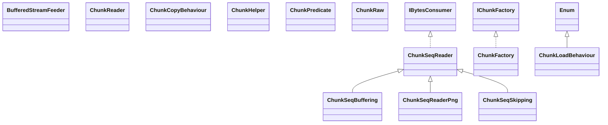

# pngj.jar

[Group index](README.md) | [All archives](../README.md)

## Scope and provenance

- **Donor:** `SQX_145_REFERENCE_ROOT/internal/libs/pngj.jar`.
- **SHA-256:** `6278c81c54106c78c0725718f73f80e5bfee2acea149eafab4c24a451cd6fc3c`; accessed 2026-10-06; captured `2026-10-06T18:54:51.906614+00:00`.
- **Classes:** 113 raw entries; 113 unique entry names. Duplicate occurrence indices are zero-based.
- **Inspection:** read-only ZIP hashing and class-file structural parsing; signatures/descriptors, modifiers, hierarchy and references only. Bytecode bodies are hashed, not published.
- **Allocation:** proposed `FEAT-RESULTS-PNGJ`, P08; [roadmap](../../sqx-full-application-roadmap.md). Domain README registration remains required.
- **Repository:** `01067f00031428613c6394064ca1bcadc1ba00ee`; review state unreviewed. Download label 145-dev1; installed build/activation and runtime equivalence unverified.
- **Limit:** every class/member is inventoried; declaration coverage does not establish consumed calls, defaults, formulas, failure semantics or algorithm parity.
- **Archive/resource index:** [098.json](../../../evidence/sqx145/archives/145/098.json).

## Complete member declarations

Member shards contain exact JVM names/descriptors, access flags, generic signatures, throws types, declared fields/methods, superclass/interfaces and referenced class names. All classes, nested/synthetic members and overloads are retained. Code length/hash is structural evidence, not a normalized algorithm comparison.

- [001.json](../../../evidence/sqx145/members/098/001.json) — SHA-256 `00f3be012a6af42540d2d115ef178d51c5bf36f0fff4238b3ff1f66a81dc1dde`.
- [002.json](../../../evidence/sqx145/members/098/002.json) — SHA-256 `774d064f429432b5537135e185d410e749b8f2e6e28da7df075a390793d03a1a`.

## Focused structural diagram

Up to twelve non-nested classes; arrows show declared inheritance/interfaces only. External type names are not evidence of an available body or an executed dependency.

## Class inventory

| Archive entry | Occurrence | Class SHA-256 | Fields | Methods |
| --- | ---: | --- | ---: | ---: |
| `ar/com/hjg/pngj/BufferedStreamFeeder.class` | 0 | `2af283ea6b53bab992be2f6e0711ac5104ab4d1f4857a4f02cb9078e5a7d6638` | 8 | 14 |
| `ar/com/hjg/pngj/ChunkReader$ChunkReaderMode.class` | 0 | `092eb585a72c0a3be66a33b2c2c415882aed94f27c72095b7c1b816860fc1e5c` | 4 | 4 |
| `ar/com/hjg/pngj/ChunkReader.class` | 0 | `e8935af9edbf6cce99a532fbdcf2bb52b769603878a5facf70c694ac38f40702` | 5 | 11 |
| `ar/com/hjg/pngj/ChunkSeqBuffering.class` | 0 | `4b2b5e14677505168fe31ad4896c63654e671f4a49f6dcfce9cd2105b95710b7` | 1 | 4 |
| `ar/com/hjg/pngj/ChunkSeqReader$1.class` | 0 | `31f28f221f7adadee2632999e0cfdeb51c175bd310f022e39e3e5ef08e020237` | 1 | 2 |
| `ar/com/hjg/pngj/ChunkSeqReader$2.class` | 0 | `edd2e8a55e32471b0c2b920aabc13b4e94fa5f94ae30bee3e65dd946d9fea17e` | 1 | 3 |
| `ar/com/hjg/pngj/ChunkSeqReader.class` | 0 | `471cc4f240da420d53de1a9712e14effeb4c9a38def381e186b7bff888d8f9ad` | 11 | 26 |
| `ar/com/hjg/pngj/ChunkSeqReaderPng$1.class` | 0 | `7247053fc315b08e417e3ce3444d857846bc5d1ff46f5e4b6b93616551600b87` | 1 | 1 |
| `ar/com/hjg/pngj/ChunkSeqReaderPng.class` | 0 | `a71b737a1cbad906cb7b91d62cd867261f1c88bca5dd0322bcfb6a9b2b4157a3` | 15 | 38 |
| `ar/com/hjg/pngj/ChunkSeqSkipping$1.class` | 0 | `1c61d19708c618d20e5f60254f646ba4d590e0de7f9105f69602bae7f01b2496` | 1 | 3 |
| `ar/com/hjg/pngj/ChunkSeqSkipping.class` | 0 | `6ffaf9eb2abbcf09cbae04ad451651ead0ecb71a6f971151a35f77be2d8875fa` | 2 | 8 |
| `ar/com/hjg/pngj/chunks/ChunkCopyBehaviour$1.class` | 0 | `4eaceee1f2ad9fc4d866e35fe6594a0ef3c054d686fff4224c94b7015f48f737` | 2 | 2 |
| `ar/com/hjg/pngj/chunks/ChunkCopyBehaviour.class` | 0 | `60346c954552e710cbb8e3035826467a4b32e443eb950abd5a483772cdec1e2e` | 9 | 4 |
| `ar/com/hjg/pngj/chunks/ChunkFactory.class` | 0 | `8608072f2dbe2ba675aa0c149bf4e5ab1f2ef6db01f6f00a29d41501cf8feaa9` | 1 | 6 |
| `ar/com/hjg/pngj/chunks/ChunkHelper$1.class` | 0 | `518a4da54aba7ea318a06378112b697423031ba85d609babcbe36d3ef7136af5` | 1 | 1 |
| `ar/com/hjg/pngj/chunks/ChunkHelper.class` | 0 | `a1784600c923ecfbb0a2f4d5e29de216cf0d30437160128e0bee39b79dd76dde` | 23 | 21 |
| `ar/com/hjg/pngj/chunks/ChunkLoadBehaviour.class` | 0 | `2530bd13359a5ed6c4166c60719837f66877abf79eebe71f5f5e669daf69ca0d` | 5 | 4 |
| `ar/com/hjg/pngj/chunks/ChunkPredicate.class` | 0 | `35b99336f1124f919476f194b0006b783c68eee3c4cfd90994360f9327d56d1d` | 0 | 1 |
| `ar/com/hjg/pngj/chunks/ChunkRaw.class` | 0 | `c30cec0617172233e64b37aecf1612a7d98d3503f61f018b6735cddf610e6e44` | 7 | 15 |
| `ar/com/hjg/pngj/chunks/ChunksList$1.class` | 0 | `cbdf6d479ef7a26e708e8f73b676bcb4cb4580201fe380c4df161b849e143ede` | 1 | 2 |
| `ar/com/hjg/pngj/chunks/ChunksList$2.class` | 0 | `3dfeafd25413bd05ed0b192f617a2e9175afa27318ca7e58e7b74895fb80050d` | 2 | 2 |
| `ar/com/hjg/pngj/chunks/ChunksList$3.class` | 0 | `93eb2bd0e7e93a4820014d53d6462b449dfe58aa79ef6495f432646245266025` | 2 | 2 |
| `ar/com/hjg/pngj/chunks/ChunksList.class` | 0 | `599b7620cb145fc6eccad0a7ec673ac65dd764148f5e97a6e5d5382fbe164585` | 10 | 12 |
| `ar/com/hjg/pngj/chunks/ChunksListForWrite$1.class` | 0 | `d98e3cd3f62f0f636f5c3b82e835231b1ba5d8c9781b95a3e671843af14a6cb9` | 2 | 2 |
| `ar/com/hjg/pngj/chunks/ChunksListForWrite.class` | 0 | `d506c88886f6bacf40f898b99478ec27712472a6ce9d7dcd048a9de621bd4d3c` | 2 | 14 |
| `ar/com/hjg/pngj/chunks/PngBadCharsetException.class` | 0 | `d54fc0880f0cb40a6f03326919026dee8317212569156fea84e642421dea334e` | 1 | 3 |
| `ar/com/hjg/pngj/chunks/PngChunk$ChunkOrderingConstraint.class` | 0 | `16599f3f7c51a009be7b0fa8e73883b0a6b3e64b7a0fd5198d021de013631a5d` | 8 | 9 |
| `ar/com/hjg/pngj/chunks/PngChunk.class` | 0 | `95fe18b9b2f3444c257fc0dfffedb07ff23899073987bd32fbea1b7be38e48fe` | 8 | 17 |
| `ar/com/hjg/pngj/chunks/PngChunkACTL.class` | 0 | `8612bfdf0567324db89dd025444d0e528c20f506cafe7a95235c829d33a73006` | 3 | 8 |
| `ar/com/hjg/pngj/chunks/PngChunkBKGD.class` | 0 | `7be5642d60cc6d7c03367a568ca63f5fa2f8aac026289b0fe1e25aa4f304d2a5` | 6 | 10 |
| `ar/com/hjg/pngj/chunks/PngChunkCHRM.class` | 0 | `934f494f11d73b61e70d588ee60cb32d3b5a4ab46770bcd1494d4794ae77a623` | 9 | 6 |
| `ar/com/hjg/pngj/chunks/PngChunkFCTL.class` | 0 | `00b83f1a0cdfff9d619d3f21f2b1f40603881c8b1c437423a541c1ae4c96d9f4` | 15 | 23 |
| `ar/com/hjg/pngj/chunks/PngChunkFDAT.class` | 0 | `c750d75d3d9438ee4d1e1ebc1d79be59d4ed409852232d7bdc885c3fa7da2268` | 4 | 10 |
| `ar/com/hjg/pngj/chunks/PngChunkGAMA.class` | 0 | `cdba6f793403404541ef1acb2a78a2d0577835a9c4d233618f87ff78a1de47e9` | 2 | 6 |
| `ar/com/hjg/pngj/chunks/PngChunkHIST.class` | 0 | `8ff4b22facc7ed46aa6d42bfccee42f56882d644292e1479e3c7a335a9156983` | 2 | 6 |
| `ar/com/hjg/pngj/chunks/PngChunkICCP.class` | 0 | `a90361672fa8d2f4f1bb1eace29eb7c3c6fbe76064543dcd955366e51759a95f` | 3 | 9 |
| `ar/com/hjg/pngj/chunks/PngChunkIDAT.class` | 0 | `269bf98ab56206eaf5aed4811a3c8f3868504f4832aa207dc7daba0752da5096` | 1 | 4 |
| `ar/com/hjg/pngj/chunks/PngChunkIEND.class` | 0 | `318b1af7b7b6525ebc79d6e4c6dec32c5e8681ab12c3484913ba5f3c78b7390e` | 1 | 4 |
| `ar/com/hjg/pngj/chunks/PngChunkIHDR.class` | 0 | `a2f65108a760b012bb2452e8b6ea86d5824a2c7cd46e19adb5d35bd2ebb4cafc` | 8 | 22 |
| `ar/com/hjg/pngj/chunks/PngChunkITXT.class` | 0 | `1c7e51306dfa5b42f9a80f651e0033e840f59b615eb66a75fe7117a4e7ea5cb0` | 4 | 9 |
| `ar/com/hjg/pngj/chunks/PngChunkMultiple.class` | 0 | `143c59705b42871f6aec06f2723034f500050830c47e7c65e0d4a03be39ef826` | 0 | 2 |
| `ar/com/hjg/pngj/chunks/PngChunkOFFS.class` | 0 | `5c529d977cb5122070bc9f23ad3cea651a9304d7c965cdf36934f7ca24cc6da3` | 4 | 10 |
| `ar/com/hjg/pngj/chunks/PngChunkPHYS.class` | 0 | `a90a1fc1d5b98aa240d374cc031f5004d9af07264fd7bfd97ee9c8e4e3c15885` | 4 | 14 |
| `ar/com/hjg/pngj/chunks/PngChunkPLTE.class` | 0 | `6199a8fce51f0b12620ad09264d14b7906bb7889ba29459677b1ea0ef9a04056` | 3 | 11 |
| `ar/com/hjg/pngj/chunks/PngChunkSBIT.class` | 0 | `7436f59c23fbde0411399fcb67b93e4bf9395fccef4a7108c771acaf7ee9086a` | 6 | 11 |
| `ar/com/hjg/pngj/chunks/PngChunkSingle.class` | 0 | `95668b0fb4238ec98073da9fb249106dafa5fe31d7b37ca733fa5b7f0663df28` | 0 | 4 |
| `ar/com/hjg/pngj/chunks/PngChunkSPLT.class` | 0 | `2641d5d5a6acf8cf1a5164e5cac34041f11fc25d13b128b1c317143139e6ddf4` | 4 | 11 |
| `ar/com/hjg/pngj/chunks/PngChunkSRGB.class` | 0 | `88cdbf133abd245eca7dded6d32452e95e9361fc7e4f5b9c75a1118983c7bdcc` | 6 | 6 |
| `ar/com/hjg/pngj/chunks/PngChunkSTER.class` | 0 | `7d0d9801a76be706006b30a574e4cf2dd135e22ae5598e39f13523602d5b6ef3` | 2 | 6 |
| `ar/com/hjg/pngj/chunks/PngChunkTEXT.class` | 0 | `30c87c1e02d92b136f1e55a49cfa5ddadac6a0f5bf7ce6a1ee2340fb22bb65aa` | 1 | 4 |
| `ar/com/hjg/pngj/chunks/PngChunkTextVar$PngTxtInfo.class` | 0 | `522c31c53624e609c82dcb24bbaec430e881841d78ee1710d17ae08324d8c0ae` | 9 | 1 |
| `ar/com/hjg/pngj/chunks/PngChunkTextVar.class` | 0 | `6c114fc7f232f3b87f3ee651811a6b38b571328671ab493f4e12744584e8619d` | 12 | 5 |
| `ar/com/hjg/pngj/chunks/PngChunkTIME.class` | 0 | `8191c662b134258966a9a2e476bab5b8982e74b844ef1b512682ece01f67655b` | 7 | 8 |
| `ar/com/hjg/pngj/chunks/PngChunkTRNS.class` | 0 | `d60636a6bcd50d4d7fed6fe3c70c1fdd0c27c6e1b2f5d245f87957551693da20` | 6 | 14 |
| `ar/com/hjg/pngj/chunks/PngChunkUNKNOWN.class` | 0 | `4897ba683ca29b4d7737e6030597f0ae368b665eebfb57bd08cc2030884aa182` | 0 | 6 |
| `ar/com/hjg/pngj/chunks/PngChunkZTXT.class` | 0 | `17744d23aa3e81f220248920275394467c47976f34108724b511e5d3a4b6bc77` | 1 | 3 |
| `ar/com/hjg/pngj/chunks/PngMetadata$1.class` | 0 | `b6d6a02e468ad78b31ec2f87cce7357358b62a0d1393db00e7da1e538411d797` | 2 | 2 |
| `ar/com/hjg/pngj/chunks/PngMetadata.class` | 0 | `ad4c291c2372703a62830342384105e1db38f1dffe22b19df7322a601b226bef` | 2 | 20 |
| `ar/com/hjg/pngj/DeflatedChunkReader.class` | 0 | `93b37f2494edf01468771d4c0e972e9a5417f31cddf49bd86ce2d0412092a018` | 5 | 6 |
| `ar/com/hjg/pngj/DeflatedChunksSet$State.class` | 0 | `778420bc8b7cd6794c54a74771e9ce85339dfde6de682aef83f3b8cdab8e787c` | 5 | 6 |
| `ar/com/hjg/pngj/DeflatedChunksSet.class` | 0 | `3bbcfd89f76280eb54d9d569ffb40d99d832fb801df8c90455377b0b1bd79642` | 14 | 27 |
| `ar/com/hjg/pngj/Deinterlacer.class` | 0 | `c9ae0ef3736ae2e2749893179ca580add1dd93de63038797207febb969194dc3` | 15 | 20 |
| `ar/com/hjg/pngj/FilterType.class` | 0 | `fea502acf737fda013ef417d2711402bbf08d576c0951f6d410ed15d4af69ddd` | 18 | 12 |
| `ar/com/hjg/pngj/IBytesConsumer.class` | 0 | `ad1e3684da4d059c544db6ca28a1273a91522952f25220744a488d50d563459a` | 0 | 1 |
| `ar/com/hjg/pngj/IChunkFactory.class` | 0 | `de6d4cf0515530f497137867b19ef0a4281f9c611a655a4457ba220a6badb491` | 0 | 1 |
| `ar/com/hjg/pngj/IDatChunkWriter.class` | 0 | `c5635af1f35db20353eef27736cca1bee7fc192dcf69de3e92821e007c31221e` | 8 | 15 |
| `ar/com/hjg/pngj/IdatSet$1.class` | 0 | `85b70f7a33ba68618a66d0e29667146aa23db10227cacc66c61bfd574fd55c6e` | 1 | 1 |
| `ar/com/hjg/pngj/IdatSet.class` | 0 | `7f11cab4d0daa21e3749234ca61dcc509ffd8254f10c9b128e0d079e19b247e4` | 6 | 19 |
| `ar/com/hjg/pngj/IImageLine.class` | 0 | `44ebb73bb05e7793933b0849b7062c69ade90f08fab06a01617874e809d303e8` | 0 | 3 |
| `ar/com/hjg/pngj/IImageLineArray.class` | 0 | `eaca3f0c3e224a89ae7f319d951d30477143d90cbefe37e64802e392d01fcca5` | 0 | 4 |
| `ar/com/hjg/pngj/IImageLineFactory.class` | 0 | `1839095ddae6c1d16b82bd3776223b213691fe6c577d22c25ac7c3da6cbf1951` | 0 | 1 |
| `ar/com/hjg/pngj/IImageLineSet.class` | 0 | `2e5a676ff36fc0f2884d6ac7cc96b633c19efd7e74fb136d7e10206ee1ba2fb9` | 0 | 4 |
| `ar/com/hjg/pngj/IImageLineSetFactory.class` | 0 | `7fc9f34e9b0f5e26a41cc3d207a3bad19ef244aa76591e46404b223e0c74f649` | 0 | 1 |
| `ar/com/hjg/pngj/ImageInfo.class` | 0 | `87d4fe23d9ee29a81cf02773fd61f64be12b2f51ce8c0821f4b797c4860e4910` | 16 | 11 |
| `ar/com/hjg/pngj/ImageLineByte$1.class` | 0 | `fd45225c57a957a480d1d2564e16494e862a223598dc7ca1b3d14aa23a19bd8f` | 0 | 3 |
| `ar/com/hjg/pngj/ImageLineByte.class` | 0 | `dbacf52af7667ca75965394d3735a49b6ea7c8a50f52747c31910087659f2d41` | 5 | 16 |
| `ar/com/hjg/pngj/ImageLineHelper.class` | 0 | `cc2323518fe6d9c1cad3d31c50eb6d236c329cec23ec6279f1f9ae09c59b7496` | 4 | 35 |
| `ar/com/hjg/pngj/ImageLineInt$1.class` | 0 | `bb896b16c7a4c692f687fc17f23523ab6555d1a0bce3bfbee1b85007e3c9935c` | 0 | 3 |
| `ar/com/hjg/pngj/ImageLineInt.class` | 0 | `e2cd414f9a7baf9ea3e29fa3f8cda903047592cda3b07b4f18fbeab8dee2ac39` | 4 | 13 |
| `ar/com/hjg/pngj/ImageLineSetDefault$1$1.class` | 0 | `f742e3e6896922cf4ed388a41f70ef0af0070fcf4b099e63d21ef858031b6210` | 2 | 2 |
| `ar/com/hjg/pngj/ImageLineSetDefault$1.class` | 0 | `fe28e519c87777f91735c92a94571ddd8af1457c1b0c977d09e881f3c7a20fb7` | 1 | 2 |
| `ar/com/hjg/pngj/ImageLineSetDefault.class` | 0 | `2feaf1c8689975b565b4d9e0730fa456409b29cef64ab6673279ffd56a246df1` | 8 | 13 |
| `ar/com/hjg/pngj/IPngWriterFactory.class` | 0 | `b5f7a9af91df10702a63b4e92094b9df4b89838e051c17a9cf91b44d0813e77c` | 0 | 1 |
| `ar/com/hjg/pngj/pixels/CompressorStream.class` | 0 | `2bab4a43a65fe1cdb0ad403920d70fb1db0c88c151cdd5f543d95cc4fc86e5fb` | 10 | 15 |
| `ar/com/hjg/pngj/pixels/CompressorStreamDeflater.class` | 0 | `d954bf2392c577e53f53127fe835118164ad666f9c037f7252cbab53857248d0` | 3 | 8 |
| `ar/com/hjg/pngj/pixels/CompressorStreamLz4.class` | 0 | `45365847c422654d832a80d19d0048f17c7d38272cfa061d7c5c3841857f674f` | 5 | 8 |
| `ar/com/hjg/pngj/pixels/DeflaterEstimatorHjg.class` | 0 | `7293fd5858b028582a70cb75151883b50aea3556b4f36811a7567bdad1918c72` | 21 | 21 |
| `ar/com/hjg/pngj/pixels/DeflaterEstimatorLz4.class` | 0 | `c95d39065974741b4b25e082bc7fe4a9bbf605a508f488569bc25aa2f10a3bb5` | 22 | 21 |
| `ar/com/hjg/pngj/pixels/FiltersPerformance$1.class` | 0 | `d71dba8111cbd52e260cc32409b0e2f2dbf0675a0b0ad9ed4686c670d63c5786` | 1 | 1 |
| `ar/com/hjg/pngj/pixels/FiltersPerformance.class` | 0 | `4f046740c6b46169fa46d5640fdd50e4f1dd67a4093986949110629c2d6d214c` | 13 | 14 |
| `ar/com/hjg/pngj/pixels/PixelsWriter$1.class` | 0 | `8f27bd6a4116bfd9a2d2a643fbc5f2373b5eaaa92f76bd7a089a34c16c061b20` | 1 | 1 |
| `ar/com/hjg/pngj/pixels/PixelsWriter.class` | 0 | `49b71108fe4ff215d5d25eb34f23750e246f593f5ec20f204b897b4088463427` | 16 | 25 |
| `ar/com/hjg/pngj/pixels/PixelsWriterDefault.class` | 0 | `f1fd81011b465ce758d4f8f9d1e0280b313adf1cef2528245229f5c00cebbfb2` | 9 | 10 |
| `ar/com/hjg/pngj/pixels/PixelsWriterMultiple.class` | 0 | `c4b1bf01a99b7b69c3ff2f2bf37940c670ef15eae8053a6b77d51b4570c4ce6f` | 16 | 14 |
| `ar/com/hjg/pngj/PngHelperInternal$1.class` | 0 | `de3f9515023ce7d6d9fc3573af9c7a5e73a88c5e0c49934a813d608e325a9b0a` | 0 | 3 |
| `ar/com/hjg/pngj/PngHelperInternal.class` | 0 | `9a9b0af94c47b044eb3496b1c9a3f9ede3c190e92452aa4c06f6fe5b58eee40c` | 7 | 39 |
| `ar/com/hjg/pngj/PngHelperInternal2.class` | 0 | `8a7dcfa03a69acf813460619cfd223c276f52c7440c8897dad554308804fe937` | 0 | 2 |
| `ar/com/hjg/pngj/PngjBadCrcException.class` | 0 | `d4101de68d648ad56ee4eba6bb6ebddea5169955e22e9c88888279bc3378807c` | 1 | 3 |
| `ar/com/hjg/pngj/PngjException.class` | 0 | `d79973fb21670b8f845f0cb103bbd4a9fe1657810aafed45c629a95ac68cca1e` | 1 | 3 |
| `ar/com/hjg/pngj/PngjExceptionInternal.class` | 0 | `ae22c75ca6b6d0102734cb5f6e9cf55dc361d113497d2927235b1aa09aa817a1` | 1 | 3 |
| `ar/com/hjg/pngj/PngjInputException.class` | 0 | `8c2f766d76c5394984ed9e4560ea18793c31b3ee941444a33ef9977a094cd4f5` | 1 | 3 |
| `ar/com/hjg/pngj/PngjOutputException.class` | 0 | `547438c1871792009d9fd46cb7795efaf16c3ff108a80609b3df64c55dd541ef` | 1 | 3 |
| `ar/com/hjg/pngj/PngjUnsupportedException.class` | 0 | `82c42e5fbc52144a1decf00381c3c86007589f960463ab1fcdfec0b5ad992fe0` | 1 | 4 |
| `ar/com/hjg/pngj/PngReader.class` | 0 | `c0efcdcd82e89f94dc6e0cb0c1571ecab4673d7f62569f32add453a43c8a83ff` | 13 | 38 |
| `ar/com/hjg/pngj/PngReaderApng$1.class` | 0 | `5e3c81e97f2beda2cdedd2c57f5ab898cf8b4fe8e7896a9478e9cea92d0bb997` | 1 | 7 |
| `ar/com/hjg/pngj/PngReaderApng.class` | 0 | `0a9bbdfcc0834db1d0a840337a3300e59cd8422e2616056bf9a604909a17bcfb` | 5 | 19 |
| `ar/com/hjg/pngj/PngReaderByte.class` | 0 | `a565b9de3579221804f0a150bd140cffa88080151ab1487e7f7c00d825088957` | 0 | 3 |
| `ar/com/hjg/pngj/PngReaderFilter$1.class` | 0 | `f09ca9f2f8058d25518079a0947bbb3db75b807c2ce494475a84aac5d844ea6f` | 1 | 4 |
| `ar/com/hjg/pngj/PngReaderFilter.class` | 0 | `c496b3101342af91078467560562820b2b9537d2002521aa6c3a8ea37ff4c530` | 1 | 9 |
| `ar/com/hjg/pngj/PngReaderInt.class` | 0 | `651ada838e53cf6b021b61098e8d9befb8e9729a5665294193044c492618cb59` | 0 | 3 |
| `ar/com/hjg/pngj/PngWriter.class` | 0 | `b0233178c40658866b9ce4141a0079a451b08c88322b3209ad3004f3a4b829c3` | 14 | 30 |
| `ar/com/hjg/pngj/PngWriterHc.class` | 0 | `a7f50d5fc39d5cf05297c696efc1149f54cb4ae135a1742840477d22bc96a242` | 0 | 5 |
| `ar/com/hjg/pngj/RowInfo.class` | 0 | `9beceee20ff9d231c685ad107275604d725399ff2a7c82527f191f0377713ead` | 16 | 3 |
