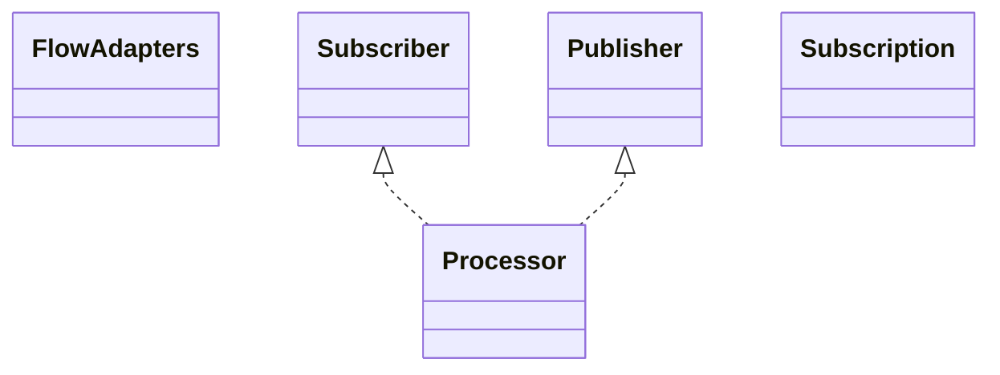

# reactive-streams-1.0.4.jar

[Group index](README.md) | [All archives](../README.md)

## Scope and provenance

- **Donor:** `SQX_145_REFERENCE_ROOT/internal/libs/reactive-streams-1.0.4.jar`.
- **SHA-256:** `f75ca597789b3dac58f61857b9ac2e1034a68fa672db35055a8fb4509e325f28`; accessed 2026-10-06; captured `2026-10-06T18:54:51.906614+00:00`.
- **Classes:** 13 raw entries; 13 unique entry names. Duplicate occurrence indices are zero-based.
- **Inspection:** read-only ZIP hashing and class-file structural parsing; signatures/descriptors, modifiers, hierarchy and references only. Bytecode bodies are hashed, not published.
- **Allocation:** proposed `FEAT-HOST-REACTIVE-STREAMS`, P02; [roadmap](../../sqx-full-application-roadmap.md). Domain README registration remains required.
- **Repository:** `01067f00031428613c6394064ca1bcadc1ba00ee`; review state unreviewed. Download label 145-dev1; installed build/activation and runtime equivalence unverified.
- **Limit:** every class/member is inventoried; declaration coverage does not establish consumed calls, defaults, formulas, failure semantics or algorithm parity.
- **Archive/resource index:** [103.json](../../../evidence/sqx145/archives/145/103.json).

## Complete member declarations

Member shards contain exact JVM names/descriptors, access flags, generic signatures, throws types, declared fields/methods, superclass/interfaces and referenced class names. All classes, nested/synthetic members and overloads are retained. Code length/hash is structural evidence, not a normalized algorithm comparison.

- [001.json](../../../evidence/sqx145/members/103/001.json) — SHA-256 `e21e95108c00e9666a7b0c937a7f80000b01c373f2fd9e74d7381cf9c5b7a028`.

## Focused structural diagram

Up to twelve non-nested classes; arrows show declared inheritance/interfaces only. External type names are not evidence of an available body or an executed dependency.

## Class inventory

| Archive entry | Occurrence | Class SHA-256 | Fields | Methods |
| --- | ---: | --- | ---: | ---: |
| `org/reactivestreams/FlowAdapters$FlowPublisherFromReactive.class` | 0 | `a985c33363dd7f604fedf230949295dcd3d077a1dad2db645fd2b2593737fe96` | 1 | 2 |
| `org/reactivestreams/FlowAdapters$FlowToReactiveProcessor.class` | 0 | `f8a830422a8871234d3e0f157c31a06124e21d78a6d0cd1e5c05c9d16ca5cd9b` | 1 | 6 |
| `org/reactivestreams/FlowAdapters$FlowToReactiveSubscriber.class` | 0 | `cdc0329a4a74bd8ad8ceeb4bf88d99dbad2e41cb1592e7cbb7e25c244b05ed92` | 1 | 5 |
| `org/reactivestreams/FlowAdapters$FlowToReactiveSubscription.class` | 0 | `61d3c69441efcd62af3a6c4830da24c87ac592e311715c87f9bb12b3314953d2` | 1 | 3 |
| `org/reactivestreams/FlowAdapters$ReactivePublisherFromFlow.class` | 0 | `184582134108643a06dceca1a6a2f2ff353963117fc21230c2b6a32028b87453` | 1 | 2 |
| `org/reactivestreams/FlowAdapters$ReactiveToFlowProcessor.class` | 0 | `ee10b6243fbf749ba17c8b546fa331b857c789664c8e6821e4598e7532b9d045` | 1 | 6 |
| `org/reactivestreams/FlowAdapters$ReactiveToFlowSubscriber.class` | 0 | `2308bf666a8af52fed92ed870da107c45188de92ef82a2547be4c64a3ec507e9` | 1 | 5 |
| `org/reactivestreams/FlowAdapters$ReactiveToFlowSubscription.class` | 0 | `1a0b45af9b8f1acaa268697c3929550ceba68b68f29c4e43e1e7310b9b79c319` | 1 | 3 |
| `org/reactivestreams/FlowAdapters.class` | 0 | `a94d044b325a545c8724e1ce4357cc7655d57224be66e762b69712227a44f962` | 0 | 7 |
| `org/reactivestreams/Processor.class` | 0 | `ba50adf006330032ff3f125f63418a6e9dafeae543bb461362e0673ee6426ace` | 0 | 0 |
| `org/reactivestreams/Publisher.class` | 0 | `62762e7ddb03a886d827b7d9e623bb21269f87e4c63d5287868d68abfddfafc3` | 0 | 1 |
| `org/reactivestreams/Subscriber.class` | 0 | `ec8ccf55aa1898e490a89fec4c1cb34d631bffa97fb19a06f91265d51311dadb` | 0 | 4 |
| `org/reactivestreams/Subscription.class` | 0 | `d6e40610ee7a1e14498bab196e22fb5aa8725cf3d6c4056491439c321068071e` | 0 | 2 |
