# reactor-core-3.8.2.jar

[Group index](README.md) | [All archives](../README.md)

## Scope and provenance

- **Donor:** `SQX_145_REFERENCE_ROOT/internal/libs/reactor-core-3.8.2.jar`.
- **SHA-256:** `e800681657a370c6416ae66b3060bf2fe87d3a3107bd7ce932acac0c2e002d97`; accessed 2026-10-06; captured `2026-10-06T18:54:51.906614+00:00`.
- **Classes:** 948 raw entries; 948 unique entry names. Duplicate occurrence indices are zero-based.
- **Inspection:** read-only ZIP hashing and class-file structural parsing; signatures/descriptors, modifiers, hierarchy and references only. Bytecode bodies are hashed, not published.
- **Allocation:** proposed `FEAT-HOST-REACTOR-CORE`, P02; [roadmap](../../sqx-full-application-roadmap.md). Domain README registration remains required.
- **Repository:** `01067f00031428613c6394064ca1bcadc1ba00ee`; review state unreviewed. Download label 145-dev1; installed build/activation and runtime equivalence unverified.
- **Limit:** every class/member is inventoried; declaration coverage does not establish consumed calls, defaults, formulas, failure semantics or algorithm parity.
- **Archive/resource index:** [104.json](../../../evidence/sqx145/archives/145/104.json).

## Complete member declarations

Member shards contain exact JVM names/descriptors, access flags, generic signatures, throws types, declared fields/methods, superclass/interfaces and referenced class names. All classes, nested/synthetic members and overloads are retained. Code length/hash is structural evidence, not a normalized algorithm comparison.

- [001.json](../../../evidence/sqx145/members/104/001.json) — SHA-256 `0ed6e45eb719a1654d227cb2de473d9174daef5b4dc5fe70d4f99faf23d69f9f`.
- [002.json](../../../evidence/sqx145/members/104/002.json) — SHA-256 `acf0cfc08919b7674a6cd04fb5ed6ed39449723ac3f49966340ff8a245490fe1`.
- [003.json](../../../evidence/sqx145/members/104/003.json) — SHA-256 `fd9eab93b3177ee70cfb09d845d53242341eb7a7d03902fc528aa008d7675458`.
- [004.json](../../../evidence/sqx145/members/104/004.json) — SHA-256 `7f4f28497500634d9fe2cc246fe74297d4e7f2b2a5629101207eba69d58dfcbf`.
- [005.json](../../../evidence/sqx145/members/104/005.json) — SHA-256 `2882e8031aa88bdd1458bb7523dfa459d7cadf78f033d37ea426cb4915f0928b`.
- [006.json](../../../evidence/sqx145/members/104/006.json) — SHA-256 `6c7edc5d59623729fcfdb1fd24abbc52b0c7c21048b5dfd058c835b5c65d5d3c`.
- [007.json](../../../evidence/sqx145/members/104/007.json) — SHA-256 `3928254c975aa44ea4076869a72da400d6224694d90723817b02d6c8fd881ade`.
- [008.json](../../../evidence/sqx145/members/104/008.json) — SHA-256 `d57f1828d6a918228d6c4dbb717db5f9cba703dcd4ac4f2db6a1581228bcc65c`.
- [009.json](../../../evidence/sqx145/members/104/009.json) — SHA-256 `2b6095ebfd133a186faaf4f433c231ac15490757a12000a9f865b2e276e8503e`.
- [010.json](../../../evidence/sqx145/members/104/010.json) — SHA-256 `9794cc0b4c99cd6a66e43d6f0515f30d40452b5add2c066df3ec4667f4e68b57`.
- [011.json](../../../evidence/sqx145/members/104/011.json) — SHA-256 `c2f2e7e69a116b4705859d4f1abd0b557d2a21a6c90c55f416846f726814fa50`.
- [012.json](../../../evidence/sqx145/members/104/012.json) — SHA-256 `75186d88029220310ab3fdfece6df3bd0d1251d793310b6e815215ffe648c4fc`.

## Focused structural diagram

Up to twelve non-nested classes; arrows show declared inheritance/interfaces only. External type names are not evidence of an available body or an executed dependency.

```mermaid
classDiagram
    class C0["CallSiteSupplierFactory"]
    class C1["BoundedElasticSchedulerSupplier"]
    class C2["BoundedElasticThreadPerTaskScheduler"]
    class C3["VirtualThreadFactory"]
    class C4["JdkFlowAdapter"]
    class C5["package_info"]
    class C6["CorePublisher"]
    class C7["CoreSubscriber"]
    class C8["Disposable"]
    class C9["Disposables"]
    class C10["Exceptions"]
    class C11["Fuseable"]
    class E0["Supplier"]
    E0 <|.. C0
    class E1["Function"]
    E1 <|.. C0
    E0 <|.. C1
    class E2["Scheduler"]
    E2 <|.. C2
    class E3["SchedulerState_DisposeAwaiter"]
    E3 <|.. C2
    class E4["Scannable"]
    E4 <|.. C2
    class E5["ThreadFactory"]
    E5 <|.. C3
    class E6["Thread_UncaughtExceptionHandler"]
    E6 <|.. C3
    class E7["Publisher"]
    E7 <|.. C6
    class E8["Subscriber"]
    E8 <|.. C7
```

## Class inventory

| Archive entry | Occurrence | Class SHA-256 | Fields | Methods |
| --- | ---: | --- | ---: | ---: |
| `META-INF/versions/11/reactor/core/publisher/CallSiteSupplierFactory.class` | 0 | `1d0ab8dad893c0ec308bf582844750fe0c8fcec8e6bb4856633cedbd7b9ab6d7` | 0 | 9 |
| `META-INF/versions/21/reactor/core/scheduler/BoundedElasticSchedulerSupplier.class` | 0 | `1c564901bb81446b1f260547a674e7cff6af3e59042eebb595414654088a9761` | 0 | 3 |
| `META-INF/versions/21/reactor/core/scheduler/BoundedElasticThreadPerTaskScheduler$BoundedServices$1.class` | 0 | `2c3802e904f4e54e162971c11b6ed8b045bedc0566905678340d090a587aff08` | 0 | 2 |
| `META-INF/versions/21/reactor/core/scheduler/BoundedElasticThreadPerTaskScheduler$BoundedServices$ActiveExecutorsState.class` | 0 | `a8ec042d237147c961e8d3b55700a83c389b7bbf3f62eedfc457113ea24334dc` | 2 | 1 |
| `META-INF/versions/21/reactor/core/scheduler/BoundedElasticThreadPerTaskScheduler$BoundedServices.class` | 0 | `c0b8ec4e0734d29d32168b1b50a49cef7be62a50d4886eabb68e411082b1e797` | 14 | 7 |
| `META-INF/versions/21/reactor/core/scheduler/BoundedElasticThreadPerTaskScheduler$SchedulerTask.class` | 0 | `a6d0b19a8eeb7ab8ae92c42dffdf11091eb5d3f624ddd7c0a6aa1b926ee4153c` | 15 | 26 |
| `META-INF/versions/21/reactor/core/scheduler/BoundedElasticThreadPerTaskScheduler$SequentialThreadPerTaskExecutor.class` | 0 | `1ff48d74ca9c6f609692256f92bf7ad785e73a9e34e5c9a56b18c15c21c1b3ba` | 14 | 35 |
| `META-INF/versions/21/reactor/core/scheduler/BoundedElasticThreadPerTaskScheduler$SingleThreadExecutorWorker.class` | 0 | `5e1efc237edc0288b0f685e3406f40d19495b7b629472610f857a21171caf8f7` | 2 | 7 |
| `META-INF/versions/21/reactor/core/scheduler/BoundedElasticThreadPerTaskScheduler.class` | 0 | `ca8518a9538508d53b13745a6f3685e75372484dd113524624e57ea969fbf894` | 8 | 20 |
| `META-INF/versions/21/reactor/core/scheduler/VirtualThreadFactory.class` | 0 | `2fb5f12209bef653643cd5545471a7c5ad06c5e653eac96e2960f9bcfd945f11` | 2 | 3 |
| `reactor/adapter/JdkFlowAdapter$1.class` | 0 | `3994336b3f23b216d3b0079e9640c9cd026d80300534d6aaa3711c89ab60a3cb` | 0 | 0 |
| `reactor/adapter/JdkFlowAdapter$FlowPublisherAsFlux.class` | 0 | `2b7c8d319c2369f377a7c97989d84874cdef310da03afa2ba9e200158e2cf2a0` | 1 | 4 |
| `reactor/adapter/JdkFlowAdapter$FlowSubscriber.class` | 0 | `b5a284e8fc49dc173aa3968f141e7776b73465df9f43f8d898f0855bd5fdead8` | 2 | 7 |
| `reactor/adapter/JdkFlowAdapter$PublisherAsFlowPublisher.class` | 0 | `feafa0fbe211b7b6156457527a85d113c9f2eab449e5b3ca164096f48eb16fa3` | 1 | 3 |
| `reactor/adapter/JdkFlowAdapter$SubscriberToRS.class` | 0 | `8c152cffc0420f5bf9b943142457c3b8309a102a7fe09ae388d9b11ca0dc9ac3` | 2 | 7 |
| `reactor/adapter/JdkFlowAdapter.class` | 0 | `9129d1172bd49d4e24a4f5efbf11b8a9cf4e79e991fbb4f30d31df38c27d43a4` | 0 | 3 |
| `reactor/adapter/package-info.class` | 0 | `7ab6e249b8cff7a09e141c2c136d63b7b2c9aa4e8c3ee7c31b2052e56ae138a3` | 0 | 0 |
| `reactor/core/CorePublisher.class` | 0 | `57aa0cd4102a489699e08fe3453626cb0d5e78806024ce4a0cf9e09ae6fddc4e` | 0 | 1 |
| `reactor/core/CoreSubscriber.class` | 0 | `f09f61595158dc439b35b4947551dd90f58062a43ef0fa70dd994e1e204298ca` | 0 | 2 |
| `reactor/core/Disposable$Composite.class` | 0 | `6e92eb1eb406e312f494b4190a3cf0d0be54c2b90b613bd20da0d843b5948e7a` | 0 | 6 |
| `reactor/core/Disposable$Swap.class` | 0 | `90b200154cbf265a4c7cbc74ddaa398d2aaab49e76ce483cff1a4a5b501ff2cb` | 0 | 2 |
| `reactor/core/Disposable.class` | 0 | `271aefdebd443574e019c555391101a441236c1472ecba49d71cec8a0a613c18` | 0 | 2 |
| `reactor/core/Disposables$AlwaysDisposable.class` | 0 | `8847c1b220805699ee9f52267a2db5a5285b4bbb038ef01952d639f16e51ae05` | 0 | 3 |
| `reactor/core/Disposables$ListCompositeDisposable.class` | 0 | `7ed56a3fe411a3d9c92f3c540f2902bda19c38c0025bd4e3a18f69d088880dcd` | 2 | 14 |
| `reactor/core/Disposables$NeverDisposable.class` | 0 | `aad5584c19a3087ae9ea4ce3723a5ff3ffef75c2eb71200f75de2a5a3c0e775c` | 0 | 3 |
| `reactor/core/Disposables$SimpleDisposable.class` | 0 | `3912a0f81fd62c0a804c60631310445ba0ddd2754ffb42352f6ffc842f399ca0` | 0 | 3 |
| `reactor/core/Disposables$SwapDisposable.class` | 0 | `7d8896ab90176ae6f3f7bd8b3691e31e7dd1eafdcbd860640ba534397dbf2b4e` | 2 | 8 |
| `reactor/core/Disposables.class` | 0 | `4514f410a1f44da035b74276e431b00e2c8fbe96969207d6311c91f066617824` | 1 | 13 |
| `reactor/core/Exceptions$BubblingException.class` | 0 | `97a47929204263ff041f1527497714ad8c550e27cd579d4ea05aea89f3642290` | 1 | 2 |
| `reactor/core/Exceptions$CancelException.class` | 0 | `029409083ea6a05ad3fb62f83ba45385a4819566a03c26a6edc0501085c80a3c` | 1 | 1 |
| `reactor/core/Exceptions$CompositeException.class` | 0 | `327444c65713a9062d533a03309b00e358b07781dd4c3f63e2458f11c2491a7a` | 1 | 1 |
| `reactor/core/Exceptions$ErrorCallbackNotImplemented.class` | 0 | `957161c96b83e5b6fa55d6be6ccf18e4864f31f7c3a9e1eab3205090ab66fa95` | 1 | 2 |
| `reactor/core/Exceptions$OverflowException.class` | 0 | `674688af18e6e8e092abf0cbcf1b66ff429d8d512a46d95d0cee5bcca78b4ad8` | 0 | 1 |
| `reactor/core/Exceptions$ReactiveException.class` | 0 | `7d055be99dcd64363c7612008880b3bf67578712ad39afc5de991b67a95af3d4` | 1 | 3 |
| `reactor/core/Exceptions$ReactorRejectedExecutionException.class` | 0 | `25983e074f2e5ded37f74a6ec980c2badaebfefe6f0a974621c75b796fded678` | 0 | 2 |
| `reactor/core/Exceptions$RetryExhaustedException.class` | 0 | `714a869d61a1c70e68da8479633d01cc769c759f2b1265301eb27291e2b752bc` | 0 | 2 |
| `reactor/core/Exceptions$SourceException.class` | 0 | `a308597c9b8bc0b766a3790d28acfd9237ca0e433b804851a8431e96b6894c75` | 1 | 2 |
| `reactor/core/Exceptions$StaticRejectedExecutionException.class` | 0 | `c19416df751857fd6ef408e79478bdb73f41ba781fbaafc45866538f42072ccc` | 0 | 3 |
| `reactor/core/Exceptions$StaticThrowable.class` | 0 | `8622bbaf3a70c08ced903f8a30ecc3607689fd100e9132c79a8915fc270d8c59` | 0 | 3 |
| `reactor/core/Exceptions.class` | 0 | `268320012822eca5ee5876099580d2a775c2f69d2c455bbf62ffd7e9c3377167` | 7 | 38 |
| `reactor/core/Fuseable$ConditionalSubscriber.class` | 0 | `1a267fdd59e0ffac0c8febabe8bccb50aefcce05621d01f38cf2094833500945` | 0 | 1 |
| `reactor/core/Fuseable$QueueSubscription.class` | 0 | `d29613516c9d6b4df5ae90ec53bc231924730fa28446f8549c71ce53c8369596` | 1 | 15 |
| `reactor/core/Fuseable$ScalarCallable.class` | 0 | `a0afcd0d3bcc1c4257e4a760a228d9126b0387a78c9f7a9ea488af79dc974630` | 0 | 0 |
| `reactor/core/Fuseable$SynchronousSubscription.class` | 0 | `07f4964d012c6bcb05ddf32a2345b37a7e2f7dba6ea7813d94b939c61cb86042` | 0 | 1 |
| `reactor/core/Fuseable.class` | 0 | `a5d5d545d4d81ae4949ae66e4ad450021f777be36a42c67cca11fc50f9348e24` | 5 | 2 |
| `reactor/core/Scannable$Attr$1.class` | 0 | `1a3fba693d6520a5b010ec88ff3e96efead82a95934eae615ea0063c9121ad78` | 0 | 5 |
| `reactor/core/Scannable$Attr$2.class` | 0 | `00680c334d4e38b1466585b54a547504955e16227c2fa55f12c2364f9db7e412` | 0 | 5 |
| `reactor/core/Scannable$Attr$3.class` | 0 | `d06fe6141bbbb9cb5ea58b78bd958903c1ec93b549e2103e1e3e314878a7252f` | 3 | 4 |
| `reactor/core/Scannable$Attr$RunStyle.class` | 0 | `1f1357308e5a3b88cf3880bc02d52e2a5687755b6acc83a19d47af9abfdb5381` | 4 | 5 |
| `reactor/core/Scannable$Attr.class` | 0 | `10beb297da02c69237b5fb673abff1140388b4a580e66c0e9cb89683e22fac93` | 21 | 7 |
| `reactor/core/Scannable.class` | 0 | `efc45bbfaea5141f537a6e31613f634875bfa5aa4000a05884a79590055ed9e4` | 1 | 17 |
| `reactor/core/observability/DefaultSignalListener.class` | 0 | `1fa1c6613e86dea8d9e12a48d0133169241ad9beca0dd104d9985ebd84c61b03` | 1 | 17 |
| `reactor/core/observability/SignalListener.class` | 0 | `b89dd5ab9f127675b58dcfb7405ef3398ff0b7a59cd2bef0e8d65c7b1f698535` | 0 | 16 |
| `reactor/core/observability/SignalListenerFactory.class` | 0 | `f670092601121b23f615303c9a53823e685cc0888549e625d9a6442d82e7974a` | 0 | 2 |
| `reactor/core/package-info.class` | 0 | `1523f11b3865266b8bb2a49cc577ddd41139252f1d58282100a87a52448f48a4` | 0 | 0 |
| `reactor/core/publisher/AssemblyOp.class` | 0 | `4d1a647729a74ca793af1bec3e327e2694d03a523d014bbf779c32fd2aff2b33` | 0 | 0 |
| `reactor/core/publisher/BaseSubscriber.class` | 0 | `73d859816ec1c6907fe241b7acd19bd08d268d5c3d49cf283e9657b768777104` | 2 | 20 |
| `reactor/core/publisher/BlockingFirstSubscriber.class` | 0 | `5d90c6fb890cf9e7a9ab1173206f1ae14a896df80086787abad821385a443c4d` | 0 | 4 |
| `reactor/core/publisher/BlockingIterable$SubscriberIterator.class` | 0 | `e82f534f2e4fe4f2c99f9e5e94c727d6afac0b334bbe6d225273aadb652754a7` | 12 | 12 |
| `reactor/core/publisher/BlockingIterable.class` | 0 | `7ff16a5800379ce7dc4b207d481db06dcf2b8691d0191634bcd662e757530a42` | 4 | 6 |
| `reactor/core/publisher/BlockingLastSubscriber.class` | 0 | `f907c12209fab785bde0658a9a52f296813adc89d7068d96cbf11b458cc89f12` | 0 | 4 |
| `reactor/core/publisher/BlockingMonoSubscriber.class` | 0 | `b40f1ff240d517305f82e3759ce8d68367d7b9cc325b13e3ea5e504081ae0a25` | 0 | 4 |
| `reactor/core/publisher/BlockingOptionalMonoSubscriber.class` | 0 | `4fec63a6c60c35b1f6a9c997e027aaea17e0aeb0bac38ac5daa1632c90e76efa` | 5 | 12 |
| `reactor/core/publisher/BlockingSingleSubscriber.class` | 0 | `57e47ba3eeac614368d67e9c8be5a871ef9e415cfe0db70f49d0e427c73a2989` | 5 | 9 |
| `reactor/core/publisher/BufferOverflowStrategy.class` | 0 | `fb56ba86a9b3183e640caf21eb71c9afe4c88a0af9508f566baff0c57fc45301` | 4 | 5 |
| `reactor/core/publisher/CallSiteSupplierFactory$ExceptionCallSiteSupplierFactory$TracingException.class` | 0 | `80c5c7a51b02cced625b0fa39a43af8bd3ef323a2f4fc4123371845abccc303e` | 0 | 3 |
| `reactor/core/publisher/CallSiteSupplierFactory$ExceptionCallSiteSupplierFactory.class` | 0 | `96b8b5a9d9b20c1b0beffed0a7c46feebf5315812398c41fc14ab72752f3e05a` | 0 | 3 |
| `reactor/core/publisher/CallSiteSupplierFactory$SharedSecretsCallSiteSupplierFactory$TracingException.class` | 0 | `bd4b254a38471756656cd95097c047ec3d0c4e3b75a181019a5177d2d5560874` | 1 | 4 |
| `reactor/core/publisher/CallSiteSupplierFactory$SharedSecretsCallSiteSupplierFactory.class` | 0 | `96699738696ab96767fe2891cc399633c9418237a22b53b15d8bdffc0a212da2` | 0 | 4 |
| `reactor/core/publisher/CallSiteSupplierFactory.class` | 0 | `607502f5661ff71d14ab07a82fc13da72e851bd263a891da79f49cdcf85de1df` | 1 | 6 |
| `reactor/core/publisher/ConnectableFlux.class` | 0 | `fee56bdd88dd328c04742c120256bb027ac92b1e5239c23ad660ba87914caf2c` | 1 | 16 |
| `reactor/core/publisher/ConnectableFluxHide.class` | 0 | `13e0db0fff341c1883122b9a8ca6928dccadc98d9f40a6df2b12da3b01c0b0f9` | 0 | 5 |
| `reactor/core/publisher/ConnectableFluxOnAssembly.class` | 0 | `5a52226c3ee91aa7c2e710142f327db9a3b4ed3fafc0d7c810b28217b55851fc` | 1 | 6 |
| `reactor/core/publisher/ConnectableFluxRestoringThreadLocals.class` | 0 | `ac0bb979871e8529b8ebbe3b0f312e5a0b8d9c116ecf570a92aafbef7630d37f` | 1 | 3 |
| `reactor/core/publisher/ConnectableLift.class` | 0 | `ada380f7cfac0bee264344ca7b69e196bad9618f9d024cf43cbf83a9a4f187b1` | 1 | 6 |
| `reactor/core/publisher/ConnectableLiftFuseable.class` | 0 | `22d1ca6419a8a3c6ec398ff8635439dd72ca1d9765db8a8c201e5654038f2373` | 1 | 6 |
| `reactor/core/publisher/ContextHolder.class` | 0 | `aa6569d9bb0e4755ac4973bd7aa2e8731fecc9095b16a67cb4b75b3d60da2bb7` | 0 | 1 |
| `reactor/core/publisher/ContextPropagation$ContextCaptureNoPredicate.class` | 0 | `56e37c41d838f16e58e14d99cd98e8b8d262b852b6e473dfc5abe312e0a265e8` | 0 | 3 |
| `reactor/core/publisher/ContextPropagation$ContextQueue.class` | 0 | `39a3682efa12310cc49bafddc49eaeae92ab51a602e0dee773f69acd0d5a6bdf` | 6 | 7 |
| `reactor/core/publisher/ContextPropagation$ContextRestore103SignalListener.class` | 0 | `cf584043930e0f9f06c1d16f5337b48460da27f6428744bf1669947318ce01ee` | 1 | 2 |
| `reactor/core/publisher/ContextPropagation$ContextRestoreSignalListener.class` | 0 | `77d57f48e7ce0ffeb2d99266510cc53380ac09cfc286218a7e00bef82156aa97` | 2 | 18 |
| `reactor/core/publisher/ContextPropagation$Envelope.class` | 0 | `ca4fb6eb57d4e69345619bf57ad976c8515429dcd3d62b51731fff1f76899bda` | 2 | 1 |
| `reactor/core/publisher/ContextPropagation$ReactorScopeImpl.class` | 0 | `8ded3aa6260566778fdcd016744bb540e8ff22a24911f1e44ba16b2c50db421c` | 2 | 5 |
| `reactor/core/publisher/ContextPropagation$ReactorScopeImpl100.class` | 0 | `395c97890351227a42e414b672a36bff0b388419c5c575867ab8ace230e53369` | 2 | 5 |
| `reactor/core/publisher/ContextPropagation.class` | 0 | `6c6818820f62beaef42ef5ecbb1c0a69c8cbee5d582a0873ba6c3663271d1673` | 3 | 17 |
| `reactor/core/publisher/ContextPropagationSupport.class` | 0 | `903171be531811101ffc8a49430bbb73b70fbfaf8c208a84b9700483a9f4f3f1` | 5 | 8 |
| `reactor/core/publisher/ContextTrackingFunctionWrapper$1.class` | 0 | `0457bb6961e28af955b00eb6d67ddacc01b4d6ff8104a5274d75a8ea023553f6` | 3 | 3 |
| `reactor/core/publisher/ContextTrackingFunctionWrapper.class` | 0 | `a6931eb3c44425be7dcfc60f4c70ba5d5e775e5347e482ca4908ea78e5d85213` | 3 | 5 |
| `reactor/core/publisher/DelegateProcessor.class` | 0 | `079cd71e9803a619e0d06cdfd64c9e5902aa1f5ce83f3824c0cddca3260f313f` | 2 | 13 |
| `reactor/core/publisher/DirectInnerContainer.class` | 0 | `7af3c1691f6da5a640274d8764074f08ed5f22b56b3d2f1d05350e001659c14f` | 0 | 2 |
| `reactor/core/publisher/DirectProcessor$1.class` | 0 | `c46adb21412f26ffe1177d86860ae2270a4eba6bec41ef4be7595038b2675876` | 1 | 1 |
| `reactor/core/publisher/DirectProcessor.class` | 0 | `64d7e1a461ab5f17f77a50db529a5a0dcd10a3e2724e967415292ef2f365c64f` | 3 | 24 |
| `reactor/core/publisher/DrainUtils.class` | 0 | `ab8bdff2b7190c5ac18890297dabe15088496cdee790863b49791fbd240afc83` | 2 | 7 |
| `reactor/core/publisher/EmitterProcessor$EmitterDisposable.class` | 0 | `8a02de9661f5a80d776e312dcd3bb94ea289fa951b7a8c31a214509d7a3a24fe` | 1 | 3 |
| `reactor/core/publisher/EmitterProcessor$EmitterInner.class` | 0 | `e3209265bd40ee1399663caf7a0dc4581aaf44a080869c1e51f60bd2e515220d` | 1 | 3 |
| `reactor/core/publisher/EmitterProcessor.class` | 0 | `814cac19dc99d93db5623b2e8f5197afdbc2a6df42db847d6b4fa4aab1793a57` | 16 | 38 |
| `reactor/core/publisher/FlatMapTracker.class` | 0 | `abc0491643950048a7571563802de32d799f9ad251da9a5b2592ca02dac4a5e0` | 7 | 14 |
| `reactor/core/publisher/Flux$1.class` | 0 | `d74268a272787098dd45bdbecfe0911db6280861bd7afd0a671ef24ce3d73459` | 1 | 3 |
| `reactor/core/publisher/Flux$2.class` | 0 | `7cbc0b51a7c99ba3db8c7403e142d8236af857ead9fc70c18fa9f6ea15347830` | 2 | 5 |
| `reactor/core/publisher/Flux$3.class` | 0 | `634fc068d700642768c61ed006e52a771b768c7c62129a4620083f39d2b6abbe` | 2 | 5 |
| `reactor/core/publisher/Flux$4.class` | 0 | `6d4ecf6d38385793abf236bd7a03ad1aa613ad1c6be265692e13b40082d714bb` | 3 | 2 |
| `reactor/core/publisher/Flux$5.class` | 0 | `fdb7a6a341de24497ac1ca5bdc05ded967da29465306bbe3afdda9926b7d62a7` | 3 | 2 |
| `reactor/core/publisher/Flux.class` | 0 | `673ac75890262813715a7e040e700f21b7c2a46d3eb3db6dae23e54cf52c7ef1` | 6 | 486 |
| `reactor/core/publisher/FluxArray$ArrayConditionalSubscription.class` | 0 | `5047526d54c0cb8261762caf74c2c7f5aa3d4ec7f9ae98fa906bc096672080a1` | 6 | 12 |
| `reactor/core/publisher/FluxArray$ArraySubscription.class` | 0 | `21ff3adc62ecbad65bc4cb6d9fc6759d23a9504e11c336c98d3cfa7a56bce979` | 6 | 12 |
| `reactor/core/publisher/FluxArray.class` | 0 | `9421489b706168fee431ea15367b7ffe9ac78448a6f7bd5a17c53c6fba29f504` | 1 | 4 |
| `reactor/core/publisher/FluxAutoConnect.class` | 0 | `9d18884d403378ab4c8b7b062c9827a49aa7a3b26bf55feae96a173263b555e4` | 4 | 5 |
| `reactor/core/publisher/FluxAutoConnectFuseable.class` | 0 | `2cb9a73034f4ce3e6e809a0208c4b4120424d329814c166009c62140b321b2e1` | 4 | 5 |
| `reactor/core/publisher/FluxBuffer$BufferExactSubscriber.class` | 0 | `0998fd26b4ed5a98811e813c4edd235edaf492f2258f18f9a95ef7a37935c6a9` | 6 | 9 |
| `reactor/core/publisher/FluxBuffer$BufferOverlappingSubscriber.class` | 0 | `7a69c23472e68cd311b0fb52f6303835d0f677c184ad71cb9fad893c6e71cff5` | 13 | 12 |
| `reactor/core/publisher/FluxBuffer$BufferSkipSubscriber.class` | 0 | `0f2182517d28f601003aac30c01b907ddc7a35427234a4047c08aa8cf27cd854` | 11 | 10 |
| `reactor/core/publisher/FluxBuffer.class` | 0 | `ad5a394ff03e0993a4d607a040eacb1d70492329c6167c84188a858f7b2e981c` | 3 | 4 |
| `reactor/core/publisher/FluxBufferBoundary$BufferBoundaryMain.class` | 0 | `a4630c66e2894f2a83d8a0394ce72eff06bd8643d82f1bceac3a0ba1d75b022e` | 9 | 14 |
| `reactor/core/publisher/FluxBufferBoundary$BufferBoundaryOther.class` | 0 | `5adbcbc3792cb13087b2144552d827c1d5fe0cc6c5d8dafe9743d25f72bdcd36` | 1 | 7 |
| `reactor/core/publisher/FluxBufferBoundary.class` | 0 | `0579810927747828f59573dbc9afb284d8ca158babe8f04858e7ed2f213f2a00` | 2 | 4 |
| `reactor/core/publisher/FluxBufferPredicate$BufferPredicateSubscriber.class` | 0 | `a3b74e3a2719c2322df98baeba2548f12fa51916495c4e98193d8c23dca481b0` | 13 | 25 |
| `reactor/core/publisher/FluxBufferPredicate$ChangedPredicate.class` | 0 | `3eb67fff4471fc65b6d0bd7d29f6191257880107d2f271e1409f0dda6754c53a` | 3 | 3 |
| `reactor/core/publisher/FluxBufferPredicate$Mode.class` | 0 | `30cad2932cc96e5f085d12e2607c4db649077018dfbd3a7ada50a53be3b49167` | 4 | 5 |
| `reactor/core/publisher/FluxBufferPredicate.class` | 0 | `d34765b1aa69f9f9ddc84a6ff1202fdf910e791df72c6af83f2cdeec212d926d` | 3 | 4 |
| `reactor/core/publisher/FluxBufferTimeout$BufferTimeoutSubscriber.class` | 0 | `f72d03f320c5b45de5a0b22f10e9f5ee47d8e1444c51f3e9d6d976d54a5189af` | 22 | 18 |
| `reactor/core/publisher/FluxBufferTimeout$BufferTimeoutWithBackpressureSubscriber.class` | 0 | `093aa2977c4934527dfb509cf2711dce05b9de76b09feceb0ce409b4d0bccd49` | 28 | 33 |
| `reactor/core/publisher/FluxBufferTimeout.class` | 0 | `b8653e36d82f6babfc99e945bab1718a3df4cc14a53c28c3c7fc0819c4eeefae` | 7 | 4 |
| `reactor/core/publisher/FluxBufferWhen$BufferWhenCloseSubscriber.class` | 0 | `1dbf77311183c4973e2955abbc21e9864caf9dcac35f9f1a277b2f9b9188263e` | 5 | 10 |
| `reactor/core/publisher/FluxBufferWhen$BufferWhenMainSubscriber.class` | 0 | `dd9c0616f1f33fd74eb0753ff0423a6c30b62471e9266c265a709d4e429d5eb7` | 20 | 15 |
| `reactor/core/publisher/FluxBufferWhen$BufferWhenOpenSubscriber.class` | 0 | `835a7f3e3b56948fab744d2cbf50839dac4c4be795901ce9706e216f140450e7` | 3 | 10 |
| `reactor/core/publisher/FluxBufferWhen.class` | 0 | `1cb19374a9db5cc97d2cfb5fd13a4b9808f3382a01af85cad0e58297209ef6a4` | 4 | 4 |
| `reactor/core/publisher/FluxCallable.class` | 0 | `aa19b7d41c8bf2b0a1f9b1b72360be888d1092a8661462a733af5d92c122dcbd` | 1 | 4 |
| `reactor/core/publisher/FluxCallableOnAssembly.class` | 0 | `99b6ee69c2370ccf68105e68d77233cd34e118259e59b41f4c736597ad838184` | 1 | 6 |
| `reactor/core/publisher/FluxCancelOn$CancelSubscriber.class` | 0 | `54ab79eb7e90fe8a5f908e29a119421855b51188b46769505c5a73875c376420` | 5 | 11 |
| `reactor/core/publisher/FluxCancelOn.class` | 0 | `e18b82ee9b0aa6b7df2c7ee65ff030d995b325a3ff79f77546839bd96e4e603e` | 1 | 3 |
| `reactor/core/publisher/FluxCombineLatest$CombineLatestCoordinator.class` | 0 | `1386c2055404892623ce625bfb68fbe69e3c357db90b5872181acabb01569119` | 16 | 22 |
| `reactor/core/publisher/FluxCombineLatest$CombineLatestInner.class` | 0 | `fc3ac05f7d74b5d53f6481bc9807a3bad1c6e246a3a7bc75b47667a4f9b65741` | 7 | 10 |
| `reactor/core/publisher/FluxCombineLatest$SourceAndArray.class` | 0 | `f9d0fe58958aa3346379e954e4522675c555fc23bd4e7f98d80800f2bed6ea5f` | 2 | 2 |
| `reactor/core/publisher/FluxCombineLatest.class` | 0 | `7b6e2e29739066f03684871e4f73a3f24f38f7f75bf8b94c7737e14f4701c703` | 6 | 7 |
| `reactor/core/publisher/FluxConcatArray$ConcatArrayDelayErrorSubscriber.class` | 0 | `9250b1d904e85ae617a9ec46307d8657c6a84755a979e8669f37f88f429718a1` | 10 | 11 |
| `reactor/core/publisher/FluxConcatArray$ConcatArraySubscriber.class` | 0 | `358ea24fe547c4808d11810ecfc4205159da538a4dc608941ab3280d8e7b3a42` | 8 | 11 |
| `reactor/core/publisher/FluxConcatArray$SubscriptionAware.class` | 0 | `6c66b58b33addb329f8bfa2e8867dadd0f88c0d70676d54361e31751006454a7` | 0 | 1 |
| `reactor/core/publisher/FluxConcatArray.class` | 0 | `ca10ab03b2300e4b40249fa4d27e14d69a331c955583f253903927f0c6a5f303` | 4 | 9 |
| `reactor/core/publisher/FluxConcatIterable$ConcatIterableSubscriber.class` | 0 | `1f4c49005e1c324eebd4f64c2f877139b1f04bece801bf7f1b16669bdc93bb93` | 4 | 5 |
| `reactor/core/publisher/FluxConcatIterable.class` | 0 | `35946018ae39aa1ff46898beef3bdafee6217df9cc5e0372851fe0b8146656e0` | 1 | 3 |
| `reactor/core/publisher/FluxConcatMap$ConcatMapDelayed.class` | 0 | `9703b68b73b8fe709d0dcdcfad7e4bc7b2fe8b583d1a1581edc6df70a1201481` | 18 | 14 |
| `reactor/core/publisher/FluxConcatMap$ConcatMapImmediate.class` | 0 | `08ccb5c67616a356461bed7cfd57877cfe7d75d5d0d5ec5933e61bdcb4169f78` | 20 | 14 |
| `reactor/core/publisher/FluxConcatMap$ConcatMapInner.class` | 0 | `c633893d42b3e36a826d1c69735b8bd8cb893e7cb46730c28bdf6af52d0ae106` | 2 | 6 |
| `reactor/core/publisher/FluxConcatMap$ErrorMode.class` | 0 | `430dcc001ae95912a31015a586fb7a9daa5fd6206add8b95f35a06c1d09a9525` | 4 | 5 |
| `reactor/core/publisher/FluxConcatMap$FluxConcatMapSupport.class` | 0 | `c4bb2a62e4305b784ca51b2b5a4a88da5d7c3460bfc4f0320c4d3861863ece88` | 0 | 3 |
| `reactor/core/publisher/FluxConcatMap$WeakScalarSubscription.class` | 0 | `545a0a81595056fceb7eea783c7e66b445f695ba370b68fc009668a7cf5affdc` | 3 | 3 |
| `reactor/core/publisher/FluxConcatMap.class` | 0 | `d91ebd0b736f8459f53f8bb1cc6ac3e4086078e46589901e5d33dee635008748` | 4 | 5 |
| `reactor/core/publisher/FluxConcatMapNoPrefetch$FluxConcatMapNoPrefetchSubscriber$State.class` | 0 | `b24ce622cc126836d9d51cecbb5dd015327d30f129c0d15ff28de4b2326ede47` | 7 | 5 |
| `reactor/core/publisher/FluxConcatMapNoPrefetch$FluxConcatMapNoPrefetchSubscriber.class` | 0 | `5c0ffa0be7a98e1f7191cb2c0ecfd227ea893775eee28e96de0073d2d0d6ec5e` | 9 | 14 |
| `reactor/core/publisher/FluxConcatMapNoPrefetch.class` | 0 | `22c0b3bb9f57753c2ddda1f05d9437187127049d9a579e70652b07b32c019bce` | 2 | 4 |
| `reactor/core/publisher/FluxContextWrite$ContextWriteSubscriber.class` | 0 | `5869dc3e3c8df7b80c0986ab974a00ae5e419592a1e0cc9d66d44e558becd148` | 5 | 16 |
| `reactor/core/publisher/FluxContextWrite.class` | 0 | `6459bf86c20fb746c705967cadb05683332c743eac198663ca0810f004f5ed43` | 1 | 3 |
| `reactor/core/publisher/FluxContextWriteRestoringThreadLocals$ContextWriteRestoringThreadLocalsSubscriber.class` | 0 | `6d8dc46b0c3372fe0dd2f07c3235f48399bf5f2d1683d0a4e39a6643965ad027` | 4 | 11 |
| `reactor/core/publisher/FluxContextWriteRestoringThreadLocals.class` | 0 | `2bcf21ef2300ac5b7f7261bd9b3bd86f8a6a14d237f1f45819e7070d71933609` | 1 | 3 |
| `reactor/core/publisher/FluxContextWriteRestoringThreadLocalsFuseable$FuseableContextWriteRestoringThreadLocalsSubscriber.class` | 0 | `e358b7f46b52e2cc3b24c8663870ce9a5e56a10ba6ffc5e6005e7efb286919fa` | 4 | 16 |
| `reactor/core/publisher/FluxContextWriteRestoringThreadLocalsFuseable.class` | 0 | `f6bd03efdfdf41998f699c02cf88b13533a7de980dce45607f86ec9478e7f9cc` | 1 | 3 |
| `reactor/core/publisher/FluxCreate$1.class` | 0 | `014cf01f108055ec14a0c3743b2f2ac6611fad928e334c22eac3f7b94587d155` | 1 | 1 |
| `reactor/core/publisher/FluxCreate$BaseSink.class` | 0 | `9ee8b503139fdd5903b41c90732f846f7a5816c817748353b3185251c6933c53` | 12 | 27 |
| `reactor/core/publisher/FluxCreate$BufferAsyncSink.class` | 0 | `72c688cb02ad591ead6fe07ede4777efe5951864296838e7f9c704a588a57e04` | 5 | 10 |
| `reactor/core/publisher/FluxCreate$CreateMode.class` | 0 | `f356b9ec7b12cae7bec77552e757aa0663a86399e5e84ade8b8af7afb23cba58` | 3 | 5 |
| `reactor/core/publisher/FluxCreate$DropAsyncSink.class` | 0 | `87e57b603645311d8722974d2bdfaf262e5824dcd27df81b48944c0bdce14058` | 0 | 3 |
| `reactor/core/publisher/FluxCreate$ErrorAsyncSink.class` | 0 | `a058d935dda1b3245b2699512ef876aa9793ad8b0cdfa49bf72dee6e52a4056d` | 0 | 3 |
| `reactor/core/publisher/FluxCreate$IgnoreSink.class` | 0 | `ba960ecde7a60ec71d12d5b5a68bb82a719b7c9b613c7397063ad292565312d2` | 0 | 3 |
| `reactor/core/publisher/FluxCreate$LatestAsyncSink.class` | 0 | `c83cda5779768362851b04bd3b5e7122b52edd6f8490ee7718ce287575e7008a` | 5 | 10 |
| `reactor/core/publisher/FluxCreate$NoOverflowBaseAsyncSink.class` | 0 | `81a9e39b93447f987a5878e16531eb78c5e61880a4bf61930c6af19aef777b3c` | 0 | 3 |
| `reactor/core/publisher/FluxCreate$SerializeOnRequestSink.class` | 0 | `f65f5ed263fc8d4b25e3eff7ee67a937e8bd56f0ff9b74f5f75a4f994a4ba07b` | 3 | 13 |
| `reactor/core/publisher/FluxCreate$SerializedFluxSink.class` | 0 | `71a42e74cc5af6fee245179a1d569305f0e289581fd3f89d693f5b9d48a4110f` | 8 | 16 |
| `reactor/core/publisher/FluxCreate$SinkDisposable.class` | 0 | `d63bb63503465b88dfe0a4b8e51c4c06ef2951826bee92837cc4322fee5e710a` | 2 | 3 |
| `reactor/core/publisher/FluxCreate.class` | 0 | `d01e5d50501c8f9c46b7ab2c6fbb1a9293795ed898d1ae7ee90640b4ff4e421d` | 3 | 4 |
| `reactor/core/publisher/FluxDefaultIfEmpty$DefaultIfEmptySubscriber.class` | 0 | `d32b74095ec11d981062f3b3995a345f9e4f526e62203a66f5f34b1fdb33c276` | 4 | 9 |
| `reactor/core/publisher/FluxDefaultIfEmpty.class` | 0 | `4985ca9df907a6ec085cec2537ebbe94bd91311f4287947ffe0ae50e9761e229` | 1 | 3 |
| `reactor/core/publisher/FluxDefer.class` | 0 | `a1be5fd07672bdf15b43f88d8ec89f89b95d6f072356789d16ba1b708c519180` | 1 | 3 |
| `reactor/core/publisher/FluxDeferContextual.class` | 0 | `6bf15c15f8f57a9c749b42f07aad14c32f78dc21b12608327df48f4d070483a1` | 1 | 3 |
| `reactor/core/publisher/FluxDelaySequence$DelaySubscriber$OnComplete.class` | 0 | `d53ec107eba5104352f2f7b6e02196379b9b7370791efc55c5b0e0b58fadaaaf` | 1 | 2 |
| `reactor/core/publisher/FluxDelaySequence$DelaySubscriber$OnError.class` | 0 | `01f510ad5c6172793582d9132cbbf167ce07f74d0d6c7474bdca19bf225eff98` | 2 | 2 |
| `reactor/core/publisher/FluxDelaySequence$DelaySubscriber.class` | 0 | `0dde63ee3dfc7cf370fe684955bfc7c52fdd352cc7c2d24f0823cb4692bf9785` | 8 | 12 |
| `reactor/core/publisher/FluxDelaySequence.class` | 0 | `86857fb3632596f4adcf8a1dc488c19ec7eb3f2d8c9013c43fb229b21336a5e5` | 2 | 3 |
| `reactor/core/publisher/FluxDelaySubscription$DelaySubscriptionMainSubscriber.class` | 0 | `41b4718fed7cc896d84a9289f4f965da76ceb242e8e94909e38b8633eb8cfcfa` | 2 | 7 |
| `reactor/core/publisher/FluxDelaySubscription$DelaySubscriptionOtherSubscriber.class` | 0 | `2761515f04055c15df95974b82871987e1bd59c69015930e33acf35987a9d438` | 4 | 9 |
| `reactor/core/publisher/FluxDelaySubscription.class` | 0 | `7426d9763bb95bbbf8865a06a2afd24b7b4d9b816d036eddc50014fb92c2da13` | 1 | 6 |
| `reactor/core/publisher/FluxDematerialize$DematerializeSubscriber.class` | 0 | `70b3adf91c277741b8c11c6f2e0b3f7dad30180f9fb869d42e618d659b14015f` | 6 | 11 |
| `reactor/core/publisher/FluxDematerialize.class` | 0 | `cc4ba7179feb15a2303b58976ca5c840952b6626622d8b2fa746ed3f7fad3d52` | 0 | 3 |
| `reactor/core/publisher/FluxDetach$DetachSubscriber.class` | 0 | `1b7faa2da2a196afea6a3c0a638c7146c673af4ccaee8c7cd7f948a1c9c2f5b5` | 3 | 11 |
| `reactor/core/publisher/FluxDetach.class` | 0 | `fb6fe0eb569fde2a1e74c0a59f346915054d92a4f13ac0c8f906775706681f12` | 0 | 3 |
| `reactor/core/publisher/FluxDistinct$DistinctConditionalSubscriber.class` | 0 | `74332f2596aa6ab7bb719343cbf1992b7a3df47dcbea8cf3836cf62ddaf894d9` | 8 | 10 |
| `reactor/core/publisher/FluxDistinct$DistinctFuseableSubscriber.class` | 0 | `657e22b736236039aef1bebb2010492d8392ada20087ab081fd36e0433413faa` | 9 | 15 |
| `reactor/core/publisher/FluxDistinct$DistinctSubscriber.class` | 0 | `e7918ef0da1c62715efa1fd5d5241a3171f00200e2d6dc951e380c14eca108ac` | 8 | 10 |
| `reactor/core/publisher/FluxDistinct.class` | 0 | `96085b2bd7d1d0d188f0390e63345e086fbe915cb6e731e06230bc4e8f1ac86d` | 4 | 3 |
| `reactor/core/publisher/FluxDistinctFuseable.class` | 0 | `8adaabb6ad778c44b9850db74ff6799ed9a7d12cafd8567b33d091f4fa7c5b2e` | 4 | 3 |
| `reactor/core/publisher/FluxDistinctUntilChanged$DistinctUntilChangedConditionalSubscriber.class` | 0 | `ded209d0d9ab33cf69ea14115a33abad02df419701eed53b791542dde8e01bc6` | 7 | 10 |
| `reactor/core/publisher/FluxDistinctUntilChanged$DistinctUntilChangedSubscriber.class` | 0 | `278d2a8b4664d08278552cd1669c4f5c68cd38043618002fe96a16fea70d8d53` | 7 | 10 |
| `reactor/core/publisher/FluxDistinctUntilChanged.class` | 0 | `ba9916a3107c6e8a7419d8cd47fb02999b11b6c2fa75580273330abaca236666` | 2 | 3 |
| `reactor/core/publisher/FluxDoFinally$DoFinallyConditionalSubscriber.class` | 0 | `d1af7dbcce6770ff016d19da14da10f8a4cbdf7c9cc9e0f8e792b07597d7bdcf` | 0 | 2 |
| `reactor/core/publisher/FluxDoFinally$DoFinallySubscriber.class` | 0 | `438d2b389f03d95ecd7b1441d6098f2a0752b0cdfa78acc8e3f1e02b937b393f` | 5 | 11 |
| `reactor/core/publisher/FluxDoFinally.class` | 0 | `e968960339ed1c77382fa743d06a7d5fba3567401ca09b443107f270b64feaec` | 1 | 4 |
| `reactor/core/publisher/FluxDoFirst.class` | 0 | `93da2190145add8db9f640ac1df02124225401c96e586fa1f17df2b1cffbbdbb` | 1 | 3 |
| `reactor/core/publisher/FluxDoFirstFuseable.class` | 0 | `1c9150e34dda2c7ea1e0f244196aeb47e998cf33bf6cfe112f197ae2e9b1299a` | 1 | 3 |
| `reactor/core/publisher/FluxDoOnEach$DoOnEachConditionalSubscriber.class` | 0 | `9e0ed105522fae079bee17ad0cabb879630d1af35d40ee49500fc487a76fb099` | 0 | 2 |
| `reactor/core/publisher/FluxDoOnEach$DoOnEachFuseableConditionalSubscriber.class` | 0 | `0731a07ccf82acc3d9d0c41ef134a3c7dbb74f184a2693060840736ba172320a` | 0 | 2 |
| `reactor/core/publisher/FluxDoOnEach$DoOnEachFuseableSubscriber.class` | 0 | `f9388ca4247568f695f042dc41cad9b3bfe9d39fa828f6444d8dc09cef743314` | 2 | 8 |
| `reactor/core/publisher/FluxDoOnEach$DoOnEachSubscriber.class` | 0 | `896529f65e6e032ed938bfd627ab5df93a7d993c60eecf1fd875b1dabaa9efd0` | 11 | 16 |
| `reactor/core/publisher/FluxDoOnEach.class` | 0 | `26c3c3f8402729c65159f8d25cb0477738e937b853e765c49d16f5fe845a072c` | 1 | 4 |
| `reactor/core/publisher/FluxDoOnEachFuseable.class` | 0 | `a12607b5599b6f1be3f74e26cac23177e17f63c53d6ac503250c561c663e6b3d` | 1 | 3 |
| `reactor/core/publisher/FluxElapsed$ElapsedSubscriber.class` | 0 | `9520b16e581802157a1db7d94f8e53a0e2ef39db7279c1f0c381ff0d63638e0a` | 6 | 17 |
| `reactor/core/publisher/FluxElapsed.class` | 0 | `d79bc356bb190dd01a3b1536070f43d05cb833ededb33081d3a2f91153743a61` | 1 | 3 |
| `reactor/core/publisher/FluxEmpty.class` | 0 | `1f7e085296f4ca6d5311c59c33138273306a55fb37248bc11bb3dd7ecdde40c9` | 1 | 6 |
| `reactor/core/publisher/FluxError.class` | 0 | `c596ca4b55e03519f4198b6668de390b8a8b5c4b9d0847e779448ee60fc825da` | 1 | 4 |
| `reactor/core/publisher/FluxErrorOnRequest$ErrorSubscription.class` | 0 | `a63b9084c22c612201339f2eb026bf65a9d8121ba06eb642fc203242ffbb09b6` | 4 | 6 |
| `reactor/core/publisher/FluxErrorOnRequest.class` | 0 | `f326f54cb17ec5bad9bcedaac23b8f372365ac4d4362665e75e4a3140db2e1a1` | 1 | 3 |
| `reactor/core/publisher/FluxErrorSupplied.class` | 0 | `1ce11ec2ffe1a8bf14f2b5066f028a93ae66a2f67ff515515c0ce856ed75912e` | 1 | 4 |
| `reactor/core/publisher/FluxExpand$ExpandBreathSubscriber.class` | 0 | `f4ca52e7750486f584e4b58f656425e994dc31a4f6c7eed821034e245bcfcdba` | 6 | 9 |
| `reactor/core/publisher/FluxExpand$ExpandDepthSubscriber.class` | 0 | `9690b09c111e3ae27b28ecc7a9d49d1cb83b5828b98b1bb08654cc8d8516566a` | 5 | 10 |
| `reactor/core/publisher/FluxExpand$ExpandDepthSubscription.class` | 0 | `4abfd64a783bd0bfb920757db95a21335aadd56a5eddf5252b26137d98c6e93f` | 16 | 13 |
| `reactor/core/publisher/FluxExpand.class` | 0 | `689713f73bedfc7401312ce0270fad5879b840637c7081596679b94c0583ac5b` | 3 | 3 |
| `reactor/core/publisher/FluxFilter$FilterConditionalSubscriber.class` | 0 | `ae7841aaed6f654a2f61d84a2a5062820254f4feba4979e6e315782fd4f737d8` | 5 | 10 |
| `reactor/core/publisher/FluxFilter$FilterSubscriber.class` | 0 | `a17464043bb451aab54a549f806231b2d0071cbc7851667ffedeec7cb1fee331` | 5 | 10 |
| `reactor/core/publisher/FluxFilter.class` | 0 | `877926a97e07234fa800017746fe5f62f9de4692dddc23f4649f5153c7ae8299` | 1 | 3 |
| `reactor/core/publisher/FluxFilterFuseable$FilterFuseableConditionalSubscriber.class` | 0 | `97d2e582347304352d5cde113f9ddb1d9fc2fdaf6c75ede724b890dd6e11e787` | 6 | 15 |
| `reactor/core/publisher/FluxFilterFuseable$FilterFuseableSubscriber.class` | 0 | `156a6dae1aae38fbaf18997f4911ff8b7d2012c959f3590b8fca3a78af543124` | 6 | 15 |
| `reactor/core/publisher/FluxFilterFuseable.class` | 0 | `f537646c112452319953ebb9f86ed9926e8fedf2c009f3448ae56202b537f281` | 1 | 3 |
| `reactor/core/publisher/FluxFilterWhen$FilterWhenInner.class` | 0 | `dc1765632abaeb7da7787d4bb991ee18505e9ced296ef1582268460d4ec19746` | 5 | 10 |
| `reactor/core/publisher/FluxFilterWhen$FluxFilterWhenSubscriber.class` | 0 | `bcb4396e13908f19ae5878b12f86b6220c18dae079e4a9ae90fdd9031cc3ded7` | 26 | 18 |
| `reactor/core/publisher/FluxFilterWhen.class` | 0 | `9698a284e21235e65c4c647d04deeb5d973a2dfb1c584bcff16e81990bbb9132` | 2 | 3 |
| `reactor/core/publisher/FluxFirstWithSignal$FirstEmittingSubscriber.class` | 0 | `7104637d073a544a28301aa6f5edf5bf0b2b4a71d2c0f4fd4df31e77edc9baf3` | 4 | 7 |
| `reactor/core/publisher/FluxFirstWithSignal$RaceCoordinator.class` | 0 | `1ccbdf099485ad1278cc57f7ec7d03722aaa0a1103ef977aacc0233702da4378` | 4 | 8 |
| `reactor/core/publisher/FluxFirstWithSignal.class` | 0 | `8ce4de15d323d8c40986eecaff807071c00320c4b859d5c58a84cd38e6fac56f` | 3 | 6 |
| `reactor/core/publisher/FluxFirstWithValue$FirstValuesEmittingSubscriber.class` | 0 | `69893e22db2b0f84e1713ccd40dc63cb2ef5386b0f142adcf5ddc4bcc6b7c99c` | 4 | 8 |
| `reactor/core/publisher/FluxFirstWithValue$RaceValuesCoordinator.class` | 0 | `d16a33dbfa5213d13915786bb7458b0cc9fc60c70b338739ae2d5b5f70c489c4` | 7 | 8 |
| `reactor/core/publisher/FluxFirstWithValue.class` | 0 | `f7d4227fb9f4a92bfd6552301ef4ca28f78ca27c1892d9b519aea5b7f9bb782c` | 3 | 7 |
| `reactor/core/publisher/FluxFlatMap$FlatMapInner.class` | 0 | `cd6d73770ce79770cbd5f84076da93de60f2c1124f1039903b87beb52bc203d1` | 10 | 10 |
| `reactor/core/publisher/FluxFlatMap$FlatMapMain.class` | 0 | `254b5d2b58ce7742e1e0b27d28408158a4a5892e983bf1f00d53ae400c9b57dd` | 22 | 31 |
| `reactor/core/publisher/FluxFlatMap.class` | 0 | `778a837909f07c92917ae9905468ca5e287a6be64cd86e27bea905f13de73463` | 6 | 5 |
| `reactor/core/publisher/FluxFlattenIterable$FlattenIterableSubscriber.class` | 0 | `9f5b63b8b7878212294cfcc8a675252e9c54015770be44f2effb0875d9580cd6` | 21 | 22 |
| `reactor/core/publisher/FluxFlattenIterable.class` | 0 | `81802679eb30ca6efd3855fd0dbe985d47996ac9f9cd7abf7240f2ab44147c1b` | 3 | 4 |
| `reactor/core/publisher/FluxFromMonoOperator.class` | 0 | `91649d59f019d386826b42fc41f4c1e619184fd0af41bcdbccf41dfdbdc85dd1` | 2 | 6 |
| `reactor/core/publisher/FluxGenerate$GenerateSubscription.class` | 0 | `e2b86a5796fe8a4cad3eed205f6e7663da6df9083154d4adf5102119fa6b8adc` | 12 | 19 |
| `reactor/core/publisher/FluxGenerate.class` | 0 | `bae3199d7c7443f5c726440666d45ebbe30c26baf66d9189166217cc66ed8029` | 4 | 9 |
| `reactor/core/publisher/FluxGroupBy$GroupByMain.class` | 0 | `1f994a045a15b8fbfd055e5ffeceb0a23a02120134bb13913936c31b407c9376` | 20 | 23 |
| `reactor/core/publisher/FluxGroupBy$UnicastGroupedFlux.class` | 0 | `f0383568c60f8e9906bf6e6e973c50ac3aa7598c46b49b0d109cc2e5d97177f7` | 21 | 22 |
| `reactor/core/publisher/FluxGroupBy.class` | 0 | `8d061215728f0654710dc9d41c77a3fcda0e784342bfc22c41fba36393b54af1` | 5 | 4 |
| `reactor/core/publisher/FluxGroupJoin$GroupJoinSubscription.class` | 0 | `7a89740840413c03beb21c315751a512e7ebe9b6532078ff0c7ceeaf2177734d` | 25 | 14 |
| `reactor/core/publisher/FluxGroupJoin$JoinSupport.class` | 0 | `3c73fcba6a9b6b3913c46b09121188a049cb41c38253c4e843292171de0caeeb` | 0 | 5 |
| `reactor/core/publisher/FluxGroupJoin$LeftRightEndSubscriber.class` | 0 | `18f4dd2a77cf17ca78e9d678a752f65afc74834adf59f0838a04de5bfb095198` | 6 | 10 |
| `reactor/core/publisher/FluxGroupJoin$LeftRightSubscriber.class` | 0 | `dccce21658c157221bfb2f3cdea4a8c9891989629a7eae9008fed6631aeb8167` | 5 | 10 |
| `reactor/core/publisher/FluxGroupJoin.class` | 0 | `1db751f6a9552894eda8b8602bfd721d947f0359f14a3097214f80390fa12cab` | 5 | 3 |
| `reactor/core/publisher/FluxHandle$HandleConditionalSubscriber.class` | 0 | `6de1378a6719a1b7c7b3387dc0fabb905559f218d678c68d30fbf23685aa0c44` | 7 | 16 |
| `reactor/core/publisher/FluxHandle$HandleSubscriber.class` | 0 | `84bedaaa9441f36cd2f8767f17cdd6228bbc0c0d98fcab51d09751923f755af3` | 7 | 16 |
| `reactor/core/publisher/FluxHandle.class` | 0 | `f648292457c8394434b1a6ee9edfa66bf8fc116bbc451df115fce9f1cf6f8c1e` | 1 | 3 |
| `reactor/core/publisher/FluxHandleFuseable$HandleFuseableConditionalSubscriber.class` | 0 | `8bc19264d022e477a7bf58b411a2a43cef5158c8f1c73dfcedba202687271659` | 8 | 21 |
| `reactor/core/publisher/FluxHandleFuseable$HandleFuseableSubscriber.class` | 0 | `997ac145728e52d97c922a636cdc51d472a7c2bc43114784b27db173142ce398` | 8 | 21 |
| `reactor/core/publisher/FluxHandleFuseable.class` | 0 | `58bb7484da4db542a5c703afa98f69f0141adef863bf955cb4568d0f5cb4421b` | 1 | 3 |
| `reactor/core/publisher/FluxHide$HideSubscriber.class` | 0 | `a9c16cb07e56ebda15d89c1335157606c4a142e32ee0c7f7aa46003c1542ffbf` | 2 | 9 |
| `reactor/core/publisher/FluxHide$SuppressFuseableSubscriber.class` | 0 | `f9a5555419474258d382e8f5c50a224010a3263cff703ae299a0814e57bfb6cb` | 2 | 14 |
| `reactor/core/publisher/FluxHide.class` | 0 | `d260d6f8cba766aa0beb7697d2d385af35be1a4d25118e1de7891f21ebded4f1` | 0 | 3 |
| `reactor/core/publisher/FluxIndex$IndexConditionalSubscriber.class` | 0 | `e000d4d7da3e5393d9f2ccff86945891b3c69270d9fcccf3348c4674b65703bd` | 5 | 10 |
| `reactor/core/publisher/FluxIndex$IndexSubscriber.class` | 0 | `16251ff804eb7dc0008faaf75fcf26082a6a2a3266ec81c6e7c32118c2cae6c1` | 5 | 9 |
| `reactor/core/publisher/FluxIndex$NullSafeIndexMapper.class` | 0 | `8a14c76ee1e13ff5617ce1cb648844ebb01f8898691df18f9d7e7c37318811a7` | 1 | 4 |
| `reactor/core/publisher/FluxIndex.class` | 0 | `2106202181243c409ad7a374d66c8a9812568b0dc4d566f5e0c284890f6879dd` | 1 | 3 |
| `reactor/core/publisher/FluxIndexFuseable$IndexFuseableConditionalSubscriber.class` | 0 | `0e696713b0c1c806aaaaf9f8e408fe74346424b19b6d4e86e28c7fbd089602e4` | 6 | 15 |
| `reactor/core/publisher/FluxIndexFuseable$IndexFuseableSubscriber.class` | 0 | `bf0ddb5a4b08a495c69ba803e6a0c0a4404da2adc1f6fc7163baebd4498f2149` | 6 | 14 |
| `reactor/core/publisher/FluxIndexFuseable.class` | 0 | `aa9d78d9d5f1500e420f1e073045fa7175236dd036cdb9fdd10be163de3e3678` | 1 | 3 |
| `reactor/core/publisher/FluxInterval$IntervalRunnable.class` | 0 | `4dfa9cfcf36cedec0cd80c66d5e0624ac3a3591f0716cd653c7660f9ef6427d2` | 6 | 7 |
| `reactor/core/publisher/FluxInterval.class` | 0 | `c37cec888a8f64f2fdb2bf3a4fcc815828c69946915460e795841d610d405fb3` | 4 | 3 |
| `reactor/core/publisher/FluxIterable$IterableSubscription.class` | 0 | `0e025678b835f334b9ce425c3f014e88f788961f22d5239e45ffa65d6dccee98` | 16 | 18 |
| `reactor/core/publisher/FluxIterable$IterableSubscriptionConditional.class` | 0 | `fe6089ae73353bf32c78d8ebfc356b4849274ea24471737d4164561e01b5cf77` | 16 | 18 |
| `reactor/core/publisher/FluxIterable.class` | 0 | `1ebdbcaeaf81466b05935d4a329ceee3b861a0cbf15e6a654617c6f68902c651` | 2 | 6 |
| `reactor/core/publisher/FluxJoin$JoinSubscription.class` | 0 | `692fe6bbb51e3a3ecd12809e1955b774702c235c0eeb95ad60071c48f0e8cef3` | 23 | 14 |
| `reactor/core/publisher/FluxJoin.class` | 0 | `3e5782580ed92e1aacc5e479a67d0ab64c0ecf220979443e5f5754a7d7613656` | 4 | 3 |
| `reactor/core/publisher/FluxJust.class` | 0 | `530a5286fcf51ce1ce012da916480d878a084e8c620b996aa37f05240dfc84b5` | 1 | 4 |
| `reactor/core/publisher/FluxLift.class` | 0 | `f8454fdbdf7d4051d9f3cd072820d3b2e1cc0d228928c61ec4f98c1e293ee4c0` | 1 | 4 |
| `reactor/core/publisher/FluxLiftFuseable.class` | 0 | `74551d7d48ce0cea51a3aadbd2058dbd80a49bbf40c54f1f10978139dbca153b` | 1 | 4 |
| `reactor/core/publisher/FluxLimitRequest$FluxLimitRequestSubscriber.class` | 0 | `e6ef4af186827b5d6e19a71b94b10b9b756da0275894c39d13b29869c84d91a2` | 6 | 10 |
| `reactor/core/publisher/FluxLimitRequest.class` | 0 | `0654dfa541198ef581cb0ff45462f73e9474517b5c359b333b5552417cc2b0b1` | 1 | 4 |
| `reactor/core/publisher/FluxLog.class` | 0 | `be4c99d64d23612b691a24775a60045c85eef5b0bd2bdf939104714d0fb345bb` | 1 | 3 |
| `reactor/core/publisher/FluxLogFuseable.class` | 0 | `e9fc436b6f7080201fb4caef9db5a793dbb585be9f6f0e71d3bb570d0201b001` | 1 | 3 |
| `reactor/core/publisher/FluxMap$MapConditionalSubscriber.class` | 0 | `cf129cc125fa640cb9615c557f5a5bf813aae872127d481c5f3c099288005773` | 4 | 10 |
| `reactor/core/publisher/FluxMap$MapSubscriber.class` | 0 | `1700507ee21a45d5c0695f30ae6960e70ced8c91360661618bff12700e5f0920` | 4 | 9 |
| `reactor/core/publisher/FluxMap.class` | 0 | `06dfe11561fbaa4a1b137d76f240a89ffe54cf77da714375d6dc8e29f2a2d7ab` | 1 | 3 |
| `reactor/core/publisher/FluxMapFuseable$MapFuseableConditionalSubscriber.class` | 0 | `133d19d49282e43214342c9e10984a39332b938b0e88c251f38cc77e088e4dcc` | 5 | 15 |
| `reactor/core/publisher/FluxMapFuseable$MapFuseableSubscriber.class` | 0 | `9ac1e6aa5b3f09cced116430e81fdd7c0a4a4c0509b677e14c2ec5417e33e033` | 5 | 14 |
| `reactor/core/publisher/FluxMapFuseable.class` | 0 | `bf152210bf9d6679d87009379e8aa9338dfb599305f76205b9ffcbeade0cfb8e` | 1 | 3 |
| `reactor/core/publisher/FluxMapSignal$FluxMapSignalSubscriber.class` | 0 | `09d23ea4aaf8c5697e2c12e08464e2bc13bdc4420d28d612b8df804aeb8df2af` | 11 | 16 |
| `reactor/core/publisher/FluxMapSignal.class` | 0 | `e52a8f284bda2f1aa59c4efa732bcfabdd7c86e289a4ae5b810e23e41d592297` | 3 | 3 |
| `reactor/core/publisher/FluxMaterialize$MaterializeSubscriber.class` | 0 | `33e353c56e0de978c473d7336ce06cedc2f33567f4fdeb58ff7608fc7dc4b9d3` | 9 | 21 |
| `reactor/core/publisher/FluxMaterialize.class` | 0 | `8703fa77f7832ba20cbd790e7f5dc1b7e8686f88ea8c33e94af25fad1b3f006b` | 0 | 3 |
| `reactor/core/publisher/FluxMerge.class` | 0 | `89fe557176bba7b602e7f130d7778d9d83f89eb7376bcc4256e70050a668a4ed` | 6 | 4 |
| `reactor/core/publisher/FluxMergeComparing$MergeOrderedInnerSubscriber.class` | 0 | `0e88077499ba0c9b1eeb887339baa575d26ccebe54bec056b72d41bb1f0a17fa` | 8 | 10 |
| `reactor/core/publisher/FluxMergeComparing$MergeOrderedMainProducer.class` | 0 | `77a81a6a4c2c5eb6d5fea0203552e823ff7a9e71de9eb421aeb7dc42ad6ed40e` | 18 | 11 |
| `reactor/core/publisher/FluxMergeComparing.class` | 0 | `a6e966147343b2e100d94a419a4519460bda97d3a3b2965ab7a4592cbe12bf8f` | 5 | 5 |
| `reactor/core/publisher/FluxMergeSequential$MergeSequentialInner.class` | 0 | `0a439c9b30f6bf7b18a3189b1fb007d714625ac17498a234df2526975f181d72` | 9 | 13 |
| `reactor/core/publisher/FluxMergeSequential$MergeSequentialMain.class` | 0 | `e23ec3a3190c0a27b25e3a3334a2f3f27254084cd3d40f773f419ad29b5a9a10` | 17 | 17 |
| `reactor/core/publisher/FluxMergeSequential.class` | 0 | `fe7a09ccef2468b3634dfc84644fe66bf77439a2d2e4154630d5d3b6ea6899c0` | 5 | 4 |
| `reactor/core/publisher/FluxMetrics$MetricsSubscriber.class` | 0 | `4bc3f8da13946819104020548192fa2c65a7158b9bb047b80e2a51237c8656e5` | 11 | 9 |
| `reactor/core/publisher/FluxMetrics.class` | 0 | `d940bbedc8847c7db873fcbaab49ea5ad7ceba4fe3ec7fc6bd2384a440b1eedb` | 17 | 13 |
| `reactor/core/publisher/FluxMetricsFuseable$MetricsFuseableSubscriber.class` | 0 | `d6abd8a4c43697e0aacd501e9d778cd2fc453a3b2b0dcae10bb97be39ddfb642` | 2 | 8 |
| `reactor/core/publisher/FluxMetricsFuseable.class` | 0 | `6ab1b4d2be0a6b41735f85ff87d6e9b3418efac62093252343baaa6dcb63b31c` | 3 | 3 |
| `reactor/core/publisher/FluxName.class` | 0 | `dfbd8225d884630e7ea054402ed5540108d497912b8bd37c13b861d426c5718e` | 2 | 5 |
| `reactor/core/publisher/FluxNameFuseable.class` | 0 | `c5900d8019bdccb0f0d73d505c75cf6513a4015166668585bbcbda5a17cdcf8c` | 2 | 3 |
| `reactor/core/publisher/FluxNever.class` | 0 | `2547d79659cad6576a315510cc3225e3f32d016fc34eff15d5715fd407732720` | 1 | 5 |
| `reactor/core/publisher/FluxOnAssembly$1.class` | 0 | `702f85599f43b850deb971f3a8fe493a94e64f0817af4db2c9bcc4c1185ee4c0` | 0 | 0 |
| `reactor/core/publisher/FluxOnAssembly$AssemblySnapshot.class` | 0 | `8dbe74772990ade912b8b5752c460dc425dd784356d1574fb21d7c8fe498d0d5` | 4 | 11 |
| `reactor/core/publisher/FluxOnAssembly$CheckpointHeavySnapshot.class` | 0 | `93ade5f6b41d8c24426e239ddab840db2795279e34bb88b3240792d79c230d73` | 0 | 2 |
| `reactor/core/publisher/FluxOnAssembly$CheckpointLightSnapshot.class` | 0 | `2c6dceae461d1cab6c1a6996a91324c78fc3ae2c07c5032293a7d7ce080de1cb` | 1 | 5 |
| `reactor/core/publisher/FluxOnAssembly$MethodReturnSnapshot.class` | 0 | `0dfe19af9ce3a48e556c75c627fd2b6256fe8de013eabb06ae9587f3532384ac` | 1 | 4 |
| `reactor/core/publisher/FluxOnAssembly$ObservedAtInformationNode.class` | 0 | `18bbf39443514f5823a23eeb6be777a447d43fa07da7297d8f8f18802b668aa3` | 7 | 6 |
| `reactor/core/publisher/FluxOnAssembly$OnAssemblyConditionalSubscriber.class` | 0 | `e66caa80ffaff6f0789beb3946d070afeb8c6dc400c5bed38f3035f5117c92fc` | 1 | 2 |
| `reactor/core/publisher/FluxOnAssembly$OnAssemblyException.class` | 0 | `affa1db1deba79a2c3cf4dc4e6924462d201e703789dcf4f37843c782838682a` | 4 | 12 |
| `reactor/core/publisher/FluxOnAssembly$OnAssemblySubscriber.class` | 0 | `9c67e11635c49bc20d0a05f6c8664362a68a14e6fce06d05b2ac9df8f7614aa2` | 8 | 18 |
| `reactor/core/publisher/FluxOnAssembly.class` | 0 | `7528bdf810200d5660a9979934bed36377589049134be53db4904c17a91a4dac` | 1 | 7 |
| `reactor/core/publisher/FluxOnBackpressureBuffer$BackpressureBufferSubscriber.class` | 0 | `e0f79db5ace9cbea67a5123fde09729928e0c079aadd6483ef64fc350c784de8` | 16 | 19 |
| `reactor/core/publisher/FluxOnBackpressureBuffer.class` | 0 | `1a7d174935f23031c893c59cdb72e5e4b5eab465b006c9f89b470ecaf3e50381` | 3 | 4 |
| `reactor/core/publisher/FluxOnBackpressureBufferStrategy$1.class` | 0 | `aa5e36902d0f85e2fca50e85e81201b1b1cd24b3dfc904acc0c0f9b07ae54aa6` | 1 | 1 |
| `reactor/core/publisher/FluxOnBackpressureBufferStrategy$BackpressureBufferDropOldestSubscriber.class` | 0 | `a1d0d10d72c76b246badcbf3bb2226cc0ac48307fbcea2f11aafe903dac3cb5c` | 14 | 14 |
| `reactor/core/publisher/FluxOnBackpressureBufferStrategy.class` | 0 | `12980aac04e9a92d284ae1cbb36be7d06a2d07f8a7c42051bcbfdf31e200bba3` | 4 | 4 |
| `reactor/core/publisher/FluxOnBackpressureBufferTimeout$BackpressureBufferTimeoutSubscriber.class` | 0 | `dc6e6fccf563e42ce2a26a1f8ea02fa9ea7da1e619329bc33518e99898f8bcf7` | 15 | 14 |
| `reactor/core/publisher/FluxOnBackpressureBufferTimeout.class` | 0 | `66578c477a3e24a9f8b355d160d5c939e07c2d11d4637ebe5a909d9ff7fdf508` | 5 | 6 |
| `reactor/core/publisher/FluxOnBackpressureDrop$DropSubscriber.class` | 0 | `066b84057892a339ba6765ee5d2ccc8ecae2a406c046acd504c4ed881df36aad` | 7 | 10 |
| `reactor/core/publisher/FluxOnBackpressureDrop.class` | 0 | `958c0a0d668203a4310372d605c208c73fa6ac89642fa810811f16e106267e15` | 2 | 7 |
| `reactor/core/publisher/FluxOnBackpressureLatest$LatestSubscriber.class` | 0 | `9e2654a5cf255acc5b7be3b7d0c5fa7349c88cecaca8b8f3e999ba1102c225d6` | 12 | 12 |
| `reactor/core/publisher/FluxOnBackpressureLatest.class` | 0 | `d4d09ee2588aed793c03c5a2a4d8ae814a361a2c6491a24cabb3ce06811ebaf4` | 0 | 4 |
| `reactor/core/publisher/FluxOnErrorResume$ResumeSubscriber.class` | 0 | `7f1d50374d982a7eaf066519268f66fd3cdacd977951be8b0c67c9b6f46525ee` | 2 | 5 |
| `reactor/core/publisher/FluxOnErrorResume.class` | 0 | `8f56ea8abcba9a4add723fe5d09c03009108f1c9b87d6185ea64e31723ef5d5e` | 1 | 3 |
| `reactor/core/publisher/FluxOnErrorReturn$ReturnSubscriber.class` | 0 | `946d074d8ca8f68a7b5db913d26db41348160bd674d8e9dc39f46109e89e130f` | 10 | 11 |
| `reactor/core/publisher/FluxOnErrorReturn.class` | 0 | `c775abd78d03f87e9217c343b23a292bce5f4888746844215beb2180ae7ba44e` | 2 | 3 |
| `reactor/core/publisher/FluxOperator.class` | 0 | `459e4fd0ba760d0e335b9d879a2708cc431589fdaa7b8973348acb74a2bd6420` | 1 | 2 |
| `reactor/core/publisher/FluxPeek$PeekSubscriber.class` | 0 | `a9d0ef0bbde51614589485a02d075bb1c143d961262a4994400a0e5b933bd832` | 4 | 10 |
| `reactor/core/publisher/FluxPeek.class` | 0 | `13372758638e346eda355a157ddf29418a47dcc5af5de88d63b275464c1b03c4` | 7 | 12 |
| `reactor/core/publisher/FluxPeekFuseable$PeekConditionalSubscriber.class` | 0 | `4163956f713c5bf66226edea0227c9477b8403b7cd75afa8f6e1d7c663c49f51` | 4 | 11 |
| `reactor/core/publisher/FluxPeekFuseable$PeekFuseableConditionalSubscriber.class` | 0 | `e9f562c5fc629f8243177068712b3475a5636f8137d92ecfeb361b7871f664d4` | 5 | 16 |
| `reactor/core/publisher/FluxPeekFuseable$PeekFuseableSubscriber.class` | 0 | `f307391889db4189257609437c95315293d326275dcfc07c37252d2488ee8fba` | 5 | 15 |
| `reactor/core/publisher/FluxPeekFuseable.class` | 0 | `f7ac8147b91cae1a5e0c40392ed484833119d96870a9e6c6941b6dab636b8f14` | 7 | 10 |
| `reactor/core/publisher/FluxProcessor.class` | 0 | `6d862c35a5db1dc3eee2ba6249964b3856aa8b2dd66cc62865dd6cc3f20baf5b` | 0 | 20 |
| `reactor/core/publisher/FluxPublish$PubSubInner.class` | 0 | `d9e684d9dd82a5cb84a7ff7b6aa4c166f0c3a26d9fac0545b17b6202be19cbd8` | 3 | 9 |
| `reactor/core/publisher/FluxPublish$PublishInner.class` | 0 | `3bcb374325a4f32fcf059359666f39fcc277721cb600e0d9023a6ab80f2040b8` | 1 | 4 |
| `reactor/core/publisher/FluxPublish$PublishSubscriber.class` | 0 | `441600ccaf2bb517d511fbf2295acc28e881232c381a1ee1cbccc91ca2d9573c` | 22 | 37 |
| `reactor/core/publisher/FluxPublish.class` | 0 | `df9daecd3acaf7e6d6d21faa59e10cd6039e9279621c9f5e333d7d45d4e6a23d` | 6 | 6 |
| `reactor/core/publisher/FluxPublishMulticast$CancelFuseableMulticaster.class` | 0 | `153dfbb868b468a5d50e24bc8f7a6a8b7ee8bff5a6d185a1ac9ae91024250f12` | 4 | 15 |
| `reactor/core/publisher/FluxPublishMulticast$CancelMulticaster.class` | 0 | `a9d2a9c0a894fe0a0ee42abd820db1b232b6af05924c809ac3453ab360d96827` | 3 | 14 |
| `reactor/core/publisher/FluxPublishMulticast$FluxPublishMulticaster.class` | 0 | `ecc34232f02b8c3259cd00087bf31b31adf9a6c956c8d95de06cba582b6715f3` | 18 | 16 |
| `reactor/core/publisher/FluxPublishMulticast$PublishMulticastInner.class` | 0 | `369969d9868bd85cda1d035faea1c996265815cfc30cf0434a9c723c4021f02c` | 4 | 7 |
| `reactor/core/publisher/FluxPublishMulticast$PublishMulticasterParent.class` | 0 | `27229f5299a07504b263f8896f51669ca963c8467c99e3ab201a881d0d7c00d9` | 0 | 1 |
| `reactor/core/publisher/FluxPublishMulticast.class` | 0 | `de9877a391290b933f6f4ff43c2a1df8dee25ac02d8d5aa63fd0e7605a401701` | 3 | 4 |
| `reactor/core/publisher/FluxPublishOn$PublishOnConditionalSubscriber.class` | 0 | `de4996d17128afb7973a82a12ac3f08bfe733ab0027547b118d374cc5f8fe06a` | 22 | 23 |
| `reactor/core/publisher/FluxPublishOn$PublishOnSubscriber.class` | 0 | `fbeb6ae24b39e0165bb9d0df139f119d4b39c8d8ddfc22a0b62a448105e75b10` | 21 | 23 |
| `reactor/core/publisher/FluxPublishOn.class` | 0 | `63100002c74d695967acd49030272afabfe648119888221764372a6ea3e5b8fa` | 5 | 4 |
| `reactor/core/publisher/FluxRange$RangeSubscription.class` | 0 | `366acadd9733ccf94b69c6aad3c02190153bfa1fb6d34fb726fe872884fe16cf` | 6 | 13 |
| `reactor/core/publisher/FluxRange$RangeSubscriptionConditional.class` | 0 | `72504c5546fbab35d69b7f085a772dfdb37ef2187a19426b776c4f064b600e2e` | 6 | 13 |
| `reactor/core/publisher/FluxRange.class` | 0 | `504a26cda376d24ad794829e269ded73937ea18dd6c027c191fe2a9f097ec70d` | 2 | 3 |
| `reactor/core/publisher/FluxRefCount$RefCountInner.class` | 0 | `62eda48532b280f7211b16911ca71829e48f467a559d8cadc700fee7d872c59d` | 11 | 19 |
| `reactor/core/publisher/FluxRefCount$RefCountMonitor.class` | 0 | `8339feedaadf085e9f07af81aa514efca88d74dced1ed45d11e3d79f367c82d0` | 6 | 6 |
| `reactor/core/publisher/FluxRefCount.class` | 0 | `5099ce44a9acca94d5cfcd1f33bda6340ceef6775816645af22e68ed6b1cf356` | 3 | 6 |
| `reactor/core/publisher/FluxRefCountGrace$RefConnection.class` | 0 | `a431dc5777d69c7ca87149a703ef4aba16bb21c27c131aa66fcbd0e4b7b8e667` | 7 | 6 |
| `reactor/core/publisher/FluxRefCountGrace$RefCountInner.class` | 0 | `10f99bbc23703db4f8306423fb5a70fc6271b92d5b7026668ce366d3dcf581e9` | 12 | 19 |
| `reactor/core/publisher/FluxRefCountGrace.class` | 0 | `4ce75619e74156b1cbfb107b3952dbaddf93cf56169c4076cfc023b692781e70` | 5 | 7 |
| `reactor/core/publisher/FluxRepeat$RepeatSubscriber.class` | 0 | `2f6826f46e0874aec02d182e3de8ddf7486417b7f42e73b35f8601b0b9acfb1d` | 5 | 6 |
| `reactor/core/publisher/FluxRepeat.class` | 0 | `734b1e74809dc4664b38e75a92dc8398ffb4c7d75ace5703ccd074e019b461f0` | 1 | 3 |
| `reactor/core/publisher/FluxRepeatPredicate$RepeatPredicateSubscriber.class` | 0 | `43df7a6ceb2a2c27cb8420d842a394f3232bdeae2f3906037d9b056a7bddcd0b` | 5 | 6 |
| `reactor/core/publisher/FluxRepeatPredicate.class` | 0 | `ef834b30fcfb3c9dc49dad98f5fad810dbc4d5863662b2fc28dd6698431480e1` | 1 | 3 |
| `reactor/core/publisher/FluxRepeatWhen$RepeatWhenMainSubscriber.class` | 0 | `c1df5a387edd6e89380d5b5345b723bde08ed3f3cc7a2cccf0eb5e9fcc6d93c0` | 7 | 13 |
| `reactor/core/publisher/FluxRepeatWhen$RepeatWhenOtherSubscriber.class` | 0 | `4fea1eda76b866e8f07256e48682662e46061fe9f52dfb11607f37f6388f02ce` | 2 | 12 |
| `reactor/core/publisher/FluxRepeatWhen.class` | 0 | `d77eb40e1e968cb9511150a518e73db93c6e0653f94da1076e8e7a2d20bb2c27` | 1 | 3 |
| `reactor/core/publisher/FluxReplay$ReplayBuffer.class` | 0 | `304c3167fd71aca6008a02f936b1471a7dd30e461023a23bedec4608c5eabb43` | 0 | 13 |
| `reactor/core/publisher/FluxReplay$ReplayInner.class` | 0 | `9000ca0d8048a06167c52e201ed0d8be19afc4a85f2aeee5ed17e7ecbc0083ee` | 11 | 24 |
| `reactor/core/publisher/FluxReplay$ReplaySubscriber.class` | 0 | `6e0271857e191e17ac7f06cfcfec1b5f2f6db18aedb11b3b93574ea0480b1fb0` | 16 | 26 |
| `reactor/core/publisher/FluxReplay$ReplaySubscription.class` | 0 | `ca4beae39b28acd666ff87a852e8eddb81f4422ced9bdeb0f1bb35ea1d9e0138` | 0 | 14 |
| `reactor/core/publisher/FluxReplay$SizeAndTimeBoundReplayBuffer$TimedNode.class` | 0 | `7290f250cf4da6e77012a00cac4bf7e762c536e7d5c496c73ad6bcad0bf592ab` | 3 | 2 |
| `reactor/core/publisher/FluxReplay$SizeAndTimeBoundReplayBuffer.class` | 0 | `ca34255cfde71bde32b0d00d46225747bf26610d617e270d456d8ef72d99d2f2` | 11 | 18 |
| `reactor/core/publisher/FluxReplay$SizeBoundReplayBuffer$Node.class` | 0 | `fd478945440524acbb249f17dcd0c4afd9d662dab0503f0d280499357cf3b7f8` | 3 | 2 |
| `reactor/core/publisher/FluxReplay$SizeBoundReplayBuffer.class` | 0 | `34e23a4852248fa0ffaa04e015933594f599ac5c4d74a859d184715eaec0eef2` | 8 | 17 |
| `reactor/core/publisher/FluxReplay$UnboundedReplayBuffer.class` | 0 | `d87c841050e30662b5b8162ed6785fd5eab421a73031b009211c717af35b1905` | 8 | 16 |
| `reactor/core/publisher/FluxReplay.class` | 0 | `1a2dffcb08f2d1f588b6bad2e0e048d6d2e26bba402b7d79d01ad7c817572d93` | 7 | 10 |
| `reactor/core/publisher/FluxRetry$RetrySubscriber.class` | 0 | `10d2fd77881528c5e687f512d006e0fde7ef9a138e7b3a9f6e6ef195bf904c61` | 5 | 6 |
| `reactor/core/publisher/FluxRetry.class` | 0 | `0338caa96def40a0b82181952947350c8a8f10b43be3321080f5397006ad1531` | 1 | 3 |
| `reactor/core/publisher/FluxRetryWhen$RetryWhenMainSubscriber.class` | 0 | `1fb3077b76c46d0d92abcb905ee237501340aa1c7eab6b7465d5e4b87407eb0b` | 12 | 17 |
| `reactor/core/publisher/FluxRetryWhen$RetryWhenOtherSubscriber.class` | 0 | `5e8ee93c916f4818f8d420612aa8559b80efe66e794205626162dbf37348c96a` | 2 | 11 |
| `reactor/core/publisher/FluxRetryWhen.class` | 0 | `07590578b81e30678253427ce1e82a7a9a7c7d6e43919183c391e38b107c598c` | 1 | 4 |
| `reactor/core/publisher/FluxSample$SampleMainSubscriber.class` | 0 | `43f082a1483291f7e9023a9733d5924b7a92a51a8b0bf343d95ab46c794af43c` | 10 | 16 |
| `reactor/core/publisher/FluxSample$SampleOther.class` | 0 | `8a43f969b0a4d78f00bfb895965087d84714c6aa160143e93f2df7a318d2a245` | 1 | 7 |
| `reactor/core/publisher/FluxSample.class` | 0 | `e14b4b61a2c1e3e9d5f9364becc406dc31f9fdd90df5dea6cc221180b0263322` | 1 | 4 |
| `reactor/core/publisher/FluxSampleFirst$SampleFirstMain.class` | 0 | `7dfde343054d5b47111287e82c16ba8325d31588966567fe58e8860c0ae6e2c4` | 14 | 15 |
| `reactor/core/publisher/FluxSampleFirst$SampleFirstOther.class` | 0 | `d997564ed819121c7e759ad2a258924ec4313eedf8eeea96a61b62d8cb0a9641` | 1 | 7 |
| `reactor/core/publisher/FluxSampleFirst.class` | 0 | `2f5a6c608ea380dfe4bbc30db67dfd924a7be8f129ff98e61c231039663aee74` | 1 | 4 |
| `reactor/core/publisher/FluxSampleTimeout$SampleTimeoutMain.class` | 0 | `8d94ae0ac71a89b526ec3d0def43dd3a184fd6bffd3de609738992cc59631de8` | 18 | 16 |
| `reactor/core/publisher/FluxSampleTimeout$SampleTimeoutOther.class` | 0 | `616aff345e3585af51ddb813ec8b0f0ee0abaf0bd5a26c9dad9bf9ec470dd3e2` | 5 | 9 |
| `reactor/core/publisher/FluxSampleTimeout.class` | 0 | `33e68bb7df68b0d128d56bbbc7970b91e3d95fe477c3ca28d7dbc1f2f9e69e4f` | 2 | 4 |
| `reactor/core/publisher/FluxScan$ScanSubscriber.class` | 0 | `5a413e6c58e2ed9bd0022674ca04d6582db4ee6af7afdc844cccb4d146b99e0c` | 5 | 9 |
| `reactor/core/publisher/FluxScan.class` | 0 | `c738e765012327597805da819019b4fe629760413743def9d7fd0c24d6925cf1` | 1 | 3 |
| `reactor/core/publisher/FluxScanSeed$ScanSeedCoordinator.class` | 0 | `6bdd7db9e7ea927b7161c6a7c8d5de444217d24ab6577d8b20a8642dafcc4f73` | 7 | 5 |
| `reactor/core/publisher/FluxScanSeed$ScanSeedSubscriber.class` | 0 | `c57669486b19369450f929d599a7e9597a907c386d1243e3a5616ccb6525b602` | 6 | 10 |
| `reactor/core/publisher/FluxScanSeed.class` | 0 | `343e409b7ce2c9b28513d72b64d81b1fcc3b2bfc8722e2bb54dae88cf063da70` | 2 | 3 |
| `reactor/core/publisher/FluxSink$OverflowStrategy.class` | 0 | `52f6bff23d060c89ad573b2550f1505731887e5aa86372d4d5b5776cebd00011` | 6 | 5 |
| `reactor/core/publisher/FluxSink.class` | 0 | `ab9fcc7c7fef18baeff146953c634693fa5320d2005f68f2f1467abfbcca1c50` | 0 | 10 |
| `reactor/core/publisher/FluxSkip$SkipSubscriber.class` | 0 | `78b024ca565191ecad55f012467eba0fa667835d5df363eda78c443ed53921da` | 4 | 9 |
| `reactor/core/publisher/FluxSkip.class` | 0 | `44b02392e2339bd9a093453369f6e410acfb75966954de3a8f2a2220c679005e` | 1 | 3 |
| `reactor/core/publisher/FluxSkipLast$SkipLastSubscriber.class` | 0 | `4752d5f3c970e7be8f6fa5c1df2b89c8fb47e9f4fcf32dc35c24497139723bcb` | 4 | 10 |
| `reactor/core/publisher/FluxSkipLast.class` | 0 | `1522de989d275da6b61f915cada8970441576f0e057b78a5c69f657999f47c04` | 1 | 3 |
| `reactor/core/publisher/FluxSkipUntil$SkipUntilSubscriber.class` | 0 | `8ad2cd5d40cce8c1b19cdc399ca140da31a89341fc7a88c5c980fd19ea81b4c3` | 6 | 10 |
| `reactor/core/publisher/FluxSkipUntil.class` | 0 | `85fde1f101ab086771d94b19c2cb6bd589348dc15fa97acc354fcdfc6ab573f1` | 1 | 3 |
| `reactor/core/publisher/FluxSkipUntilOther$SkipUntilMainSubscriber.class` | 0 | `3083edc0d0efdb8e46045539b3640c4f72560b19186b3e2d661b2b151628b0a6` | 7 | 12 |
| `reactor/core/publisher/FluxSkipUntilOther$SkipUntilOtherSubscriber.class` | 0 | `e29a500b1f4a6d36ba5fdc50fc16a1bf22c73757fa3574318c3bd600e3341e48` | 1 | 7 |
| `reactor/core/publisher/FluxSkipUntilOther.class` | 0 | `76fff6edbfa198a59555aba2e56c551b0dce88acf0c9dc639fc7d2a57ad732c2` | 1 | 3 |
| `reactor/core/publisher/FluxSkipWhile$SkipWhileSubscriber.class` | 0 | `2bd9f65174426d8c8158928c9743c4c126aa4f5ab3adf711178d89422495d45f` | 6 | 10 |
| `reactor/core/publisher/FluxSkipWhile.class` | 0 | `2968d12c2b368c9edb5698c775f15e5f73f0caa3fc8daaf829be16061404009c` | 1 | 3 |
| `reactor/core/publisher/FluxSource.class` | 0 | `55ee182d06e7274754f30ac5d582a8aba284d64685ec657a3d9768c67f7c74a8` | 2 | 6 |
| `reactor/core/publisher/FluxSourceFuseable.class` | 0 | `d9661710c7a93cc1eb679b485104c6e16923b2f3ef2727332e888c7e863ed0d4` | 2 | 6 |
| `reactor/core/publisher/FluxSourceMono.class` | 0 | `515e74c80c16eda0c5058a8c0d7f03bddd5f25f1184bea9ab80f9e0581cf88ca` | 0 | 4 |
| `reactor/core/publisher/FluxSourceMonoFuseable.class` | 0 | `91d86485a9ccf55372c28f5e47232a1680fb5a5a15907bfe1eaef423d004aad9` | 0 | 4 |
| `reactor/core/publisher/FluxStream.class` | 0 | `06df7082526cb6d8c1552a196c047d2cfeccc2325027f811cad841c0c187075b` | 1 | 3 |
| `reactor/core/publisher/FluxSubscribeOn$SubscribeOnSubscriber.class` | 0 | `adf54d368938f5b01abba236d3639efb868072a73e7a2aab18211d747877501a` | 10 | 13 |
| `reactor/core/publisher/FluxSubscribeOn.class` | 0 | `9d697fc0863738220d13bbfdc59e42295e73dc1b91ae6cb041410e0fa5a1a06d` | 2 | 3 |
| `reactor/core/publisher/FluxSubscribeOnCallable$CallableSubscribeOnSubscription.class` | 0 | `54d97e4b9edde3dc2aee9c3c14fb09b38ebb5bbc7e345a5c0e24c9f63ded822e` | 18 | 15 |
| `reactor/core/publisher/FluxSubscribeOnCallable.class` | 0 | `c799849d782f3870e16d889e000b6a9f01c3c1589a3a3f227b5c23667d3168c8` | 2 | 3 |
| `reactor/core/publisher/FluxSubscribeOnValue$ScheduledEmpty.class` | 0 | `eccf6be9002a1cbed4317f3d442796c413ad0dc51ced68b7db5905c6f2aa8d83` | 4 | 12 |
| `reactor/core/publisher/FluxSubscribeOnValue$ScheduledScalar.class` | 0 | `fdb12a9d3a20e607f9db78a5a408c6371e6cea4f81be640994e9a6a3a878cb56` | 12 | 12 |
| `reactor/core/publisher/FluxSubscribeOnValue.class` | 0 | `e2deb181242a46a797ff734f81521b77af6c234b3050730e8d08cfd615b3e3a3` | 2 | 3 |
| `reactor/core/publisher/FluxSwitchIfEmpty$SwitchIfEmptySubscriber.class` | 0 | `542094e6713b64f0ca0727cd9c7bf91d2c0e3cb0db51270dbd7b9d3be2cd46f6` | 2 | 4 |
| `reactor/core/publisher/FluxSwitchIfEmpty.class` | 0 | `e13b4fdd184f367c22a351061a01fc07e0bb766e6cabaf970920d6c2a5515369` | 1 | 3 |
| `reactor/core/publisher/FluxSwitchMap$SwitchMapInner.class` | 0 | `297fdf91259eabf6fd1b0eeeb0b12977c2519cdacbd1fd9fdf4610de4077ea27` | 10 | 12 |
| `reactor/core/publisher/FluxSwitchMap$SwitchMapMain.class` | 0 | `4aefe9f7b6b52f1c2e890248759391fa83c3dc471b872fc5394957d470c9833c` | 22 | 19 |
| `reactor/core/publisher/FluxSwitchMap.class` | 0 | `0e5820343ed14cf2244b584dd5288f490c4120f9afd426139a4874bb06648ad2` | 4 | 5 |
| `reactor/core/publisher/FluxSwitchMapNoPrefetch$SwitchMapInner.class` | 0 | `e85b9a780148d6cdc20c80694e70826d5d3b7a3b3b71126eca45e21c54cbba00` | 10 | 11 |
| `reactor/core/publisher/FluxSwitchMapNoPrefetch$SwitchMapMain.class` | 0 | `d3bf27974506c715165e1e55f0d354fbaa2cc44312be54230188323ed61deff9` | 13 | 13 |
| `reactor/core/publisher/FluxSwitchMapNoPrefetch.class` | 0 | `7dd35796a5cfa60b345dff9110b92f85e7510bfcc2b8f1b1b48e75bef9c5438c` | 10 | 21 |
| `reactor/core/publisher/FluxSwitchOnFirst$AbstractSwitchOnFirstMain.class` | 0 | `3ea4bc1aff03ac80b0a326f950765b8aebb6d28a9f5833a29b11a16c2b0ae9c2` | 13 | 15 |
| `reactor/core/publisher/FluxSwitchOnFirst$SwitchOnFirstConditionalControlSubscriber.class` | 0 | `5161e21bc43457879544b94c7cf1b3ac02fe5a5977f0804425e999693d04dfc3` | 1 | 2 |
| `reactor/core/publisher/FluxSwitchOnFirst$SwitchOnFirstConditionalMain.class` | 0 | `bd13b365462e9d5850fb02d279c656ce9913fc7b21489e3c8c08f6b39b086bc4` | 0 | 5 |
| `reactor/core/publisher/FluxSwitchOnFirst$SwitchOnFirstControlSubscriber.class` | 0 | `f00a8fd4394622bb386cb217f118dea14185332bcc0e940db417abb466907d62` | 4 | 10 |
| `reactor/core/publisher/FluxSwitchOnFirst$SwitchOnFirstMain.class` | 0 | `e66a9d20a991ede4ec4dc8603a1bf3b834c09289bbc4a51283ff30a48deaab28` | 0 | 4 |
| `reactor/core/publisher/FluxSwitchOnFirst.class` | 0 | `5efc61290111d54dfe2a79dbcec31986c0e390c8e05c3c2eda75d0d774bc44b3` | 13 | 27 |
| `reactor/core/publisher/FluxTake$TakeConditionalSubscriber.class` | 0 | `747a39227f6cf29f06078bfff8309348c23eb94ff879b65a69dc735b896a2328` | 7 | 11 |
| `reactor/core/publisher/FluxTake$TakeFuseableSubscriber.class` | 0 | `d7fec84cbeb37fc5b3d05d78419057ed32ff1cfd08ddd3d3fdecc53910aaa554` | 8 | 15 |
| `reactor/core/publisher/FluxTake$TakeSubscriber.class` | 0 | `3ef562a240381c8d2d61a4f1c596cf18eda2345a156e34d7be41f0045ebef322` | 7 | 10 |
| `reactor/core/publisher/FluxTake.class` | 0 | `33ea200defd2817f4b7457018e2ba0a57344f4e2709402235c7af41f62a34469` | 1 | 4 |
| `reactor/core/publisher/FluxTakeFuseable.class` | 0 | `482fc6854f3f02dec95156f0ceb9dbfa75b376f099eeeffde0435611d5b67b78` | 1 | 3 |
| `reactor/core/publisher/FluxTakeLast$TakeLastManySubscriber.class` | 0 | `69c2e6bdfbfdb8ebf718be2cbbdcdd7dccb6339e9a82cba621344416514043b0` | 6 | 11 |
| `reactor/core/publisher/FluxTakeLast$TakeLastZeroSubscriber.class` | 0 | `8a9f4c11ef17d2b9783394f72d904f5333bd630f6b11610e754226e2d888fc31` | 2 | 9 |
| `reactor/core/publisher/FluxTakeLast.class` | 0 | `87a7b99a2047e879d61111ad1d7cd16542adfee5ecfa951921deed4c9c0de6f7` | 1 | 4 |
| `reactor/core/publisher/FluxTakeLastOne.class` | 0 | `484c8a76c847f4ffa9082a745996618ad5bf5f9ef153307552e158d5e0552a36` | 0 | 4 |
| `reactor/core/publisher/FluxTakeUntil$TakeUntilPredicateSubscriber.class` | 0 | `b5e962dd64256dafb1a74a61fbe65bb951bcc7b242ba3530bb126f4122d17864` | 4 | 9 |
| `reactor/core/publisher/FluxTakeUntil.class` | 0 | `a43161433c62049440bd6aba82b8a6413d00790e172177b997c38167efdf2fc0` | 1 | 3 |
| `reactor/core/publisher/FluxTakeUntilOther$TakeUntilMainSubscriber.class` | 0 | `20f5aa8747a41fd5b97294bf887eab8b9197b111768101412abbcacfbee0a445` | 6 | 14 |
| `reactor/core/publisher/FluxTakeUntilOther$TakeUntilOtherSubscriber.class` | 0 | `5fce71fca256545dac4ad7e1bfda2a773a5d32d565a92b6065efa0e65302f3ea` | 2 | 7 |
| `reactor/core/publisher/FluxTakeUntilOther.class` | 0 | `01fe4a70a93cd75abc7a0eab43814977726a7accf515741458870ef78f636255` | 1 | 4 |
| `reactor/core/publisher/FluxTakeWhile$TakeWhileSubscriber.class` | 0 | `32a87abeb20b91ba2efd503ce63f42cbfbb4567eba556ae47b4e75ee0e5795bc` | 4 | 9 |
| `reactor/core/publisher/FluxTakeWhile.class` | 0 | `5839dbc509a0a6b975bf9c317ace5f9d97a69c6665ae8f1df048a78c3687d783` | 1 | 3 |
| `reactor/core/publisher/FluxTap$TapConditionalSubscriber.class` | 0 | `3c3fcbb6168dc3ce46c637e2997f71cbfc093abf5639ba2b3122b731bc56305f` | 1 | 2 |
| `reactor/core/publisher/FluxTap$TapSubscriber.class` | 0 | `9ac58cea187903b744143adc0b913ab8e86857eba11dfa09a674d51a51943567` | 5 | 14 |
| `reactor/core/publisher/FluxTap.class` | 0 | `06e9e92ab4cf07e48aa1c6692f6677a85d8a442e7dbb52d1b9aa6e257a877145` | 2 | 3 |
| `reactor/core/publisher/FluxTapFuseable$TapConditionalFuseableSubscriber.class` | 0 | `a15bd38a29bd58d5bd5ed2f558acd522a386fd9340cdbfe58fd40eaf9e7a953f` | 1 | 2 |
| `reactor/core/publisher/FluxTapFuseable$TapFuseableSubscriber.class` | 0 | `8ab19a3196b8c586f9f0499382cb3bf013d46141bf8f5a9c40849b3ecb79852e` | 2 | 10 |
| `reactor/core/publisher/FluxTapFuseable.class` | 0 | `d29cad47d91c6f403dbf8fb90951b672fdc6a8c34e63095a1231ca5927bf71e4` | 2 | 3 |
| `reactor/core/publisher/FluxTapRestoringThreadLocals$TapSubscriber.class` | 0 | `368b266c5a45a3ab27f5cb37fb4b157e93c010815c957ac96fb3770a5284b535` | 6 | 15 |
| `reactor/core/publisher/FluxTapRestoringThreadLocals.class` | 0 | `b23baec99955decabd58a360f06503b51c6fc820f4b7bd555d7ab30bd8180161` | 2 | 3 |
| `reactor/core/publisher/FluxTimed$ImmutableTimed.class` | 0 | `bf2cedcdacfc84a5cbb2f434d6959c8226a70b03600e38e5b207bf56e03c0979` | 4 | 8 |
| `reactor/core/publisher/FluxTimed$TimedSubscriber.class` | 0 | `8e2b89916d1835f9ec8a73f7cd51df8f7df78c224f885b47de95a2e23055b682` | 6 | 9 |
| `reactor/core/publisher/FluxTimed.class` | 0 | `0fa105ed772bd098e9b52f2f3f1fd7bccf27aea580d61352a41d362a64753851` | 1 | 4 |
| `reactor/core/publisher/FluxTimeout$CancelledIndexedCancellable.class` | 0 | `96687d4aa244492f79dc673cd6028be86cd2d60ab9794cce7f4e0a5adde3e202` | 2 | 7 |
| `reactor/core/publisher/FluxTimeout$IndexedCancellable.class` | 0 | `1d06a4aa9ac2f08adb1d47635cb47a57dd6e2dbca3c2da9b907624c732e72ce9` | 0 | 2 |
| `reactor/core/publisher/FluxTimeout$TimeoutMainSubscriber.class` | 0 | `5f32be3130a8f592ada609e4d6c6574ca95c91445cdf7230da4a10d295eb3495` | 9 | 14 |
| `reactor/core/publisher/FluxTimeout$TimeoutOtherSubscriber.class` | 0 | `3f3d3fc08a643bfe251d7a704914628a297b0606c276b78b5012081b65814742` | 2 | 7 |
| `reactor/core/publisher/FluxTimeout$TimeoutTimeoutSubscriber.class` | 0 | `5e0a23e7e08acd94fff048daee8d03cc266d88711b199069d12912e95e3e5e65` | 4 | 10 |
| `reactor/core/publisher/FluxTimeout.class` | 0 | `13fbd714f5579f28b3570cbccb8e27590233863c8e89761a0c92e2e287b3c49d` | 4 | 5 |
| `reactor/core/publisher/FluxUsing$UsingConditionalSubscriber.class` | 0 | `84b5f51496f50ccbd600128f5d410fd99b8e4f7498e09dc48f3bb041cd97c9d8` | 7 | 17 |
| `reactor/core/publisher/FluxUsing$UsingFuseableSubscriber.class` | 0 | `f81cc47231584ce70f7896627fda2124b3172f96834b600270d2025722f9f909` | 8 | 16 |
| `reactor/core/publisher/FluxUsing$UsingSubscriber.class` | 0 | `b0ac4a900dce5e2c80fc9ee98fafd6eedd153533df85e8599da6004a2d07e6b0` | 7 | 16 |
| `reactor/core/publisher/FluxUsing.class` | 0 | `a41318dfd3dd63f2295d33340cb800baf40494eb69a96ce1daf86bb75021f3f8` | 4 | 3 |
| `reactor/core/publisher/FluxUsingWhen$CancelInner.class` | 0 | `3a9651005c99c8b9a91bd2866c3b1efd0baf91a57e8838c495144580b8f83eee` | 1 | 7 |
| `reactor/core/publisher/FluxUsingWhen$CommitInner.class` | 0 | `df0a4b47be64322355e9c0c0cbc70670b73c3e2f2d44ed0b798d9c34380dd916` | 2 | 7 |
| `reactor/core/publisher/FluxUsingWhen$ResourceSubscriber.class` | 0 | `67828e5057871661260c3f707c40cfe7627984043da2f9c2a2d1bf89185cdb75` | 8 | 8 |
| `reactor/core/publisher/FluxUsingWhen$RollbackInner.class` | 0 | `d449ed39491183fe2db876ecc6c2e30bc3ad7dcc4e100f1568da49ae3269c9f7` | 3 | 7 |
| `reactor/core/publisher/FluxUsingWhen$UsingWhenConditionalSubscriber.class` | 0 | `51604b95fc5b182376bf6d361e21ba08b58bc11e8dd8f1f373697690c8e5cb8b` | 1 | 2 |
| `reactor/core/publisher/FluxUsingWhen$UsingWhenParent.class` | 0 | `cf9c39e5f1d4ed9ec5ccbd1510a343901096a16e0cc8c1f7480bf47772ad89d3` | 0 | 2 |
| `reactor/core/publisher/FluxUsingWhen$UsingWhenSubscriber.class` | 0 | `4bb55cec317a244d434014c990cf57b2edfb06a426c94842410b683ffcae14f4` | 10 | 12 |
| `reactor/core/publisher/FluxUsingWhen.class` | 0 | `1ec25677b23d40c555cb64ccbecaf2f303a139a176105d8e6572c2164f087d61` | 5 | 7 |
| `reactor/core/publisher/FluxWindow$WindowExactSubscriber.class` | 0 | `0eb27d1bdd812ab8ed66a7984fe6f23438fa513ce2a9796045270427dba4f5ad` | 12 | 13 |
| `reactor/core/publisher/FluxWindow$WindowOverlapSubscriber.class` | 0 | `b88c8a38df9f385fbae54b295a65825e80b37500c4ba986a29cde46eb9ed30e3` | 20 | 15 |
| `reactor/core/publisher/FluxWindow$WindowSkipSubscriber.class` | 0 | `7b68d3e4d2381582220c1cf013ae724ff3841be6006daac2d874d7fc1063b492` | 15 | 13 |
| `reactor/core/publisher/FluxWindow.class` | 0 | `4c90653b022ad71b7f6174a8d97d104a6c90075ca2a6b04377bf8833ce378ad9` | 5 | 5 |
| `reactor/core/publisher/FluxWindowBoundary$WindowBoundaryMain.class` | 0 | `d8cfaf244a987cf2325f0ffebbd59fed0d23fdb1a3a55fb754f0d73536aa4342` | 21 | 19 |
| `reactor/core/publisher/FluxWindowBoundary$WindowBoundaryOther.class` | 0 | `256a7acef0a1af496dba16b2bdaaa4e88e28bf22dcbb1ae1553408c446f23545` | 1 | 7 |
| `reactor/core/publisher/FluxWindowBoundary.class` | 0 | `62ace4fe73fa4fb8554f8fd814dc090e7e704187bb8af8ce7ce7242bbd7ece81` | 2 | 4 |
| `reactor/core/publisher/FluxWindowPredicate$WindowFlux.class` | 0 | `8f8d96ccca9bf9cbf04f19fd9c26e52b0e381f2ccbcc42e8f46f7e6fafaddbba` | 19 | 21 |
| `reactor/core/publisher/FluxWindowPredicate$WindowPredicateMain.class` | 0 | `2dd820249be954dc79d6250411e1b21e195fce5b294f827648627d3446bee12e` | 22 | 27 |
| `reactor/core/publisher/FluxWindowPredicate.class` | 0 | `f63887b2d4fac1e5185669219c93dbd0a5f670050d7eaffe79a992f5804fc4eb` | 5 | 4 |
| `reactor/core/publisher/FluxWindowTimeout$InnerWindow.class` | 0 | `c500f83a10023a19a67f717672e5a8cda21c77c0f2eaf715d037604c49cdc3d0` | 29 | 42 |
| `reactor/core/publisher/FluxWindowTimeout$WindowTimeoutSubscriber$ConsumerIndexHolder.class` | 0 | `911562fe9ca49e58f26ab2ca280aff6e5972d944244829200d8d617b5e0aafa6` | 2 | 2 |
| `reactor/core/publisher/FluxWindowTimeout$WindowTimeoutSubscriber.class` | 0 | `1c9dcbd31ee748bbcd0639a9df0652c960943756a5031170cd2044549e9a3a3f` | 22 | 14 |
| `reactor/core/publisher/FluxWindowTimeout$WindowTimeoutWithBackpressureSubscriber.class` | 0 | `ad0d7ff4bd29c4f6eb26e83893542133f18a6ab878dd2a885d8747fe28a3a7e3` | 26 | 27 |
| `reactor/core/publisher/FluxWindowTimeout.class` | 0 | `f4bb293b2bf1a5a9265590251afad48ab188caadfbd7693d937877dc27f1c41b` | 5 | 3 |
| `reactor/core/publisher/FluxWindowWhen$WindowOperation.class` | 0 | `5d11e24bb34619b5abdaa77f9a60a9347c876ac469678431fbc6f38415f2de9a` | 2 | 1 |
| `reactor/core/publisher/FluxWindowWhen$WindowWhenCloseSubscriber.class` | 0 | `84d98927803f470833fb77510375ec9366180823abebf9c16b0e348eb226d5ee` | 5 | 8 |
| `reactor/core/publisher/FluxWindowWhen$WindowWhenMainSubscriber.class` | 0 | `b79100ec72630acf41c020fbb74959af253bfa0c1e7223e06bc09b342a488e42` | 11 | 14 |
| `reactor/core/publisher/FluxWindowWhen$WindowWhenOpenSubscriber.class` | 0 | `22fed910247485c114a1746c6338791d093797ed4b87db9d32628fa36961ef55` | 4 | 8 |
| `reactor/core/publisher/FluxWindowWhen.class` | 0 | `682ac2836b62d26206238f72aba16198274a38889ecf24e47270dcafc05078fe` | 3 | 4 |
| `reactor/core/publisher/FluxWithLatestFrom$WithLatestFromOtherSubscriber.class` | 0 | `ca78b8a8239fb1961ac42f1335e668890c9f48be7ae99737da980dd651d3f586` | 1 | 7 |
| `reactor/core/publisher/FluxWithLatestFrom$WithLatestFromSubscriber.class` | 0 | `8aedaffb4617cdfda788ef27844b744165f5c540c1e75bddcefb92d756ecb0c7` | 7 | 16 |
| `reactor/core/publisher/FluxWithLatestFrom.class` | 0 | `b28e02ab5f19a222654f92e408965b6e04d1cfdd8d86d46cb4c8a39b272be5e0` | 2 | 3 |
| `reactor/core/publisher/FluxZip$PairwiseZipper.class` | 0 | `6c7d91d54ab28814529b0055a055923ed50e692037263fcdb4e1d6ebdf4ad1a5` | 1 | 4 |
| `reactor/core/publisher/FluxZip$ZipCoordinator.class` | 0 | `fe6f9bf916a4200e443333d71978c5aa30035fccd59b3007f960c9633f84a3e7` | 11 | 13 |
| `reactor/core/publisher/FluxZip$ZipInner.class` | 0 | `334cf03831492d2f79726c0f70b3eb2d12f29849fc4c93d7ad852f85ad0bf11f` | 11 | 10 |
| `reactor/core/publisher/FluxZip$ZipScalarCoordinator.class` | 0 | `43cc7a4ccf1e05da473971b1c2aba6a89cc1aa971247a2d6f7fc85234131c9e2` | 7 | 11 |
| `reactor/core/publisher/FluxZip$ZipSingleCoordinator.class` | 0 | `7216f7cf4c89a1708f7bfc755656ebf1bf76910250cc1a1a4d2088aa3e7e925e` | 5 | 11 |
| `reactor/core/publisher/FluxZip$ZipSingleSubscriber.class` | 0 | `d9fa703fd479da77ed1049fe186b465d52855b3f569e37b0c1ac76a2d0c75032` | 6 | 9 |
| `reactor/core/publisher/FluxZip.class` | 0 | `08d2ddab7e6527472fdd8e320bff1b4271160f6acaf269d31e691a95328f3a07` | 6 | 11 |
| `reactor/core/publisher/FluxZipIterable$ZipSubscriber.class` | 0 | `41c2f6c886f93fcb737f88e6c1c6cc7364af67301ab8e3dfc22ed2fbc7024596` | 5 | 9 |
| `reactor/core/publisher/FluxZipIterable.class` | 0 | `61468b2eb0ce1bf59afa75f82680c5cd5ffaf8aa7224b63b14b627bc874ea0ae` | 2 | 3 |
| `reactor/core/publisher/GroupedFlux.class` | 0 | `9bcdf2a50faa57417e74b4bdb6aa4e0a78504d43f8e832cbbe0c77687ddeb99c` | 0 | 2 |
| `reactor/core/publisher/GroupedLift.class` | 0 | `a4abd3dd74451eaa50d9f6825a77ee71548c801a41b0562259ae92af95360bc9` | 2 | 6 |
| `reactor/core/publisher/GroupedLiftFuseable.class` | 0 | `4c7a3468fa117d6202ed9a723b064cbbf49ee67044884ec189159509c6308dff` | 2 | 6 |
| `reactor/core/publisher/Hooks.class` | 0 | `e3fdd214f6c58203eb8c803d7e1838297e7f28160a0023ba3a62bbe66fc6e4ef` | 21 | 45 |
| `reactor/core/publisher/ImmutableSignal$1.class` | 0 | `cf473dc0a62c0b0f36785930b761b5e205fe5eae0b0561da363fb0e732eebda7` | 1 | 1 |
| `reactor/core/publisher/ImmutableSignal.class` | 0 | `08243b9eeeaed5fcbb366622432cd4027b7f47dc84d982f164e2194f065c7543` | 7 | 11 |
| `reactor/core/publisher/InnerConsumer.class` | 0 | `8f56286179a7e2950081ffd60a9c7ae08c7d1a1b809fde15bd8a618661e1a02d` | 0 | 0 |
| `reactor/core/publisher/InnerOperator$1.class` | 0 | `93b4eb98d658a5ee602789a3efd5bef83d4bd8b4ae737f7d6b281eea91861590` | 1 | 1 |
| `reactor/core/publisher/InnerOperator.class` | 0 | `a9fc5f6462736bffc8cd13d54707c24dda47c6580807960de47fc167e931fb3e` | 0 | 2 |
| `reactor/core/publisher/InnerProducer.class` | 0 | `018d5f2c038c90a414ffd32da9bad3516de4da68ac71e969eba73cced7eafbc0` | 0 | 2 |
| `reactor/core/publisher/InternalConnectableFluxOperator.class` | 0 | `5b0a9286455dc0a05af39f8f63158507500dabea2a53f8b6fbd8ca57addb4475` | 2 | 6 |
| `reactor/core/publisher/InternalEmptySink$1.class` | 0 | `a7e859fc1128500d276c31e9e31734e0cd9e82c5c9220af78745296dfaa229b1` | 1 | 1 |
| `reactor/core/publisher/InternalEmptySink.class` | 0 | `1dfef8a575090652b5855e24bc2564476d54793394e9d85438ff192e08ebf38a` | 0 | 2 |
| `reactor/core/publisher/InternalFluxOperator.class` | 0 | `7656725ef04ab29cd302be4497c9a8093a87a4c41d5281ca2c986a4d5c69791a` | 1 | 6 |
| `reactor/core/publisher/InternalManySink$1.class` | 0 | `730135350a246afb39130d9ba072047927f04cea047663a240ff25daf21f8cc3` | 1 | 1 |
| `reactor/core/publisher/InternalManySink.class` | 0 | `2064a8f386cb54fa7b5f227cae807d7c9add9bf97f4bf58ab1ff5b3ae8addd6f` | 0 | 3 |
| `reactor/core/publisher/InternalMonoOperator.class` | 0 | `28aab3a8ac777da68f67e2c2f9d9933a98b8e7d0d782ee21649f50085635d76d` | 1 | 6 |
| `reactor/core/publisher/InternalOneSink$1.class` | 0 | `6efd194be7a110900388cc8d853812b91409656c1c0bc192ec97b44fe024c9be` | 1 | 1 |
| `reactor/core/publisher/InternalOneSink.class` | 0 | `b4aec624f7cc9b7684b3736b11416802dfc6427c59c53b6bdf16cbb14d0cfa51` | 0 | 1 |
| `reactor/core/publisher/InternalProducerAttr.class` | 0 | `07554d381f1cc869859df285ecea005bd26bd25ad6e40e248af692f27262c2f6` | 1 | 2 |
| `reactor/core/publisher/LambdaMonoSubscriber.class` | 0 | `38ee7e5dd2196af11aa66ed4a55a2e39c5ef0876e88e5590c8e33ab462baeb5d` | 7 | 12 |
| `reactor/core/publisher/LambdaSubscriber.class` | 0 | `96ebff5c1ae64f3709442c26c2de931bbdbba338f6e8d565e4282656cbfc67ea` | 7 | 11 |
| `reactor/core/publisher/Mono$1.class` | 0 | `98fa7403245ea2e4fbb2111f6c864c9b2af2608a997a9f5e3aefb4f03badef80` | 2 | 5 |
| `reactor/core/publisher/Mono$2.class` | 0 | `a0bbc714692b1bcc0fb241dd4fc57567deb104a3369203a0ba76a43da08be1d1` | 2 | 5 |
| `reactor/core/publisher/Mono.class` | 0 | `dfccd4aa2b19e47e352e27ab66eb92d44dedca61053a596d995931b1600896a6` | 1 | 263 |
| `reactor/core/publisher/MonoAll$AllSubscriber.class` | 0 | `4d354e9a0c2d3d471075b4efbdf4cda0ea674186f172142022c5c62ccfa57be1` | 2 | 7 |
| `reactor/core/publisher/MonoAll.class` | 0 | `6a07c4d32642ba38ba8c4b7ce99dcb8a3af2a7d05f7a92a9fb1e46a757a52af1` | 1 | 3 |
| `reactor/core/publisher/MonoAny$AnySubscriber.class` | 0 | `1e574b343f3362a62ff581963e4d489389f5b41bc29bb7dd6cbce3026a6fa94c` | 2 | 7 |
| `reactor/core/publisher/MonoAny.class` | 0 | `2c75b33551f3848ddf75414a5ece507a83cef3f9586f506022977a9251c3434a` | 1 | 3 |
| `reactor/core/publisher/MonoBridges.class` | 0 | `0b9e10b46f7df196998f4e911df750a05640bc764fd84aede4890aef6619d4d8` | 0 | 3 |
| `reactor/core/publisher/MonoCacheInvalidateIf$1.class` | 0 | `7d6574596be5de530a27dedfe3b75d076cd7b754b824c9b71581d94fb9e1e1cb` | 0 | 3 |
| `reactor/core/publisher/MonoCacheInvalidateIf$CacheMonoSubscriber.class` | 0 | `0eacccf378f3e55673c34b3649bd746641cd689430e10c8bc6ef77dc1564c3c7` | 1 | 3 |
| `reactor/core/publisher/MonoCacheInvalidateIf$CoordinatorSubscriber.class` | 0 | `45f694dde55021404cbded93535daeb5bd6200475f6106bc2f3c0df8a8d522be` | 9 | 13 |
| `reactor/core/publisher/MonoCacheInvalidateIf$State.class` | 0 | `4ef32cfae7c64efeac0712631e9495332dadcc97433faac3f83866b17af721e0` | 0 | 2 |
| `reactor/core/publisher/MonoCacheInvalidateIf$ValueState.class` | 0 | `9306e2f22b9072751da75c893a268bd396defa4b3dbca1ede697b1868495bc87` | 1 | 3 |
| `reactor/core/publisher/MonoCacheInvalidateIf.class` | 0 | `d9e7947d689a64973fac45c678c64ebb4cb6776b10d143bad0b7b3f7e6d3033d` | 4 | 4 |
| `reactor/core/publisher/MonoCacheInvalidateWhen$CacheMonoSubscriber.class` | 0 | `d0a151fd466f9e9627c0e5c0d59d492c5d8d4771b5550d3efc5122f9c8daf909` | 1 | 3 |
| `reactor/core/publisher/MonoCacheInvalidateWhen$CoordinatorSubscriber.class` | 0 | `8d39252a688928fbcbeb88c2f38dfdba703d9e99d62c9e3561fce4c8e99ae6f5` | 6 | 14 |
| `reactor/core/publisher/MonoCacheInvalidateWhen$TriggerSubscriber.class` | 0 | `86691f4fd20b3b0727fa2a6182ed8cfa90bf5d83d0e22d893908ec84eaa8ec62` | 1 | 8 |
| `reactor/core/publisher/MonoCacheInvalidateWhen.class` | 0 | `6e73c44a1ab4c2a34069f40778e4fc31fb239e7092799d36cfe94e10391db408` | 5 | 9 |
| `reactor/core/publisher/MonoCacheTime$CacheMonoSubscriber.class` | 0 | `8bc1ce26081d69b2e107d9bf63e82b013fb18baf24857ae2776edefe9d00a1d1` | 1 | 3 |
| `reactor/core/publisher/MonoCacheTime$CoordinatorSubscriber.class` | 0 | `6fc835543c3723f5a440724a331a9cc117e3605d3773f5ccad179d2c9a283d2e` | 8 | 16 |
| `reactor/core/publisher/MonoCacheTime.class` | 0 | `da75bd31e3e09f663320f934a5307499d5b8bb5ce67f9f37ffaec4dbbe9dc45c` | 8 | 12 |
| `reactor/core/publisher/MonoCallable$MonoCallableSubscription.class` | 0 | `5ea194c5bf5bbc6f2684a0da9656f7f6eb7b08659d3c6b6a79f4be69e7e414d9` | 6 | 10 |
| `reactor/core/publisher/MonoCallable.class` | 0 | `b1968e7817738b5660e8244408aa4fd35498d65862ca324130429e2db4269ee4` | 1 | 6 |
| `reactor/core/publisher/MonoCallableOnAssembly.class` | 0 | `e5ec58cdc31231377a7f61c8b62942c9b65161d7427885c1e273e25e0a9f3cf5` | 1 | 8 |
| `reactor/core/publisher/MonoCancelOn.class` | 0 | `c0a8e06007ccd381bb8afe81a9646580f67bb057bba199869566af8999402d58` | 1 | 3 |
| `reactor/core/publisher/MonoCollect$CollectSubscriber.class` | 0 | `f47aa1dcf9282ee2b65d703b4fd8ecefadbfd84469c922bbfc4cb94755a10b04` | 3 | 8 |
| `reactor/core/publisher/MonoCollect.class` | 0 | `81b16b2e167acd388db8c9980d06be8366257ef57c0fba2605f7213de8a7b6c1` | 2 | 3 |
| `reactor/core/publisher/MonoCollectList$MonoCollectListSubscriber.class` | 0 | `17337bafa1828cb3440795a0de2375b06125ca47ad1fbd4ff30db499ca2928b3` | 2 | 8 |
| `reactor/core/publisher/MonoCollectList.class` | 0 | `3f4dd19d8acaa7ba6f22f1baa9fc29f33bffe016d6487ea4c5697faf129300f2` | 0 | 3 |
| `reactor/core/publisher/MonoCompletionStage$MonoCompletionStageSubscription.class` | 0 | `85cfb00b8402df10f45a32ad2215e041df530a9385b4475c1a2582512605dd7f` | 6 | 7 |
| `reactor/core/publisher/MonoCompletionStage.class` | 0 | `38819320c8957f40adc6f2952bd6b6edf8548d3da65e642dc2b1af56c37a9de9` | 2 | 3 |
| `reactor/core/publisher/MonoContextWrite.class` | 0 | `d5bcfeee29a807710f9df649ec4667f7d842d8835531ad62b3be3c6ff9fe3144` | 1 | 3 |
| `reactor/core/publisher/MonoContextWriteRestoringThreadLocals$ContextWriteRestoringThreadLocalsSubscriber.class` | 0 | `9993404cf94cda9779bedf71eca400893067a990183045b9e549cc842ccb3043` | 4 | 10 |
| `reactor/core/publisher/MonoContextWriteRestoringThreadLocals.class` | 0 | `41fc587adb0b2ae82066c02645db80bed6ebfa72a911d4d3b2639ed64b2e2757` | 1 | 3 |
| `reactor/core/publisher/MonoCount$CountSubscriber.class` | 0 | `7493a97ead319b39d0f646a91b4e43412a232d2bae902f7ea8d1778cd38eaced` | 2 | 7 |
| `reactor/core/publisher/MonoCount.class` | 0 | `8b7e61a02283470a968da8e1a2054872e0e9f077b9bd88a2b81905ed6971978a` | 0 | 3 |
| `reactor/core/publisher/MonoCreate$DefaultMonoSink.class` | 0 | `d3227ee5404794f14fea5431fa9fc8ea4bfdb250aa13cbdd576fb4f3c058fc8b` | 11 | 17 |
| `reactor/core/publisher/MonoCreate.class` | 0 | `357ff8b18a43a9df17a0673f405235f7728253b3dc255a5d59b040bba62ef42a` | 3 | 4 |
| `reactor/core/publisher/MonoCurrentContext.class` | 0 | `adec59e2c8540458bff040725671779027084f14a94eca6a974ef2c330ac5b3d` | 1 | 4 |
| `reactor/core/publisher/MonoDefaultIfEmpty.class` | 0 | `bd97ffae77aae034686870002fd99605f4357fef844da458030f19b53c7d606f` | 1 | 3 |
| `reactor/core/publisher/MonoDefer.class` | 0 | `538f21e1bd2b355c896de3ef5afcb334401902f870ef59a3518e3fa66322b9fb` | 1 | 3 |
| `reactor/core/publisher/MonoDeferContextual.class` | 0 | `7b3beffa29c6c0d162151bd3532a794d46f27eb71b9bb52dc08e053550c76a25` | 1 | 3 |
| `reactor/core/publisher/MonoDelay$MonoDelayRunnable.class` | 0 | `5def061edceda6c039961709f61e90a895726cdb78c30969ec673de1f64eb74b` | 12 | 19 |
| `reactor/core/publisher/MonoDelay.class` | 0 | `7aa02cfe9d2a56feb5ea745471b2120fe48b57ad0f03fea49ed2ce8f1b4f3c07` | 4 | 3 |
| `reactor/core/publisher/MonoDelayElement$DelayElementSubscriber.class` | 0 | `1371b1b6a2e7a425bee104b9a0bd61f5b487b0f8cfffef428e45d35fe583b94a` | 12 | 16 |
| `reactor/core/publisher/MonoDelayElement.class` | 0 | `9979322fef32335c5cca3f044dc15db6fa96accf5efa1241730da878d44502f2` | 3 | 3 |
| `reactor/core/publisher/MonoDelaySubscription.class` | 0 | `167c82e79993c84e43002e10cadc1e5cbcfc1175f3b84c3b6264e79dc997eb45` | 1 | 5 |
| `reactor/core/publisher/MonoDelayUntil$DelayUntilCoordinator.class` | 0 | `bbc3ca39a601b398d6d91519cfef19bf550ec2cd40ce14aa1a554855515389aa` | 17 | 16 |
| `reactor/core/publisher/MonoDelayUntil$DelayUntilTrigger.class` | 0 | `19ef5b6d1a549ac4f9618ff5145ebd7b4bdfc18b0ee76b7156c9873025da225c` | 5 | 11 |
| `reactor/core/publisher/MonoDelayUntil.class` | 0 | `9eed636b38d741d036964e7166e4f8c06ea1607220c6b8771c4a3afb80842b33` | 3 | 13 |
| `reactor/core/publisher/MonoDematerialize.class` | 0 | `7b57c2ab36bdcb5eba716261a4344dbba0556aa1994050661f8391f589f42335` | 0 | 3 |
| `reactor/core/publisher/MonoDetach.class` | 0 | `9dc2050ea6534ae7fb338dac7419ebfd9b833951a7dca7db54f178cda8375c5e` | 0 | 3 |
| `reactor/core/publisher/MonoDoFinally.class` | 0 | `2b5d78f52a33b556407c91c2056211206bcfd66dfa585e83ff577b94248f3ba0` | 1 | 3 |
| `reactor/core/publisher/MonoDoFirst.class` | 0 | `1b7cfb0c9ae7a7b81753232ed45fc25448e511185da35b8e32e40364d01738cb` | 1 | 3 |
| `reactor/core/publisher/MonoDoFirstFuseable.class` | 0 | `bedf2f8bcdf1682c0fd97fce9907f243acb77a2229c276d46cca54be22bc2adf` | 1 | 3 |
| `reactor/core/publisher/MonoDoOnEach.class` | 0 | `845140749f5aedc6afab2f34b0fb8a9fe5d4f1500fce2a53775acc7b8148f123` | 1 | 3 |
| `reactor/core/publisher/MonoDoOnEachFuseable.class` | 0 | `7688729ba248c7cff6c089cb862e470cb1830e741ac86f5baa480dda24c2b99e` | 1 | 3 |
| `reactor/core/publisher/MonoElapsed.class` | 0 | `83ac2b1bf60ad468af93ccdc3a6a782e9dae956e78f8cbbd97c3717e9bd7c7de` | 1 | 3 |
| `reactor/core/publisher/MonoElementAt$ElementAtSubscriber.class` | 0 | `3d3584c63b6a149f31bd40072274d2fb5522c53de2fe18e07ab3ab8ec81a3304` | 4 | 6 |
| `reactor/core/publisher/MonoElementAt.class` | 0 | `4431cf6832bb11b5c2abbd43343b1de654c0e6effbf545c83751b5191b361ab6` | 2 | 4 |
| `reactor/core/publisher/MonoEmpty.class` | 0 | `73fc30c79261462384bbd95dfd5a8a0d6d20dcccd2bdb7c1fbd1439fe995db4e` | 1 | 8 |
| `reactor/core/publisher/MonoError.class` | 0 | `94994fe9166332873c15b156190cbd32bf5ec0733851e94b50a3886d928d5614` | 1 | 6 |
| `reactor/core/publisher/MonoErrorSupplied.class` | 0 | `0c3b81cb76e7be6202ae7d438f45d73f84fbf5bbe4643e10733567203df06ea1` | 1 | 6 |
| `reactor/core/publisher/MonoExpand.class` | 0 | `ab93bfe93f375d49df68d968200ad0983aaf9e399f8c192b229e019723de7071` | 3 | 3 |
| `reactor/core/publisher/MonoFilter.class` | 0 | `b07b48867b377c0e08d01fae26119fadfc7d0362f1abbf3a49314e41a2ddbc53` | 1 | 3 |
| `reactor/core/publisher/MonoFilterFuseable.class` | 0 | `59f51486b8bc71b8f0036a0e714d244b7fd910cc3b8f7b4ad508048355124222` | 1 | 3 |
| `reactor/core/publisher/MonoFilterWhen$FilterWhenInner.class` | 0 | `af6868cfece557305ec1f02b3ddcba2a1cb801d90b1826e4ee874a1e1a5496ff` | 5 | 9 |
| `reactor/core/publisher/MonoFilterWhen$MonoFilterWhenMain.class` | 0 | `52c3942c6aab4b417b9af58b16ad498dd2bd7f16db35d0ced59f3453bed38135` | 8 | 19 |
| `reactor/core/publisher/MonoFilterWhen.class` | 0 | `5251fa58c39dbec2e55a6c671166d771f7b05257ea6c67bbf417c19a4524b534` | 1 | 3 |
| `reactor/core/publisher/MonoFirstWithSignal.class` | 0 | `9b6191ba22df2661b7fee4f4be532b2945441263995cf2a3195a6cc7c63e448c` | 3 | 6 |
| `reactor/core/publisher/MonoFirstWithValue.class` | 0 | `7c41b7bb7ba2e5fbf018534b9ec362e8320a9c6d855f9905a1f335957514674f` | 3 | 7 |
| `reactor/core/publisher/MonoFlatMap$FlatMapInner.class` | 0 | `a55ed168f580df85401b19948c77b7723b8cf567ff89b30bd05790a0d64325ed` | 4 | 8 |
| `reactor/core/publisher/MonoFlatMap$FlatMapMain.class` | 0 | `26f578153b8c0cda389f11875a775ca540c3bc53f8aad3a296e4a938f909baa6` | 6 | 20 |
| `reactor/core/publisher/MonoFlatMap.class` | 0 | `08ba564f3808ddc3a2133bd27ba2fa45dfafc646d8d5d27def85c7ecbafbb9a2` | 1 | 3 |
| `reactor/core/publisher/MonoFlatMapMany$FlatMapManyInner.class` | 0 | `0c5924b34f7fb32a668abcc13efe61691f6aebe6bbc0b63a9fc671dec65e3885` | 2 | 7 |
| `reactor/core/publisher/MonoFlatMapMany$FlatMapManyMain.class` | 0 | `d34a1ace1ac0970f9014f9cbdfa50c015c66c465797b8558bd059e61d761cc97` | 8 | 12 |
| `reactor/core/publisher/MonoFlatMapMany.class` | 0 | `6e562f8500387a126d8aad00641b12abc1190fb567416bd600b7e7d0276f0926` | 1 | 3 |
| `reactor/core/publisher/MonoFlattenIterable.class` | 0 | `9463322fbc210d8756737f35c9dd8b8098d46e2446e6e54235b5f66e67741d3a` | 3 | 4 |
| `reactor/core/publisher/MonoFromFluxOperator.class` | 0 | `3304800d0ff11b83b465385e8ddfef6e4b76c3cf4575ed63f55ddc4bb2fd0956` | 2 | 6 |
| `reactor/core/publisher/MonoFromPublisher.class` | 0 | `89a841ca291f29b7fccf25d2ff0e5a2f178e3d63c49f3b7502fbb12a6cd7b2c0` | 2 | 6 |
| `reactor/core/publisher/MonoHandle.class` | 0 | `5533f8625986d76102596ba620a8da361458108c988eb334c134da2899cf422a` | 1 | 3 |
| `reactor/core/publisher/MonoHandleFuseable.class` | 0 | `28bb72cd0fc6719f6b127b0ff19cb602e392785525bf763a919135df72206795` | 1 | 3 |
| `reactor/core/publisher/MonoHasElement$HasElementSubscriber.class` | 0 | `818509fd26edea27a3335ae68deffb187cd8f146371e51c94bdab18d63ff0f1a` | 1 | 7 |
| `reactor/core/publisher/MonoHasElement.class` | 0 | `ef8d056084f03ae8371cb3bf720e8ec04811f9d7738bf1cc2c592cfcf101d3fc` | 0 | 3 |
| `reactor/core/publisher/MonoHasElements$HasElementsSubscriber.class` | 0 | `41dce302482af3b76c574a370cd99cb1a65619896bb5472d19d345337689a8fc` | 1 | 7 |
| `reactor/core/publisher/MonoHasElements.class` | 0 | `a562057f1cdbdde02c5f6272d3c044f6562e4459c8b83dd13df9531284c647e0` | 0 | 3 |
| `reactor/core/publisher/MonoHide.class` | 0 | `12bff8aacf0178529a8d89367257526ca73057d805d278ecd8a932fdd843f48b` | 0 | 3 |
| `reactor/core/publisher/MonoIgnoreElement.class` | 0 | `00de8fab1c60379f8a1f1167849c7b8cb930d58d0a652d3f29f17cffd76f2e8b` | 0 | 3 |
| `reactor/core/publisher/MonoIgnoreElements$IgnoreElementsSubscriber.class` | 0 | `d67e313df9276b4c7dc3a1cf05c6c835fa63bbeeb3fa7496fa28585cf102cdc0` | 2 | 9 |
| `reactor/core/publisher/MonoIgnoreElements.class` | 0 | `be45477c97c98a02e749fd91e54d19b18ffdb51ef7bc9ffa2d9a680bce73d2a9` | 0 | 3 |
| `reactor/core/publisher/MonoIgnorePublisher.class` | 0 | `ed2cb72432fc94e7b9143d3a6aebae5c6bb571764e7814586e2877de1a699618` | 2 | 6 |
| `reactor/core/publisher/MonoIgnoreThen$ThenIgnoreMain.class` | 0 | `0be55a0ffdd0971a703e6444cc3d4dde60e0a0e17d2db1303e908a1f4ec88977` | 15 | 19 |
| `reactor/core/publisher/MonoIgnoreThen.class` | 0 | `977241d4cc3c6b10b006caccdb729b32df7ccd77ecca2e8c56bc34017b0b4330` | 2 | 4 |
| `reactor/core/publisher/MonoJust.class` | 0 | `3eb6658c63394c1a3b6c3de4aea84234a8a9fc3646716b12a7e5def61247ef29` | 1 | 6 |
| `reactor/core/publisher/MonoLift.class` | 0 | `cd9464249b9f1d7b06aaff1011b820d63b5d26ec9b425c03b5723e27841744e6` | 1 | 4 |
| `reactor/core/publisher/MonoLiftFuseable.class` | 0 | `82d3bc5ffdd625be59f70e9b098d37bb60d33655bbda211da3487fd011015dac` | 1 | 4 |
| `reactor/core/publisher/MonoLog.class` | 0 | `af9e691df147e5073aa5552d0a3c9de84c10df8cc8b261f9eceb867d82f2f712` | 1 | 3 |
| `reactor/core/publisher/MonoLogFuseable.class` | 0 | `360de17e69bed944d9ecca213091a07e6f2c3e488444186ad942baaf7eb4b877` | 1 | 3 |
| `reactor/core/publisher/MonoMap.class` | 0 | `176824e67e070f8e3df6f7dcc74c2bb6558190c8718c3ba8652cde2b40b795ed` | 1 | 3 |
| `reactor/core/publisher/MonoMapFuseable.class` | 0 | `5b56b0631f9cd735f695ce816c177a3c82dc6443aec5d4a026ab3fa1d1868719` | 1 | 3 |
| `reactor/core/publisher/MonoMaterialize$MaterializeSubscriber.class` | 0 | `61bbd5ce3a68373b925bc2071dd9e7647286201f00eab04bad3921aec096c4bb` | 5 | 10 |
| `reactor/core/publisher/MonoMaterialize.class` | 0 | `f34325ff369f242208b9bb945379d9e63761888d8cc946c1d34a4b4ccc59ff45` | 0 | 3 |
| `reactor/core/publisher/MonoMetrics$MetricsSubscriber.class` | 0 | `88f75dd73116dc911158110de5c4469b056d89989ed0acf9c1a4258ed11380aa` | 8 | 9 |
| `reactor/core/publisher/MonoMetrics.class` | 0 | `9438d306b02247f2ac74ede638d93a2121b82ef80293fcc75cd723bb89df42ae` | 3 | 3 |
| `reactor/core/publisher/MonoMetricsFuseable$MetricsFuseableSubscriber.class` | 0 | `5b7400cbe0d390ccbe13ea135b3babd7c74ff672e2f6f648bfdeb5d888e5bd15` | 2 | 10 |
| `reactor/core/publisher/MonoMetricsFuseable.class` | 0 | `81df78c498eb90fe1f50208b91f841a552c4aeb807fb8f747196711d55138810` | 3 | 3 |
| `reactor/core/publisher/MonoName.class` | 0 | `d81eee2ce4b7eebad95785337b94d554cc55f4804e6817c0cc19c1819f39dbfd` | 2 | 5 |
| `reactor/core/publisher/MonoNameFuseable.class` | 0 | `fb4cd67366c77f6af0efb9ca5b030b0707f5e7786c09792dd8cec7fd0195ee66` | 2 | 3 |
| `reactor/core/publisher/MonoNever.class` | 0 | `3d3f9d89aad7312c6a4a1fffe35fad7763e2b627c6aa8ee26c5293ea8f8f8aba` | 1 | 5 |
| `reactor/core/publisher/MonoNext$NextSubscriber.class` | 0 | `2e14a32c4bb440a6ac8dbe027bba7be68c27015d638d970440a45720ebc36e67` | 5 | 10 |
| `reactor/core/publisher/MonoNext.class` | 0 | `c6b1b642b7041e3efc4bb12679af3ceab91f27092f4149dac1c4d707cea2a540` | 0 | 3 |
| `reactor/core/publisher/MonoOnAssembly.class` | 0 | `592b7b4f683dd721a5c7f65b918adc56540f6041c1ddcb8cb65d80875b5928bf` | 1 | 5 |
| `reactor/core/publisher/MonoOnErrorResume.class` | 0 | `f5833acdf38ac4cd761a3aa7688e5f3ba83c925de80b82ede12b6e3cb899d96f` | 1 | 3 |
| `reactor/core/publisher/MonoOnErrorReturn.class` | 0 | `19baf9c3c3bb7f699b3c63448dd1711f9a0b9e504d51e23372589e456a06c1c2` | 2 | 3 |
| `reactor/core/publisher/MonoOperator.class` | 0 | `2be478c1e52b771731ae3f124a4a03ba322bcc091329084d6da02bc542b99853` | 1 | 2 |
| `reactor/core/publisher/MonoPeek.class` | 0 | `6a66af9369fb9e9df54df19f949a527306768852e4822bddde0aeec20dfe0b7d` | 4 | 10 |
| `reactor/core/publisher/MonoPeekFuseable.class` | 0 | `77c055814860d9b80e7fdbc1275c2ddac2d1bde87bab7d009506f6e1d9685f6e` | 4 | 10 |
| `reactor/core/publisher/MonoPeekTerminal$MonoTerminalPeekSubscriber.class` | 0 | `eb93cb4e63d9b4e3418ceabc9bea41d85616983d43aa39558abbc9e30a536b8e` | 9 | 17 |
| `reactor/core/publisher/MonoPeekTerminal.class` | 0 | `e6e2fabea3c7d2b340bac347459a8724f97777e9ae6bc401c2402c0aa93bce64` | 3 | 3 |
| `reactor/core/publisher/MonoProcessor.class` | 0 | `becb10f0237e2cce4d3dfb82e72e8a4ac8f7892b1a8bfba1203813a5484fa929` | 0 | 20 |
| `reactor/core/publisher/MonoPublishMulticast$MonoPublishMulticaster.class` | 0 | `d574b199dd41bc12a3570c198d6a1c997bf31d785dd717bcd2e27fc9b8ce1195` | 13 | 14 |
| `reactor/core/publisher/MonoPublishMulticast$PublishMulticastInner.class` | 0 | `54eb8b37157330b7f3b002d616019195fd4b09f5e220bd68983ffc4ab8d2cf2b` | 4 | 6 |
| `reactor/core/publisher/MonoPublishMulticast.class` | 0 | `cbfdb9a36be9d2ab37c98303d625354f076b6f99c40de0e0b51bf7119a625b40` | 1 | 3 |
| `reactor/core/publisher/MonoPublishOn$PublishOnSubscriber.class` | 0 | `dc9dfc5d6f82bea188b3287d9530d3e4b5aedf7ba6865389bcc4ce943f65f1ac` | 8 | 12 |
| `reactor/core/publisher/MonoPublishOn.class` | 0 | `daf09e89928ca2700bf8329748ca28eba63bb0753a1ee7d1cb908103624f6aed` | 1 | 3 |
| `reactor/core/publisher/MonoReduce$ReduceSubscriber.class` | 0 | `790beb38bc6e27ef7d8f164bb69493944cdfadaa2dfbba761b24c59f284f8d9f` | 6 | 15 |
| `reactor/core/publisher/MonoReduce.class` | 0 | `c6d0781dbe1401d0087142f8bb4cc84e329a565366c430894a56bb35dfac2733` | 1 | 3 |
| `reactor/core/publisher/MonoReduceSeed$ReduceSeedSubscriber.class` | 0 | `c34c93da9ff3b5ce9e658dff6d0b87997d6d0336faa7a36b92f0f0e52efec8ea` | 3 | 7 |
| `reactor/core/publisher/MonoReduceSeed.class` | 0 | `8d3178c854c6a7bfa1261bea61f2c7158761dca69b1641124d6ead03cab7ae5d` | 2 | 3 |
| `reactor/core/publisher/MonoRepeat.class` | 0 | `a162a5e30268d3e0f450b8ba5fccea403328c8bac065f5a6839a1f88a7d59030` | 1 | 3 |
| `reactor/core/publisher/MonoRepeatPredicate.class` | 0 | `9bf2d68587fef4eeb270d5e8af0e98aebdd66972de8f4b1d1ada2e40817b9bd4` | 1 | 3 |
| `reactor/core/publisher/MonoRepeatWhen.class` | 0 | `a9a5aee00dcf9ed5e92713f4db26eaedeed447a94bb65028749c70281ec7d9b6` | 1 | 3 |
| `reactor/core/publisher/MonoRetry.class` | 0 | `bcba5d3595cec776582e1e71f6b548cada6cb25cd8684c98c295b76a8224d386` | 1 | 3 |
| `reactor/core/publisher/MonoRetryWhen.class` | 0 | `b299c17dc1c2e3473bd57afe3e93e01d83b7cb0708e4eb0cbff045882267917e` | 1 | 3 |
| `reactor/core/publisher/MonoRunnable$MonoRunnableEagerSubscription.class` | 0 | `b1c4272eefcd75945125f549c0f75aac48f0be6cf6a9badbd34d28890faa6a56` | 0 | 4 |
| `reactor/core/publisher/MonoRunnable.class` | 0 | `7c9896c708f7a79d6b8f8dd9bc5ea72eb9d7e025cd039cd43652a2690be2ae6f` | 1 | 7 |
| `reactor/core/publisher/MonoSequenceEqual$EqualCoordinator.class` | 0 | `a3a9d49c7cde9ba284b12c86d2fa1858c09b1a81207cf39b10917c36f8e838d8` | 13 | 11 |
| `reactor/core/publisher/MonoSequenceEqual$EqualSubscriber.class` | 0 | `0c6fdd4fdeeac64efbb0793041d2f059d6fe49e245197010eefbb726345b6ca2` | 8 | 8 |
| `reactor/core/publisher/MonoSequenceEqual.class` | 0 | `6a386c25ede76106f58e46e1b79da4a51211d92bc607cfa3ad82353781a11662` | 4 | 3 |
| `reactor/core/publisher/MonoSingle$SingleSubscriber.class` | 0 | `e9531aa8bbfc0c2f1e3d948fb9f9d0f292c7758b511392aa2d6e7d1ede8ec880` | 5 | 9 |
| `reactor/core/publisher/MonoSingle.class` | 0 | `d928a5008fa2b70c1045d81e6425d455867ed953a67bbad411a01b8cedaaf6ab` | 2 | 4 |
| `reactor/core/publisher/MonoSingleCallable.class` | 0 | `a03cbad08865d9410ccf00d7252a55a54034f94107dbd5da71ae8d93beae4296` | 2 | 7 |
| `reactor/core/publisher/MonoSingleMono.class` | 0 | `2044bbda95362795599ee5a93c149751baa77b6cdbb0c12e6b41332d95fcf639` | 0 | 3 |
| `reactor/core/publisher/MonoSingleOptional$SingleOptionalSubscriber.class` | 0 | `951c28cd8691ecefd01f289c4e8b5dd95e1ab10b587d4bbc50e4804b3a4b4548` | 2 | 9 |
| `reactor/core/publisher/MonoSingleOptional.class` | 0 | `8b90413d0dd074e933e492c67ead19c89b5b500696d5588b7ca2ea961b731e65` | 0 | 3 |
| `reactor/core/publisher/MonoSingleOptionalCallable.class` | 0 | `d6bd63d2bd4123a77c598f9e30aa07956309be274a9d9e4a11c593753b23cb66` | 1 | 9 |
| `reactor/core/publisher/MonoSink.class` | 0 | `71fd2d0e5ce1783c5bc555bda6fbb28725d26cf507e4290c6767489919039747` | 0 | 8 |
| `reactor/core/publisher/MonoSource.class` | 0 | `cc3c9a9c6647172ff53f3d8cbbf550104e4a83da68e3491203e13d1f894dbe45` | 2 | 6 |
| `reactor/core/publisher/MonoSourceFlux.class` | 0 | `f287aff233a14f2423b1fddf7ee56d181265f210a186bd568d7db0e32e30c18e` | 0 | 3 |
| `reactor/core/publisher/MonoSourceFluxFuseable.class` | 0 | `c2fe3b1e6c1d13e2c93da838776c77b6f35801597f67695e6aa8a656ceaa310a` | 0 | 3 |
| `reactor/core/publisher/MonoSourceFuseable.class` | 0 | `4429a29367a05d37c348730cd7565c2b7c3f2d13b83b256986c3be2f304e5727` | 2 | 6 |
| `reactor/core/publisher/MonoStreamCollector$StreamCollectorSubscriber.class` | 0 | `32b5e02bd8a281f4e16c2dc60a67f77532961f0df8a58f7e02767473b51821d3` | 4 | 8 |
| `reactor/core/publisher/MonoStreamCollector.class` | 0 | `f1a63b3e6296111d89bc093bf2e8a4af0b168521e32d48121c7506a6bd2b54fa` | 1 | 3 |
| `reactor/core/publisher/MonoSubscribeOn$SubscribeOnSubscriber.class` | 0 | `3defb13b2b310871d8101b4991df6fab96d42708128210fea56b631bc7bb982c` | 9 | 13 |
| `reactor/core/publisher/MonoSubscribeOn.class` | 0 | `af826f33ac4060ea7f258b15955ba695adda7347e22c788c23fbd690258fa0ce` | 1 | 3 |
| `reactor/core/publisher/MonoSubscribeOnCallable.class` | 0 | `924618e8df89559fec7776e8eaae128ac5ac79e844390f7a6be73e275f105991` | 2 | 3 |
| `reactor/core/publisher/MonoSubscribeOnValue.class` | 0 | `17f3869dc25183390a19c24135b17c4f2e0b4dfb9df7b12bde3b6a7b58d220f3` | 2 | 3 |
| `reactor/core/publisher/MonoSupplier$MonoSupplierSubscription.class` | 0 | `3b7675b7fd0e320812d1e93d9fb37ac2683f8373262636804c6a98ad4a5689b4` | 6 | 10 |
| `reactor/core/publisher/MonoSupplier.class` | 0 | `22691ef3fa7889a827440047ae42d83827b307ca2660ea859c1c142a496946d0` | 1 | 6 |
| `reactor/core/publisher/MonoSwitchIfEmpty.class` | 0 | `aa917954a62c1e43732144b05f039e41a3915e2589c034b97143a6824bf29e15` | 1 | 3 |
| `reactor/core/publisher/MonoTakeLastOne$TakeLastOneSubscriber.class` | 0 | `965f50a87b52c210a5b495c775779b9cd7a5193e1d1b943780ccbbabbf15e83b` | 4 | 8 |
| `reactor/core/publisher/MonoTakeLastOne.class` | 0 | `cef3f5f0187f38a0be39d5a93781524fc6e8dbb1054a4da105f375258a940162` | 1 | 4 |
| `reactor/core/publisher/MonoTakeUntilOther.class` | 0 | `54a84369346f838a867becc0b5f0056bcc8647ce8773d6217fa28f8eaaf953be` | 1 | 3 |
| `reactor/core/publisher/MonoTap.class` | 0 | `06ea259675cb6f41dce6f289fdc41ca6e1b365d1a72c59591812abc118c706ad` | 2 | 3 |
| `reactor/core/publisher/MonoTapFuseable.class` | 0 | `365804443df0e6953eda5d738139df4898e01bd0b18705e6ea0910fd3510d806` | 2 | 3 |
| `reactor/core/publisher/MonoTapRestoringThreadLocals.class` | 0 | `7f5a07898da9bb00725dd9724b7eeae189e324ce8b4306b02f960ee2ba9ab23b` | 2 | 3 |
| `reactor/core/publisher/MonoTimed.class` | 0 | `dfd4f6606ad8bdfe835f197d099b16c719da299782f96a24e98e5212d479f0c5` | 1 | 3 |
| `reactor/core/publisher/MonoTimeout.class` | 0 | `3ce2b91772909343490bffd60fb2574fb9e65f7e585b3482f1af65bd7eeb889a` | 4 | 6 |
| `reactor/core/publisher/MonoToCompletableFuture.class` | 0 | `52ee942cc9c94307e9bf3a3ec72fba1fc4fd4d083a4212daf207478f860995dd` | 2 | 7 |
| `reactor/core/publisher/MonoUsing$MonoUsingSubscriber.class` | 0 | `279210d2c8a4906815df62555bd2fb1937829ef8eb344f71efd6d4d3ceb4b663` | 11 | 16 |
| `reactor/core/publisher/MonoUsing.class` | 0 | `a301bbf4246bdb6ab119c166d6d190d5724079fc35ba571578d0cfe0748e2b2e` | 4 | 3 |
| `reactor/core/publisher/MonoUsingWhen$MonoUsingWhenSubscriber.class` | 0 | `b13e16413dee8b6058457cb92d81a8fe045722bbe68c93319be70364226d08d7` | 1 | 4 |
| `reactor/core/publisher/MonoUsingWhen$ResourceSubscriber.class` | 0 | `a36bb4d7dc137b240467837c43c794f0c5c908264dd2e4d1670aa8e3ac6fdfec` | 8 | 8 |
| `reactor/core/publisher/MonoUsingWhen.class` | 0 | `f1f51296a726e6510877d6db7451587f7340aaab4a25befbdc4012cb09408523` | 5 | 7 |
| `reactor/core/publisher/MonoWhen$WhenCoordinator.class` | 0 | `663a58d9062aba7a249cc8b99b0089574962ef513ecb7c4a5ce10d461e9bf160` | 9 | 22 |
| `reactor/core/publisher/MonoWhen$WhenInner.class` | 0 | `9ab1ca0a3c56df6b82868060d2bf5e7bed9e0cf965870be8d96ff5773af19096` | 4 | 9 |
| `reactor/core/publisher/MonoWhen.class` | 0 | `830280de3ae8e338c266db8fef6d091c639ef61c5a67c5857f444ac83767f1ab` | 4 | 6 |
| `reactor/core/publisher/MonoZip$ZipCoordinator.class` | 0 | `53ae3dfea4793d61bd865c0e2839aef5231b07e811d1ad4cf21ab630bc656a48` | 10 | 21 |
| `reactor/core/publisher/MonoZip$ZipInner.class` | 0 | `7f91ff4e7fd2c1e317700d59dd026b9bf3750957cad9868433cf9277b49fef50` | 5 | 9 |
| `reactor/core/publisher/MonoZip.class` | 0 | `0f5f6d66e1ef67e4b611291de44fa17f91541169c63ffcb93a1d5f8a1a604d9d` | 5 | 7 |
| `reactor/core/publisher/NextProcessor$1.class` | 0 | `bc5eea8701af383b4272fbad8ebeff7fbcce466cdd35a56f12d5aa17f44fc2e6` | 1 | 1 |
| `reactor/core/publisher/NextProcessor$NextInner.class` | 0 | `3346bfb9bd0ebc2be0a4039051ca98a23d4f0bded6505f23e4f7056f269ce5a7` | 1 | 5 |
| `reactor/core/publisher/NextProcessor.class` | 0 | `39b9828442814a72bf98e5dd273252629aec33d8bf3583bc3bf9de9e4e19317d` | 11 | 28 |
| `reactor/core/publisher/OnNextFailureStrategy$1.class` | 0 | `41c9173c9ead04d8d2ee638600a58ae91fa1b4d30e6d16debb23e019cbf368ec` | 0 | 4 |
| `reactor/core/publisher/OnNextFailureStrategy$LambdaOnNextErrorStrategy.class` | 0 | `8ecc15c9cea178e55398e1bdb81c02d9373019ecbc3670de779487ba94a55803` | 2 | 5 |
| `reactor/core/publisher/OnNextFailureStrategy$ResumeDropStrategy.class` | 0 | `50a4df0cd8eb9d7b91c8742717e5222248e81669d763946db066bce9adc5eccc` | 1 | 4 |
| `reactor/core/publisher/OnNextFailureStrategy$ResumeStrategy.class` | 0 | `0b6c38a850e8d0df05bed24df2c6ba04b553b3b454d2151dc6e0cf86971576f1` | 2 | 4 |
| `reactor/core/publisher/OnNextFailureStrategy.class` | 0 | `cf77f1ebf2a45715780068f3a6ebcc25c784846c8b34bafb7130afd9ec74d672` | 3 | 11 |
| `reactor/core/publisher/OperatorDisposables.class` | 0 | `9d1e88cbd6b962f654e5a26a9b146593d11b213ce7019c3bb186c396f45bceec` | 1 | 9 |
| `reactor/core/publisher/Operators$1.class` | 0 | `4440ee810030f545825b39945ccd3bbf1b722c7ab2ed873b834357d7035d967e` | 0 | 7 |
| `reactor/core/publisher/Operators$BaseFluxToMonoOperator.class` | 0 | `aa531f8d43d3a674773be10577ecf43213b2c4feefa607fcdd450a74cf79e96d` | 5 | 14 |
| `reactor/core/publisher/Operators$CancelledSubscription.class` | 0 | `b11333cd78f61c9d15bb9ddea3dda790495e32eaa8acc3ac356303d219477386` | 1 | 6 |
| `reactor/core/publisher/Operators$ConditionalSubscriberAdapter.class` | 0 | `52b225483656c981672d28f0555575ecf54ddcc9c08cda2e009c5853e17177a4` | 1 | 7 |
| `reactor/core/publisher/Operators$CorePublisherAdapter.class` | 0 | `af7b5ab8f695bb71b3bd2be92902493966118adbd0777877001df02e04d8c063` | 1 | 3 |
| `reactor/core/publisher/Operators$DeferredSubscription.class` | 0 | `2bbac8d196fafd7ee2c5f565832cd1cc4378861d50ba557a9eb916c4093604b4` | 5 | 8 |
| `reactor/core/publisher/Operators$DrainSubscriber.class` | 0 | `3cbb0a24187febce6bdd29fe27a942a359ddad5fe5fd6222581c2c06a9b7ed12` | 1 | 7 |
| `reactor/core/publisher/Operators$EmptySubscription.class` | 0 | `d6126d650a69fe04bc8c79c95150d70d4815d46d8b1497b7d6b67f243ed2831d` | 2 | 11 |
| `reactor/core/publisher/Operators$LiftFunction.class` | 0 | `e381c6a4705542463825ee7f356dfd6a4949f62428f99cefc05f1d6e9745c4fa` | 3 | 8 |
| `reactor/core/publisher/Operators$MonoInnerProducerBase.class` | 0 | `ae4042797a33f2f68bc4b5cca5b9e4ffff70aeae1bba8f6b6c177bb05ebedfce` | 9 | 19 |
| `reactor/core/publisher/Operators$MonoSubscriber.class` | 0 | `7295703b97c06fb14ead8644c139f9e492b431e1fe58b94f3946312e826ad672` | 9 | 19 |
| `reactor/core/publisher/Operators$MultiSubscriptionSubscriber.class` | 0 | `a796550903f92bba4c06c5699797e9f2137609374f1584d735b9110d02a76a35` | 14 | 17 |
| `reactor/core/publisher/Operators$ScalarSubscription.class` | 0 | `910f423d2694bf4015db8d77394ed62935c4b530d64e00d6304aa4f8c8864451` | 5 | 13 |
| `reactor/core/publisher/Operators.class` | 0 | `8e78651d396d417079079d0931f982db1c16aa547a07c67913cff6b1786c5c67` | 2 | 77 |
| `reactor/core/publisher/OptimizableOperator.class` | 0 | `f031aacca1a20b11d69fc918fffd0693670206a96a5920369d1e34702e0ed434` | 0 | 3 |
| `reactor/core/publisher/ParallelArraySource.class` | 0 | `3e5bf52d41b4868d84ce873cf7228b1db9815d4860bc0739e377e6e7db8ee557` | 1 | 4 |
| `reactor/core/publisher/ParallelCollect$ParallelCollectSubscriber.class` | 0 | `07969310933aa16f32cdd1bea14144a90aa1759c666e81eae8d4b8597df34b7b` | 3 | 7 |
| `reactor/core/publisher/ParallelCollect.class` | 0 | `e80cbfed0a8a806397166046be77a37393ba9be0d6ada8df3da102f42b5b4273` | 3 | 6 |
| `reactor/core/publisher/ParallelConcatMap.class` | 0 | `39068da27d157d0dde9cf041c1bee9d0c7b3330efea57665021df2f575f87599` | 5 | 5 |
| `reactor/core/publisher/ParallelDoOnEach$DoOnEachSignalPeek.class` | 0 | `929b59b09bbe786a56c7afc2cb34fee9e9724a51136bf020ae024e8521f3540c` | 4 | 12 |
| `reactor/core/publisher/ParallelDoOnEach.class` | 0 | `10807e1b5ebbd0c0b709d81d0389f2d98698d81c634e79621b88f38ab8cf1119` | 4 | 5 |
| `reactor/core/publisher/ParallelFilter.class` | 0 | `1698ed1060cf5a99e977066bdf5a19f565ca170fbcd4865879da2e16a6354500` | 2 | 4 |
| `reactor/core/publisher/ParallelFlatMap.class` | 0 | `475889ae55c8b2984e62854c969bd7e5a6467bdccde02536d2fa8565381c0fc2` | 7 | 5 |
| `reactor/core/publisher/ParallelFlux.class` | 0 | `b91d2aa06d3e73e68d559fd20ecfd9193b7f7cf35f174a4f361fe38359eb7b37` | 0 | 83 |
| `reactor/core/publisher/ParallelFluxHide.class` | 0 | `8cb1c8b543c2c64ad535771adacfa02d668507ba73dcb1e7865a0729ae033ebd` | 1 | 5 |
| `reactor/core/publisher/ParallelFluxName.class` | 0 | `8dc2d0f4d833a33a58f33c94db11fe8b5e640377b55fc289ebb24c620eb4d810` | 3 | 7 |
| `reactor/core/publisher/ParallelFluxOnAssembly.class` | 0 | `97aee1e698810dcd4a45c2be795e7d91fc7a74174975a033250f6a3a3ad0a3af` | 2 | 7 |
| `reactor/core/publisher/ParallelFluxRestoringThreadLocals.class` | 0 | `f4f4e36d002861266b0729ae3ebd5469d7d6f27411de68ba074147cb911d345c` | 1 | 4 |
| `reactor/core/publisher/ParallelGroup$ParallelInnerGroup.class` | 0 | `94eb648c39f7b06a6f1435bf139d7284bdec5f45b8b2ab380cecc36d61787875` | 8 | 13 |
| `reactor/core/publisher/ParallelGroup.class` | 0 | `e837ebfe0ddfbbc1a087fa9567bdb52f9b61e2afe1aa9b7bde3587c10b2fb0c1` | 1 | 3 |
| `reactor/core/publisher/ParallelLift.class` | 0 | `1942ee283e6b7758f955fd9e6f30c99faabb71ad9c05ed9d503e53adcd796acb` | 2 | 6 |
| `reactor/core/publisher/ParallelLiftFuseable.class` | 0 | `9b8c8df9a0c7eaa366b5a642b0ef0cd746420a131b83edf338dae60c00068e0e` | 2 | 6 |
| `reactor/core/publisher/ParallelLog.class` | 0 | `bb522926615e887606ba7dc504b01ae236105f19afae96f478519242b11300d8` | 2 | 5 |
| `reactor/core/publisher/ParallelMap.class` | 0 | `3137ec1a8a0d44840000cbc1b562aa106ed3016b6754811ca20d5f781d26176f` | 2 | 4 |
| `reactor/core/publisher/ParallelMergeOrdered.class` | 0 | `5e956615849b8830a6e7fffc56f8a7971dd843871b2d721fb5cf2de1e949754d` | 3 | 4 |
| `reactor/core/publisher/ParallelMergeReduce$MergeReduceInner.class` | 0 | `36f55144a77596f09b91424c741788fd06a2f2dcec276969d55c868fd3ae1ec3` | 6 | 9 |
| `reactor/core/publisher/ParallelMergeReduce$MergeReduceMain.class` | 0 | `bb670837d60e64bea85016977a2bafd0974c7e5f7cc63666b94293aa080bdaaa` | 11 | 15 |
| `reactor/core/publisher/ParallelMergeReduce$SlotPair.class` | 0 | `d38a49824caa4f497fd7716750521eefacaed5d03f88ca5da6c36977d5438584` | 6 | 4 |
| `reactor/core/publisher/ParallelMergeReduce.class` | 0 | `5dff4d46d0810940f554db94a269820d4a8c10f9bb15e110c45546374b3de10b` | 2 | 3 |
| `reactor/core/publisher/ParallelMergeSequential$MergeSequentialInner.class` | 0 | `4d7dcefbe41c8b456be6c57e6a47c8fd9b761f5f4fb6a7120daa155455ba86ff` | 8 | 11 |
| `reactor/core/publisher/ParallelMergeSequential$MergeSequentialMain.class` | 0 | `277dc8c77986978cb80832c155ad4f8c1b7b2ad6b01efcc7dbefa404b97093bf` | 12 | 14 |
| `reactor/core/publisher/ParallelMergeSequential.class` | 0 | `7896d99e8173a42c66384d86ca8a77c2b37346f6f9110e7d8a884fd6ac0b9506` | 3 | 4 |
| `reactor/core/publisher/ParallelMergeSort$MergeSortInner.class` | 0 | `1c21d96dee84557386547255e59ff810bc61fcb139dda50c887d70ef96639d6d` | 4 | 10 |
| `reactor/core/publisher/ParallelMergeSort$MergeSortMain.class` | 0 | `bd6904fadf2ddefffb217e027836d2634b20521f68928e1ba2e79ff412af6bbb` | 14 | 11 |
| `reactor/core/publisher/ParallelMergeSort.class` | 0 | `aa953658190c9e56b47fcdb4054c1b85ca5977d22e34803c1117a49af1f1d71a` | 2 | 4 |
| `reactor/core/publisher/ParallelPeek.class` | 0 | `90e2bec360d1d221cd3e8a44968250f422d04cbfec52c62ccca2d20c43804ccc` | 9 | 13 |
| `reactor/core/publisher/ParallelReduceSeed$ParallelReduceSeedSubscriber.class` | 0 | `4ecd22294c3c7e094355338f041c01339c1d59ad09b623e1cfb4ac81b69af85e` | 3 | 7 |
| `reactor/core/publisher/ParallelReduceSeed.class` | 0 | `9be073fd71718daf80a5fa265ebca734e3295686d8ff484b85311d1dbee6f2b6` | 3 | 6 |
| `reactor/core/publisher/ParallelRunOn.class` | 0 | `bdff1b991f29d2cc0962da7750d2f2438c0fe7563c96f88a735c45801160c02a` | 4 | 5 |
| `reactor/core/publisher/ParallelSource$ParallelSourceMain$ParallelSourceInner.class` | 0 | `91c1e1b3dbfe5285570caf0d9d84fafe343e18fc6dbcf5e15fedc14aa44728ed` | 3 | 5 |
| `reactor/core/publisher/ParallelSource$ParallelSourceMain.class` | 0 | `725d5edb924e7e449e491aab45edfc08fe5cb0dd08be81676518dddc35f36857` | 18 | 14 |
| `reactor/core/publisher/ParallelSource.class` | 0 | `c3bcf6cdeb121ed9bab9dc1433110eb48fe6877fdf19d88063bd02008d48f0e7` | 4 | 5 |
| `reactor/core/publisher/ParallelThen$ThenInner.class` | 0 | `366d041290028dfeefcb8fb395b6daddb9b8bfd848b838c9043b19cae6a5d4c5` | 3 | 9 |
| `reactor/core/publisher/ParallelThen$ThenMain.class` | 0 | `0f4da0e32b4b73d0e09b221cc472515305bf3ec94b4bc2858a9fd5899ed7b98b` | 8 | 20 |
| `reactor/core/publisher/ParallelThen.class` | 0 | `59ebe8c4bcac74683fcae6acf642b64ecd9cfb5b579d2b6de851f49b050c4eef` | 1 | 3 |
| `reactor/core/publisher/QueueDrainSubscriber.class` | 0 | `97db49957ea941748a58f31e884ccaa7d443bc009141d2bbd29d6aa715465167` | 5 | 17 |
| `reactor/core/publisher/QueueDrainSubscriberPad0.class` | 0 | `a46f965b56ef5e8fa4d5763c4fc6b0062ae363a2f08e6ff282ceab9feca93b37` | 128 | 1 |
| `reactor/core/publisher/QueueDrainSubscriberPad2.class` | 0 | `51da5535a112872a785dab015d4e77ae4379e397b35163235c709daf06593535` | 128 | 1 |
| `reactor/core/publisher/QueueDrainSubscriberPad3.class` | 0 | `1afcbc4f4be34751378bed4671ea5b590174314a11bd469ea4ae21361c6c2931` | 2 | 2 |
| `reactor/core/publisher/QueueDrainSubscriberPad4.class` | 0 | `d41e184ddff569277b20c1fa8726301543006e6d9797b39ac545c0415b375c8c` | 128 | 1 |
| `reactor/core/publisher/QueueDrainSubscriberWip.class` | 0 | `56798f7b8746b1820c7e8915105a7224b46dc77fd4cccc8e3289aa61795ebc0d` | 1 | 1 |
| `reactor/core/publisher/ReplayProcessor$ReplayInner.class` | 0 | `9fe52d1219329a8c6c70ead5be611f0f6ad25d280da636a9695c3a5cb7fbcfea` | 11 | 23 |
| `reactor/core/publisher/ReplayProcessor.class` | 0 | `2aad27a5761c45d3e70a76e9033040091e74171cdeca4a218810a12211664f27` | 4 | 31 |
| `reactor/core/publisher/SerializedSubscriber$LinkedArrayNode.class` | 0 | `847653f17bc03b26ca6276f95c337e99c38959c4a315fab026c6e3cd8a59c70f` | 4 | 1 |
| `reactor/core/publisher/SerializedSubscriber.class` | 0 | `943a5e73b4d45863eb73934dfa0856951f1289675ba4030efb75b47f30096f94` | 9 | 13 |
| `reactor/core/publisher/Signal.class` | 0 | `b05e0bd28b3e29011c50fc358f05d62107a8ff0719c56f432523073fa33aeff8` | 0 | 23 |
| `reactor/core/publisher/SignalLogger.class` | 0 | `5c7e8f4b23c21e495120500063341e5b69d717c563d75340ecbe10395ae300d2` | 21 | 26 |
| `reactor/core/publisher/SignalPeek.class` | 0 | `03a83c1215006e62233b4c8530ef4b2547b48caa4e6997f33131a26975cd50e6` | 0 | 9 |
| `reactor/core/publisher/SignalType.class` | 0 | `893d36cbf41a06933a8213d6e4825796ce05dfa1f1d310d280f8337624e18805` | 11 | 6 |
| `reactor/core/publisher/SinkEmptyMulticast$Inner.class` | 0 | `a313c33675963696e8e5fb6974c6f4f6e3e3aa5d5851df11743fc9ee551cc3f2` | 0 | 4 |
| `reactor/core/publisher/SinkEmptyMulticast$VoidInner.class` | 0 | `539f54e7f5921349f40009a2d1ec84bfa9997754afc44f79d0cfa25b89e57367` | 2 | 9 |
| `reactor/core/publisher/SinkEmptyMulticast.class` | 0 | `655d8e1a9596293d68a8bde1664a0b8ca015bf98de9bb4b07636f030b7baac0f` | 9 | 13 |
| `reactor/core/publisher/SinkEmptySerialized.class` | 0 | `d47766cc86f4aace49e2548dbc29cdfdb849c47cc219586907d3c02a7f598501` | 2 | 8 |
| `reactor/core/publisher/SinkManyBestEffort$DirectInner.class` | 0 | `bc74a664e5edb85bf89ce35880f7c760c94049ac866da47dff961bb2f2b477f2` | 4 | 11 |
| `reactor/core/publisher/SinkManyBestEffort.class` | 0 | `2de56ba6a22b89d294b2e5bc187dd02e1a03c6ccefbc2c96161f5c5baafbcee5` | 6 | 15 |
| `reactor/core/publisher/SinkManyEmitterProcessor$EmitterDisposable.class` | 0 | `14f886a0c08ba4b7df1e09e3a89b69e42e99d41167e8b107489eb049d7817cd6` | 1 | 3 |
| `reactor/core/publisher/SinkManyEmitterProcessor$EmitterInner.class` | 0 | `260cae45bc8199a7ae69878592ae94090620403e0620d31066dcb25aa1de05c8` | 1 | 3 |
| `reactor/core/publisher/SinkManyEmitterProcessor.class` | 0 | `a1a0a0a7299ea5f418440e0619d889af75cbd28767aa71216480834339e81bae` | 17 | 32 |
| `reactor/core/publisher/SinkManyReplayProcessor$ReplayInner.class` | 0 | `c950d227da3301d0a6e7d314d2db7836d72164ecc55479a56e446537807187f8` | 11 | 23 |
| `reactor/core/publisher/SinkManyReplayProcessor.class` | 0 | `e49480a62901ada8f15998e038cab0d73926e482f7f7d8ed3ee20ff0afc474b8` | 4 | 29 |
| `reactor/core/publisher/SinkManySerialized.class` | 0 | `323970afe46c5b165ad9af16438f6303b58e67fd1fb06240e097dea2710002b0` | 2 | 11 |
| `reactor/core/publisher/SinkManyUnicast.class` | 0 | `63714afab3b54467c78b5a6ab77c30199f9d4e8b5bfbe30b4263e45bfd847adf` | 18 | 30 |
| `reactor/core/publisher/SinkManyUnicastNoBackpressure$State.class` | 0 | `ef223dc38b1f3d7ff9ebe15ee66d37fb4d7e84da37bce31e22c97632dc62793a` | 5 | 5 |
| `reactor/core/publisher/SinkManyUnicastNoBackpressure.class` | 0 | `c08a2eeb20b79d689be00b5ecb40cda83bae18f6426e1bbb04b7948ecc651365` | 6 | 14 |
| `reactor/core/publisher/SinkOneMulticast$NextInner.class` | 0 | `e734d1fde49e443cba705f7c1ad6691db66e11e316566e7dbea0c7e709b488b6` | 1 | 4 |
| `reactor/core/publisher/SinkOneMulticast.class` | 0 | `acfd45ad6861d5854a51158478f911093d6ea017c4375e5945c5bb7ff01150c4` | 4 | 8 |
| `reactor/core/publisher/SinkOneSerialized.class` | 0 | `4ae651387ef66aab3b6643006ca219cfef90b313fbf63e368880e6bb39df7bd3` | 1 | 7 |
| `reactor/core/publisher/Sinks$EmissionException.class` | 0 | `e1e65a4dfb83c775a7c4fcfab8a50e3bdfa4448221be26d3b7e98baf70fc1652` | 1 | 4 |
| `reactor/core/publisher/Sinks$EmitFailureHandler.class` | 0 | `fedadfc5f8228623237b53b1b9eeec00e31a305cce919e7de486d35a8d1948eb` | 1 | 4 |
| `reactor/core/publisher/Sinks$EmitResult.class` | 0 | `dad85cc3394318ac2e0dad2bd748bb34043b55fcd3d9ccb641db436d3c003b88` | 7 | 9 |
| `reactor/core/publisher/Sinks$Empty.class` | 0 | `75fedbf94b26a15ff0b4aa9960d5497ac828fb753816c9ce184624e8ad36101e` | 0 | 6 |
| `reactor/core/publisher/Sinks$Many.class` | 0 | `73c735dce525ccfe18a7c1e5d3b947338fded7c7e9f1a3ed4a8984df1916d535` | 0 | 8 |
| `reactor/core/publisher/Sinks$ManySpec.class` | 0 | `05c60cc7d2f202497bba5bc0b73f0404049bab734a0bea4003be692ed384a63b` | 0 | 3 |
| `reactor/core/publisher/Sinks$ManyWithUpstream.class` | 0 | `1c1da50d3d29b1acd24f1406025990f6dce7ab49db879bd226197c71f2125db1` | 0 | 1 |
| `reactor/core/publisher/Sinks$ManyWithUpstreamUnsafeSpec.class` | 0 | `9f21738d3e09760860378af5b46b93173897c82d40b0e17ccf760cbe649c1c12` | 0 | 2 |
| `reactor/core/publisher/Sinks$MulticastReplaySpec.class` | 0 | `d5469847a10fc8be09eb990b8586c397c9be8cab9cd79b6be7106ffef2b1a3de` | 0 | 9 |
| `reactor/core/publisher/Sinks$MulticastSpec.class` | 0 | `b56caa81b9f4dab32962ed63700469d70f115982445beeea822122b34579e92b` | 0 | 5 |
| `reactor/core/publisher/Sinks$One.class` | 0 | `e6a71839eab76896c0db1aa979781e1baf0e74513c99cadf1efba170d8daa215` | 0 | 2 |
| `reactor/core/publisher/Sinks$OptimisticEmitFailureHandler.class` | 0 | `e8977e629b01302de910934da6868f48688cc83db88e1e71302f959d43e140fa` | 1 | 2 |
| `reactor/core/publisher/Sinks$RootSpec.class` | 0 | `a17047babd44cea0d85e6753098b4a9bcf4f6a0e9f7bd9dbee536eea8466e268` | 0 | 4 |
| `reactor/core/publisher/Sinks$UnicastSpec.class` | 0 | `d1ce4a852d92001e6c54af3ba249081494b850b45932415152f7285ba8bb1dce` | 0 | 4 |
| `reactor/core/publisher/Sinks.class` | 0 | `f65f0200e55b0b9b10644961ef98cd48e51ef42831d3b64053b4db1136029873` | 0 | 5 |
| `reactor/core/publisher/SinksSpecs$AbstractSerializedSink.class` | 0 | `7618d0d9c12ef0e30d4c17d5d1f37d0c59e96384bbbef7c98fc1b6582aad957a` | 4 | 3 |
| `reactor/core/publisher/SinksSpecs$DefaultSinksSpecs.class` | 0 | `faf4a8d3e590506b23af45e7ac73e6e89c86e1df29fb83b3fe2a3b06d40e5380` | 1 | 24 |
| `reactor/core/publisher/SinksSpecs$UnicastSpecImpl.class` | 0 | `2f5bad5b7b3fcb1c2e09529bc458ab94fd07881fd38754e3a70f9017e78feb3a` | 1 | 6 |
| `reactor/core/publisher/SinksSpecs$UnsafeSpecImpl.class` | 0 | `28899643a962792c072debd4be0450c4f77f8ebfc1a7572882eb28e56ab69989` | 1 | 24 |
| `reactor/core/publisher/SinksSpecs.class` | 0 | `0a49fbd1541f10a088e03ba893193db510576bfaee010d46e9fe9fcb6079d2e0` | 2 | 2 |
| `reactor/core/publisher/SourceProducer.class` | 0 | `b56c74575bf10658d2f9bc445b1a7cc4336074e715dd4044825e519e3ce8e22d` | 0 | 2 |
| `reactor/core/publisher/StateLogger.class` | 0 | `95bc33d24eb76d3210b71e0ba373d3161e65b857af2e857614efee7e3bac63e7` | 1 | 6 |
| `reactor/core/publisher/StrictSubscriber.class` | 0 | `eb44cdc5f2ef72ccdc861b43be73302f7ab900de3e802c931161c37df677c1ca` | 10 | 10 |
| `reactor/core/publisher/SynchronousSink.class` | 0 | `d2eabdbaa0d7f2fe83eade75abf71ed3308fe75f33c28e3840f88e70e89f4b08` | 0 | 5 |
| `reactor/core/publisher/Timed.class` | 0 | `49920525eb5bffa03033f0a87d9810111c0ba940ea0e1959c5ac722ab33fa9db` | 0 | 4 |
| `reactor/core/publisher/Traces$1.class` | 0 | `0b6a4e0756fe2344cd2fc61eb4f82805dd96460cb6408670ff426025969509c3` | 3 | 5 |
| `reactor/core/publisher/Traces$StackLineView.class` | 0 | `d3ccc3413b603e671289b1bb17100280ecd6312fd32820e589c6c6195c8e00ee` | 3 | 9 |
| `reactor/core/publisher/Traces.class` | 0 | `f4631b7e2843575fba1a3b95e5913fe1cca4d011174a2cebe4a91ba70bb86175` | 4 | 7 |
| `reactor/core/publisher/UnicastProcessor$1.class` | 0 | `52ea6919328cfa95ae432bcfa5e863b311833c22546ccee349c9dc603ed6249b` | 1 | 1 |
| `reactor/core/publisher/UnicastProcessor.class` | 0 | `3947c7cd6ce02a0a32eab63756012d1dd13994580a2273347b1337f9bc2ff53e` | 18 | 44 |
| `reactor/core/publisher/package-info.class` | 0 | `043abdcca68dad060e77640df3f76ef761d41ccee35c8c6dc53a991be9a85e7c` | 0 | 0 |
| `reactor/core/scheduler/BoundedElasticScheduler$BoundedScheduledExecutorService.class` | 0 | `bc66f59a5ef976392293907efbbb6a703c63262fc178da3c2aa7adeb3d3d44b4` | 1 | 21 |
| `reactor/core/scheduler/BoundedElasticScheduler$BoundedServices$1.class` | 0 | `c687e394b80e821f36cc21b907a3e0655f22427bab6e7d2197078d6c46e17634` | 0 | 2 |
| `reactor/core/scheduler/BoundedElasticScheduler$BoundedServices$BusyStates.class` | 0 | `effdc42fd49776bb5cc41d2b0781b0126b1c6cdd55d2cc86c8c1d1431b7f8f7b` | 2 | 1 |
| `reactor/core/scheduler/BoundedElasticScheduler$BoundedServices.class` | 0 | `99b44bcfb290293ca0ad9385f944868dfc242e5f8441379a6944d871909c6d2b` | 15 | 10 |
| `reactor/core/scheduler/BoundedElasticScheduler$BoundedState.class` | 0 | `a092e964fac97c90ce80effcab8f9f284aaa8a9e60a372885db284a4357162dd` | 6 | 11 |
| `reactor/core/scheduler/BoundedElasticScheduler.class` | 0 | `152cfe2fb873bc306e2495b928bd15beb548c56c51b2bafa212203c29e587458` | 12 | 24 |
| `reactor/core/scheduler/BoundedElasticSchedulerSupplier.class` | 0 | `6bbb3b37a9a46bde685427a3117e7815a3d008af4274f20500a095f22ed1456f` | 1 | 4 |
| `reactor/core/scheduler/BoundedElasticThreadPerTaskScheduler$BoundedServices.class` | 0 | `71a04281f7569a3d0ee57c3cd61a849e8d770212c51bd5aa511d7d5ac24c91ba` | 0 | 2 |
| `reactor/core/scheduler/BoundedElasticThreadPerTaskScheduler.class` | 0 | `afe5474e04b574498d9bf52961a7a3c0cd8be72b6333fdb0a7a528ec1fb3bfcb` | 0 | 6 |
| `reactor/core/scheduler/DelegateServiceScheduler$UnsupportedScheduledExecutorService.class` | 0 | `83454124ec4ba3c63ee6ea975a70f692a4b848702e37bbe6ac92fbb91ff1b158` | 1 | 21 |
| `reactor/core/scheduler/DelegateServiceScheduler.class` | 0 | `e25d6fa1a5c48a990b60dafee2adec715ea867741424c8eb97693a8e8641bed2` | 6 | 18 |
| `reactor/core/scheduler/DelegatingScheduledExecutorService.class` | 0 | `6e4b3eb784d9ead47eee36186e492827ed1a108d3321359f965de9a069023dff` | 1 | 18 |
| `reactor/core/scheduler/EmptyCompositeDisposable.class` | 0 | `38068413ed6f999196a5c19ba45aaeb95b4dd5743c0ea0672ffb2355d53f95fd` | 0 | 7 |
| `reactor/core/scheduler/ExecutorScheduler$ExecutorPlainRunnable.class` | 0 | `19ad28731fdd6cb64220e1fdde738e744586bd853419dfa3b98e41173552fdc8` | 2 | 4 |
| `reactor/core/scheduler/ExecutorScheduler$ExecutorSchedulerTrampolineWorker.class` | 0 | `dae4cfc89635040280f3844dce92bbbc5c724c0673650efca7886fac8f827860` | 6 | 8 |
| `reactor/core/scheduler/ExecutorScheduler$ExecutorSchedulerWorker.class` | 0 | `2e80a82fdee1442fc4996645ef43b0c15d3772aab999674590140e0bbd87d47b` | 3 | 6 |
| `reactor/core/scheduler/ExecutorScheduler$ExecutorTrackedRunnable.class` | 0 | `0358bea753f8985dab7ffdb3721fc6f46fae3b28f9aa0f3d9b39b4a3e0095f3d` | 4 | 4 |
| `reactor/core/scheduler/ExecutorScheduler$WorkerDelete.class` | 0 | `6745efa51fb69cf22c63ae3cf6e231ad2f63c4b29f2e13b038e255a3ca63f2d1` | 0 | 1 |
| `reactor/core/scheduler/ExecutorScheduler.class` | 0 | `9675fdc7bf71af7975e3b2e6f5ef80441fa294f2146ee4bf79cb68f9b377ff41` | 3 | 7 |
| `reactor/core/scheduler/ExecutorServiceWorker.class` | 0 | `4930f0ac07ac82101fb23d812889986f5a6a8b52b8abe7b13d08ffc6bf12c396` | 2 | 7 |
| `reactor/core/scheduler/ImmediateScheduler$ImmediateSchedulerWorker.class` | 0 | `41065eaee5969e1cc1574f39e243d78e0345431249808b06a869b4c53d3ce1f9` | 1 | 5 |
| `reactor/core/scheduler/ImmediateScheduler.class` | 0 | `8a9d76db07cbef0ffdb0d17efeaf34b7284acd475bfbb25e565569f78f00e205` | 2 | 7 |
| `reactor/core/scheduler/InstantPeriodicWorkerTask.class` | 0 | `07371a5148bfe19bcfa24b244466ad0f39aa10e5572dc39a7cb389beacfd63c3` | 11 | 10 |
| `reactor/core/scheduler/NonBlocking.class` | 0 | `142b6a7d908a09613c4900bb428f5daeaa2716d212bb3e1ea3b563e432d24704` | 0 | 0 |
| `reactor/core/scheduler/ParallelScheduler.class` | 0 | `9927249c535cc4dde733d2eaf9c6354dd7f37dee542cc2288f66e27fc2b54ca0` | 8 | 22 |
| `reactor/core/scheduler/PeriodicSchedulerTask.class` | 0 | `e7a8ac72e11c0b0e39cae001fe52b2e123efe7868d99a1c8a82ceaac32755696` | 5 | 9 |
| `reactor/core/scheduler/PeriodicWorkerTask.class` | 0 | `6e4d8c60708e402a562ece682089f17c5fafdf3cda3d00b60def044a08eafa35` | 8 | 9 |
| `reactor/core/scheduler/ReactorBlockHoundIntegration.class` | 0 | `eb3db46f109c14b3cd13de4cae4f3622f409da19925b65b956371df01672c5ec` | 0 | 3 |
| `reactor/core/scheduler/ReactorThreadFactory$NonBlockingThread.class` | 0 | `6b1cf2abcf07f218622974536058c3f7d56e8d51190e9e94f8016b1ba68573d6` | 0 | 1 |
| `reactor/core/scheduler/ReactorThreadFactory.class` | 0 | `e6600f0e6ce86820f59e81302b5e692864d76a933418d2ed039dde8509c9d2ca` | 5 | 5 |
| `reactor/core/scheduler/Scheduler$Worker.class` | 0 | `ce37ee21df800042b722fc81fb47b6a22117bd9693f18817b514a08d2e700d69` | 0 | 3 |
| `reactor/core/scheduler/Scheduler.class` | 0 | `ba3bb33ccb543e2126f059730a5e067a18e191667837ceabe6eeb9fa77dbc436` | 0 | 9 |
| `reactor/core/scheduler/SchedulerMetricDecorator$1MetricsRemovingScheduledExecutorService.class` | 0 | `49d2939a065369c3a1e50f39b4fcd906e86da571ee3589aab83136424dd69465` | 4 | 4 |
| `reactor/core/scheduler/SchedulerMetricDecorator.class` | 0 | `0e82bc2b8a115d1d28c56d328ae7fa8913d78b83cce161d3944119433df14d64` | 6 | 7 |
| `reactor/core/scheduler/SchedulerState$DisposeAwaiter.class` | 0 | `d0138ad9876ad1583a396dcc881e464eccfe691ced9567daa9cda2085450abdd` | 0 | 1 |
| `reactor/core/scheduler/SchedulerState$DisposeAwaiterRunnable.class` | 0 | `1366f52008d1daabc6b8a32fcdc0ee491c4991b904c4f7ddd4f2c6672675c2be` | 6 | 5 |
| `reactor/core/scheduler/SchedulerState.class` | 0 | `c95ef99788a77eed300aad45cb6e5ce93ca919f707e0d28046e37ea140d729fc` | 3 | 4 |
| `reactor/core/scheduler/SchedulerTask.class` | 0 | `24415a71c7bdf79aba07315e23ffc4e627559491dd0cf9e186373f1c73f4ebb2` | 9 | 10 |
| `reactor/core/scheduler/Schedulers$1.class` | 0 | `3c0abcbadd20fd74ecd892bf9b60f908736b5e89c368bf91a37e7a588bbe7f8e` | 0 | 1 |
| `reactor/core/scheduler/Schedulers$CachedScheduler.class` | 0 | `b84bbaedb2361c329604f79a4463fa32d83c1a0e7584580db8affc770a13fd70` | 2 | 15 |
| `reactor/core/scheduler/Schedulers$Factory.class` | 0 | `7e483385ba2f2af3d1ecb8f0c601df8b493d649fac15dd88591464e355b2b224` | 0 | 4 |
| `reactor/core/scheduler/Schedulers$Snapshot.class` | 0 | `417ebb154e0748ee3e0fbae64a4e3496af66869632a5c4c967080a3d2ad79c45` | 4 | 4 |
| `reactor/core/scheduler/Schedulers.class` | 0 | `2f296d1abae622839429096dd39c0f5191cf8c14467d59996d4aa761a11282e7` | 28 | 59 |
| `reactor/core/scheduler/SingleScheduler.class` | 0 | `41ed377c91c6a399a7010d8b155fba5af025980c571413fec6b9291baae07e3d` | 7 | 18 |
| `reactor/core/scheduler/SingleWorkerScheduler.class` | 0 | `413b2fc834f3344df794fd861e4bef07765109d700aae0af594b658ca92d8621` | 1 | 10 |
| `reactor/core/scheduler/VirtualThreadFactory.class` | 0 | `9c7b5d7e0193162ca9a1f99bea8054e3ac52d23ea889ff34a55c95e6508e67a9` | 0 | 3 |
| `reactor/core/scheduler/WorkerTask.class` | 0 | `60dca24bc47a0dc6f88ccf39f872441e8bd6ac9b9dab6f946f9d0f87e639c029` | 12 | 11 |
| `reactor/core/scheduler/package-info.class` | 0 | `d6053c9a47e690a354e9bc24c38216525ee9b31c16f8a85983d1eed94f2224ab` | 0 | 0 |
| `reactor/util/Logger$ChoiceOfMessageSupplier.class` | 0 | `4bd45577e44b7cce52fd8aebe72d43e40715182f0b0456e4a49979e942bbbd7a` | 0 | 1 |
| `reactor/util/Logger.class` | 0 | `6ce29fc63b39d8c6c71359cefb94888b2510fa7acf0c649ead9e3fb8d25f1511` | 0 | 27 |
| `reactor/util/Loggers$1.class` | 0 | `0f7ef862f564d4db01bc986e0cd3942b772368f5acd06e762b94eda3e27a4049` | 0 | 0 |
| `reactor/util/Loggers$ConsoleLogger.class` | 0 | `0d4d088e090fa7e4f78272b3eb5820ca2de45774f09ec0f06abf2d4a34169f16` | 3 | 29 |
| `reactor/util/Loggers$ConsoleLoggerFactory.class` | 0 | `34c587def424e8f05448bc58e4fc7d5b4d7d5a5d97b249b6e22e9b9ebe23044c` | 2 | 4 |
| `reactor/util/Loggers$ConsoleLoggerKey.class` | 0 | `9d8298ec95299e237d0ce32ba869196bec9c0a333ac19dd311c9c45169cf6cea` | 2 | 6 |
| `reactor/util/Loggers$JdkLogger.class` | 0 | `f890e80e73e414591683114ea68bab09f78591b37823cbece8b4b2426fad0752` | 1 | 26 |
| `reactor/util/Loggers$JdkLoggerFactory.class` | 0 | `3e71a0535f6ee118bd9b74a2c0193713ea7a794ac3087a73f696cdcc53751bf7` | 0 | 4 |
| `reactor/util/Loggers$Slf4JLogger.class` | 0 | `bcc187c43499ad1d83508c1a8d4c77a5082590e9500a20f0f8622502576c717f` | 1 | 22 |
| `reactor/util/Loggers$Slf4JLoggerFactory.class` | 0 | `f757110c0fa79f15a93a64506e009d0c575c8c15944572da58466778ca186b4f` | 0 | 4 |
| `reactor/util/Loggers.class` | 0 | `d3e1ac52b5002546a901e9e3eade283f685bca60c423c3d41068d67dbeb90330` | 2 | 11 |
| `reactor/util/Metrics$MicrometerConfiguration.class` | 0 | `02e659cc0fdaba1b5eaacc80be35aa1506bc0dea8e8dc4c1aec30f06a5dedadb` | 1 | 4 |
| `reactor/util/Metrics.class` | 0 | `9fb137002d0c435c80790c56a2aaca9014879059e87f47545f9ebcc0803c3763` | 1 | 3 |
| `reactor/util/annotation/Incubating.class` | 0 | `509407a9838543c92d1d658fcaaa45c69aafd0544d7791736f418bf5ba013e4d` | 0 | 0 |
| `reactor/util/annotation/NonNull.class` | 0 | `dc230a6dc6d751e560fac11a5adf06014313db8d42edf29b0c46c796953b4c59` | 0 | 0 |
| `reactor/util/annotation/NonNullApi.class` | 0 | `b29693a265055cff9ece808240d91241caa513f4d1f0a80fa16965c2b6c94c45` | 0 | 0 |
| `reactor/util/annotation/Nullable.class` | 0 | `7592d80ac5782f4696fc9ca915fdf5ba118e6069108ff2bfc251c9d9316718e3` | 0 | 0 |
| `reactor/util/concurrent/MpscLinkedQueue$LinkedQueueNode.class` | 0 | `7933202076b7473395b814cd066324088859674e13abcf40c0fb4e6bd2c64c5d` | 3 | 8 |
| `reactor/util/concurrent/MpscLinkedQueue.class` | 0 | `eb88e1d4f38172ff31ccff4d8cf8f4fa2d356fac123a6259ff5060d9490e7ea9` | 4 | 11 |
| `reactor/util/concurrent/Queues$OneQueue.class` | 0 | `e1664695c68b298a098e7e03d15ed3a0d5414a7daa7d98946b9984960c8f2467` | 1 | 19 |
| `reactor/util/concurrent/Queues$QueueIterator.class` | 0 | `408128d56fb235c3be151907de340ffccb8e4e656ca406727e8fcfdf074ff520` | 1 | 4 |
| `reactor/util/concurrent/Queues$ZeroQueue.class` | 0 | `00e91c0615d9b0d34385675e48c9fbbdf276d42a1e46871af53541caf457de9c` | 1 | 19 |
| `reactor/util/concurrent/Queues.class` | 0 | `6079a07d62024bf79ddee0c15ff28948535c647307affd74c847a64cfdc2311c` | 9 | 22 |
| `reactor/util/concurrent/SpscArrayQueue.class` | 0 | `b2bac616c6d8f3a282bcfb0fb34868a731abc84e668d1e3fbba45327d0ce47e9` | 1 | 19 |
| `reactor/util/concurrent/SpscArrayQueueCold.class` | 0 | `1c545b4e5c7f458c39edd06e3f7b1c06fc99ed9eeb666c12d93f638e9c77a15f` | 2 | 1 |
| `reactor/util/concurrent/SpscArrayQueueConsumer.class` | 0 | `495a5bce6178d5bbcad5218cd085abe79c6a88e190ab30ccb0533b4da58f2d1f` | 3 | 2 |
| `reactor/util/concurrent/SpscArrayQueueP1.class` | 0 | `e7e26e5b9a90ed18c44b76c2a29e66b3214e6e1cac2b4afe2b17e7b5abc94604` | 133 | 1 |
| `reactor/util/concurrent/SpscArrayQueueP2.class` | 0 | `3e966490282141e73a235467144ea58285fa200405b1798da5a757bac53407aa` | 129 | 1 |
| `reactor/util/concurrent/SpscArrayQueueP3.class` | 0 | `188729b88238e3ac16ec8a711e61de8377823fe84435d66e33c5e278b02f9283` | 129 | 1 |
| `reactor/util/concurrent/SpscArrayQueueProducer.class` | 0 | `f368d70d0207620c40a7a83c4f7c28ba2c15aefd9c2ed6b8a152c9bb4cd3147a` | 3 | 2 |
| `reactor/util/concurrent/SpscLinkedArrayQueue.class` | 0 | `418940b131fbdab0466735a3a8897bd2bd75fe1bb744d0402d4760ce15285ffc` | 8 | 10 |
| `reactor/util/concurrent/package-info.class` | 0 | `d7189ae58026585477017bc9d54b532680bf75e649116cd793a717a7e5062bae` | 0 | 0 |
| `reactor/util/context/Context.class` | 0 | `f148d40878760bffab2fd185096f0f0b46b75edf24cba3ddfdcec95732c83d48` | 0 | 16 |
| `reactor/util/context/Context0.class` | 0 | `aa887eb8dec8a55a0015f990b51421b2435945dc11e75f3709234074ddc433b2` | 1 | 13 |
| `reactor/util/context/Context1.class` | 0 | `aa70a1b3b286df8805e9735c38a272b2325a1032d453fdb49a41ed14075cbba3` | 2 | 11 |
| `reactor/util/context/Context2.class` | 0 | `738b898f33c646522d4aaa2d5bc33a11b74944b08e939f6bcbc22283033510ef` | 4 | 11 |
| `reactor/util/context/Context3.class` | 0 | `972201fd37dcd9e599d92f675eac9b8bc43c49f46cb8abd4ab1b176557c47c3d` | 6 | 11 |
| `reactor/util/context/Context4.class` | 0 | `d56e3c8a0261f2f31cb7e9dd447c8c4294c57f3be023111df5f4eb81105bd442` | 8 | 12 |
| `reactor/util/context/Context5.class` | 0 | `3ee425c0f66775e7ade8e2e390318b97ededa82b44e27877485cfebe4d57a5e1` | 10 | 11 |
| `reactor/util/context/ContextN.class` | 0 | `7daf45129168a1a17a724ebda200564ee8590cd031b7aea1719ad4bbdca123f8` | 0 | 20 |
| `reactor/util/context/ContextView.class` | 0 | `6c84002b851dc8e6650e959a4e15334ac1cf4749531dbda34a38a433e3680cc2` | 0 | 10 |
| `reactor/util/context/CoreContext.class` | 0 | `031745f607a2967fca07e585dd7f1e910c6ed0db240f5edd67b25a33c2b5ded0` | 0 | 4 |
| `reactor/util/context/ReactorContextAccessor.class` | 0 | `978eb411bce0e39c6b523d3baaad4455942f39d7c220a29a9eea5ca7498314c6` | 0 | 10 |
| `reactor/util/context/package-info.class` | 0 | `57d2707212d1cae0af2a3d10022a26794cf0f836c7744dacea75daa8fdbf1af4` | 0 | 0 |
| `reactor/util/function/Tuple2.class` | 0 | `9f528477d6d92b6bf2d4b1810cefd6c793ad9821a0bff5fb8090f0e77bdaa006` | 3 | 13 |
| `reactor/util/function/Tuple3.class` | 0 | `cc7db0274980d25e7abd836b503be4b6c8cd0de6630387a26a03fb0c39b89dd1` | 2 | 12 |
| `reactor/util/function/Tuple4.class` | 0 | `4c5968c6101117983d54214f10855fe8ba9ca766f21a804a67e322e3c7f5ec84` | 2 | 16 |
| `reactor/util/function/Tuple5.class` | 0 | `28eaed709597b0f97bffd01962f19fb14a6b921b1860cf24814e443e472f6d7d` | 2 | 21 |
| `reactor/util/function/Tuple6.class` | 0 | `2762c5cf977851226deef99925489d3f6c7115bd3d080842900788950613088c` | 2 | 27 |
| `reactor/util/function/Tuple7.class` | 0 | `ae41e52845ac128f55a176b049d3fcd8eadcbb1eb668c926beafe0541f8fabd8` | 2 | 34 |
| `reactor/util/function/Tuple8.class` | 0 | `44799fdd6b7148a0eeaa48a900b554ba23440547081d5f34a638edbb81e79743` | 2 | 42 |
| `reactor/util/function/Tuples$1.class` | 0 | `1333c908e329836d75129dcde0fa358204e4a019bf98f9d15709b4e1966f42f7` | 0 | 2 |
| `reactor/util/function/Tuples.class` | 0 | `37caf4b3fd1ddccce0fcb05652ab0fbfb12f78a2aa4589d77df69772b7c906c6` | 1 | 35 |
| `reactor/util/function/package-info.class` | 0 | `ba61b10a5ad006da0d47e5e68723b4c37415f95706a6dd854cfc2384bd781cbf` | 0 | 0 |
| `reactor/util/package-info.class` | 0 | `851157e8562204a06a2b4f34996eec9bed1049c006c00f8b8caf3e5f25761e3f` | 0 | 0 |
| `reactor/util/repeat/ImmutableRepeatSignal.class` | 0 | `f51cd71bf24c64dfd586b8ac70a55252261c1091d5eb6aa1d999aa0e2499b9b8` | 4 | 7 |
| `reactor/util/repeat/RepeatSpec$RepeatSignal.class` | 0 | `ebb017ba536b509253e6c178975bb88a062c318c0aab50a7e60263fc03699dc0` | 0 | 5 |
| `reactor/util/repeat/RepeatSpec.class` | 0 | `cb33b00fb88ae970da233c70bac3d61786cbf5d23f259756fcdb8a35261e06eb` | 11 | 22 |
| `reactor/util/retry/ImmutableRetrySignal.class` | 0 | `d098ef9dac3b5ffb07125a33c247e28c07730006489490b81239ca53686d6bdb` | 4 | 8 |
| `reactor/util/retry/Retry$1.class` | 0 | `e6a3782f3cef8f1341f934b750a6a337eb7ae9ae88086675698d81c4cf7d64e9` | 1 | 2 |
| `reactor/util/retry/Retry$2.class` | 0 | `db6364d3124903b93a27e081d3dbbc208e432013f2b91fb9ffc65c205d8e8990` | 1 | 2 |
| `reactor/util/retry/Retry$RetrySignal.class` | 0 | `a979ac977d8fae68cca056c5b8480e206f880b62e9fd2b41f6087baa01fe27a4` | 0 | 5 |
| `reactor/util/retry/Retry.class` | 0 | `bdd53a3e00818f81c15a2b830a8cea688c456302d7410c31e54087febb77d3a3` | 1 | 16 |
| `reactor/util/retry/RetryBackoffSpec.class` | 0 | `ded7fe73ff131ff5edd46879db9da8d58863962613f17f3c83e2f98f70ce33c1` | 14 | 26 |
| `reactor/util/retry/RetrySpec.class` | 0 | `6fdd1bc8c97e184911deb83467121463af147308d1be6c27dee77095721bdf95` | 12 | 23 |
