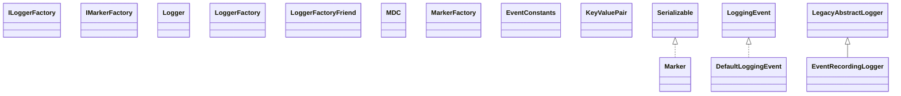

# slf4j-api-2.0.17.jar

[Group index](README.md) | [All archives](../README.md)

## Scope and provenance

- **Donor:** `SQX_145_REFERENCE_ROOT/internal/libs/slf4j-api-2.0.17.jar`.
- **SHA-256:** `7b751d952061954d5abfed7181c1f645d336091b679891591d63329c622eb832`; accessed 2026-10-06; captured `2026-10-06T18:54:51.906614+00:00`.
- **Classes:** 56 raw entries; 56 unique entry names. Duplicate occurrence indices are zero-based.
- **Inspection:** read-only ZIP hashing and class-file structural parsing; signatures/descriptors, modifiers, hierarchy and references only. Bytecode bodies are hashed, not published.
- **Allocation:** proposed `FEAT-HOST-SLF4J-API`, P01; [roadmap](../../sqx-full-application-roadmap.md). Domain README registration remains required.
- **Repository:** `01067f00031428613c6394064ca1bcadc1ba00ee`; review state unreviewed. Download label 145-dev1; installed build/activation and runtime equivalence unverified.
- **Limit:** every class/member is inventoried; declaration coverage does not establish consumed calls, defaults, formulas, failure semantics or algorithm parity.
- **Archive/resource index:** [106.json](../../../evidence/sqx145/archives/145/106.json).

## Complete member declarations

Member shards contain exact JVM names/descriptors, access flags, generic signatures, throws types, declared fields/methods, superclass/interfaces and referenced class names. All classes, nested/synthetic members and overloads are retained. Code length/hash is structural evidence, not a normalized algorithm comparison.

- [001.json](../../../evidence/sqx145/members/106/001.json) — SHA-256 `0be6165cebe93979a945edf6321f4878307fdf1562a683053ab287bf5c1e07d0`.

## Focused structural diagram

Up to twelve non-nested classes; arrows show declared inheritance/interfaces only. External type names are not evidence of an available body or an executed dependency.

## Class inventory

| Archive entry | Occurrence | Class SHA-256 | Fields | Methods |
| --- | ---: | --- | ---: | ---: |
| `org/slf4j/ILoggerFactory.class` | 0 | `8acf686711c157f4d5bba9c96284b487b799babe3c1fde78f93c78d6d775dc39` | 0 | 1 |
| `org/slf4j/IMarkerFactory.class` | 0 | `dca89de92bd440b27522dd021731e5f4d01e2ca5e566431a26fc67370f8446a2` | 0 | 4 |
| `org/slf4j/Logger.class` | 0 | `38e077e4e423decda598adc0595cd7330bbf5f96444037f54c00eef41c6f275e` | 1 | 69 |
| `org/slf4j/LoggerFactory.class` | 0 | `9e6aa0e23a89f152089faaa777fce7b711ae3d5b0d7123fe2ee5d1f85293e9bc` | 26 | 30 |
| `org/slf4j/LoggerFactoryFriend.class` | 0 | `53d5bfd5b56aecc19f92e6ac121c2892b2b000235e8737a85fd68fe0c9b76e42` | 0 | 3 |
| `org/slf4j/MDC$1.class` | 0 | `08e99d8830d1ac3ade9105c7e5ac2c3b3aaac8fa0060974494e05c6239579fae` | 0 | 0 |
| `org/slf4j/MDC$MDCCloseable.class` | 0 | `02054e7b8137f0a408b4954eb09fc7af3ca9d9ab71d616f9853b034b19ffc44d` | 1 | 3 |
| `org/slf4j/MDC.class` | 0 | `092a3deacff1285808b28cb4391554ccf0b9d449ff5781cfaba6329294aed743` | 4 | 15 |
| `org/slf4j/Marker.class` | 0 | `f96e83a4294336e42f61a6b4e808ea1c52f28b39519b737b8943ec952148b109` | 2 | 10 |
| `org/slf4j/MarkerFactory.class` | 0 | `f9e63ee4078db9bd6522e088eb02fedf5740a7d0e4a4bf7297ef3766238d2449` | 1 | 5 |
| `org/slf4j/event/DefaultLoggingEvent.class` | 0 | `405b4a1cc84130693d3f697fd2f2df99827b28a675bd461eb2cec90a8d645153` | 10 | 22 |
| `org/slf4j/event/EventConstants.class` | 0 | `0a0014d8542d86a9eeb8e066f7af82c53955699037b105cbcfe0185b73e73c24` | 6 | 1 |
| `org/slf4j/event/EventRecordingLogger.class` | 0 | `17ead084345e1e55a699de6a87d0536beebc92bc560aed1f145c69ff1f13372d` | 5 | 9 |
| `org/slf4j/event/KeyValuePair.class` | 0 | `f7eb12a16a0eaeb9c682290283e7212649f20ecdc101baf904b44f4e6db84900` | 2 | 4 |
| `org/slf4j/event/Level.class` | 0 | `457b9e9441b0b1e32e0998c429424d363e43a710021bc85ff6653643da6e5391` | 8 | 8 |
| `org/slf4j/event/LoggingEvent.class` | 0 | `131d7d01f6f55048523b942ba5f97aa4cf913e6d0fc60d157b913777711d2401` | 0 | 11 |
| `org/slf4j/event/SubstituteLoggingEvent.class` | 0 | `76559d2304339b619032346cce84e54dde0fa5af4654ff6a3098973c92b423b5` | 10 | 21 |
| `org/slf4j/helpers/AbstractLogger.class` | 0 | `7f9613711dad8b571ba6c0b16c5988f567fdfdacc57c389207aa9b6a7bba9997` | 2 | 59 |
| `org/slf4j/helpers/BasicMDCAdapter$1.class` | 0 | `c13dc047f05764aff2fa87ae1d4d567c1f5033f5ae00f66d38385c962b669716` | 1 | 3 |
| `org/slf4j/helpers/BasicMDCAdapter.class` | 0 | `2deb1b9a926602002b81c83f1cd54fd1c0268a8d3bee4e7ca6af6c427afee77d` | 2 | 12 |
| `org/slf4j/helpers/BasicMarker.class` | 0 | `a399faf1b86227de4efcdfa7cb87f155019ae01abf9630c930a9635cf3cb199f` | 6 | 12 |
| `org/slf4j/helpers/BasicMarkerFactory.class` | 0 | `28c1ea891168fb2a2b135f689817645260559b95c5917b0c9dedc249dc571097` | 1 | 5 |
| `org/slf4j/helpers/CheckReturnValue.class` | 0 | `7bf5ee33d5c4432a74131f8f7edec1235930e9ab3fee687550540c49f97ecd4e` | 0 | 0 |
| `org/slf4j/helpers/FormattingTuple.class` | 0 | `92b58561b2f21eded42e7897f1af4a1e6046740fb522c93f1d59e9d99acd5217` | 4 | 6 |
| `org/slf4j/helpers/LegacyAbstractLogger.class` | 0 | `225c52b83785396a02a1bef675ac64f8b10479eb74aabfb572c4000bc1794231` | 1 | 6 |
| `org/slf4j/helpers/MarkerIgnoringBase.class` | 0 | `fe32e5268ad0780bc6e8fd26b475fccac30d0e2385348fd0313e8d61680df3b2` | 1 | 33 |
| `org/slf4j/helpers/MessageFormatter.class` | 0 | `bf159775bc690668e259cd884f3afec5992739dcca2ba4daa337053817da9cd2` | 4 | 22 |
| `org/slf4j/helpers/NOPLogger.class` | 0 | `9e4f0e54912cbeb2370e634c786e4b7f74d54c8e52fa6555d6d944ec5b58907f` | 2 | 63 |
| `org/slf4j/helpers/NOPLoggerFactory.class` | 0 | `106868bf6a3001c93292b57c3fc97677946e8884a4d0a536a9bad8b59e534a71` | 0 | 2 |
| `org/slf4j/helpers/NOPMDCAdapter.class` | 0 | `0c0187549497417c48c65e15543eade769f680dec42831069a510b07868a3dd5` | 0 | 11 |
| `org/slf4j/helpers/NOP_FallbackServiceProvider.class` | 0 | `8773682e14439c3fcdddff14a5bde6d8552803c8cef3c0f961203ac39235cb6f` | 4 | 7 |
| `org/slf4j/helpers/NamedLoggerBase.class` | 0 | `24534efd493065b1c7f521746fad2a719d261fcb67740e79f4ebb02f449be041` | 2 | 3 |
| `org/slf4j/helpers/NormalizedParameters.class` | 0 | `e7eae5b6f297365ea47234f6f993907d0c27fda1aac54e151c678c33e9980380` | 3 | 9 |
| `org/slf4j/helpers/Reporter$Level.class` | 0 | `76f2c3b7a1ca918c481ed8d2cb1563dbb4ea83a6356f4f702e73fa5a34f9d2c9` | 6 | 6 |
| `org/slf4j/helpers/Reporter$TargetChoice.class` | 0 | `e94f531dbe335291a521f0abbb6f8392dc3e98ffc246e33dfff469f69ce6e343` | 3 | 5 |
| `org/slf4j/helpers/Reporter.class` | 0 | `89668a1967c959a9ed8407e5c8ccb9e6e16b85a6ceb6a73363f7d569dd6415c6` | 9 | 11 |
| `org/slf4j/helpers/Slf4jEnvUtil.class` | 0 | `85309b2cdfd2b5693adf16a73f74a0c58c020d38083922a702dc030e755bdbba` | 0 | 2 |
| `org/slf4j/helpers/SubstituteLogger.class` | 0 | `cb4cc9f71674434887165bc51d22ed5e6cdfcae4945dfd9be8ab3450b1286238` | 7 | 79 |
| `org/slf4j/helpers/SubstituteLoggerFactory.class` | 0 | `173e25bc4da852d257ea0457e906398e1cd443ee1a580f3d8b5dd324c0980d8c` | 3 | 7 |
| `org/slf4j/helpers/SubstituteServiceProvider.class` | 0 | `5d0b78023cf256e903594bca157dc9d77cee41ab3e58361ad9e1c7d131f85a46` | 3 | 7 |
| `org/slf4j/helpers/ThreadLocalMapOfStacks.class` | 0 | `ff9fbdedd9e3c6a1c5efa053b49dc01620a9ca6c80bc690c105223363c670b60` | 1 | 5 |
| `org/slf4j/helpers/Util$1.class` | 0 | `000a3aba31affb5327f42d03a225a4f4834c294decf7ffff36628737805ee78d` | 0 | 0 |
| `org/slf4j/helpers/Util$ClassContextSecurityManager.class` | 0 | `0d4832bb3af5ee8297b038fef0fd77ada711a6984344e9c6f5f455f2abfe679e` | 0 | 3 |
| `org/slf4j/helpers/Util.class` | 0 | `5fcc21ff0497f0d2571137008a3748d75f47a706c82b9fa8dc3da5de9e3026e0` | 2 | 9 |
| `org/slf4j/spi/CallerBoundaryAware.class` | 0 | `df9cebacd467044a8e43e969f56bf09ef2edccba31bb6c842b0cde4dff8c0dea` | 0 | 1 |
| `org/slf4j/spi/DefaultLoggingEventBuilder$1.class` | 0 | `f3cfe5f5a2fbf5f9d3d16597897dbf4b8fd5751eb7e27f128963dfb99527736f` | 1 | 1 |
| `org/slf4j/spi/DefaultLoggingEventBuilder.class` | 0 | `6baa5098a5b881aa44e9f54f1ddc51f9f5d16419d4a9c95c2f495a1828683403` | 3 | 24 |
| `org/slf4j/spi/LocationAwareLogger.class` | 0 | `4bd4e54a0d0a3406831e4ad0f0060389031dd3895e2f9a95bbe594c4ed9ff690` | 5 | 1 |
| `org/slf4j/spi/LoggerFactoryBinder.class` | 0 | `b05cc39d41b9eafc0de6acd5ed3d0cfa13a5d08b27bfdd24e24bb8e8ee32c628` | 0 | 2 |
| `org/slf4j/spi/LoggingEventAware.class` | 0 | `56db636befb5063e034c67e58eaa66b2c23ec7754c8cc976ba7578837fe67fd2` | 0 | 1 |
| `org/slf4j/spi/LoggingEventBuilder.class` | 0 | `b2d579d28bea51f62c73940ebb5a1b7f573149ee9dc927f52a2c12f391670e52` | 0 | 14 |
| `org/slf4j/spi/MDCAdapter.class` | 0 | `151b00a7cbf897025f51208bce9ff872b6b2e4a7611bc2f49730a15eb2e3251b` | 0 | 10 |
| `org/slf4j/spi/MarkerFactoryBinder.class` | 0 | `71836d3751be163705171475f2ed15753eba24023d743dfc7e37fd66efd99d2e` | 0 | 2 |
| `org/slf4j/spi/NOPLoggingEventBuilder.class` | 0 | `cd34de466da671d6d55bb30688b5cd6a6a6ccf2da9db704c56b8429911089508` | 1 | 17 |
| `org/slf4j/spi/SLF4JServiceProvider.class` | 0 | `42f35f2b135d144003fcccfb257e0bdaf30d5d259e6ad598a78db9a595700ed8` | 0 | 5 |
| `META-INF/versions/9/module-info.class` | 0 | `0068f1e7566e64a0dcaf2f8d32276fc67dd64e152a3e81f162faac2b6c023977` | 0 | 0 |
