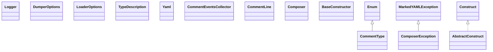

# snakeyaml-2.6.jar

[Group index](README.md) | [All archives](../README.md)

## Scope and provenance

- **Donor:** `SQX_145_REFERENCE_ROOT/internal/libs/snakeyaml-2.6.jar`.
- **SHA-256:** `c8f7a98e7394adda02f6317249710e4d1b4c7a25aa8c7eace0c2eea52eb8bf85`; accessed 2026-10-06; captured `2026-10-06T18:54:51.906614+00:00`.
- **Classes:** 237 raw entries; 237 unique entry names. Duplicate occurrence indices are zero-based.
- **Inspection:** read-only ZIP hashing and class-file structural parsing; signatures/descriptors, modifiers, hierarchy and references only. Bytecode bodies are hashed, not published.
- **Allocation:** proposed `FEAT-HOST-SNAKEYAML`, P02; [roadmap](../../sqx-full-application-roadmap.md). Domain README registration remains required.
- **Repository:** `01067f00031428613c6394064ca1bcadc1ba00ee`; review state unreviewed. Download label 145-dev1; installed build/activation and runtime equivalence unverified.
- **Limit:** every class/member is inventoried; declaration coverage does not establish consumed calls, defaults, formulas, failure semantics or algorithm parity.
- **Archive/resource index:** [107.json](../../../evidence/sqx145/archives/145/107.json).

## Complete member declarations

Member shards contain exact JVM names/descriptors, access flags, generic signatures, throws types, declared fields/methods, superclass/interfaces and referenced class names. All classes, nested/synthetic members and overloads are retained. Code length/hash is structural evidence, not a normalized algorithm comparison.

- [001.json](../../../evidence/sqx145/members/107/001.json) — SHA-256 `bfe66544d2640e1938dace769058890988b8966e3fa65d97668ce82a69e73e38`.
- [002.json](../../../evidence/sqx145/members/107/002.json) — SHA-256 `f97a816e149bccd16ab63b35c27db73d11ff284478237cb424f8089ab62f0fca`.
- [003.json](../../../evidence/sqx145/members/107/003.json) — SHA-256 `385de5347c8356ec7128d087da009bd78461882891848b64d8c90c18e987de81`.

## Focused structural diagram

Up to twelve non-nested classes; arrows show declared inheritance/interfaces only. External type names are not evidence of an available body or an executed dependency.

## Class inventory

| Archive entry | Occurrence | Class SHA-256 | Fields | Methods |
| --- | ---: | --- | ---: | ---: |
| `META-INF/versions/9/module-info.class` | 0 | `a1d62e7670ae109a68da61783e72b52e08e9e730fdb5fc052a80b602c9319dbd` | 0 | 0 |
| `META-INF/versions/9/org/yaml/snakeyaml/internal/Logger$Level.class` | 0 | `94640605af91775e1203aeb992bde089257a4c73ff0e205ee276d044d1436dbb` | 4 | 5 |
| `META-INF/versions/9/org/yaml/snakeyaml/internal/Logger.class` | 0 | `69fb0156876b22dda693d6afd2117c36d9aab9eb36d68ea3f8dc157de4c02ad4` | 1 | 5 |
| `org/yaml/snakeyaml/DumperOptions$FlowStyle.class` | 0 | `57b07fb3ae2f26aeac55fb61ee6cd5a249c8847cbc0cd309651447e443cef46d` | 5 | 5 |
| `org/yaml/snakeyaml/DumperOptions$LineBreak.class` | 0 | `4ac98efaf31f79b2e823cab036a59b7a8aa79bd646bb9f259e533b3d55115a82` | 5 | 7 |
| `org/yaml/snakeyaml/DumperOptions$NonPrintableStyle.class` | 0 | `db39b24fe888e867153dc781514d34d8c5fb3b59e43ec6f0c048c181b2a6ffc7` | 3 | 4 |
| `org/yaml/snakeyaml/DumperOptions$ScalarStyle.class` | 0 | `c5802ff316cc207746c5c0b1f75e4ba428eed8c9e1a372814100b972e5cb400d` | 8 | 7 |
| `org/yaml/snakeyaml/DumperOptions$Version.class` | 0 | `bf799d4243e15993c71b69e5cbeb15ef15ff6094e0dd3093918dc06eb654414b` | 4 | 8 |
| `org/yaml/snakeyaml/DumperOptions.class` | 0 | `7005c1c91f4830b68c0633c3ee604ce67af38c3e078200852b790a4dfa13bf52` | 22 | 45 |
| `org/yaml/snakeyaml/LoaderOptions.class` | 0 | `1ef19f6ab3cccbdcb422159e93ac4160fb801a8460df4fceff6d51518b1311cc` | 11 | 23 |
| `org/yaml/snakeyaml/TypeDescription.class` | 0 | `92017ddf6d1bf77ff075f847551d30b40e59afc8c3ecc0c1727cdb15e7c62c2d` | 11 | 26 |
| `org/yaml/snakeyaml/Yaml$1.class` | 0 | `0b7167f2804f88bb9b52d3b27d6ee01efd1180124132b032898d9b79969563a1` | 1 | 4 |
| `org/yaml/snakeyaml/Yaml$2.class` | 0 | `4556489385cb8570e1f64ab4ca5b92c31a820a152aa6fcfef66659d9e5e8ed27` | 2 | 5 |
| `org/yaml/snakeyaml/Yaml$3.class` | 0 | `b2beafb35ef68897901f94889513fff4b911441a90c3179681fa5edcb310c0e7` | 2 | 5 |
| `org/yaml/snakeyaml/Yaml$EventIterable.class` | 0 | `c0d748b269aedc73c72c79e3a02aade9ada545158a1ed028e7240b5a762f72ed` | 1 | 2 |
| `org/yaml/snakeyaml/Yaml$NodeIterable.class` | 0 | `22806dab1197c40d44a8735f44ac337c9c034930f15f369f256de6e736800451` | 1 | 2 |
| `org/yaml/snakeyaml/Yaml$SilentEmitter.class` | 0 | `ac536c8d32ad0c194dadc2d561196db62c8dd9b4182e26a6f187e401bb7cec23` | 1 | 4 |
| `org/yaml/snakeyaml/Yaml$YamlIterable.class` | 0 | `df8503edabc331d4c9f07026ff833b3d5d97a5b9ef2aad73d2ad794f140d3263` | 1 | 2 |
| `org/yaml/snakeyaml/Yaml.class` | 0 | `d5a758265d5f6deec4e93887067e164bc8a235e4e95813569576d477605ab82e` | 6 | 43 |
| `org/yaml/snakeyaml/comments/CommentEventsCollector$1.class` | 0 | `7921602cb9a51b42c23f05ca88125f2630f769bfab08edcbb2c58c7b3e62e569` | 2 | 9 |
| `org/yaml/snakeyaml/comments/CommentEventsCollector.class` | 0 | `696aa596ccbf2c6c296251cd308d448d4e06c114eb311928f0c496a2cc7fefb4` | 3 | 8 |
| `org/yaml/snakeyaml/comments/CommentLine.class` | 0 | `1fb9a86e0dfba855238345a1834c2fe1b56b677dffa2be52ea20ccbb1098909a` | 4 | 7 |
| `org/yaml/snakeyaml/comments/CommentType.class` | 0 | `43f8696b84a7225caad0834ccd9c4a1c5ff8e3396938d8004ac5c22f0df0d40c` | 4 | 4 |
| `org/yaml/snakeyaml/composer/Composer$1.class` | 0 | `78d778b32ebd698b0f77f4d24d487400c3472363618409c84dfe2d1b4a819576` | 1 | 2 |
| `org/yaml/snakeyaml/composer/Composer.class` | 0 | `e8b3335e3c24d2f20ebe3a33af4cb06f544a18fc38658ae82090217eb3f5dedb` | 11 | 14 |
| `org/yaml/snakeyaml/composer/ComposerException.class` | 0 | `10fc03df5ceebf8f5ec081be5de6d85e725711b05efb8b56d8d36d3d1dbd2da8` | 1 | 2 |
| `org/yaml/snakeyaml/constructor/AbstractConstruct.class` | 0 | `f5866c0c97422452c78c583b3fa8b65cd5d680e5a301e4389714a6267698a3c0` | 0 | 2 |
| `org/yaml/snakeyaml/constructor/BaseConstructor.class` | 0 | `746e9e9cb9c14df5cfa2d825a768213276bc859ec8be2ccea8fecb8b5f731908` | 19 | 47 |
| `org/yaml/snakeyaml/constructor/Construct.class` | 0 | `7ac97a2f611fed13983b3e4241d996269b86fee815e33ce55e203f445a415703` | 0 | 2 |
| `org/yaml/snakeyaml/constructor/Constructor$ConstructMapping.class` | 0 | `e82b97b0c6a1e2512f7d440759710ede1ac631b4f8a59b5519a5f609ef994706` | 1 | 6 |
| `org/yaml/snakeyaml/constructor/Constructor$ConstructScalar.class` | 0 | `b63c438b8877952485f0f4f9e90e1dc0907b2a49d205e64816876a20e9cef1c4` | 1 | 3 |
| `org/yaml/snakeyaml/constructor/Constructor$ConstructSequence.class` | 0 | `2d00ea51c3fda3bf3c1d0658fc9ca2bf5f43a387054f51886dfec95459b81c6f` | 1 | 4 |
| `org/yaml/snakeyaml/constructor/Constructor$ConstructYamlObject.class` | 0 | `63a92cde25a999cac3f347271274f04846b60f39db8230fa1648f6bd8d6faf33` | 1 | 4 |
| `org/yaml/snakeyaml/constructor/Constructor.class` | 0 | `332745a070f7206a8a6797d01928736545fb1e867e728deabf6029bb222df077` | 0 | 9 |
| `org/yaml/snakeyaml/constructor/ConstructorException.class` | 0 | `eb4b25999728d1bfed099785794d4d08f9e1f221f1492e3b22aedfc7e954d2e9` | 1 | 2 |
| `org/yaml/snakeyaml/constructor/CustomClassLoaderConstructor.class` | 0 | `655c126fc29e73851318c987e485c15d6c2c0d6bd77bc948bd0295ebead91b13` | 1 | 3 |
| `org/yaml/snakeyaml/constructor/DuplicateKeyException.class` | 0 | `31a9f11fd334bd765e457a78fed03381ecb1b492692c129de034a93850f1a785` | 0 | 1 |
| `org/yaml/snakeyaml/constructor/SafeConstructor$1.class` | 0 | `6bf42eb48dcf86ca780adbcbb5652c8dbaa4ca17a89c7d56de53d2a68da0ef41` | 1 | 1 |
| `org/yaml/snakeyaml/constructor/SafeConstructor$ConstructUndefined.class` | 0 | `914041cc202acb0bd33f9ac705bde456b3721123ea69e9199e0bdb2ded2db980` | 0 | 2 |
| `org/yaml/snakeyaml/constructor/SafeConstructor$ConstructYamlBinary.class` | 0 | `9ff672e17cc64aca4da312b1bc0c0eaf4f77ad597318b871f53c16250ec5fe37` | 1 | 2 |
| `org/yaml/snakeyaml/constructor/SafeConstructor$ConstructYamlBool.class` | 0 | `232a4a189d80f0d478737283de162b6279df3a917efa655e0b0dc193e94b7f69` | 1 | 2 |
| `org/yaml/snakeyaml/constructor/SafeConstructor$ConstructYamlFloat.class` | 0 | `acf3c290b9e56468682b74aa64aa3095a3bd3dc73c1a201ec5ab65a49bee34d2` | 1 | 2 |
| `org/yaml/snakeyaml/constructor/SafeConstructor$ConstructYamlInt.class` | 0 | `ac27a0d2c9959377c305ff96d6b67ae55c5bdb213ba79547039e35fc8905a2f3` | 1 | 2 |
| `org/yaml/snakeyaml/constructor/SafeConstructor$ConstructYamlMap.class` | 0 | `084c12a5419ce8f3b4b3e671d9ac66047463bf247c64b16d48681bbc1b36b3dd` | 1 | 3 |
| `org/yaml/snakeyaml/constructor/SafeConstructor$ConstructYamlNull.class` | 0 | `d8c287533fda796a0bfc334ad4dc2a30b0d9b24c759b371751193a94b1e375fc` | 1 | 2 |
| `org/yaml/snakeyaml/constructor/SafeConstructor$ConstructYamlOmap.class` | 0 | `61c4ef9ec6645e0d3b6f3cecec7d142133f10c0b6dae917b227883eb347c1396` | 1 | 2 |
| `org/yaml/snakeyaml/constructor/SafeConstructor$ConstructYamlPairs.class` | 0 | `a3301db595d2d6410cabef5c1e0bd31ffc89d3e7fd7db4a98b111c080f89dcae` | 1 | 2 |
| `org/yaml/snakeyaml/constructor/SafeConstructor$ConstructYamlSeq.class` | 0 | `28e13fb72b26be58616fba71ec6ec2df0e80b6e5ba321b51fa75a48f38a78fe9` | 1 | 3 |
| `org/yaml/snakeyaml/constructor/SafeConstructor$ConstructYamlSet.class` | 0 | `41ac3ebdf301c9b64c6523c37f8cc7f7a43a756ab6ac7f55309a35e1127d9064` | 1 | 3 |
| `org/yaml/snakeyaml/constructor/SafeConstructor$ConstructYamlStr.class` | 0 | `00973e6ea2878e6793b706cc0120f5e7cd2c489498e544b7d0ee5472d37f8b2f` | 1 | 2 |
| `org/yaml/snakeyaml/constructor/SafeConstructor$ConstructYamlTimestamp.class` | 0 | `40a85e668007a0aadf610a950ff31ff3dd30a2f609cfaa3fa595b324fc3868ca` | 1 | 3 |
| `org/yaml/snakeyaml/constructor/SafeConstructor.class` | 0 | `7b7e3edbb8dea738a1510537de0eb3a45b6f1c385383dfbd4d42676a618ba719` | 6 | 17 |
| `org/yaml/snakeyaml/emitter/Emitable.class` | 0 | `72207ed07406b8e139a89f56693763f39e54a8066d02f256432317647ef3c453` | 0 | 1 |
| `org/yaml/snakeyaml/emitter/Emitter$1.class` | 0 | `96501a05c4c0b6b7413b2b77fbfffacee98f3705585b7ec75ed915fdd4a96b7f` | 1 | 1 |
| `org/yaml/snakeyaml/emitter/Emitter$ExpectBlockMappingKey.class` | 0 | `77a2197495e9b571126f7567cee3e216d6b2683cf5754ace6962a7722c37c1ba` | 2 | 2 |
| `org/yaml/snakeyaml/emitter/Emitter$ExpectBlockMappingSimpleValue.class` | 0 | `57a7779ea9a80d11d96a698297a33f1500e03022c512f5c3a91b85e9ff6a02b8` | 1 | 3 |
| `org/yaml/snakeyaml/emitter/Emitter$ExpectBlockMappingValue.class` | 0 | `4f290c71011162a29bd3d1a7ffdc333b90044c8cc3c6ce2fe31cbfb2e2a355b9` | 1 | 3 |
| `org/yaml/snakeyaml/emitter/Emitter$ExpectBlockSequenceItem.class` | 0 | `764b1d72a23dcf325614343050ee7aaf49523d4b38852a68699ce070ce1ce8c4` | 2 | 2 |
| `org/yaml/snakeyaml/emitter/Emitter$ExpectDocumentEnd.class` | 0 | `e467942c8f18af4a37394b59787680704b327ad4fefb9f4cc0c7cd78a20307ab` | 1 | 3 |
| `org/yaml/snakeyaml/emitter/Emitter$ExpectDocumentRoot.class` | 0 | `b1865c50eba76d3a6308f5f94b72569800e8ca319f9eeb85043c54794f3eeae5` | 1 | 3 |
| `org/yaml/snakeyaml/emitter/Emitter$ExpectDocumentStart.class` | 0 | `8fb2fb93d7bbacbe0a7b4b57e78fc9b8748deb68dc42ebdd42f27695db2aa80c` | 2 | 2 |
| `org/yaml/snakeyaml/emitter/Emitter$ExpectFirstBlockMappingKey.class` | 0 | `8bbf5d7280cf0d589ab1f23ddd3610beb732674ef552434f0115e311e6fd227b` | 1 | 3 |
| `org/yaml/snakeyaml/emitter/Emitter$ExpectFirstBlockSequenceItem.class` | 0 | `7d9755bef6adda3d0a93742f0b5aa840fa1dc6d31f0bf11cf0b1b7501bb73d3f` | 1 | 3 |
| `org/yaml/snakeyaml/emitter/Emitter$ExpectFirstDocumentStart.class` | 0 | `beb852738076949a1b73cb652400f72745b90f4d3178ac2ef9b233e6491c340b` | 1 | 3 |
| `org/yaml/snakeyaml/emitter/Emitter$ExpectFirstFlowMappingKey.class` | 0 | `cb46f95ad8f31279950f612df1cc47d7224cdd0495649e096c905640013aa9cb` | 1 | 3 |
| `org/yaml/snakeyaml/emitter/Emitter$ExpectFirstFlowSequenceItem.class` | 0 | `fe361820e91b963e116ef4c577f3fc2e48f3029c513d286aa8fec3c42620c679` | 1 | 3 |
| `org/yaml/snakeyaml/emitter/Emitter$ExpectFlowMappingKey.class` | 0 | `8a1ec9cd1eaf937d22dc5cf245ecad1ce54a1a2b0500d27c5969e741a5263ebf` | 1 | 3 |
| `org/yaml/snakeyaml/emitter/Emitter$ExpectFlowMappingSimpleValue.class` | 0 | `29105042a3b78886df1cd8339cc21999fbcd5e8dd9f653e92e9f1f259442fa11` | 1 | 3 |
| `org/yaml/snakeyaml/emitter/Emitter$ExpectFlowMappingValue.class` | 0 | `ecf41b5a633c3c2a3bb0cf33a4c11a52ed3943fa1c0f161c3a1f3ddd6536c733` | 1 | 3 |
| `org/yaml/snakeyaml/emitter/Emitter$ExpectFlowSequenceItem.class` | 0 | `0c3835e185225a0188485defa79e0e36dc2132eb80166396b0d2ada629b814a1` | 1 | 3 |
| `org/yaml/snakeyaml/emitter/Emitter$ExpectNothing.class` | 0 | `aa239f5cf5ba51bf270bd78ba57b829dfa9a499fbb8e04218e7e6649722b0893` | 1 | 3 |
| `org/yaml/snakeyaml/emitter/Emitter$ExpectStreamStart.class` | 0 | `d2f5a41881932122820d82d8fffb9f30ff0e418adc2b4ce8c12929b89aa4b9f6` | 1 | 3 |
| `org/yaml/snakeyaml/emitter/Emitter.class` | 0 | `f81ae5ca4863926d5bcea2fd9162466a72930cac3cac1745bf0789d7c3cbc5d9` | 41 | 85 |
| `org/yaml/snakeyaml/emitter/EmitterException.class` | 0 | `e05d4d7eb1190a7815cf10148f2cf9bb3ace9ff40ed178eac7f3fe67dca04dc3` | 1 | 1 |
| `org/yaml/snakeyaml/emitter/EmitterState.class` | 0 | `e1e3cca1fea3b75e704b6ad03fe95cb4517c78eb54e6a12659bc1c52b419b266` | 0 | 1 |
| `org/yaml/snakeyaml/emitter/ScalarAnalysis.class` | 0 | `91208d11416c0226c1845c9a1cde235923ecf1ecc164c77bc7ebe93de8127d8c` | 7 | 8 |
| `org/yaml/snakeyaml/env/EnvScalarConstructor$1.class` | 0 | `176e5b54a4eaded1bf6bc65f8d74d5bcb96e8682a0400af0a3876c823dd968f1` | 0 | 0 |
| `org/yaml/snakeyaml/env/EnvScalarConstructor$ConstructEnv.class` | 0 | `623e55a9a5b1bb5bcfb0b569b5565223640bd9d55292019b7ba670321478effc` | 1 | 3 |
| `org/yaml/snakeyaml/env/EnvScalarConstructor.class` | 0 | `ac10d9ef33fc3898766592d8aa443b5b3d2f25bdaffb8ad3276c9ca247e116f2` | 2 | 6 |
| `org/yaml/snakeyaml/error/Mark.class` | 0 | `98c30dd6c251edb83525f543d14f9b5633a20d11c673d95c42fd58f696c2a9e9` | 6 | 13 |
| `org/yaml/snakeyaml/error/MarkedYAMLException.class` | 0 | `6e0ea72e120107ca6f018577bfeded6196da464d9bdc89ea4b26a8c36a0dc4ff` | 6 | 10 |
| `org/yaml/snakeyaml/error/MissingEnvironmentVariableException.class` | 0 | `4d27ff767858efad6d8b807f615a3f9603099e758f7356bdcfd60b807b7be30c` | 0 | 1 |
| `org/yaml/snakeyaml/error/YAMLException.class` | 0 | `1be1dbfd9eae8003f264da4ea38df675101efa726e9633a9979b1d8ac065947c` | 1 | 3 |
| `org/yaml/snakeyaml/events/AliasEvent.class` | 0 | `4013df7692d5e3eec979b84e43e838903c1a250f8872b7e69e159823e0f8608c` | 0 | 2 |
| `org/yaml/snakeyaml/events/CollectionEndEvent.class` | 0 | `5126bdca19eec9241d5f4ea6a1c5588c22108c0b38f291e911fbb43da7bc729f` | 0 | 1 |
| `org/yaml/snakeyaml/events/CollectionStartEvent.class` | 0 | `0b27d00d1989e56d42be0edbafdc66deab416d2f05b3d0cd81c8cd327a4dc8a6` | 3 | 6 |
| `org/yaml/snakeyaml/events/CommentEvent.class` | 0 | `9a2306bfb50cf1f4c21940bfd126de0dae5c8928209b459fe400a4c7d2c0bcef` | 2 | 5 |
| `org/yaml/snakeyaml/events/DocumentEndEvent.class` | 0 | `466b882c1cf561ec570407314357445cd198787330e0d9b5dc3d6c3b685b6a70` | 1 | 3 |
| `org/yaml/snakeyaml/events/DocumentStartEvent.class` | 0 | `b586f610ade0f152bc2214a80fda823034f23cce1f5fafc5f9fbb7d2b2274fc7` | 3 | 5 |
| `org/yaml/snakeyaml/events/Event$ID.class` | 0 | `9a108f5e6c5fceecbff147d13e49e4883de000fe52415b2de9b7d662ab27acc7` | 12 | 4 |
| `org/yaml/snakeyaml/events/Event.class` | 0 | `b2ee1a68157aa78c1ccc6478d27996cba289dbab24d4165bd672d5f09003fe9c` | 2 | 9 |
| `org/yaml/snakeyaml/events/ImplicitTuple.class` | 0 | `b0ac49740d020356d1bac45a2e5cfdfc50a1e45845438b977ee7e7417af6409e` | 2 | 5 |
| `org/yaml/snakeyaml/events/MappingEndEvent.class` | 0 | `99fd7ff6fe668ff8ca3f168a8521a89f5073a1a62f8571ae12a8991d275a5c3e` | 0 | 2 |
| `org/yaml/snakeyaml/events/MappingStartEvent.class` | 0 | `39d5f7c0313611f4d5c98f9b408e227dc4fb6bfe899491f1786e6df6b258ec37` | 0 | 2 |
| `org/yaml/snakeyaml/events/NodeEvent.class` | 0 | `d22d5b3eaf9de559d74a4a80b45bcfbe03a7e57a52d6217bef483c9fedf5a8e1` | 1 | 3 |
| `org/yaml/snakeyaml/events/ScalarEvent.class` | 0 | `19707adbd2f1e6e0f6c2f0aaf787136d26d810d582351fc0eb3eccbfc13625e0` | 4 | 13 |
| `org/yaml/snakeyaml/events/SequenceEndEvent.class` | 0 | `f232b0cecffeffc709dc17ed031b5e53b8eaa4deae999494e68c3c9f675f2d93` | 0 | 2 |
| `org/yaml/snakeyaml/events/SequenceStartEvent.class` | 0 | `97f975d57f328401f5cbffd59119766787d949849b3e51167a5aff7441d3d284` | 0 | 2 |
| `org/yaml/snakeyaml/events/StreamEndEvent.class` | 0 | `9d1d9986eb05e3bb88932c2a18910bc0e57aaadb5c5582ba3a410a92ac78add8` | 0 | 2 |
| `org/yaml/snakeyaml/events/StreamStartEvent.class` | 0 | `3d5900d58a07f689d317a0b1cd73e773fdde221873a38e25885fca00c431cef6` | 0 | 2 |
| `org/yaml/snakeyaml/extensions/compactnotation/CompactConstructor$ConstructCompactObject.class` | 0 | `95f85fa3f053ba9428e14b58e89be5256b1ed6c32b342b289a88976fa7a11013` | 1 | 3 |
| `org/yaml/snakeyaml/extensions/compactnotation/CompactConstructor.class` | 0 | `cf5c4440e5dc745861dc55503e2db4df27eeac3ae4ab50dcfe7d3e5b74164050` | 4 | 14 |
| `org/yaml/snakeyaml/extensions/compactnotation/CompactData.class` | 0 | `b8dba49fac68561d36370d0686e0f91fb3a1321ca025835f3f08746ccfe2ac8d` | 3 | 5 |
| `org/yaml/snakeyaml/extensions/compactnotation/PackageCompactConstructor.class` | 0 | `1e964c946a74ef6778bbbd9cc58caef4676e4acfa193f9a4fbd2c0be4baf1f4d` | 1 | 2 |
| `org/yaml/snakeyaml/external/com/google/gdata/util/common/base/Escaper.class` | 0 | `7365b073bdffd92650b44fa45a14948d54cb9a6e3503cf06c32bc150b279b98d` | 0 | 2 |
| `org/yaml/snakeyaml/external/com/google/gdata/util/common/base/PercentEscaper.class` | 0 | `730a3c8b38b1d09d3cae5bf969337c4531be6baa16020fa62898481d22e329be` | 7 | 6 |
| `org/yaml/snakeyaml/external/com/google/gdata/util/common/base/UnicodeEscaper$1.class` | 0 | `6eec6df61affd28707f0429409501a8816e651435f22891449ad0a6a71c47045` | 4 | 5 |
| `org/yaml/snakeyaml/external/com/google/gdata/util/common/base/UnicodeEscaper$2.class` | 0 | `be744e773bb1c60248693c848df65e1b97aee6505bf12d2f60be5fce30c8efbc` | 0 | 3 |
| `org/yaml/snakeyaml/external/com/google/gdata/util/common/base/UnicodeEscaper.class` | 0 | `e757887db0e5237dfdec4ceba43b03ebd7a7c42ddbbbef8c40b8dd7301bb2413` | 3 | 9 |
| `org/yaml/snakeyaml/inspector/TagInspector.class` | 0 | `6ace135d4f0cab0ba7b9a8549baca7c9dcbe0ca5101e16468622c3960571b4d0` | 0 | 1 |
| `org/yaml/snakeyaml/inspector/UnTrustedTagInspector.class` | 0 | `d0073f25b01406855d0f40dc35bc603d63d866ee8cfd6c16ab1af0f3bde7255f` | 0 | 2 |
| `org/yaml/snakeyaml/internal/Logger$Level.class` | 0 | `e072a9fe10b6f3dd526021623b43f7e88d826ce71b5a0c7adf119f71c9ac7df1` | 4 | 5 |
| `org/yaml/snakeyaml/internal/Logger.class` | 0 | `6cddffe6cef65ace181e2f088e8e0b19d70efb671ba5641a1f63b722822b7039` | 1 | 5 |
| `org/yaml/snakeyaml/introspector/BeanAccess.class` | 0 | `3c26c098e6e4961ef3ca1004c80739ae84fe6d6be1ca70aca0d53f500a50dc1c` | 4 | 4 |
| `org/yaml/snakeyaml/introspector/FieldProperty.class` | 0 | `8ce25e15ab8a5bff9687818853a046c806e725024468575fbbbcea2ba9121374` | 1 | 5 |
| `org/yaml/snakeyaml/introspector/GenericProperty.class` | 0 | `6e21b58bcca310b5200e1fda389ea423bfe97dbf4e141312fd7b12164099f2e3` | 3 | 2 |
| `org/yaml/snakeyaml/introspector/MethodProperty.class` | 0 | `a4ad9918c92104586454d5b3a0c36e89af3d496306777d0995cb2599f8e05b04` | 4 | 10 |
| `org/yaml/snakeyaml/introspector/MissingProperty.class` | 0 | `30add7f8aba7a61815b13284734d92e2dce6db3e45e7498e9de925b658804545` | 0 | 6 |
| `org/yaml/snakeyaml/introspector/Property.class` | 0 | `34c91bd824f97233e0ff77c3702d94ffbc94fb5a4bb504a102c5c8e3565b6de1` | 2 | 15 |
| `org/yaml/snakeyaml/introspector/PropertySubstitute.class` | 0 | `6013c9d8fff6b12dd36b74ae5b33edda773485d6b49832c884debad88d77b68e` | 10 | 16 |
| `org/yaml/snakeyaml/introspector/PropertyUtils.class` | 0 | `1489a0931f088097d62fd158011bbb24c96206cae06e1f1c161bd37a83e3b60b` | 6 | 13 |
| `org/yaml/snakeyaml/nodes/AnchorNode.class` | 0 | `1554e0415c4d44fec590049c08adcbe7434bd0d84ff576f38448bf748f3d55bf` | 1 | 3 |
| `org/yaml/snakeyaml/nodes/CollectionNode.class` | 0 | `4fbdeabf3b0dff00334665ad5d1fe7c132eb0ffce0f115c60df4fcbf5cdf703c` | 1 | 5 |
| `org/yaml/snakeyaml/nodes/MappingNode.class` | 0 | `e353f284623269845448527d54787fc41df807373b8e9f49900e4af24e8c195f` | 2 | 10 |
| `org/yaml/snakeyaml/nodes/Node.class` | 0 | `42d7c8770b53ee75726b6997cca3ce98452e6615aaf5593eb701fb9b6245d632` | 11 | 22 |
| `org/yaml/snakeyaml/nodes/NodeId.class` | 0 | `2dd29535e8b70c9167a32086887b82edff51e6ae172a4b88b62a266fb318f7c3` | 5 | 4 |
| `org/yaml/snakeyaml/nodes/NodeTuple.class` | 0 | `4030d924aeeba007645d65f653782ed8854837ad6247f48643cfc5294062bfa4` | 2 | 4 |
| `org/yaml/snakeyaml/nodes/ScalarNode.class` | 0 | `137cd9f48d729fbceea0e22dd1bf4f7a01c6347322d3999aa8f286b4e9e8a700` | 2 | 7 |
| `org/yaml/snakeyaml/nodes/SequenceNode.class` | 0 | `7e152f99c6329a014dc4150ac7d3af6c03e4931665480d4ad490e4af963a5f87` | 1 | 6 |
| `org/yaml/snakeyaml/nodes/Tag.class` | 0 | `aeb872d76e9e5bb899a2684af9b11c6071abf6f00a0ee8db2785415f1d4c92dc` | 20 | 13 |
| `org/yaml/snakeyaml/parser/Parser.class` | 0 | `a32b80ba5c04af2e324dea21212300a8861b08fab198fe29a78b3cfcf398dddc` | 0 | 3 |
| `org/yaml/snakeyaml/parser/ParserException.class` | 0 | `234af47c0ada57184c1fcf50f394233f6434548cc5d6aba90c369f70a4c62131` | 1 | 1 |
| `org/yaml/snakeyaml/parser/ParserImpl$1.class` | 0 | `043b6e567f461dc548acc13d2292db64b013366f1bc5b13201ec4a5502259476` | 0 | 0 |
| `org/yaml/snakeyaml/parser/ParserImpl$ParseBlockMappingFirstKey.class` | 0 | `d6307e48ae5d9616746f858b9932e45848ffeaa288e39cea1730c028735eb367` | 1 | 3 |
| `org/yaml/snakeyaml/parser/ParserImpl$ParseBlockMappingKey.class` | 0 | `26f12f92102ea9e894a175ae4f392285732524bb8b0c488c78a324cf5727483c` | 1 | 3 |
| `org/yaml/snakeyaml/parser/ParserImpl$ParseBlockMappingValue.class` | 0 | `7a3d425942b9a9f92de10c1a7e3bd9e40ebbdcc810997aa94cb7dae4fe7496b7` | 1 | 3 |
| `org/yaml/snakeyaml/parser/ParserImpl$ParseBlockMappingValueComment.class` | 0 | `60445cffecb7f75eef1a58da43d6f77fb16bd85fa27c37beb3642d1dd52db4dd` | 2 | 3 |
| `org/yaml/snakeyaml/parser/ParserImpl$ParseBlockMappingValueCommentList.class` | 0 | `116d9fd1cb7d6185854b7016c9401c2e308bd963e5e98c1ebbe110163207b0f2` | 2 | 2 |
| `org/yaml/snakeyaml/parser/ParserImpl$ParseBlockNode.class` | 0 | `f6522bd001a21db18aa4f3d62a0d48b3ee37d29a1aca28eeda9e54907c3ec436` | 1 | 3 |
| `org/yaml/snakeyaml/parser/ParserImpl$ParseBlockSequenceEntryKey.class` | 0 | `13c5e68969ff29373b0b4cdfe0cb06749ba2b402e511956020d4f0ccdc956247` | 1 | 3 |
| `org/yaml/snakeyaml/parser/ParserImpl$ParseBlockSequenceEntryValue.class` | 0 | `fdfb90a7abc467e1359d1c36d7aa11428333101e72fdbfa717e27500f833e2f2` | 2 | 2 |
| `org/yaml/snakeyaml/parser/ParserImpl$ParseBlockSequenceFirstEntry.class` | 0 | `982e2b22c4f03f38afc6052b42ad0c17f454af885b526a0388e3c6ce0f65d8b4` | 1 | 3 |
| `org/yaml/snakeyaml/parser/ParserImpl$ParseDocumentContent.class` | 0 | `13bed37572d13d7616c7d05b91c9abc32929573ff3281717bbfca83e8b4e90ca` | 1 | 3 |
| `org/yaml/snakeyaml/parser/ParserImpl$ParseDocumentEnd.class` | 0 | `dc7b1e8fa0b64b2efd341b407044da00f621308954bc450972037ef042420131` | 1 | 3 |
| `org/yaml/snakeyaml/parser/ParserImpl$ParseDocumentStart.class` | 0 | `d0556b6b348bea854b6501e50195009b226491ef0c52c3d68f39662277212c65` | 1 | 3 |
| `org/yaml/snakeyaml/parser/ParserImpl$ParseFlowEndComment.class` | 0 | `f6c30f679495bc85754a300b905bf8b720c82b1f3a68ab4b78de3e871282e7fc` | 1 | 3 |
| `org/yaml/snakeyaml/parser/ParserImpl$ParseFlowMappingEmptyValue.class` | 0 | `851a8033ba5e0c869fd3096d9b536c0d8adbbe655ff2c7edd4dec381454b755e` | 1 | 3 |
| `org/yaml/snakeyaml/parser/ParserImpl$ParseFlowMappingFirstKey.class` | 0 | `4977cd9667efc7c41d4336dd650aacf650aab6c6c3ce1803b0703f08f7a4733b` | 1 | 3 |
| `org/yaml/snakeyaml/parser/ParserImpl$ParseFlowMappingKey.class` | 0 | `530dedfdfd9a081f4a016b3f7453a9ce1d845e6e0b19c1c8a85372e5f6b88255` | 2 | 2 |
| `org/yaml/snakeyaml/parser/ParserImpl$ParseFlowMappingValue.class` | 0 | `b412a93d7c070bfbc80021399fd5d6aa59d663d52d647082338a9c6808b2ffb9` | 1 | 3 |
| `org/yaml/snakeyaml/parser/ParserImpl$ParseFlowSequenceEntry.class` | 0 | `8b51fcdafe8b7e260c8bca5583da11cfeee080edcd0b0dd31a98242d26de9ab7` | 2 | 2 |
| `org/yaml/snakeyaml/parser/ParserImpl$ParseFlowSequenceEntryMappingEnd.class` | 0 | `65ad8ae45b4d80c494083d7386ba85ce8ae10cb883f5cdd89fc9dc3fcb12cb88` | 1 | 3 |
| `org/yaml/snakeyaml/parser/ParserImpl$ParseFlowSequenceEntryMappingKey.class` | 0 | `1bf5b5a74297a01a7cc137f34f00c7be295bb8218ee20cafa322be70e8bb07af` | 1 | 3 |
| `org/yaml/snakeyaml/parser/ParserImpl$ParseFlowSequenceEntryMappingValue.class` | 0 | `f866fe1203c38317ba3e9dcd32e6ac7bd8c291d6c405b2f6a459604580c29a04` | 1 | 3 |
| `org/yaml/snakeyaml/parser/ParserImpl$ParseFlowSequenceFirstEntry.class` | 0 | `3e5e7ce129885654e9b3a11c2dd7c3c57a3d0b99a6d2ecfb91ec02b6d804e28e` | 1 | 3 |
| `org/yaml/snakeyaml/parser/ParserImpl$ParseImplicitDocumentStart.class` | 0 | `0d19d5ae5b02ff857344704a7c8104a3d016ca9395ab160851d7748ff94fdd22` | 1 | 3 |
| `org/yaml/snakeyaml/parser/ParserImpl$ParseIndentlessSequenceEntryKey.class` | 0 | `ca941acf07df0cce9832c7613a3d71d8ac40ecbe743fe89ddd085c939083f2e6` | 1 | 3 |
| `org/yaml/snakeyaml/parser/ParserImpl$ParseIndentlessSequenceEntryValue.class` | 0 | `3085a36026d5165d74a16703c4af4cb980b7894872ae780940cf7e95feaffaea` | 2 | 2 |
| `org/yaml/snakeyaml/parser/ParserImpl$ParseStreamStart.class` | 0 | `b44c8e7e7867762da13fac5ef8ca166418266c502bfe282dc0249a3a4136745c` | 1 | 3 |
| `org/yaml/snakeyaml/parser/ParserImpl.class` | 0 | `db98c115e103c1470073a879e73b462aff8ee2554e47233d08829862a7c0d26b` | 7 | 22 |
| `org/yaml/snakeyaml/parser/Production.class` | 0 | `082c1b2adeda04d20d0c89a951717eab1d3f49e7a10e23d7f1a5d81eb12fcfe5` | 0 | 1 |
| `org/yaml/snakeyaml/parser/VersionTagsTuple.class` | 0 | `5e039c3cf111977a5740a62d136fd57faabcd471686fcd729fb09cb35fdf5c3b` | 2 | 4 |
| `org/yaml/snakeyaml/reader/ReaderException.class` | 0 | `d1d1d489a926b655cbbd14a6e55cb78482dc54f0d4dd685eabe949625c1297b6` | 4 | 5 |
| `org/yaml/snakeyaml/reader/StreamReader.class` | 0 | `51fcde75d69891ce485548bb8dde00146fd0f5d68f89ff033fd8dfe193963fa9` | 11 | 20 |
| `org/yaml/snakeyaml/reader/UnicodeReader.class` | 0 | `b1bdcb112dc4cde869d50a20c49576097bc8c7857774c52ef99c1f53f745ad7f` | 6 | 6 |
| `org/yaml/snakeyaml/representer/BaseRepresenter$1.class` | 0 | `1e822ba45852e804588c2e534ca3bcd272b8c0aa0e23d3d6e917dc876a4a0c7f` | 2 | 3 |
| `org/yaml/snakeyaml/representer/BaseRepresenter.class` | 0 | `253631f131f80b4ea8558535d219a2d67dfc6ea2e55cf1e2d71b732781c97da7` | 9 | 14 |
| `org/yaml/snakeyaml/representer/JsonRepresenter$RepresentByteArray.class` | 0 | `fed2380956253ec3add5be97b32d76ea6a73fb5ca8e08ce6f3f1845b053e0465` | 1 | 2 |
| `org/yaml/snakeyaml/representer/JsonRepresenter$RepresentDate.class` | 0 | `b9d037de97d393fd6286e8d825b0e72be5a39a3589724e8b978da189c9e96b91` | 1 | 2 |
| `org/yaml/snakeyaml/representer/JsonRepresenter.class` | 0 | `9691842e6584b02362d869e4cbca1b173994c97a1297e7e879f0b9ade5c1b494` | 0 | 1 |
| `org/yaml/snakeyaml/representer/Represent.class` | 0 | `33181ea572b047a494ee85f5e6209b1f7f59f96c4326bbcf819d0992e85c6a33` | 0 | 1 |
| `org/yaml/snakeyaml/representer/Representer$RepresentJavaBean.class` | 0 | `4550d5962fd37e057b794361e0c962be32ff73b97eebfdd547285717ce3af7aa` | 1 | 2 |
| `org/yaml/snakeyaml/representer/Representer.class` | 0 | `9d272008649fd24c49305e8bce294b768f4e267ebda8c0cc3c17099f81702cba` | 1 | 11 |
| `org/yaml/snakeyaml/representer/SafeRepresenter$IteratorWrapper.class` | 0 | `9903e58bfcb40addf2b793f8d3872b9389648dd7d54be01d79127e77aaf50293` | 1 | 2 |
| `org/yaml/snakeyaml/representer/SafeRepresenter$RepresentArray.class` | 0 | `a6c60d6a4525856f8e6050fbd8bbd4732e95a1800ee1f49d1b8e549dcd440e8c` | 1 | 2 |
| `org/yaml/snakeyaml/representer/SafeRepresenter$RepresentBoolean.class` | 0 | `f9dc84da9f65d078e4c9612449fa4dfa79663c64bde089bba3f7fed8350a8575` | 1 | 2 |
| `org/yaml/snakeyaml/representer/SafeRepresenter$RepresentByteArray.class` | 0 | `950e034e68d03a5db983831888304686efa90055bed31ba77efc44d7306c18a1` | 1 | 2 |
| `org/yaml/snakeyaml/representer/SafeRepresenter$RepresentDate.class` | 0 | `da5cdac5464b20505108c06e8d9c0427a45815106294a7be70f9c7dc9923f601` | 1 | 3 |
| `org/yaml/snakeyaml/representer/SafeRepresenter$RepresentEnum.class` | 0 | `f27e81a1f4df98097864b026006d91fa55d658cc07fecb53430f56ab69d55e25` | 1 | 2 |
| `org/yaml/snakeyaml/representer/SafeRepresenter$RepresentIterator.class` | 0 | `1dfeffd252049dd3a93b7d9b56125f257d49062b15257876539e441beefa7735` | 1 | 2 |
| `org/yaml/snakeyaml/representer/SafeRepresenter$RepresentList.class` | 0 | `0a42afd68698fd571cd8e204ac7e3833bc55983c96c25bbeb7a47e2c6ca5703d` | 1 | 2 |
| `org/yaml/snakeyaml/representer/SafeRepresenter$RepresentMap.class` | 0 | `c2c3a95b9caab54d7ff9a0a9295ff0dd7d4fa44383a4b7f171ab6253776e6837` | 1 | 2 |
| `org/yaml/snakeyaml/representer/SafeRepresenter$RepresentNull.class` | 0 | `cc00462bc1fa2b34d96c173bbaf7025176068d7a5858281e814b5922b38267c2` | 1 | 2 |
| `org/yaml/snakeyaml/representer/SafeRepresenter$RepresentNumber.class` | 0 | `741db6ab53043b7ea180d2794db3224eff861559e451e0aed89e54e1b4933054` | 1 | 2 |
| `org/yaml/snakeyaml/representer/SafeRepresenter$RepresentPrimitiveArray.class` | 0 | `2235304f65c7f7392b366fcf5739c2ea9e8afbde6a85fb0bcce87a7f3d8e6f0f` | 1 | 10 |
| `org/yaml/snakeyaml/representer/SafeRepresenter$RepresentSet.class` | 0 | `6dcbe834ea6795a2e8a8dbfb45cc4865362a038cc5fcf1fc3a864f96684eda85` | 1 | 2 |
| `org/yaml/snakeyaml/representer/SafeRepresenter$RepresentString.class` | 0 | `7a9c6d5282d9dfddc1047dc326e8f3c1744b2744c023b41a28906ddbc1c08f85` | 1 | 2 |
| `org/yaml/snakeyaml/representer/SafeRepresenter$RepresentUuid.class` | 0 | `4825ae268976c25a5fccd44beda0f99d9e477ec777218d232ca05792459bb4b8` | 1 | 2 |
| `org/yaml/snakeyaml/representer/SafeRepresenter.class` | 0 | `d9c956f140cdc6f398651b8d46aec22e86ec88d9c5b1023ab6e82cef1fcaee71` | 4 | 7 |
| `org/yaml/snakeyaml/resolver/Resolver$1.class` | 0 | `6425f838d6628d311546535f8c88cd30e016c03c15dba3d96a389b0ab4e6d810` | 1 | 1 |
| `org/yaml/snakeyaml/resolver/Resolver.class` | 0 | `785685ee234d59ad276091cefda35d5f99b70fee6dee0b27714cc292fe9bb225` | 10 | 6 |
| `org/yaml/snakeyaml/resolver/ResolverTuple.class` | 0 | `97422b8ef028869c608a9b9f9cfd9ed558873b984e8b37f3f1e14510e9861f93` | 3 | 5 |
| `org/yaml/snakeyaml/scanner/Constant.class` | 0 | `d44e24f1e628bc3c5ce79d8df046cfa7329d148364b259a7194b6dfff1476ff1` | 18 | 6 |
| `org/yaml/snakeyaml/scanner/Scanner.class` | 0 | `be1b0306705700d19b8195606984dcb11313b44e6b659daaed012492936b5998` | 0 | 5 |
| `org/yaml/snakeyaml/scanner/ScannerException.class` | 0 | `0aa0c19029de00246722b129ba1a02f4806fbd6cc796e19c06053a529d215f31` | 1 | 2 |
| `org/yaml/snakeyaml/scanner/ScannerImpl$Chomping.class` | 0 | `f9e2c3f564cdadbc674524bebc14c306b14a2ddcddbb6ed6f6464dc825b73120` | 2 | 4 |
| `org/yaml/snakeyaml/scanner/ScannerImpl.class` | 0 | `06ad478d3fdd254787e87b2a7e7d444a5fe729972ada9bb83d0602d7ce8e7b76` | 15 | 81 |
| `org/yaml/snakeyaml/scanner/SimpleKey.class` | 0 | `c0516498b09be4fa8eb93c65bf98a97013073bc75d60d1c8333f1e33219b646d` | 6 | 8 |
| `org/yaml/snakeyaml/serializer/AnchorGenerator.class` | 0 | `042f4e36069b685049b0e3bf424c27a3f2f50ab07918342342ad203adf108049` | 0 | 1 |
| `org/yaml/snakeyaml/serializer/NumberAnchorGenerator.class` | 0 | `921b0da289dca80bb70a67f36e82165c34305f1ebd30162bc981218b3ca31de6` | 1 | 2 |
| `org/yaml/snakeyaml/serializer/Serializer$1.class` | 0 | `f90312c1386797af2ac4e334f7e1ae61e97e3ae1475aad80942db132400428f0` | 1 | 2 |
| `org/yaml/snakeyaml/serializer/Serializer$2.class` | 0 | `8f7efc622fcb206995050e3dbaf6654af59f5348a4eb6c31a92a136b7af3d67e` | 1 | 1 |
| `org/yaml/snakeyaml/serializer/Serializer.class` | 0 | `7ccc46d2b1fb1058036d615db877c26ea53b31791169c10e719b25cdfa4a9ad7` | 14 | 7 |
| `org/yaml/snakeyaml/serializer/SerializerException.class` | 0 | `0ab139de955104ad7343692845e106b19a6f963c3f3632d931771b8ccb3c31dd` | 1 | 1 |
| `org/yaml/snakeyaml/tokens/AliasToken.class` | 0 | `4fbe80b8c8b44aefb75c60c205e925f10ce06649801b0b24d5e519de301c2921` | 1 | 3 |
| `org/yaml/snakeyaml/tokens/AnchorToken.class` | 0 | `9afe95bd12c45ac14fe02200a38935e7ed495cd205ef2745d2e90b57345269b6` | 1 | 3 |
| `org/yaml/snakeyaml/tokens/BlockEndToken.class` | 0 | `dd640e9e419eecc33f2a5d56919b35184ca95d34f2aa2aa28ac57f476fe430e8` | 0 | 2 |
| `org/yaml/snakeyaml/tokens/BlockEntryToken.class` | 0 | `fa65fb21789277d2d85ec1a8d2aef277ed1e09aead115aa8378c6d4c3eec7529` | 0 | 2 |
| `org/yaml/snakeyaml/tokens/BlockMappingStartToken.class` | 0 | `9c8e106cbbd6ac0b96d3e02bec7a27db2f69c4f6af375f4088f6b24b65a93ce0` | 0 | 2 |
| `org/yaml/snakeyaml/tokens/BlockSequenceStartToken.class` | 0 | `600a7114014a331100856334237b0f99738c0a60d1eb6c4b4595889258606760` | 0 | 2 |
| `org/yaml/snakeyaml/tokens/CommentToken.class` | 0 | `98bbd2aa70093e1bf5be5da1583b0f5ae337e95d79c76a6b2fca683e4e571f6f` | 2 | 4 |
| `org/yaml/snakeyaml/tokens/DirectiveToken.class` | 0 | `9094d0a75d2c15a4a9b1a87620aeabecff6e8206da03df2bced30b92f0ba3646` | 2 | 4 |
| `org/yaml/snakeyaml/tokens/DocumentEndToken.class` | 0 | `00c07996df172719585a0573d9b1db631612e4e1e9b2d802f0a960faff76551d` | 0 | 2 |
| `org/yaml/snakeyaml/tokens/DocumentStartToken.class` | 0 | `1067fe4df3f26a83467a0ec7c7edff822d41a4d3d58eee19312b3565e98629bb` | 0 | 2 |
| `org/yaml/snakeyaml/tokens/FlowEntryToken.class` | 0 | `544e458438751e4d087ed7678862768d101845ceada1aeed3a44bbcc1d76e1d7` | 0 | 2 |
| `org/yaml/snakeyaml/tokens/FlowMappingEndToken.class` | 0 | `940d97bf9fb3a849e7bbe6298cc8c6a5c414eba58c9c5c9507b1b2718bc26f10` | 0 | 2 |
| `org/yaml/snakeyaml/tokens/FlowMappingStartToken.class` | 0 | `b2b6337d8806dbfae24f873136c5b90bcf75eaa4c59300102f4b25e021fa2968` | 0 | 2 |
| `org/yaml/snakeyaml/tokens/FlowSequenceEndToken.class` | 0 | `b30b8b018a86d01af5f15763e0f20c92d49ac0d35833c1008144dc7ed2b6b355` | 0 | 2 |
| `org/yaml/snakeyaml/tokens/FlowSequenceStartToken.class` | 0 | `c500c275d0f35758495cbfc84199e28a792972f1f90ed72b85eec66645e0bc4a` | 0 | 2 |
| `org/yaml/snakeyaml/tokens/KeyToken.class` | 0 | `9f4485d0093479df6ba7221dbe0f6dac54c09c82b4c706d0af03355752fbf96e` | 0 | 2 |
| `org/yaml/snakeyaml/tokens/ScalarToken.class` | 0 | `46be84269a4807a2da149ca2001e09899df9fa4efdba79391e6528653e61882b` | 3 | 6 |
| `org/yaml/snakeyaml/tokens/StreamEndToken.class` | 0 | `5c2fcbf57ae1e79c65fd22344d5e7d93f12bc1a0c161d1db0c6a1784e6338a2d` | 0 | 2 |
| `org/yaml/snakeyaml/tokens/StreamStartToken.class` | 0 | `3df2f67843ed6b69860bf3f7ae7ea4016853084e9283cfbce9dce1d54972c6ab` | 0 | 2 |
| `org/yaml/snakeyaml/tokens/TagToken.class` | 0 | `06f9fecb112d75fc0de5c9908224386442ecfb3e414cbbe011893a6f7d893d24` | 1 | 3 |
| `org/yaml/snakeyaml/tokens/TagTuple.class` | 0 | `f63c7bbc55dd3e76309e7fb6b4da067d23a11a52e92ec0f655e1e478a9bedb28` | 2 | 3 |
| `org/yaml/snakeyaml/tokens/Token$ID.class` | 0 | `dd5f604998268956b4e53dd8bc7d29a70fb87357a857b3e5ae1aaca81c9e5199` | 25 | 5 |
| `org/yaml/snakeyaml/tokens/Token.class` | 0 | `6fbff5d73baaa809f0a0f14b0e7b7e910805e1bb26dc99ac1e61aa95e2231d4e` | 2 | 4 |
| `org/yaml/snakeyaml/tokens/ValueToken.class` | 0 | `f7aad2ae46529955ce27fd2a8a62e7ce620dd057f6dfd7ca0340d80f1d3d3105` | 0 | 2 |
| `org/yaml/snakeyaml/util/ArrayStack.class` | 0 | `e6dde299e2d3096830914c02a615ed9cc6b5403df60203220a64a4656e19356c` | 1 | 5 |
| `org/yaml/snakeyaml/util/ArrayUtils$CompositeUnmodifiableArrayList.class` | 0 | `0727fe0b5ab05ade94c985c67441f52995457827c00d30c638a0bddfadb9c565` | 2 | 3 |
| `org/yaml/snakeyaml/util/ArrayUtils$UnmodifiableArrayList.class` | 0 | `c02b04d6c5c9101282f16fc88fc8f5f533a904dcd693703c9b765ee50d7cb06b` | 1 | 3 |
| `org/yaml/snakeyaml/util/ArrayUtils.class` | 0 | `d8c54f772f189b3d66984bccf7aca7b31ff299f279a502d0aac3261533fedfe3` | 0 | 3 |
| `org/yaml/snakeyaml/util/EnumUtils.class` | 0 | `c5c8d8c0ebf8c4bb9097e2adfef7e82fcd4454749091f2f53547b4c7c491e8c8` | 0 | 2 |
| `org/yaml/snakeyaml/util/MergeUtils.class` | 0 | `b6e473e2328d5692c71af628e267b9b29c44bb643b5a76cc5e6bd483a9adf746` | 0 | 4 |
| `org/yaml/snakeyaml/util/PlatformFeatureDetector.class` | 0 | `a23e2a8180805377e429f1af4aecc21cfe242b978a50aa1585f13e03d8343dea` | 1 | 3 |
| `org/yaml/snakeyaml/util/Tuple.class` | 0 | `248b6fb3b8c11c29383ae1ef480ea369aae208216f9361072d8ab468e8caf5d9` | 2 | 3 |
| `org/yaml/snakeyaml/util/UriEncoder.class` | 0 | `342b20a2b02fe9b434ccddcba371aaa395147d8b1791d0a5eaae97039c63633f` | 3 | 5 |
