# sqlite-jdbc-3.51.2.0.jar

[Group index](README.md) | [All archives](../README.md)

## Scope and provenance

- **Donor:** `SQX_145_REFERENCE_ROOT/internal/libs/sqlite-jdbc-3.51.2.0.jar`.
- **SHA-256:** `5454be00f3a04b4d67ef6179121aa900a904da53b9cbffea742d548d737f0ebc`; accessed 2026-10-06; captured `2026-10-06T18:54:51.906614+00:00`.
- **Classes:** 129 raw entries; 129 unique entry names. Duplicate occurrence indices are zero-based.
- **Inspection:** read-only ZIP hashing and class-file structural parsing; signatures/descriptors, modifiers, hierarchy and references only. Bytecode bodies are hashed, not published.
- **Allocation:** proposed `FEAT-HOST-SQLITE-JDBC`, P02; [roadmap](../../sqx-full-application-roadmap.md). Domain README registration remains required.
- **Repository:** `01067f00031428613c6394064ca1bcadc1ba00ee`; review state unreviewed. Download label 145-dev1; installed build/activation and runtime equivalence unverified.
- **Limit:** every class/member is inventoried; declaration coverage does not establish consumed calls, defaults, formulas, failure semantics or algorithm parity.
- **Archive/resource index:** [109.json](../../../evidence/sqx145/archives/145/109.json).

## Complete member declarations

Member shards contain exact JVM names/descriptors, access flags, generic signatures, throws types, declared fields/methods, superclass/interfaces and referenced class names. All classes, nested/synthetic members and overloads are retained. Code length/hash is structural evidence, not a normalized algorithm comparison.

- [001.json](../../../evidence/sqx145/members/109/001.json) — SHA-256 `9c040ef07b55d6844b21ef719a8bcb6db4eabda721f42b248e030fefca9e562b`.
- [002.json](../../../evidence/sqx145/members/109/002.json) — SHA-256 `8e8078d719c883790326e46c5b61a4cad745d40fac2a9ed709cd324536826744`.

## Focused structural diagram

Up to twelve non-nested classes; arrows show declared inheritance/interfaces only. External type names are not evidence of an available body or an executed dependency.

```mermaid
classDiagram
    class C0["SqliteJdbcFeature"]
    class C1["SQLiteOpenMode"]
    class C2["NativeLibraryNotFoundException"]
    class C3["SQLiteUpdateListener"]
    class C4["JDBC"]
    class C5["SQLiteLimits"]
    class C6["BusyHandler"]
    class C7["ExtendedCommand"]
    class C8["SQLiteCommitListener"]
    class C9["SQLiteConnection"]
    class C10["JDBC4Statement"]
    class C11["JDBC4ResultSet"]
    class E0["Feature"]
    E0 <|.. C0
    class E1["Enum"]
    E1 <|-- C1
    class E2["Exception"]
    E2 <|-- C2
    class E3["Driver"]
    E3 <|.. C4
    E1 <|-- C5
    class E4["Connection"]
    E4 <|.. C9
    class E5["JDBC3Statement"]
    E5 <|-- C10
    class E6["Statement"]
    E6 <|.. C10
    class E7["JDBC3ResultSet"]
    E7 <|-- C11
    class E8["ResultSet"]
    E8 <|.. C11
    class E9["ResultSetMetaData"]
    E9 <|.. C11
```

## Class inventory

| Archive entry | Occurrence | Class SHA-256 | Fields | Methods |
| --- | ---: | --- | ---: | ---: |
| `META-INF/versions/9/org/sqlite/nativeimage/SqliteJdbcFeature$SqliteJdbcFeatureException.class` | 0 | `e4c5f16f73d04dfa876fed4949cc2cf32a6e7e0cb38606fbaa49077c5232b7e0` | 0 | 4 |
| `META-INF/versions/9/org/sqlite/nativeimage/SqliteJdbcFeature$1.class` | 0 | `ef6c612c5398d366792e3ab5d33357e1bbb227210d6877bf14dc4e16dcf65478` | 0 | 0 |
| `META-INF/versions/9/org/sqlite/nativeimage/SqliteJdbcFeature.class` | 0 | `0f967d485fe986859d962fcb1707ff96636ffc91e5ada7fc34d954952197179f` | 0 | 7 |
| `org/sqlite/SQLiteOpenMode.class` | 0 | `a01ab9e94462a26522483e5c5d79012d20ace394d316e747d8ef4446b84a5620` | 20 | 4 |
| `org/sqlite/NativeLibraryNotFoundException.class` | 0 | `9c21f5c230c92505ca89f811538ff85efe773e732f02ac93c1decfbaaac5ab86` | 0 | 1 |
| `org/sqlite/SQLiteUpdateListener.class` | 0 | `73d111f6c2a847273349b69a561990841fb7e3a5d7dcb791b5a5f5ef494b821e` | 0 | 1 |
| `org/sqlite/JDBC.class` | 0 | `8f5a26a9d967cd0e91d8644f34d2ef35280c6dca623fa5de49bf025fe710bff3` | 2 | 13 |
| `org/sqlite/SQLiteConfig$Encoding.class` | 0 | `249e61b53e2538f477b594893aca75f12f7de911549c096ea77283643995754c` | 10 | 7 |
| `org/sqlite/SQLiteUpdateListener$Type.class` | 0 | `fd4838e4132587bfc542d94c9e52d9813ff003a49032b0efbeeb84603462e851` | 4 | 4 |
| `org/sqlite/SQLiteLimits.class` | 0 | `1d6ec84d7261c1d6d066d6cbab4c22301a981537f5413a9d7061f2fa847a3579` | 15 | 5 |
| `org/sqlite/Function$Window.class` | 0 | `a6715a3aa9731570511631ad8f8d404ca8b0bdf39c5ac3f7c16ebb60ae403407` | 0 | 3 |
| `org/sqlite/SQLiteConfig$SynchronousMode.class` | 0 | `9dfa659c99845b4845d4a0a47bec08b1c530fecdff14f86819569626ec1b7fc2` | 4 | 5 |
| `org/sqlite/SQLiteConfig$JournalMode.class` | 0 | `64c9e2f40551822c9958ca9d7117475bd0eda344016fb2303d581ea040837bdc` | 7 | 5 |
| `org/sqlite/BusyHandler.class` | 0 | `7125637b6b653893502836634992dedb10d866c490f022efaba08fd9b61f861b` | 0 | 5 |
| `org/sqlite/SQLiteConfig$DateClass.class` | 0 | `f979f0bff37e394bbcfdddf99334a2a0bfbb58c34b246f3158c8a377e0d18e46` | 4 | 6 |
| `org/sqlite/SQLiteConfig$HexKeyMode.class` | 0 | `f42133f1c69a09436d5d56c351a1da212ff8c63b959fe9a54654976f2a899cdb` | 4 | 5 |
| `org/sqlite/ExtendedCommand.class` | 0 | `50482373c1222358811d24836c754bc86dc4d4e21b3bb929178c5ce3a8d59575` | 0 | 3 |
| `org/sqlite/SQLiteCommitListener.class` | 0 | `681d1f23cf0d22a151d48646cc737acbb6a85d9db5163f398b97fdca365caa21` | 0 | 2 |
| `org/sqlite/SQLiteConfig$OnOff.class` | 0 | `44e12e22986c28b3bc92694a5c548b6a03a0961c927dcdde7994d9fe9cbc7eeb` | 1 | 3 |
| `org/sqlite/SQLiteConfig$TransactionMode.class` | 0 | `c1fc2588a04820beb69c1196dad7f4ee5eae3fa8de1149d4aeeb3d1cdd816ebc` | 4 | 6 |
| `org/sqlite/SQLiteConnection.class` | 0 | `93dd757afc140e20370621ce807d1d15aee6c681575c039741a77395865ed83c` | 6 | 43 |
| `org/sqlite/jdbc4/JDBC4Statement.class` | 0 | `7aa768fdbedd27ef6c9e456e32e52705a1bbef1e2a98052255adf469a83e9d17` | 2 | 9 |
| `org/sqlite/jdbc4/JDBC4ResultSet.class` | 0 | `34a34c51397239908064e4baf2fe89d80b83a18d976a4c93ac2148573b962353` | 0 | 137 |
| `org/sqlite/jdbc4/JDBC4DatabaseMetaData.class` | 0 | `404328b1f9d93ffdd28669159c84771debae155473fdd12cba01ed937c33c2c3` | 0 | 11 |
| `org/sqlite/jdbc4/JDBC4PooledConnection.class` | 0 | `d6c3e9ddd35efe5ab0cf09ba92439b26262f8f5906ee2abd78c3ca0653f7a7e8` | 0 | 3 |
| `org/sqlite/jdbc4/JDBC4Connection.class` | 0 | `c230ad92ce22f29194f8f465d6f76ba9d3e9c2e1c332a0e164766ca142b028db` | 0 | 16 |
| `org/sqlite/jdbc4/JDBC4ResultSet$SqliteClob.class` | 0 | `ecd6ccd8f9933ba42ecf1f48ed49220ac24fb59dae80a4ccf95d3b690fe4b2b0` | 2 | 14 |
| `org/sqlite/jdbc4/JDBC4PreparedStatement.class` | 0 | `aa2a755b91b4ae4fb84ea460b7e3676baef2f29a7eec294ab1a3271aa5b0a3ef` | 0 | 22 |
| `org/sqlite/SQLiteErrorCode.class` | 0 | `abb9c4efceba35170ccaf6eb026c93954d647e62a91eec3f2f9edcf4511e528a` | 109 | 6 |
| `org/sqlite/SQLiteDataSource.class` | 0 | `c37e185e7ab8f991a1bf31f20075d237b550c3bf8fa0f3da1c2faa79e9a65eaa` | 5 | 48 |
| `org/sqlite/jdbc3/JDBC3DatabaseMetaData$ImportedKeyFinder$ForeignKey.class` | 0 | `3fb90b737fb4c397d914dd1d3ccc445bdec7efd42be0dde886017b1dd88b9083` | 9 | 11 |
| `org/sqlite/jdbc3/JDBC3PreparedStatement.class` | 0 | `c67c8110cba8d055f3acbddd2729cae2fa50c48ecb3621ab35b13e94685a8f29` | 0 | 69 |
| `org/sqlite/jdbc3/JDBC3Connection.class` | 0 | `aee23b85bf774a1a74ec39eaa1567eb6d71d9ccd03eaf426693094216eedd13f` | 3 | 30 |
| `org/sqlite/jdbc3/JDBC3DatabaseMetaData$ImportedKeyFinder.class` | 0 | `fe1a9ea04ebbb29bfdbadcca1f0cfe235e5b2d0ae9e01ba91801e80202342630` | 4 | 4 |
| `org/sqlite/jdbc3/JDBC3ResultSet.class` | 0 | `ce32b086beb56ed7334ab4a669f98a066b86104289474991617be21c7af6648e` | 3 | 102 |
| `org/sqlite/jdbc3/JDBC3Statement$BackupObserver.class` | 0 | `e0c79cb385382e13e07a70db9d2d5d85c0496ead9b1fcc13324ad24334c7e12a` | 1 | 4 |
| `org/sqlite/jdbc3/JDBC3Statement$SQLCallable.class` | 0 | `618e56f2318f594e5739eb8b2fe4c5471301cba54f799c467b505c0d16ac5a65` | 0 | 1 |
| `org/sqlite/jdbc3/JDBC3DatabaseMetaData$LogHolder.class` | 0 | `60d8d5074a074e3aa15c5c361769f6d8cfb99503dbe279cef313c01f8720e836` | 1 | 3 |
| `org/sqlite/jdbc3/JDBC3DatabaseMetaData$PrimaryKeyFinder.class` | 0 | `6ef619852bd0c0f8dc5538ea8b766a75415ae9838d0ccc6a39fbbba39b65aace` | 4 | 3 |
| `org/sqlite/jdbc3/JDBC3Statement.class` | 0 | `3abf2462092d9309228474a6d347f4a2b90c3e7624caec54792dd8b971b142e5` | 3 | 52 |
| `org/sqlite/jdbc3/JDBC3DatabaseMetaData.class` | 0 | `507350edeba20bdee4f620504bb4a3e235851fe45e288a19c32cfba1af70d660` | 8 | 186 |
| `org/sqlite/jdbc3/JDBC3Savepoint.class` | 0 | `d5228dae6523ed564f15cea9b011304182930b48231f3354b36b1e3b2e36584e` | 2 | 4 |
| `org/sqlite/ExtendedCommand$SQLExtension.class` | 0 | `fa50133749112142820e01ab06f02b087299ee9f517cc93a47f52bd8b2f0a63c` | 0 | 1 |
| `org/sqlite/ExtendedCommand$RestoreCommand.class` | 0 | `83e4cce805f8c89cd7d76b893fd077a7e8e278ff64f2b1823ba590b7501d097e` | 3 | 4 |
| `org/sqlite/SQLiteConfig$LockingMode.class` | 0 | `0f7f96c9cf68c3461557aacbb8ad9251f3d3f8d194c2caea927a346ec71e8ec7` | 3 | 5 |
| `org/sqlite/SQLiteJDBCLoader$VersionHolder.class` | 0 | `781821a8f81801a939fc3e2b7d6fe1efbd711ee7f2bd58823bb6896d3829679d` | 1 | 4 |
| `org/sqlite/core/CorePreparedStatement.class` | 0 | `11a15048430d07bdb966b59d6e7a2642b2d74f199e67e196637a8d5589578c0a` | 3 | 8 |
| `org/sqlite/core/SafeStmtPtr$SafePtrFunction.class` | 0 | `684df18f8172a18afd0bd8c65fd5aa5735e7c3e948beca09ba6a545dfa781448` | 0 | 1 |
| `org/sqlite/core/Codes.class` | 0 | `ccfdcdc75cbd8ddc6456d9083b7c2af46fcc9d8917998194197eb9a3b32d8df1` | 31 | 0 |
| `org/sqlite/core/SafeStmtPtr.class` | 0 | `574c5fc77a667fb39e85ba03a71cfa8868dedc6af099d36d4205ee3ad2990f54` | 5 | 12 |
| `org/sqlite/core/SafeStmtPtr$SafePtrDoubleFunction.class` | 0 | `8c19b4ae942844f4abbc6ede459a23d61dd69936613fb598c7c6b15e1246aff3` | 0 | 1 |
| `org/sqlite/core/DB.class` | 0 | `66990a1a44b2d01773c46454d7dbf3cd126ae6646d2a2fa45c5094abfb73f072` | 9 | 98 |
| `org/sqlite/core/CoreResultSet.class` | 0 | `24fff33e0638213e85345709b93b04456f03418780bce32940b181b6775f097e` | 13 | 11 |
| `org/sqlite/core/CoreDatabaseMetaData.class` | 0 | `5597cc2ca455ef4c5e82da1c8c9fabb6fdef81b1ae8c1462c8c0352f79cdf5ba` | 20 | 8 |
| `org/sqlite/core/SafeStmtPtr$SafePtrConsumer.class` | 0 | `34679a6e923747c673107919de8e5808c9b27a0e7f40fb63a452bd84a13b9120` | 0 | 1 |
| `org/sqlite/core/SafeStmtPtr$SafePtrIntFunction.class` | 0 | `83a270a2942b65b1deb78bfd255cb06280b09f324b720ce99411d42fb9cf0fc0` | 0 | 1 |
| `org/sqlite/core/SafeStmtPtr$SafePtrLongFunction.class` | 0 | `438f0c7714c01ac68c959654ff987c69116db81de7ba4eca3b7169cafd3bc56e` | 0 | 1 |
| `org/sqlite/core/NativeDB.class` | 0 | `7bc736fb8ed9b06873f00230827f7faee14561f39ed7d7dce21a1e539e40fc55` | 11 | 95 |
| `org/sqlite/core/CoreStatement.class` | 0 | `1321a307a5862272258be09807431267ee4e54ee25279f33f4eaab76a57670ae` | 10 | 15 |
| `org/sqlite/core/DB$ProgressObserver.class` | 0 | `ea1b63cab3cf76d8abe59eb64a396436faee7c6d924ea8eeb6f49a945cd6eb1f` | 0 | 1 |
| `org/sqlite/core/CorePreparedStatement$1.class` | 0 | `8ed15b5904cc044cc42f3a22eb87974f31b412ff457c471a0dd49154dd701ed2` | 1 | 1 |
| `org/sqlite/SQLiteConnectionConfig.class` | 0 | `b507af3b10ae609b98f918cb8acefc57b2e3202372df2cc4830a7eeedb5d2287` | 9 | 21 |
| `org/sqlite/FileException.class` | 0 | `219542d9856818cf93eb8e2a40755f6438187d79c40f0b224c107069375fc837` | 0 | 1 |
| `org/sqlite/SQLiteConfig$DatePrecision.class` | 0 | `c4795bef7758ff1ae730ecbba33d549ae0e89dd52d6a7f1957fca2ade3429eca` | 3 | 6 |
| `org/sqlite/SQLiteConfig.class` | 0 | `bbf528ab0cbe17fc2b74b2c08ce1ec2dfd3ac3addc721163e7edca53b2d9f459` | 13 | 61 |
| `org/sqlite/ProgressHandler.class` | 0 | `c98c6882597f94e6f2f341945a03d8ccc420c441d19da8a89f14e9da6e1da7ce` | 0 | 4 |
| `org/sqlite/ExtendedCommand$BackupCommand.class` | 0 | `b87af143b3f673f73ab6727563df68a74fff613a7ba1aae4a1ddea41c9f1ee01` | 3 | 4 |
| `org/sqlite/SQLiteConfig$Pragma.class` | 0 | `6cc4ed3428167a07e0fb1d0d041d2489e9cc7b8785e18c6d3d01881077fd2238` | 58 | 8 |
| `org/sqlite/SQLiteException.class` | 0 | `9d04de89cbc83489a42898ccf0cb489b50c569b8febf9a8855088fdba4862c45` | 1 | 2 |
| `org/sqlite/javax/SQLitePooledConnection$1.class` | 0 | `1bb0b94cffe8be9efc1cf7407c98aa4c22e23d4d91c4201a1d5026f6882c17e7` | 2 | 2 |
| `org/sqlite/javax/SQLitePooledConnection.class` | 0 | `1845c4235e98703a95747d54bd67818d27b1c775d8413af09f32ac01589dae66` | 3 | 7 |
| `org/sqlite/javax/SQLitePooledConnectionHandle.class` | 0 | `1539ac6773233e02a860dffec9ae707225b9a9bef7f92cc712224b19cbdc7738` | 2 | 58 |
| `org/sqlite/javax/SQLiteConnectionPoolDataSource.class` | 0 | `3545ebaf87d59dbac84386abfa6545c80fa9771c4eb676ac2dbebaee11c6d616` | 0 | 4 |
| `org/sqlite/SQLiteConfig$PragmaValue.class` | 0 | `0b9abaf688a1fc29635027e1d69b39e7606cf60fc7a9769dc904783f75bc1817` | 0 | 1 |
| `org/sqlite/SQLiteConfig$TempStore.class` | 0 | `2778cde9b48bc7d498c71e290b2361f2914aebe01f99b43df9a28290407e9844` | 4 | 5 |
| `org/sqlite/util/OSInfo.class` | 0 | `a4764383820d1ea140253a669b729f89b25dc273c31df2b36f66a023ac4e3205` | 9 | 21 |
| `org/sqlite/util/Logger.class` | 0 | `17a508985c4a61f560ac82f6067f6817f33709e73d7226f4dc1fd7d97c2f04bb` | 0 | 4 |
| `org/sqlite/util/StringUtils.class` | 0 | `9c5bc064e459ae13b64d85a800a565c81b0c73abd7a7182a4b40ff0ca741dde6` | 0 | 2 |
| `org/sqlite/util/QueryUtils.class` | 0 | `480b2d0e44c49855887ae90e5b3c31f546feb0762d8ec23cfb79d01095c647bb` | 0 | 5 |
| `org/sqlite/util/OSInfo$LogHolder.class` | 0 | `96e9bfbd1753f98490fabf0e75b041eacd85de414e3442388a8156ce4aa3794b` | 1 | 3 |
| `org/sqlite/util/ResourceFinder.class` | 0 | `5434592a7f92c7c57fc1ad2c9672ebda92d6945880f1742596fb931c61671560` | 0 | 7 |
| `org/sqlite/util/LoggerFactory$SLF4JLogger.class` | 0 | `466a183e5985f90a4a51a651457119858671a01bff9b4fd8c241ad7e6519ca80` | 1 | 5 |
| `org/sqlite/util/ProcessRunner.class` | 0 | `a9e0795c81f585af73df73c5b0829ab6b74bf614f76e3568f8566ab88c88f031` | 0 | 4 |
| `org/sqlite/util/LibraryLoaderUtil.class` | 0 | `de7261a3e5f23da0e831eb4f2fff87540629d9249a2ce4e141c4e70e4fea197a` | 1 | 4 |
| `org/sqlite/util/LoggerFactory.class` | 0 | `1bc68d6f8baf988e07a9b841ae8164b468aecaa6fc0c0e9aee2dbff62ef46976` | 1 | 3 |
| `org/sqlite/util/LoggerFactory$JDKLogger.class` | 0 | `ae590028a8e4357faa5bfd9e1b3f61e4194741758e4e5528fd48e893c1a69a61` | 1 | 5 |
| `org/sqlite/Function.class` | 0 | `63d1605d365bb469391d536dcc7cc1c4fa88e727f0ea174c69d82ae46c2d393d` | 6 | 23 |
| `org/sqlite/date/FastDatePrinter$CharacterLiteral.class` | 0 | `b5ebab3f7640b3f526e66302664c098e4ca8209d71dd9ef86f0e19d3f3cd2481` | 1 | 3 |
| `org/sqlite/date/FastDatePrinter$UnpaddedMonthField.class` | 0 | `066f8a30341f145889d89150a92ce529baff3fab1dcc9b631c93f9504f99ddbc` | 1 | 5 |
| `org/sqlite/date/FastDateParser$2.class` | 0 | `df93fa2c6e13b9c126d540f5751a4a407407f2e0980166186496c71fac35bbbb` | 0 | 2 |
| `org/sqlite/date/FastDatePrinter$TextField.class` | 0 | `2f664a6fe52d1e42d875be8d9ca345a0700ecaa560a525eb43ec5d8adb9d5488` | 2 | 3 |
| `org/sqlite/date/FastDatePrinter$TwoDigitNumberField.class` | 0 | `74447bd810edcef6dfaa380cd6f9ffc637ab3ff57000c5df2b9e4f923576e6da` | 1 | 4 |
| `org/sqlite/date/FastDatePrinter$TwelveHourField.class` | 0 | `346b6b2e1482623a69f45f647a8f00a004c0aec81ab10993243ec9b1e336b79d` | 1 | 4 |
| `org/sqlite/date/FormatCache.class` | 0 | `1a4e83a2047be64b77b1c8db6d32876524d90947c9d192cabce904fd944c6a71` | 3 | 10 |
| `org/sqlite/date/FormatCache$MultipartKey.class` | 0 | `5388751417cbc6e80fc4f699daf30a26a9bbe092a09a8ad586fb464b50b1bc99` | 2 | 3 |
| `org/sqlite/date/FastDatePrinter$Rule.class` | 0 | `f91bfabfe62a3a734fe8ba5130e3b0a09b972da272bfd5e863aaf98a8c423421` | 0 | 2 |
| `org/sqlite/date/DateParser.class` | 0 | `63d1ab923157cfe4442da76a60020fcb8096542984dd4c80d0e4a3aa92294715` | 0 | 7 |
| `org/sqlite/date/package-info.class` | 0 | `91a0dd92a3f71ef808e9c7b3d353ed8fe5db54bca082cfc4a8fa3fbe7bcd2b55` | 0 | 0 |
| `org/sqlite/date/FastDatePrinter$Iso8601_Rule.class` | 0 | `ad32e5de606e8d35009ebcda72d9068c51f942d42ba60ab43a5c5d1136caba6f` | 4 | 5 |
| `org/sqlite/date/FastDatePrinter$PaddedNumberField.class` | 0 | `d9ed06e0616e16eb3850701ef597cd7e3d1ebf9e3eace8df86f02a4cc23556cc` | 2 | 4 |
| `org/sqlite/date/FastDatePrinter$TimeZoneNameRule.class` | 0 | `9d0c0aadd0ce45519fc216596504705a1d8b031df74f82e1afe92a119b08e36e` | 4 | 3 |
| `org/sqlite/date/FastDatePrinter$UnpaddedNumberField.class` | 0 | `a2bf5d4487985128fadc532282e3afe3373b611c9c93ec1a011e5d5572dd2111` | 1 | 4 |
| `org/sqlite/date/FastDatePrinter$TimeZoneNumberRule.class` | 0 | `c54d0619677f7582df7b4158678d4384f49dc50469a9d59233e6757167e1f221` | 5 | 4 |
| `org/sqlite/date/ExceptionUtils.class` | 0 | `a7ba37683c95cdf46a9e4f23eeb80bafc5757111a357fb978e46fb46e03a53b3` | 0 | 3 |
| `org/sqlite/date/FastDateParser$ISO8601TimeZoneStrategy.class` | 0 | `0275165ad148325bd28206c167060bc220f4d2ce79a79d0bc2e1b615fc8d8be4` | 4 | 5 |
| `org/sqlite/date/FastDateFormat.class` | 0 | `9d02c1744f8885838c101bc4952215cd2618d0af44db2fba89b42c3087115c91` | 8 | 38 |
| `org/sqlite/date/FastDateParser$4.class` | 0 | `642defe6d71fad7716c55f1620405f42fe76aa8f73238ca54abd479d6f7a51cf` | 0 | 2 |
| `org/sqlite/date/FastDatePrinter$TimeZoneDisplayKey.class` | 0 | `e243000ca74664f78bc47f180b7c490a9701da6ec5caca8d2a6c48f9890fd30e` | 3 | 3 |
| `org/sqlite/date/FastDateFormat$1.class` | 0 | `bb705eda12c4ce0a90a9cd2c67ce30e1188f53dab9835c5e243b24a74a8993c7` | 0 | 3 |
| `org/sqlite/date/FastDateParser$Strategy.class` | 0 | `d094a4315b24996f2e31d1b3406794f4fd74cedbda6eb9fc990b31d9de052e2e` | 0 | 5 |
| `org/sqlite/date/DatePrinter.class` | 0 | `1a3b3d5cf236a7c6ece70587804786d1e5af02be73c577bc9b7e850be31d210b` | 0 | 10 |
| `org/sqlite/date/FastDatePrinter$NumberRule.class` | 0 | `e025c4e7221fdef0e4b19e75a1e11372d78a8fa81f282523351bc2033ac0a595` | 0 | 1 |
| `org/sqlite/date/FastDateParser$TimeZoneStrategy.class` | 0 | `4abcfccb358e5fd0e69652497aa10fa795e69cb2037273c4b0dbf8838a323544` | 7 | 3 |
| `org/sqlite/date/DateFormatUtils.class` | 0 | `0ef4aae41c03b190bfc9b779702418b3be4de86f81cc68384f72bd5e15e9e587` | 10 | 18 |
| `org/sqlite/date/FastDateParser$CopyQuotedStrategy.class` | 0 | `a916439a2d0bb97892f099e9ec3b2b78fe9b88956739777f7b9b811fa6d5b6e4` | 1 | 3 |
| `org/sqlite/date/FastDateParser.class` | 0 | `32b9ffa554cfac78911f2cd9e61515ca4acbb8a52454c12bc9314be4efbe2364` | 29 | 27 |
| `org/sqlite/date/FastDatePrinter$StringLiteral.class` | 0 | `dfedaab1f9f7b75f970e37b51204d9333eb3964ca5913907689986965d6b95d0` | 1 | 3 |
| `org/sqlite/date/FastDateParser$1.class` | 0 | `5d90847e858ab7a5f28b89f5c6332b9228d14a8a22f7139a86f7aec772a53a87` | 0 | 2 |
| `org/sqlite/date/FastDatePrinter$TwoDigitYearField.class` | 0 | `a92241706fdbdcf1c26c5d1b1221148cb5a3a57a373119d5cc047e4416dba616` | 1 | 5 |
| `org/sqlite/date/FastDateParser$3.class` | 0 | `16b3255af55e0da257910799331189e06e4621892f42666757e4fefb32fd8b42` | 0 | 2 |
| `org/sqlite/date/FastDatePrinter$TwoDigitMonthField.class` | 0 | `89765d1dd034a0b0c17143ad42fd00a98700e27634f2b3d3ed72914607fbad42` | 1 | 5 |
| `org/sqlite/date/FastDateParser$CaseInsensitiveTextStrategy.class` | 0 | `e4a84b0952704d9cfb866c0a137a14af9cf31a7481f3ccbfa416a2bc0d7283fa` | 3 | 3 |
| `org/sqlite/date/FastDateParser$NumberStrategy.class` | 0 | `bb8611e20c10d3ae56dd0d401b46ced6bddcc6ccc1e16aea7ae72751702497ad` | 1 | 5 |
| `org/sqlite/date/FastDatePrinter.class` | 0 | `9d7a15ebb596541c3fa456f0146ef06e577a1e7d6918e7968fe77460d58de1ad` | 11 | 27 |
| `org/sqlite/date/FastDatePrinter$TwentyFourHourField.class` | 0 | `50bda3ce128cade0c37669a4425828124c4f01b4e47af510f8ce54cc23dc5f97` | 1 | 4 |
| `org/sqlite/Collation.class` | 0 | `75a20390e9460a065d136b8bad53c75c5b7e9c707eebd460cbda43bb6b6bf34a` | 2 | 4 |
| `org/sqlite/Function$Aggregate.class` | 0 | `faecff0ec4fbae0b0de40a1742b2283e7c7f2028481fafa9d572f97f09cab9b6` | 0 | 5 |
| `org/sqlite/SQLiteJDBCLoader.class` | 0 | `01406a18fd2f5a16f64f36e66d57a74a119172b914a5eef9032b3ed362201949` | 3 | 25 |
| `META-INF/versions/9/module-info.class` | 0 | `5bbd5e8c389ab1eb0404ded02c662db434ca0291bd881f284c1d0830752f2356` | 0 | 0 |
