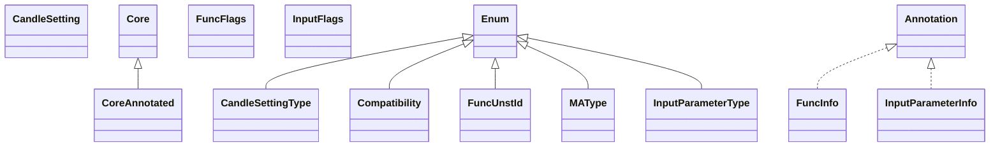

# ta-lib-0.4.0.jar

[Group index](README.md) | [All archives](../README.md)

## Scope and provenance

- **Donor:** `SQX_145_REFERENCE_ROOT/internal/libs/ta-lib-0.4.0.jar`.
- **SHA-256:** `c2d7757cc03a03519eee914c62e8a86596efa66e5c298ac9890aa59b3063aa34`; accessed 2026-10-06; captured `2026-10-06T18:54:51.906614+00:00`.
- **Classes:** 38 raw entries; 38 unique entry names. Duplicate occurrence indices are zero-based.
- **Inspection:** read-only ZIP hashing and class-file structural parsing; signatures/descriptors, modifiers, hierarchy and references only. Bytecode bodies are hashed, not published.
- **Allocation:** proposed `FEAT-STRATEGY-TA-LIB`, P05; [roadmap](../../sqx-full-application-roadmap.md). Domain README registration remains required.
- **Repository:** `01067f00031428613c6394064ca1bcadc1ba00ee`; review state unreviewed. Download label 145-dev1; installed build/activation and runtime equivalence unverified.
- **Limit:** every class/member is inventoried; declaration coverage does not establish consumed calls, defaults, formulas, failure semantics or algorithm parity.
- **Archive/resource index:** [112.json](../../../evidence/sqx145/archives/145/112.json).

## Complete member declarations

Member shards contain exact JVM names/descriptors, access flags, generic signatures, throws types, declared fields/methods, superclass/interfaces and referenced class names. All classes, nested/synthetic members and overloads are retained. Code length/hash is structural evidence, not a normalized algorithm comparison.

- [001.json](../../../evidence/sqx145/members/112/001.json) — SHA-256 `dbcceda06b0352d6b9fb2a6b8f712e5e1960c8e42a7b775958d9cec14d7e5680`.

## Focused structural diagram

Up to twelve non-nested classes; arrows show declared inheritance/interfaces only. External type names are not evidence of an available body or an executed dependency.

## Class inventory

| Archive entry | Occurrence | Class SHA-256 | Fields | Methods |
| --- | ---: | --- | ---: | ---: |
| `com/tictactec/ta/lib/CandleSetting.class` | 0 | `0e4afe4b2542130db71c7feeea03e834de393faebf1242bfe00702f6aac5f971` | 4 | 3 |
| `com/tictactec/ta/lib/CandleSettingType.class` | 0 | `f7ce44ccf22373b407487cc123fb56e37700b882a9f6ac0f6bd87122ff7cd80c` | 13 | 4 |
| `com/tictactec/ta/lib/Compatibility.class` | 0 | `4b80d43171b688e681cd86de7f08416ce3c2001256788252ac1d884d0f80fab0` | 3 | 4 |
| `com/tictactec/ta/lib/Core$1.class` | 0 | `0c95868a920c1af0fe475bc5c962407b934505478e91e150a15160e92f261fc3` | 1 | 1 |
| `com/tictactec/ta/lib/Core.class` | 0 | `e59c975d95463b83e61246995749a38ae68c6ec240315df90a90754536af0b01` | 4 | 493 |
| `com/tictactec/ta/lib/CoreAnnotated.class` | 0 | `7aeb5a72aad3783588a93a0cc8ed99e37ac8ba39c8a2fc76a7af7cf87f9e0a9f` | 0 | 317 |
| `com/tictactec/ta/lib/FuncUnstId.class` | 0 | `96c33d6e0784afe8631b7f013d2495020067cc6c9ab37b612b61a09f058d756f` | 26 | 4 |
| `com/tictactec/ta/lib/MAType.class` | 0 | `efb27903910b8d78a95e0753d6e97fe013a3111a9e393f8767c3f6d53e10684e` | 10 | 4 |
| `com/tictactec/ta/lib/meta/annotation/FuncFlags.class` | 0 | `5a1f3a3ae6f85bf2806678c659ea5bac0c2b479f9d55c7c37f85354185dfc0f9` | 4 | 1 |
| `com/tictactec/ta/lib/meta/annotation/FuncInfo.class` | 0 | `f433f0d32d159b945b5dfb06bdfbf5a498c8cb948d976692bd3cb5f4bc1934c8` | 0 | 8 |
| `com/tictactec/ta/lib/meta/annotation/InputFlags.class` | 0 | `35ed4d6cb7bc80a7d88087564205d105acf57eeaf4464e7f74a565aefeee53d3` | 7 | 1 |
| `com/tictactec/ta/lib/meta/annotation/InputParameterInfo.class` | 0 | `435c48b43362d4686f6588042d0ca3d6800117fc233df372cfe70d0edc8c2301` | 0 | 3 |
| `com/tictactec/ta/lib/meta/annotation/InputParameterType.class` | 0 | `dc3442080ab9a97c0bf33759ccbdab11563c8640d72670a18e421d6339abcbd3` | 4 | 4 |
| `com/tictactec/ta/lib/meta/annotation/IntegerList.class` | 0 | `4783ff320685a5420d3eb9dc7f0be99dce601ef0aed2d5c690ac38f1f7d5873b` | 0 | 4 |
| `com/tictactec/ta/lib/meta/annotation/IntegerRange.class` | 0 | `f67084c27d865738538010007ee3dc1db65656b060b76ab3daea81b510eb5d62` | 0 | 7 |
| `com/tictactec/ta/lib/meta/annotation/OptInputFlags.class` | 0 | `6e4425a1ec99d42ade5c88d7feab98acacf635b6a7e820acd912e247bded4330` | 4 | 1 |
| `com/tictactec/ta/lib/meta/annotation/OptInputParameterInfo.class` | 0 | `09732c493e2a8e05734e2ce0aac938e825e6fca4165ddca23e209733fd3d8b48` | 0 | 5 |
| `com/tictactec/ta/lib/meta/annotation/OptInputParameterType.class` | 0 | `44f0f1e6ed1ecae01bc257db295cd856c03de140646ea42eed74a5a45237c81c` | 5 | 4 |
| `com/tictactec/ta/lib/meta/annotation/OutputFlags.class` | 0 | `bd6dc2dbc84840348eabb25e002f124517e1f70190e4bad6ed7d16fd6ca28a1a` | 11 | 1 |
| `com/tictactec/ta/lib/meta/annotation/OutputParameterInfo.class` | 0 | `1e5cce5f726557cfa80fc55b325c01a381697a4b4e02dfb78a187299e61c62d4` | 0 | 3 |
| `com/tictactec/ta/lib/meta/annotation/OutputParameterType.class` | 0 | `620dbce8341953d62a8e0aa3d92fcfdd5d79364fe012017d541e0dbba8627c4d` | 3 | 4 |
| `com/tictactec/ta/lib/meta/annotation/RealList.class` | 0 | `80d8f654ea56743fce3f7dffe692277e1111654160468149356ffcb938887a44` | 0 | 4 |
| `com/tictactec/ta/lib/meta/annotation/RealRange.class` | 0 | `6223104d456d132541c62427cb62d080a3725ef2d7a8fdc29030b0504f55a97b` | 0 | 8 |
| `com/tictactec/ta/lib/meta/CoreMetaData.class` | 0 | `6b32adc84f9b445564dcff07cad670125a81280eaa892457f02df82864f074e4` | 18 | 37 |
| `com/tictactec/ta/lib/meta/CoreMetaDataCompatibility.class` | 0 | `87c5f9e2a2679b50439a2ed6dfa2a74fe658b33028ef9310d1d344fa7d3d7c53` | 0 | 13 |
| `com/tictactec/ta/lib/meta/CoreMetaInfo.class` | 0 | `fcdea00139a9aa33d94c7b72255783f7249ee37a16cd33edc7c7a5b56522135d` | 4 | 8 |
| `com/tictactec/ta/lib/meta/helpers/SimpleHelper.class` | 0 | `9fd2237b8aba479be623d8187cc97e3e730216ee1a5c034e4e30e5c013b0780b` | 3 | 4 |
| `com/tictactec/ta/lib/meta/PriceHolder.class` | 0 | `303a1698e2d6d7ad631bf267cb68cbd08c5584d40be55b9afd2a24e70ab08a0c` | 7 | 9 |
| `com/tictactec/ta/lib/meta/PriceInputParameter.class` | 0 | `647bdaf559a3b810df608d4567d77c42e4fc72e811f0e994d7d4fdda061a9b47` | 2 | 6 |
| `com/tictactec/ta/lib/meta/TaFuncClosure.class` | 0 | `f29d31d997c29bcc77df10824f12d494450a8ce02ae7359300975e6de9a7037c` | 0 | 1 |
| `com/tictactec/ta/lib/meta/TaFuncMetaInfo.class` | 0 | `ae1952b7979849ef9b7df2e1bb4e3d7c6cf80f64c26780940df7711f4ccc0ab5` | 9 | 19 |
| `com/tictactec/ta/lib/meta/TaFuncService.class` | 0 | `95b41f80c222f926441afe990421b5797fa389e6f7b8d73c1bf11b54f5f1e5f5` | 0 | 1 |
| `com/tictactec/ta/lib/meta/TaFuncSignature.class` | 0 | `e092138f79cc3966ffcf413c84eb0acd172c5253cadbceabc4427c0b23599d17` | 2 | 5 |
| `com/tictactec/ta/lib/meta/TaGrpService.class` | 0 | `8dfccccb7ee71083d038e028fc38a1c3185fc059a73ee6a92f61014dfe7e82a1` | 0 | 1 |
| `com/tictactec/ta/lib/MInteger.class` | 0 | `ad773f9ef0716f61535eef46e695d4cd7fdebe00e010e59aeb94465f9bd42a7f` | 1 | 1 |
| `com/tictactec/ta/lib/MoneyFlow.class` | 0 | `a208c6ae3b4121d0e684dc8dfbaa46f342cbf893c5ed39675d08fe5a94669616` | 2 | 1 |
| `com/tictactec/ta/lib/RangeType.class` | 0 | `fcf968bd3355809f002dd2ed5f27cdd7ca1098f25fda5af23c33131d6f57065b` | 4 | 4 |
| `com/tictactec/ta/lib/RetCode.class` | 0 | `331b4e42eb7ae23658203979f4260d4a4e980b7c0444472688ea6b246b857db0` | 7 | 4 |
