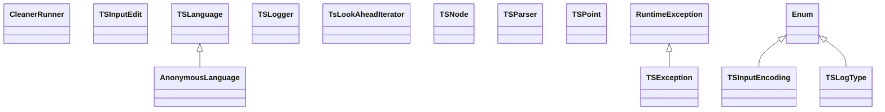

# tree-sitter-0.24.4.jar

[Group index](README.md) | [All archives](../README.md)

## Scope and provenance

- **Donor:** `SQX_145_REFERENCE_ROOT/internal/libs/tree-sitter-0.24.4.jar`.
- **SHA-256:** `1dfebefc616049956ade6c4e85534d8c656a391da2a3a56a610f8d345e715745`; accessed 2026-10-06; captured `2026-10-06T18:54:51.906614+00:00`.
- **Classes:** 34 raw entries; 34 unique entry names. Duplicate occurrence indices are zero-based.
- **Inspection:** read-only ZIP hashing and class-file structural parsing; signatures/descriptors, modifiers, hierarchy and references only. Bytecode bodies are hashed, not published.
- **Allocation:** proposed `FEAT-AGENTIC-TREE-SITTER`, P19; [roadmap](../../sqx-full-application-roadmap.md). Domain README registration remains required.
- **Repository:** `01067f00031428613c6394064ca1bcadc1ba00ee`; review state unreviewed. Download label 145-dev1; installed build/activation and runtime equivalence unverified.
- **Limit:** every class/member is inventoried; declaration coverage does not establish consumed calls, defaults, formulas, failure semantics or algorithm parity.
- **Archive/resource index:** [113.json](../../../evidence/sqx145/archives/145/113.json).

## Complete member declarations

Member shards contain exact JVM names/descriptors, access flags, generic signatures, throws types, declared fields/methods, superclass/interfaces and referenced class names. All classes, nested/synthetic members and overloads are retained. Code length/hash is structural evidence, not a normalized algorithm comparison.

- [001.json](../../../evidence/sqx145/members/113/001.json) — SHA-256 `213e84e9b95c424111b763af49127d17439c4c8242cbe78620e6df1ed4890caa`.

## Focused structural diagram

Up to twelve non-nested classes; arrows show declared inheritance/interfaces only. External type names are not evidence of an available body or an executed dependency.

## Class inventory

| Archive entry | Occurrence | Class SHA-256 | Fields | Methods |
| --- | ---: | --- | ---: | ---: |
| `org/treesitter/AnonymousLanguage.class` | 0 | `a0af6e6244f5aac542d8f08d972119d1c57e16650dc1b1939772a39987f1f3fd` | 0 | 2 |
| `org/treesitter/CleanerRunner.class` | 0 | `224e677d2e91631427ab7a31c420eb52da44364e37716e6189c2a1b7cc6dafa3` | 1 | 3 |
| `org/treesitter/TSException.class` | 0 | `6b73d85b9a852d209e7cf578faa9708ac3e086baa601665f51b5a12743738d63` | 0 | 1 |
| `org/treesitter/TSInputEdit.class` | 0 | `5b4787bcb6ecde03287c2ab349e395c634c228c09fbaa30841214d3be8cca7f7` | 6 | 7 |
| `org/treesitter/TSInputEncoding.class` | 0 | `9572d394f50e232e0f86631aa581000af1c566abcb80d62cca2d11cacbc7cbae` | 3 | 4 |
| `org/treesitter/TSLanguage$TSLanguageCleanAction.class` | 0 | `10dbbb474f9e0f6420b6af233372db051c8189cda2a4d1b8b8a9ec6865a7d963` | 1 | 2 |
| `org/treesitter/TSLanguage.class` | 0 | `82d767b75f522a1f97d3ef7d53dc5ca26c38eccd86ea4b08686d00d233073084` | 1 | 14 |
| `org/treesitter/TSLogger.class` | 0 | `3f99bfc9a8f37ec7418743198518c07c7a717858fd27359ac42e0a0f870aece5` | 0 | 1 |
| `org/treesitter/TSLogType.class` | 0 | `e9c5ee631e61c16ab0853c8b78b67ad2e66952f0b693ecda8a07f1e34761e58e` | 3 | 4 |
| `org/treesitter/TsLookAheadIterator$TsLookAheadIteratorCleanAction.class` | 0 | `ab36e9167e931a22db3b5a60fb0a06d0dd046c4f6bdc7cac6f83af75a85be0d4` | 1 | 2 |
| `org/treesitter/TsLookAheadIterator.class` | 0 | `be75658d1061492a4bca88b2cc0e578c9b535b1822f9b06914d2770ea6bd059f` | 1 | 8 |
| `org/treesitter/TSNode.class` | 0 | `e69aeb39903032d5c8f0e9d5bc3bb62428351ffcc7e73dc802fa4ec33f05074b` | 7 | 46 |
| `org/treesitter/TSParser$TSParserCleanAction.class` | 0 | `ee2ff8d42dfff7324b6580df8f6bf5c65b21ccdcb1a3ba68f3f4d2fea51e77f7` | 1 | 2 |
| `org/treesitter/TSParser.class` | 0 | `2b8c9c21e96a56e1442d6dd240141142240e67be0fcb770237a71cf99c9aeea5` | 5 | 150 |
| `org/treesitter/TSPoint.class` | 0 | `aad2663510491a37b51dbd60d174c0412f7a448724ba983e03aafee2a091e6a0` | 2 | 3 |
| `org/treesitter/TSQuantifier.class` | 0 | `225fa0df47a32b6a576c85e2660fc8cee9f7e6b37d295cd4d5c28b4390dd8bc4` | 6 | 4 |
| `org/treesitter/TSQuery$TSQueryCleanRunner.class` | 0 | `ea9554f6315ccdafa92e806404a45b190cefec5cb883bd9e0665150fed909b4d` | 1 | 2 |
| `org/treesitter/TSQuery.class` | 0 | `a9f359ab9311e0df174459427acd886c05a35bf3dd467ad512eac446de07db54` | 1 | 19 |
| `org/treesitter/TSQueryCapture.class` | 0 | `2fae5ba202e9a326b2aebfcf0a4014422b57214444f726094fb8b2b31dd9f2ef` | 2 | 3 |
| `org/treesitter/TSQueryCursor$TSMatchIterator.class` | 0 | `9c57a0bfed0d2db4c1090ba5555cd3f15b791a1dbbc44f3d8ba740e51f767b35` | 4 | 6 |
| `org/treesitter/TSQueryCursor$TSQueryCursorCleanAction.class` | 0 | `785c89af03aab58cfa1fe3527249e66af95a3cbb7d07c93ea681e5ab8bcc479f` | 1 | 2 |
| `org/treesitter/TSQueryCursor.class` | 0 | `a6cd662b77dde573067ca7c45741771eab718079e5f97847eaa39f0814ddd301` | 2 | 14 |
| `org/treesitter/TSQueryException.class` | 0 | `be3b66793410712c29eb0372ce80eb2b68f49beebfd0540eceb612580de360a0` | 0 | 1 |
| `org/treesitter/TSQueryMatch.class` | 0 | `18b973c0f1232e12aaf42408339ff4fdce23836cbde198e4d3a037f3bcffc5dd` | 4 | 5 |
| `org/treesitter/TSQueryPredicateStep.class` | 0 | `649e4b99f6c74a35dfcf95e3196546aed08d82db616fc4ca903a11ad00e27cd1` | 2 | 3 |
| `org/treesitter/TSQueryPredicateStepType.class` | 0 | `c5fd6b65ad061f2de28c5627b9e4278af84a19e6dd834adbc4a320ae9a9bf069` | 4 | 4 |
| `org/treesitter/TSRange.class` | 0 | `9737e57cef9d971fdccea77c59bdf7cc4f5c241d3ea123a5521cb2250e899bc7` | 4 | 5 |
| `org/treesitter/TSReader.class` | 0 | `c9acdf1fd5861e7c7216990cc82c2fe4c2ad2c29a2c65b36426ba977ab9df4fa` | 0 | 1 |
| `org/treesitter/TSSymbolType.class` | 0 | `f330fa99ebf4c837e23dc8322510014b71ef03c90ee43de1035a2425885c26e0` | 5 | 4 |
| `org/treesitter/TSTree$TSTreeCleanAction.class` | 0 | `90f08271e84151453a15d2d77dd0cda559e55d547f59ad58cbb56233c8d0db50` | 1 | 2 |
| `org/treesitter/TSTree.class` | 0 | `b0a57f3d02b7d758fb75c29ba5025d7427f515c3e3927f8b61d01164018fd20e` | 2 | 11 |
| `org/treesitter/TSTreeCursor$TSTreeCursorCleanAction.class` | 0 | `fc4c80417dac8ae9e47b6c7a702cefee198ab4d9213631b360384aa55c11b35d` | 1 | 2 |
| `org/treesitter/TSTreeCursor.class` | 0 | `95ff78cd7487432280eb2066ad97e04016dbef88c49d3b88d0a3c0d28deab6cc` | 2 | 13 |
| `org/treesitter/utils/NativeUtils.class` | 0 | `02997ecad7df70564252e77f6fc6bad68938706138dc18a4aa49228f2df651f5` | 0 | 8 |
