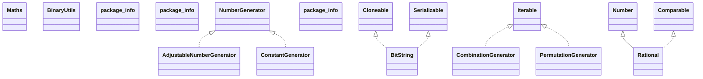

# uncommons-maths-1.2.2a.jar

[Group index](README.md) | [All archives](../README.md)

## Scope and provenance

- **Donor:** `SQX_145_REFERENCE_ROOT/internal/libs/uncommons-maths-1.2.2a.jar`.
- **SHA-256:** `eebe98f2f9d8cb5d2a030a1c3e52cfbb3ee0ff5b6a721a45e62092e3bbf83c5c`; accessed 2026-10-06; captured `2026-10-06T18:54:51.906614+00:00`.
- **Classes:** 42 raw entries; 42 unique entry names. Duplicate occurrence indices are zero-based.
- **Inspection:** read-only ZIP hashing and class-file structural parsing; signatures/descriptors, modifiers, hierarchy and references only. Bytecode bodies are hashed, not published.
- **Allocation:** proposed `FEAT-BUILDER-UNCOMMONS-MATHS`, P09; [roadmap](../../sqx-full-application-roadmap.md). Domain README registration remains required.
- **Repository:** `01067f00031428613c6394064ca1bcadc1ba00ee`; review state unreviewed. Download label 145-dev1; installed build/activation and runtime equivalence unverified.
- **Limit:** every class/member is inventoried; declaration coverage does not establish consumed calls, defaults, formulas, failure semantics or algorithm parity.
- **Archive/resource index:** [115.json](../../../evidence/sqx145/archives/145/115.json).

## Complete member declarations

Member shards contain exact JVM names/descriptors, access flags, generic signatures, throws types, declared fields/methods, superclass/interfaces and referenced class names. All classes, nested/synthetic members and overloads are retained. Code length/hash is structural evidence, not a normalized algorithm comparison.

- [001.json](../../../evidence/sqx145/members/115/001.json) — SHA-256 `e2de91eb02ae71d0949b71e1a0968f60373e5d105643c29204773d70f3bd3d01`.

## Focused structural diagram

Up to twelve non-nested classes; arrows show declared inheritance/interfaces only. External type names are not evidence of an available body or an executed dependency.

## Class inventory

| Archive entry | Occurrence | Class SHA-256 | Fields | Methods |
| --- | ---: | --- | ---: | ---: |
| `org/uncommons/maths/Maths.class` | 0 | `f4d07966ac4d30dc92e4ce0bd3431c47c92037606d289c2bea1da3857747bea5` | 3 | 11 |
| `org/uncommons/maths/binary/BinaryUtils.class` | 0 | `a7f04d5514d92b7a6e1046b4e32d036dd76cc49734c971c61c5b318a6408f501` | 2 | 8 |
| `org/uncommons/maths/binary/BitString.class` | 0 | `4221501b42421b7e2aac709f3b8c43e5f0dd2ad09675ee3e39713521b21c448b` | 3 | 18 |
| `org/uncommons/maths/binary/package-info.class` | 0 | `4890e967c3e6938e9f5bcbe574d6deb22c009393b04575842e208c4c736fac26` | 0 | 0 |
| `org/uncommons/maths/combinatorics/CombinationGenerator$1.class` | 0 | `42e0237046c48ed3cdf02d23afb1b09eb8e30435fb3dcd3e61114b95b01966bb` | 1 | 5 |
| `org/uncommons/maths/combinatorics/CombinationGenerator.class` | 0 | `c4a76a48408ea2a268c4a03dd7d282650df9b39c75222dd3bf199eacc63f6900` | 4 | 12 |
| `org/uncommons/maths/combinatorics/PermutationGenerator$1.class` | 0 | `64f62d178150e3cc5974da94ef1c38f6f3c2cf50e5a5d191bd2a0496a66da813` | 1 | 5 |
| `org/uncommons/maths/combinatorics/PermutationGenerator.class` | 0 | `43fbd645a3f521d08f47ac9859ff8c01e46cf3590acb627fd86610c4b428e9bf` | 4 | 12 |
| `org/uncommons/maths/combinatorics/package-info.class` | 0 | `7865039bc233d29a3865fdc881e61d3cbdd3f0ad7ab8ac40560b60361680e6e0` | 0 | 0 |
| `org/uncommons/maths/number/AdjustableNumberGenerator.class` | 0 | `b743a5dc07ff81f31f26d9c22e07ae2ebeffaadd6b4ffe7b5cc0a0c555834ae7` | 2 | 3 |
| `org/uncommons/maths/number/ConstantGenerator.class` | 0 | `6b6c59b86d19838216da0ef85b04395a352c2eba9876e741e066d3f8aee549ae` | 1 | 2 |
| `org/uncommons/maths/number/NumberGenerator.class` | 0 | `a95920a28f84701d983d17aa1617bfffad19562d9e314c876bf0b2e24dcc09ac` | 0 | 1 |
| `org/uncommons/maths/number/Rational.class` | 0 | `4ede8fdd3a01fb829f914eb3438ca47c117e6f13f1ae503050b0144bea04d4eb` | 9 | 19 |
| `org/uncommons/maths/number/package-info.class` | 0 | `4df9f5980616ace7e4a87cb80fd5db3efca885961acd4ae2e1904d424a3bda3a` | 0 | 0 |
| `org/uncommons/maths/package-info.class` | 0 | `524963fc55fec4a1469869c75d9b8062fabf58c55a09bb5c86f49dcab7d693d3` | 0 | 0 |
| `org/uncommons/maths/random/AESCounterRNG$1.class` | 0 | `a4413c62593a53e1ce12f67bbbc26e6420124015719bff0711db78f01921ce36` | 0 | 0 |
| `org/uncommons/maths/random/AESCounterRNG$AESKey.class` | 0 | `5e58dd8b7c9a7c3c0b5e6b52cd84143e7cfb4cb4cea0bd323eb38068b740cd52` | 1 | 5 |
| `org/uncommons/maths/random/AESCounterRNG.class` | 0 | `bf34f72925d95a49043ff17c1809ad7167c22109dd8e956ca2613e18ce910556` | 7 | 8 |
| `org/uncommons/maths/random/BinomialGenerator.class` | 0 | `e55b60ae4b4e34fe193898a50fb7fcc946572b528a397b6613b252b3c9a11dad` | 5 | 5 |
| `org/uncommons/maths/random/CMWC4096RNG.class` | 0 | `816219f24233c9a41d1bfe151fdfeb717f0734ad68befa62cf3363b8af38e020` | 7 | 5 |
| `org/uncommons/maths/random/CellularAutomatonRNG.class` | 0 | `39a2a2fd6b9561bc3e90567337e66521d654c139f9d959ca7c41db1ba549034c` | 7 | 7 |
| `org/uncommons/maths/random/ContinuousUniformGenerator.class` | 0 | `cb793803d0724d7476ba1bcfe187445ee9d5e5267e9355c0a1f30a7418a6962c` | 3 | 3 |
| `org/uncommons/maths/random/DefaultSeedGenerator.class` | 0 | `248e48b07b809586c4fdeb80ef8c88cccd1da703af40c371396b9da5dcf6fa11` | 3 | 4 |
| `org/uncommons/maths/random/DevRandomSeedGenerator.class` | 0 | `b9f7ea662012abdf64b259f451fd74139a2be0942b04426253814c1e483c506d` | 1 | 4 |
| `org/uncommons/maths/random/DiehardInputGenerator.class` | 0 | `8a221dcc50c254345ab3f6faf4de5fd029f992463fdbb071834c79e1b7f17527` | 1 | 3 |
| `org/uncommons/maths/random/DiscreteUniformGenerator.class` | 0 | `c285a941a79b5362fd604e012c8114d10d1ae96b47eb06be1c225831c5c4206a` | 3 | 3 |
| `org/uncommons/maths/random/ExponentialGenerator.class` | 0 | `a98b0f9125f657ee818e9cc479a93faade1406b8e043725b6ab630914b9ccdb2` | 2 | 4 |
| `org/uncommons/maths/random/GaussianGenerator.class` | 0 | `e53b78ad6325f878e49d82771f99f8ec532916304a2c971c3c8f8f03040433b6` | 3 | 4 |
| `org/uncommons/maths/random/JavaRNG.class` | 0 | `e8122b506f6c4e0285d1d7e50945eb6c8d0d330a15f197d0f59782235f3d1057` | 2 | 5 |
| `org/uncommons/maths/random/MersenneTwisterRNG.class` | 0 | `8949ba0f64e99128ac2ae12e604a568841a3776b703e8946484326635e7192a3` | 16 | 6 |
| `org/uncommons/maths/random/PoissonGenerator.class` | 0 | `1c57841e73640ffb0c01b6199957edea6e7937577d7133082012822d13d001b7` | 2 | 4 |
| `org/uncommons/maths/random/Probability.class` | 0 | `aefc77c802c3debe0d0e3c6348a4ea5cea78fcb9425d839c80590eaf5ddc2f0e` | 4 | 13 |
| `org/uncommons/maths/random/RandomDotOrgSeedGenerator.class` | 0 | `b40120dde15f7b2b279dbe686ff3fde695cea514cec314bfea4a841f74a60e9a` | 7 | 5 |
| `org/uncommons/maths/random/RepeatableRNG.class` | 0 | `963c446c2955ca6d77e9843a284f54a2abbb90806d5292a5ee739b13f89992cc` | 0 | 1 |
| `org/uncommons/maths/random/SecureRandomSeedGenerator.class` | 0 | `63ae158cd04d4ed30798066c19c28e476ad853a8840e94ea295248b8d2517638` | 1 | 4 |
| `org/uncommons/maths/random/SeedException.class` | 0 | `1fd680fdb506bb9691c3e390fc760879d2262afc48e63dcca2213852048be159` | 0 | 2 |
| `org/uncommons/maths/random/SeedGenerator.class` | 0 | `dfde2eac3e99c64435fdce07762fe191af9bba57549e4e165b0f7a3e4d2d8c5a` | 0 | 1 |
| `org/uncommons/maths/random/XORShiftRNG.class` | 0 | `b1f3a6c944ab030538423ee9a95c64f2241b4b7d8f7ade516accaa859ce1c57c` | 8 | 5 |
| `org/uncommons/maths/random/package-info.class` | 0 | `1d4f522dd581e52029e15c37bcfe9e59d5ea1c957e652620123f79914e6f84ad` | 0 | 0 |
| `org/uncommons/maths/statistics/DataSet.class` | 0 | `8eaeb78c3e9cbf00fb65ec567e0824e9dec3f629982f8dfd13de578d7a7db60d` | 9 | 21 |
| `org/uncommons/maths/statistics/EmptyDataSetException.class` | 0 | `bad27e934fb45e98df1b2fd38edcf0a150efbcb7800a28d69ab4a7b46194ac7a` | 0 | 1 |
| `org/uncommons/maths/statistics/package-info.class` | 0 | `1d5297d254086b62add50207cac54e13e89e8e5ac72faca746d60a29407223eb` | 0 | 0 |
