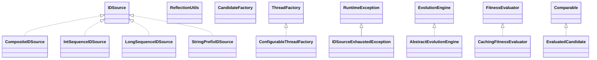

# watchmaker-framework-0.7.1.jar

[Group index](README.md) | [All archives](../README.md)

## Scope and provenance

- **Donor:** `SQX_145_REFERENCE_ROOT/internal/libs/watchmaker-framework-0.7.1.jar`.
- **SHA-256:** `f4d1ac73aa475bc403b6a6e8d5bce37f4d69a215e2deaa65ecc57d2e13368fb8`; accessed 2026-10-06; captured `2026-10-06T18:54:51.906614+00:00`.
- **Classes:** 74 raw entries; 74 unique entry names. Duplicate occurrence indices are zero-based.
- **Inspection:** read-only ZIP hashing and class-file structural parsing; signatures/descriptors, modifiers, hierarchy and references only. Bytecode bodies are hashed, not published.
- **Allocation:** proposed `FEAT-BUILDER-WATCHMAKER-FRAMEWORK`, P09; [roadmap](../../sqx-full-application-roadmap.md). Domain README registration remains required.
- **Repository:** `01067f00031428613c6394064ca1bcadc1ba00ee`; review state unreviewed. Download label 145-dev1; installed build/activation and runtime equivalence unverified.
- **Limit:** every class/member is inventoried; declaration coverage does not establish consumed calls, defaults, formulas, failure semantics or algorithm parity.
- **Archive/resource index:** [116.json](../../../evidence/sqx145/archives/145/116.json).

## Complete member declarations

Member shards contain exact JVM names/descriptors, access flags, generic signatures, throws types, declared fields/methods, superclass/interfaces and referenced class names. All classes, nested/synthetic members and overloads are retained. Code length/hash is structural evidence, not a normalized algorithm comparison.

- [001.json](../../../evidence/sqx145/members/116/001.json) — SHA-256 `06eedced8019e9c732bc32c6091404d0047ad17af19c10ea0bb838b1dcdda84e`.

## Focused structural diagram

Up to twelve non-nested classes; arrows show declared inheritance/interfaces only. External type names are not evidence of an available body or an executed dependency.

## Class inventory

| Archive entry | Occurrence | Class SHA-256 | Fields | Methods |
| --- | ---: | --- | ---: | ---: |
| `org/uncommons/util/concurrent/ConfigurableThreadFactory$1.class` | 0 | `8b918e3c94c15ab5bb50a67a92f906d869dc43dcd1a6496b7c60e2c56259219c` | 0 | 2 |
| `org/uncommons/util/concurrent/ConfigurableThreadFactory.class` | 0 | `9d21cb34310f9cfa087a7b7d035184e65fc82056c056f584b036db8d3fc8577d` | 5 | 4 |
| `org/uncommons/util/id/CompositeIDSource.class` | 0 | `f59eaf90bd2389d29ae26f18f67955e545710ff108667ca329aae4c180e10fe4` | 3 | 3 |
| `org/uncommons/util/id/IDSource.class` | 0 | `f0275bad8678c845f4e963b000d63112a2bb60cc1986b7d689c42d16ca926db1` | 0 | 1 |
| `org/uncommons/util/id/IDSourceExhaustedException.class` | 0 | `113c01a7ed39920953d8c54dd9301686ec598d035c843f269ec27a86ed69b359` | 0 | 2 |
| `org/uncommons/util/id/IntSequenceIDSource.class` | 0 | `0357ac7314998b944a9da9839fd24ac069b8763de2e8393554749f1af666fee2` | 4 | 4 |
| `org/uncommons/util/id/LongSequenceIDSource.class` | 0 | `869c8a808a36b78569c45f4450812ffd8eae0b654510c6f3e57c276da1500b8b` | 4 | 4 |
| `org/uncommons/util/id/StringPrefixIDSource.class` | 0 | `9a732e564d055204af6b74ca049db781e1f88d50d278dc54ec16d741b87cb935` | 3 | 3 |
| `org/uncommons/util/reflection/ReflectionUtils.class` | 0 | `06a2990ecea6fe5f648be2e3b7f1c71c514448343e399528327bbae8d6970249` | 0 | 5 |
| `org/uncommons/watchmaker/framework/AbstractEvolutionEngine.class` | 0 | `b9e9dfc5d189ed510da1616dfebedd5a30ded8758191a0a343f2ae58646d421b` | 7 | 14 |
| `org/uncommons/watchmaker/framework/CachingFitnessEvaluator.class` | 0 | `e65193b6334162d9a9c4f4fe6ceff31e08a0a57502ca3c3f0403e0491d8bc357` | 2 | 3 |
| `org/uncommons/watchmaker/framework/CandidateFactory.class` | 0 | `09986049bfbeecb6e47b36d9ddb97ee557c9b3c2ee840590a36d5b5582722489` | 0 | 3 |
| `org/uncommons/watchmaker/framework/EvaluatedCandidate.class` | 0 | `b81257c3791d62040e6c6c2281a50f36c4b06afd3ff91207f0676afb0947a288` | 2 | 7 |
| `org/uncommons/watchmaker/framework/EvolutionEngine.class` | 0 | `1cc4c121d8975b32c503519ff6585c217bafeb84f04157acd779a52c32c986a5` | 0 | 7 |
| `org/uncommons/watchmaker/framework/EvolutionObserver.class` | 0 | `c14ae708b7433efdacaf76b8e706ac2243242e22961c1972efc666ef56e68b7e` | 0 | 1 |
| `org/uncommons/watchmaker/framework/EvolutionStrategyEngine.class` | 0 | `2b7a7d3eaa1f43ac1b45f3a23158fafced4f12ce66f847748ce0b07a3f0de1d5` | 5 | 3 |
| `org/uncommons/watchmaker/framework/EvolutionUtils.class` | 0 | `74051e850e20167a532ca1e71f4b99cc8667f1e9e8c009e7c178026d032b7c15` | 0 | 4 |
| `org/uncommons/watchmaker/framework/EvolutionaryOperator.class` | 0 | `d9c0f9e0245ce09f65218d279fcd8418e668c99318f3d1afac0a3bae0dc97a29` | 0 | 1 |
| `org/uncommons/watchmaker/framework/FitnessEvaluationWorker.class` | 0 | `dec3f85798a2e56babfbb64288bbf205a277be64427e66840929cec34ba7ffb7` | 3 | 6 |
| `org/uncommons/watchmaker/framework/FitnessEvaluator.class` | 0 | `5fc845b5ec0ba4198c27e69c2a4d256670383eea87d9ccd0aa9cb2e9762bd1b7` | 0 | 2 |
| `org/uncommons/watchmaker/framework/FitnessEvalutationTask.class` | 0 | `9a97f7d3cf8699de823cd35650dcfadb59698f4ba3f3a65ddaf49be07f873b2f` | 3 | 3 |
| `org/uncommons/watchmaker/framework/GenerationalEvolutionEngine.class` | 0 | `eb3f1f18a57ca7495b9c0a3aac4628e431dbb2c7b3c07a990c91c7bdb9e64968` | 3 | 3 |
| `org/uncommons/watchmaker/framework/NullFitnessEvaluator.class` | 0 | `df5d9ef7a2d8f3c1fc6f8473d4b1d41c0ac255e28a1c70ca2012958024e46a8a` | 0 | 3 |
| `org/uncommons/watchmaker/framework/PopulationData.class` | 0 | `94a9ab6fd8c63a293adcb13940af63c4aeadece704bee2367b3d341d76c76006` | 9 | 10 |
| `org/uncommons/watchmaker/framework/SelectionStrategy.class` | 0 | `531e7fa4eefe1ac86dc9e8babfcbc6200edad4afbccbcc2b8251eba867c510f0` | 0 | 1 |
| `org/uncommons/watchmaker/framework/SteadyStateEvolutionEngine.class` | 0 | `af04641a9ba2a64fa90b5f47c0762c05d31b4d2bb513d17abfcd60966485b946` | 6 | 4 |
| `org/uncommons/watchmaker/framework/TerminationCondition.class` | 0 | `9040286008a8cf7d654cc994883c95dc1a8dd020a29efb74b9500c6b435ae1d0` | 0 | 1 |
| `org/uncommons/watchmaker/framework/factories/AbstractCandidateFactory.class` | 0 | `cc83e567ed9123072c13dbb9187f9c8cea5f02387da36dabef496690c8cda51a` | 0 | 3 |
| `org/uncommons/watchmaker/framework/factories/BitStringFactory.class` | 0 | `49091e5c0926605f351372f182a70e8e6c9e121b216ed19303541ef8b507189e` | 1 | 3 |
| `org/uncommons/watchmaker/framework/factories/ListPermutationFactory.class` | 0 | `5d706171afa7d4e1ab0b2f4b94847e6ff98c1b1793ac7bcd7bf9640d95805601` | 1 | 3 |
| `org/uncommons/watchmaker/framework/factories/ObjectArrayPermutationFactory.class` | 0 | `d3faa9e23173114620e982e25ff1043fd7fb4507ef415aed93416d51ee3b370a` | 1 | 3 |
| `org/uncommons/watchmaker/framework/factories/StringFactory.class` | 0 | `ea807fa0f3faee6144dbd0ed59a76569f763a9c1482150b8b4cde4b46d5c2eb2` | 2 | 3 |
| `org/uncommons/watchmaker/framework/interactive/Console.class` | 0 | `18071046e36fa68f243813fb20dee081fcdd638310d84fd5a99cd57277adfb91` | 0 | 1 |
| `org/uncommons/watchmaker/framework/interactive/InteractiveSelection$1.class` | 0 | `a91949c36c9fc58ef83a9159a35f360e8323952f8f857386fb86feabe7efaab6` | 0 | 0 |
| `org/uncommons/watchmaker/framework/interactive/InteractiveSelection$NoOpRenderer.class` | 0 | `436f39d02d6981c846504ae9e01409840b0dff0f3f26972cfe4225d755d83f36` | 0 | 3 |
| `org/uncommons/watchmaker/framework/interactive/InteractiveSelection.class` | 0 | `42237f332b6509639beafa0e9f41f2f08cb3fe2e317fe8a2ada8bd770983eadf` | 4 | 4 |
| `org/uncommons/watchmaker/framework/interactive/Renderer.class` | 0 | `1f7457b1b38d698c03b6b3b5942fe905baface171365f6b1e0678bbcdea31493` | 0 | 1 |
| `org/uncommons/watchmaker/framework/interactive/RendererAdapter.class` | 0 | `e231d89351159ec27133b229d96c171822d613fa99ada508554297a9c96a34c5` | 2 | 2 |
| `org/uncommons/watchmaker/framework/islands/Epoch.class` | 0 | `99100a10f509f4de72206af5e358aa5087f741f362098bbe161c4d2170428125` | 5 | 3 |
| `org/uncommons/watchmaker/framework/islands/IslandEvolution$1.class` | 0 | `9128f5ee5b60eb7f562aac2d6b8a448493d514fb7b8226a5056fa8801ca5b247` | 2 | 2 |
| `org/uncommons/watchmaker/framework/islands/IslandEvolution.class` | 0 | `e6c949a9afa59f46a4a75b40705f059194aeb87a7616078a85e85cec9e6627d8` | 6 | 11 |
| `org/uncommons/watchmaker/framework/islands/IslandEvolutionObserver.class` | 0 | `b857a3ab8703bcd5e057f7745a7e772349d93bd0da6daa351d1570337611ac38` | 0 | 1 |
| `org/uncommons/watchmaker/framework/islands/Migration.class` | 0 | `7da2ee8defe25fe1b174d8ced65b5b31fb3e06d423853678bb9c8a710d10e510` | 0 | 1 |
| `org/uncommons/watchmaker/framework/islands/RingMigration.class` | 0 | `5f7f3adb1440587b00255cf04f03dfdbec7ff9d91a0e45e531453cfe7ba71e68` | 0 | 2 |
| `org/uncommons/watchmaker/framework/operators/AbstractCrossover.class` | 0 | `7ba6d90af56123e9498b497c3e905201f035331afe0f6e5b71f42437f3e4fce8` | 2 | 6 |
| `org/uncommons/watchmaker/framework/operators/BitStringCrossover.class` | 0 | `dc6140febb7d4506f685a4ec284311b6086886fca2077475826c7f574c8d2339` | 0 | 7 |
| `org/uncommons/watchmaker/framework/operators/BitStringMutation.class` | 0 | `792b8fefd6d46987859640b0983b513e8b54a9d087a8bd46212f7dfa09bf23e5` | 2 | 4 |
| `org/uncommons/watchmaker/framework/operators/ByteArrayCrossover.class` | 0 | `458b3f74c9b452e307348f860988357b20af34b0f522d1761f9fc993e900bf36` | 0 | 7 |
| `org/uncommons/watchmaker/framework/operators/CharArrayCrossover.class` | 0 | `9af9be08357aa499e75b3ee4ea66f5b06313bdcba030c1c301ef24423fbe47a1` | 0 | 7 |
| `org/uncommons/watchmaker/framework/operators/DoubleArrayCrossover.class` | 0 | `a01540c92494d1c7e58c0cb440b2ef051abb5360756c9cd492dffb7e898669d6` | 0 | 7 |
| `org/uncommons/watchmaker/framework/operators/EvolutionPipeline.class` | 0 | `39f689d28b7f1f4a472d1e3b71110f7b52dd706c76c33723cee9226c72d7a977` | 1 | 2 |
| `org/uncommons/watchmaker/framework/operators/IdentityOperator.class` | 0 | `6bb1aed7099862652eb212f73a3d07a6ccc17349eaf24f49be983e6bfc7e3754` | 0 | 2 |
| `org/uncommons/watchmaker/framework/operators/IntArrayCrossover.class` | 0 | `b4a5128639ec7d1ed06e51539713a0b4d56c36725e6bccc0f0371fcccc624fdb` | 0 | 7 |
| `org/uncommons/watchmaker/framework/operators/ListCrossover.class` | 0 | `edf3c0a307730cd746dae3c501bf6cd0bf720ed2bb600f94a1a342ca2f1b9c00` | 0 | 7 |
| `org/uncommons/watchmaker/framework/operators/ListInversion.class` | 0 | `e897056d917fac6854e62fa59e40c311eda116767fe02f48cb6d515c6549d96f` | 1 | 3 |
| `org/uncommons/watchmaker/framework/operators/ListOperator.class` | 0 | `37c3a67a44d2985cbf1548a7f9ceafd2f02ffe29734d9d499d01a82926a34d0c` | 1 | 2 |
| `org/uncommons/watchmaker/framework/operators/ListOrderCrossover.class` | 0 | `b2579c90280332d5b6fd578bf2156a19dcbac6ed1ef0994d416233dad4e9c43a` | 1 | 8 |
| `org/uncommons/watchmaker/framework/operators/ListOrderMutation.class` | 0 | `18a281ec8a9f8a52d6333f764146ca941749ecdda960121bf35b55cc3e10d07c` | 2 | 4 |
| `org/uncommons/watchmaker/framework/operators/ObjectArrayCrossover.class` | 0 | `757fe8243fff68d1284448199395b58d54c1142890f0303b14dbad9c70d9f4dc` | 0 | 7 |
| `org/uncommons/watchmaker/framework/operators/Replacement.class` | 0 | `5f20c078d6c14869d697eb622b51808c59ed2532902884f709a448edc6f2454d` | 2 | 3 |
| `org/uncommons/watchmaker/framework/operators/SplitEvolution.class` | 0 | `ccbae0fd16c2e6682e3b5e62c2625c99e79a670a4a89fa1e281a58a251a9e081` | 3 | 3 |
| `org/uncommons/watchmaker/framework/operators/StringCrossover.class` | 0 | `8418e03a85a85f5d3ecc69afe6ca94400516ea8f895da2e02b5f61c08e79c2f3` | 0 | 7 |
| `org/uncommons/watchmaker/framework/operators/StringMutation.class` | 0 | `08f4d5ec99eaea328f7086837380c0c04701bda2d522b289be9b47713ac30ec8` | 2 | 4 |
| `org/uncommons/watchmaker/framework/selection/RankSelection.class` | 0 | `a7eb3c4d427c7cfc38a2c90a54e64650e778406094c71248f3f3b14d90cb2076` | 1 | 5 |
| `org/uncommons/watchmaker/framework/selection/RouletteWheelSelection.class` | 0 | `a6c7f66a77a92109ab2205aa6e8ccb818c88f205028e480a6669b002c05ecb19` | 0 | 4 |
| `org/uncommons/watchmaker/framework/selection/SigmaScaling.class` | 0 | `237b8df57afb4fb7767e7043e9e91c003263c55310e644f4a1a097d4c0c5fd4e` | 1 | 5 |
| `org/uncommons/watchmaker/framework/selection/StochasticUniversalSampling.class` | 0 | `f125130b7750832ac1849202f40a4be06ac3644dcebc9d381fce0f9b4661ce17` | 0 | 4 |
| `org/uncommons/watchmaker/framework/selection/TournamentSelection.class` | 0 | `fa0b80494d5d0a07a4639876c0dacc2dcf9e443bdaa02b983e3083276febd557` | 2 | 4 |
| `org/uncommons/watchmaker/framework/selection/TruncationSelection.class` | 0 | `05851d8bbc6027865536474becc221e47ca616aadc6fae8f56c201fe5032f725` | 4 | 5 |
| `org/uncommons/watchmaker/framework/termination/ElapsedTime.class` | 0 | `9173f2cdc20c78cc61a7d7ee9aa0b3e9abb25973dac28ce7b9879f6e879bab37` | 1 | 2 |
| `org/uncommons/watchmaker/framework/termination/GenerationCount.class` | 0 | `6507aedd7a2ea2ab38b75ff09924e84cca2dfe2506b079824bdab329720922a9` | 1 | 2 |
| `org/uncommons/watchmaker/framework/termination/Stagnation.class` | 0 | `debec4dce0c9a81cb2f501e50e835eeae7bf19154504f579ba931e2eda6e4e2e` | 5 | 5 |
| `org/uncommons/watchmaker/framework/termination/TargetFitness.class` | 0 | `f5a97d15732ec86f10888e13c6b2cc4318b4a0ea0d152fb2f50051e8807dd272` | 2 | 2 |
| `org/uncommons/watchmaker/framework/termination/UserAbort.class` | 0 | `d1fa97cbecc47d370a52cf88f027755c400785e6b649fe7187b2159460fa5a14` | 1 | 5 |
