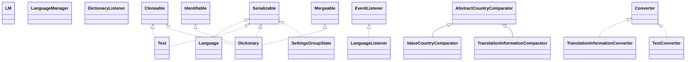

# weblaf-core-1.2.9.jar

[Group index](README.md) | [All archives](../README.md)

## Scope and provenance

- **Donor:** `SQX_145_REFERENCE_ROOT/internal/libs/weblaf-core-1.2.9.jar`.
- **SHA-256:** `4628977369f5510bffdbec811866241e3e218893386c34610e3a21bf93adb99f`; accessed 2026-10-06; captured `2026-10-06T18:54:51.906614+00:00`.
- **Classes:** 340 raw entries; 340 unique entry names. Duplicate occurrence indices are zero-based.
- **Inspection:** read-only ZIP hashing and class-file structural parsing; signatures/descriptors, modifiers, hierarchy and references only. Bytecode bodies are hashed, not published.
- **Allocation:** proposed `FEAT-PRODUCT-WEBLAF-CORE`, P17; [roadmap](../../sqx-full-application-roadmap.md). Domain README registration remains required.
- **Repository:** `01067f00031428613c6394064ca1bcadc1ba00ee`; review state unreviewed. Download label 145-dev1; installed build/activation and runtime equivalence unverified.
- **Limit:** every class/member is inventoried; declaration coverage does not establish consumed calls, defaults, formulas, failure semantics or algorithm parity.
- **Archive/resource index:** [117.json](../../../evidence/sqx145/archives/145/117.json).

## Complete member declarations

Member shards contain exact JVM names/descriptors, access flags, generic signatures, throws types, declared fields/methods, superclass/interfaces and referenced class names. All classes, nested/synthetic members and overloads are retained. Code length/hash is structural evidence, not a normalized algorithm comparison.

- [001.json](../../../evidence/sqx145/members/117/001.json) — SHA-256 `dc267722488c743d808f16ac4283ea8dd2c97c17a419ff18838ffa7a8cabe9bb`.
- [002.json](../../../evidence/sqx145/members/117/002.json) — SHA-256 `02aed9efcf0a949138848a6a5b1b7bb5a4eba081a3d47f69ea7ea51ef3567699`.
- [003.json](../../../evidence/sqx145/members/117/003.json) — SHA-256 `023736402f010890ae923006789264a4946ffaefd5b75faab5224156e9229360`.
- [004.json](../../../evidence/sqx145/members/117/004.json) — SHA-256 `cd0c6db6e6be9d0bda6b0a82e8138f18e97e246ae5023ff10507b6dc22359a59`.
- [005.json](../../../evidence/sqx145/members/117/005.json) — SHA-256 `eb6c245537e0c3ab3d8447d7a9b2a1c421403a9f01506f09f538488036e67630`.

## Focused structural diagram

Up to twelve non-nested classes; arrows show declared inheritance/interfaces only. External type names are not evidence of an available body or an executed dependency.

## Class inventory

| Archive entry | Occurrence | Class SHA-256 | Fields | Methods |
| --- | ---: | --- | ---: | ---: |
| `com/alee/managers/language/LM.class` | 0 | `9a1214a7c8601f4ea00bd7c9fe48f632c2792a9d89f6730bb669719aad6e3ab3` | 2 | 13 |
| `com/alee/managers/language/LanguageManager.class` | 0 | `732be39f32fdb1daf4f708cc6622b1341b4f753a53c7647e21edbb730d622d19` | 6 | 29 |
| `com/alee/managers/language/Language.class` | 0 | `b51fec897f3cb30a99550d10351ea897ba3054a79654b467944db322132cb877` | 1 | 16 |
| `com/alee/managers/language/LanguageListener.class` | 0 | `38f1ebaf794e1ae3ade99b6e561f93c1629c57bc7c97f06ea1480f729bbd2b56` | 0 | 1 |
| `com/alee/managers/language/DictionaryListener.class` | 0 | `51d1e7b47d24ff1071de86e70687b314369da4f2099f89d1ec3130f688c8462f` | 0 | 3 |
| `com/alee/managers/language/data/ValueCountryComparator.class` | 0 | `d16adec1232eee735ebe9ec54df3419b70a6ac80668e655b21a75f19c0555ba0` | 0 | 3 |
| `com/alee/managers/language/data/Text.class` | 0 | `69f47ac185eda71f44fe8a91fc8db81b74249808dfae64a5119d69107c882710` | 3 | 12 |
| `com/alee/managers/language/data/TranslationInformationConverter.class` | 0 | `276e782d3452950777dd8f6235589e6172094ed0c68e24dafb1c3a0dbcc3cbe7` | 3 | 4 |
| `com/alee/managers/language/data/TranslationInformationComparator.class` | 0 | `3ad8490371fa8c0b8c119b357ae7fa677ad46d8437ca1dbc4df8ecc47ad5b311` | 0 | 3 |
| `com/alee/managers/language/data/TextConverter.class` | 0 | `e8037f4eb5f7d8548b8b39788010ad1bc1dd014b119cf61d3faf35902c7611e6` | 2 | 4 |
| `com/alee/managers/language/data/Dictionary.class` | 0 | `b1c22233d5022a048a1d3f7939ca2d3ce6c52de1e83407cac53671e8e05eb8bb` | 11 | 51 |
| `com/alee/managers/settings/SettingsGroupState.class` | 0 | `89f8a9456aa2cf3a5cc8b4837d87c3c392e847eb10392f6c3f9891282d73c13d` | 2 | 7 |
| `com/alee/utils/xml/DimensionConverter.class` | 0 | `5240ada12fd2a8266eabafc6b89ee9203bbf07a92b23b3170ba667c1c963396a` | 1 | 6 |
| `com/alee/utils/xml/ListToStringConverter.class` | 0 | `db1ede4a601611fa66c2e005233883ea24a641c5e7230411efd37e6f2c650247` | 0 | 4 |
| `com/alee/utils/xml/LocaleConverter.class` | 0 | `f6b21648d024eb5913990766698a650c01de20adddeda3109bd59411d0690b9f` | 0 | 4 |
| `com/alee/utils/collection/ArrayListAggregator.class` | 0 | `6f6183942895e16e67f60dcb0e3be9e36810e1ab6e4bdd48cd5be92252827c66` | 1 | 8 |
| `com/alee/utils/GeometryUtils.class` | 0 | `a5413ad845d6b5cde5bef90886336ff1db707564a50a26a58e4c27e3a36e046e` | 0 | 17 |
| `com/alee/utils/file/FileNameComparator.class` | 0 | `88c09f9e3f302624830bd78225fbac9994949f0cc91076ecb28dea9e51057de1` | 0 | 5 |
| `com/alee/utils/NetUtils.class` | 0 | `e0e95b2dc8095be2599d203572115ad1f74bb45d927fba0266360fdab1016db5` | 0 | 9 |
| `com/alee/utils/reflection/ModifierType$4.class` | 0 | `fa9a21deaed064ee2c2559242b0d7c746238142dfd50385ac610f9f5142b9ca3` | 0 | 2 |
| `com/alee/utils/reflection/ClassRelationType.class` | 0 | `ec18871af020861ba2f90c88e414c3365a6c229b59693342a62e6fcb0506ed9e` | 5 | 11 |
| `com/alee/utils/reflection/ModifierType.class` | 0 | `2adcdefde0bf0b31c4af94292e3f4e43ea3120683b7666b439dbce2659e0753a` | 12 | 24 |
| `com/alee/utils/reflection/ModifierType$6.class` | 0 | `cde03bd9ee532a01e023fb0fa1d475a1ce49f81ca3636d81dc38044f905d8c65` | 0 | 2 |
| `com/alee/utils/reflection/Unsafe.class` | 0 | `df57d58e9e4af2ebb15da001f63a5d1ad2f52f74ae86f3c585f83a833f392273` | 1 | 5 |
| `com/alee/utils/reflection/ModifierType$1.class` | 0 | `8eeea32ec2d5b55ad74c2aa0209b595f35f8ab3451a44925fb803785ee64fdf4` | 0 | 2 |
| `com/alee/utils/reflection/ModifierType$8.class` | 0 | `12a7eaa90e8fb6d76d90c4a9f1eb37f7d260f6a6647938087afd3df4395db945` | 0 | 2 |
| `com/alee/utils/reflection/ModifierType$9.class` | 0 | `0f68053495ed16f495ea56d24144c3082d5becd8c9d8e6d7074dc2f7c569e4e2` | 0 | 2 |
| `com/alee/utils/reflection/ReflectionException.class` | 0 | `5a1f342ea3a721067341e0cb910ddba7476e03105508c03fb106e566d9e9ade0` | 0 | 4 |
| `com/alee/utils/FileUtils$1.class` | 0 | `2a6a55e4aecffa07b74827f2dc66e6bdc2e9ebcb1623b7018d0b7805cd0f389f` | 1 | 2 |
| `com/alee/utils/FileUtils$2.class` | 0 | `65c73c8593141a9496c227c3db9e8010eb2ddbbca777aaef1301b689385bd7b1` | 2 | 2 |
| `com/alee/utils/system/JavaVersion.class` | 0 | `332f4649b2ce730c1347fa46907c7c6cb7848c457e6d594364a7c2f072076900` | 6 | 12 |
| `com/alee/utils/system/SystemType.class` | 0 | `61c5d66fa7b0b3887cb8b972787ef91d3017e1179b28cea319e943ddc774e84b` | 7 | 5 |
| `com/alee/utils/SystemUtils.class` | 0 | `101d6d554ff8c6f40e03fb663af86f8c181682e2f3cd485defbdb77922a09cb1` | 4 | 55 |
| `com/alee/utils/ShapeUtils.class` | 0 | `8faa6486e161aaefad92b20d4ab2a119cfa45af21220cfc6629cd193c3bab38f` | 1 | 6 |
| `com/alee/utils/WebUtils$2.class` | 0 | `0cbcca103f36f6d1e1c037d91ba9e53ba3cc69969bb3b609d87dbb2faee1f482` | 1 | 2 |
| `com/alee/utils/swing/WebTimer$2.class` | 0 | `96faba62d7168fc6e418ad4cf0a10933bfd7650dcc4d5230a1e6b0ab9efc993c` | 3 | 2 |
| `com/alee/utils/swing/HoverListener.class` | 0 | `560b518ca03471c7fb2b842d89c34074d00600831e28086652c8c5552a902743` | 0 | 1 |
| `com/alee/utils/swing/WebTimer.class` | 0 | `074119caeab052f2f38f464aa0f2476a7aa3d5a6e92d6d95195383f9433d29a3` | 21 | 97 |
| `com/alee/utils/swing/HoverAdapter.class` | 0 | `c1037be689ac477c31e4cd130597fcb3ee2a273eb15aa25d2a4e4504ac3040cd` | 0 | 2 |
| `com/alee/utils/swing/WebTimer$3.class` | 0 | `47bdd2510a19f553e9a46ba1dfb18c54808dacf33db5c3608400d26bb5c12af6` | 3 | 2 |
| `com/alee/utils/swing/SizeType.class` | 0 | `7e903bb064bd7aaa5174a9de4a717ae0256299da7a5e26565d7598babb2b7364` | 5 | 4 |
| `com/alee/utils/ArrayUtils.class` | 0 | `e4a544e31b4c735467fe87e7c581be1d93d8a420dc542e58ef2d7596ccc013e1` | 0 | 46 |
| `com/alee/utils/ThreadUtils.class` | 0 | `3a6296dfa4b83c3b871b4812f23487dbfa2fc56dd5e7ba3b00e8bb89e9686cce` | 0 | 2 |
| `com/alee/utils/FileUtils.class` | 0 | `6ad33f77b788960ffc052b027801196a618e36ab6f50dbe86cc7ddc780fdbc0c` | 28 | 154 |
| `com/alee/graphics/filters/OpacityFilter.class` | 0 | `b1461f299b0035712b17471a0664a364a3ede9eca79769ad8bc82a1e6521c86b` | 2 | 5 |
| `com/alee/graphics/filters/CompositeFilter.class` | 0 | `f042f1a307b186999bb6b989b9422dd606f1abcf0d555e462dd5fceab3544d5e` | 2 | 9 |
| `com/alee/graphics/filters/AbstractBufferedImageOp.class` | 0 | `2947688d991b6c0a0bb9059068d997b481964d737f92d19872b726dd4b317c9e` | 0 | 7 |
| `com/alee/graphics/image/gif/GifDecoder.class` | 0 | `e1feb7fb78bc83ce6af18910f5ab6097b6c67a4c840339c44cf2220c44314911` | 41 | 26 |
| `com/alee/api/jdk/Consumer.class` | 0 | `9ba0fc179112f4c713b71a09d365333bb7e480a821e9728762268a9476dc67cf` | 0 | 1 |
| `com/alee/api/jdk/BiPredicate.class` | 0 | `668f7f5b13a0fea81b975314d227f407353c1f1bc51c96ec19c4205d28ef6d18` | 0 | 1 |
| `com/alee/api/jdk/SerializableBiConsumer.class` | 0 | `d97f1e4e951fecd72cfdff7bba40ed9281f01e50862a682d486f64a460ea07b9` | 0 | 0 |
| `com/alee/api/jdk/SerializablePredicate.class` | 0 | `f780957fe82dc7bdcbe343f0fd7322227bb744ddbcb11a0c16a5d32b06b095fa` | 0 | 0 |
| `com/alee/api/jdk/Function.class` | 0 | `6b4b6df9a3609283e88f3d62fc1e47ec0be2268ae14fc4d5a73dc7968b31df2a` | 0 | 1 |
| `com/alee/api/jdk/SerializableBiFunction.class` | 0 | `7d9e2a94e2a985345b4ca89d919b58e2c1d2bc65fe923b98f11fb801dda88c51` | 0 | 0 |
| `com/alee/api/merge/NullResolver.class` | 0 | `e546d8967bcf0f9ff03b5f8f0884188b142aff69ac38bfb0ef056e6e034b8039` | 0 | 1 |
| `com/alee/api/merge/behavior/IndexArrayMergeBehavior.class` | 0 | `7ac40b2d4eb37da37f80c706089bcb5df98daa3de4416ffe410ba8aa57da8a70` | 0 | 3 |
| `com/alee/api/merge/behavior/PreserveOnMerge.class` | 0 | `b087ec4275cd0734689fc7284d6bec409b299a51fe3814dacb9a89012aff16b7` | 0 | 0 |
| `com/alee/api/merge/behavior/ReflectionMergeBehavior.class` | 0 | `354d121e2e8180b0bd449e4fd8dc1133f708943720fe92246644a9abc12ded2f` | 2 | 3 |
| `com/alee/api/merge/clonepolicy/SkipClonePolicy.class` | 0 | `87f6ab5cc0d284d59eee4600439a284e1a9f62118a62e58bf71828b4e23b9762` | 0 | 2 |
| `com/alee/api/clone/CloneBehavior.class` | 0 | `ea9f52a35a0147b4ae4560c83c1c64f495b6c3a722dbb758612fa9266b375325` | 0 | 1 |
| `com/alee/api/clone/behavior/CloneableCloneBehavior.class` | 0 | `4a832f36b641290a45884983e82bec2118496d48f508cee7833f26903012d12a` | 0 | 5 |
| `com/alee/managers/language/LanguageManager$1.class` | 0 | `21e158b97cc4bb5f618054ca56375b1767f8306ccb0424d49df766ffcae9a683` | 0 | 3 |
| `com/alee/managers/language/LanguageUtils.class` | 0 | `63238dcaca9cef3c94b560dddaca1fb29abed39a2cf8fb4d12c7d8e6cb0f2b86` | 2 | 5 |
| `com/alee/managers/language/data/TranslationInformation.class` | 0 | `98d535f41b1c3e2adf7dc001aa16631658a2ba329f026507a22ab7d06fb0f861` | 3 | 9 |
| `com/alee/managers/language/data/Record.class` | 0 | `b468ca1cd96a2fd7eee81d9bbbcc661eba141601f3813639798fbf0815c36965` | 3 | 18 |
| `com/alee/managers/settings/SettingsException.class` | 0 | `cd3eb555f3b27c50c58da41864f100473a20f0a8b66cf7079dfaab63266a32ef` | 0 | 4 |
| `com/alee/managers/settings/SettingsGroup.class` | 0 | `bc6ef2deba3216a5295c175cd21ec988c4705205e7d87bee88fc58c47f11d068` | 4 | 12 |
| `com/alee/managers/settings/SettingsManager$StaticDefaultValue.class` | 0 | `79164b3048ef17cbc4344f5ab7246b74cbb1c12ce7f96c3a94f64e69edcbf477` | 1 | 2 |
| `com/alee/utils/xml/BasicStrokeConverterSupport.class` | 0 | `02d341b94da71ddcf3ac320885b0a9ca408f3e9f6fc61183b96d2fdfd06d43f8` | 6 | 13 |
| `com/alee/utils/xml/AliasProvider.class` | 0 | `1d8d531fa4ab3f0e39ebe6d4f2965e5125b95168dd8ed35f2222d48dac53bbda` | 1 | 0 |
| `com/alee/utils/collection/EmptyEnumeration.class` | 0 | `944207fb2b3421f811a4a0bfe6de0340a38fad5a555138aca991832ddd6d0623` | 1 | 4 |
| `com/alee/utils/collection/ImmutableList$2.class` | 0 | `0f64c062162db10868df1fc6b12071f7bb037ab39b9ce6cab992c58aa8dc844b` | 1 | 3 |
| `com/alee/utils/file/FileComparator.class` | 0 | `d1e559ef018db40df5f43504ee750dc8234a07f2812b2a2818483cdef9d4c31d` | 1 | 3 |
| `com/alee/utils/file/SystemFileListener.class` | 0 | `987ce1d756a2bcc3b5dce111e40f18a4a9b0ba804604bb9f604fb7923770cc14` | 0 | 2 |
| `com/alee/utils/reflection/ModifierType$7.class` | 0 | `af954349e72f1c37b176966b35fe45c2e6ee694b93ded2ab2625fda66d7c1a94` | 0 | 2 |
| `com/alee/utils/reflection/ModifierType$2.class` | 0 | `24eb0af328048b2ca9c1549548169b727f566b03aa9468660f02856cbc0044c2` | 0 | 2 |
| `com/alee/utils/AnimationUtils.class` | 0 | `2f90a6e4a5f194be7eae9c89e15849e881df17f6e68f4ae2123030bbf72e52a6` | 0 | 2 |
| `com/alee/utils/filefilter/NonHiddenFilter.class` | 0 | `5e4c73bfec7362bdef844970363667f759e0333b73abdc26b4409a0dfd1451bd` | 1 | 6 |
| `com/alee/utils/array/ArrayListIterator.class` | 0 | `d4cf5d51b61c580c506c372d362545f162b0b8fec5b8709801e90852aed6941c` | 0 | 7 |
| `com/alee/graphics/filters/Colormap.class` | 0 | `e7ea44d2c3f99458bfbc3f6db4f25740c49ca73a26341bcf0858d465428732b0` | 0 | 1 |
| `com/alee/graphics/filters/SharpenFilter.class` | 0 | `ed33e26fb1d8ecee87953d7a0cf049f975380e27ea8efb1a0710c2420b3b2332` | 1 | 3 |
| `com/alee/graphics/image/gif/GifDecoder$GifFrame.class` | 0 | `15b9975bdc90f4c821e77e8bfb506d092a78a07c2c3e5c7cd0012eb0388ff8ed` | 2 | 1 |
| `com/alee/graphics/strokes/CompositeStroke.class` | 0 | `0b1da99f7df23b22836d0b3786f0fe160fd36fb1f710134e23b9dd28bb171074` | 2 | 2 |
| `com/alee/graphics/strokes/ShapeStroke.class` | 0 | `540e3ca100ae559fea48fb0c0a02939047286be9e80151129a8e2b62a47e26ec` | 5 | 4 |
| `com/alee/api/jdk/Supplier.class` | 0 | `29bfa53d74ec687abb62b15837b552d5254e5225b61259abd8866a5bef3f7b1c` | 0 | 1 |
| `com/alee/api/jdk/Predicate.class` | 0 | `6424849c9018c3a511a3c0b0db363304dfb971d89362368c6782ed34fbbb23a6` | 0 | 1 |
| `com/alee/api/merge/ClonePolicy.class` | 0 | `a018dbd5c27e62b04135e007b39a021e2ee27a41f74b270fcc8efba24396f922` | 0 | 1 |
| `com/alee/api/merge/MergeException.class` | 0 | `419ab5a4738d6969680733c55fbfe3d2960c9736e6e17989845ac20c25cad41a` | 0 | 4 |
| `com/alee/api/merge/behavior/ReflectionMergeBehavior$Policy.class` | 0 | `4f2270f35129ed84b14d4d67ccb12f05094b0e775f9fcf62bf0cf7e74453bd30` | 3 | 4 |
| `com/alee/managers/language/LanguageSensitive.class` | 0 | `33a5fa22473d63a7025b86953c25658e0b963c622501e095f7956151d6cb0262` | 0 | 0 |
| `com/alee/managers/language/LanguageLocaleUpdater.class` | 0 | `cc9fee02d6e7a1cb483a7b05e6bc94c7d531c87b52598cc47c91bd1dced1a72a` | 0 | 2 |
| `com/alee/managers/settings/SettingsManager$1.class` | 0 | `0b133e5a7d32dbfe5dbde0323116a2f7eec66b51851b460000fdbe3e997f88b7` | 0 | 2 |
| `com/alee/managers/settings/SettingsListener.class` | 0 | `749683c0b4aec47fac4c69c32e105f4c7e4c420df45e682184bfc6a1646b313d` | 0 | 1 |
| `com/alee/managers/settings/SettingsConverter.class` | 0 | `2b8dcc1bf629c47393a49809bac1dace3f29337296e423529fc257a81ac3670f` | 1 | 4 |
| `com/alee/utils/xml/XMLChar.class` | 0 | `6f940f1025163b532601fd830f4610e37596e3c05e6e7e2241c2fdb6a0719e90` | 9 | 23 |
| `com/alee/utils/WebUtils.class` | 0 | `5ff8a56f2aa1221a4f4fc05a914d8e20d81edd8b79b48d57b96b6408c1a3fdfa` | 0 | 16 |
| `com/alee/utils/text/LoremIpsum.class` | 0 | `f259c576cedbe09a01503e312183ca41c62b285d5c60b5466addd0ea547abac4` | 2 | 6 |
| `com/alee/utils/reflection/ModifierType$3.class` | 0 | `947ec368a3c880208738fc1fa31263c7a7fd4eec7d82ff812f860e8400aba9db` | 0 | 2 |
| `com/alee/utils/concurrent/DaemonThreadFactory$1.class` | 0 | `c48435e5aaf0375f24758cd16fb1048b5eda23fb79f38043308368a8503010c4` | 2 | 3 |
| `com/alee/utils/filefilter/FilesFilter.class` | 0 | `9e37dd33c8b01af1a8940702c84aa9968b90ad86cddda7b7ae0ba0002705e36b` | 1 | 6 |
| `com/alee/utils/filefilter/ImageFilesFilter.class` | 0 | `5b415769e380ca50fb842ac514538868bf415e67b2a0b72cb5f0465f6f6edc1b` | 1 | 6 |
| `com/alee/utils/swing/extensions/MethodExtension.class` | 0 | `d2f90ec7c54e06992af5169d6cca88206adab4fc042090e6676184ed20fc86fe` | 0 | 0 |
| `com/alee/utils/jar/JarEntry.class` | 0 | `97a3192914fe7fd7870829e862c530170e58b8785881df609c93ea73acb69ec7` | 9 | 34 |
| `com/alee/utils/laf/ShadeType.class` | 0 | `1c74bd774ad8d572bfc524302a71b6a0c4bd7549b776bf56397e87c7f3516acb` | 3 | 4 |
| `com/alee/utils/sort/TopologicalSorter$Edge.class` | 0 | `e42d4f616542e9b7f1f1c726693b18743c1bdb772e4c5aa7edb6601979b258eb` | 2 | 2 |
| `com/alee/utils/map/AbstractHashMap$Values.class` | 0 | `c2e3f3f4eaefd95288adea3a7700365c660d7f608b57e8afeb8f6ef25fb9943f` | 1 | 5 |
| `com/alee/utils/map/EmptyMapIterator.class` | 0 | `93080affffec6ac16dda67509ba9255058fca30878a45a3f8789924985bb14c7` | 1 | 8 |
| `com/alee/utils/map/SoftHashMap.class` | 0 | `cb21fd30967876baa5ab81c497b8edf566193b0a46b75cc909b6b7e4e883042a` | 3 | 9 |
| `com/alee/utils/map/AbstractHashMap$EntrySet.class` | 0 | `425a4d1129e304132718da71b00eaf58d08abeac0119c95c471794f8d60812f8` | 1 | 6 |
| `com/alee/utils/map/StrictHashMap.class` | 0 | `94ffa0b391d067dfc7667de836ec4385d80fafc0cc4d67b6085a6d4689e65e84` | 0 | 7 |
| `com/alee/graphics/filters/RaysFilter.class` | 0 | `ccaf7555bd06af450069db75a8e223f8772f2a00c2a173ce0d799f241774946a` | 5 | 12 |
| `com/alee/graphics/filters/MaskFilter.class` | 0 | `da8034954ac6f218b4ffd9d750ef819e8ee8c27de32f4baeb5ac7b9ac6a687da` | 1 | 6 |
| `com/alee/graphics/image/gif/GifIcon$1.class` | 0 | `79b5114130514d0e1e95849a93054f0d68842ff5c5da8d812cbd817e670d292a` | 1 | 2 |
| `com/alee/graphics/strokes/ZigzagStroke.class` | 0 | `0085de11c692fbec78a5fb749344b4da570edaf30a563a2c0a4ab9159ee1287f` | 4 | 3 |
| `com/alee/graphics/strokes/RandomStroke.class` | 0 | `727107f45896c0fee1046705cd027bf6e1deeefddb2e67bc664fa413cc54572e` | 3 | 3 |
| `com/alee/api/jdk/BiConsumer.class` | 0 | `7de65c0daab1400fa4d73b2bf5abaf211737ac877a369e83373fde894d8c9dad` | 0 | 1 |
| `com/alee/api/jdk/BiFunction.class` | 0 | `e72493c3d16d86b6bccb1b19269c15b0c5e03f04881dd5776f1148e3c1de6761` | 0 | 1 |
| `com/alee/api/matcher/AbstractMatcher.class` | 0 | `497c739cb8fb5eb082fd4d4f617b1dfd1d2227a92bfeb1a0346ba5b1da589efb` | 0 | 3 |
| `com/alee/api/matcher/EqualMatcher.class` | 0 | `c1e8414e146a4c691ead38b9b3ab4a9a464df844dc2997b18067d904019f9cb5` | 0 | 3 |
| `com/alee/api/merge/behavior/IndexListMergeBehavior.class` | 0 | `4da13eb3261adeba24cbb832a64f25b69cc0508dc9ca2c8b5759b440974b469c` | 0 | 4 |
| `com/alee/api/merge/behavior/MergeableMergeBehavior.class` | 0 | `5658a5394a0197efbf425f3b1a0e8a3caac4a6ebe341c59b28cc74670d06e6f6` | 0 | 4 |
| `com/alee/api/merge/behavior/MapMergeBehavior.class` | 0 | `d2b425c5277449dcebd0e01a99b20d639ded61f7dca73b24b71f9d33d8047b18` | 0 | 4 |
| `com/alee/api/merge/behavior/OverwriteOnMerge.class` | 0 | `15e38090c4fd55e06f0e1f1865b1072f1c2ff0d005adbc78e079984ec99d6013` | 0 | 0 |
| `com/alee/api/merge/behavior/OmitOnMerge.class` | 0 | `01eaac1e69718b471c531943367cf19ce22fa3f38cb489d2796e29f4a1d0a0cd` | 0 | 0 |
| `com/alee/api/merge/behavior/BasicMergeBehavior.class` | 0 | `73e4248fee27bec68b52f43b24cb11ea1e71e702e50724cfef0638eea79993c0` | 0 | 6 |
| `com/alee/api/merge/behavior/ListMergeBehavior.class` | 0 | `0aba131a21312e61ea708e8f246ba0686c0b58ca7c5076c947288d3e41038c01` | 3 | 5 |
| `com/alee/api/merge/Mergeable.class` | 0 | `1541e8ee634b8250a74a8c1a38099e3b76e1eca6612770f184fd98946bfeca44` | 0 | 0 |
| `com/alee/api/merge/MergeBehavior.class` | 0 | `2f371fa6246ef4c962f5aa511dbb80d05106b1fa10866b2d89b296ad90a2c4b0` | 0 | 1 |
| `com/alee/api/clone/Clone.class` | 0 | `8e0260040044f8f8d60063598f1d99a791a74538d99b55a05a7694e3e6f7390d` | 3 | 9 |
| `com/alee/api/clone/Clone$InternalClone.class` | 0 | `7115d1ade083f22ffc1ed3d6eedc98c381822bb102aaf54a213d0ae667957b58` | 1 | 4 |
| `com/alee/api/clone/behavior/ReflectionCloneBehavior.class` | 0 | `2acdeb46c0a006f55325531b21f161635201774da637390ccf3e73212bec0891` | 2 | 4 |
| `com/alee/managers/language/data/RecordCountryComparator.class` | 0 | `d93ab7584cf20d3cee6bd4a28e840517001b255f0255ae29f50680f93628ba12` | 0 | 3 |
| `com/alee/managers/language/data/AbstractCountryComparator.class` | 0 | `7e970d1a74c07499246bbc480c68a91b8d72e6b8e6a59da4fbf95e65dbbfd439` | 1 | 4 |
| `com/alee/managers/language/data/ValueConverter.class` | 0 | `733210c4e35f7c96448d651c581e6be90d32d668191d53b787f1de16c841c6d2` | 3 | 4 |
| `com/alee/managers/language/data/Value.class` | 0 | `591a888bec81ad3d608ea28250ce995bbea9ba5efe6a30608d203a565870d54c` | 2 | 16 |
| `com/alee/managers/CoreManagers.class` | 0 | `e575b82d786849d849463d7ff99c6f781a3811e7979fa7e0b22fea478307c50d` | 0 | 2 |
| `com/alee/managers/settings/SettingsManager.class` | 0 | `980168986ee962e7441670058ca161b86056e50e52744b8ae0ee97754f51390f` | 20 | 65 |
| `com/alee/utils/encryption/Base64.class` | 0 | `918ac6407078169c295a3571d89945c559fa2c40dc19425b165270068a56bb68` | 11 | 9 |
| `com/alee/utils/xml/ClassConverter.class` | 0 | `2919117efec69f8fa91ecf63a8e423e23196867f8dfebabe693a2b00861e24a2` | 0 | 4 |
| `com/alee/utils/xml/XStreamContext.class` | 0 | `dbbda040522db65d617525945fba26c34e318782d0e60241fae1dc1ece4fc8ce` | 0 | 3 |
| `com/alee/utils/ColorUtils.class` | 0 | `f4caf523aec5a8aa83fa72964e243eeb55e7f4ad428091c0c4148685a2c75a4a` | 1 | 21 |
| `com/alee/utils/CoreSwingUtils.class` | 0 | `b1b0d99b219eebfe87998caefb8167d044cad43183992295b6202278a64d8c9b` | 0 | 25 |
| `com/alee/utils/WebUtils$1.class` | 0 | `50a333da7d6a7878c327216d7215aa112c17819e7c3aee6bc82afe448ec5a396` | 1 | 2 |
| `com/alee/utils/parsing/FileSizeUnits.class` | 0 | `cb95e4673778882d1ba80ab9b3b03af4d8ad16e97c0eeda2369c42e97126f103` | 1 | 2 |
| `com/alee/utils/parsing/UnitsParsingException.class` | 0 | `39c77ef2d5b531f9e1d1307f255bf8a88aaeb57aeb493ca45dc4fb535f3f2309` | 0 | 3 |
| `com/alee/utils/parsing/AbstractUnits$Unit.class` | 0 | `b494119b2ddbfb306985ba5d40a5b04be77add58c310645ab00f458a5f279bff` | 3 | 7 |
| `com/alee/utils/filefilter/FilterGroupType.class` | 0 | `bf09ee5e2aa3294ea48fa50a20e844f9311db8ab1c962e4f77dba89270a94311` | 3 | 4 |
| `com/alee/utils/filefilter/DirectoriesFilter.class` | 0 | `b0df4265d6ecf4efc84f37f3357714b4d9c96bf4508b5db98a7f96314264e976` | 1 | 6 |
| `com/alee/utils/filefilter/GroupedFileFilter.class` | 0 | `1ef367dbf069b68b2f5e26670e6e6ceec519ddd3fafdcafda60955bceeab10ad` | 3 | 7 |
| `com/alee/utils/filefilter/DescriptiveFileFilter.class` | 0 | `3ec4b7ce7102e67aca6b6eb8498f6ed4bf1722531a589548e9996624d8bb9067` | 2 | 5 |
| `com/alee/utils/jar/JarEntryType.class` | 0 | `3f93ec58fed84408dcd38a0d02749f5dc1a32b0f20af408ede115f632cceb381` | 6 | 5 |
| `com/alee/utils/jar/JarEntryComparator.class` | 0 | `c3c8267956d54140aa20fc4123fd709a97f248473224f4d8becdc222d222bedb` | 1 | 3 |
| `com/alee/utils/laf/FocusType.class` | 0 | `8e7db9f4a89615976cbae6790df1e7254a303ba3cb3af476557b2295fd50cf4a` | 3 | 4 |
| `com/alee/utils/array/ArrayIterator.class` | 0 | `e8f9f3922c4d3af47d1859b9d15414234dacfbac195fab6e257e17038536801c` | 2 | 4 |
| `com/alee/utils/MapUtils.class` | 0 | `a701019de347073be187f22bc81b88ea8d31ebacd59dfb31e362a3633dac3db7` | 0 | 14 |
| `com/alee/utils/ExceptionUtils.class` | 0 | `8a7a0baff5a05e359d8fd782253096d46dbf077d414924aa172f5360f6c9aa99` | 0 | 3 |
| `com/alee/utils/XmlUtils$1.class` | 0 | `50920ee46ebec5eb07f3820ce107b602e4db560272cd1530d5f02a6c1b841f62` | 1 | 1 |
| `com/alee/utils/TimeUtils.class` | 0 | `a54baacb09299f8034ec6f9c17060e5ddc79dc3bd614564177de120e50947c85` | 11 | 36 |
| `com/alee/utils/map/KeyValue.class` | 0 | `e7a6aaebad981d05e7acaa9f00c5063835cb00b1a5a5ac60052b679c4c89de35` | 0 | 2 |
| `com/alee/utils/zip/UnzipListener.class` | 0 | `1367e850cffab654ed478d452042cbcb62d9baf389ae4c1d057d696f22457e4a` | 0 | 2 |
| `com/alee/graphics/filters/RGBAdjustFilter.class` | 0 | `d7ee75b691807d46148abd785a86211602ec75384a89ef4953af719a4ac68af2` | 3 | 11 |
| `com/alee/graphics/image/gif/GifIcon.class` | 0 | `3ba2a7262f05869573ffa003af0c72514a4e0dcf70ed73d0931f86873df87272` | 7 | 22 |
| `com/alee/graphics/data/Line.class` | 0 | `03a146089e58e8f841bf057c4cf17e952579df9ade1729a28ecff53b2e9245fa` | 4 | 14 |
| `com/alee/api/ui/RenderingBridge.class` | 0 | `11ef99ef9795fd189026e8ab36354e92fac60418fed499e67e26fe6585805d65` | 0 | 0 |
| `com/alee/api/ui/RenderingParameters.class` | 0 | `16b4bd62e9b5b0fce758accbc4ab3ccdc5fe12282ff8bfcd3ebb0c56258db452` | 0 | 0 |
| `com/alee/api/matcher/IdentifiableMatcher.class` | 0 | `0ba207fb6b17fe127a2f4f992dd99abc0427326880381e8eff3e4ebd472d8094` | 0 | 3 |
| `com/alee/api/matcher/SkippingMatcher.class` | 0 | `e6dcdbb4a471958c71edaf655d4bfe23f2d8d295809cb9a5fb14d7ea985ddfc1` | 0 | 3 |
| `com/alee/api/matcher/MatchingException.class` | 0 | `b7bc2e80ca543d50e8b8d87edae49c13ecb893a55e689f9f88fcaecc557b157b` | 0 | 4 |
| `com/alee/api/merge/nullresolver/ExceptionNullResolver.class` | 0 | `be58d8c6259ec38e621d88d64f0c513d8deb69c95b3cbcb9ef71cdd06ccb2471` | 0 | 2 |
| `com/alee/api/merge/nullresolver/OverwritingNullResolver.class` | 0 | `56011570b876df00d96290bcfc3e3c3eef66c9da6c087e25161876b7bbf97396` | 0 | 2 |
| `com/alee/api/merge/Merge$1.class` | 0 | `72887c5b919f1b6da4a868ff4e014a0c6f8a49f84a0acb9237d96e2f853663df` | 0 | 0 |
| `com/alee/api/duplicate/AbstractDuplicateResolver.class` | 0 | `06799fa4f155d191a4402729505fb45d48a38c97a00cb4bb206d624020926bcf` | 1 | 4 |
| `com/alee/api/clone/RecursiveClone.class` | 0 | `b61b78bf49b71d9c0f21bcc775d64a19459e4b16592593564586c1aa28982e61` | 0 | 4 |
| `com/alee/api/clone/behavior/ArrayCloneBehavior.class` | 0 | `331bc4cb9e65eaf8b0f56f713a203654218075ac08ada43b7c88655730ed11d7` | 0 | 4 |
| `com/alee/api/clone/unknownresolver/ExceptionUnknownResolver.class` | 0 | `69c22772659b92e8fd477183e2d3912b2554c55bfb038772b3fb045c39672850` | 0 | 2 |
| `com/alee/api/data/Rotation.class` | 0 | `a939e24a735657e558fce2bcbd6a8780e3b14e3383dc9b435946cf2f54c63638` | 5 | 9 |
| `com/alee/managers/settings/ReadState.class` | 0 | `22af51d246ffaeeefa8908098f416e754c0c51de2a0b5bc7e3a64ceaf14adf27` | 6 | 4 |
| `com/alee/managers/proxy/ProxyManager$1.class` | 0 | `c54a76d14c5d2f25ad3239a54b07708a93cf8a6933b81149b4374344cb55627f` | 0 | 3 |
| `com/alee/managers/proxy/SystemProxyConfirmationSupport.class` | 0 | `64cd1de2143096a9226ea7e547556ecf94f24e4610dcec954186d29ade6edde9` | 0 | 2 |
| `com/alee/managers/proxy/ProxyManager.class` | 0 | `b6261ff46814b5dc00c93f3589aca5b867a7f0b6a3747d7c8b27a0291d380eca` | 10 | 25 |
| `com/alee/utils/xml/InsetsConverter.class` | 0 | `72d3e349ee8c8c39fbd2a89835f99d592b18b83f8e3f22558a12d980ee569148` | 1 | 6 |
| `com/alee/utils/xml/Point2DConverter.class` | 0 | `45f3b421967285e667850b5c48b7cd0f55ba93a405bcc3b2760ea9afdfd82413` | 0 | 6 |
| `com/alee/utils/reflection/LazyInstance.class` | 0 | `b6da58a6828da33aee392be10763a1b7952aa230ceec05af7351b9a8a3c46c2e` | 3 | 3 |
| `com/alee/utils/concurrent/DaemonThreadFactory.class` | 0 | `6b9346c6a33b55f402b2f39ab70c6867f1d7e13fd8e91a0abad9c452c755515a` | 1 | 4 |
| `com/alee/utils/swing/WeakComponentDataList.class` | 0 | `56436bd425f3f97351539a9275bad1a5f9deb04c996af184ac664bbc8d28d860` | 0 | 15 |
| `com/alee/utils/jar/JarStructure.class` | 0 | `965b61bf874eb3d897c4688022f71bde7f276427234414845247fe941b2eb1db` | 3 | 18 |
| `com/alee/utils/sort/TopologicalSorter$Node.class` | 0 | `d0331ac22060d5eb56c386d202c8650e4480190f26c9eb575477409051efe885` | 3 | 3 |
| `com/alee/utils/map/AbstractHashMap$HashMapIterator.class` | 0 | `b1fd6814c398827b3836fef9dad655bc00ed25ad61c5b5b948a9bb4e08e5a0dc` | 0 | 5 |
| `com/alee/utils/map/AbstractHashMap$KeySetIterator.class` | 0 | `8405b3c4b483918ec5be61060d40d0785493e770070e8ab717a8a26142e4f680` | 0 | 2 |
| `com/alee/utils/map/AbstractHashMap$KeySet.class` | 0 | `60175e7e9177ab91f27f70eb06e5a3b7f55440dfc913074f176ea7a35d119f53` | 1 | 6 |
| `com/alee/utils/JarUtils.class` | 0 | `a885e62a4b8b0f70ab80ce9ae1ee9cd847716208473071cfdf1337de738a4a24` | 0 | 10 |
| `com/alee/graphics/filters/MotionBlurFilter.class` | 0 | `290a571c5a566919b6d787f472a10c095f0cc89d9a3f8fb222c05a03b73caf9c` | 6 | 19 |
| `com/alee/graphics/filters/ShadowFilter.class` | 0 | `4a6c16fe01ac21968594c85695fea07d346374c34cf56a5658a356d3d801f9ea` | 7 | 18 |
| `com/alee/graphics/filters/BoxBlurFilter.class` | 0 | `07c607e8ea1f1a0fc6f93297864ca91b0b807cd956640028d64988ef3c1ac86a` | 3 | 12 |
| `com/alee/graphics/filters/WholeImageFilter.class` | 0 | `c0c89f6cfb47c4b71b868fc7935d49d8edbb6702953fa4cb1cfa8e1d672103db` | 2 | 4 |
| `com/alee/graphics/image/gif/NeuQuant.class` | 0 | `604d0e139bf34d073d102893112c1b0c09d4d0277dd97b31a9ad8135800e7cf4` | 36 | 10 |
| `com/alee/api/ui/IconBridge.class` | 0 | `377e7b890181ad372285041cf7a396bc663cfa9e29496ef374fe3f2ca62bd8ad` | 0 | 1 |
| `com/alee/api/ui/TextBridge.class` | 0 | `9db935f1d6392ebab92d4a0377760463dbf36d7ceec0a47ccaad7aae9577dc40` | 0 | 1 |
| `com/alee/api/matcher/Matcher.class` | 0 | `e03f0e7a7ba9f967350fe0a759a18acc949b72a8f1d00a88e400d9c9fdc94cf6` | 0 | 2 |
| `com/alee/api/merge/Merge$InternalMerge.class` | 0 | `043aa431dcb4a7f12bf1594771c10f60325199e11a26087158bf68cea291f3cd` | 1 | 5 |
| `com/alee/api/merge/UnknownResolver.class` | 0 | `ea453d2bb14afd8652d6bd8d4536a03f672b84198b42fa42bdd0f8b8fb90b4b6` | 0 | 1 |
| `com/alee/api/clone/AbstractRecursiveClone.class` | 0 | `d4b9a4427a8c5136bc2e4f12a94a634a66e8490c8423e930efe1c699b0bc1298` | 1 | 3 |
| `com/alee/api/clone/behavior/OmitOnClone.class` | 0 | `26a470880788750ab2bf290fd137c5cc54c0f5cebb8ddf8246439049c1f88641` | 0 | 0 |
| `com/alee/api/clone/behavior/BasicCloneBehavior.class` | 0 | `bf4495127253a2f774757c9da6954ab1c05e4369b57123bd5a9b6156b2431738` | 0 | 7 |
| `com/alee/api/clone/behavior/ReflectionCloneBehavior$Policy.class` | 0 | `41c26b542a589848f11b596eb6a427f82403634e3b22e0f1553969f0b8ecad04` | 3 | 4 |
| `com/alee/api/clone/behavior/PreserveOnClone.class` | 0 | `d629ce7dfb97306ba6d6e58261b2a37db3b9a62897b1ae27aa21696080ef9ee6` | 0 | 0 |
| `com/alee/api/clone/GlobalCloneBehavior.class` | 0 | `711a243ef212e206eb22d051aa30423772cda9c74f00049b5fd190f700fb2de9` | 0 | 3 |
| `com/alee/api/clone/unknownresolver/SkippingUnknownResolver.class` | 0 | `7ac4f32694182535a202f5bd9acfbbc73252530c448d74895386c7c86d6f6182` | 0 | 2 |
| `com/alee/api/data/Orientation.class` | 0 | `fdf15b08e1e9d3e67c702cacaafadaba6b524d030724fbe5f0015e58b3048a48` | 4 | 9 |
| `com/alee/api/data/CompassDirection$1.class` | 0 | `dfc2adbe5019541b05a56bef981f7301cf7335fddb2978689c75b5dddd8dbb28` | 1 | 1 |
| `com/alee/managers/language/LM$1.class` | 0 | `b7226bce38a7047df7feb18bd00a0966f866d208099c80ac89f952d30053de2d` | 0 | 3 |
| `com/alee/managers/settings/SettingsManager$2.class` | 0 | `3a52705a8fe538c254325886faa5a83821785e30069bb7cd49f59813628993e7` | 1 | 2 |
| `com/alee/managers/proxy/ProxySettings.class` | 0 | `11ceb7f912b1de492012f85e90b0ad66dc59b498dac3f507a0a641abef61a6e4` | 7 | 21 |
| `com/alee/utils/GraphicsUtils.class` | 0 | `98d67b0370ec8ce61b6153c35f0032506944495c9faf9cf1ba06264e38472018` | 1 | 52 |
| `com/alee/utils/xml/PointConverter.class` | 0 | `0b5813855fbe8341a6928ecd547afc308066417d571f7c181747f5e16fa5ee32` | 0 | 6 |
| `com/alee/utils/xml/StrokeConverterSupport.class` | 0 | `8d35d29eb4d4cc8a6f569fcf2fafb55338ac4916f36148ed6606c952351e5d7a` | 0 | 4 |
| `com/alee/utils/collection/EmptyIterator.class` | 0 | `616523fd27addb3634fa178cbf5c7e44a956583fe18aeec11eb753090ba8ad02` | 1 | 5 |
| `com/alee/utils/collection/ImmutableList.class` | 0 | `b87206123695a6473ca3a34b0d234a0790d79f6061359b8f20688e48db0a13db` | 1 | 29 |
| `com/alee/utils/HtmlUtils.class` | 0 | `66537c302178acf062bb1fc96e12a35331f8868da657078301b4a4b0f57120e3` | 1 | 9 |
| `com/alee/utils/ReflectUtils.class` | 0 | `00a2297886db74f89ca8185d5eca2b1704dd57254176c89e1f02ed12934eb1f5` | 3 | 101 |
| `com/alee/utils/reflection/Unsafe$1.class` | 0 | `97183b892f43f32b89dc391710e3c1355b8dce5dfe85b977575289cb78dbb610` | 1 | 2 |
| `com/alee/utils/reflection/ModifierType$5.class` | 0 | `119b42aab442635874a3ade8566c2e3e2cede7d3cda45d4a05b8015eeccaa61c` | 0 | 2 |
| `com/alee/utils/WebUtils$3.class` | 0 | `35eb5fffbee52dd9b307d53fe100df52034b0eed805890198c4be29607d55896` | 1 | 2 |
| `com/alee/utils/ImageUtils.class` | 0 | `d593b3232ba292ca043078f41fc451a4e07e2fd94b52d43811c653fb17d10e2f` | 9 | 104 |
| `com/alee/utils/EncryptionUtils.class` | 0 | `504d06083c5d1bb523392df0dbf217cbca5262f71c98724cebc5c9e48367baf8` | 2 | 9 |
| `com/alee/utils/sort/TopologicalGraphProvider.class` | 0 | `5540d56f965bd20f68ecaad37a187de2d3d1df35e495f51232b1b528ab6b7140` | 0 | 2 |
| `com/alee/utils/TextUtils$1.class` | 0 | `cd45ed213f3ec910e56cabc1f8529e04e54e3e7c553f419dbc7147f0b99fff95` | 0 | 3 |
| `com/alee/utils/map/AbstractHashMap$HashEntry.class` | 0 | `ffde74845b99be89244eb1ae9ad6f36e898f79b4e9bafd720c08478bd844947d` | 4 | 7 |
| `com/alee/utils/map/AbstractHashMap$EntrySetIterator.class` | 0 | `c56b8cbfec3b2607fd67a34b9ae5072583d10513d4f5cf80e31faf7e11a64f8f` | 0 | 3 |
| `com/alee/utils/map/AbstractHashMap$ValuesIterator.class` | 0 | `d132a23a68074bd3b7bdbadcf37d1f640fcda82e5544f71f24af736c70adefe1` | 0 | 2 |
| `com/alee/utils/map/MapIterator.class` | 0 | `e93a39a9963f8501dfa3b67f13aac327864c92d8bb700ec2b323ffe4c44ec444` | 0 | 6 |
| `com/alee/graphics/filters/GaussianFilter.class` | 0 | `3543b9be733e440c1c53bca6e74f3e93f1adb6ebccbbf59581c8b0341c11cf91` | 2 | 7 |
| `com/alee/graphics/filters/MedianFilter.class` | 0 | `3979f1ba8ab0fe9939253e33c6c68e70d67e03a552f9d3b40953cccd7874c414` | 0 | 5 |
| `com/alee/graphics/filters/ContrastFilter.class` | 0 | `416332e5f9ff7572327f884feced59fe0ec67c3458b16b6f98d96bbf81fa6364` | 2 | 8 |
| `com/alee/graphics/shapes/RelativeGeneralPath.class` | 0 | `c304a586e03f47634d32ba80659e57db7dc7578dbf5f5fcb0dc96704f883386e` | 3 | 18 |
| `com/alee/graphics/image/gif/LZWEncoder.class` | 0 | `a032579c83f92489f0e62a249fd1ee8594fbe6f18f4a3606870b7c397e294b9c` | 26 | 10 |
| `com/alee/graphics/image/gif/RepaintListener.class` | 0 | `e630c81c0541c57b92284c4635e0bdcdf90eb0f8d088a353aeec1fc13fe306b2` | 0 | 1 |
| `com/alee/graphics/strokes/TextStroke.class` | 0 | `60cb3fc18662e3b45d78e277446b6a0a5668234c86b342b28de6bded76b23de7` | 6 | 4 |
| `com/alee/api/jdk/SerializableConsumer.class` | 0 | `f59ecc83a0c144c63f11820a856dfccb21549950ff569d61705714a6bd890a02` | 0 | 0 |
| `com/alee/api/ui/ForegroundBridge.class` | 0 | `13052b8fe4e8407cab1cbc4faf5806e07a4778310b139a045614beacbfe5ddd9` | 0 | 1 |
| `com/alee/api/merge/Merge.class` | 0 | `e80dad7020815a0282ac9c4d79c2cbf808aa63e7bb7bec70f8afb7959532c6c3` | 7 | 17 |
| `com/alee/api/merge/unknownresolver/OverwritingUnknownResolver.class` | 0 | `62bfd2e5503744b735b870d11e435d46fa3627c5969cedc68875f2def18f5e60` | 0 | 2 |
| `com/alee/api/clone/CloneException.class` | 0 | `bea695ca85f9f941668cc80c7c26c91225bc66ed8caddd9f33887a39ed10eb4a` | 0 | 4 |
| `com/alee/api/clone/UnknownResolver.class` | 0 | `596ed52c508d1980f200c84bd5cc4cfabae5138da73a8f9ee617d9b227fc5002` | 0 | 1 |
| `com/alee/managers/language/LanguageException.class` | 0 | `e667e9684efa0fa849c48c1eb35ace1c4f64c99178a7e869d46eec240e44d1c1` | 0 | 4 |
| `com/alee/utils/xml/XmlDriver.class` | 0 | `34e8677003a8e1f3ac48b50dcf57379aa56d0f7626c311a3884f0216ad17bb51` | 0 | 3 |
| `com/alee/utils/xml/SimpleArrayConverter.class` | 0 | `c7fc8d3423050d0330728ed256705333ecba272170e344b9096cf0abcee3b532` | 1 | 4 |
| `com/alee/utils/xml/Resource.class` | 0 | `85bf9a98a885f83f1aa6b84bcd46a4b64b821f622284ec6aa6e838f1925761aa` | 3 | 12 |
| `com/alee/utils/xml/FontConverter.class` | 0 | `a9ad4cc4d7cf5f82471d5fd06dc39101fcff122ad9710765cf5195fd601b3133` | 3 | 6 |
| `com/alee/utils/xml/RectangleConverter.class` | 0 | `f094b1b49943771e1b5557331b3635debb96507cf5bf5733b5f04ff8f9073fe4` | 1 | 6 |
| `com/alee/utils/xml/StrokeConverter.class` | 0 | `6c9b9ca966f57214405fec0fb2c51088ebf7d20fb622f5a3a8990921ee032f97` | 3 | 5 |
| `com/alee/utils/xml/PasswordConverter.class` | 0 | `e36c6a5c5b644a772656462062a28be7af0df416b10118ae6f9f924749924eda` | 0 | 3 |
| `com/alee/utils/CollectionUtils.class` | 0 | `6dc22ad0cec928e95992e3b4c9f733a7d67cf37889ecd2a5879ceb61ec5d066a` | 0 | 58 |
| `com/alee/utils/reflection/ModifierType$11.class` | 0 | `f69c065264e582515dea768b6f582b2dd3387a2666fc5009dee6e55a7891c075` | 0 | 2 |
| `com/alee/utils/reflection/ModifierType$10.class` | 0 | `82e9141f8e9894ab3ec03c5be6a60f7f4ef1809727d8322da7dbbeb6c22d4c93` | 0 | 2 |
| `com/alee/utils/ShapeUtils$CachedShape.class` | 0 | `305dfc468d0828326d8e1226d72e130adcdaf49326deed5ddf5be539035e0dc1` | 2 | 5 |
| `com/alee/utils/parsing/AbstractUnits.class` | 0 | `86b3ef18877ef712ba15bebc56a07feed9f626cfaedc1eaa2ab043a7533ccf49` | 1 | 4 |
| `com/alee/utils/filefilter/IOFileFilterAdapter.class` | 0 | `c966bbfd8f2863b0325752fb60fde506a1c2d96077d991109cc343e7f5ad402a` | 1 | 4 |
| `com/alee/utils/filefilter/SwingFileFilterAdapter.class` | 0 | `fe770f84cf46a23ab3214ecdfa6665533337d18b9116853c4e6fed582d53a5ce` | 1 | 4 |
| `com/alee/utils/swing/WeakComponentData.class` | 0 | `cf178c26aeee31887c1b6315b9ead7829a01e9ebe97b048a9f691883716862ff` | 2 | 15 |
| `com/alee/utils/swing/EnumLazyIconProvider.class` | 0 | `dec1dbcb86946acdde110bff34823673adcdb7b4aab4a17b976a3152c4230ebe` | 2 | 5 |
| `com/alee/utils/swing/WebTimer$1.class` | 0 | `2956e623147f5315f13e6894636d1c53f8018d6cb98c27b06d0b981433c1e697` | 2 | 2 |
| `com/alee/utils/swing/AncestorAdapter.class` | 0 | `3f18eb7710a3c9f31aeb7d3fda1c9208d367f5e87b67b5dbe80bb10d890bca0e` | 0 | 4 |
| `com/alee/utils/swing/WebTimerType.class` | 0 | `92105308e5ca57356ebfc960562ee18fc096f7c79338796f971a8921ee15980b` | 6 | 4 |
| `com/alee/utils/swing/TimerActionListener.class` | 0 | `1ad2eb9a343ba0cc9cca4815813d9f23ee6d22f9d54f832132757a231fcc4ac1` | 0 | 3 |
| `com/alee/utils/swing/Customizer.class` | 0 | `161bfb70a38590aed2d00fe75c512da2233b7602e2fe7ad94a6e8848cc52cd16` | 0 | 1 |
| `com/alee/utils/XmlUtils.class` | 0 | `f6b0d1d9c6bf65dea43fc30edb527218120c64db972c490413b5b5f320945a1e` | 3 | 34 |
| `com/alee/utils/MathUtils.class` | 0 | `6d9453c2f95f7890f75f016dd13449f4ef387044a8b6266495137f75ee13bcee` | 1 | 16 |
| `com/alee/utils/map/SoftHashMap$1.class` | 0 | `33fd44081122367f4f8e83b06bac0bab33ebe92a43f38ca628071496aea3fcc4` | 3 | 4 |
| `com/alee/utils/map/IterableMap.class` | 0 | `490c1d6bf5177f4dd1d6c9866d697f0a342eaf460bd8a55afcbe41ed2b720398` | 0 | 1 |
| `com/alee/utils/map/AbstractHashMap.class` | 0 | `b90a8debf37f3efe81ad2b1503c05a90cd86d7d21d9f0c5378c62d0ce7af3788` | 19 | 51 |
| `com/alee/utils/compare/IntegerComparator.class` | 0 | `1a8113d95712a0fc64bb913dc0f25e18236914c5ab29453576a46009cd351683` | 1 | 4 |
| `com/alee/utils/TextUtils.class` | 0 | `58eed2db888425e579b1ddf5c2ae2835ddf7732941b197724e847503f11b6f79` | 7 | 62 |
| `com/alee/graphics/filters/ThresholdFilter.class` | 0 | `9f1a5483ac7fc954268d51caf008d1820d565929b92084216dcfa4ac67b19520` | 4 | 12 |
| `com/alee/graphics/filters/TransferFilter.class` | 0 | `3a2d2a5d6b35b8a8986bd6b0d4398e4baabd51070d81393843bae2ccc3fc5a5e` | 4 | 7 |
| `com/alee/graphics/image/gif/GifEncoder.class` | 0 | `924ded87ba1eae62abfe9ab0f21b5ff37565f63a7c9188f92e5a8c9bc004d186` | 20 | 23 |
| `com/alee/api/merge/Overwriting.class` | 0 | `f08c5bcba6135c4b6dcb0c46b368be9b810e5841c12171f33515943f3d711c85` | 0 | 1 |
| `com/alee/api/merge/RecursiveMerge.class` | 0 | `93911d326d1866d815bfe12b1e3f8cd344532a8542447c28d9f08237f93eae96` | 0 | 3 |
| `com/alee/api/merge/clonepolicy/PerformClonePolicy.class` | 0 | `7e07900d8b602cd9f380da5bbb906b30691c5dac7a9b6ee31b6706d046e2fbb2` | 0 | 2 |
| `com/alee/api/merge/GlobalMergeBehavior.class` | 0 | `8bb5dc261bdb8b61c1f22f59d679f9480b9c18059513ad588567b58d5e3acb01` | 0 | 2 |
| `com/alee/api/merge/unknownresolver/ExceptionUnknownResolver.class` | 0 | `62c9f81c56ca045297d2116e3edb1dc3f2edfbe9fc8f514c17009061fbde64b7` | 0 | 2 |
| `com/alee/api/annotations/NotNull.class` | 0 | `dd6e715a26b9aedae32acaaa508800e1d56728cad1dbeb5c06206d10899f45cc` | 0 | 0 |
| `com/alee/api/annotations/Nullable.class` | 0 | `eefce5bf00b9ff33a5c1fc501169bf02101b2b9e6d751a4ace6fcbe4677a37b0` | 0 | 0 |
| `com/alee/api/Identifiable.class` | 0 | `0f756196932451c1a0fff5bd46aae2daec6b053e46d427c4ced5ff0f5b91d24a` | 0 | 1 |
| `com/alee/api/duplicate/RejectDuplicates.class` | 0 | `edcd0b321a21aa7fc88387511066b29d7cef773792e1630b31e91d5b9ccfbae9` | 0 | 2 |
| `com/alee/api/duplicate/RemoveDuplicates.class` | 0 | `42d3bbc18c4fc5930074e99dc0adb47cc1cf588ebee315bc4df78748a0b60668` | 0 | 2 |
| `com/alee/api/duplicate/IgnoreDuplicates.class` | 0 | `917cd9634d5fe819c07150aca71b1ef02b4f541267a901180e7d095a0f0954e0` | 0 | 2 |
| `com/alee/api/duplicate/DuplicateException.class` | 0 | `7fda2ca83fc94d6d69f0cdcefae8739e23073bb84eac0f4624c9cae655f32160` | 0 | 4 |
| `com/alee/api/duplicate/DuplicateResolver.class` | 0 | `f9335b04815cc0d1edb2f83d1f85b52154144e3eddb66bba57d91eaf4b922194` | 0 | 1 |
| `com/alee/api/Conjunction.class` | 0 | `73a3a6f5e2cfbc1682a478556b2e62a1f6d831d6b972033dd62eefd92ccc607d` | 3 | 4 |
| `com/alee/api/clone/Clone$1.class` | 0 | `0dc616966a61ead1c2ea9c7cec09ce1388b0c7aec50578ec0ce26aca9b29bd43` | 0 | 0 |
| `com/alee/api/clone/behavior/MapCloneBehavior.class` | 0 | `3a0f9afbdb55bf5fafcc883af0f8bf4733d9b07bc3b0d65cd6b7f72e6c57fe30` | 0 | 5 |
| `com/alee/api/clone/behavior/CollectionCloneBehavior.class` | 0 | `c1d276671e9c997a36ba225cca925642c3bcc288c2abc5014bab3312dd53cc9b` | 0 | 5 |
| `com/alee/api/clone/behavior/RedefinedCloneBehavior.class` | 0 | `87c2b03e8e07ef6eee6fe55b3e269124d0c8d788c39f599cbc763f2dca7e6fce` | 0 | 5 |
| `com/alee/api/clone/behavior/SetCloneBehavior.class` | 0 | `83432a561978b72d1bd4c4c6e7f448508fe84748e206d0997c4895cf889af4c9` | 0 | 5 |
| `com/alee/api/data/CompassDirection.class` | 0 | `46e081ff3cfb86822257a10cdf08472ca83d5801eb35c0483c1c417b6d63b2da` | 11 | 8 |
| `com/alee/api/data/Rotation$1.class` | 0 | `7b6251c85d846d7b9a4132546a11683e55a80b0fb763cbbc0ecddc6c5a6e16fc` | 2 | 1 |
| `com/alee/utils/xml/ColorConverter.class` | 0 | `2dfed9f1a1c20ea3c90ec139135ecc4cd237b6390f1fcd84a83da0db843ce180` | 3 | 7 |
| `com/alee/utils/xml/ResourceLocation.class` | 0 | `a2f68f6c10924deaf5e8bbf9b9348b658a147f19660a4cd733f0b4fdd7cc0b78` | 4 | 4 |
| `com/alee/utils/xml/XmlException.class` | 0 | `a7902827c8152f1e713bd650972b1667545c35a87757ce7958163ca5319966b6` | 0 | 4 |
| `com/alee/utils/collection/WeakHashSet.class` | 0 | `ec4e839381184616b33b02cc2fd2c65444eddec74354cd870eeac7be199268c1` | 2 | 17 |
| `com/alee/utils/collection/ImmutableSet.class` | 0 | `9b77b4d773f0655aaca01fcaa77bb2e7be349a33d906ff8387a067dfbdb757f9` | 1 | 19 |
| `com/alee/utils/collection/ImmutableList$1.class` | 0 | `96d50cfc54ecf95d2877aaa41dc3bdaf724b3b265438016824ed0cc31b7be6b8` | 1 | 2 |
| `com/alee/utils/collection/ImmutableCollection.class` | 0 | `a7cea9711471b9770892a370d0f06e7c1e08961105735fdea2ee600d523e7393` | 1 | 19 |
| `com/alee/utils/collection/ImmutableCollection$1.class` | 0 | `5a21e9cf3cbae304edb2e8a53f508686fabf4d7cb062487c6af02a260efb5a54` | 1 | 2 |
| `com/alee/utils/general/Pair.class` | 0 | `b6e37bef2ddb82c0dc4dbe933dd8d8c035c9398d6ea5f9ad53822fc375bf1688` | 2 | 10 |
| `com/alee/utils/file/FileDownloadListener.class` | 0 | `78d0fc4ded384197e889a4d97913bb8d6981689e0ab1128fb20615d9fb21c045` | 0 | 5 |
| `com/alee/utils/file/FileDescription.class` | 0 | `41b1c485adc0a738362b5c79354c2a46bf5620e87cf8f353014f298507e3d2bc` | 4 | 10 |
| `com/alee/utils/file/MimeType.class` | 0 | `e626dca92b6dd0f8e66bb91cb133fd3d64175ad70e428e6c5ca110c05a5f8e90` | 652 | 8 |
| `com/alee/utils/parsing/DurationUnits.class` | 0 | `309628e7dcdbfb2431b2db894f61f07ed79c956d95226fb9ec4b9443750365ab` | 1 | 2 |
| `com/alee/utils/filefilter/AbstractFileFilter.class` | 0 | `68548d7994369b8cb6c264b30c94466ade7c61231ede93e3e1c17cb982bd8539` | 0 | 6 |
| `com/alee/utils/filefilter/AllFilesFilter.class` | 0 | `78f45556bc7b8b01857ecfa961727efe4dff9b03411026251c75398e7acd573e` | 1 | 6 |
| `com/alee/utils/sort/TopologicalSorter.class` | 0 | `55f627fb29e3664cb1a98c8c6d80f2ba40e0aecea6d3afd2867386afdfde7e10` | 1 | 4 |
| `com/alee/utils/CoreSwingUtils$1.class` | 0 | `1cda6dbb7e124201ff050a21be4a31d72db15e852e5f6d4131cf56e1fa688bc6` | 0 | 2 |
| `com/alee/utils/map/ImmutableMap.class` | 0 | `32692f452ddd8c660160dd81d586cdf1dbbafa1199ca1fa5ceda142aa1fd7f5f` | 1 | 15 |
| `com/alee/utils/map/AbstractHashMap$HashIterator.class` | 0 | `31b5bb713ee991e254628401ff97ef8d1045959fc9260e3dbd67fc0d11aaa76b` | 5 | 6 |
| `com/alee/utils/compare/Filter.class` | 0 | `aa7834f7c70814f67f295e4dd2c5820e3fd9da26d928f339002b0162557113af` | 0 | 1 |
| `com/alee/utils/SystemUtils$1.class` | 0 | `0409e36cf45e00677dbd4b42a8f54cbade2471b065445e559d448d25f3a599bd` | 0 | 3 |
| `com/alee/utils/UtilityException.class` | 0 | `2f06fe3e46dd9143f48ebbdd1ced53e261fddab9381c9d2937264f21d5c1ebdc` | 0 | 4 |
| `com/alee/utils/FileUtils$3.class` | 0 | `019cf7ef3889c325992a64aabffb398e27e28c105072fd7d1e7c24f0a1b48d56` | 4 | 2 |
| `com/alee/utils/ZipUtils.class` | 0 | `9d804ac1d1505c193fa7e73473c452f65f86d05d926a3cc294166aa856b03842` | 0 | 8 |
| `com/alee/graphics/filters/MiscComposite.class` | 0 | `2adfa2d04dd024eac462a0e135111ddea0eac1dcd734c6863913679d4e97ea10` | 30 | 9 |
| `com/alee/graphics/filters/MiscCompositeContext.class` | 0 | `e9a0e27fdc02600f5d627d427e2ddf2a51b839f0ade9972f1b5cfe74ffcaf70b` | 4 | 5 |
| `com/alee/graphics/filters/GrayscaleFilter.class` | 0 | `2973ca27885b1c9f0a3613ecd56bcae78fb80ca02c7200db218858b015f2a02f` | 0 | 3 |
| `com/alee/graphics/filters/ReduceNoiseFilter.class` | 0 | `1baa8e9a6bbd80ab4268843247aca95ee97883b4788a8ec2f09a1b04fd12285b` | 0 | 4 |
| `com/alee/graphics/filters/ImageMath.class` | 0 | `8c75743b3e5a69cd4972ea87738d10d37feb73cbfd238f9b02fa7536e90c373c` | 20 | 25 |
| `com/alee/graphics/filters/PointFilter.class` | 0 | `7705fc59d4f4786d357aff3c8423650da0ea7f79fb93b7fca558c2779b77629c` | 1 | 4 |
| `com/alee/graphics/filters/ConvolveFilter.class` | 0 | `59e3181c0604e38fd3f9637f916828a4eed464881b47282d2caf078213f1cc44` | 6 | 19 |
| `com/alee/graphics/filters/CompoundFilter.class` | 0 | `25bb724eac592e300b416768dc0ff2158ac8dcd2a652f667108573e1e323990a` | 2 | 2 |
| `com/alee/graphics/filters/PixelUtils.class` | 0 | `d525249d6ce2d10e36913d575c37b81ff9fbfb14b09595d24ae11d0ffdf9ae49` | 23 | 9 |
| `com/alee/graphics/shapes/StarPolygon.class` | 0 | `d49ad865de5cebeb10f599bc367cd4a369216bacbd07ea8d58648d741d95664c` | 0 | 4 |
| `com/alee/api/jdk/UnsafeSupplier.class` | 0 | `2077bf1db2bb5b239ce87af712f2da928532b3a8d389ba94ee13be71b5118a5f` | 0 | 1 |
| `com/alee/api/jdk/SerializableSupplier.class` | 0 | `fc36daa6d66accd49e914d6b9f38b62ca0b336b7802f20e2f93a0113be05f2d9` | 0 | 0 |
| `com/alee/api/jdk/SerializableFunction.class` | 0 | `ad721d74169ef15df066c5b6ebfcf0543d74abaa7fc0741cfe8da1094b83f347` | 0 | 0 |
| `com/alee/api/jdk/SerializableBiPredicate.class` | 0 | `d052bf18fc63568d77b6c74a5453a1233c1ec41361709b2849973697704fe771` | 0 | 0 |
| `com/alee/api/jdk/Objects.class` | 0 | `eaed7f29fd5a358a03f51935aeaf65d7277a505f07fbfb676e99bdc386bca7d9` | 0 | 10 |
| `com/alee/api/merge/nullresolver/SkippingNullResolver.class` | 0 | `fc8e36a9d438f5b5f18ec8bd067acb5e8f2a2f112af9aa40e09f3cb0e5fa31b5` | 0 | 2 |
| `com/alee/api/merge/unknownresolver/SkippingUnknownResolver.class` | 0 | `9ebbe64c8d5ba1e846d9eac50f06369c7a380b53f7640df371b0520f03cc35ee` | 0 | 2 |
| `com/alee/api/data/BoxOrientation.class` | 0 | `f6e39b891544148c4351001d693e3ceb953566873eae969599ad64ddc73ee6a7` | 7 | 11 |
| `com/alee/api/data/Corner.class` | 0 | `111e8af7dcd71b990a845aa467e6c53a675908f260bb1a4be900f01499c52a60` | 10 | 7 |
