# weblaf-ui-1.2.9.jar

[Group index](README.md) | [All archives](../README.md)

## Scope and provenance

- **Donor:** `SQX_145_REFERENCE_ROOT/internal/libs/weblaf-ui-1.2.9.jar`.
- **SHA-256:** `ab416d026e7d496fac337c9087bc11fb0346f9372c40b4493962551abe52b730`; accessed 2026-10-06; captured `2026-10-06T18:54:51.906614+00:00`.
- **Classes:** 2444 raw entries; 2444 unique entry names. Duplicate occurrence indices are zero-based.
- **Inspection:** read-only ZIP hashing and class-file structural parsing; signatures/descriptors, modifiers, hierarchy and references only. Bytecode bodies are hashed, not published.
- **Allocation:** proposed `FEAT-PRODUCT-WEBLAF-UI`, P17; [roadmap](../../sqx-full-application-roadmap.md). Domain README registration remains required.
- **Repository:** `01067f00031428613c6394064ca1bcadc1ba00ee`; review state unreviewed. Download label 145-dev1; installed build/activation and runtime equivalence unverified.
- **Limit:** every class/member is inventoried; declaration coverage does not establish consumed calls, defaults, formulas, failure semantics or algorithm parity.
- **Archive/resource index:** [118.json](../../../evidence/sqx145/archives/145/118.json).

## Complete member declarations

Member shards contain exact JVM names/descriptors, access flags, generic signatures, throws types, declared fields/methods, superclass/interfaces and referenced class names. All classes, nested/synthetic members and overloads are retained. Code length/hash is structural evidence, not a normalized algorithm comparison.

- [001.json](../../../evidence/sqx145/members/118/001.json) — SHA-256 `02889037afaa588ac50d69236707c889af5e2324ce5ce755e55ed4d1478bd3bc`.
- [002.json](../../../evidence/sqx145/members/118/002.json) — SHA-256 `e3ae822545449ac3eb3c9c2d72ff0f940ba380399f9832085408b57b1b9abf71`.
- [003.json](../../../evidence/sqx145/members/118/003.json) — SHA-256 `f0fdb0719e7280fb2de2bb24411cea498436ab3d14ec56e40a6916395d2aa980`.
- [004.json](../../../evidence/sqx145/members/118/004.json) — SHA-256 `5cd1d7cf5d8816cb78a1d7b933a647f9be2ce768bc0e3736f0d3bf3cdbc9c0e0`.
- [005.json](../../../evidence/sqx145/members/118/005.json) — SHA-256 `f3f42a997eb32f7270ba9cdeb5a361d13c3cec8d56448938e569e3ed3d86ab65`.
- [006.json](../../../evidence/sqx145/members/118/006.json) — SHA-256 `c5ddee444058f03ab62efd9297a5a14faadc2f6c34d4e13618ec9d12e612b32f`.
- [007.json](../../../evidence/sqx145/members/118/007.json) — SHA-256 `bba6f3c74151d865a28aa2c386d3ee821e35d6ec02d12f4557baf36c25aeca25`.
- [008.json](../../../evidence/sqx145/members/118/008.json) — SHA-256 `6517cd3ee4953781aaa8d0a3ac40e3d78323541c68f723f3f18f1709b2760eda`.
- [009.json](../../../evidence/sqx145/members/118/009.json) — SHA-256 `7db4f32d0a0a241c63b75068ddbd7fbcec3fcf0b013e0faa7229f86d2446bdc0`.
- [010.json](../../../evidence/sqx145/members/118/010.json) — SHA-256 `55f42cc7f2c5b73df0b6e64bf1be562a05f71c61b79221a7811ee5f82b7c38fe`.
- [011.json](../../../evidence/sqx145/members/118/011.json) — SHA-256 `9a2d1722cc9cf57709309d889fc0629199103032d396dbb9865de34a44caa901`.
- [012.json](../../../evidence/sqx145/members/118/012.json) — SHA-256 `6a28233f60d4bad792c6b5c20109eca97b2c07a7494d629ce5e975a46cef3e74`.
- [013.json](../../../evidence/sqx145/members/118/013.json) — SHA-256 `aa000eea9cd0d7c3ba17bbe622137b7c48fc51f8e3607828f4a2f06742c8dc59`.
- [014.json](../../../evidence/sqx145/members/118/014.json) — SHA-256 `47e93c305aa0beef85a7db98cc424cd0ab246720d2f8b72a5de0e34600e011b9`.
- [015.json](../../../evidence/sqx145/members/118/015.json) — SHA-256 `545da3f5a7d7bf468285e91b4f1ee6aabaa1c3a93f004c94658a89fb4744b22b`.
- [016.json](../../../evidence/sqx145/members/118/016.json) — SHA-256 `ea0c4870136ff0930de3d05e26bd50fde116dcd24d67722c9f52293bdac461eb`.
- [017.json](../../../evidence/sqx145/members/118/017.json) — SHA-256 `95791807c3b6f1b9c798d41e417b9b183f60825431ea7a0da18d797e67bc97a3`.
- [018.json](../../../evidence/sqx145/members/118/018.json) — SHA-256 `9a93d27a6777d57cbb4620f8f22251c36a5fff74177a7765ba1c1044a7dc3bd5`.
- [019.json](../../../evidence/sqx145/members/118/019.json) — SHA-256 `a8a1532e6cd8e76309ab63f853ce285c69c7e1e649a3c99d275d7d96a9de4e16`.
- [020.json](../../../evidence/sqx145/members/118/020.json) — SHA-256 `7ad9d1d406047e1e30d295455d12c58d7fb341311acd65ba966d09d9ba79540c`.
- [021.json](../../../evidence/sqx145/members/118/021.json) — SHA-256 `5b46d136809380204a57a355665a137b795b69f24fda94778b9fed03bf24faab`.
- [022.json](../../../evidence/sqx145/members/118/022.json) — SHA-256 `ee3aa938da9ec0c75fe59a3f3f5141ecc5674d573f40b5d723c3be152397c6ea`.
- [023.json](../../../evidence/sqx145/members/118/023.json) — SHA-256 `4d4afe8a1046cd500a9382ab28f550ca282b5ac8f9ac92d7cf63defc0ffb0ac2`.
- [024.json](../../../evidence/sqx145/members/118/024.json) — SHA-256 `8cd965950ccd9428229f89e746ca7b0cd5535d9e80fc8f8e34bd0e5f82491ec2`.
- [025.json](../../../evidence/sqx145/members/118/025.json) — SHA-256 `e4aa415f321acaa14aca8e5620535b477346aabc060d3de3b1c854ca411b5299`.
- [026.json](../../../evidence/sqx145/members/118/026.json) — SHA-256 `ea21e4e8ce77d843830769eadf529b214c5ea4762a22b669d96ea8076aef9275`.
- [027.json](../../../evidence/sqx145/members/118/027.json) — SHA-256 `163c34060533816cf639ee63f46fcd464a8809dacdfd0613543f24822eed0b94`.
- [028.json](../../../evidence/sqx145/members/118/028.json) — SHA-256 `dd0c7f3aa6b5b7798b797eca6df0b014f85e02c9065eed06b7d9f0182d269158`.
- [029.json](../../../evidence/sqx145/members/118/029.json) — SHA-256 `6268af1372ef3e73db1ebcfd8a445ec116e8bc280ec62c94e096565c30eaf57b`.
- [030.json](../../../evidence/sqx145/members/118/030.json) — SHA-256 `745e1f98be109420e71e575fbff542960b538deb36f402e686283434e06ad12b`.
- [031.json](../../../evidence/sqx145/members/118/031.json) — SHA-256 `017c60031abd9b54d0ef8ec1308253e6749bed663629e35e128984271d4a768f`.

## Focused structural diagram

Up to twelve non-nested classes; arrows show declared inheritance/interfaces only. External type names are not evidence of an available body or an executed dependency.

```mermaid
classDiagram
    class C0["ComponentDragViewHandler"]
    class C1["DragException"]
    class C2["ProxyDropHandler"]
    class C3["TextDragHandler"]
    class C4["FilesTransferHandler"]
    class C5["FilesTransferable"]
    class C6["DisplayType"]
    class C7["NotificationOption"]
    class C8["NotificationsScreenLayout"]
    class C9["WebInnerNotification"]
    class C10["PopupManager"]
    class C11["Sinusoidal"]
    class E0["DragViewHandler"]
    E0 <|.. C0
    class E1["RuntimeException"]
    E1 <|-- C1
    class E2["TransferHandler"]
    E2 <|-- C2
    E2 <|-- C3
    class E3["AbstractTransferHandler"]
    E3 <|-- C4
    class E4["Transferable"]
    E4 <|.. C5
    class E5["Enum"]
    E5 <|-- C6
    E5 <|-- C7
    class E6["AbstractScreenLayout"]
    E6 <|-- C8
    class E7["SwingConstants"]
    E7 <|.. C8
    class E8["WebInnerPopup"]
    E8 <|-- C9
    class E9["AbstractEasing"]
    E9 <|-- C11
```

## Class inventory

| Archive entry | Occurrence | Class SHA-256 | Fields | Methods |
| --- | ---: | --- | ---: | ---: |
| `com/alee/managers/drag/view/ComponentDragViewHandler.class` | 0 | `37a8f14fe536c66f6d4ab25907256567d2f672b8debcc7b110579dd8a22f66ef` | 2 | 8 |
| `com/alee/managers/drag/DragException.class` | 0 | `cc919c08c9d3850dacf51ddd4364a56eb0eee3ab6a3c94ae1149e7b4647cc1bb` | 0 | 4 |
| `com/alee/managers/drag/DragManager$1$5.class` | 0 | `73696fc7e8886fa395a24b64d7d0cd3469fceacbe8ea2e326ab97e253d6a8fed` | 2 | 3 |
| `com/alee/managers/drag/transfer/ProxyDropHandler.class` | 0 | `2460594ca8b69a2bbabc18337710e123e45d6266b9b6308466cb10389d99c2b3` | 1 | 8 |
| `com/alee/managers/drag/transfer/TextDragHandler.class` | 0 | `7a122cbfeb7d2679210b5abb11cbd6043c9ff08973fd0b51fe44637c20e892ba` | 2 | 9 |
| `com/alee/managers/drag/transfer/FilesTransferHandler.class` | 0 | `3b15c4effabc3a5b44aa76c07a5fddd239fe3b4d713ee876a347d51257c5d841` | 0 | 7 |
| `com/alee/managers/drag/transfer/FilesTransferable.class` | 0 | `e3c8c222c8fe9497e1e31c1b2c0ffae0642f39a90eb85ca9537e2d85c33133b1` | 5 | 13 |
| `com/alee/managers/drag/DragManager$1$4.class` | 0 | `a90bfe8d253bddb8ad57b5ce9bb4693f793f86b63e2cd0a7b20818d8804b79e0` | 2 | 3 |
| `com/alee/managers/drag/DragManager$1.class` | 0 | `c13ef8788aea4d190d84f0e9b692facf302f24808b78edab6b654fac05f530c8` | 0 | 7 |
| `com/alee/managers/hotkey/HotkeyManager$9.class` | 0 | `d59c22c31b65c93e5d0578b9808701a0585dc33ff35ca1c52913255739edd1c0` | 1 | 2 |
| `com/alee/managers/notification/DisplayType.class` | 0 | `64a03f335d0b1bccc2a8114c72ea1ca97429537e3c3ac6b40f9a0f6cbd2725eb` | 3 | 4 |
| `com/alee/managers/notification/WebInnerNotification$3.class` | 0 | `1b7c109587f8e104259afd7690ddb92fab26b50d1cee68b8e3fbf7bb44645869` | 1 | 2 |
| `com/alee/managers/notification/NotificationOption.class` | 0 | `95ba64fa789000a68b344cd976a081a1a9c9b1a7b41ceefc1c55e29f00eff06e` | 18 | 6 |
| `com/alee/managers/notification/WebInnerNotification$1.class` | 0 | `22855df388914f3221dac0d137b95527a27483d6ecefab241072b9c09e531857` | 1 | 2 |
| `com/alee/managers/notification/NotificationsScreenLayout.class` | 0 | `f5bd14801f4e6f00e3597ca2d1ba2e058053168eaae05d6e2072329a79ae5549` | 1 | 3 |
| `com/alee/managers/notification/NotificationManager$6.class` | 0 | `6ca4c10e07c018569c612ba429747be92454deb901e15f9a3d6a2d029fd251ce` | 1 | 2 |
| `com/alee/managers/notification/WebInnerNotification.class` | 0 | `890c050eed948edc0454e7d75dcaa4851acf5c5fe95181006a18bed60be1d377` | 16 | 33 |
| `com/alee/managers/popup/PopupManager$6.class` | 0 | `966ccf024be3d76e4661d239d5691ceb6ffb834f8323531ad5fbd9db361bb5a1` | 2 | 2 |
| `com/alee/managers/popup/PopupManager.class` | 0 | `bef3afd28dd23d6bdbe5d9fc470bcbdf4bb387c1925523b81bfe0632c3dfb0d4` | 3 | 18 |
| `com/alee/managers/popup/PopupManager$5.class` | 0 | `a4cc7af6c6743fff8cd211fc552ec74be790d3d75fe467dd5468c256db4c48fa` | 2 | 2 |
| `com/alee/managers/popup/PopupManager$2.class` | 0 | `ae7f0f1d8744b91128277e66ee217007aa0fbeea792e74deb4724060a416ee7e` | 0 | 3 |
| `com/alee/managers/animation/easing/Circular$In.class` | 0 | `6e2eb3c384f2f507619e75e530968a4aaa5312b9f0fdf3b8ac32270f79fb96de` | 0 | 3 |
| `com/alee/managers/animation/easing/Circular$InOut.class` | 0 | `7b4773ae47fc00085013d7be3c8717aacb94fc91b059c28a0dbb758e7f0efd38` | 0 | 3 |
| `com/alee/managers/animation/easing/Sinusoidal.class` | 0 | `207c0da1739046c32d6affb8b9c55a8000e7826c077f8085382c6640fda975d7` | 0 | 2 |
| `com/alee/managers/animation/easing/Bounce$Out.class` | 0 | `6dc0d469927822d4651889e08da06fb63d24e80308c43525f1d44019fc0ae218` | 0 | 3 |
| `com/alee/managers/animation/easing/EasingViewer$2.class` | 0 | `d67a2581720ea195cdea8e4187e9eb12f0eb60c38db382b74526d0f2b1728f07` | 1 | 3 |
| `com/alee/managers/animation/easing/Sinusoidal$InOut.class` | 0 | `c2154fc8b04c5b71f3416bab56179a7e6835a101af5ac9622278fcb651ee2784` | 0 | 3 |
| `com/alee/managers/animation/pipeline/AnimationPipeline.class` | 0 | `e618f306215004c08e98aecabba13fde17ba2e5bdb7b3aa918e9c79e94db68c4` | 0 | 3 |
| `com/alee/managers/animation/pipeline/TimedAnimationPipelineFactory.class` | 0 | `636e56fb865eea545db4a20a5e9cc458229be23b5aa5e0df56a758a2fe43ce6b` | 1 | 2 |
| `com/alee/managers/animation/pipeline/AnimationPipelineFactory.class` | 0 | `e938fdcc1d71676b88e4514c6ebe520773a4c40ee2092d72b620cf091f585c2d` | 0 | 1 |
| `com/alee/managers/animation/pipeline/AbstractAnimationPipeline.class` | 0 | `f1593314796a50325f47de7d600879e10f5920a203412d648c7359422e163196` | 1 | 3 |
| `com/alee/managers/tooltip/WebCustomTooltip.class` | 0 | `832e2e0a0ef06fd108109f7928abb833c40d34be0cf484917fbc58d0c8bdba8f` | 34 | 90 |
| `com/alee/managers/tooltip/ComponentArea.class` | 0 | `e24161b505ed066b5257221c7d90b129e0857184c3328e637235de821651e952` | 0 | 2 |
| `com/alee/managers/focus/FocusTracker.class` | 0 | `2f0203221eff4547f4bbde41a63c1f998812045baf038385c61807fff2017516` | 0 | 6 |
| `com/alee/managers/focus/DefaultFocusTracker.class` | 0 | `0767a1c038a6c7269561d3e4e8d364e332213371bc8edbb87c1a49ee63318c1e` | 5 | 16 |
| `com/alee/managers/focus/FocusManager$2.class` | 0 | `19b1c91e4342a5ec839f5044f5ef6a3c7fa067da00dc7c046d65e3aeab9969bc` | 0 | 2 |
| `com/alee/managers/icon/set/IconSetData.class` | 0 | `3c04f62e00ba779af3e392ef38d046c2b436f9c824c42fafdcd8c573c7d6dc0a` | 4 | 9 |
| `com/alee/managers/icon/IconException.class` | 0 | `3ae3fb69aba7a83ac2bc2bca441b51f3f37a6825e782dabacf56b556d2bf1109` | 0 | 4 |
| `com/alee/managers/icon/data/AbstractIconData.class` | 0 | `fe44a083fb10b656455d5435e3117eb9dc2f95874ad099d578f58fcd80c974f1` | 4 | 12 |
| `com/alee/managers/style/AbstractComponentDescriptor.class` | 0 | `c759b931ff2e2cdb1a9294f5bf17ba850d67f9fe7a39a1020f3c5b8738565d99` | 7 | 16 |
| `com/alee/managers/style/StyleListener.class` | 0 | `27beb439034560fdfc99b473e7eccf518a01d98af7111cb758162ae97aa6cc53` | 0 | 3 |
| `com/alee/managers/style/SkinListener.class` | 0 | `94545c53892932e0f4b54ccbf8d0db9112c02ac220237543358a18730b1cff18` | 0 | 1 |
| `com/alee/managers/style/PaddingSupport.class` | 0 | `9bfb8b0635e251fde31474fd1263d3049149f52cbc20a50d5634fed3063c1c1c` | 1 | 3 |
| `com/alee/managers/style/StyleManager$1.class` | 0 | `554ecbed3eb6fe8cfb1830e028f4f8c038a5630359bc3ec8ff5266a74ef6a558` | 2 | 3 |
| `com/alee/managers/style/MarginMethods.class` | 0 | `6d6fe72a1ce5b9c5df84a8522bb24fd2d401a650639fcb116a06bca0df8b007c` | 0 | 2 |
| `com/alee/managers/style/StyleException.class` | 0 | `7526a1e12c6ee751ef8ea348cd457749895b005ae5b7cbdc7ad4ab0fbc9c608c` | 0 | 4 |
| `com/alee/managers/style/StyleAdapter.class` | 0 | `397fc794782f5ad2a7e743a829645597169e9fb709ea35b324ed042b8771bbdb` | 0 | 4 |
| `com/alee/utils/swing/extensions/ContainerMethodsImpl.class` | 0 | `2503ac4b4abe079a0e42cab25e2a317a32f650f7eae1f139118f2a30d06b744f` | 0 | 15 |
| `com/alee/painter/decoration/IShapedElement.class` | 0 | `c04b480aaf50bc1e1a5e1fba27d44b849385b0a2feb694fbd4a5ba0ee16b277c` | 0 | 1 |
| `com/alee/painter/decoration/shape/SidesConverter.class` | 0 | `a40e9cb293d0056ad665c18e12b45cf5510914adc247166571bf69f5847a4f2f` | 1 | 6 |
| `com/alee/painter/decoration/shape/IPartialShape.class` | 0 | `f02dc1e7bcab79411cda72db1d3a5dd336352dbac193154366c2e52ab9104dfa` | 0 | 8 |
| `com/alee/painter/decoration/shape/WebShape$1.class` | 0 | `1e196c11ec75ceee95584e0f47613189e86f9e15a961e9385c5aa495f93b6f7e` | 9 | 3 |
| `com/alee/painter/decoration/shape/ArrowShape$2.class` | 0 | `2439da9f72d87924096d4c0d811722ec9fa146307d2e7de1f2b545467443e630` | 1 | 1 |
| `com/alee/painter/decoration/shape/BoundsShape.class` | 0 | `6cfa0308662385e847f3e2164e5c461e86dd2db22dc45fab1c9f5c36c1485107` | 0 | 3 |
| `com/alee/painter/decoration/layout/AbstractContentLayout.class` | 0 | `f3d8d595b551f12411b9c958d692aeb274fa8a0661293ae301496f3de2fcf40e` | 2 | 14 |
| `com/alee/painter/decoration/layout/AlignLayout.class` | 0 | `732d8891809536a95fb492a7df5f1e5266d4405bbd23ee1b2e480e451877bf8f` | 12 | 12 |
| `com/alee/painter/SectionPainter.class` | 0 | `6894efc713ce19b83c8c6fc00b8c955b59eab9ce88914fe8823705725a2d8a26` | 0 | 4 |
| `com/alee/extended/progress/WebStepProgress.class` | 0 | `35fe2496acfb9cda15aa4b7b6a0f430191a347fc71acd036367463f76cb3a6ab` | 25 | 114 |
| `com/alee/extended/date/DateFieldState.class` | 0 | `7a38660ec20e47bd0192cd4f2fe9ee67bb4adde891031c714890bcb542aba7ab` | 1 | 5 |
| `com/alee/extended/syntax/WebSyntaxPanel$1.class` | 0 | `178d50c2bd3b9919f31fa9f43b9573911fa6e1e3001154c9917fd6b622f721cb` | 1 | 3 |
| `com/alee/extended/statusbar/WebStatusBarUI$1.class` | 0 | `b42b1a040fdb80951d3c47a3c7b85579640332e7ddb62a9f5ef3b3623cbcfed8` | 1 | 3 |
| `com/alee/extended/filechooser/WebFileDrop$1.class` | 0 | `f940a305ac06f58470e3b85ad160f72efae14111c9fa998e88054ec989817d9b` | 1 | 3 |
| `com/alee/extended/accordion/AccordionPane.class` | 0 | `6e9626623a824d5b2550a1128c3eb7130a946ca3533af80d95c4000c5ac28805` | 3 | 17 |
| `com/alee/extended/accordion/AccordionLayout$2.class` | 0 | `1fa09f37e7c1d8e4a5107062bcff7f9620394f44d7120f765a34f37339034e5e` | 3 | 2 |
| `com/alee/extended/accordion/AccordionSettingsProcessor.class` | 0 | `a4479f3b3e33b9f357390fd1adbbd5507fcd799b0d482efcf2708edf2889c386` | 1 | 9 |
| `com/alee/extended/tree/WebCheckBoxTreeCellRenderer.class` | 0 | `11a63386749b82b07daa13bbbb37347389ba35f0620c42ff2844d17809ecdead` | 2 | 12 |
| `com/alee/extended/tree/AsyncTreeAdapter.class` | 0 | `631e22efa4afd9aec7895543f40e6aa5ed8a824755d61541529fb3125a884768` | 0 | 4 |
| `com/alee/extended/tree/WebTreeFilterField$2.class` | 0 | `d314f7ee261626ff92777481fd07ab5a9f1958c09c17b798a1c84ba23b72f9b6` | 1 | 2 |
| `com/alee/extended/tree/AsyncPathExpansionListener.class` | 0 | `33ea51f9840d5959c27900b9d532ac447b79af81ed7f36329df8491389534ac1` | 0 | 4 |
| `com/alee/extended/tree/CheckStateChange.class` | 0 | `2bb3766817c4ed124057beac34432ccc3a4b95ec8df8baa51f74dd1c2f637cb9` | 3 | 4 |
| `com/alee/extended/breadcrumb/element/BreadcrumbSplitButtonPainter.class` | 0 | `db84932cc499e1e3369a68e9d79ad7465025c7c11475bfbec34ce153f8c31e33` | 0 | 2 |
| `com/alee/extended/breadcrumb/element/BreadcrumbTristateCheckBoxPainter.class` | 0 | `eb17fc1d26707e1ef4b5b19a0594e7d72a603ab54f46811f11281ee1333f3dbe` | 0 | 2 |
| `com/alee/extended/breadcrumb/element/BreadcrumbElementPainter.class` | 0 | `996ccd8e5ca4766560ccdfa510b7364a48dee62b454a2faae66c91fa27135791` | 0 | 0 |
| `com/alee/extended/breadcrumb/element/BreadcrumbButtonPainter.class` | 0 | `0505b96e975554df4b61650224c0ad57557551f8ec91f6778c6b25d2b59372c7` | 0 | 2 |
| `com/alee/extended/breadcrumb/element/BreadcrumbLabelPainter.class` | 0 | `1ca511e1b9fa9963a289b9fa8c9b94fcb90bbdf1489f344287bab8371e9499fb` | 0 | 2 |
| `com/alee/extended/breadcrumb/AbstractBreadcrumbDescriptor.class` | 0 | `3ed51d547223b76d66ba273272683a00d5d741e5a1ea24715b2c336ec357fe74` | 0 | 1 |
| `com/alee/extended/breadcrumb/BreadcrumbElementShape$1.class` | 0 | `1ef6adc806dd304a0650f9056208404cff8f42c1a5f7f6f8a1e932d9c87d7035` | 8 | 3 |
| `com/alee/extended/breadcrumb/WebFileBreadcrumb$3.class` | 0 | `b762e73c638730617e1806438d578bf5270266767215d1494d8632871fa86fff` | 2 | 2 |
| `com/alee/extended/breadcrumb/BreadcrumbDescriptor.class` | 0 | `91ab88ba2d109a7b68888bba1ab8beb0e430a83d75e50bd37dcbf0a68ceb81cb` | 0 | 1 |
| `com/alee/extended/breadcrumb/BreadcrumbElementShape$2.class` | 0 | `2085b31e4c99d6aae1543e16635ca6660e3e8dbe5917d78e179cfe7543564a80` | 1 | 1 |
| `com/alee/extended/breadcrumb/IBreadcrumbPainter.class` | 0 | `ded7f8930ad71454ac3605dfb955585441651f5e55dee64f55b9b1b031f3b12d` | 0 | 0 |
| `com/alee/extended/breadcrumb/BreadcrumbLayout.class` | 0 | `17be050d47c561d3b2fdf6bad4524dd65b333340d7c1e623f3d5cb4444e54915` | 2 | 9 |
| `com/alee/extended/breadcrumb/WebBreadcrumbUI$1.class` | 0 | `368bcf81b570818197dbe7c91488cdb0751dce6df46e2c4d7e3126a36bcb7ffd` | 1 | 3 |
| `com/alee/extended/breadcrumb/WebFileBreadcrumb$4.class` | 0 | `ee557e38076bfdfd838219230112b3f8e5800fd39f2394881a1dead02f6b9830` | 2 | 2 |
| `com/alee/extended/breadcrumb/WebFileBreadcrumb$1.class` | 0 | `cd62bc29396a068c3e841c3db85e319aba5307cfbe9b9967a98c2381a164f08c` | 3 | 2 |
| `com/alee/extended/breadcrumb/BreadcrumbPainter.class` | 0 | `2e4442ddbc112c852cc18080977a42e43085aca72208028fcaee43bb88a2423a` | 0 | 1 |
| `com/alee/extended/breadcrumb/WebFileBreadcrumb$5.class` | 0 | `6a45782e16ec1a83529a2305bfae6dda01998a9f30f40b9a3252ef8a2dbf3767` | 2 | 2 |
| `com/alee/extended/optionpane/WebExtendedOptionPane.class` | 0 | `3612e9d1d5eedff2d66903882709af846760c405675e0d17152d033b1dc0f443` | 28 | 22 |
| `com/alee/extended/optionpane/WebExtendedOptionPane$3.class` | 0 | `1aedda85a7e60be44c8e495a70cf10e4536887394a7d2936a6373c7ff123ff61` | 1 | 2 |
| `com/alee/extended/language/LanguageChooser$1$1.class` | 0 | `4cdd1f3eacffa379fb2aee6342c89becb37ef42c5f5f16e81ad4be8528200e0f` | 1 | 2 |
| `com/alee/extended/language/DictionariesTreeRenderer.class` | 0 | `1561d999fe427d628fcfd1d1497ca14206247c1ebb7a0f28fdb7a586e272fda1` | 4 | 4 |
| `com/alee/extended/language/DictionariesTree$2.class` | 0 | `fb62d4c6dc0f2390b90b06f218d6f72b789006a1333d65fd560360b560bc3f2e` | 1 | 2 |
| `com/alee/extended/transition/ImageTransition.class` | 0 | `875980a3d08184ad2100e157e755c561bcdeda89bf8090c6de7cafb662a4e24a` | 8 | 30 |
| `com/alee/extended/tab/DocumentPaneListener.class` | 0 | `270747f107bc701410b5c83afe8158964bb6c4eb8affb3e9d86dbe1e02fb99c7` | 0 | 5 |
| `com/alee/extended/tab/PaneData$3$6.class` | 0 | `ae22d555ec0f9c08507e63f848bd4e38808cdeb9cc361a7288a5930716d46af1` | 2 | 2 |
| `com/alee/extended/tab/DocumentTransferHandler.class` | 0 | `e7899981df6372787603c55fbfd47cb9ca46633b6d14a50976a9c5e112d0971f` | 5 | 9 |
| `com/alee/extended/tab/PaneData$3$5.class` | 0 | `22fc77e21d6f61bd8d32c61f60d51ca01079deb67c7cf819c7a53feeb40f35af` | 2 | 2 |
| `com/alee/extended/tab/DocumentAdapter.class` | 0 | `bb449354d89902a45cb8ae3133ebc1a0249fe9f50a1d48b024fff7e488c5f215` | 0 | 5 |
| `com/alee/extended/tab/TabTitleComponentProvider.class` | 0 | `e8d490eb23bf5d4115b475197c0d6af45529bc7deba9805ee613a8b3f8971fe1` | 0 | 1 |
| `com/alee/extended/tab/PaneData$3$1.class` | 0 | `fbebe9599aeec435c5b21afafaeff3103ce89a895436c6859a91a285e04328cd` | 2 | 2 |
| `com/alee/extended/window/PopOverLocation.class` | 0 | `4c1d9e40812f11a5fcad8717e042fdd5de637a688c79cb211444ddd1c7c16848` | 10 | 4 |
| `com/alee/extended/window/PopupMethodsImpl.class` | 0 | `1e42b81fa3cd2f3abab9129804eafe1e7309ba17b0bae2aa39506bf76283a205` | 0 | 5 |
| `com/alee/extended/window/WebPopup$2.class` | 0 | `d7af78973c98f73b7c1886e232d8b8a648ba238ae538c35b512420a02ce923c4` | 1 | 2 |
| `com/alee/extended/layout/TableLayoutConstraints.class` | 0 | `1a4320e31ecfc839c47f461e25757558d1b2057aae423b78cfcf55ef6210fc9c` | 6 | 6 |
| `com/alee/extended/layout/OverlayLocation.class` | 0 | `17d4ff32481635a0cd2c7e7d8ebf6656116b77ca7d8b6c45847a9a6b11755a00` | 4 | 4 |
| `com/alee/extended/layout/MultiLayout.class` | 0 | `217336e67f52da0b2e581bf083dd9c33ed7422b6967e68f51739f5c84cf85439` | 1 | 12 |
| `com/alee/extended/layout/TableLayout$Entry.class` | 0 | `7ffb6a0fcfde97ec0f23bcfae12416a1bd1f3d978ed86e33d48856f472d593ab` | 4 | 3 |
| `com/alee/extended/menu/WebDynamicMenuItem.class` | 0 | `aa66379083b4e74871cdb44972cc7b919bf4a577a4fca2f961cd419a953b0df6` | 13 | 29 |
| `com/alee/extended/ninepatch/NinePatchEditorPanel$23.class` | 0 | `d266f8ea819ca915102febd5d4ce3577f3127438250177b42f16b6ec7c08e5ea` | 2 | 2 |
| `com/alee/extended/ninepatch/NinePatchEditorPanel$12.class` | 0 | `259daa6961ef68a3473e5329c5583a89c4f5866af375387092ce072d19e003c5` | 1 | 2 |
| `com/alee/extended/ninepatch/NinePatchInfo.class` | 0 | `378f7d2bab4c5520cdce05498ed496ed78362ed4011149b9934590693adcb395` | 4 | 11 |
| `com/alee/extended/ninepatch/NinePatchEditorPanel$1.class` | 0 | `a5cb06ff54133db61d884ed693f945427d513dcdb4ca6ae6f4c656595058d366` | 1 | 2 |
| `com/alee/extended/ninepatch/NinePatchEditorPanel$7.class` | 0 | `9fa22f7b12ca822ac3dfae7d054a59666523bda8ad21a9cd4c9c692cf4cc8a6c` | 1 | 2 |
| `com/alee/extended/ninepatch/NinePatchEditorPanel$28.class` | 0 | `4d27a4a50794ded00b5aac631150bffd305495e5cc4331382f309b44ca847b5b` | 3 | 2 |
| `com/alee/extended/ninepatch/NinePatchEditorPanel$18.class` | 0 | `c5058834d29f1e1d58b0c83c951e9ec8b12487b77401dd7731b445ef40478632` | 2 | 2 |
| `com/alee/extended/ninepatch/NinePatchEditorPanel$25.class` | 0 | `fe310101930e953488d4a1acc1c7d9f1f604f9e444aa02e2ccfee83622620772` | 1 | 2 |
| `com/alee/extended/ninepatch/NinePatchEditorPanel$22.class` | 0 | `9c686774c67484bc9595b89949ad9ee9dbb868f3a75f80e1bc503cd855439303` | 2 | 2 |
| `com/alee/extended/ninepatch/NinePatchEditor.class` | 0 | `72b8c1005a1e94fbc0053d5c5ce0a2b54c8552bd93147aac4948e1ad1a3fcb6c` | 29 | 85 |
| `com/alee/extended/ninepatch/NinePatchEditorPanel.class` | 0 | `b48d3b2cfad4c2adff941193a66617d7f852ba6c7357e579416f8a6149c185a5` | 39 | 25 |
| `com/alee/extended/ninepatch/NinePatchEditorPanel$5.class` | 0 | `ee74b3a9147b378d4d5f056304ef02ce28e6fa4a265a0a390d405fc02cf52a48` | 2 | 2 |
| `com/alee/extended/svg/SvgIcon.class` | 0 | `3f75ae89b77f2ed69f04e6e1c050a4d3c6636eae1991d67243e27f1efa4c9943` | 1 | 38 |
| `com/alee/extended/svg/SvgElements.class` | 0 | `be211a43002a83f25dde063f8495067524a5d9ff632780d484d2668b7e8fc14b` | 10 | 2 |
| `com/alee/extended/svg/SvgGrayscale.class` | 0 | `749c32d0167fdf7314e6d0c43e49aa8f7025df3dbc01e796d35f83b5110d66ff` | 1 | 5 |
| `com/alee/extended/heatmap/HeatMap$1.class` | 0 | `109b7780af460964491385e4dc45839843522171c15c50fc6e7f6eed7f6cfc4d` | 1 | 2 |
| `com/alee/extended/behavior/AbstractComponentBehavior.class` | 0 | `3ca9897684bbd562c221726e366909a403fbd4ed614ea7a9be9edb3bcf9202b8` | 1 | 1 |
| `com/alee/extended/dock/WebDockablePaneUI$6.class` | 0 | `7cc8b8a47a13809732d103e5f43ee15eddca60ba2a0cd530c079b24ecbcadf1b` | 1 | 3 |
| `com/alee/extended/dock/DockableFrameState.class` | 0 | `76ae569de1df1b0fc010912f40b296c23d773d64031bee7da256e6cf14ee122d` | 6 | 4 |
| `com/alee/extended/dock/WebDockableFrame$1.class` | 0 | `253210f6fd7a1076fb6f20aeff72a617ad2e8be2488c36bafcc9126d5b1eb53b` | 1 | 1 |
| `com/alee/extended/dock/SidebarButtonAction.class` | 0 | `d58865b96f756b874f71698f79956ccfd72c7bd28a35ba02e758908c637ee7de` | 5 | 4 |
| `com/alee/extended/dock/WebDockableFrameUI$8.class` | 0 | `e8a0f70ac5b11504d716d8009fefa261eec800cf8816542e5167c3982a35e23a` | 1 | 2 |
| `com/alee/extended/dock/DockablePaneModel.class` | 0 | `9966c112581abaaaf1b3d8dd373bf76d1cf5b2fc2060f3bb13bc38ba83ad86ff` | 0 | 9 |
| `com/alee/extended/dock/AdaptiveDockableFramePainter.class` | 0 | `5909d9a512bd30320dc42b870accf030894893ba82caf8d756357e7b4335352f` | 0 | 1 |
| `com/alee/extended/dock/WebDockableFrameUI$4.class` | 0 | `81ce35ce1f3b6bf2c5812fee68011878f11e549b48c32ebcc7dd23277118fc8c` | 1 | 2 |
| `com/alee/extended/dock/DockablePanePainter.class` | 0 | `d561b7fac9cd2801d71656946228a394692037b857bb872bf3982220dabb1f90` | 0 | 1 |
| `com/alee/extended/dock/WebDockableFrameUI$2.class` | 0 | `42013db2d378805ad78f485e5a9c2260a9eea90453aeb51036663ca6f1cfef3e` | 1 | 2 |
| `com/alee/extended/dock/DockablePaneGlassLayer$4.class` | 0 | `3c6bffc26654bdadde8db7fbe9304f81fdd9108c265a02a8f37961443101a608` | 3 | 3 |
| `com/alee/extended/dock/WebDockableFrameUI$SidebarButton$1.class` | 0 | `e3ddd689bec7d441e9fc861678262936597a118c8e06c0c0d89be4fbb31b01f3` | 2 | 2 |
| `com/alee/extended/dock/WebDockablePaneModel.class` | 0 | `c085047d947f7a55ab907caa2731d5ffc9efa2ea92d38b9385613c1a5bbd0906` | 6 | 25 |
| `com/alee/extended/dock/WebDockablePane.class` | 0 | `8b49af410a4b2466826ed3abc2add0a674f8657ea9cda40287384dcc7a48491e` | 22 | 40 |
| `com/alee/extended/split/WebMultiSplitPaneDividerUI$3.class` | 0 | `378b65b7ab48419bd8e1b93dd2730f3fec25fee21645f8242870c8926bd03020` | 1 | 3 |
| `com/alee/extended/split/MultiSplitPaneSettingsProcessor$1.class` | 0 | `5ea66287d8b1bb109523b8dfef8d58747d8d63fa5b4562fb0f523152373fce87` | 1 | 3 |
| `com/alee/extended/pathfield/WebPathField$5$2.class` | 0 | `5843e877f8f78f05106eb5944f580f008db5fdfee18c3ffe5f1ba32a7f18c6af` | 1 | 3 |
| `com/alee/extended/button/ISplitButtonPainter.class` | 0 | `8dacf7eb03596166cbc81d0180727093420f0484ae04a1fe3cb3cc97620d4ee3` | 0 | 1 |
| `com/alee/extended/button/WebSwitchLayout.class` | 0 | `c0cd60ee52d971a9078ec6a5688ab08ffbec6a80123703b4125e44f8b46e1147` | 4 | 5 |
| `com/alee/extended/button/WebSplitButtonUI$1.class` | 0 | `4b46bd8bd235e28774537aa9a0424101ad91f8ab7ae2e4633505a2d84d6a87cb` | 1 | 3 |
| `com/alee/extended/magnifier/MagnifierGlass$2.class` | 0 | `f36768018130b9b77dcdd1d0710952f5ca2f9eb5df11a980a3d1712c5edc5c70` | 1 | 2 |
| `com/alee/extended/magnifier/MagnifierType.class` | 0 | `4c7ae017ee954e75909f6e739e34e240d0a21f3c629b27fb059683e7cd8f9ced` | 3 | 4 |
| `com/alee/extended/magnifier/MagnifierGlass$2$1.class` | 0 | `a5ebef52d9900bafcbf22d6f2d257603bee2e7a57a21166a47eb9b92b2753a51` | 1 | 2 |
| `com/alee/extended/style/StyleEditor$17.class` | 0 | `ae7bf228d7fcbe8e6abe96a628cacb4e9909737c857354de435517d00f43e4f5` | 1 | 2 |
| `com/alee/extended/style/StyleEditor$13.class` | 0 | `639f04bb819780d5aad870fb03dd17fe9df70f478ea6d69486eed4c4decbe120` | 2 | 2 |
| `com/alee/extended/style/StyleEditor$18.class` | 0 | `1e25a36db204827a06140baa81ee32f042796ad4169edae90bb95989f628fc26` | 2 | 2 |
| `com/alee/extended/style/StyleEditor$12.class` | 0 | `071e0335def2326d569129bba565f460a68485c9d3094290513f468230af8964` | 2 | 2 |
| `com/alee/extended/style/StyleEditor$6.class` | 0 | `4c2b76da71fbd5f5c997a9e2466ff96be2ae3b1bc03cc842d3785d3a0b2bff69` | 2 | 2 |
| `com/alee/extended/style/StyleEditor$TabContentSeparator.class` | 0 | `32cff804f418f44c6fdca1f951f0121134ff1767224816f5ee2bb324a1695924` | 1 | 3 |
| `com/alee/extended/style/StyleEditor$5.class` | 0 | `d10acac0d0a72341ede2c355582a5b079c8f07017a0d6ce1914748a70e44a4e9` | 1 | 2 |
| `com/alee/extended/style/StyleEditor$8.class` | 0 | `141e198b027275672f1aeadc361f3ee8fd836cdcd41da7273b536f060dbd89fd` | 2 | 5 |
| `com/alee/extended/style/StyleEditor$19$1.class` | 0 | `567a964aefcb05617e504a4794c841b34827c5b02ffd4b9b641f5361696433ac` | 1 | 3 |
| `com/alee/extended/style/CodeLinkGenerator$1.class` | 0 | `eb87b476e004a90a85a67dc30beab2f00aba8c25f942bf035bf667f3ba534002` | 4 | 3 |
| `com/alee/laf/rootpane/WebRootPaneUI$2.class` | 0 | `a7cc478292f2d0249a50248ca29aace8d5c839daa5e432978a5b7804da1df68e` | 1 | 2 |
| `com/alee/laf/rootpane/WebRootPane.class` | 0 | `f5dd0526e3f1d0b7d31912b013f40c01c8731e785aec63e1ade7e8983a47f84a` | 0 | 117 |
| `com/alee/laf/rootpane/WindowState.class` | 0 | `cb87460c7d83a2e26409bb258a1074d0a9ba4d8cf00915880d59498017bdac7d` | 3 | 15 |
| `com/alee/laf/rootpane/WebRootPaneUI$1.class` | 0 | `98fc3559ef732eedbf19e3370267c764b614e284db10859271b0351eb66f9699` | 1 | 3 |
| `com/alee/laf/rootpane/RootPanePainter$2.class` | 0 | `2067f0be01c44c3ac16569495809f139661320c6dc5ce53183a2ac34a71947e5` | 1 | 2 |
| `com/alee/laf/rootpane/WebRootPaneUI$7.class` | 0 | `f46d581d87a98e4ce51c15dc311d2003feaa74a5d8c4244db458afb4eefef6f3` | 1 | 2 |
| `com/alee/laf/rootpane/WebRootPaneUI$6.class` | 0 | `b45f99cd9137f594f31931bbbf6816da32cf3465d0e12fda937d30739981f99c` | 1 | 3 |
| `com/alee/laf/rootpane/WebRootPaneUI$5.class` | 0 | `8ae63858e097cd647a9864c29fa7c9cb225e029ace6c3f73fb18dee9d24ff97c` | 1 | 2 |
| `com/alee/laf/list/AdaptiveListPainter.class` | 0 | `ebbb1266e32c5ba1603a95206dc04ea8716bbb7331cd3063a70ec5ab2bd82d79` | 0 | 3 |
| `com/alee/laf/list/WebListCellRenderer.class` | 0 | `3a71ae47dc235dc3782a26643a542756a7bea28117a90a06e16974f3667acd47` | 1 | 31 |
| `com/alee/laf/list/editor/ListEditAdapter.class` | 0 | `b652b35a69f89206316d8c7241bb19cb7eba0e99c313e2dd6f5c37832a53fa62` | 0 | 4 |
| `com/alee/laf/list/ListSelectionPainter.class` | 0 | `a2e26ded013a9fb18680e750ecca23347d880d3c492049660255a0db13e17716` | 0 | 3 |
| `com/alee/laf/list/ListDataAdapter.class` | 0 | `7e81f9c6d3f0e74b8a6d4fb15dd53082d6b9885747fb30eb3632935212298caf` | 0 | 4 |
| `com/alee/laf/list/WebListCellRenderer$UIResource.class` | 0 | `961426d8eed28335b3a3d3e2e352e0f5677d0a4a7d6787fe032e7dac5bc95135` | 0 | 1 |
| `com/alee/laf/splitpane/WebSplitPaneDivider$OneTouchButton.class` | 0 | `f0305e026b0e1ec879797da00a69f9b125fd4fb50d6cebbf0e560e934092e258` | 1 | 2 |
| `com/alee/laf/splitpane/WebSplitPaneDividerUI.class` | 0 | `7fb31bfc2a49f6025d9133cb4de362b899908e0dc826f5525a3b599e9340f665` | 1 | 18 |
| `com/alee/laf/splitpane/ISplitPanePainter.class` | 0 | `002d489c1e10df816e4fc382085f0ba33826b56cc61b40b0872ffcb1f9cb2df7` | 0 | 0 |
| `com/alee/laf/splitpane/WebSplitPaneUI$1.class` | 0 | `40d5ce42c63bda1c0588ebc8d4eb6acb89ce449cf88c384d054ed307490c245e` | 1 | 3 |
| `com/alee/laf/splitpane/WebSplitPaneDivider$DividerLayout.class` | 0 | `353acfcb2cff96b04eb5e2567a7d2b10de536950493ad64b25eb387d21ffdbe9` | 1 | 4 |
| `com/alee/laf/splitpane/SplitPaneDividerPainter$1.class` | 0 | `10be204689e8ed01a6732cf7bcd88cd4f80c83de92745fd1dbdb5e56600a4d5f` | 1 | 2 |
| `com/alee/laf/splitpane/SplitPaneDividerDescriptor.class` | 0 | `4067d8b9f2ef7d646cf72e99a814c2ff0503f8f21383714a94aff25ecba1da0f` | 0 | 1 |
| `com/alee/laf/scroll/WebScrollBarUI.class` | 0 | `477360d5b2465eb3819ed79192246925077fb52b3b9ecb424cd694ec55f63287` | 5 | 31 |
| `com/alee/laf/scroll/ScrollBarPainter.class` | 0 | `a1ac2116d48d78394a28cff849792fb8fa56192c80001796590ce6ee9aaa3b00` | 25 | 23 |
| `com/alee/laf/scroll/WebScrollPaneUI$4.class` | 0 | `9760878c91c6f9bd2193fd020b2927eb1e658bce3b6b551d2e85b7df40f6cde6` | 1 | 3 |
| `com/alee/laf/scroll/ScrollPaneState$1.class` | 0 | `2db548583ffcf49b680f07a48d6b60183ff9ba03d11cd4d9213180817373daae` | 2 | 2 |
| `com/alee/laf/filechooser/WebFileChooserUI$WebFileView.class` | 0 | `2429cd9ec96e2a067ea9757290354d57a692a7e15b90745aa3acf5ad56fb5a0d` | 1 | 5 |
| `com/alee/laf/filechooser/WebFileChooserUI$4.class` | 0 | `fd08968bb5173dd3b496224f7d5e191e989ae894d5b3f744e065253cf7091162` | 1 | 2 |
| `com/alee/laf/filechooser/WebFileChooserPanel$4.class` | 0 | `72d0df8faff51697019db37ff8fdc4e4f735a26ae19512134977c97c5c42d096` | 4 | 4 |
| `com/alee/laf/filechooser/WebFileChooserPanel$20.class` | 0 | `335c381478f1a050a655a4b8ee7300ecc1c807b0681362b9f320e2c2596223bf` | 1 | 3 |
| `com/alee/laf/filechooser/WebFileChooserUI$2.class` | 0 | `a86312cf54d5ba71e02b7837a7896ada4deaf2cf7730a1f7ab882f8cffa7d6bc` | 1 | 2 |
| `com/alee/laf/filechooser/WebFileChooserUI$5.class` | 0 | `60279571901269bc32cb6a49313b49a31564895abe0905d95eeea18aca6cbf0d` | 1 | 3 |
| `com/alee/laf/filechooser/WebFileChooserUI$1.class` | 0 | `620ff816eafd40f4b0e55cdc4ef0ae1a1d1619a7bb3daea2ffe2c304f7a17a2b` | 1 | 2 |
| `com/alee/laf/filechooser/WebFileChooserPanel$1.class` | 0 | `e0217fd21cc6587a7fe5d1fa65a59b01a138bbe92e9c3b7f4d61c07b8fbbcd6a` | 0 | 3 |
| `com/alee/laf/filechooser/WebFileChooserPanel$FilesLocateDropHandler.class` | 0 | `6ffeaa540da96fb3e179d06bd26182674bf0604f6c6e50602d55bc28d68302a0` | 2 | 2 |
| `com/alee/laf/filechooser/WebFileChooserPanel$19.class` | 0 | `cadfc2d3e53f86debcde8c22a649e659c662c40452c2dfd02642309193d47759` | 1 | 2 |
| `com/alee/laf/filechooser/WFileChooserUI.class` | 0 | `cc599a7ba71b08452fa5a1297f841f2869e02fc1169a584ba3ac9849b3fa5dd3` | 0 | 2 |
| `com/alee/laf/filechooser/WebFileChooserPanel$13.class` | 0 | `3caaec89a6661e2108e3925e1444292d17245f5357aa1bba8935556ad5ccebd4` | 1 | 2 |
| `com/alee/laf/colorchooser/ColorChooserDescriptor.class` | 0 | `0f833acbbea8fc4e1a1f393da33d1ece309c7d0afb7790f8969f3eeb998a6dc0` | 0 | 1 |
| `com/alee/laf/colorchooser/WebColorChooserPanel$7.class` | 0 | `0bf27f2012b6efc0b872f3a8085dddd8c4326ad7f8fc26f6adacfea80de1d122` | 2 | 2 |
| `com/alee/laf/colorchooser/WebColorChooserPanel$10.class` | 0 | `3ee768897bd6488cab86021abdab7b0607437ade5616d4552635a645f8635244` | 1 | 2 |
| `com/alee/laf/colorchooser/ColorChooserPainter.class` | 0 | `2c6d2f7795c2f8a02e92fb014ed250d03691b204f73c5988824c78f9608ebe78` | 0 | 1 |
| `com/alee/laf/colorchooser/LineColorChooser$LinePalette.class` | 0 | `5df564057e0fcd416be2ad7ae4341d5db321279c05084dd79a91bb021d56521e` | 1 | 3 |
| `com/alee/laf/panel/WebPanel.class` | 0 | `ba25ccc28a8bf52e5b474e7a2030ab22aa843a349533b53b6115c1ea91329fdb` | 0 | 178 |
| `com/alee/laf/text/JTextComponentLU.class` | 0 | `f67efab238a7360140970b411544d9cddc883f5a4ebb37ddaf7d2e1c4eea776a` | 0 | 4 |
| `com/alee/laf/text/AbstractTextPaneDescriptor.class` | 0 | `8a58a2b8b1dcc0705c223dc2726727f4bf181970ea9544007cd2f5cf9dbfaf3c` | 0 | 1 |
| `com/alee/laf/text/AbstractTextAreaDescriptor.class` | 0 | `0b26a13aa6be40753f9dd38304e2dbc1e4f80c5e8bfcea883cf26b326fa3c282` | 0 | 1 |
| `com/alee/laf/text/WebTextFieldUI$1.class` | 0 | `3faf154989b1728a117f66dc5538f63ee74efc16ae0a304a324b4b93409e0ba5` | 1 | 3 |
| `com/alee/laf/text/WebEditorPane.class` | 0 | `78a4f3c675c095ae335ddad62dee35c0481ac18f8d21a077275a399fb5484e3c` | 0 | 134 |
| `com/alee/laf/text/WPasswordFieldUI.class` | 0 | `9f8d44fa2a1cabfaec95468a022d3e8063b0a4b6361167fb76e92d332a2cf1d8` | 0 | 1 |
| `com/alee/laf/text/TextFieldSettingsProcessor.class` | 0 | `7a0d5f20c38db0e8939d76c8f565721e931a6219846154e74a5ed055a530decc` | 1 | 7 |
| `com/alee/laf/text/IAbstractTextAreaPainter.class` | 0 | `4e2d4d5f00b00e6c34feb5918a85ec41b6eb1ef688a2ab9a01af0b71de3ad1a2` | 0 | 0 |
| `com/alee/laf/text/IEditorPanePainter.class` | 0 | `8c24bde6e52daa0478a41131271188797a7e48e34f96f5ac837572bc424af304` | 0 | 0 |
| `com/alee/laf/text/AdaptiveTextAreaPainter.class` | 0 | `f1db8d46c52807620bc00c6c6d0c437cf1f57c26ee01d3ae75914dae7a9a4561` | 0 | 3 |
| `com/alee/laf/text/TextAreaDescriptor.class` | 0 | `833466a80d5e210e6e1ed58b614fdc654b89c22147578e3057c415e8a7e13fed` | 0 | 1 |
| `com/alee/laf/text/WEditorPaneUI.class` | 0 | `6e794c56fa45e0b86cb1ffa800f4b749bbc31c4191207a374097fec85821a992` | 0 | 1 |
| `com/alee/laf/text/AdaptiveFormattedTextFieldPainter.class` | 0 | `1c7951ad803dafaf7e735493d8336ecfc23cb46ac3527970f895c3c1bc9305ae` | 0 | 5 |
| `com/alee/laf/text/ITextAreaPainter.class` | 0 | `be4938a97788fe261cbcf8c32778d7b6467c9520ee958ba56c473cce1b31baca` | 0 | 0 |
| `com/alee/laf/text/TextFieldPainter.class` | 0 | `f1fc619151841940abfe09035698bfa16673fc96a79e65d53f51b5ebaa5d3818` | 0 | 4 |
| `com/alee/laf/text/AdaptiveTextFieldPainter.class` | 0 | `50f6aaf229ad4e6b20d78b65b3d96435114c0310747e6c7c803bcf887602e733` | 0 | 5 |
| `com/alee/laf/text/WTextPaneUI.class` | 0 | `7d0ed774641b7ac8e4310112a5e1f081670da3ff88fd2ed36963a4a82aa422df` | 0 | 1 |
| `com/alee/laf/text/WebEditorPaneUI.class` | 0 | `f811325f391e98b60fd1edd2e9dbbe46a1ace5d3836d2ab2cdfa0f6a3a60dc5b` | 3 | 18 |
| `com/alee/laf/text/EditorPaneDescriptor.class` | 0 | `733db4c37216e089e6ec6c16f3db236e2be00d6ba0082b5b54ccd26ad5866416` | 0 | 1 |
| `com/alee/laf/text/PasswordFieldSettingsProcessor.class` | 0 | `c34ebd9c72757782f0fe8943928b87736d4a950a0c6cb2c439e9228811ed26bc` | 0 | 6 |
| `com/alee/laf/text/TextFieldSettingsProcessor$1.class` | 0 | `043c68bb01eb3612c4c3fe232a7f9136250e147226bf8d84101b39a65045bd6b` | 1 | 2 |
| `com/alee/laf/text/WebTextPaneUI.class` | 0 | `8cab1d6fb3f7ad3788337469ddbcf48c52a7ca555b60b74dc56419b25c0914cc` | 3 | 18 |
| `com/alee/laf/text/AdaptiveEditorPanePainter.class` | 0 | `a0310677958835d8f4bb1f3d7d6db6b085d831487a9d581e3c3352bc4324ce62` | 0 | 3 |
| `com/alee/laf/text/AbstractTextFieldPainter.class` | 0 | `9f411d747e47f75361aa6d6cee923c131af717f4d7849338a2ebe79decf54e99` | 1 | 12 |
| `com/alee/laf/tree/WebTreeNode$PreorderEnumeration.class` | 0 | `28f4482bc40c281ac12324607d536883e895306d90b071d93e9bef3c7d1d7f33` | 2 | 4 |
| `com/alee/laf/tree/TreeNodeParameters.class` | 0 | `07f8fbdfbe55861fd89381c2ed88b87259657ca5d24d63ebe3bee331beeb1a9e` | 7 | 10 |
| `com/alee/laf/tree/ITreeRowPainter.class` | 0 | `e378569559d0872dad90060dd3f91280e789fd3ef09d64627862286c85b93bfd` | 0 | 1 |
| `com/alee/laf/tree/WebTreeUI$1.class` | 0 | `7a0de94fe9caafdd3c86ca1185f36cab22b710e19aae7d3787f841b38c65b508` | 1 | 4 |
| `com/alee/laf/tree/behavior/TreeSingleChildExpandBehavior.class` | 0 | `4ceb6029e2b6376e50ba093911dae973dc8397fa72f08c4e460f50864cd8a16b` | 0 | 6 |
| `com/alee/laf/tree/WebTreeNode$BreadthFirstEnumeration$Queue$QNode.class` | 0 | `5508a7f7d571a6a83df0e5a882f69ea63c216113e0f276f2eb7933c30a68c33c` | 3 | 1 |
| `com/alee/laf/tree/WebTreeModel.class` | 0 | `6dcd40dc0a7fea57b806bcb10012283fd144135d57d593d381425642df1c43a7` | 0 | 15 |
| `com/alee/laf/tree/UniqueNode.class` | 0 | `b3245e3b927f2c1d1b58bd89bd173ba265372e84a90b1b27f5e6e23b42ddb309` | 2 | 7 |
| `com/alee/laf/tree/TreeEventMethodsImpl.class` | 0 | `f09e1f93a7234805de28a6ff53899f0752d9eafe45104741bf7f2ec8c3e55993` | 0 | 3 |
| `com/alee/laf/optionpane/OptionPanePainter.class` | 0 | `0da93968087178f958fed175fb5a22b10d0fc13acab2f24576a8097acc068f2f` | 0 | 1 |
| `com/alee/laf/optionpane/AbstractOptionPaneDescriptor.class` | 0 | `61bf198c09a7d38fe5c8433a9c200d7d07af4be79ee96388a96b33767f21c2d6` | 0 | 1 |
| `com/alee/laf/edt/ExceptionNonEventThreadHandler.class` | 0 | `394979146c957183ea0403c8fd158364edcaafc50ac24a9dd3fe5dc7b8baaa7f` | 0 | 2 |
| `com/alee/laf/slider/SliderPainter$4.class` | 0 | `700ec36038c612944ddcd91075b83cf5ac1ce1874fac6a894d520cca445f462f` | 1 | 6 |
| `com/alee/laf/slider/SliderDescriptor.class` | 0 | `55d0bd66e94d0d3dac438a6b7b13dbfd1060ff5d34b36ca9d6d1ebc20ac711ec` | 0 | 1 |
| `com/alee/laf/slider/SliderPainter$2.class` | 0 | `d4a3e57b2da3b0c1e5864d8f378eb3a2aeab60d73ce0bd2bd9550190c6ccb324` | 1 | 2 |
| `com/alee/laf/spinner/SpinnerDescriptor.class` | 0 | `3b1243bb146b0982698ede10da6c647b04aa67086b066b64f0c87d5fa30aa8dd` | 0 | 1 |
| `com/alee/laf/label/AbstractLabelDescriptor.class` | 0 | `fe9fd10b42f6d89c60822a961495ec4383ef126d56f496d06074757e066fb9c3` | 0 | 1 |
| `com/alee/laf/label/LabelIcon.class` | 0 | `33b4cfb761face2ba0c02f2e36e8f3680156d0aaaae2bbc76c80d9c3e7099ead` | 0 | 3 |
| `com/alee/laf/combobox/WebComboBoxUI$2.class` | 0 | `ad4687a03fa70f9627e44b644c7224f025a875193f66addba8bf5d9a8aada747` | 1 | 2 |
| `com/alee/laf/desktoppane/WebDesktopPaneUI$1.class` | 0 | `4a4fb57dd5e9a2b55bf749b8a83e41ca95f2ae56b372c37191ddac8f6eaff8ec` | 1 | 3 |
| `com/alee/laf/NativeFonts$18.class` | 0 | `f3fc60c1845c3437828439dfcbc94b11fb18a917797f8528f8d11d29a1775daf` | 0 | 3 |
| `com/alee/laf/window/WebFrame$WebFrameRootPane.class` | 0 | `e5f834a29bc3f1805aecd2d9db6b45d2aa86cc6bee13e986cec344248b1ed022` | 1 | 2 |
| `com/alee/laf/window/WindowMethodsImpl.class` | 0 | `4404d52584bcda698d99be382408b7075a25ec767870394921e7a38158064bf7` | 0 | 11 |
| `com/alee/laf/window/WindowEventMethods.class` | 0 | `eed5c5f7f6a9c9a446aa84325cc942734445e3c1e7531604acdad61cc5f46c57` | 0 | 2 |
| `com/alee/laf/menu/WebPopupMenuSeparator.class` | 0 | `26c636db7389e88f30e1b885182f1ec50fa021a8f6518a81415612f9d0cf3694` | 0 | 109 |
| `com/alee/laf/menu/WPopupMenuUI.class` | 0 | `2a3359ca4d8ecd11907bc4977cda3999ff4577a1ace538cc974f6be3d89bf15e` | 0 | 3 |
| `com/alee/laf/menu/WebMenuBarUI.class` | 0 | `c748f63bfb183133ea214bf6fa98f45ab75a229b8b38c7aebb29a2f89a9f2da0` | 2 | 21 |
| `com/alee/laf/menu/MenuBarDescriptor.class` | 0 | `5f142c5060f8aaa46e7e13a5525d520d1706625b96cd6dd2c813118ad074ef72` | 0 | 1 |
| `com/alee/laf/menu/WebMenuItemUI.class` | 0 | `dab170a76e11f910e9e9ff6a222998a46bfee3ab9f7adf3aedb25641a461960d` | 1 | 18 |
| `com/alee/laf/menu/MenuPainter.class` | 0 | `2729ebb141b0d018943cb9e8afe55d021af407e4b08f463c71471a43dcebe040` | 0 | 3 |
| `com/alee/laf/menu/WebMenuBarUI$1.class` | 0 | `75160230c79af36e02e8ea85a27ab366dd8ccdd47434826692f1526ffee439ec` | 1 | 3 |
| `com/alee/laf/radiobutton/IRadioButtonPainter.class` | 0 | `cd29e6149b7a574932b03da4890dcb4cf511e29ea16b981437c629738d5f99cd` | 0 | 0 |
| `com/alee/laf/NativeFonts$10.class` | 0 | `cac6ed429348cdd280bd92fa6670e05a9d8e64ba3d8890a6cc314934daa26f63` | 0 | 3 |
| `com/alee/laf/StrictEventThreadListeners.class` | 0 | `ef71eae337cb87dc526ac15f7122a771914eda28ba0cf0067cc02dcaf68c321e` | 0 | 20 |
| `com/alee/laf/table/AdaptiveTablePainter.class` | 0 | `6b64069ea471554db745ae3e6397ab9efb3a8cafd20b4d6b53b1595e30236ae8` | 0 | 2 |
| `com/alee/laf/table/renderers/WebTableCellRenderer$UIResource.class` | 0 | `aab64f3e8240643bafaf6caf2be85eb77e966ce9a0c8294dc4959b080bdafdf2` | 0 | 1 |
| `com/alee/laf/table/renderers/WebTableDoubleCellRenderer$UIResource.class` | 0 | `567ff676d9de706a07e8657d2468c71fab1c74ec9d856f926a771ba24fae577f` | 0 | 1 |
| `com/alee/laf/table/renderers/WebTableDateCellRenderer.class` | 0 | `4b19109d32ce823cd4cf94c79ee00b5323eb7afceaf754d0f9b9c249e6fbfa34` | 1 | 4 |
| `com/alee/laf/table/editors/WebBooleanEditor.class` | 0 | `0e429e9e474c66c43eed0f05da137da4d2dc599c3a2a41db8d7f2af1045e4ca3` | 0 | 2 |
| `com/alee/laf/table/TableSelectionPainter.class` | 0 | `26ed1648a3448c61c1478d23616875314c1ff939e6686f927870ec7622b6cf2f` | 0 | 3 |
| `com/alee/laf/table/TableRowPainter.class` | 0 | `ec1cd953980751e88b947f478713309f973b978927eeef29298ff03c7049ce32` | 1 | 5 |
| `com/alee/laf/viewport/AdaptiveViewportPainter.class` | 0 | `d980733f30234270843479300749ac74e466034105ef07b418d154d40d060bb2` | 0 | 1 |
| `com/alee/laf/NativeFonts$9.class` | 0 | `40d31a5b184f316aaf14575b917a5e2b95aceb8d65fe5a47eb87a8137f8bd461` | 0 | 3 |
| `com/alee/laf/toolbar/ToolBarDescriptor.class` | 0 | `820b3f9cc766c5b8069519e8c1e615febe6807c21a5d8ddf444a0f7a446b847b` | 0 | 1 |
| `com/alee/laf/toolbar/ToolBarSeparatorPainter.class` | 0 | `8a8d14694549ffa1e9961d670f25206c296613ebd9d55142ef1f498cb366ab1b` | 0 | 1 |
| `com/alee/laf/progressbar/AdaptiveProgressBarPainter.class` | 0 | `5c3b11cb2825f992b909c57cbd3bef1566e1e6bbad7f57e78317b4e705ae47d9` | 0 | 1 |
| `com/alee/laf/button/SimpleButtonIcon.class` | 0 | `ab7b5ba6b146c56d97a13beb6612b84ca1f80eb09108a155d75920f08b030866` | 0 | 3 |
| `com/alee/laf/button/ButtonPainter.class` | 0 | `f9637cc80f28cc583f2692d554d3809e1ba7ab845c6720e7fe2be776a630ab61` | 0 | 1 |
| `com/alee/laf/button/IToggleButtonPainter.class` | 0 | `d198cc4ada01956409287d3989ab83b94f808e7603509b81d950fbd7b932ffb4` | 0 | 0 |
| `com/alee/laf/button/AbstractCheckBoxDescriptor.class` | 0 | `db0b2fd8beceb7792b74c49ad904c9345dfdbaf0280fe3945dc980bd26ea72d6` | 0 | 1 |
| `com/alee/laf/button/WToggleButtonUI.class` | 0 | `6e51e966734f481ca92fb34a8e2207b4ba749ebfc7a9fc683b06ab0c3c32f644` | 0 | 2 |
| `com/alee/laf/button/AdaptiveToggleButtonPainter.class` | 0 | `c85fbb599f3d6e0aa021a4b804b7ce64a625ad3b65b331c6740643a7c15b1912` | 0 | 1 |
| `com/alee/laf/button/WButtonListener$Action.class` | 0 | `10a11ef127b2b83913ab98d86c72ea3795c8e7ea597774cc2d1e47c6bb2a9d1f` | 3 | 3 |
| `com/alee/laf/tabbedpane/WebBasicTabbedPaneUI$TabSelectionHandler.class` | 0 | `579d5820bd67dc9368f59aca7db61f3f37fb1529a5c5168dd8749fb5584ba3dc` | 1 | 2 |
| `com/alee/laf/tabbedpane/WebBasicTabbedPaneUI$ScrollableTabPanel.class` | 0 | `724102901779df03b137b0fd6a52b8803c5ed14711924de772af0c4e9c657ee0` | 1 | 3 |
| `com/alee/laf/tabbedpane/WebTabbedPaneStyle.class` | 0 | `842187470499d8930b658aa894e171e9ccd705060d139d1f9b62a8e943b94611` | 19 | 2 |
| `com/alee/laf/tabbedpane/WebBasicTabbedPaneUI$TabbedPaneScrollLayout.class` | 0 | `a4035880d12961d04f4c2b92686e4cbefd23198ce33b6c94f87c3ffd80dc275b` | 1 | 6 |
| `com/alee/laf/tabbedpane/NeoTabbedPaneUI.class` | 0 | `ce16c5d8a662585e4d588e9f8a44c59b5180b2002cd3951040b1e1aa47dbcda5` | 2 | 7 |
| `com/alee/laf/tabbedpane/WebBasicTabbedPaneUI$CroppedEdge.class` | 0 | `fccf9f6df5636ee5ce5069c6c51ff9bf8ca2e43c07ebdc3f6de60d9e9c97212d` | 6 | 9 |
| `com/alee/laf/NativeFonts$22.class` | 0 | `fbda1b330517af5cfd9d34af5c024bfbcacc155c2f8acaecb4866eb376af8db2` | 2 | 1 |
| `com/alee/laf/AltProcessor.class` | 0 | `7e496160f5d41746913d15c661965fef3fb7200ca837c362feab6e859f2a709c` | 4 | 7 |
| `com/alee/laf/NativeFonts$14.class` | 0 | `3512c0ddc914916ea9b435048d6b296210726144d03e05cf9345f0f07c01f7ad` | 0 | 3 |
| `com/alee/api/ui/StyleIdBridge.class` | 0 | `3c4a185d2a2d2598499ed7e488eaef1f08ed6b96dbf2032eb8d3ba0abc8287e8` | 0 | 1 |
| `com/alee/api/ui/ChildStyleIdBridge.class` | 0 | `3ee971161824108cfdc91ca7666aa104deb5a277e3b8a342c37bc1bf71287f7a` | 0 | 1 |
| `com/alee/skin/web/WebSkin.class` | 0 | `3cc34858cc35c436c8f4333433fd236fe3af9e376052e8bb50fd08c9d1aa6706` | 0 | 1 |
| `com/alee/managers/drag/view/SimpleDragViewHandler.class` | 0 | `fa72d66d5fc13ee9fe9bd3f580e082ec7870a1b9406db62785b10b7391d5da7e` | 2 | 9 |
| `com/alee/managers/notification/NotificationManager$3.class` | 0 | `0ac285cacef6da8125a32a915d33e3b7448a6224f159dcf63e5fe98e373ac5ae` | 0 | 3 |
| `com/alee/managers/notification/WebNotification$3.class` | 0 | `6404f2d14270429123b5aac6d9074eaa6e25bdd810328b74f8f1e912201dc73f` | 1 | 2 |
| `com/alee/managers/notification/NotificationsLayoutUtils.class` | 0 | `3b7cc8997348d2f8f4faec45dc2f9fa74a1e16640d34cff22de3471ed09cbd15` | 0 | 2 |
| `com/alee/managers/popup/WebInnerPopup$4.class` | 0 | `dee3c7d16ea65e08dd78ef6fc37ac8840f95bf378ef71a8dcf427366f801d214` | 2 | 3 |
| `com/alee/managers/popup/PopupManager$1.class` | 0 | `72f98bd1c9f2d222ee1a12e8a1e49d7d34c9e31e6164af88d23edd593c839948` | 0 | 3 |
| `com/alee/managers/popup/ShadeLayer$2.class` | 0 | `97f387d8a4bcec29090cb48d73df6dc25817d96504a8eca8ab95de7b62cc0389` | 1 | 2 |
| `com/alee/managers/popup/WebInnerPopup$3.class` | 0 | `596599a2fc52af69a32802dc4115946635282e1a8b9b148e63069009d68def05` | 1 | 2 |
| `com/alee/managers/popup/PopupManager$3.class` | 0 | `f67fee80608f15f6a7dfdee88c11308915bfa48ba6ec406680113d7e8a2f5aad` | 1 | 3 |
| `com/alee/managers/popup/WebButtonPopup$7.class` | 0 | `9f0c9065caddc1422ac113a7021337034873d9df59ce254a8ec8e8de2ede9d20` | 1 | 3 |
| `com/alee/managers/popup/PopupManager$4.class` | 0 | `d35cc1cf136e97c00b4887564717c1f200c0aa6a39c489fbe1d471d7df0c69cb` | 1 | 3 |
| `com/alee/managers/popup/WebInnerPopup$6.class` | 0 | `31ac93c3c61d7c967a37f793a91d8640469fc7e78b9ce4f0d0e7a00501f055d6` | 6 | 2 |
| `com/alee/managers/popup/WebInnerPopup$7.class` | 0 | `d014287cc172804877688755f3ca4981e17b5725209e5152e20fce56406a4783` | 3 | 3 |
| `com/alee/managers/animation/transition/AbstractTransition$4.class` | 0 | `ae235d6bda111dbbe9687c8276762c7c3c80af7dc02e549cb8317b14c3bf9daa` | 2 | 2 |
| `com/alee/managers/animation/easing/Elastic$In.class` | 0 | `e99d5c6b38fdc9f6a22290e71bb5742ee459d988e33f7fb5419904094adbe858` | 0 | 3 |
| `com/alee/managers/animation/easing/Cubic$Out.class` | 0 | `c50f871b9d649c58b12b6cf68197d7036f869a26ba77d8ca33e8631f9be77815` | 0 | 3 |
| `com/alee/managers/animation/easing/Cubic.class` | 0 | `f1e9c1e1882b9c4d23d29a8cd4399480d6c2ae53462bf0058b51452b387f94af` | 0 | 2 |
| `com/alee/managers/animation/easing/Circular.class` | 0 | `cb71298b2c12d40ba9c9cd957aa04df905041236590732ba5c4515f54418213c` | 0 | 2 |
| `com/alee/managers/animation/easing/Quintic$In.class` | 0 | `de47b22f7dd1901da783629a2ddcb162d096d7ee816b7b1278b71a71857050d0` | 0 | 3 |
| `com/alee/managers/animation/easing/Elastic$Out.class` | 0 | `39261f285f2245043c34b1d5163c8b9ce49278c0fd0014247fade05aaf829053` | 0 | 3 |
| `com/alee/managers/animation/easing/Exponential.class` | 0 | `b2686ccb039c1f3e3adb203180d5deb8d5a079064bfc97119e369d60cb57abc6` | 0 | 2 |
| `com/alee/managers/animation/easing/AbstractEasing.class` | 0 | `ce49755cc13cea0018387e2bbad445f08ad9d54486d2d4c575857d07386b2155` | 0 | 5 |
| `com/alee/managers/animation/easing/Back$In.class` | 0 | `8647d3112680660658d9a87658da1716546068a5dad8c3bf814564cdacee427c` | 0 | 3 |
| `com/alee/managers/animation/easing/EasingViewer.class` | 0 | `81141fbba1fffad6fa4ead37fcf9275d948af2b3a4ac3161d8843bdabe4866fe` | 8 | 12 |
| `com/alee/managers/animation/event/EventDispatchThreadHandler.class` | 0 | `4ae722768de1c8ea0cad35f1ac5d1aff00247991128789874a30db99f46ebf94` | 1 | 3 |
| `com/alee/managers/animation/event/DaemonThreadHandler.class` | 0 | `e43dea4031da8bbeb5da1286d2a785f674162f2a466df177cb3fa209913082d4` | 1 | 2 |
| `com/alee/managers/animation/AnimationException.class` | 0 | `3b8f017302b24b78725db21a2f21997cb462b28ba0f65b4bb22ecdd089ed021a` | 0 | 4 |
| `com/alee/managers/settings/Configuration.class` | 0 | `ea4e0d5c2055f009dcf67df58323d191352791481a8de8b760208aedb790c1f0` | 5 | 18 |
| `com/alee/managers/settings/UISettingsManager$2.class` | 0 | `c7b9d723224a12a5872bef30de861651fc3950039e010a426f21770e94793402` | 0 | 3 |
| `com/alee/managers/settings/SettingsProcessor.class` | 0 | `2e5f096b779dd67d880611dae67359223563535d36ebd64fb56c7bad14324ad9` | 4 | 17 |
| `com/alee/managers/proxy/UISystemProxyConfirmationSupport.class` | 0 | `71630e7a96f38b3930ef4b58588dccfd921b3781b102fa91ee683b85ebd4c9b3` | 1 | 3 |
| `com/alee/managers/highlight/HighlightManager.class` | 0 | `4c66f7a177300d94b3e946f6f80f6a708fa78599b0c5b6309252fe8d783f9449` | 0 | 12 |
| `com/alee/managers/icon/Icons.class` | 0 | `a58878833f9a3c9da6c983244a9c22756560e309cf443166df9baacc35c024b1` | 69 | 2 |
| `com/alee/managers/icon/data/SetIcon.class` | 0 | `2a5b9f6fb9ed7f4e7cc7aa4152cbcf65e9d053bffa914bcf538f81d2a3fe036d` | 1 | 3 |
| `com/alee/managers/style/PaddingMethods.class` | 0 | `41f130b34da92336a568bfcf27bd991e11e110d3301382b914bc71894987e523` | 0 | 2 |
| `com/alee/utils/swing/extensions/SizeMethodsImpl$9.class` | 0 | `3e1e02d761e6a10d5f247d8342d677cfbdaf1f214628b5c22361af5b22b00e4d` | 1 | 3 |
| `com/alee/utils/swing/extensions/SizeMethodsImpl$11.class` | 0 | `64d129ce0ced842d052711af16094a3109953988d8a3de82e0958436996ecc7c` | 1 | 3 |
| `com/alee/utils/swing/extensions/SizeMethodsImpl$2.class` | 0 | `3a5d4d2acf530908e443dbf3bddbb6d71ba00156a9dc9cd1876f3234e662e889` | 1 | 3 |
| `com/alee/utils/swing/extensions/EventMethodsImpl$4.class` | 0 | `fa0716f5fd15e24012f2ca17e5c1b6dedb7083df1572234a98cd20f16dc9f368` | 2 | 2 |
| `com/alee/utils/swing/WebDefaultCellEditor.class` | 0 | `685ae5f939e8310f4f79dd2ba9284464650873ecacd8de94b9a92b3131a03c5e` | 4 | 17 |
| `com/alee/utils/swing/BasicHTML.class` | 0 | `6d0df9e31e7fbde47dcee94fddc43b60a20f86b6faba4ceefccf7828a9db0478` | 4 | 10 |
| `com/alee/utils/swing/ZOrderComparator.class` | 0 | `98cdca22a14858f28d6696e9ea278853ef978a275310f66339a6dab4d823a76c` | 0 | 3 |
| `com/alee/utils/swing/LimitedDocument.class` | 0 | `89071a9f384d226f998c2927680e1e12b63ad624b9eae4501d2d785f43e32d83` | 2 | 6 |
| `com/alee/utils/ninepatch/NinePatchIntervalType.class` | 0 | `f95842ed5c62820e577fa18811df98c01fc6eb533b549d928ee7e63b96966382` | 5 | 4 |
| `com/alee/utils/ninepatch/NinePatchIcon.class` | 0 | `e67a777a4564583b8155cb6b1c311d004458e6da4be4bb6bacfd027784fc53fe` | 9 | 40 |
| `com/alee/utils/SwingUtils$2.class` | 0 | `d59d7e3d33f50c40d16e00f66d1c25f63c16b78444fcdc7d755b978c5ebe96e7` | 6 | 2 |
| `com/alee/utils/LafUtils.class` | 0 | `73f0d1521be3c09ae65c32793db3985cdba59fe3205ab94905f219c2193b1aac` | 0 | 14 |
| `com/alee/utils/LafLookup.class` | 0 | `151b61aa2732e084547b481ccfc7e698ab865541b194e5ad675e213b8f5d9d16` | 0 | 15 |
| `com/alee/painter/decoration/background/GradientColor.class` | 0 | `ec0bd0836c34de87abae3ede861def3a7cf9d36b01fdb6a49d53355887742755` | 2 | 5 |
| `com/alee/painter/decoration/background/MovingHighlightBackground$2.class` | 0 | `f19ba8d576e7248d3ee9403db3a6b733c891c5db8078cfc0d9a89c0db5999b85` | 2 | 3 |
| `com/alee/painter/decoration/content/AbstractTextContent.class` | 0 | `611e280043cf898a9b2d174d42f8249f3fe983fedeff888ceb328e8ff97caa33` | 11 | 36 |
| `com/alee/painter/decoration/content/Stripes.class` | 0 | `599227d387065c6d6d179a147544ad0f77847925723a5e5b3cc45ea77d709bae` | 3 | 8 |
| `com/alee/painter/decoration/content/Stripe.class` | 0 | `de48c8d20f62893a2720962ae9e3a6ccb1bd7c783935cf970e0bb7bba54a69d9` | 2 | 6 |
| `com/alee/painter/decoration/shadow/AbstractShadow.class` | 0 | `e4e3bfcaedfff498febdfd92983c3acaa59e3f40ad61523f1565ac5d7aae525b` | 5 | 9 |
| `com/alee/painter/decoration/layout/OverflowLineLayout.class` | 0 | `03c01b3f5ab5784e2a9678fd560090a05eaafd79431893662a7455ab452a417c` | 4 | 5 |
| `com/alee/painter/decoration/AbstractDecoration.class` | 0 | `df874812067ed30891ff25951c874d8644d301a08852f137292e26fe24d22492` | 9 | 19 |
| `com/alee/painter/decoration/border/IBorder.class` | 0 | `d040fdb78bea51c65640e0de7f5160fadc78f8b0a0f5c3d50f788897022cad68` | 0 | 2 |
| `com/alee/painter/decoration/ContentDecoration.class` | 0 | `cae82f03857fbab1fc8d2eb493e3f3cdd41c9bba0280b6e11100caa3041a570c` | 1 | 9 |
| `com/alee/extended/date/WebCalendar$1.class` | 0 | `867fe173c7554b42d5f44b8d2d58b6733e2f3e0fbd32c7764b9fbaa96bba0ea7` | 1 | 2 |
| `com/alee/extended/date/IDateFieldPainter.class` | 0 | `18e64941b91784f77d6313890855bf5ac91fa8760ffa4fdc3bc9ea6dedbdeac8` | 0 | 0 |
| `com/alee/extended/date/AdaptiveDateFieldPainter.class` | 0 | `6c2ac4e46e6b7ea02f4ef44823e2eafce3f69b95daaf7d89dcf01801f9cae6c0` | 0 | 1 |
| `com/alee/extended/date/DateFieldSettingsProcessor$1.class` | 0 | `f3551e3e572fbcf5d2d1341f9ca41375e285894ad5b3c8fbe0f7871eb4c1d6cd` | 1 | 2 |
| `com/alee/extended/list/WebFileListCellRenderer$1.class` | 0 | `4c1c9c1a53b817d427b319a56a7b946d3d81bc5605d8d3333a2ed0c5b912f4bb` | 2 | 2 |
| `com/alee/extended/list/WebFileListCellEditor.class` | 0 | `03fd2828149abb2bad76928777a992c21be5a190fd2cdd8885c47b5bb51a48ac` | 1 | 13 |
| `com/alee/extended/list/CheckBoxCellData.class` | 0 | `9054fab9f52d8b5629b2de63616d0b117756d7a9dcfbbfb053b172340d8f2103` | 5 | 12 |
| `com/alee/extended/list/WebCheckBoxList$CheckBoxListKeyAdapter.class` | 0 | `d64fa2af0bed31bf100f76e8fe339615cb96bb0f8923496e221fb709eb819c05` | 1 | 2 |
| `com/alee/extended/list/WebCheckBoxList$CheckBoxListMouseAdapter.class` | 0 | `06c30bd391766bce033a8d7e83443d522406a830e91591a83503dbda78a4cccb` | 1 | 2 |
| `com/alee/extended/collapsible/CollapsiblePanePainter.class` | 0 | `83babdbb8939123adca6d765067ff35dfdaac26570acf260a834fcf6ace59bbb` | 0 | 1 |
| `com/alee/extended/collapsible/AbstractCollapsiblePaneDescriptor.class` | 0 | `459cd935919b9a8df2f2059a59da5a0cafbfea66b79633b224c51f72d407484c` | 0 | 1 |
| `com/alee/extended/collapsible/AbstractControlButton$UIResource.class` | 0 | `532b1f6a0df4d3e1405fa5fb642b5acc0a52ce59be5f0ed9ba192a44da837408` | 0 | 1 |
| `com/alee/extended/collapsible/CollapsiblePaneAdapter.class` | 0 | `fcb9977a7a61c719019bd9b6ed52f265d73131860a32b24dfc3631e11dbe339a` | 0 | 5 |
| `com/alee/extended/collapsible/AbstractTitleLabel.class` | 0 | `d3e43baad9a1f623168ee232885d271739c9aef8c423869e82e0da8c6dd31e9e` | 0 | 8 |
| `com/alee/extended/collapsible/WebCollapsiblePane$2.class` | 0 | `82529f2b7dcb74608293a145f492596af9c66674191233a7b656c5b875405630` | 1 | 4 |
| `com/alee/extended/collapsible/AbstractHeaderPanel$UIResource.class` | 0 | `a6367d74d3742703f3d9e2adba4403429527409a0c8ca7e8e3efc8dee418637d` | 0 | 2 |
| `com/alee/extended/collapsible/AbstractHeaderPanel.class` | 0 | `e6a1289ccb11bfb1b4cc5b942203e2b506695821784ae637c235217212419142` | 0 | 12 |
| `com/alee/extended/collapsible/HeaderLayout$1.class` | 0 | `b98eb6023edefef7e74d4d7d602960f128cdb8760c901c381f14dd377e77c309` | 1 | 1 |
| `com/alee/extended/syntax/SyntaxPreset$9.class` | 0 | `da50f3c0bffb04e28fb685a024ddd03d789e71c6698c1b2558f193a7f6fe5294` | 0 | 2 |
| `com/alee/extended/syntax/SyntaxPanelPainter.class` | 0 | `10ee229329348308125b5788429fff3999b346d20962f92e5a2085afd8669403` | 5 | 6 |
| `com/alee/extended/syntax/SyntaxPreset$6.class` | 0 | `fd126aaf0ddc03aed712edc40cbd2327c94cad304691293360588a0b2cba2173` | 0 | 2 |
| `com/alee/extended/syntax/SyntaxPreset$7.class` | 0 | `e951af2d9306081bba3fe8de0bc13aba265688392869f94e95671ef7d2fec41b` | 0 | 2 |
| `com/alee/extended/syntax/SyntaxTheme$1.class` | 0 | `58d55d4ea7887ad2a5e24dcd4f8b09e0e8f7ec3d79993a5d9ed7cff3d396ffb4` | 1 | 1 |
| `com/alee/extended/syntax/SyntaxPreset$2.class` | 0 | `6b74260fa8caf3bd1d6957c122b07b787c9e5771e92dffebef9be671939b5f61` | 0 | 2 |
| `com/alee/extended/syntax/SyntaxPreset$14.class` | 0 | `1fffe1b852853ffb8e5d0c9a83948613d9bf45885bd2b1c5a1421d5b8d103f32` | 0 | 2 |
| `com/alee/extended/syntax/SyntaxPreset$5.class` | 0 | `be0b034f03915d3c0e5285d0a75e051340bb89602345f00d8c840c49d531a2d8` | 0 | 2 |
| `com/alee/extended/syntax/SyntaxPreset.class` | 0 | `34b4cd71e90aafe986a32032a6d7ee8cbfdb2b7f5489ebf097a5767e5971ee24` | 23 | 9 |
| `com/alee/extended/hotkey/WebHotkeyField$2.class` | 0 | `f6c86fb262ae5af80de3111dbe0a2c4062fb043467a0ed982edb5e405938ed2a` | 1 | 2 |
| `com/alee/extended/statusbar/MemoryBarAdapter.class` | 0 | `d2801aee5c442d1a1fe337851fb331778a886774cb95c6e5fa0e2886a7d65b8e` | 0 | 3 |
| `com/alee/extended/statusbar/IStatusBarPainter.class` | 0 | `ab1d569275f516beaa4a8360df7d5df9d88ee353ee986be73b8d6c4832d67256` | 0 | 0 |
| `com/alee/extended/statusbar/WStatusBarUI.class` | 0 | `4a99a7d9ec2090e98b22cee293cb64a1ec4f80e1a3d6f94a700299428b3ef0fc` | 1 | 8 |
| `com/alee/extended/statusbar/AbstractStatusBarDescriptor.class` | 0 | `b81880b8ab2483187c22992bb038a967fa88ec25faad55e11de954eb030dd31d` | 0 | 1 |
| `com/alee/extended/statusbar/StatusBarPainter.class` | 0 | `a71bb774040561ca937fb91415108ee4f313fef408b2fd6dc7a0d14480c9a13e` | 0 | 1 |
| `com/alee/extended/statusbar/WebStatusBarUI.class` | 0 | `a77032dfbf6f5b20848ed40f1d9a351962e12bf24450e0502db60edf2aa7b817` | 1 | 18 |
| `com/alee/extended/filechooser/WebFileChooserField$4.class` | 0 | `a226578fd1040e91284f9bf664f3251864d41e60f6bd9c14c0945c0e63ce1b31` | 1 | 2 |
| `com/alee/extended/filechooser/WebDirectoryChooserPanel$5.class` | 0 | `a5a45f1f553a57cc00a0c0c705f7027c2d154d92c849ff7f906f7925625adc99` | 1 | 2 |
| `com/alee/extended/filechooser/WebFileDrop$2.class` | 0 | `c06baa55fd2e08b5969aa201d7f6f3aaa5fb718ce61704dca4feb3207a039f55` | 1 | 2 |
| `com/alee/extended/filechooser/WebDirectoryChooserPanel$12.class` | 0 | `cfd14b9fec5f79bac836cc2816f028b74de5da56236242678b3e6f015b67dcec` | 1 | 2 |
| `com/alee/extended/filechooser/WebFileTableModel.class` | 0 | `c19892aed0f79669b41bc746e7385311f1eab9a110ea5d2dce1e58b8bb63e7dc` | 2 | 21 |
| `com/alee/extended/filechooser/WebDirectoryChooserPanel$14.class` | 0 | `2bd9da56178aa1a2b48ea287078e2354668d5d7ea22d0aaa9b9b89abc8feaae3` | 1 | 2 |
| `com/alee/extended/filechooser/WebDirectoryChooserPanel$4.class` | 0 | `8999f8e0056dfdafca426ab462e760879b2cb5fa32853ec631c96769785a941a` | 1 | 2 |
| `com/alee/extended/filechooser/WebDirectoryChooserPanel$3.class` | 0 | `474e27f3a8732b2c13216399acf7c72b7c094e0eaf623114101da2c32b2e431e` | 1 | 2 |
| `com/alee/extended/filechooser/WebDirectoryChooserPanel$2.class` | 0 | `1f0da6a7e5a055ba276b96814f1a407bd070f813488721fa19190d92f51509fc` | 1 | 2 |
| `com/alee/extended/filechooser/WebDirectoryChooserPanel$9.class` | 0 | `3b183faefe68f0e87f3342de4187b94e67561dcd804acd275a31d2c974ada494` | 1 | 2 |
| `com/alee/extended/filechooser/WebFilePlate$5.class` | 0 | `18fc8e6ca7aeccfd03f81ecc321b6455944ec37cd2ed51e4c7fecda8b42eb8b1` | 1 | 2 |
| `com/alee/extended/colorchooser/DoubleColorField$1.class` | 0 | `d01f50ebd4d12d7b55a29d5da245aa749110accad49cb34c5568e636c767eede` | 1 | 2 |
| `com/alee/extended/colorchooser/WebColorChooserField$4.class` | 0 | `690df30b9b85b3a24f4b2e6967acb02da3cf7595453601f9182164562bf5a315` | 1 | 2 |
| `com/alee/extended/colorchooser/DoubleColorField$2.class` | 0 | `f829ef29f510d00d1be3f47318003e0a6c9ee9f956adeadc186a6dbc5b81ee77` | 1 | 2 |
| `com/alee/extended/colorchooser/WebColorChooserField.class` | 0 | `e9b6cf983a8a5f5b17ce0379fdc31cc3a3dddb2e5dca478e268d7117b970cf21` | 12 | 25 |
| `com/alee/extended/panel/WebSelectablePanel$2.class` | 0 | `a93e6eb07f7a034369bfe80b9a751aed7764869cbfc15f2e8e77f69285cdfef5` | 1 | 2 |
| `com/alee/extended/panel/ResizablePanel.class` | 0 | `f4809103a64f723747fc5ccfb0bd6363db64d54f54c6dd0a32e50449b8893a7d` | 8 | 21 |
| `com/alee/extended/panel/GroupPanel.class` | 0 | `88153a49c54f0d1709f42e72e9932c41d621da7553b6a96e9be84529e189e673` | 1 | 22 |
| `com/alee/extended/panel/CenterPanel.class` | 0 | `783e1061e17a789b96f5e73a28367c17af37cd60435985a4baf1c50db8223574` | 0 | 2 |
| `com/alee/extended/panel/WebSelectablePanel.class` | 0 | `fabe1805b584ffca8d7dfd4ebb6c5bbf2f135b0484d15c1bf8573f9c26589ccf` | 4 | 10 |
| `com/alee/extended/accordion/AccordionLayout$4.class` | 0 | `c918199d2acf06aff585a8dc4171eb19cc357c08252926ddee07eeb6f720c955` | 3 | 2 |
| `com/alee/extended/accordion/AccordionLayout.class` | 0 | `3cafcb6727acfbd09514b49ebb07c6432428e7719ef069ec82c21bf75edbf5ef` | 5 | 19 |
| `com/alee/extended/accordion/AccordionState.class` | 0 | `f4d903a109de5e2ff5ea56acfc9efff5fc1864c127bcd3ceab2b492a672092de` | 1 | 4 |
| `com/alee/extended/tree/AbstractTreeTransferHandler$1.class` | 0 | `bf62a2a1f7d7026c8097c380a19aa30e895b62f2f77fb392e6527751e9a8e02a` | 7 | 6 |
| `com/alee/extended/tree/AsyncTreeQueue$2.class` | 0 | `52dc6c68ee3f74f8d44db66db86bbbd0cf18af85395d436abccff1a225dd0ac2` | 1 | 3 |
| `com/alee/extended/tree/FileTreeDataProvider.class` | 0 | `a3a0a83a0fd51975ec611441382cf784097ce2c773e61a341268996a97ede86a` | 1 | 14 |
| `com/alee/extended/tree/WebTreeFilterField.class` | 0 | `d6e4ba325adc5d55ed375cedff39bd76490f05481cf3538742a3f27a323bd391` | 13 | 30 |
| `com/alee/extended/tree/AsyncTreeModel.class` | 0 | `eb057ec98d9c45854ccd547514009786e9ce4bd79b24e459d9536c0a5a124ec9` | 9 | 68 |
| `com/alee/extended/tree/WebTreeFilterField$1.class` | 0 | `a79ac9f514ec6fd8c22da694e289b9e4611f3a11e78951b0243aa0f11c28bde0` | 1 | 2 |
| `com/alee/extended/tree/AsyncTreeModel$1.class` | 0 | `33ec03e9f9149df45e1405457cca934b764109e4c2640c9d116429e45de9aa9f` | 2 | 2 |
| `com/alee/extended/tree/NodesDropCallback.class` | 0 | `48f0338529f4f48a63f482d7b1c0255335992f87fcd7dcf7e7c2ccbd5412949e` | 0 | 4 |
| `com/alee/extended/tree/AsyncTreeModel$2.class` | 0 | `64a65698d69ccc55f161c663639bd60e72c834f06cff6454220c9946076df50c` | 2 | 3 |
| `com/alee/extended/tree/AsyncTreeTransferHandler.class` | 0 | `5afccb1a67d9773b5e551d051072ef83e8acccb5385f3bab53840f9ff6f31ab9` | 1 | 7 |
| `com/alee/extended/tree/NodesLoadCallback.class` | 0 | `819d1bc68291e0d1fee7b774ce0160029b28fd67218c16752af6a181a8c0605f` | 0 | 2 |
| `com/alee/extended/tree/WebExCheckBoxTree.class` | 0 | `5177fc1000d45791d019365a311487aa8cbbab932688d7d36a0dd9a06c47f05b` | 2 | 66 |
| `com/alee/extended/tree/AsyncTreeModel$3.class` | 0 | `5cb59261c5f287466a0af5eebb8f9d06a94477afda22d561593b76b58e211216` | 4 | 3 |
| `com/alee/extended/tree/AsyncTreeTransferHandler$1.class` | 0 | `a05c2e46847ae5d00a9746bdbe0d9b93a4fac0fa93ad7a1118d5cbe7fac8745a` | 6 | 2 |
| `com/alee/extended/tree/StructuredTreeNodesFilter.class` | 0 | `70cddac1b2200f9da152da6b6a52dd0f104cee0952847a8354326e95bc38017c` | 6 | 20 |
| `com/alee/extended/tree/AsyncTreeDataProvider.class` | 0 | `4d6d90f72d37a996a441ee3f8e324ee2bf68b923f3d35ea760e638a889ee5cab` | 0 | 5 |
| `com/alee/extended/tree/WebAsyncTree$2.class` | 0 | `ab588b820b15e42e7071a43f065db4f7007f64a13250aea8758bc1ce37673f8a` | 2 | 3 |
| `com/alee/extended/tree/FileTreeRootType.class` | 0 | `07d14d87af5f1a48cde80a3b8557facd8e69725e847067d95fc06dab0a1f6166` | 4 | 6 |
| `com/alee/extended/tree/AsyncUniqueNode.class` | 0 | `424cff9f7f510ca6dc0636390ee276ca0b6b7906330ade02369cbedf9fe19841` | 6 | 19 |
| `com/alee/extended/breadcrumb/BreadcrumbLayout$Strategy.class` | 0 | `ba813e4b9224087d5cb02d5fcc3eb84d20cd6a3c787b7eeea6a41ec1a224183e` | 5 | 4 |
| `com/alee/extended/breadcrumb/BreadcrumbElementShape.class` | 0 | `6d8add7772e9ff939dca283c66ec0c1c678a6b5d15c5f29260d4617b4b7d189e` | 4 | 27 |
| `com/alee/extended/optionpane/WebExtendedOptionPane$2.class` | 0 | `6ce3f38cc269aea056b857c5f9095d1cce016bff29f3431f8e02137784f7f295` | 1 | 2 |
| `com/alee/extended/language/LanguageChooser.class` | 0 | `eebe6d25937183d0e219f399935d53a52710f348843259ad36bd276f3b76d687` | 0 | 15 |
| `com/alee/extended/language/DictionariesTree$1.class` | 0 | `359808edb342aa0a8255405d190dfcec8da8213e4745d0289021858f9afdbdec` | 1 | 3 |
| `com/alee/extended/tab/WebDocumentPane.class` | 0 | `2635fddfa85293b9da144bfad598cc22fe29ee997523c03b06b9590832a608cd` | 15 | 97 |
| `com/alee/extended/label/StyleRanges.class` | 0 | `afd140fe21d4906ef8c19598115f7b31545ac7ace68d2491ab9466244e52f869` | 3 | 7 |
| `com/alee/extended/label/StyleRange.class` | 0 | `1a3c81afa593c67f0480b8fedade0e8385ea6ef5d1c480bb33c53a9b881599ec` | 6 | 23 |
| `com/alee/extended/label/StyledLabelDescriptor.class` | 0 | `6d52f544070b603aa4255f5bd722fec3a391da21fda08ed82fa907dee98f49e5` | 0 | 1 |
| `com/alee/extended/time/WebClock.class` | 0 | `7586d9913ca75f3029c02809dc9c18ee540eed1aac5d1aad8f0a0c089ce643dd` | 6 | 16 |
| `com/alee/extended/window/WebPopup.class` | 0 | `6691521c3b1dcf5644e18f433378dc115d8e6afa67750d64f9589c3bf67e8092` | 22 | 81 |
| `com/alee/extended/window/WebProgressDialog$1.class` | 0 | `10ab459a2f5ffd5baecfcc3595aeba20c2ebc33d360df176c79eee0d54923182` | 1 | 2 |
| `com/alee/extended/window/WebPopup$1.class` | 0 | `e95c2fdc989e155d75061640f21b6e9363ef0442684d0e5b88912564c9f3d666` | 1 | 2 |
| `com/alee/extended/window/WindowFollowBehavior.class` | 0 | `28a68e2c6ba5e77e709dc44377c3f5f679555d6a2c524d2c593269b67ba4345e` | 4 | 10 |
| `com/alee/extended/window/PopOverPainter$12.class` | 0 | `83ba2a373789edde41f3797a6dee3964cff44b37cac97e697b821d0423c047d0` | 9 | 4 |
| `com/alee/extended/layout/RowData.class` | 0 | `c67f1a4b580562161170e7f7dd41313038fcb4381aa278ff599fab5652fcd695` | 3 | 8 |
| `com/alee/extended/menu/WebDynamicMenuItem$1.class` | 0 | `ca5a6399e1cd750c3c54e7a10fbf2a028218b4662b7d003d93ff5af885bf6ee0` | 1 | 3 |
| `com/alee/extended/ninepatch/NinePatchEditorPanel$3.class` | 0 | `6250b64683ed52ba8f63111f74640f3858f02c10bc5591eab1c11260d78fa1b2` | 2 | 2 |
| `com/alee/extended/ninepatch/ZoomChangeListener.class` | 0 | `233dd7afc0bf6a287e0e18b7eda9fc0181ef26746b387268be13239e9d3a2e4d` | 0 | 1 |
| `com/alee/extended/heatmap/HeatMap$5.class` | 0 | `bd17fa8c8c3b2760e9c33b558d3416f6d99e417f4438b8d6e03cc16052d24119` | 6 | 2 |
| `com/alee/extended/behavior/ParentChangeBehavior.class` | 0 | `03c49a570a2ad4709b2f6981935410546b3bf5b2a1af1794303cdbda595aaedd` | 3 | 9 |
| `com/alee/extended/split/MultiSplitLayoutHelper$Runtime.class` | 0 | `291e055ca85e126f73312a31acf4ae72a909a0abf37471ddba040e0d7ba849dc` | 5 | 1 |
| `com/alee/extended/split/MultiSplitPaneModel.class` | 0 | `b1a16589c4bca6b507290031294d831f51cd265d7d078dc9a1994168c5530e5f` | 0 | 27 |
| `com/alee/extended/split/WebMultiSplitPaneDivider$2.class` | 0 | `9628bf21b99115f9f8ef402663e835523c764e4540ecf0ca58c4d326e15f4a19` | 1 | 2 |
| `com/alee/extended/split/MultiSplitResizeAdapter.class` | 0 | `75f8c203ef294f51148568e72bde258d1d94aa253e29e465a2fdfaeca4ae84bc` | 0 | 5 |
| `com/alee/extended/split/MultiSplitPaneDividerDescriptor.class` | 0 | `5c7129ab8403413035f80dfd67bcf620b34176636465c6b3e1787f87cefffdb0` | 0 | 1 |
| `com/alee/extended/split/MultiSplitConstraints.class` | 0 | `c9d846d23e7f19779cfc92b2635571d9acc04c7154ed4c1c2ca6bbfd8d3d66d9` | 5 | 16 |
| `com/alee/extended/split/MultiSplitLayoutHelper.class` | 0 | `750e4a3535d2032790a3b6c20ae9289ffeb85f99dea18667a5268f320f37ab8d` | 3 | 2 |
| `com/alee/extended/split/MultiSplitResizeListener.class` | 0 | `a5d4af78fde70588ab3bb350ef8cac931b6e4c35452bb005ffa04d5c9399901d` | 0 | 4 |
| `com/alee/extended/pathfield/WebPathField$13.class` | 0 | `6ccffad8222503e78f4c69ab6546a98b415c75c7ccb65eea19d697c92fd97a0a` | 1 | 2 |
| `com/alee/extended/pathfield/WebPathField$5$4.class` | 0 | `f9800c29cd53760f1354103b98007b6b7b2298b2088f9764ec7df746352d8769` | 1 | 3 |
| `com/alee/extended/pathfield/WebPathField$14.class` | 0 | `59f1d1b1d796784ee7b424cb35efddddea60945157fbe997b4ab70af93cdee20` | 2 | 2 |
| `com/alee/extended/pathfield/WebPathField$5$1.class` | 0 | `463815aa0ee058fc8c4d72f9ee38ec3ef9bbfbe42577fb517f44bb05e1800448` | 1 | 3 |
| `com/alee/extended/pathfield/WebPathField$3.class` | 0 | `ceda9c82fd4422d4198fa9bc5a0257a7420f806455c587f972446cfb9e8e5d58` | 1 | 2 |
| `com/alee/extended/pathfield/WebPathField$15.class` | 0 | `410dbe9ca506f80acbb02bae5516930189c1f3732d5450db0f8815070d7869e2` | 1 | 2 |
| `com/alee/extended/pathfield/WebPathField$5$6$1.class` | 0 | `d179cf409989b72090478672e40121c62fbd9586ac34e3d21683efff7ddf4414` | 1 | 3 |
| `com/alee/extended/pathfield/WebPathField$10.class` | 0 | `961e4c9918a8effc4cd0faaaa98332b4f0be32892b63c9c1fadacd07ca65dbe8` | 2 | 2 |
| `com/alee/extended/pathfield/WebPathField$11.class` | 0 | `4b4fd0afdf26da321e89e300215fcbd3f2f42f6e7b341982ad312020dbc00170` | 3 | 2 |
| `com/alee/extended/pathfield/WebPathField$5$5.class` | 0 | `bf9668bfdd42c25bdf939a9df4780eb6a64f95152b7aa2906f5609b15ebe7d05` | 1 | 2 |
| `com/alee/extended/pathfield/WebPathField$6.class` | 0 | `dd7ab86fe829263a0978023a370bbe3cd9ac1e2585a95457fe42615310fb1f7f` | 1 | 2 |
| `com/alee/extended/pathfield/WebPathField$8.class` | 0 | `be691e517aa70f08c7b766cb6e949423189104c06bb13d3e06672cfd854ec7bf` | 1 | 2 |
| `com/alee/extended/pathfield/WebPathField$1.class` | 0 | `39288917b468e09bd273de73e9d7cd5140b5d48c31b79c7c8389617dbf4e4eec` | 1 | 3 |
| `com/alee/extended/pathfield/WebPathField$4.class` | 0 | `13cb59d44d6a3aadcc674efd80e40fa3cc7ceaa45f8bc7828c986d128bd0166e` | 1 | 2 |
| `com/alee/extended/image/WebImageGallery$2.class` | 0 | `e9a911d5450389719f9614b47ae0700911e97588ebac1593716343d154b09e27` | 1 | 2 |
| `com/alee/extended/image/WebDecoratedImageStyle.class` | 0 | `9f14b8d5a95d78a6ad6e8b2a5fc193418a920275c3416475944549557437bf6c` | 17 | 2 |
| `com/alee/extended/image/IImagePainter.class` | 0 | `7c39f0875d0b2cb8918cbfb345c9156a9db171ff9c8d963548700221e2f8ba6d` | 0 | 0 |
| `com/alee/extended/style/StyleEditor$1.class` | 0 | `381ccd9fa33c6983d3bffa363add6f7e8f8328eff00cb64436cf0ebf75db0c7d` | 1 | 2 |
| `com/alee/laf/checkbox/AbstractStateButtonPainter$StateIcon.class` | 0 | `8148c0325e660190343d2669ae9dde17b8a110cba0b7834a396a1b309549c39c` | 1 | 5 |
| `com/alee/laf/checkbox/WebCheckBoxUI$1.class` | 0 | `27cbff257388e7b51ea17e3352f1a8f976ba23fbbea1798ad1f8f29c58958363` | 1 | 3 |
| `com/alee/laf/IInputPrompt.class` | 0 | `941c632cfdd5a869e4b6c609c983a09a669ca80a0286f03becfcd609df17ff98` | 0 | 2 |
| `com/alee/laf/rootpane/AdaptiveRootPanePainter.class` | 0 | `3b7314387f185dba8f30c9fbcfa7bb83e8f17a3d8211b58f6edfe614487309ba` | 0 | 2 |
| `com/alee/laf/rootpane/WebRootPaneUI$3.class` | 0 | `82c9384e5f20a88511d7674c956fb81987bdbd844462e63576ba9eb47eec53a1` | 1 | 3 |
| `com/alee/laf/list/editor/AbstractListCellEditor$1.class` | 0 | `b24b2820f036c877e6a7085e1152c8c58360ba1373f5904a42837efe305983f5` | 2 | 3 |
| `com/alee/laf/splitpane/WSplitPaneUI$2.class` | 0 | `6c20188e7e1ec9a8a16b0cd2c6be1c4bd63f36581167d1fefacbc4856a342745` | 1 | 3 |
| `com/alee/laf/WebUI.class` | 0 | `3c968030fff87489d6d0c363b529ba502926f28dbe7a0bacd2803d549aa1fccb` | 0 | 3 |
| `com/alee/laf/scroll/AdaptiveScrollBarPainter.class` | 0 | `4192f3912f8e4ea3acdc17f073fd873edca8fdb72ab9a687d99e622b0190c75b` | 0 | 4 |
| `com/alee/laf/scroll/IScrollPanePainter.class` | 0 | `7c4f6cdd4694b1799f28040fe14757ae183eed39130a4a463a801217515c713b` | 0 | 0 |
| `com/alee/laf/scroll/ScrollPanePainter.class` | 0 | `b52b11097258e78988c3dcbf21834db2a3ee2dbd18103be1434bffde2abdb0f7` | 0 | 1 |
| `com/alee/laf/scroll/WebScrollPaneUI$3.class` | 0 | `e15b1c75f863b810a2834d6953e06d91845cd7561a486f65eb6358a65308fade` | 1 | 2 |
| `com/alee/laf/scroll/WebScrollPane.class` | 0 | `6006169966a34351d2d1649781f8d1f222dbfa6360817dda050da36a40df20ab` | 0 | 130 |
| `com/alee/laf/scroll/ScrollBarSettingsProcessor$1.class` | 0 | `ed80c22c27eb69748e9fd6b2d073e2d246bbb1eff0728f84bbb5bc2b7cffc934` | 1 | 2 |
| `com/alee/laf/scroll/WebScrollPaneBar.class` | 0 | `7ef5a21d74bd36aa75e23ef2918fb8f7a0020a5ab68c6d2824d7d7338a5649df` | 3 | 5 |
| `com/alee/laf/filechooser/FileSelectionMode$1.class` | 0 | `1547e2209f3cf7ac294adc21c1ee66a0ef992ca472e49ce44f340f7d9fa64999` | 1 | 1 |
| `com/alee/laf/filechooser/WebFileChooserPanel$10.class` | 0 | `e28180f4ecbb57f5e2fb4ed9c4b4c06a243c05bf0ff913e6a0bb5616c637d637` | 1 | 2 |
| `com/alee/laf/filechooser/WebFileChooserPanel$35.class` | 0 | `5575389642b4fbaa843a7d58a7444f9f93dd42635b0445983803e332909287f3` | 1 | 2 |
| `com/alee/laf/filechooser/WebFileChooserPanel$3.class` | 0 | `d2de4f6b5227b6b37521cf9bfb889500c95a2215703061419e25d96a7d68d868` | 1 | 3 |
| `com/alee/laf/filechooser/WebFileChooserPanel$15.class` | 0 | `045846a5feed448c91607340dc8157a9aea9425da319b39021b3792d2cb38959` | 1 | 2 |
| `com/alee/laf/filechooser/WebFileChooserPanel$24.class` | 0 | `8868c57b1257e111f0ffa17ba0f68815c0ef2c9bf35a840b5c0c02fae17877f6` | 1 | 3 |
| `com/alee/laf/filechooser/WebFileChooserPanel$27.class` | 0 | `4731dfb9c3d6f1d907cbd116fe9ce1c0b5e19420c06ab34d26f3f19ace11c79d` | 1 | 2 |
| `com/alee/laf/colorchooser/WColorChooserUI.class` | 0 | `f365d5b445fe1cdb39d70ca28f5af3a44e303ed4f0834ed6999f1b26e7b07ef6` | 0 | 12 |
| `com/alee/laf/colorchooser/WebColorChooserPanel$9.class` | 0 | `ad234499f86ba744f4b065eeebf344792caba885c0d9db80a34f516b73deccfc` | 2 | 2 |
| `com/alee/laf/separator/WebSeparatorUI.class` | 0 | `5dc46e882d6fee2babfc7656bafebb9cf712fe5f41ca01b369c469ab9575db40` | 1 | 19 |
| `com/alee/laf/tree/ITreePainter.class` | 0 | `2566e1e9932eca36b60693ecba8e633d6dc45ca26e0141105a0e01d63bba2ffa` | 0 | 2 |
| `com/alee/laf/tree/WebTreeNode$BreadthFirstEnumeration.class` | 0 | `07aaa5822f385cd7900bf7a5f6d99c8a52778260f97eecea2a49b3f991fcacd7` | 2 | 4 |
| `com/alee/laf/tree/WebTreeUI.class` | 0 | `7063f275c742ce2ccb5dfbc15240f85da8883e59816d63cef48e36e02d3ad90c` | 4 | 41 |
| `com/alee/laf/tree/WebTreeUI$2.class` | 0 | `2fb6b6467a6967d3b2a79311370ac82f40ee4ffe4ad95875d82987698eaa7c50` | 1 | 3 |
| `com/alee/laf/tree/behavior/TreePathHoverBehavior.class` | 0 | `7255a8ebecdaa23f5017c17c9bdb8517c83587a7f76d947083eb26333c455154` | 0 | 6 |
| `com/alee/laf/tree/TreeSettingsProcessor$2.class` | 0 | `3132d39eed2fd40c9e802ad2ee44871f2043c4fb2c1ea6d636eebc9d0509c05e` | 1 | 3 |
| `com/alee/laf/tree/TreeEventMethods.class` | 0 | `cfdc27276a1fec6e6829cce1d12ec512689466ab8a47e15ce9a171a85cc758c0` | 0 | 2 |
| `com/alee/laf/tree/TreeDescriptor.class` | 0 | `71d2ee3aa3dc7f88ac7f2a46496e3fa4dd531d71841f5715096f2a4db1317a43` | 0 | 1 |
| `com/alee/laf/tree/WebTreeNode.class` | 0 | `b1e7b7e1eb80463ff46664c8d9386de13bdc2bf1779227374abd6a3acead17ba` | 4 | 59 |
| `com/alee/laf/information/LibraryInfoDialog$1.class` | 0 | `16ada8ff04c4f139d650837842fa4f2e970d29b315e854792d24894038d76601` | 3 | 2 |
| `com/alee/laf/LookAndFeelException.class` | 0 | `b5f5b346c1e2ed0d6fc979d381c70d03037e8521afabccece5bc6c9704188c44` | 0 | 4 |
| `com/alee/laf/NativeFonts$20.class` | 0 | `979e3d4489a7669a97f228961c71a4283725a107ec9c9be5a02f3d7ce667017c` | 0 | 3 |
| `com/alee/laf/slider/SliderLabels$SliderLabel.class` | 0 | `72b4d25e2a15fa5529d492ceec3b6b7998814a8bd5e48c0c457ab48ea8fe4676` | 1 | 2 |
| `com/alee/laf/slider/SliderPainter.class` | 0 | `c399e904d46ffce6f607807f176e6278d668e683f38dc1adde887a398a5d2a63` | 37 | 57 |
| `com/alee/laf/label/WebLabel.class` | 0 | `db62895e1124b96fece61f50aa62bca465dc2dadfe6969bd13586fadd8f94c1c` | 0 | 155 |
| `com/alee/laf/combobox/AdaptiveComboBoxPainter.class` | 0 | `0cf03a2f1fe6dfff19c2c2bdd649d3461aa12df028ba1f7bd06f2c48f6c1fe1b` | 0 | 2 |
| `com/alee/laf/desktoppane/WebDesktopPaneUI.class` | 0 | `6108fa962191607124acd8d0bb4a411793098b104dc6c1aad44e36a6aefeb937` | 2 | 18 |
| `com/alee/laf/desktoppane/JInternalFrameLU.class` | 0 | `2c87b42be92b82ac32dde63aad122a675c68faf7a8ec8bd42920e5d5e6e9c354` | 0 | 4 |
| `com/alee/laf/window/WebFrame$1.class` | 0 | `757566eff7b548b2930f9505a9faba5efd26d8332a529f726187d18073a6b2dc` | 1 | 3 |
| `com/alee/laf/window/WindowEventMethodsImpl.class` | 0 | `1dd45bd0bc10a472cd9a0a0a1481ab6681035590c7d185c34b4be702056b2b35` | 0 | 3 |
| `com/alee/laf/menu/WebMenuUI$1.class` | 0 | `e8e7b6324ee0edd40b9bcce03ab26958ac1a74fe49641ad367b08617590a3b9b` | 1 | 3 |
| `com/alee/laf/menu/AbstractCheckBoxMenuItemDescriptor.class` | 0 | `b26b9b4804df4d02e8b95b0d71ab733acce8d284ae44d8f6151d34f5545479c0` | 0 | 1 |
| `com/alee/laf/menu/CheckBoxMenuItemPainter.class` | 0 | `852de13bcb8323e4d4a4f22191b4b84e3f44abffdcd6682b2461478c9fba67f4` | 0 | 1 |
| `com/alee/laf/menu/AbstractPopupPainter$2.class` | 0 | `030b67f3a8d4fcb5816365d228a199f1377abbeb76c14c3b48e9654fd5edb2aa` | 4 | 3 |
| `com/alee/laf/menu/AbstractPopupPainter.class` | 0 | `6f18dd8e518fb4dfd9dfb6bd0c2fb0fe73aae12e53a1419e1f0cb9754a99605b` | 17 | 44 |
| `com/alee/laf/menu/WebMenuBar.class` | 0 | `c3e5324a8ae95f4c413375281eec0af0d0628e3c81aeca7ef7b0646d3cb5d2e9` | 0 | 174 |
| `com/alee/laf/menu/WebPopupMenu.class` | 0 | `3fe69a41c72ae0f364446d36b64307db35ef81794d71230201f6622a918861b7` | 0 | 114 |
| `com/alee/laf/LazyActionMap.class` | 0 | `642aa9cc6a464304942206e8b6cb5152d9eddfa8d4227b786b8c0d78cde981d3` | 1 | 12 |
| `com/alee/laf/radiobutton/WebRadioButton.class` | 0 | `78cee06ffc25a74cbc42d2b34e2573b44bc21b2f62d3d90b1aa4c4f0475ce51f` | 0 | 175 |
| `com/alee/laf/WebLookAndFeel$3.class` | 0 | `dc4a5c153e5a30186687e8e589847ed9bfa0e00d93cf92afaca145c865e45da3` | 1 | 3 |
| `com/alee/laf/grouping/GroupingLayout.class` | 0 | `548c961afdbbf69c25e97efb2e1bf84542287ef980dc8097c5356f7d7b0f24fb` | 0 | 3 |
| `com/alee/laf/grouping/GroupPaneConstraints.class` | 0 | `5ea236f698368e29efeca20afa27354dc3653e589485e29a7deefc17341927a9` | 6 | 5 |
| `com/alee/laf/NativeFonts$12.class` | 0 | `ff716cf8433bbfeb0c14731b85cc0c68acec529ee41dc0c032c77f8c35e29a70` | 0 | 3 |
| `com/alee/laf/UIActionMap.class` | 0 | `f6a97b036a02705a6a1451b6513e2781fad9a420c2b2c9b022de44534c0991ee` | 0 | 2 |
| `com/alee/laf/table/renderers/WebTableHeaderCellRenderer$1.class` | 0 | `a5fd60fc42d3bb570ec6b483f29c1f979a73ae3ad9dfb0e7e15630aaf0186347` | 1 | 1 |
| `com/alee/laf/table/renderers/WebTableIconCellRenderer$UIResource.class` | 0 | `f024db81d31afb1c68ff751035168c0d445fcba5f26cbbd00a9d348fcb71396a` | 0 | 1 |
| `com/alee/laf/table/TableColumnPainter.class` | 0 | `759a5543daea2cd5af6cb3092e236a97ddf9dfc41bd1672a1021093d3eabb89f` | 1 | 5 |
| `com/alee/laf/table/editors/WebGenericEditor.class` | 0 | `bcd418f406cbd470c54239d005da86927da1e37c909aeefa42dee38ebe416029` | 3 | 5 |
| `com/alee/laf/table/WebTableHeader.class` | 0 | `56e5c6a27b3dfb848395b2583d79ec68a7fa805f00af962e57914ba52ed1ab90` | 0 | 125 |
| `com/alee/laf/table/AdaptiveTableHeaderPainter.class` | 0 | `86aee0d963c7c758c114c1401c772b24f6a889733de1ae51f18740e292fa2ffb` | 0 | 2 |
| `com/alee/laf/viewport/WViewportUI.class` | 0 | `8ab6c14e739d33800a709f886852306fa3337cd97027eeabdf30ffd7b8376a27` | 1 | 8 |
| `com/alee/laf/viewport/WebViewportLayout.class` | 0 | `9d24f695a52e85238f0ed2bb3a10ae0cef9dc43844f8cd759198856cc10ad62a` | 0 | 4 |
| `com/alee/laf/toolbar/ToolBarSeparatorDescriptor.class` | 0 | `27c344bc105343d97d49bdfee067e065594c42b2bd7c8b2f1f3a51f8ea49ec4b` | 0 | 1 |
| `com/alee/laf/toolbar/WebToolBarSeparatorUI$1.class` | 0 | `363ae358280b1ad9462777acb0168267ed2b1d417b0743033eef2120ca5b7de3` | 1 | 3 |
| `com/alee/laf/progressbar/ProgressBarDescriptor.class` | 0 | `b8dd18ce38c5a3ca2b677d43f60259c81e31de5ae0c0f765512b15027b447a27` | 0 | 1 |
| `com/alee/laf/progressbar/WProgressBarUI.class` | 0 | `8a449e6eacafc0c5c606c8a2885c65311ccfba653f4870df26da944edff3a9a2` | 1 | 8 |
| `com/alee/laf/progressbar/ProgressBarPainter.class` | 0 | `3d9bc1a4896927d52445ae4009117eb95e371e0a3d0edb295b45247d329941f1` | 4 | 16 |
| `com/alee/laf/NativeFonts$15.class` | 0 | `7e3b0f14517b9129282aa8f809e8ff42d5b0969ea336e902c27ad69ff73785ac` | 0 | 3 |
| `com/alee/laf/button/AdaptiveButtonPainter.class` | 0 | `888835a1d9ed177a9c5207ac77e928035babdb245a5eb24ae77e31910984bde9` | 0 | 1 |
| `com/alee/laf/button/AbstractButtonDescriptor.class` | 0 | `bf01496be23eb4df73b3fe89699ed8e3c47a211e16d8f020eee2bb40199f9843` | 0 | 1 |
| `com/alee/laf/tabbedpane/WebBasicTabbedPaneUI$TabbedPaneLayout.class` | 0 | `7302dc2dd199e220b2ac8b61f1da512b8891268842e549cb05bd025de50abae7` | 1 | 17 |
| `com/alee/laf/tabbedpane/WebBasicTabbedPaneUI$ScrollableTabViewport.class` | 0 | `2c60f777552fb9bc0445a5eeddaaafa64d9701c3d8302b57b6aebf5688fed23a` | 1 | 1 |
| `com/alee/laf/tabbedpane/TabStretchType.class` | 0 | `4d3306210e2a275ccb74c5c0cdd19108ef6aaaa5e99876727ca78127f0917530` | 4 | 4 |
| `com/alee/laf/tabbedpane/WebBasicTabbedPaneUI$1.class` | 0 | `1fa27295988da1c3999ad7695adf43ddadbf3b7db117945fc6ce1e9d66600b51` | 0 | 0 |
| `com/alee/laf/tabbedpane/WebBasicTabbedPaneUI$PropertyChangeHandler.class` | 0 | `4ff3629e6e90132605ef91e0fcdbfde4d6880de4bb37a5bd1afd8da2acb3fe91` | 1 | 2 |
| `com/alee/laf/tabbedpane/TabbedPanePainter.class` | 0 | `592303aac26055231a45e4f717ccf2831574a9a1fcc1ddcdc84624df6b6f7e5c` | 22 | 57 |
| `com/alee/skin/dark/DarkSkin.class` | 0 | `c19486b968f197c3f35339fa3cd14127eb3c6a64e4acc2b8edc6636e201aaf1e` | 0 | 1 |
| `com/alee/skin/flat/FlatSkin.class` | 0 | `b4c83d9e927505737578b82f79046b75bb1a20d6e85234583bf486384a15ecda` | 0 | 1 |
| `com/alee/managers/drag/view/DragViewHandler.class` | 0 | `8db306842ddee1ac1090472787f27d85a0a6f8026037c5f12a9ad3e2fa6f302d` | 0 | 5 |
| `com/alee/managers/drag/DragListener.class` | 0 | `21a782e3922dfc9d6a31734e78ded506efcfcd9711ca786781855440c3628d10` | 0 | 5 |
| `com/alee/managers/drag/transfer/AbstractTransferHandler.class` | 0 | `c5a5412dc64f573aa501a65897fd0aef2baf80a13486570a05bca33b42efdd7e` | 3 | 7 |
| `com/alee/managers/drag/transfer/ImageTransferHandler.class` | 0 | `c524d97d13de832d15ffcdc372071a6ecf346ab1e600ad5f339e1152686d0074` | 0 | 6 |
| `com/alee/managers/drag/transfer/TextDragHandler$1.class` | 0 | `29ea7c28a4ff317bd229c3d7a23aa5556b50608a979e85e157d496227a09a00d` | 2 | 2 |
| `com/alee/managers/drag/transfer/ImageTransferable.class` | 0 | `5a80f929124eadc60d468c481ea3a656778aa594fc575918ae8f252d586ae383` | 2 | 9 |
| `com/alee/managers/drag/DragManager$1$1.class` | 0 | `ddd0287c2127af84452d6b2d9a62633f2e720563a6030eaf27bc6b18690a3a32` | 2 | 3 |
| `com/alee/managers/hotkey/HotkeyManager$1.class` | 0 | `39f274b211756cb41652f9eeb2968ce3dcf321b63b46f831fe6cf98f1a5bc4b6` | 0 | 3 |
| `com/alee/managers/hotkey/HotkeyRunnable$1.class` | 0 | `b4b00d11a94102e30fdd417da2becadb6e455bc9427294b492c3d5c5e5fc3107` | 0 | 2 |
| `com/alee/managers/hotkey/HotkeyManager$4.class` | 0 | `3ef95b7bcc4402d4127127362696e91ae77407aab9a71eb5833a090c82a73926` | 1 | 3 |
| `com/alee/managers/notification/NotificationManager$2.class` | 0 | `f269869f1f9033808379fc237d4ce64cf25bb83597d6409485fa8ee1ce74201c` | 0 | 3 |
| `com/alee/managers/notification/WebNotification$1.class` | 0 | `838ce7b8a9a7fad5c579bad66b8c8d2ba5d2e3d239e98ec6d878d88c3b253058` | 1 | 2 |
| `com/alee/managers/notification/NotificationManager.class` | 0 | `526bbac7601941c8ccd48b764f139b57d561906170b3d12a21b72195e9df9857` | 11 | 59 |
| `com/alee/managers/popup/WebButtonPopup$ButtonPopupPainter.class` | 0 | `c42de9a5bfd0c55f5b94a367a98867c41cfbf5b76bcaf7a51df7e6d3d2de7dba` | 1 | 3 |
| `com/alee/managers/popup/WebButtonPopup$8.class` | 0 | `413c8c7333e9a91102a0316227ec2ecef34b08210648216616474162dac69eeb` | 2 | 2 |
| `com/alee/managers/popup/WebInnerPopup$1.class` | 0 | `149d0b68e251bad8485030e8cc831f738272e38971013a35eade4e89de72d082` | 1 | 2 |
| `com/alee/managers/popup/ShadeLayer.class` | 0 | `5495ec7acfcd071ccfeedc18e8e3dfe97ecbee02f2a7bbda7e80168644d4f77b` | 4 | 11 |
| `com/alee/managers/popup/ShadeLayer$1.class` | 0 | `6f27bce079b8d7e26f364f13f99b61a4fec9809cf89d728b4d1f7ddf4c093777` | 1 | 2 |
| `com/alee/managers/popup/PopupLayer.class` | 0 | `bc522ff125886eff673c542aaac32a541dac77cad1cd020a3aae7d2815c65e60` | 0 | 10 |
| `com/alee/managers/popup/WebInnerPopup.class` | 0 | `541f6019c6803de4bc11db57950fdaa4be71b3aee738710cc295acba95e1c821` | 15 | 47 |
| `com/alee/managers/popup/WebButtonPopup$5.class` | 0 | `927281dec9b37e531d98d9c449f6245fb7ac0c3d80c206e9ce7c8483d3bd4c93` | 1 | 3 |
| `com/alee/managers/popup/WebButtonPopup$3.class` | 0 | `55ecb149899ee4490bdf28f5ae2e8782103909b428ed923a71d6f6a65775609d` | 2 | 2 |
| `com/alee/managers/language/UILanguageManager$1.class` | 0 | `b731f89f9c76c8d693660216fb7bbb44e5cf52d2d5f08521836f9957f63d4bec` | 0 | 2 |
| `com/alee/managers/language/UILanguageManager$7.class` | 0 | `cc087e670667d99d70d6fd76aa4fdaa92c1102a7e213f1704aad7edc0c5e05e3` | 1 | 3 |
| `com/alee/managers/language/UILanguageManager$6.class` | 0 | `5ad73bc0edf9a021afe21273bb9e7b21dadf221d622e32b7c2d79c23d29fe711` | 1 | 3 |
| `com/alee/managers/language/UILanguageManager$2.class` | 0 | `1b381f312f93865abeaeada5b97ad53ea0ede984f2b16cdae9d929aa09884e6f` | 0 | 4 |
| `com/alee/managers/language/ToolTipLU.class` | 0 | `3627c7c612197862d3d96c5dd4923327934071eeab1e92540e97a630375006db` | 0 | 3 |
| `com/alee/managers/language/LanguageUpdaterComparator.class` | 0 | `34e75488112f83a589b72e48faf110918fc16f39ad44de204c6cb43690057ad2` | 0 | 3 |
| `com/alee/managers/glasspane/GlassPaneManager.class` | 0 | `eaae3b8d788b41300da1d3dce28a5dadf320f7567fe87db3f8978346450b23ca` | 1 | 4 |
| `com/alee/managers/animation/transition/IdleTransition.class` | 0 | `30eca92c7946085ef84e92ac990362e154cc460cb64fb0950587b8bef5759b8a` | 0 | 2 |
| `com/alee/managers/animation/transition/TimedTransition$1.class` | 0 | `115a7ddb69d447aa924e1e255682c6a39f33d1ecd7711f0fca70c4f6bbd6130a` | 1 | 1 |
| `com/alee/managers/animation/transition/TransitionAdapter.class` | 0 | `097b5da20216b24635e2f4b74c0014af385fbd9781bfc837beb2b6ba147eba7e` | 0 | 7 |
| `com/alee/managers/animation/transition/AbstractTransition$3.class` | 0 | `7b8f59628273c7181a46ae43d082c8bfe2541c4287795c670ee9a06f228d5bd9` | 2 | 2 |
| `com/alee/managers/animation/transition/AbstractTransition$5.class` | 0 | `f772545d148e7c7413b7e9dae88334b3bc0fd7075b46fd3c8d92362f86711feb` | 2 | 2 |
| `com/alee/managers/animation/transition/TransitionState.class` | 0 | `5ed4a7515692110bdd4961d11bf39c60fc7dc6ff27a965cf44540b36740a42e1` | 6 | 5 |
| `com/alee/managers/animation/framerate/FixedFrameRate.class` | 0 | `98f5573587dc5fd60a98df4a287dec9a91d02b9e59197282123698b4a35e0812` | 1 | 4 |
| `com/alee/managers/animation/types/FloatTransitionType.class` | 0 | `250c575f19a1ba34797df8c52ee37c95aed77e9908ee967c873cfe7e16fb3e3b` | 0 | 4 |
| `com/alee/managers/animation/types/ColorTransitionType.class` | 0 | `bcde35b8a8795a2045dfe7a3c51bd83104fa4f79f2efb70b4bc38ec467e9f12c` | 0 | 4 |
| `com/alee/managers/animation/types/IntegerTransitionType.class` | 0 | `1a5ccc42867452daae18fb74ce05eac4a4db70234de84de63133123a2994019d` | 0 | 4 |
| `com/alee/managers/animation/easing/Exponential$InOut.class` | 0 | `413d038557a140e0b21b375b3f95b3a9782d7f79897cc921be21a666fa35d254` | 0 | 3 |
| `com/alee/managers/animation/easing/Quadratic$InOut.class` | 0 | `f83d6ba8dfc893b9176a96d5d43398c699c0ce8703ea4008c37d7ba053f4ebc7` | 0 | 3 |
| `com/alee/managers/animation/easing/Quadratic.class` | 0 | `60c7d72b44250d8d0597049ebc012f6b9e7b29de2eab0c37d4185946460795b5` | 0 | 2 |
| `com/alee/managers/animation/easing/Quartic.class` | 0 | `6ad5bb945fd820e96978052592d61a31007b522717192ce8983edba02bf364b5` | 0 | 2 |
| `com/alee/managers/animation/easing/Quartic$InOut.class` | 0 | `94fb1d296543fd270b0315dd65138db56c9ed046c24b4478ac8233ea7886e3a7` | 0 | 3 |
| `com/alee/managers/animation/easing/Elastic.class` | 0 | `68f58bb9a6e7bef03b69d72dc47234ee4a596d745f2627103c25b2c6ea646a45` | 0 | 2 |
| `com/alee/managers/animation/easing/Back$Out.class` | 0 | `c3ccf28f3797894e5204338fb6bc8eddd4ccf7b462ed5d3f4c0a8720e41cd39c` | 0 | 3 |
| `com/alee/managers/animation/easing/Exponential$Out.class` | 0 | `365122860bcbc0f616b0922101bb39a81856ee462c67be3a3f6be444b3957071` | 0 | 3 |
| `com/alee/managers/tooltip/TooltipManager$4.class` | 0 | `d722accab861753a390857583417e018445cff8d42e5d8196a445e2e9c56b817` | 1 | 2 |
| `com/alee/managers/proxy/UIProxyManager.class` | 0 | `722539b2659629648e84017742727fc0637a3f56c9fb5da29c95170cf8cff65e` | 1 | 3 |
| `com/alee/managers/proxy/UIProxyAuthenticator$AuthDialog$2.class` | 0 | `2a62ff295efac9896c3d9225786e1af9ed65c0bb465e4f35376aefbb0aa1598f` | 2 | 2 |
| `com/alee/managers/proxy/UIProxyAuthenticator$AuthDialog$3.class` | 0 | `fa8aa6d1aaab28eed90d51210bef3774f1c5f7a08877e3ef6dbf06693672bcef` | 2 | 2 |
| `com/alee/managers/icon/set/IconSet.class` | 0 | `23bb8d07d0aee66025a3a9a3825cf5766c984fbef8fd01d703638698d5037011` | 0 | 3 |
| `com/alee/managers/icon/LazyIcon.class` | 0 | `d6edd4606e2d5d417a9e450b4a39142d327bcf2b2d8a9ac13f6dee83919e7fee` | 1 | 7 |
| `com/alee/managers/style/Styleable.class` | 0 | `c6ad6cf1ca6c8dc0a6f88dbdb5af0cd05615800d8b359d5ca91d84dd24cc5a31` | 0 | 10 |
| `com/alee/managers/style/BoundsType$1.class` | 0 | `569bc49cdfdc67920cbe8afae8831dc1a9da45c1606686360a9002cdaac56eb4` | 1 | 1 |
| `com/alee/managers/style/data/StyleConverterUtils.class` | 0 | `0802d3193922f703dd8e706ebe0cec17be876722722df5d44e15dbdbc6c71aeb` | 1 | 4 |
| `com/alee/managers/style/data/PainterStyle.class` | 0 | `65a349fa426d5eaabf784005891e0fc22d0a522264e1557fe039bcafc477f88e` | 3 | 7 |
| `com/alee/managers/style/data/PainterStyleConverter.class` | 0 | `e6a3ab53baf96e40e97b382bfae2fac0165596a4b32a428dbcdb171215885cfd` | 0 | 4 |
| `com/alee/utils/swing/CursorType.class` | 0 | `2f845f8d6345411296e694b299dd7c4d1c68f5a44119bd80e93e43dc93079982` | 16 | 5 |
| `com/alee/utils/swing/MouseEventType.class` | 0 | `6d7e09f4ebd4869f31771354df0d68a056f193fa44fc16e3f7724670b87f17a1` | 9 | 4 |
| `com/alee/utils/swing/ConditionalVisibilityListener.class` | 0 | `f529d1ed246e97f6a6c8190908aff45cf771116aa0aec9edbfe6734be151cd59` | 5 | 18 |
| `com/alee/utils/swing/ButtonGroupListener.class` | 0 | `b6d5dd67588aa692d655eaf58c347ac116d2c98b90a8bd67f9dd50ec32bb1162` | 0 | 1 |
| `com/alee/utils/swing/CellEditorAdapter.class` | 0 | `9f1b2015831ee4351856f4291d9719e21bd6555c9705361c214c093f3e506aa5` | 0 | 3 |
| `com/alee/utils/swing/menu/AbstractMenuGenerator.class` | 0 | `9453759add91cc2eac254d7d42c217bc47a606af5fe04c746c3cc2a4012c5fd6` | 11 | 89 |
| `com/alee/utils/swing/extensions/SizeMethodsImpl$4.class` | 0 | `39b43fc611e94207c5f3f98f7e7bb936356d4008f543e045c3483e8b93e550b4` | 1 | 3 |
| `com/alee/utils/swing/extensions/ComponentEventRunnable.class` | 0 | `47b4a5b5a575bd361a32f7241831d4f855b09ad50d8889b77ae4c98e221025b5` | 0 | 1 |
| `com/alee/utils/swing/extensions/DocumentEventMethodsImpl.class` | 0 | `acb6fae860b6cdcd848ecebea69bd0fe1349d62350735fd91d6cdb021866ff60` | 0 | 2 |
| `com/alee/utils/swing/extensions/EventMethodsImpl$7.class` | 0 | `01fa8f1b72f89d83c97d5434a601c12cbcd6c19fc9c556f5a30e12e41c6d6d18` | 1 | 2 |
| `com/alee/utils/swing/extensions/SizeMethodsImpl$10.class` | 0 | `93cbba1de395e6e4917c5ebbcc0f16caa074fcb5ce2cc0b2f8ce8d30eb7770f1` | 1 | 3 |
| `com/alee/utils/swing/extensions/DocumentEventMethodsImpl$1.class` | 0 | `f0c8d13e777845831a846bf8fc4aa925fc5676694151e95d1ed0226dc8896a68` | 1 | 2 |
| `com/alee/utils/SwingUtils$1.class` | 0 | `6396d731ade8eda754a590ac6498429fe67ce81d49142729c0b66b7a5bb2be77` | 3 | 2 |
| `com/alee/utils/SwingUtils$BearingCacheEntry.class` | 0 | `fb4688c6e4858f231360853c23577f3d1d1946de84037744b5267d7d099d9482` | 6 | 7 |
| `com/alee/painter/AbstractPainter.class` | 0 | `b20ca61b40e15b83be7c8ad14625a96ed7af81c497ce044591a4f14e3991c17f` | 6 | 41 |
| `com/alee/painter/decoration/background/AlphaLayerBackground.class` | 0 | `9bf3048152afa874d1d9e5b2a72619668f142a16fc2f3e8270f4fa320671d47c` | 3 | 7 |
| `com/alee/painter/decoration/AbstractContainerPainter.class` | 0 | `c5eca9c8fa6171b04743f53e3afbe6bcb0ec8e14b3b484a97fdf244686a1f49b` | 0 | 1 |
| `com/alee/painter/decoration/shape/ShapeType.class` | 0 | `0c98369f5b4764cec835ac3e490f4f6fd460f4437a19050e9568e30e5830f48a` | 5 | 9 |
| `com/alee/painter/decoration/shape/WebShape.class` | 0 | `afae6d27b91cd095047c59395b80322ed418bb7ba964cdd509b87c89ff27a66a` | 3 | 31 |
| `com/alee/painter/decoration/DecorationState.class` | 0 | `a4bedde14789dc3834d32a8e1d57bfc192eb5c5f2c8b279797af2290a7f123b7` | 61 | 0 |
| `com/alee/painter/decoration/AbstractDecorationPainter$3.class` | 0 | `10044654b1d93b6e99a015f3d0c174e0ca266a546fa1147b2d75b8177e6b0f3d` | 1 | 2 |
| `com/alee/painter/decoration/border/BorderWidthConverter.class` | 0 | `777620387796063c0cc8dac03fd5fbcf3b496126f5195f7b0b2377439ac81cc4` | 1 | 6 |
| `com/alee/painter/common/TitlePosition.class` | 0 | `2db3a28cd40125d3b12f7862020653db3d57c8debf421d2d65b52595961cefb1` | 4 | 4 |
| `com/alee/extended/progress/WebProgressOverlay.class` | 0 | `242afcde4616b90354abb08971d9c8a9f0ca7a2f56a6bc8673f4787196c69401` | 6 | 15 |
| `com/alee/extended/progress/WebProgressOverlay$ProgressLayer$2.class` | 0 | `849d991a9d240bc12072252e4f60ab6b3f30c5d85f66d7353778885cf3b84c9d` | 1 | 2 |
| `com/alee/extended/checkbox/TristateCheckBoxModel.class` | 0 | `aa60dd6ab74f7e2c413aafc352b5761e35b2fffa5dd4fbf469f0147bd1a57407` | 2 | 11 |
| `com/alee/extended/checkbox/WebTristateCheckBoxUI.class` | 0 | `807c1a5373ba99853c6f83c6a312fce0b8973d54ad1aafe984b3244b04922307` | 1 | 19 |
| `com/alee/extended/checkbox/ITristateCheckBoxPainter.class` | 0 | `c8a1cd16ec560a89624b8542922c1ad34506c8b6dc4d4f2c84856ecacd2e7a9b` | 0 | 0 |
| `com/alee/extended/date/WebCalendar$3.class` | 0 | `7fe11bf429e12544485da9754635711200ab918abe9b8af4bac3ac88ecb535e2` | 1 | 2 |
| `com/alee/extended/date/WebDateFieldUI$7.class` | 0 | `1b688eedc4258fc935e136a369231909b62609cf4c372bd08ca52c647a546e09` | 1 | 2 |
| `com/alee/extended/date/WebCalendar$5.class` | 0 | `6d7d169edca7bcd4cb1a6ea465b60ff0d9b261c4c055a45d7533241f23e39837` | 1 | 2 |
| `com/alee/extended/date/WebCalendar$4.class` | 0 | `7d682307849537bf6efa27eb68dd20e39e199b60b75999fa8d968caf2800b73a` | 1 | 2 |
| `com/alee/extended/date/DateFieldSettingsProcessor.class` | 0 | `f63699ae2fa269c27bdf521a2d15bbeab38cf19ebe03e21ada6872e35d2ef402` | 1 | 11 |
| `com/alee/extended/date/DateListener.class` | 0 | `27e701e0d910b35f7f11bb29e84080c22f0b1de0cd1ae651c4ddf00c60cd431f` | 0 | 1 |
| `com/alee/extended/date/WebDateFieldUI$5.class` | 0 | `ed3e27280fc77875ecbae21b27743b244f2f4c93e76807bcee1455c45afa8fef` | 1 | 2 |
| `com/alee/extended/list/FileThumbnailProvider.class` | 0 | `a04a8246eda2d76fad011afbdbdb6ea93b6e400bd1adc7bdac4d11efaf4369d5` | 0 | 2 |
| `com/alee/extended/list/WebCheckBoxListCellRenderer.class` | 0 | `103b1507dfa97c134334763e43ae9e88a93c1210466a490019165786319af775` | 1 | 3 |
| `com/alee/extended/list/WebFileListCellRenderer$2.class` | 0 | `4f4c02d819a4da8d2bb846debd91e63a484fc082a6ac1f3d6ccb86253c4ae11c` | 2 | 2 |
| `com/alee/extended/list/ThumbnailGenerator.class` | 0 | `a10673d35080729a939c73fe94e654339a51149c8158df2e0c4f35e16db3ce9b` | 8 | 17 |
| `com/alee/extended/list/WebCheckBoxList.class` | 0 | `ee42be425f4bc7bea3724e2ed788c5d677f487720a46cc1418edcac7555ee224` | 1 | 14 |
| `com/alee/extended/list/WebCheckBoxListElement.class` | 0 | `5a1c1dc20eab7772dd5cacc4d6a36d8f98b027c560609ec19c238e66fafe8f2e` | 0 | 18 |
| `com/alee/extended/list/FileElement.class` | 0 | `a7b8ecdecec8a45ec55fc631499993884d934c92d034e68880c16fd3439f4c8b` | 6 | 13 |
| `com/alee/extended/list/WebFileListCellRenderer.class` | 0 | `c247f1c5c9bcc0a332077f7e92d1569010720e3e04bfe0a315316fc9c335a90c` | 6 | 10 |
| `com/alee/extended/collapsible/CollapsiblePaneSettingsProcessor.class` | 0 | `cd907f473a4684dbeaddef4934845b8792a409e57cc657b5cc8dbc370130abfb` | 1 | 11 |
| `com/alee/extended/collapsible/AbstractControlButton$1.class` | 0 | `1dc59b9e1cacb82e7d83dae58d7b127c2c2a641043952c7dcd68e5e121a1cd0c` | 1 | 2 |
| `com/alee/extended/collapsible/CollapsiblePaneLayout$1$1.class` | 0 | `15d17c7d39529899cf81ecd61e2a04cc34fe52a2ef46e42a8e04cf130e5c4bb9` | 1 | 2 |
| `com/alee/extended/collapsible/CollapsiblePaneSettingsProcessor$1.class` | 0 | `a9d7e20da3917e00b22fd7ad11ec1792e5c1cb5df03f73fed339fef705aa5d66` | 1 | 3 |
| `com/alee/extended/collapsible/HeaderLayout.class` | 0 | `754d2bb65beb965d93fda31916e0825567efe333eb03647ca8cd19a27d6633e3` | 4 | 7 |
| `com/alee/extended/collapsible/CollapsiblePaneState.class` | 0 | `00f04cc707536393856bd13a2849a30ab82360201295c998a8542447e21d0d59` | 1 | 5 |
| `com/alee/extended/collapsible/ICollapsiblePanePainter.class` | 0 | `76c38adc5a7fef4c03782de1f6d8e51c3dae3da37b876c0ae0725dc538d8ec21` | 0 | 0 |
| `com/alee/extended/collapsible/WebCollapsiblePane$1.class` | 0 | `03bd0ce3bd6ec03b70c7360c3a7a1e0710cd8495795c40e26bea16f344e21f9e` | 1 | 5 |
| `com/alee/extended/collapsible/AbstractHeaderPanel$1.class` | 0 | `076fc19c0c4d88b84ea8ee3eeae86cc185a8cf34afbc3516b59e9255bda0be0d` | 1 | 2 |
| `com/alee/extended/collapsible/CollapsiblePaneLayout.class` | 0 | `84bf25690b222b0f82f444cdf2004d5d9c79b98f98b47215b1e67dc9e0003e76` | 5 | 17 |
| `com/alee/extended/collapsible/AdaptiveCollapsiblePanePainter.class` | 0 | `d7f50b3ece0d42552c33af4b9615d976a638984519c8a85dfe973d62ad26ea26` | 0 | 1 |
| `com/alee/extended/collapsible/WebCollapsiblePaneLU.class` | 0 | `dfd91e8183766afa5cf0a06f6a69e0c4bae98723e9fe75a07f923adcba5946eb` | 0 | 4 |
| `com/alee/extended/collapsible/WebCollapsiblePane$3.class` | 0 | `ab28c16ed361ccf6690606cf0bb802e3daeda3675505f3a6c4531013d5187283` | 1 | 5 |
| `com/alee/extended/collapsible/WebCollapsiblePane.class` | 0 | `19f2db408856caece584c71dcb0c8eaa93e026eab5adc15a1c93df323110af72` | 14 | 47 |
| `com/alee/extended/collapsible/CollapsiblePaneListener.class` | 0 | `22ec1c8534dd4ba2d82c51ff7f63a316b86c1bf42284454b5406e15f9cdb8242` | 0 | 4 |
| `com/alee/extended/syntax/WebSyntaxScrollPane.class` | 0 | `fc4cb4e59ca582e274d8bb3e1661116db7f453f305ca82085519702cfccd4b57` | 0 | 68 |
| `com/alee/extended/syntax/SyntaxPreset$15.class` | 0 | `4901269094ccc0063247fb3f5b102c06bb4c06b00ce916c054ef9a1737548ac9` | 0 | 2 |
| `com/alee/extended/syntax/WebSyntaxPanel.class` | 0 | `c5b1a18dc557e89e7f6a2d451c57b5609fcbd53a20188d869b9cab9991994ed5` | 1 | 10 |
| `com/alee/extended/statusbar/WebMemoryBar.class` | 0 | `db82a5edf1e0a081451fc8d856244a49e58ae9158752cd2a289784eb727d23de` | 12 | 29 |
| `com/alee/extended/statusbar/MemoryBarListener.class` | 0 | `306ba0864a1349bda5af1e55cb9dbfe0c3e64f35888b3d85b1361c229d077fe2` | 0 | 2 |
| `com/alee/extended/colorchooser/GradientColorDataComparator.class` | 0 | `cb8d6dbec5af0cb29d02140268fe9c7c96901365b0c86c70c16925e749f70f43` | 0 | 3 |
| `com/alee/extended/colorchooser/DoubleColorFieldListener.class` | 0 | `02f2e39ca177a5f0ed3a4b022d7aa894fec144898e1d731a3bdc00a7e64daee3` | 0 | 2 |
| `com/alee/extended/colorchooser/WebColorChooserField$6$5.class` | 0 | `2a7aba47d0a681632dc8f555456e27088be94f0dda2787d4e504dcb6dd4002b4` | 1 | 2 |
| `com/alee/extended/colorchooser/ColorDisplayType.class` | 0 | `9f3e87e97b740a98522f89cb363964587e5819427e40f5dfd3dcdec7b092dede` | 3 | 4 |
| `com/alee/extended/colorchooser/WebColorChooserField$6.class` | 0 | `3185f2dd72c5035c75eeba30fe04b818ea65f2008ec1a68520d806d74cf9f1c0` | 8 | 19 |
| `com/alee/extended/colorchooser/WebColorPicker.class` | 0 | `bfab64e0a4119ee4f255cdfd88006015f0890202058700011d0889afd14d929f` | 9 | 31 |
| `com/alee/extended/colorchooser/WebColorChooserField$5.class` | 0 | `1f03f9f8fa4acb1799dbadad06a2741feb5b96604df27549138616c3fb828dee` | 1 | 2 |
| `com/alee/extended/colorchooser/WebColorChooserField$6$3.class` | 0 | `fef4f0ff68a6af8b56b30a9202c31ad70c2d17d26e0067e918e20bb3d1248c57` | 1 | 2 |
| `com/alee/extended/colorchooser/DoubleColorField.class` | 0 | `be61c83cb10e20a639bff81b66bc95d45b4f38941cc9868996a617009b9200cc` | 5 | 12 |
| `com/alee/extended/colorchooser/WebColorChooserField$6$4.class` | 0 | `fc8e51b9557b406fdfd762a49c72671d56875ed1b160eb42ac6cd604736ee730` | 1 | 4 |
| `com/alee/extended/panel/GroupPanel$1.class` | 0 | `e53caeecf0ff39c27cfeaae23bba0d7705c677eff874a1aa1c1e62a893ee746b` | 1 | 1 |
| `com/alee/extended/panel/GroupingType.class` | 0 | `6c71ec88e1ea2b7c4d360145237caddf3bfb02652e185b9fd536cbac23ec1b39` | 7 | 4 |
| `com/alee/extended/panel/SelectablePanelPainter.class` | 0 | `210ef061eb2f303d7a04728c72f745e70706864254c1fb98d4cee00d64777b5d` | 5 | 5 |
| `com/alee/extended/panel/WebOverlay.class` | 0 | `18f7f0359970a3e0c98621f0813144948897a03d37ae2340d43f483425b58e91` | 2 | 27 |
| `com/alee/extended/panel/ComponentReorderListener.class` | 0 | `fd4c9f1551b4e551a2008f3517415c51c4403e398007d1454561ed175eb2e6ae` | 0 | 1 |
| `com/alee/extended/panel/WebSwitchPane.class` | 0 | `307245d497af5acbc64e8fd287f9cfd5f831a24649e13d9639be1cc22781cc2a` | 0 | 1 |
| `com/alee/extended/panel/AlignPanel.class` | 0 | `e94b975dd92795ef1fcbdc57972e8114bf81635f3b8cac66fdf33cb5c37a4272` | 0 | 2 |
| `com/alee/extended/accordion/AccordionListener.class` | 0 | `0509325f73e9e9866b56b0d61a77d99d064053d084dbcb761686992a517769ac` | 0 | 4 |
| `com/alee/extended/accordion/AccordionLayout$5$1.class` | 0 | `34cf8ee38756cf7c36a3f4e302edbd8d4cbfb36c2ac77b67e8ee53ac92f88f5b` | 1 | 2 |
| `com/alee/extended/accordion/AbstractAccordionDescriptor.class` | 0 | `eea275c5872f2bb57b3c09a2ff195f48c2381bcb2374e19984ffb86db7447b42` | 0 | 1 |
| `com/alee/extended/accordion/AccordionLayout$3.class` | 0 | `45fbb56bc7aae08e72b8d1176e06f47e0b152a8ee382d286f5227c9f8051284d` | 3 | 2 |
| `com/alee/extended/accordion/AccordionLayout$5.class` | 0 | `82e5f6d54b3de2ccd628f4baefca6037d7b751c1169adca4c4affd2d30d03702` | 4 | 5 |
| `com/alee/extended/accordion/WebAccordionUI$1.class` | 0 | `8e23ffa549a4ba8a22a6a027f4f102cefa832f3a78286f32f00a1e9e0feff6da` | 1 | 3 |
| `com/alee/extended/accordion/AccordionSettingsProcessor$1.class` | 0 | `e71560e100165060d14fe1766e35f0aa3fd4877b59a03c4da24ef2e2b2a1b1dc` | 1 | 3 |
| `com/alee/extended/tree/EmptyTreeModel.class` | 0 | `2a3abbe10d269887144850cb5c281856c805519b2c9c3e283521eb1e9c4359bb` | 1 | 9 |
| `com/alee/extended/tree/AsyncTreeTransferHandler$2$1.class` | 0 | `16c3fadea0479416d5e3c74a0ba6ab17b30c5538cfb345537a0cf388a4d4d3e6` | 1 | 2 |
| `com/alee/extended/tree/AbstractTreeTransferHandler$1$2.class` | 0 | `6bf7d5536255b75db41ac5f52af0d15be49d876dadde64af51eddf1347ac46f7` | 2 | 2 |
| `com/alee/extended/tree/WebAsyncTree.class` | 0 | `0e12f423e08d0082369c221738ea4fa9c658115e4ffe1ad68818126f79d4ab77` | 4 | 91 |
| `com/alee/extended/tree/NodesFilter.class` | 0 | `2c9b5f112154454420b9943ecf6943d2d39c2218d54760748ddecbbefa7f7318` | 0 | 2 |
| `com/alee/extended/tree/AbstractAsyncTreeDataProvider.class` | 0 | `e6611684978883c47dc1463b93a94052e80c561830688125d5e0e981d3fb12e6` | 2 | 6 |
| `com/alee/extended/tree/WebCheckBoxTree.class` | 0 | `dbfaad3ae1837735707c547a9251d8187a7b248e8b5b6f6577a7a51ace845808` | 12 | 54 |
| `com/alee/extended/breadcrumb/element/BreadcrumbFormattedTextFieldPainter.class` | 0 | `270698d48eafb0753b7a95d34a75117d9fbfb201e6422378e078c01b3824da09` | 0 | 2 |
| `com/alee/extended/breadcrumb/WBreadcrumbUI.class` | 0 | `b26cdbd918cb8f5f30bbc33aaa1428cf1903f34f5580fef87fb32b574e189aba` | 1 | 8 |
| `com/alee/extended/breadcrumb/WebBreadcrumb.class` | 0 | `62a9ee54110e7375fea4cf5c3e2a00d87ab56718b05fee9d7e6ef4fd56fd9238` | 3 | 22 |
| `com/alee/extended/transition/ComponentTransition$1.class` | 0 | `d7e15cc75951f03a46d97296593c5001f4b9162ae6275b8ac199923411e7c995` | 2 | 2 |
| `com/alee/extended/transition/ComponentTransition$3.class` | 0 | `f4c44c643249bb8d779dc191093c843b58996b9b7ba4396f85259fd33fb8dca2` | 5 | 2 |
| `com/alee/extended/transition/effects/zoom/ZoomType.class` | 0 | `ed3c2adba2d5b360977cd34920e82f9cb58f9efb6dee5e97b72cc9b466fdccba` | 4 | 4 |
| `com/alee/extended/transition/effects/slide/SlideTransitionEffect.class` | 0 | `cb6e68a67c05667099170034fd4a1ef8a9a6e41876bafb7ecd9105af439e7d41` | 10 | 12 |
| `com/alee/extended/transition/ComponentTransition$2.class` | 0 | `9f6febd85bf438c5d82deabb46becb08b2f450e8160c46409472fe2e736d0cb2` | 2 | 2 |
| `com/alee/extended/transition/TransitionAdapter.class` | 0 | `1607f4cbd242850b4eaef5c7bdabde60996eeb1a22e9d51301073147b3db1328` | 0 | 3 |
| `com/alee/extended/tab/DocumentDragViewHandler.class` | 0 | `732cc99ed91509fa845b81b2bbbcebc718a910483fcb1ccf772dccc999ca5ce5` | 1 | 12 |
| `com/alee/extended/tab/PaneData$2.class` | 0 | `c7232436bf7d7d8b7a8e3859fcfaee937c8086f79c5294545eeacaf2dcdf0f9c` | 1 | 2 |
| `com/alee/extended/tab/DocumentPaneEventMethodsImpl.class` | 0 | `cf467c3507352f740cb6ec6c59503838387dbef2a084053ed94a330eb5188530` | 0 | 5 |
| `com/alee/extended/tab/PaneData$3$4.class` | 0 | `8f52f7ad7df7187f2a59f4c662f8ef1ba8b051d3f51143d6ed55df5e062262b1` | 2 | 2 |
| `com/alee/extended/label/WStyledLabelUI.class` | 0 | `00b243532596981d61e62e6735e4179d29820cbf8de4e69f4a8376627b9393a3` | 0 | 3 |
| `com/alee/extended/label/TextRanges.class` | 0 | `902a253ec046a5ca55c25ec6dce1b296ced723ed6ebff4450ce86d2378f6507c` | 5 | 3 |
| `com/alee/extended/label/HotkeyLabelBackground.class` | 0 | `f85aa72d57442d679ea3cc30aed869a75be5e27a0c88af38b3b676b82febf36e` | 4 | 4 |
| `com/alee/extended/label/IStyleRanges.class` | 0 | `28751aace471dc065a5ee4df82b15e59a3fa0ed5d0fccf62517fe82e472d129c` | 0 | 2 |
| `com/alee/extended/label/TextRange.class` | 0 | `6ea186391b3c35fbe1d788c12f2b8682b0230e080d4137201c366a213f181811` | 2 | 4 |
| `com/alee/extended/window/PopOverEventMethodsImpl$2.class` | 0 | `7b35ba485767daa75e4b267190eacd9093f6bd7292dd9f79b68d15765ff23a8a` | 1 | 2 |
| `com/alee/extended/window/WebProgressDialog$5.class` | 0 | `6a8191a88fa32e7a94bd48dc5cb0238764978894eb893b94cbf78a0bd61bac02` | 2 | 2 |
| `com/alee/extended/window/PopupMethods.class` | 0 | `95e3527573c289770b72e94cd774a4be943413916832a90bc82aad5460e59117` | 0 | 4 |
| `com/alee/extended/window/AbstractPopupDescriptor.class` | 0 | `46f12d749fa0bea17e47a835e0b5cea5428ba0165b1c3a01b724f00077bd78ee` | 0 | 1 |
| `com/alee/extended/window/PopOverDirection.class` | 0 | `034ede204896daf40c9b63b24417a6b813109aab454594d4c4cc2bd65ba7adb6` | 5 | 6 |
| `com/alee/extended/window/AbstractScreenLayout.class` | 0 | `550273122c4a0efa3c2f8870a2e1c65332c79fbcef8ea8d6aec2b7bc4d00c612` | 3 | 4 |
| `com/alee/extended/window/PopOverEventMethodsImpl$3.class` | 0 | `951325b64dccffd39f9983d9a52c743c603c1e5e42090c3fef3ccc0764ea3210` | 1 | 2 |
| `com/alee/extended/window/WebFadeDialog.class` | 0 | `0d2401ff864df30b70c4f11eb5e181fc209a8ccee4ebf683c91be1906defab2e` | 5 | 18 |
| `com/alee/extended/window/WebProgressDialog$3.class` | 0 | `882652eedbd3571dc92a45857c8a82da38d101bd030a66f21b2c2e9f3c29e6fb` | 2 | 2 |
| `com/alee/extended/window/PopOverPainter$9.class` | 0 | `619ce9c546f337995a483dc20aa6f8c7883a6045e8bec2a17fc830cf978d8308` | 5 | 3 |
| `com/alee/extended/window/PopOverPainter$2.class` | 0 | `fafc60ea296353ce929dd15fbb5dc4f3cdb854ee3aa0dfbb56cff1fff6533b34` | 2 | 3 |
| `com/alee/extended/layout/GroupLayout.class` | 0 | `06166e7644592ef392a46f0ff6c9d63fa91e75ed16ffaa91389752871a4196de` | 5 | 14 |
| `com/alee/extended/layout/AlignLayout.class` | 0 | `462da19e2badb4d0ee62222b5d5d5fb4e4484049ac58d7e4920f8c4314238f73` | 8 | 20 |
| `com/alee/extended/layout/SingleFiledLayout.class` | 0 | `0e8a01adbf35e1eaa65de24a6b5d2ee0705c1750880835870eae873a93ec54ee` | 12 | 9 |
| `com/alee/extended/ninepatch/NinePatchEditorFrame$2.class` | 0 | `cbe4dee40a6ea6ea68ad7ef3e90bab09a1709b9315fe15994579230c34fceb32` | 1 | 2 |
| `com/alee/extended/svg/SvgStroke.class` | 0 | `07a19fb66d7504b10f1911e84d8d456371f5dc7b18e4267c1f8ca3539fd1c6ef` | 1 | 3 |
| `com/alee/extended/svg/SvgIconData.class` | 0 | `432d71c3d38f8cef89d920c87e9ecfb39f752a01d708d73349032e7b283807a5` | 3 | 8 |
| `com/alee/extended/svg/SvgSelector.class` | 0 | `810b42af94d444bbe86d3968eb3dc0171e75e254ad65d9e9ccbd594c4dadb4d1` | 5 | 4 |
| `com/alee/extended/svg/SvgFill.class` | 0 | `8ee8bf3521334306df3c3a79f3c9878686d1760b1fe1e9955f21f7f2df1b0571` | 1 | 3 |
| `com/alee/extended/svg/AbstractSvgAttributeAdjustment.class` | 0 | `f347829b138b4e30a3560a13f0a1e9c866a9954f7581cbb8cb346e714981d3f5` | 0 | 4 |
| `com/alee/extended/heatmap/HeatMap$2.class` | 0 | `2cb1f68a4514105714ea5784ff28d721e03d3ac133f099743441728f29cfc33b` | 1 | 2 |
| `com/alee/extended/behavior/LazyLoadBehavior$2$1.class` | 0 | `bbf414896990910eac3600a99e9402f48ae1763bf89cb6680379f3bff25575d8` | 3 | 2 |
| `com/alee/extended/behavior/LazyLoadBehavior$2$1$2.class` | 0 | `25085e0624cadb66539852f3142c3ef719798224425287e1f8b1fb3f764f8689` | 2 | 2 |
| `com/alee/extended/behavior/ComponentMoveBehavior.class` | 0 | `886a2e2d2fd4ddf1bec3dbc44044e0adfdaee190ce275dbe4584a1c20f52014a` | 7 | 14 |
| `com/alee/extended/behavior/LazyLoadBehavior$1$1.class` | 0 | `6e60be8c580c519cefe479f76fa1ce20a3deafb5e94c3ead39843c8b9b246f24` | 3 | 2 |
| `com/alee/extended/behavior/VisibilityBehavior.class` | 0 | `dce02e20925e2bb9b8a239e7942340dafcd661cbabc82dd06d0cb3eeb3e7b360` | 2 | 10 |
| `com/alee/extended/link/AsyncLinkAction$1.class` | 0 | `543e6e31933265a00e95a23d510029a2315956cdf5f7f21b1e566e1b216656eb` | 2 | 2 |
| `com/alee/extended/link/WebLinkUI.class` | 0 | `fb1f41f6154a0410a9b19b5e78f77b54b879eca825201a40b3c29eb3faf74151` | 1 | 18 |
| `com/alee/extended/link/AdaptiveLinkPainter.class` | 0 | `90d1ae7bf2fa2f102023f16e22af5aeaa2ddee3a5679b67366cd7da0fe0a0891` | 0 | 1 |
| `com/alee/extended/link/LinkAction.class` | 0 | `827ae539a904577cb2fc9b31eb8afeb205decda189792ba2099c17ccc0f8973e` | 0 | 3 |
| `com/alee/extended/link/AsyncLinkAction.class` | 0 | `f67b346a3b81061ae6cbe551f81df81c43d757ca5fe518c5078d95ddfe139d60` | 1 | 7 |
| `com/alee/extended/dock/WebDockableFrameUI$7.class` | 0 | `93054ba4524d729effebd7fc43c32920e7356a1612f37ecec0ef18ebad1b9db4` | 1 | 2 |
| `com/alee/extended/dock/WebDockablePaneUI$5.class` | 0 | `d336c2e4a9f79eb0468586715b5df714caa73fea4571478b103a4987f7fbf313` | 2 | 2 |
| `com/alee/extended/dock/drag/DockableFrameTransferHandler.class` | 0 | `48c682262d9c419202aed8d806a402c495bd1c9c3a28c92b9e2bb517b7e60572` | 0 | 3 |
| `com/alee/extended/dock/drag/FrameDropData.class` | 0 | `98defc068f126c3e2cf0018ff232b783a93590c75da9b2aa30649f2ddeeeb1c6` | 4 | 5 |
| `com/alee/extended/dock/WebDockableFrameUI$12.class` | 0 | `c98fffb39745fe81ce6bb073e4fcd44f9ac5ac94b91e286a5833c47e8f8c36bc` | 1 | 1 |
| `com/alee/extended/dock/WebDockablePaneUI$3.class` | 0 | `195fb1ee71f31084ddb219520ab44cbff032d62b30d9cea27ade0f58cf80cff3` | 1 | 5 |
| `com/alee/extended/dock/WDockablePaneUI.class` | 0 | `5ec33f55c8fb02c6ce856151f5249b68d560e2d9bb33f60a2d276aed37c4b1d3` | 1 | 9 |
| `com/alee/extended/dock/WebDockableFrameUI$SidebarButton$2.class` | 0 | `519603cc2735562c9d9e5435fe2aa96e5a886c5be7c75fa2bb4cff1f507fc5b6` | 2 | 2 |
| `com/alee/extended/dock/WebDockableFrame.class` | 0 | `8bb93c3c30d3f4efa5df0db2f2247c9fd842bcad2b466399114b2f0d0dd55867` | 24 | 58 |
| `com/alee/extended/dock/WebDockableFrameUI$1.class` | 0 | `1f71eec109645aa212e507cfc1c80f8b575c2cc2ce07398dbe88faad7f53fdb1` | 1 | 2 |
| `com/alee/extended/dock/WebDockableFrameUI$9.class` | 0 | `62e58f449f3edd48823bb99ef26eb0e2a640ab8cfaac0661daa10b99461a51e2` | 1 | 2 |
| `com/alee/extended/dock/DockableFramePainter.class` | 0 | `c230fbba810542ab1ddfebcc044654604bc32df214c4d452528fb06d35c7ff82` | 0 | 1 |
| `com/alee/extended/dock/DockablePaneGlassLayer$3.class` | 0 | `e633bb32fb681feb77b2f0a317e4898140bbed9c802cbfc3faaf432c669d71c2` | 1 | 4 |
| `com/alee/extended/dock/DockablePaneGlassLayer.class` | 0 | `3f4e1eaa31ffd29f7eda15d2e8025b45da9a6d6db4f8b0934d0c020aa9c25bb2` | 3 | 7 |
| `com/alee/extended/dock/data/DockableContainer.class` | 0 | `fdd678d65388546adda636088e15d37a42a3747b96a39058fc2c3505da562a9a` | 0 | 9 |
| `com/alee/extended/dock/data/DockableElement.class` | 0 | `b64ab80dc337919609635d8b243be4c554a2468236b3fe4eb3205b88f11baf01` | 0 | 12 |
| `com/alee/extended/dock/data/DockableContentElement.class` | 0 | `9e01950cf8f4fc4ab690d5c02687045af7b2968e8f8b57e15735cb8c06fec399` | 1 | 7 |
| `com/alee/extended/dock/data/AbstractDockableElement.class` | 0 | `e50b3e0f6a4c2c5f3f8fe99c0c6ec207f13450f6ec1689ecc714a4a941bc209d` | 4 | 10 |
| `com/alee/extended/dock/data/DockableListContainer.class` | 0 | `d20dc04ec007e16c92ceaa5734d01106ca5e189bd93289191919666c37a946dc` | 2 | 15 |
| `com/alee/extended/dock/DockablePaneSettingsProcessor$1.class` | 0 | `d90f7969d767993189459ee4591fdf92c81e47916f248c525010f5f29e752453` | 1 | 3 |
| `com/alee/extended/dock/WebDockablePaneUI$4.class` | 0 | `08cdc66c360eb10934b09726a32557d36dd5850acb1978a0b59e8eefdc8e53de` | 2 | 3 |
| `com/alee/extended/icon/OrientedIcon.class` | 0 | `0dba5e0db4e25b544a1d0ae2a72ce8b89458e00d634c2621f76457929573d80e` | 0 | 11 |
| `com/alee/extended/split/OneTouchButton.class` | 0 | `182599d4420b464337e6dbb06750e3d33b40655f56b94a4ce2b58108e8cf7be1` | 1 | 2 |
| `com/alee/extended/split/WebMultiSplitPaneModel$Operation.class` | 0 | `41f680c58dab6cdfa5fb0b96b0f004ca1d64b14e407f2315a6d8a979b2df611f` | 10 | 4 |
| `com/alee/extended/split/MultiSplitView.class` | 0 | `99ffe74d0e6754594c1d074f93d948ded73ce6ef197e85f8ae5df54eba60a62b` | 3 | 5 |
| `com/alee/extended/split/WebMultiSplitPaneUI.class` | 0 | `d4b197616904d37af5a611b502f2f7ad18f2eb563f6e92bfe65f2bcfb65204ad` | 1 | 21 |
| `com/alee/extended/split/AdaptiveMultiSplitPaneDividerPainter.class` | 0 | `f5f7a64e94974e289b17bb55919c867e5687517fbc60c3423dd73517266cac96` | 0 | 1 |
| `com/alee/extended/split/MultiSplitExpansionAdapter.class` | 0 | `10fa4b58d70c5d7c9d1e5623532dbd51a54192420cd2c8ec234b9f3264152136` | 0 | 3 |
| `com/alee/extended/split/MultiSplitState.class` | 0 | `6fc12984b24760313bf29a793ab7af00924bd9ea87b9008eaa5ddd0726a39770` | 1 | 3 |
| `com/alee/extended/split/MultiSplitLayoutHelper$1.class` | 0 | `0c6b9cf3a4ef5d984b388b49369205d2d769f5c6b07e43cd0a67d66be6f49a23` | 1 | 1 |
| `com/alee/extended/split/MultiSplitPaneDividerPainter$1.class` | 0 | `22b219bf3d15b38f8ee7a72007878ff63baf540cbe805ae0267688ea89f42435` | 1 | 2 |
| `com/alee/extended/split/MultiSplitExpansionListener.class` | 0 | `50035037592eb852b94ee5f7a30ead89767e5aa4f9930d82ed1f68f4e1a1abd1` | 0 | 2 |
| `com/alee/extended/split/WMultiSplitPaneDividerUI.class` | 0 | `3480a59bf9d4af0487b59e67101948ab0b34396113e63957ad4e0067da44de62` | 1 | 10 |
| `com/alee/extended/pathfield/WebPathField$5$3.class` | 0 | `d150fa6ee6157917354b3647858e4aa488cac7fba85abee45f9d0c908a70723b` | 1 | 2 |
| `com/alee/extended/style/CodeLinkGenerator$4.class` | 0 | `962aaefb79590af0a87fff2406923e9849a78613efda6b4d2b292e53a16406c8` | 4 | 3 |
| `com/alee/extended/style/StyleEditor$11.class` | 0 | `a436d65cb0b15627196b4af209ff729d08964fc3708ed796ce237e5fe7c7982a` | 2 | 2 |
| `com/alee/extended/style/StyleEditor$2.class` | 0 | `268dcce3924dcc3010ff949769e8680c28a20f53639e9959f00bc718a2ff2374` | 3 | 2 |
| `com/alee/extended/style/StyleEditor$19.class` | 0 | `3710fb11e7910180960b6fc359bbe48377e55c644597eb8a4380d74ebc0ad88c` | 2 | 2 |
| `com/alee/extended/style/CodeLinkGenerator$1$2.class` | 0 | `6bf054784469f19b7574c8aaae80e6f03a86257f42e1461eae592e9e0043c608` | 2 | 2 |
| `com/alee/laf/checkbox/CheckState.class` | 0 | `6b6cce2c209eb056708c58092cd8efeeac74d4a29e9f7d86a2e8946cb0c1aebd` | 4 | 4 |
| `com/alee/laf/rootpane/WebRootPaneUI$10.class` | 0 | `3c8c5d99fab9ee2441af195e62bf3839b046cf66107955601fae23574c418335` | 1 | 3 |
| `com/alee/laf/rootpane/RootPanePainter$3.class` | 0 | `c11d23288932bdb493ee611388107f992365225f74c443a0744a195e6cc2781f` | 1 | 3 |
| `com/alee/laf/rootpane/WebRootPaneUI.class` | 0 | `27981336c7fda761c40fb32e6c6836e10f08d556c61f7c2f9945efb58972404a` | 36 | 64 |
| `com/alee/laf/list/editor/ListCellEditor.class` | 0 | `e151d336c5c222e47d6fe47433e77d50fee6568786ca7376cbd77f30b0aa8fcc` | 0 | 13 |
| `com/alee/laf/list/editor/ListEditListener.class` | 0 | `d8c5941ec858cd09cc5127e809e055c4431c5afa4e750e76befd4b4fbcd6cfbb` | 0 | 3 |
| `com/alee/laf/list/ListPainter$2.class` | 0 | `9fcb4040814d261d5f9dee968204fb3dafb07a9a4391e6e5ccdccce1a8a06b91` | 1 | 2 |
| `com/alee/laf/list/ListPainter.class` | 0 | `6a59e86897a8767e2577b325a1109d30e8a48f2bd8da1ef0fd4f7b9b4eb0adc1` | 14 | 31 |
| `com/alee/laf/list/WebList$1.class` | 0 | `a5a010b5eb850832ba90cab4bc5faea4a5100fc59f774cf6f63808c1a2cfd3f8` | 1 | 5 |
| `com/alee/laf/list/ListCellParameters.class` | 0 | `c73d80cf1d623ee39dfa1ac0f5c72641de3a68d9f2b0f9146acc59255810dd88` | 5 | 8 |
| `com/alee/laf/list/behavior/ListSelectionScrollBehavior.class` | 0 | `2e023e383f99ddba652d91b55fa2382799620a2f2c62a428e98c858a7d5d5301` | 1 | 5 |
| `com/alee/laf/list/ListItemPainter.class` | 0 | `f9938d58b8135d177304bc4e6adb01c5920026eccb09682cd6ecff0531d0f4a2` | 1 | 8 |
| `com/alee/laf/splitpane/WebSplitPaneDivider$DragController.class` | 0 | `d29a19ac8ad45abaade13a41626ee9d2ff91f7c2c3a62d9b2fbb6f1c3a06aa6a` | 5 | 7 |
| `com/alee/laf/splitpane/AdaptiveSplitPanePainter.class` | 0 | `a20f610cf80b97a6876084fa624cff35a18e2ccd9419d77ca741bed6a67dd342` | 0 | 1 |
| `com/alee/laf/splitpane/SplitPaneDescriptor.class` | 0 | `71c3cfac760374526fe75c40062666b64431227434224a9c7b6db485d705db12` | 0 | 1 |
| `com/alee/laf/scroll/WebScrollPaneUI.class` | 0 | `5847061e5b2ac0cb39da1b46e73fe05bc1e1fab7d940c0134cc95f12e1c49207` | 4 | 32 |
| `com/alee/laf/scroll/WebScrollBarUI$1.class` | 0 | `f7ea5774245ceabe6cb62b9cf163e9b3c4c912b08354d745a14a3cdeacedac91` | 1 | 3 |
| `com/alee/laf/scroll/ScrollPaneDescriptor.class` | 0 | `6d389cc5a5b1bb3902487d2b331216727841f286768e485a003628957ef059b7` | 0 | 1 |
| `com/alee/laf/scroll/IScrollBarPainter.class` | 0 | `d915450cacca9f68f55acbe68f5bd452a7892e509a07be345a636e7bcaab9c44` | 0 | 3 |
| `com/alee/laf/scroll/AbstractScrollPaneDescriptor.class` | 0 | `dc46ec5afd828202172d18ec1f4d96d797e3d84699f4faa54a08db61681d0272` | 0 | 1 |
| `com/alee/laf/scroll/ScrollBarSettingsProcessor.class` | 0 | `e76c6e48417381d65b062e586f27101b026b680355d1a1a0489570b6bd247f81` | 1 | 11 |
| `com/alee/laf/scroll/ScrollPaneCornerProvider.class` | 0 | `95251b023260bd765a829f8b43493bfbd9a90725010f3d2d8680a549128a9c65` | 0 | 1 |
| `com/alee/laf/filechooser/WebFileChooserPanel$HiddenFilesFilter.class` | 0 | `9f2f9c409282b68ca1c51fc2daa8e4180fa0390dab30e1269bd94b9c8f739d9b` | 1 | 5 |
| `com/alee/laf/filechooser/FileChooserType.class` | 0 | `fa1c9c3bcb7573fc5e39a3eb40c1b9cd02f01f313af50e5ff49fa4c488293bfa` | 4 | 5 |
| `com/alee/laf/filechooser/WebFileChooserPanel$12.class` | 0 | `62c65f72f8e32ab2591b1c5ebdf5d60f0beb12287ee3d25482138056070e591a` | 1 | 2 |
| `com/alee/laf/filechooser/WebFileChooserPanel$7$2.class` | 0 | `55ba80c6d6d49d83c033125d491287e4eef472c987f8c1e8daaef10a6e670d9e` | 3 | 2 |
| `com/alee/laf/filechooser/WebFileChooserPanel$26.class` | 0 | `d07f2ec0734032c54204cfbe52031aefd8f6f0a5eb4cc3ce6da7c3985436e865` | 1 | 2 |
| `com/alee/laf/filechooser/IFileChooserPainter.class` | 0 | `c7a8171a7bf70cb0ec4b1f626ca8629c49a449d1ad49f0c9c029350b816eb458` | 0 | 0 |
| `com/alee/laf/filechooser/WebFileChooserPanel$7.class` | 0 | `9f2ffe2ad3b9ff669bd23ac8d383fbfb625498a1782e1e47d6a87e423fc9cfee` | 2 | 2 |
| `com/alee/laf/filechooser/JFileChooserLU.class` | 0 | `27569fa8533b992e39710ce3dffcca073eb2d3c03a285b85a3f197c27dc98d5d` | 0 | 4 |
| `com/alee/laf/filechooser/WebFileChooserPanel$34.class` | 0 | `82bdbd46592ef11ba27462445f8197ee63a4970c433bf035ce19d26b402ae69c` | 1 | 2 |
| `com/alee/laf/filechooser/WebFileChooserPanel$14.class` | 0 | `882e60d5183b85e725a50116b9a8089740dcddc415912aa4b46d24cb74e21d7e` | 1 | 2 |
| `com/alee/laf/filechooser/WebFileChooserPanel$6.class` | 0 | `b8b7beebfabbdf381873835f4d081ead16708442aeeb9e7dd123b948a029ab66` | 1 | 2 |
| `com/alee/laf/filechooser/WebFileChooserPanel$28.class` | 0 | `c53da642b79dd513ec690bc15959312db4e6b087a1fc80181b62a1b012c193e7` | 1 | 3 |
| `com/alee/laf/filechooser/WebFileChooserPanel$25.class` | 0 | `2e12e0eab299b4c06293b1fd173ac53799afeba397f1995afc7a67a3a5c46ef4` | 1 | 2 |
| `com/alee/laf/colorchooser/WebColorChooserUI$2.class` | 0 | `81e068e6571757b987f66dc7cdd207eee2fc8fdd70a2e2523fd52cecf20d41e5` | 1 | 2 |
| `com/alee/laf/colorchooser/LineColorChooser.class` | 0 | `1dd69ea87e9e3661daf9a90475964d8b8d5293754765d3239f38d6fca164b569` | 5 | 14 |
| `com/alee/laf/colorchooser/WebColorChooserDialog.class` | 0 | `71b8b87a9d6b07d4d824898324eb0c4e6fa1485f81ba8f0811ee139a1733aa06` | 2 | 15 |
| `com/alee/laf/colorchooser/IColorChooserPainter.class` | 0 | `2ff917c1ec49919090fcba7aa3eefaffdba86846aafbc8d6a7f7a853d77a4702` | 0 | 0 |
| `com/alee/laf/colorchooser/WebColorChooserDialog$2.class` | 0 | `50fdb47bc10a152554ff22bcf2251a8bdcab33add0ed9e5ce29e6b058268d0bf` | 1 | 4 |
| `com/alee/laf/WebLookAndFeel.class` | 0 | `b00ed2c3b5ca89d84469ce68f7a1b0cc085b6671ea4e6afa78950ef5629b0cf2` | 118 | 57 |
| `com/alee/laf/panel/AbstractPanelDescriptor.class` | 0 | `7b2411a3b9906c5401d69fbb7c9b0c88346d274e35855a9a9b0e8bae7c53642e` | 0 | 1 |
| `com/alee/laf/text/AbstractTextAreaPainter.class` | 0 | `6ae3466c914f1884c47939e4af4ed4a3058ca08ad807fcea39a068fb176aff1a` | 0 | 1 |
| `com/alee/laf/text/ITextFieldPainter.class` | 0 | `097416407ce4cba0f7421e11b9c0515b442455ccc90424ec5b1b853f4dcc6252` | 0 | 0 |
| `com/alee/laf/tree/TreeSelectionPainter.class` | 0 | `5a50d60b81ef7aff064fe20a7c15999a76dcbfefb96e3a4b736e7e4bf70170b9` | 0 | 3 |
| `com/alee/laf/tree/TreePainter$4.class` | 0 | `1e772158a4f194644cdac925a49f0bf25957c36bdb05389cc05e4b2d31e26495` | 1 | 2 |
| `com/alee/laf/tree/TreeSelectionStyle.class` | 0 | `f20631d82938ea67c948d1bffe181efe562e87d54084a9c0777b84189049bfa4` | 5 | 4 |
| `com/alee/laf/tree/TreePainter$1.class` | 0 | `92161ab47a642ccbe13cec99d5ea293dec8c1f864d3f1a1ae2f70f1b04bb0baa` | 1 | 2 |
| `com/alee/laf/tree/TreeEventMethodsImpl$1.class` | 0 | `b7a7dd0e0fd2480084e9f4121880132b42dc70a999663830578a9fc7619473a4` | 3 | 2 |
| `com/alee/laf/tree/TreeSettingsProcessor.class` | 0 | `a6c654e4c75c84e450474d344cc140493a1ce72e3f4bf9360863eee03c56c617` | 2 | 9 |
| `com/alee/laf/optionpane/OptionPaneDescriptor.class` | 0 | `adbc037da9c6a1d89c6f9dd91e23d927f9c090fe1cde79f9a62ae89f8a8f2262` | 0 | 1 |
| `com/alee/laf/optionpane/WebOptionPaneUI$3.class` | 0 | `8ff34cbe17a205fee16e85da0c21e8af5cc5777870602366a567c6984d53f0c5` | 1 | 3 |
| `com/alee/laf/information/LibraryInfoDialog$3.class` | 0 | `08b2e953f3e2d0915aa30657964bc35572bb61a3362b44e2725595218625e965` | 0 | 2 |
| `com/alee/laf/information/LibraryInfoExtension.class` | 0 | `27459264f8210912e54cad491421d9feaefe1bb8f5d915d73a5c1b68c2adfe7a` | 0 | 1 |
| `com/alee/laf/NativeFonts$11.class` | 0 | `d7ce5639b19d2da6ec60f4afda7459a1428d3db08918c5e4a97d381af2bf191a` | 0 | 3 |
| `com/alee/laf/slider/SliderSettingsProcessor.class` | 0 | `12e37c3d2cd284bacf8cfd6b0a915d616bf938511af6545ceacf997e10b00d94` | 1 | 11 |
| `com/alee/laf/spinner/WebSpinnerUI$1.class` | 0 | `2bc22531e76d95b7732c115bb854e5a3663560bcd54b428f615bf483ade55f1f` | 1 | 3 |
| `com/alee/laf/label/LabelPainter.class` | 0 | `b50b4f2b4e8de9b53a72caede6fdf09312dc38ed369ad2d4ec0f479073d5534c` | 0 | 1 |
| `com/alee/laf/label/AdaptiveLabelPainter.class` | 0 | `c4ea58442465803decc430c03ab918d63811cdc9148848812172b2196a1f98e7` | 0 | 1 |
| `com/alee/laf/combobox/WebComboBoxUI$1.class` | 0 | `5e7441b71252d49bf77d3e64cedb22c9b54dc261a70c0b3593b1d6c9d7ecb6d2` | 1 | 2 |
| `com/alee/laf/combobox/ComboBoxPainter$1.class` | 0 | `88870ae1e222353514af5350ffff1f8af1e7622618a6946b641c00d366ac4254` | 1 | 2 |
| `com/alee/laf/combobox/AbstractComboBoxDescriptor.class` | 0 | `3c8669a9f4ca14eb442c3034bbffcf029f855f4da3b55b77c85c143eea160ba3` | 0 | 3 |
| `com/alee/laf/combobox/WebComboBoxUI$WebComboBoxLayout.class` | 0 | `bae355c5dd3b8dfbdee7b1c3825dc21cabb9a3d06276e49eb7389bcea3cf66ff` | 1 | 4 |
| `com/alee/laf/combobox/IComboBoxPainter.class` | 0 | `7c50b38d9a9ecbb0b2e48a61b7d57317d690a56a6d7da20e5a0348423ffe2f92` | 0 | 1 |
| `com/alee/laf/combobox/WebComboBoxUI$5$1.class` | 0 | `8fb97687b76980f2e515002f0ca66b9984b4ad6f3ec951aa28cb262434007811` | 1 | 2 |
| `com/alee/laf/combobox/WebComboBoxEditor.class` | 0 | `36e137f3fbffc25467ab1e96c530f9ff6ab8981f7c28cfef7fd218a4c99df628` | 0 | 2 |
| `com/alee/laf/desktoppane/AdaptiveDesktopPanePainter.class` | 0 | `49fe3eac67458a2b1e6a3088bd34d18f3a27fa16c590bbf9480e214fe0b05bc4` | 0 | 1 |
| `com/alee/laf/desktoppane/DesktopPanePainter.class` | 0 | `1097250b9a53d5f5a0434f4c703089d4ab75c75e0b0bcd93af230e2b175c863b` | 0 | 1 |
| `com/alee/laf/desktoppane/WebInternalFrameTitlePane$2.class` | 0 | `5b0e8e574100c69e453b6911263ef66a0f729700dcc60c76d3ed39ed6d49b65e` | 1 | 2 |
| `com/alee/laf/desktoppane/AbstractDesktopIconDescriptor.class` | 0 | `35dce0dc993b5852136569c0957a8eefdc2275f54060e6c7b18ae47bc4ce96bf` | 0 | 3 |
| `com/alee/laf/desktoppane/WebInternalFrame.class` | 0 | `2c0ee4d5e5823e8c8c63d56ed035f1f9a8ae7118712869e9d573d7c4e5be9593` | 3 | 136 |
| `com/alee/laf/desktoppane/WebInternalFrameTitlePane.class` | 0 | `aeba74e55ccbb042aa5cd2d8328833a287c752dcfbb3f393ee273433230b5ad5` | 13 | 11 |
| `com/alee/laf/window/WebWindow.class` | 0 | `3fbe62097869849fcf79846c5320a375fc30b07bf39f5b56ae588fded7f134a6` | 2 | 78 |
| `com/alee/laf/tooltip/IToolTipPainter.class` | 0 | `e36aa293d8f5cd8cd965330ab6bcd82a092eaa78af3f6f74514573a44a8b4979` | 0 | 0 |
| `com/alee/laf/tooltip/WToolTipUI.class` | 0 | `58cdbfd717ad1f0bd6254727cd752ac9db360d8a183796ace7f153c5175da745` | 1 | 8 |
| `com/alee/laf/tooltip/AbstractToolTipDescriptor.class` | 0 | `102c78c243fa4f23854274e434b322b15453a2be22bdba416cad881d87bc688d` | 0 | 1 |
| `com/alee/laf/menu/WebRadioButtonMenuItemUI.class` | 0 | `3636bbb5b59e3c0f55ce555e88ecb229cd90fa3884363a648b321d6e51378e4a` | 1 | 18 |
| `com/alee/laf/menu/PopupMenuPainter.class` | 0 | `26abecad4dee2c792a220d85f0437dc750cbc904a2c9c880553d24edb63ec749` | 4 | 17 |
| `com/alee/laf/menu/AdaptiveMenuPainter.class` | 0 | `4fe4aa031871f44fc0f2fe0fe0bd122d264c26f8f3632e8ed6e97425edcd7b75` | 0 | 1 |
| `com/alee/laf/menu/AdaptiveRadioButtonMenuItemPainter.class` | 0 | `3efdad22e21b078b21fe631c97b5f5c43dd5c3bd29676171c8f4b525fff514ea` | 0 | 1 |
| `com/alee/laf/menu/CheckBoxMenuItemDescriptor.class` | 0 | `fb6ad0e9fa9f32faca4e3ad66f701dd418d67497347023f44b400c2248aea730` | 0 | 1 |
| `com/alee/laf/radiobutton/WRadioButtonUI.class` | 0 | `fae151dcdbefc2d4e3c386318a113af0c72ede281c8a46cac84e1062e3a2446c` | 0 | 3 |
| `com/alee/laf/table/renderers/WebTableNumberCellRenderer.class` | 0 | `2f9c536fbb7918ae6776ce557388fef26e4e1df2088a5cac9974b1782f792c9b` | 0 | 3 |
| `com/alee/laf/table/renderers/WebTableFloatCellRenderer.class` | 0 | `0732c718ea78dfe580ca89a01ed30d1b71f54bbe59788d445fe14bf8b7ba000c` | 1 | 4 |
| `com/alee/laf/table/renderers/WebTableNumberCellRenderer$UIResource.class` | 0 | `1ac221004cdca0551102829065bd571275ad7808921520b8f61aaf798f5f7ed4` | 0 | 1 |
| `com/alee/laf/table/renderers/WebTableBooleanCellRenderer.class` | 0 | `2bef0fe1a29449ccc33af0a664efe86f3e5c5d92a8f37320fd50c7aedc34e171` | 1 | 31 |
| `com/alee/laf/table/ITableColumnPainter.class` | 0 | `e625b981123e2251863c80db8cd782b50f83ea57684445c46128702dbb0b277e` | 0 | 1 |
| `com/alee/laf/table/TableCellParameters.class` | 0 | `e34c4a4a2f4b1a4fc1c9ec632e1cebb704db57bfb93bb10077685b55a3b9e335` | 6 | 9 |
| `com/alee/laf/table/editors/WebDateEditor$1.class` | 0 | `ea85abd3ef3cef165e280b22ecc504a3685c676ea1399bb6567550add98838d2` | 1 | 2 |
| `com/alee/laf/table/AbstractTableDescriptor.class` | 0 | `872d9979b0965af632b4494e354644224ae9176141850426c991da1002662bb9` | 0 | 4 |
| `com/alee/laf/table/TableHeaderPainter.class` | 0 | `75596b238c2798e3309db09cd17d396db3099dc82e44e6bd3a79d0c8beb23721` | 6 | 16 |
| `com/alee/laf/table/ITableRowPainter.class` | 0 | `15e4653cf6913da767e36467d6e6f98aceb78b2d1cef9e99b1b7b41fc1d6478d` | 0 | 1 |
| `com/alee/laf/DefaultLayoutStyle.class` | 0 | `e656c236361f3d494423a8e78fd7d177c4212960b40038f6b5873790f856982d` | 2 | 17 |
| `com/alee/laf/toolbar/AbstractToolBarSeparatorDescriptor.class` | 0 | `a1a7f1f8e9dfe2fedcfacc2bf61ed8764f4489824ff5d0930061b6b4901079e8` | 0 | 1 |
| `com/alee/laf/toolbar/WebToolBarSeparator.class` | 0 | `e004d9909247459f59ae1f3b6606307510500890ee58287fab2ebab7ffc27a62` | 0 | 110 |
| `com/alee/laf/toolbar/WToolBarSeparatorUI.class` | 0 | `762183e1f0c0a4428bacea8f17a9e3fa0283b144fd1257ba6bac9d7a430fe5c2` | 0 | 1 |
| `com/alee/laf/toolbar/ToolbarLayout.class` | 0 | `d6fd3e86b5780ec55225e1266dc456d1bd3775ea20ca19553a4138edd727c212` | 0 | 4 |
| `com/alee/laf/toolbar/AdaptiveToolBarSeparatorPainter.class` | 0 | `20ae581db28bd608df35c4330caa21dbbe613c23fb8bbce08bada7f0ee6287a7` | 0 | 1 |
| `com/alee/laf/toolbar/IToolBarPainter.class` | 0 | `9a8404b66d6315013c8745865fc18b094742fc6067dce018312a744641122523` | 0 | 0 |
| `com/alee/laf/WebLayoutStyle.class` | 0 | `28df99a7887571b068ef6b2e9d34da19d6b58fc7936b72af590af77161f1df22` | 1 | 6 |
| `com/alee/laf/progressbar/ProgressBarText.class` | 0 | `9d1e24fac590c3d5eba68d332c3ecbeae63e89fce06e52f877d8fd4c3ade620b` | 0 | 7 |
| `com/alee/laf/progressbar/WebProgressBarUI$1.class` | 0 | `4d869263b3ceb2e97aed98265a731207f4c59c66c994fa08672568633e33a7c9` | 1 | 3 |
| `com/alee/laf/button/ToggleButtonPainter.class` | 0 | `bfc50ad3e781c3d7a5f95f7a51ab7b1539d2c32f561d4430ef443dddfb504979` | 0 | 1 |
| `com/alee/laf/button/StyledButtonText.class` | 0 | `4fc08d83733bb2adf2f0bd63fc76e9a6d43008730e29a400c48eb65251785c3a` | 0 | 6 |
| `com/alee/laf/button/IAbstractButtonPainter.class` | 0 | `e70467befbdcc5b07ca616b1eafe1d029cf14a22c9a4b5c786348af80accd068` | 0 | 0 |
| `com/alee/laf/button/ButtonState.class` | 0 | `8f16a81b6a4750377aea5890677b0e75cef306ce3a5dc71d5e152dc954d736bd` | 1 | 5 |
| `com/alee/laf/tabbedpane/WebBasicTabbedPaneUI$MouseHandler.class` | 0 | `17b6be8dae30f3af368bd396719fd81893b2aba90e7ce07dccb5fba7da57a34e` | 1 | 2 |
| `com/alee/laf/tabbedpane/WebBasicTabbedPaneUI.class` | 0 | `9f2ad0fa638bfa85398c22b30112f2b9f5942b8440e24a84d4a3763904241301` | 48 | 134 |
| `com/alee/managers/drag/view/NodesDragViewHandler.class` | 0 | `4e7ce9cc1d4ca018de3c4a3af9174b915423e96503277a127496f0fdc43eb539` | 0 | 9 |
| `com/alee/managers/hotkey/ButtonHotkeyRunnable.class` | 0 | `d21cc287336e059369228086ea24107c0edefa1ebce9173f3824b464598d5802` | 2 | 3 |
| `com/alee/managers/hotkey/HotkeyManager$7.class` | 0 | `d9a6c12beb7305b1dd45af035f56203ef7d4f4d28be32428d4d15be3b3ca6a43` | 1 | 3 |
| `com/alee/managers/hotkey/HotkeyManager$8.class` | 0 | `3024f2ae9bdd520099a3935663529d3c95f2407414c6f964fbfd50140bafdf4c` | 2 | 3 |
| `com/alee/managers/hotkey/HotkeyManager.class` | 0 | `ff9b4e96ed38cfeb3c8216cea19aecf4be8b298d470fd6f256fb90573eb2d28a` | 9 | 47 |
| `com/alee/managers/hotkey/HotkeyInfo.class` | 0 | `55ba83d35b58d73d88ca6729a5e00d8641092d9253185c4ca7d349ae8be3ca2b` | 8 | 16 |
| `com/alee/managers/hotkey/HotkeyManager$6.class` | 0 | `56f759fbf59134940e845cd9600822f2bc272dcb0386e458e5da6d3a48586548` | 2 | 2 |
| `com/alee/managers/hotkey/HotkeyRunnable.class` | 0 | `1134f5093138178ead3cc6cc0cff70a7025e18db74855a567aa91a224cf6dd83` | 1 | 2 |
| `com/alee/managers/hotkey/HotkeyMethods.class` | 0 | `0567a0517aa9a1dbaed7c09e99e2429d8b5111b51627469b3c41d040d2182930` | 0 | 0 |
| `com/alee/managers/hotkey/HotkeyManager$3.class` | 0 | `d78c80e2943b4c9efa709e14ec0050526c15ecb4d1e4e7826a3b4d4691d4ed20` | 0 | 2 |
| `com/alee/managers/version/VersionType.class` | 0 | `e3a0492d0f379f9fe61c9a2b3848ead0f97a6b8e6ef725a18acaaaf4be5e1029` | 5 | 1 |
| `com/alee/managers/version/VersionInfo.class` | 0 | `914597c49a7f711040abd0c975dbd95a1d3e1acf9bed9c81d533d2f388bccdc9` | 6 | 15 |
| `com/alee/managers/notification/WebNotification$4.class` | 0 | `860a48f49e09efc9c61c8f89d138e2b2d7fbb0302c9eab80f2895937ad09ae91` | 2 | 2 |
| `com/alee/managers/notification/NotificationIcon.class` | 0 | `7b9f61b68cf51a5982fe1f1c891b746b163dd60686d48886930b9b9be89e2476` | 25 | 5 |
| `com/alee/managers/notification/NotificationManager$4.class` | 0 | `d2e58549b3d8bc0142589ea403d0b6d3fa29623780cfacf630a8a20d4355d6c6` | 2 | 2 |
| `com/alee/managers/notification/WebNotification.class` | 0 | `6102bc5c858570354abf2b764cffbdcc8c41f44199019fa8314c87feed183148` | 16 | 32 |
| `com/alee/managers/animation/AnimationManager.class` | 0 | `ba2d268f98fd15c481376f9be2977ce2faa035d5062f5c965a8b6bc6f2b136b4` | 4 | 12 |
| `com/alee/managers/animation/transition/AbstractTransition$6.class` | 0 | `18177cfcb81658a0b688957759fc64fbb6a4e0cdc3e81955a6ee8a521d3001e2` | 4 | 2 |
| `com/alee/managers/animation/framerate/FrameRate.class` | 0 | `42860e4d14a2d3d3cd6dfe4039d167df077d6ebd344c5b768d1dea95567e8001` | 0 | 2 |
| `com/alee/managers/animation/types/LongTransitionType.class` | 0 | `5caeb685dd308a974fb8e40dfe58be9acec659a48696104a7fa6d657ffb384f7` | 0 | 4 |
| `com/alee/managers/animation/types/TransitionType.class` | 0 | `69c049420dfec72e4665d7e2f5cc5f70d373587f8d33bf677df1ecf2429aa7f5` | 0 | 1 |
| `com/alee/managers/animation/types/DoubleTransitionType.class` | 0 | `fb500cf07574d86ae243c2e64f1389d027f409736e8dc84fd3ac1a1293335614` | 0 | 4 |
| `com/alee/managers/animation/easing/Quartic$Out.class` | 0 | `3fdcfece71c65e76d169668dbedafe2f7a8736c6938d4ee8a2d7e988ed170790` | 0 | 3 |
| `com/alee/managers/animation/easing/Quartic$In.class` | 0 | `e1e1817c55cda6dc11d4ff4468b7bd00cafc3d74526aaf3c616df949c1044ccd` | 0 | 3 |
| `com/alee/managers/animation/easing/Quintic$InOut.class` | 0 | `d81dcd98dc69c686ff766b4e8ddb057aa9a19f3a24a386034b20c0313b2d18af` | 0 | 3 |
| `com/alee/managers/animation/easing/Bounce$InOut.class` | 0 | `84e183635fb846e13e0c2dd1ff484a710488598edd4a769752f0d706ca78d37c` | 0 | 3 |
| `com/alee/managers/animation/easing/Bounce$In.class` | 0 | `271b9d59c5689e7b14927e4bc955f332837f3f661bba118caf5a285784528424` | 0 | 3 |
| `com/alee/managers/animation/easing/Sinusoidal$In.class` | 0 | `9fa161e31352ebbe118f90f96fa8b9a1e4dc2d841abbffe59dd2cd8331173946` | 0 | 3 |
| `com/alee/managers/settings/SettingsMethods.class` | 0 | `d982f067093ab208e014b0d377c6f17e4db2298b96226893e33cb4e79be58a9e` | 0 | 5 |
| `com/alee/managers/settings/UISettingsManager$1.class` | 0 | `54cf8b506ad4af4e50a3ee7b120639d0962220133fc6045e3b79364304cd7631` | 0 | 2 |
| `com/alee/managers/settings/UISettingsManager$3.class` | 0 | `fdac72f7c1a973b49ad9f860352df03cf920b85890464e06d86a3b2ea0d59faa` | 0 | 3 |
| `com/alee/managers/settings/UISettingsManager$1$1.class` | 0 | `2f07587f2983aea8965e5324704d7460c130e42a461d4e262b151e6d55725753` | 3 | 3 |
| `com/alee/managers/tooltip/TooltipManager$7.class` | 0 | `128728c011d0edc71dbe3196017c45680e7503f562fadd3e2ec2428a3260a0ec` | 1 | 3 |
| `com/alee/managers/tooltip/TooltipManager$8.class` | 0 | `9b72c4cabb9d36070ac848f1efe545fb25e585cb4e7de37e1ce82ec51255abfc` | 0 | 3 |
| `com/alee/managers/tooltip/ToolTipMethods.class` | 0 | `317beb786c9803df1a972bfb41f9a0548ddb4aceccaf6a4c24f25aab242f88ed` | 0 | 24 |
| `com/alee/managers/tooltip/WebCustomTooltip$3.class` | 0 | `992f2e93d379530aa6ff83d3b832296f337f1568ba5874446bc46431b85fe8a7` | 1 | 3 |
| `com/alee/managers/tooltip/TooltipManager$10.class` | 0 | `dcc6fb8990aebbc536b99988468c05a4aa56a562bb3c36f4358c0a744d3571e2` | 0 | 3 |
| `com/alee/managers/tooltip/TooltipManager$2.class` | 0 | `da8b890ea8ec0ba9cc18c14431a87e3835ddbb4b4b06692a6c3403d45dbb35d2` | 0 | 3 |
| `com/alee/managers/icon/set/XmlIconSet.class` | 0 | `e42c6dd5cf48451bc7c19475e489b5ca46f4f944404a5ad24f996751055e2eb9` | 0 | 4 |
| `com/alee/managers/icon/data/ImageIconData.class` | 0 | `4c20dd8c0297cbd1cddde7ecd1ef6ec8f76bbf962def4e77ef615701c116e2f6` | 0 | 3 |
| `com/alee/managers/icon/data/IconAdjustment.class` | 0 | `eeeaa924e62a6582543685066fe16d6852b9ceb87ba79ee9c76c41ffd22245f1` | 0 | 1 |
| `com/alee/managers/style/StyleId.class` | 0 | `a4c9067a1b919c08be35e34d53e59b4e5c6b70442b97917328cf9a1eb8150c9e` | 516 | 21 |
| `com/alee/managers/style/data/IgnoredValue.class` | 0 | `eb4aaac2b4b2a583bb41e1881dcdb7402fad36966392d9d7a915c5098fed9dde` | 1 | 2 |
| `com/alee/managers/style/data/SkinInfoConverter.class` | 0 | `603214bf99ccb651cc394a4de454645c2249b1c613690ed0e8d71afc484b24f8` | 15 | 8 |
| `com/alee/utils/NinePatchUtils$1.class` | 0 | `302beacf3efb2e7b13e87139b7e46d2cd3d5740cb26c4b8fb626d9af6680a740` | 1 | 1 |
| `com/alee/utils/DebugUtils.class` | 0 | `9926bc62151e33d1e60d836fe0d83fa7d98275f42495f2a9b0e176597d305e43` | 3 | 12 |
| `com/alee/utils/NinePatchUtils.class` | 0 | `4e58b667669e5b4c54909c7936d4db00d111b3cfda9bf05bab454eb2d4bc0574` | 0 | 8 |
| `com/alee/utils/swing/DialogOptions.class` | 0 | `7fa5c8923a714e99b409928dc5b6c0b374efdb47f53ef141f44c251a722296ba` | 5 | 0 |
| `com/alee/utils/swing/BasicHTML$BasicHTMLViewFactory.class` | 0 | `eb0e9b96623f45e5bb8f72d56c3f05ed98bb8fd73e3af7bbc74be386202a6382` | 0 | 3 |
| `com/alee/utils/swing/NoOpMouseListener.class` | 0 | `cada3472775289149164488eacb30acc2005d5f8c60161b36aaa2f7b517c4105` | 0 | 2 |
| `com/alee/utils/swing/BasicHTML$BasicDocument.class` | 0 | `96d232e65d95ec48c61fdcefae467b109db5f12ceb0d316447b2d19dcfe230a5` | 0 | 3 |
| `com/alee/utils/swing/BroadcastImageObserver$1.class` | 0 | `e1ef1d56769efbb308a18cb769ae77cc5b7409ba2935bf3d3084d9b6fa608b61` | 7 | 3 |
| `com/alee/utils/swing/ComponentUpdater.class` | 0 | `6d93cb4c4915a42252fd78c1934e77516ff19cd710c0038943bf834864a679e0` | 1 | 26 |
| `com/alee/utils/swing/IntTextDocument.class` | 0 | `b870165ea4cd1cbde3a196be5e4ef19fd0d5e49c54c062b5a56d07ccba819c5f` | 0 | 3 |
| `com/alee/utils/swing/WebDefaultCellEditor$1.class` | 0 | `b8ce5acf1c667129ed57c4edd75235ff9e7a0f12b08d4ec8431c6e50f68e9906` | 2 | 3 |
| `com/alee/utils/swing/menu/MenuBarGenerator.class` | 0 | `2f8cb3f88dad095d029a0a17f198c723025f7c4d334d31de30f5c172c1138466` | 0 | 3 |
| `com/alee/utils/swing/menu/PopupMenuGenerator.class` | 0 | `178a57a59047bc6cee8f584991987c97fd1cf91b88e4fdd8fe3c8eddd188fda6` | 0 | 3 |
| `com/alee/utils/swing/menu/JMenuGenerator.class` | 0 | `5e9a688181c67fc6a4142db2c3b5b2cf4aaf80e38d1f4f2f38f3ff8c5b3a89c8` | 0 | 12 |
| `com/alee/utils/swing/VisibilityListener.class` | 0 | `a8d226f4d60706e233e96b0029fd0a532f4b1b573bbe3c8992f349c82f943271` | 0 | 1 |
| `com/alee/utils/swing/GridBagConstraints.class` | 0 | `e6b4893d8ceab46374cba6839e0bc7e65c15cf0a1d962306351b3472268cdfe4` | 7 | 7 |
| `com/alee/utils/swing/extensions/SizeMethodsImpl$5.class` | 0 | `e6b356cc500b77b74695bcb4c7c2b56797325f9e994cbc1bb9d5fbedb16e7735` | 1 | 3 |
| `com/alee/utils/swing/extensions/ContainerMethods.class` | 0 | `4dd3f542dfbb6145045ad1ddac9a00cda0ccea29197d6f7b292b3e310e42b553` | 0 | 15 |
| `com/alee/utils/swing/extensions/EventMethodsImpl$1.class` | 0 | `822f581cf57b1335c9bab87613e8cf3bb34b1c47f4a6424a698cc5aea6984fe6` | 2 | 2 |
| `com/alee/utils/swing/extensions/EventMethodsImpl$13.class` | 0 | `2e8c0ecbf1e2ae6b7c9e7ce38738ec16c8ed6547c5c1480056bb79bc225635c9` | 4 | 5 |
| `com/alee/utils/swing/extensions/EventMethodsImpl$12.class` | 0 | `3ee336daa5024d59713c1a5b0d1fee51b8266972486fb74a1771e45c14d70a9f` | 1 | 2 |
| `com/alee/utils/swing/extensions/EventMethodsImpl$5.class` | 0 | `4eab11645005e5d322a1c742e318a5b0b3c5d825e1d56982432d71d5e581a4a5` | 2 | 2 |
| `com/alee/utils/swing/extensions/EventMethodsImpl.class` | 0 | `78a0ea199901a0f66ef2ab7a387ba687b4bab3fb03f988712f8867a19f049457` | 0 | 21 |
| `com/alee/utils/swing/extensions/FontMethodsImpl.class` | 0 | `3a9254a25000e6439dcab86289b1f79ae8d8c83caabf45053b0ec9e38a1fc0c8` | 0 | 19 |
| `com/alee/painter/PainterException.class` | 0 | `aea747761bd4ba2d06c2f223b896921ca573f8c71f91753e7b8d40243cf8c9df` | 0 | 4 |
| `com/alee/painter/decoration/background/MovingHighlightBackground.class` | 0 | `2c5abbceec0f5a280714e9077ed3787ad70577a4ee7510e8d2376536b774701d` | 9 | 6 |
| `com/alee/painter/decoration/background/IBackground.class` | 0 | `1e4e3a9e6701b7ac93a7e2a57d13a847ca47f44712e9815fd2511c7ddf796a81` | 0 | 0 |
| `com/alee/painter/decoration/background/AbstractBackground.class` | 0 | `294c92f6e46733c0d5274e6602c951bbc166244285d5fa33f88c5e4d6af4c95e` | 3 | 6 |
| `com/alee/painter/decoration/background/MovingHighlightBackground$1.class` | 0 | `5a98c12ae6e084aee9e7489299d21b65a33b1c5f0c8edbd7daab5de3fd1c1cc4` | 1 | 3 |
| `com/alee/painter/decoration/background/AbstractTextureBackground.class` | 0 | `1db3e3a721dc45d1b079d0e259bfeacf368f92f98dde4e27c57520826905425b` | 2 | 5 |
| `com/alee/painter/decoration/content/DashFocus.class` | 0 | `d8ff8b41f7070b6b35a1fc960d4c7895afa2f37190c2b577236c87fd39b496ba` | 3 | 8 |
| `com/alee/painter/decoration/content/TextRasterization$1.class` | 0 | `89f9c998672bda9c72373b54eea695170b3bffba07f52ae7091617cb96eb26e7` | 1 | 2 |
| `com/alee/painter/decoration/content/AbstractContent$1.class` | 0 | `3f6ea7d7777cbb684797cd84d9f144e640bc4311578d422e8b18b378c03e6da5` | 1 | 1 |
| `com/alee/painter/decoration/content/IContent.class` | 0 | `4623e2d0dfba1fa94fba2bc11950ef8cc57e3ffb3a4c1dd78cd69861b4013361` | 0 | 8 |
| `com/alee/painter/decoration/content/TextRasterization.class` | 0 | `14f9f8989f68779fefa0bc2e1f93a92db2d8ba003fbcb65118d483adaa0e33b6` | 5 | 8 |
| `com/alee/painter/decoration/content/RoundRectangle.class` | 0 | `678b8048ce033e0819cb56d0cbf84eb2f4cdb80c01d57ef1f95ada82838ac73e` | 2 | 7 |
| `com/alee/painter/decoration/shadow/ExpandingShadow.class` | 0 | `3c6eecf0316191cf1899da6d12892e9b67754ef2704d8ebafcee0576f1a7e5e7` | 3 | 6 |
| `com/alee/painter/decoration/WebDecoration.class` | 0 | `42f27b898cac9eede51e67bb4aaf03091aeefbb4a73c709fe8e51ab982d07c0a` | 4 | 20 |
| `com/alee/painter/decoration/shape/Sides.class` | 0 | `9835eb224bff63c5e9f5ff2815473ed5ad04d7231848514c29db5a7c19a6a3ad` | 9 | 7 |
| `com/alee/painter/decoration/shape/IShape.class` | 0 | `26ef8b6c9c038e8c3a8cd02627a53bfcda93448265138e10a2d4d77ba06a0369` | 0 | 4 |
| `com/alee/painter/decoration/shape/Round.class` | 0 | `1be504d80befec7c523a1d26dd3b4cb832518e434d8a2bdc368525fbfe634d60` | 4 | 4 |
| `com/alee/painter/decoration/shape/StretchInfo.class` | 0 | `a11ca493c44754d465173fdb09ce466992d7558252399b027bb8acd17c7410a2` | 2 | 7 |
| `com/alee/painter/decoration/layout/ContentLayoutData.class` | 0 | `879e27c163096908c7637c5d7f8804ae8a8bf666b362eefe3b2dbfd2728536de` | 0 | 1 |
| `com/alee/painter/decoration/layout/BorderLayout.class` | 0 | `df478f194649858d8f0ddc102c91eef51220be3dfdb90e24283626cebb73bfec` | 7 | 6 |
| `com/alee/painter/decoration/Decorations.class` | 0 | `7d81b0d9af6ee646e13e37dc8473c504b54c0d4cee733c8636f104895f7f347a` | 2 | 4 |
| `com/alee/painter/decoration/Stateful.class` | 0 | `56f28f70d98f4bf6d4bd48eb1a7a7a48c60b2e597c2e23fb6cd9858854facd50` | 0 | 1 |
| `com/alee/painter/SpecificPainter.class` | 0 | `824b731aa07fa841f05b5de8184ac6bae4a45dad39ddb3b110049d5cddd655a6` | 0 | 0 |
| `com/alee/painter/common/NinePatchIconPainter.class` | 0 | `9f163e985ccdff816e7247c7bb3c9b8f6c46f0e7c9a560907a404b7e37ce4af4` | 1 | 16 |
| `com/alee/painter/common/ColorPainter.class` | 0 | `d3dae10e0124bc758d4dae169248df51f1002665be5a640c253d91b967fe9e5d` | 1 | 7 |
| `com/alee/extended/progress/WebStepProgress$ProgressMouseAdapter.class` | 0 | `7565035a55ff44933173258f299e185ece8489296a08a2dbeea33ec32b89248f` | 1 | 5 |
| `com/alee/extended/progress/WebStepProgress$ProgressLayout.class` | 0 | `5035ebbb0e46b2d90af051fafbd93f138dee0b7229d269fe7dd5d0cbe15b7f62` | 1 | 5 |
| `com/alee/extended/checkbox/WebTristateCheckBox.class` | 0 | `a489a7c25b9c6947dbd89ce596eb316ca12da8e8f27fee328aca0cd9362b892f` | 0 | 184 |
| `com/alee/extended/date/DateFieldDescriptor.class` | 0 | `55c1a3cb48163bc591fbfd3842774e3bdd54508e6d0d8e66e4a5dccea025c589` | 0 | 1 |
| `com/alee/extended/date/WebDateFieldUI$6.class` | 0 | `d610a92eb87b5d731f66c0b85fb8271751639fd0909c2a5fa21bf6a26f7ab4d4` | 1 | 2 |
| `com/alee/extended/date/WebCalendar$6.class` | 0 | `793bef067b7f8d92c964cadd3ab626d6fcd019eba38f47aa4d110b8363613eec` | 2 | 2 |
| `com/alee/extended/date/WebDateFieldUI$8.class` | 0 | `8112f86d8db217022d024829a8bb75b0b7d17ee02867fb9d380b66b81f0c1819` | 1 | 2 |
| `com/alee/extended/date/AbstractDateFieldDescriptor.class` | 0 | `96a6862a152359b349599cf8984e85618709c90f79a233d5b6395450736dd252` | 0 | 1 |
| `com/alee/extended/date/WebDateField.class` | 0 | `c4471e6dcfe19b13f1100d923562895f9098d216b62ec1ba821bdd7b1af25ead` | 8 | 20 |
| `com/alee/extended/date/WebDateFieldUI$2.class` | 0 | `1611828a15d1c61da42b687f7858c07446d135b4619b1dec7875ef28c5123e25` | 1 | 2 |
| `com/alee/extended/syntax/SyntaxPreset$8.class` | 0 | `185748d95db3a7be6da7e68cdbf54544e0db528d9db2c8b2f8db0599e64c1393` | 0 | 2 |
| `com/alee/extended/syntax/SyntaxPreset$10.class` | 0 | `07c07a727fab484cd2b3a07b0afbaf602b1bbf462020eb25ea1a0a3c8cc998c6` | 0 | 2 |
| `com/alee/extended/syntax/SyntaxPreset$20.class` | 0 | `044d65d02db1c250874ce9a8fcbdcc11178ce6b081e18e02a2f5e23d5ed543a5` | 0 | 2 |
| `com/alee/extended/statusbar/StatusBarLayout.class` | 0 | `182ba2568903733c39b0858ddd0d131bf7e19bddc886b02570a33cd25f2c324b` | 0 | 2 |
| `com/alee/extended/filechooser/WebFilePlate$4.class` | 0 | `e1955baa94ef95748e44159a88c7e8955500d10418f6ccd178f9609bdf01273c` | 1 | 2 |
| `com/alee/extended/colorchooser/WebColorChooserField$6$1.class` | 0 | `4d3989f9b006654730ebcccedfd5d1a81cd3412b81c5059fc4a2ab1004338f41` | 1 | 2 |
| `com/alee/extended/accordion/WebAccordionUI.class` | 0 | `659cea231925aa2163e92c23747261bd2ce9a7089677ef25138fd856e8f8d131` | 3 | 26 |
| `com/alee/extended/accordion/WebAccordion.class` | 0 | `428bb77105492f446110d7f2deb0b64e5dd1981d3b75c7fa8c32f89056ad2b7b` | 11 | 50 |
| `com/alee/extended/accordion/WebAccordionModel$2.class` | 0 | `6101c97a4cf41e74260caeb0f6b6b02448fedf900719747836fc29c56f7399c7` | 1 | 3 |
| `com/alee/extended/accordion/AccordionDescriptor.class` | 0 | `a4a46681de9419e7d067c9da0a45b30a1c7ec2cdc48800041d25ab0b25ccc922` | 0 | 1 |
| `com/alee/extended/accordion/AccordionAdapter.class` | 0 | `498940084e9725648e61690b83c8981fb189f591a3d78bc1b3f45d7992c185ea` | 0 | 5 |
| `com/alee/extended/accordion/AccordionPaneState.class` | 0 | `48582d4f98ae4810ee9bfb3125c6df6438718309dc74bd638ffe10d9da6f3d1b` | 3 | 6 |
| `com/alee/extended/accordion/AccordionModel.class` | 0 | `b5cec6ec9c3db409f7226e2e11923a65217bef53341fac1b33918713696e9ef2` | 0 | 10 |
| `com/alee/extended/tree/WebFileTreeCellEditor.class` | 0 | `c58dca9568ac3435cdf9ce88eac2bbee11383b8481f3f0745d82d4467f8fdb7a` | 0 | 6 |
| `com/alee/extended/tree/FileTreeRootType$1.class` | 0 | `9495ab43c346d609b16e97abcae6331f401ff31d07d6bfd1917aaafb2ccf0ecb` | 0 | 2 |
| `com/alee/extended/tree/NodeImageObserver.class` | 0 | `63eb7d8182d79dd434e6764a8cfcaddbec8988b64f748d24d6616624e2c3301b` | 2 | 2 |
| `com/alee/extended/tree/WebFileTreeCellEditor$FileNameEditorDelegate.class` | 0 | `a5617bc89c536c39cad7fb6d117fbce699eed75ebf1816b9993333f2a7f4b46c` | 1 | 4 |
| `com/alee/extended/tree/AsyncUpdateListener.class` | 0 | `749066190701b0a7baa0c0f55096bcb28a0592f5e848c4757d3f50aa79a2679c` | 0 | 2 |
| `com/alee/extended/tree/StructuredTreeNodesFilter$1.class` | 0 | `29958466409e9077c23acf7b957fde5dd617461401add7b561038a03161203d8` | 1 | 3 |
| `com/alee/extended/tree/WebTreeFilterField$6.class` | 0 | `4e527e29d596e78f4ba355389da7ea548dd4affabff9b83c3a76816242e3ae37` | 1 | 2 |
| `com/alee/extended/tree/FileTreeNode.class` | 0 | `0b9902206f09cdffc6803693532e907c865bf33dca03aff6f355887427a9e661` | 2 | 11 |
| `com/alee/extended/tree/WebAsyncTree$1.class` | 0 | `4b89f9d07e0ddeef13426ddedad097a05b5d668d3a83b9dfb0f5cdac6da625e5` | 6 | 3 |
| `com/alee/extended/tree/WebFileTree.class` | 0 | `584ed92e475c84d32ea37374eae0aa4e7735c45c1b75b8d39ea395f985261abf` | 3 | 50 |
| `com/alee/extended/tree/WebFileTree$3.class` | 0 | `21043158d1a39ff1233920328b4f6aa7382750662f364d37c41e49e13a044921` | 2 | 2 |
| `com/alee/extended/tree/AsyncNodeState.class` | 0 | `274a21199e8a7c1eba24af1406e34db2ba29e152c297c8743f76c244389c636e` | 5 | 4 |
| `com/alee/extended/tree/WebTreeFilterField$5.class` | 0 | `7dd50f8d06cc3ff887bc393b1e24b85829d0d78bfff9d14fabce35c983ca5673` | 1 | 3 |
| `com/alee/extended/tree/DefaultTreeCheckingModel.class` | 0 | `d55e3838fe3bf6ef8ba76de4de19913f775443a6ce82868f7062b08d167bc576` | 4 | 26 |
| `com/alee/extended/tree/NodesTransferable.class` | 0 | `2f8de924ce29b330977b624fe0938254256a02c588e28aa28b4a7bfc1c118a1e` | 2 | 5 |
| `com/alee/extended/tree/WebCheckBoxTree$Handler.class` | 0 | `c3eef3c556e646bf66900635a6468c1a9f46525970708af9f222224216874934` | 1 | 9 |
| `com/alee/extended/tree/DefaultTreeCheckingModel$1.class` | 0 | `373e4c7934108f1dd7d419bf049f758912c8c9b20bf8e87088cf586141782791` | 1 | 1 |
| `com/alee/extended/breadcrumb/element/BreadcrumbElementData.class` | 0 | `4e24ff699c55fde39f34f981b15ef04e7689d676134f0938fa7fc0cad6454a47` | 2 | 5 |
| `com/alee/extended/breadcrumb/element/BreadcrumbElementUtils.class` | 0 | `a217b548eba8e380ed01faecf7e843ba4ce1eeaa31093020f8906bab96df075c` | 0 | 2 |
| `com/alee/extended/breadcrumb/BreadcrumbLayout$1.class` | 0 | `092d5a3bd951f4af8fc23a9ec7364a0cc2c268593e4766d019bb1eb22ed96d99` | 1 | 1 |
| `com/alee/extended/breadcrumb/BreadcrumbProgressBackground.class` | 0 | `b27641fadbc603893373a6a4c44540b51116839b364d29778db62f6d806792a4` | 0 | 2 |
| `com/alee/extended/breadcrumb/BreadcrumbLayout$UIResource.class` | 0 | `7d0cf88d15c9b3258e4d556bc3044629b442e1f2e89a83af0d960403d4a5ba65` | 0 | 1 |
| `com/alee/extended/language/DictionariesTransferHandler$2.class` | 0 | `1a6e08843493a7a878dbc3ea35c01f7347ceb8b788f5a69fa4d6b72575396224` | 2 | 4 |
| `com/alee/extended/language/DictionariesTreeEditor.class` | 0 | `7e20b624a28eb57509b9b36171a513ef651253fb3aab67dfa7c9889549f53b2b` | 2 | 4 |
| `com/alee/extended/language/DictionariesTransferHandler.class` | 0 | `3506b3864c07e369940e3868a84c9f99dbd4e381aad4a7b773056ddc2b7c7c01` | 2 | 9 |
| `com/alee/extended/transition/effects/zoom/ZoomTransitionEffect.class` | 0 | `07b91b313bfdaa0537a3ce8c16df8ef33e86a43267c01f23ce8b12231930a171` | 8 | 13 |
| `com/alee/extended/transition/effects/slide/SlideType.class` | 0 | `d64d672f8fd085ed66875443e7bf25d603d8f6845910ec017de5a1e35eea7e1a` | 5 | 4 |
| `com/alee/extended/transition/effects/DefaultTransitionEffect.class` | 0 | `c920880133392d209b8a208e8ffd219cd73761049523d028e6fc5856b38f03c5` | 3 | 14 |
| `com/alee/extended/transition/effects/blocks/BlocksTransitionEffect$1.class` | 0 | `74c382bb94a854c2eecb94e9d4b888b514a1db45dfcdf17b71a9d58dda48d8c7` | 2 | 2 |
| `com/alee/extended/transition/effects/TransitionEffect.class` | 0 | `a55eb970ba81633dbe8e58f7f02401b072a008b3b256d480fc26a0fa06d32b33` | 0 | 4 |
| `com/alee/extended/transition/effects/fade/FadeTransitionEffect.class` | 0 | `16efba33fbc21ffff99dfc076f71abb07296f4753d0a1f1befcfeefa5be90afe` | 5 | 9 |
| `com/alee/extended/transition/effects/curtain/CurtainTransitionEffect.class` | 0 | `d72d397e7d9f603a20058d14b1b4ee8c7788d7836a19e98a43411b1034ac478f` | 15 | 21 |
| `com/alee/extended/tab/PaneData$3$11.class` | 0 | `e929da8451538ede5027f242c60e2c2afd5ab36a325a1e58a3ef397f9ef9c7e6` | 1 | 2 |
| `com/alee/extended/tab/DefaultTabTitleComponentProvider$1.class` | 0 | `c83d023322fb2a2ccaf9dc8299e069d700d1de9def230226d9ef742a7b667a76` | 3 | 2 |
| `com/alee/extended/tab/DocumentDataCancellableRunnable.class` | 0 | `d49ba8be65a6708b2641646400d58c7630d81c7bd136a606a375fc0ce3f02668` | 0 | 1 |
| `com/alee/extended/tab/StructureData.class` | 0 | `e8143cc85ad5c2e1150b403fabe0be52d430447366035d8157e27063cce216cf` | 0 | 3 |
| `com/alee/extended/tab/DocumentPaneSettingsProcessor.class` | 0 | `b651fff3bd1f5016a6188908b63522636d989d7fbcf7cf73e50431103450d3c8` | 2 | 9 |
| `com/alee/extended/tab/DocumentPaneSettingsProcessor$1.class` | 0 | `2e0d689ccb134dbfa5f7fe23c2c0d74ba96799511a95de9d7c9629af7fd770da` | 1 | 5 |
| `com/alee/extended/label/CustomStyle.class` | 0 | `76e8821a2e91065ac02fae00d25db72f1c6208ccd006d0f894b200facfc56424` | 7 | 4 |
| `com/alee/extended/label/StyledLabelPainter.class` | 0 | `2cdb6ec413576b6f945b359c436704316845d797498f2aad60abb47e0ad0b4ff` | 0 | 1 |
| `com/alee/extended/label/WebStyledLabelUI.class` | 0 | `554bcad96657ba122807a69ef0b4f2525f9a8c49f5fc07d65e4d9e1e464fe188` | 1 | 18 |
| `com/alee/extended/label/StyleRangeComparator.class` | 0 | `9dcbf4de01a657bcbad91c64ca8d21bcec4d3f30bb36c3c910a20f52e0ab9d2a` | 0 | 3 |
| `com/alee/extended/label/AbstractSimpleStyledTextContent.class` | 0 | `8f85448b1815c6d2d6752fae7f8fdd2b502941419e2701b43cdf648f80598579` | 5 | 16 |
| `com/alee/extended/label/ITextRanges.class` | 0 | `bdc55db28d7641c778cc1e43fb80898351c5e8757b0065cb9a7ab5f6ad9a0e4a` | 0 | 1 |
| `com/alee/extended/window/WebProgressDialog$2.class` | 0 | `7abf2908d275856084ff5f30f356530eb0857e09fb57244c591147ded0da6a28` | 1 | 2 |
| `com/alee/extended/window/PopOverEventMethodsImpl$1.class` | 0 | `a272ea361cfc9eb8bb89a7e002e3e628af06f9bc19dbedfff3608da4cd19ec78` | 1 | 2 |
| `com/alee/extended/window/PopOverEventMethodsImpl$4.class` | 0 | `c22cc362b260f20cadad55fd8550d5aebb94ecf7ce549afd69761e0be277bdcb` | 1 | 2 |
| `com/alee/extended/window/PopOverAlignment.class` | 0 | `fb2b035b1db09af4af51c5b8275a9cb1aa394f41fb7e71e05f1aa82c9ae5ba05` | 4 | 4 |
| `com/alee/extended/window/PopOverPainter$1.class` | 0 | `ce7cf5c270e78d03871cf15e4e7f0511e3aee6dda5723cbab5e176e5a24eca77` | 1 | 3 |
| `com/alee/extended/window/Popup.class` | 0 | `5b7325f6dd734256ce8530199a3a4c143612db542734e8638b66fadeaca8757e` | 0 | 2 |
| `com/alee/extended/window/PopOverPainter$7.class` | 0 | `e45166a74d0193c94a109403359c3c6d2d0af0b1303a6072c3cf7e14d040c66b` | 2 | 2 |
| `com/alee/extended/window/WebProgressDialog$8.class` | 0 | `2252f2adf19c16916da4811dd263df8728171bf4c946c7f0115ffae1ceb1d9ca` | 2 | 2 |
| `com/alee/extended/layout/ComponentPanelLayout.class` | 0 | `917b259c32968acbf2551a4fa23c1bcd57195ef01597ad37c186537a605b279b` | 2 | 11 |
| `com/alee/extended/layout/FormLayout.class` | 0 | `1b0bdf91d0e8da03376d758e10a97b1a12a22c700d753b001fbc4abd9d4176ef` | 14 | 25 |
| `com/alee/extended/layout/PreferredCardLayout.class` | 0 | `ccf779db74b601a7714c1011c2ce185a4d21ff33cbe95def7f2e2637580398e5` | 0 | 3 |
| `com/alee/extended/layout/OverlayLayout.class` | 0 | `478c12f61cadfec006ed5065ba0a4b5c21d2d2e05e14922468d0a29baee6f742` | 5 | 16 |
| `com/alee/extended/ninepatch/NinePatchEditor$1.class` | 0 | `4bbef2ec3d525b7f5cdd189889c2d7e17553a77455047aaf27ea2bdb7313d27c` | 0 | 0 |
| `com/alee/extended/ninepatch/NinePatchEditorPanel$24.class` | 0 | `3ff8d3513b350c67b66c2a157434a5f64ed8d503a8c3ea84705c0ed32a76e540` | 1 | 2 |
| `com/alee/extended/ninepatch/NinePatchEditorPanel$8.class` | 0 | `ce46bea8a001e48f6e5c167f4a6e0332f61a60ec25d16ae06e32bb082c036da6` | 1 | 2 |
| `com/alee/extended/ninepatch/NinePatchEditorPanel$27.class` | 0 | `7d25cef7e9df63a27816eae8992007e6b4e98a8f8f75a6d89615ac3f30b48fe4` | 3 | 2 |
| `com/alee/extended/inspector/InterfaceInspector$1$1.class` | 0 | `c067d7e667434a809acb8a2f8a291b82d61a090087776cd00a24f39122dcf320` | 1 | 3 |
| `com/alee/extended/inspector/InterfaceTree$2.class` | 0 | `c49d04507c61d44ee3858717ed824bfde21f509906ffa197149b0055b66c054d` | 2 | 2 |
| `com/alee/extended/inspector/InterfaceTreeNode$1.class` | 0 | `33441d9e5c3b1725733d4a1372eef5859919dfe579e4f9dcb1090e33d1999f4b` | 1 | 5 |
| `com/alee/extended/inspector/InterfaceTree$1.class` | 0 | `362031a97c136a687de6c139f70d3df79722654168186b696de247339463fc30` | 1 | 2 |
| `com/alee/extended/inspector/info/AbstractComponentPreview.class` | 0 | `465cbf7648889c8a56d3a3cd5ad0408b0729b8f813d10c3380f2aea46412967c` | 13 | 6 |
| `com/alee/extended/inspector/info/ComponentPreview.class` | 0 | `4dcdb46b8b3fe74d636899a080995dd2cac881853549afa44a9f5f0c507549b4` | 1 | 3 |
| `com/alee/extended/inspector/info/WindowsPreview.class` | 0 | `0b11f7347527a56dc52bd82c9e0fce733e64ae7ea22fb21af15c846ada3f8bc3` | 0 | 3 |
| `com/alee/extended/inspector/info/JComponentPreview.class` | 0 | `8c345943749d6e87845f22f3cd3244b1f94df27426f4068447bc738622bb2373` | 2 | 4 |
| `com/alee/extended/inspector/ComponentHighlighter$1.class` | 0 | `afaccc49755c11ddb50d9b99fa7c71a69140ecd3053275d18704c627b0825098` | 1 | 3 |
| `com/alee/extended/inspector/InterfaceTree$3.class` | 0 | `3da8a658e2f03c219d6942a73b907dc7a5c204bfa777685437a9dc183272d2d9` | 1 | 2 |
| `com/alee/extended/inspector/ComponentHighlighter.class` | 0 | `3783d27c2f9826516506787222694b1419da5ed7041572b53a62290f2593025c` | 9 | 23 |
| `com/alee/extended/inspector/InterfaceTreeDataProvider$1.class` | 0 | `9b543b573a1ad4a7b56a4627b96b180907a3e89cb6f21ea7b3b4e2321c7aaded` | 1 | 3 |
| `com/alee/extended/inspector/ComponentInspectBehavior.class` | 0 | `e9e4ca7947fa719762d54efaa8c53678fc4c220dc6ac420cbeff387c7bdb1b5f` | 4 | 5 |
| `com/alee/extended/inspector/InterfaceTreeNode$2.class` | 0 | `d90428ae4f220b85fd45bcbb45e1ae87ee072ebcd1e21b12c1bff277cd9c9407` | 1 | 3 |
| `com/alee/extended/canvas/CanvasPainter.class` | 0 | `2d530f4b21aba4cd8f7b7fc93046407d6b9f8dbd9df7199e27a5bb6b27eaccda` | 0 | 1 |
| `com/alee/extended/canvas/CanvasDescriptor.class` | 0 | `0a54ce174d715f4b3abca922f028237fb42b7a7db0ac56d2627b8a93e6d1cd2c` | 0 | 1 |
| `com/alee/extended/canvas/WCanvasUI.class` | 0 | `7c6d10f911e1053936d20194ad33d7079c04938724b06af0337382db2e801d6f` | 1 | 8 |
| `com/alee/extended/canvas/WebCanvas.class` | 0 | `ed450187cdfa5bb151e0f74cc8a5cc5bc66754f1a8945955fbbc4243a08d4bf1` | 1 | 15 |
| `com/alee/extended/behavior/DocumentChangeBehavior.class` | 0 | `8626532019a7ed26aa5ac019e06a321579afa644e93833f8e44e2b228399abad` | 1 | 8 |
| `com/alee/extended/behavior/LazyLoadBehavior$2.class` | 0 | `0939c93f2f3b07678a7ebe4ca3b8f0f694ccdf1b61545a5ad99e9b1915e6e31a` | 6 | 2 |
| `com/alee/extended/dock/WebDockableFrameUI$6.class` | 0 | `1f0cfe6ac58c5a0cd6899ceb9dd8a5eca45d4f8a979e76621b359d054290f459` | 1 | 2 |
| `com/alee/extended/dock/WebDockablePaneUI$2.class` | 0 | `47ca9b553fb9df54b5ba343c7991d7e7a73b2720cc59598ed7a72d5a51ef0bfd` | 2 | 2 |
| `com/alee/extended/dock/AbstractDockablePaneDescriptor.class` | 0 | `bfafdff7286f759d7a8f7dd51a1a7b6affb37d68d247b036aacaed1368d926ed` | 0 | 3 |
| `com/alee/extended/dock/SidebarVisibility.class` | 0 | `bb3d4b2fccd15b3dc51814697e9cbfb48f7fe140fe2de9aadd6dfba5fc38e35a` | 5 | 4 |
| `com/alee/extended/split/MultiSplitPaneDividerPainter$3.class` | 0 | `7644fc231fa41fcd66f683bf78973ceb3cb48125c1bca58aab25e691d3fdf5ca` | 1 | 3 |
| `com/alee/extended/split/IMultiSplitPaneDividerPainter.class` | 0 | `d004038e13b4d59d2ebc9735e7a86211133c8e18888ddae7887178feaff23856` | 0 | 0 |
| `com/alee/extended/split/MultiSplitPaneSettingsProcessor$2.class` | 0 | `7a587934000c3d864a79a7693a32d74bda13a5268afbcdca3afa7be52b2da450` | 1 | 3 |
| `com/alee/extended/split/WebMultiSplitPaneDividerUI$2.class` | 0 | `9256bcf7d030ebd7232dbc4a1e498d24b5bafc04036964a0fcf20076ece63a8c` | 1 | 3 |
| `com/alee/extended/pathfield/WebPathField$16.class` | 0 | `b352af0fd956cd0cffb05cef7c664251828711d4b0a7cbe8083b727ab0b26a98` | 1 | 4 |
| `com/alee/extended/pathfield/WebPathField$9.class` | 0 | `e397e3e33de2827077cd150da7b843050ad69decdc762b3a86d5465a617c467b` | 2 | 2 |
| `com/alee/extended/pathfield/WebPathField$5.class` | 0 | `271827f38c2da86e6dfd27aec374cac25173a9a3fe10d3b9134fbb5b9c288466` | 3 | 9 |
| `com/alee/extended/image/AbstractImageDescriptor.class` | 0 | `d6b97cfd8e485668686f043bd49451884cd8830b1a3b4a62e89eeff09f515533` | 0 | 1 |
| `com/alee/extended/button/WebSwitch.class` | 0 | `1c7232f757b32b9e04777088e111d1921a0322b5f6b7798c50824b987020cd45` | 8 | 26 |
| `com/alee/extended/button/SplitButtonDescriptor.class` | 0 | `f059a7b65e21ff8b0b6f5eb0faa7b86a14e36c353aaf743f74d25edcb6b3d370` | 0 | 1 |
| `com/alee/extended/button/WebSwitch$3.class` | 0 | `7eab9ff805b1123ee33c73535b07ff29af41b4c4014a2883127283c1b9f0b1ac` | 2 | 2 |
| `com/alee/extended/magnifier/MagnifierGlass$1.class` | 0 | `eac08ea9e86258fb6263b7ccb4b28b5caacecc62c9390e5670d5d599bc902d78` | 1 | 2 |
| `com/alee/extended/magnifier/MagnifierPosition.class` | 0 | `6d3bdd3f5671e74157be4a255cc916d1a3b76b57a883cdc7cae15580f5695ed5` | 4 | 4 |
| `com/alee/extended/style/CodeLinkGenerator$3.class` | 0 | `6f711e791a077dafa5dfe07d35f0c2d889e42d058d90dfffcf7c4fc0fb3ea576` | 4 | 3 |
| `com/alee/extended/style/CodeLinkGenerator$4$1.class` | 0 | `55af790c921865754fe5ee6e814133887b3d7837a7746ca171f5a5dd5204b1a6` | 3 | 2 |
| `com/alee/extended/style/StyleEditor$14.class` | 0 | `132c8c3ba8ba728bdec09e06067b575a2b3d3289559e1c3237585d6688ff4423` | 2 | 2 |
| `com/alee/extended/style/CodeLinkGenerator$1$3.class` | 0 | `a8c1298f6df40438adc537f5816698322b67a74073ef316af0df164612301e3e` | 2 | 2 |
| `com/alee/laf/checkbox/WebCheckBox.class` | 0 | `949f8414ee6b2fad9eeddd9fd06b5dd96c3068822f6f35007bf2dfc8d0447770` | 0 | 175 |
| `com/alee/laf/rootpane/JRootPaneLU.class` | 0 | `1b52c686c2e205a6b6cf2f04ed489f957d3327c829f884ca7e1a652fe4a50396` | 0 | 4 |
| `com/alee/laf/rootpane/AbstractRootPaneDescriptor.class` | 0 | `c44921dd4c1a52a339c702da205b76f4291633a9d275d3c5c2bc673e2010d5da` | 0 | 1 |
| `com/alee/laf/list/WListUI.class` | 0 | `1396fd690b3d8de4796ce9d2d51961f401110b17e1211644601a4bea770b29db` | 0 | 6 |
| `com/alee/laf/list/behavior/ListHoverSelectionBehavior.class` | 0 | `c69970b6e1b3639783b004535e38ccd70b255916d900631c6beefecab89481ac` | 1 | 6 |
| `com/alee/laf/list/WebListUI.class` | 0 | `23a4deaee30d1426e8e0a84080c36989aa7507adbb426e999547a3b17f461d63` | 6 | 36 |
| `com/alee/laf/splitpane/WSplitPaneUI$3.class` | 0 | `f672b12364e048993813d04f1c4f9edd9875eca3046927cc86d01616aaaa58d6` | 1 | 2 |
| `com/alee/laf/splitpane/SplitPaneLayout.class` | 0 | `4b2907383bdca753525b116037b8143c4a7bc5df01dd85982c7f01b69c46563a` | 5 | 29 |
| `com/alee/laf/splitpane/WSplitPaneListener.class` | 0 | `4393786a17953a020cc2c794372c82db2c400f695d1cc035cc5b759d03f18fbd` | 2 | 8 |
| `com/alee/laf/splitpane/WebSplitPaneDivider.class` | 0 | `f0e1121d42436e12d4754414ee6b2b112715c4b6dc28821f45fd81523156fb07` | 10 | 20 |
| `com/alee/laf/scroll/WScrollBarUI.class` | 0 | `cc0726355f56a86839b87d152ee3a9057b399250779edd456aceab4dd3581998` | 0 | 5 |
| `com/alee/laf/filechooser/WebFileChooserPanel$29.class` | 0 | `77e0c3cf6fa6a03e33a0db24825f693b0e2b20699c3a309f106e016d3c9956ea` | 1 | 3 |
| `com/alee/laf/filechooser/WebFileChooserPanel$5.class` | 0 | `d81c044f5784d42bfbf797c1b1919a70446cc27fb7051936a4a7c36a5bbffa86` | 1 | 2 |
| `com/alee/laf/filechooser/WebFileChooserPanel$36.class` | 0 | `ba45d8ca855c5c397dd3361a36b32877787b7b1d8e5bc5409f4cc61fde0bcf61` | 2 | 2 |
| `com/alee/laf/filechooser/WebFileChooserPanel$2.class` | 0 | `122e401ef48b59e634a38d4d7c5439e84209369172bc3dd450338a7a656be74d` | 1 | 3 |
| `com/alee/laf/filechooser/WebFileChooserPanel$21.class` | 0 | `bf9bde79cf1e5081d8d37f1100476a0931dcb6fe8cda888c94b354b632004bc2` | 1 | 2 |
| `com/alee/laf/filechooser/WebFileChooserPanel$18.class` | 0 | `e2245bc7a2a3c198972b7009e5d125a11c951833a4308587f005537c7ae43aa5` | 7 | 2 |
| `com/alee/laf/filechooser/WebFileChooserPanel$7$1.class` | 0 | `bb2b89ff7fb809eaf4ee0a567b050292522d72c52f2148a79b7e52701ea31abe` | 1 | 4 |
| `com/alee/laf/colorchooser/WebColorChooserPanel$8.class` | 0 | `00d7e9b944c53931e6b8217d91d34d2efa2c1a1b9207c26124eedb1e5d9f7945` | 1 | 2 |
| `com/alee/laf/separator/SeparatorDescriptor.class` | 0 | `644e5de50dafa21a8ed6fda0f2f0203654d144ebc8bb425f8395a57acec92907` | 0 | 1 |
| `com/alee/laf/tree/WTreeUI.class` | 0 | `717edb5d3caf10aa8574ebfc4ff45844ac423d984debbdcdd986e485b197f5dd` | 0 | 12 |
| `com/alee/laf/tree/TreeStateConverter.class` | 0 | `243c16eb734382d7073d838f4ced79b805d2895ef176deadfa8b049bdaed7229` | 0 | 4 |
| `com/alee/laf/tree/TreeRowPainter.class` | 0 | `bab1ab6f296be7ba28ecc738ea01d2dffd91cd0780f444610edc721677f19284` | 1 | 8 |
| `com/alee/laf/tree/walker/TreeWalker.class` | 0 | `9d49a9e596be6bc9cf0864a69406387dd043f1d90fb25c907202b336366b0913` | 0 | 4 |
| `com/alee/laf/tree/behavior/TreeHoverSelectionBehavior.class` | 0 | `bd4e7e0924cb858f12a9e3ff1fb855425d647e60a27cb75811331c76641b1919` | 1 | 6 |
| `com/alee/laf/tree/TreeDropLocationPainter.class` | 0 | `95e42ad863185373c3278089dd877ca13c3905878b3ed726b7e58d72dd8fde04` | 1 | 9 |
| `com/alee/laf/tree/WebTreeNode$PostorderEnumeration.class` | 0 | `e6dc87ba3d756d4fd82f572faf8207c58f90154cd4a88c0e8cac4ed74dc91670` | 4 | 4 |
| `com/alee/laf/optionpane/WebOptionPaneUI$1.class` | 0 | `53edc3a9d2f888c5a8593a2f988bbb8c9ec4d11c9970416b5ac86fd9292b41ca` | 1 | 2 |
| `com/alee/laf/optionpane/IOptionPanePainter.class` | 0 | `466cf93c409e29504826967520454281ec1ade955c83625df1c8dc4336f2d8d8` | 0 | 0 |
| `com/alee/laf/optionpane/WebOptionPane.class` | 0 | `cae38dd235f7cc8e5df389f9ac82b7bb97c31561be2261f429f43445e81fbc5b` | 0 | 101 |
| `com/alee/laf/information/LibraryInfoDialog$1$1.class` | 0 | `735a0202e25bc5e6e650f73f8a3f129f58c03e80434dce7195ef280d41032692` | 2 | 2 |
| `com/alee/laf/edt/PackageFilteringNonEventThreadHandler.class` | 0 | `8bd97ffebf903bd7f7788547ae808b44a2ed97fd1e14ce848cd7e800ceb3685f` | 2 | 4 |
| `com/alee/laf/slider/SliderState.class` | 0 | `a4c91049907d6254e0462eddabf0f36ad125439f99b0de2286b68f250f6217ca` | 1 | 5 |
| `com/alee/laf/slider/AbstractSliderDescriptor.class` | 0 | `f455869385229c8add47144c66922fe0302affd0efaf504050f2c32b8edaf800` | 0 | 3 |
| `com/alee/laf/WebLayoutStyle$1.class` | 0 | `1938004015bf9dc0cc2cf5f567d31a2c30e68368eb5f06f73ef9e6b4fbbbd2b1` | 1 | 1 |
| `com/alee/laf/spinner/SpinnerPainter.class` | 0 | `ba61823fb943c19e71f31356c1364cc30778f79d2461a9e8b808d0083b63134f` | 0 | 1 |
| `com/alee/laf/label/IAbstractLabelPainter.class` | 0 | `b67981caff168be5b2c634dc867554b56189f2b9e4203a1773530315d5847ba6` | 0 | 0 |
| `com/alee/laf/combobox/WebComboBoxUI$ComboBoxSeparator.class` | 0 | `24da6ccfe45e1f78000cc24576ebaa128cfad44d27bee7c6c71f483291167cd7` | 1 | 6 |
| `com/alee/laf/desktoppane/WebInternalFrameTitlePane$3.class` | 0 | `635f0d8642f4dac8eb27ba186fe323a588061f8637afcdf17be987aff0744976` | 1 | 2 |
| `com/alee/laf/desktoppane/WebDesktopIcon.class` | 0 | `7682f17b4bc88f9be6828a806f397f441e0f3a1330d40e5da963286fb0a7c4f2` | 0 | 115 |
| `com/alee/laf/desktoppane/InternalFrameDescriptor.class` | 0 | `d724c8c842986c8e77ec5fae3fadc89ec08f4e19128a9f6124a965372501cd28` | 0 | 1 |
| `com/alee/laf/desktoppane/WebInternalFrameTitlePane$4.class` | 0 | `20f42c80c77df5ee6f6572387f4f48b3082e3c850e527c80029b6885146dfc4f` | 1 | 2 |
| `com/alee/laf/desktoppane/AdaptiveInternalFramePainter.class` | 0 | `78a8d9a50b560b5ee528c140f4e0bc48e217a21e794a53aa8174447455280fe5` | 0 | 1 |
| `com/alee/laf/desktoppane/WebInternalFrameTitlePane$1.class` | 0 | `0bb2a60782a0bedcf1c9e0d370e31ffb47fa81104c2304b8237289cb90853c4f` | 2 | 2 |
| `com/alee/laf/desktoppane/IInternalFramePainter.class` | 0 | `c9e13a381a299ccd1b5f1c0b260426a660dd224699d9f17dd0d9912a20611cf1` | 0 | 0 |
| `com/alee/laf/UIAction.class` | 0 | `bcbfabaea13113c253878aa5da570010b98bd3a4d5ae817394ceee80beb1a692` | 2 | 9 |
| `com/alee/laf/window/WebDialog.class` | 0 | `fc3524b31b1175b92f586028a2c0bf08acf27d589a5756b946108c2ce019f7d4` | 2 | 118 |
| `com/alee/laf/menu/WebCheckBoxMenuItemUI.class` | 0 | `4bb51ed90d9d5a3ec9aad5dfcb3479cec546bee521ab546074b4712cc9392a92` | 1 | 18 |
| `com/alee/laf/menu/IPopupMenuSeparatorPainter.class` | 0 | `f22ee7a3bdb4c93cf6bb8b60b65b83a28ab79879a232e9ba84187ec724ea3c6b` | 0 | 0 |
| `com/alee/laf/menu/PopupMenuType.class` | 0 | `7af8f14a07c992adb05800fba1962f92cd84a160ac8a0b1dfb8f5047cf450e53` | 5 | 4 |
| `com/alee/laf/menu/AbstractPopupMenuSeparatorDescriptor.class` | 0 | `d6613227c7a510d2bf24735a9db99a85e8a3a3edb163f7f071f41b82098b4896` | 0 | 1 |
| `com/alee/laf/menu/IRadioButtonMenuItemPainter.class` | 0 | `b196dde0fc2b45b122617a89700f03c9ac7f8bae37a34e7526f2af22a9108a19` | 0 | 0 |
| `com/alee/laf/menu/AdaptivePopupMenuPainter.class` | 0 | `31177bd56e9e426e2afaba3f4364bb8cea99ee4b355f482c9b6da75a3b7a9183` | 0 | 3 |
| `com/alee/laf/menu/AbstractMenuItemPainter.class` | 0 | `e648b59ee67652f8cf36503fa104a4c949cb2c453c3878ecd03d389e903807d1` | 1 | 6 |
| `com/alee/laf/menu/MenuDescriptor.class` | 0 | `b0b6df25c5828cb8e2c0a47effab837a192b96c81064c85fb4a03f2ede819c14` | 0 | 1 |
| `com/alee/laf/menu/WebPopupMenuUI$1.class` | 0 | `617285b805d8874c46e42282acce901a38836573938c8e0f9b90997666204c03` | 1 | 3 |
| `com/alee/laf/menu/AdaptivePopupMenuSeparatorPainter.class` | 0 | `6429310cb8c80bf4c633c3d8e95bdd7959cf0f9a45751e88ae9e743ffeb200d0` | 0 | 1 |
| `com/alee/laf/menu/RadioButtonMenuItemDescriptor.class` | 0 | `eae2b3308e1a6dbdc7bbec2d5fc40118cdf228934014005520f3515176b2fcff` | 0 | 1 |
| `com/alee/laf/menu/AdaptiveCheckBoxMenuItemPainter.class` | 0 | `b7e5ff3b9fcc335261bae42ff991e69664bbc39a014d50c52e735c136d625f55` | 0 | 1 |
| `com/alee/laf/menu/AbstractPopupMenuDescriptor.class` | 0 | `5b5fab2e64ee6816f67a123b81610b6367b10b927f918b8731525899ce33a091` | 0 | 1 |
| `com/alee/laf/menu/AdaptiveMenuBarPainter.class` | 0 | `0c089b3d06d56025d82dfde526feceeb2d4e4a2f9c04241d9f18b72f22d7c06f` | 0 | 1 |
| `com/alee/laf/menu/WebPopupMenuSeparatorUI.class` | 0 | `6fa6ebb4e94aec53ea9aa6bd8e10d8cff8afd168494c574b0edad4857a4f0998` | 1 | 19 |
| `com/alee/laf/menu/AbstractRadioButtonMenuItemDescriptor.class` | 0 | `ae0624af8cf2e0fe761cd4f168b25d065eebed4db72d416bcdfbaf32a18efec9` | 0 | 1 |
| `com/alee/laf/menu/WebRadioButtonMenuItemUI$1.class` | 0 | `cd6c0b110177a579eee11ca3ac3957fb126d692bce12fb8f13a2fb125b0602ab` | 1 | 3 |
| `com/alee/laf/menu/AbstractMenuItemLayout.class` | 0 | `67eb7d5540ef46fd68acd37d78634ec6dc8013a7a54822270aa34e92c394d54e` | 7 | 8 |
| `com/alee/laf/menu/PopupMenuPainter$1.class` | 0 | `45c500ce78804216ae12877d244163483794de455af5f02f81bb55785bbb8fd9` | 1 | 1 |
| `com/alee/laf/menu/WebMenuUI.class` | 0 | `e6736a9d7a78584388b2e90fea3ae9c8b4b848ee5899d3cd7a9bdf8b6cc9af63` | 1 | 18 |
| `com/alee/laf/menu/AbstractMenuItemDescriptor.class` | 0 | `a0fcb069ad1298c1b102b73ee723fc0d61be41354ac6d3c58e82b89679b375f3` | 0 | 1 |
| `com/alee/laf/menu/AbstractStateMenuItemPainter.class` | 0 | `cd4b4d29926a26d03a61d4fb78e16136b3156e324441ae0f8cad7a966cca7ba3` | 1 | 7 |
| `com/alee/laf/menu/MenuItemPainter.class` | 0 | `6c6f5acb070e278bcf077378c9c6352aa1ebd50cd958bbb3805d26324004df96` | 0 | 1 |
| `com/alee/laf/radiobutton/AbstractRadioButtonDescriptor.class` | 0 | `f2415a88cd984f37af1f189407dad8a7c79e117b8a1d55c9431ae7a535b0dadd` | 0 | 1 |
| `com/alee/laf/radiobutton/RadioButtonDescriptor.class` | 0 | `51ea74a716aeb4530064b4dc2c6d41bf8722c9cb33471eaf420277d09dfa6991` | 0 | 1 |
| `com/alee/laf/radiobutton/AdaptiveRadioButtonPainter.class` | 0 | `0dc4acefeab6306abee4fd4015040f6f7b67575e2b2099c7a6bda036994f8005` | 0 | 2 |
| `com/alee/laf/radiobutton/WebRadioButtonUI$1.class` | 0 | `786895d21dd20b4aa0f181ebfae8f4859130e8ad1650273881a5b1640e4c0ed0` | 1 | 3 |
| `com/alee/laf/radiobutton/WebRadioButtonUI.class` | 0 | `e0205c78c422ef7886929a9da3eaccf1e2920933acf67a15b0777fd653c3050b` | 1 | 19 |
| `com/alee/laf/grouping/GroupPaneLayout.class` | 0 | `5bc42c7fcf133d49a0e08b7fa2632b21b8810e0cdf45b6390b86ab1a020e1369` | 4 | 27 |
| `com/alee/laf/table/WebTableUI$1.class` | 0 | `660fd03782c263c212ad4d81aea23f3e85c53ddd344f39f5d9acd0a5a308ffad` | 1 | 2 |
| `com/alee/laf/table/renderers/WebTableIconCellRenderer.class` | 0 | `bc6aafa9ce11ac5bd5fcf4553630e38c0e435d7259ae5a51de3ec8bf1019ddd4` | 0 | 5 |
| `com/alee/laf/table/renderers/WebTableDoubleCellRenderer.class` | 0 | `d3a1bb32e9e19f73f898f8aed3a23ed7728ef71244e46ae3dad494bcc48bf06e` | 1 | 4 |
| `com/alee/laf/table/renderers/WebTableCellRenderer.class` | 0 | `2a7844f39a424617a5d665c8ef63952b4038b4c4dea83cdcf0eb3f70d559f094` | 1 | 31 |
| `com/alee/laf/table/editors/WebDateEditor.class` | 0 | `871c0d77bb092599a82d9b1037a3d44f232b9a8731178db6038b13b3519fd287` | 0 | 4 |
| `com/alee/laf/table/WebTableHeaderUI.class` | 0 | `fb7380b9bb841ff1ebd9fad851c6bbb20bbb136a1a8a234bf6d2398d07885dfc` | 1 | 16 |
| `com/alee/laf/table/TableToolTipProvider.class` | 0 | `69e792c2c2ac48e6c1109815562b04278d70c14b24efdfb35d4e7e5fd575b651` | 0 | 3 |
| `com/alee/laf/toolbar/WebToolBar.class` | 0 | `738d62bb74d81df090fbb754c9c2e474bff7601c4dc22635c79b643cf68c4c60` | 0 | 198 |
| `com/alee/laf/progressbar/IProgressBarPainter.class` | 0 | `528e3c508eca1252f074e759d272c3cd5065b04e7348631885da52285d031418` | 0 | 0 |
| `com/alee/laf/progressbar/WebProgressBar.class` | 0 | `9ef20d53f4b3f38a3759ca9870bf0cce651ab754bf9025c506841e68e31e44ad` | 0 | 157 |
| `com/alee/laf/button/AbstractTristateCheckBoxDescriptor.class` | 0 | `6e62386ca4122e7603f664d1cb627434ee0e0ec41f454480e6f40f64999b2e24` | 0 | 1 |
| `com/alee/laf/button/ButtonDescriptor.class` | 0 | `9497a1d8b4136694ec1388e494f64cac4097c500cbbc997332f1377c033d38a2` | 0 | 1 |
| `com/alee/laf/button/IButtonPainter.class` | 0 | `97c78617a1774dbd5f709ff9bb9761ea68a5dac6eabedf6c8e9c7bb351b2a593` | 0 | 0 |
| `com/alee/laf/button/WButtonListener.class` | 0 | `c05502a58fa60dc0bd1141328739a25559c39b4285a195e85e16493f46102524` | 2 | 16 |
| `com/alee/laf/button/AbstractButtonPainter.class` | 0 | `8e0ab02615767b736e12147b64258bc2c44d8ce81e81be8f3614d4e45d286f67` | 0 | 11 |
| `com/alee/laf/button/WebToggleButton.class` | 0 | `284aa748819ae5b82e1382ac5a05a687313a9f8305c4a610abb0c0c6acfd7d6a` | 0 | 187 |
| `com/alee/laf/button/WebButton.class` | 0 | `ee4d43e1e355e0f7fe11eda99d206c7ab01cf93c31d6e67b7f4fd9d94520e6b0` | 0 | 177 |
| `com/alee/laf/tabbedpane/TabbedPaneState.class` | 0 | `0a48d4eb84710c272f83f6516e6df338a6cad9315d65f30af348ff2c13fb9254` | 1 | 5 |
| `com/alee/laf/tabbedpane/WebBasicTabbedPaneUI$TabContainer.class` | 0 | `1f86ece835902d072a9f8c8ef0980a721037c1fb99a2e6a460cb5d6974ba98c4` | 2 | 7 |
| `com/alee/laf/tabbedpane/TabbedPanePainter$1.class` | 0 | `7d43d890397e0599f9f70c1c2fdd9299b174c4dfbd23bae9626e0f802ebe55a0` | 1 | 3 |
| `com/alee/managers/drag/DragManager.class` | 0 | `a338b641a52666c77225c054c8a39e50ccfc4c0a9b8b96008a05a832a3619d5e` | 10 | 25 |
| `com/alee/managers/hotkey/HotkeyData.class` | 0 | `9e2d760e95bfd916b7e33e5d09cf352d5a5df588eb3444082c191b975ed6cfc7` | 4 | 18 |
| `com/alee/managers/popup/PopupWay.class` | 0 | `a83ec7ac81a485fd99cd756ad8c483dd4b26170d1054c4cb089d77c41f585e30` | 13 | 4 |
| `com/alee/managers/popup/WebInnerPopup$8.class` | 0 | `5ab86c16a146124090ce01427b532ae90e5cee4265ebe703aa788c374d317d9a` | 3 | 2 |
| `com/alee/managers/popup/WebInnerPopup$2.class` | 0 | `ae5a6d237d96aba0640b017bcc3ad21666127c66a485cee19436e1e784cdf529` | 1 | 3 |
| `com/alee/managers/popup/WebButtonPopup.class` | 0 | `8c006f1aa581a53f400a4291efd97ca9e4f0574bc599559fe9f11bf5ebc0fb20` | 5 | 28 |
| `com/alee/managers/popup/WebInnerPopup$5.class` | 0 | `6970a6cb8de7cc16a026fbdc464fdf2a73b16bb8b2ffab3f0da1722a5e295b98` | 3 | 3 |
| `com/alee/managers/popup/WebButtonPopup$1.class` | 0 | `260b2da379b0106df196b9bb172b35179e85b115f72c270a32a988238f1bd6a1` | 1 | 2 |
| `com/alee/managers/popup/WebButtonPopup$2.class` | 0 | `3bcaf3e4d33ff6767aa9707fc46a5abeea7509b12efb480db9b2039b31a43955` | 1 | 2 |
| `com/alee/managers/language/UILanguageManager$4.class` | 0 | `c80d11ef0dcf114284a872bc88ac56e7fc5733540d2ac55b3f2116d3669ca5d2` | 1 | 3 |
| `com/alee/managers/language/UILanguageManager$8.class` | 0 | `86d5018c2bf0ad6756dceafda48e6f61878d063f7bc0ba0205db63207a2ba775` | 0 | 3 |
| `com/alee/managers/language/LanguageState.class` | 0 | `0000c2accf9db8c6723c25c31a9b942679cc3fa039d63ffbf9799c548bfdc794` | 5 | 0 |
| `com/alee/managers/language/LanguageMethods.class` | 0 | `3e3a436b98d13d0574ea6bba90e864cf09d846f715ad5082916161070d0a72f3` | 0 | 8 |
| `com/alee/managers/animation/transition/AbstractTransition$2.class` | 0 | `5f56c0c6a45b8584e4dba6f7cc8cde446c950551765fbd67de7ecac4bf0cce72` | 2 | 2 |
| `com/alee/managers/animation/transition/QueueTransition$1.class` | 0 | `7e2d9527ea76d190edd2ce9a1adddf9bde40e570b05f0602e6b957fb82a6283a` | 1 | 1 |
| `com/alee/managers/animation/transition/AbstractTransition$1.class` | 0 | `c980f589c34675df67c9973b2dc2394f3700604dd553bc059d85543c80a5a26c` | 2 | 2 |
| `com/alee/managers/animation/transition/Transition.class` | 0 | `b55f4079ef25c5c4393ed3dcd9bca1ad63922942193a14034650f4707c41ddc8` | 0 | 12 |
| `com/alee/managers/animation/transition/QueueTransition$QueueFrameRate.class` | 0 | `0201f53583895a5bb7274f60cbb377c263def3616ddbc79371ad049fbc5d7fa2` | 1 | 3 |
| `com/alee/managers/animation/transition/TransitionListener.class` | 0 | `e47171c13279a5efcbfd8a202da725fb66abecd41eafb24b231bb6738d62961a` | 0 | 6 |
| `com/alee/managers/animation/transition/TransitionListenerComparator.class` | 0 | `41cd352900d34491cee34a3101d7ed27e05fdb4f514b0626729167485be108d4` | 0 | 3 |
| `com/alee/managers/animation/easing/Sinusoidal$Out.class` | 0 | `3d20701569e169674818c73711bfcf1e2f8e76653f1e9c218b186d3d1a42576d` | 0 | 3 |
| `com/alee/managers/animation/easing/Quintic$Out.class` | 0 | `fd19c807bda391e9d7ef473f94c1619ccf14a70bfdd2104f0585526c3cf60734` | 0 | 3 |
| `com/alee/managers/animation/easing/Back.class` | 0 | `7f679bce360d200ff521f465bd66c0a9609f60b224f168cb9e1483eff222602d` | 0 | 2 |
| `com/alee/managers/animation/easing/Back$InOut.class` | 0 | `8336d0d2d5b76b9cc2b9f6eebe0b8300f9d9dd87f7afca2089ea320eb27cca75` | 0 | 3 |
| `com/alee/managers/tooltip/CustomToolTipLanguage.class` | 0 | `f397a8756993376cdf23cffb8b19f71e50f303401b1b11523c12967dde9503eb` | 2 | 4 |
| `com/alee/managers/focus/FocusManager.class` | 0 | `2f3308cff21e64fecf70a6c136c0505dcd70a88f5bfe5df9d219d7883f8be42d` | 6 | 18 |
| `com/alee/managers/focus/FocusManager$4.class` | 0 | `ac9c2609a45a84ea8c6c78dd48e992d2e06f16eecbc7a206444eef60689ed00c` | 2 | 3 |
| `com/alee/managers/style/StyleManager.class` | 0 | `4e023851e702194bb2696be9e1fbec04135351cf9dffaadb08226db3f941f4f6` | 11 | 49 |
| `com/alee/managers/style/data/ComponentStyle.class` | 0 | `f81c4a43334d0905773fc1cb38b55325b9aadd704ec5d25f3111f1afdc1dd8d4` | 9 | 39 |
| `com/alee/utils/FontUtils.class` | 0 | `92ae7d37b75feea319916281b073ce6845f78cf129d477f72f91593d7480b8ce` | 5 | 9 |
| `com/alee/utils/SwingUtils.class` | 0 | `62970b64af5a7d8676676fa7b116b9eb5c9d44879aa622d86aa98da5a14d1cc1` | 15 | 166 |
| `com/alee/utils/swing/extensions/EventMethodsImpl$2.class` | 0 | `b1f556e20be91407d23d2a20e92e7c61d39bccb690767c02073d6faaf04e7073` | 1 | 2 |
| `com/alee/utils/swing/extensions/KeyEventRunnable.class` | 0 | `bd88d8280743aabd49bc3c3d431450b05f573707e88258e185645f749e21be54` | 0 | 1 |
| `com/alee/utils/swing/extensions/EventMethodsImpl$9.class` | 0 | `995e9d39231c5a8e283640f0dd7ba622f67b1826226431879ef6da00fc9a8ff4` | 2 | 2 |
| `com/alee/utils/swing/extensions/EventMethodsImpl$11.class` | 0 | `92d57f6b1eb46c837f78ce132708c9788a97ae37c0bd544fa981532efcf5a3c5` | 1 | 2 |
| `com/alee/utils/swing/extensions/WindowCloseAdapter.class` | 0 | `c436fb5b1bddd0c2718c7a9fc93fbb0e7433788e3f197ca9ebc5192eedc23662` | 0 | 13 |
| `com/alee/utils/swing/extensions/SizeMethods.class` | 0 | `122b3138c1bf2646f954f844ea406289023cb705f6b19402d3d4da0b6038dfa0` | 1 | 15 |
| `com/alee/utils/swing/extensions/SizeMethodsImpl$7.class` | 0 | `a548bb2127be610fd414851969a55666fc659c5c9adaad75ca2faa9cad358931` | 1 | 3 |
| `com/alee/utils/swing/extensions/SizeMethodsImpl$3.class` | 0 | `f7c872adac634b042d65aa9647d0f631c0866460e5458399aae7755d32e798e6` | 1 | 3 |
| `com/alee/utils/swing/FadeStateType.class` | 0 | `52c1414a6a43bae05907286e5b573c9f7568ab8c50b3bd944e6021311203fac6` | 4 | 4 |
| `com/alee/utils/swing/EditabilityListener.class` | 0 | `938a079b4bbe2a1afe625db4153a1338e7c324ebd2f612dcf1232b733ca52127` | 0 | 1 |
| `com/alee/utils/swing/ChooserListener.class` | 0 | `19d6445a7d925decc4c0926f00d1d705319f579c57df0af05dbbd3d2e2399f55` | 0 | 1 |
| `com/alee/utils/swing/BasicHTML$Renderer.class` | 0 | `3160a6b23cc81a8cd60e05b891e5b5c537f6c407b315860060f2a40d64870984` | 3 | 21 |
| `com/alee/utils/ninepatch/NinePatchIconConverter.class` | 0 | `07d690e4b380b5b381db38342ccd024909681eea129f6b5dfc342b1b41629627` | 1 | 3 |
| `com/alee/painter/decoration/layout/IContentLayout.class` | 0 | `dc6366967e3f01ce121e5f43ded6a768c8e7e0608fe5da60a1367f89d1f78563` | 0 | 2 |
| `com/alee/painter/decoration/DecorationUtils.class` | 0 | `7751d07f2e480088bc3d746a60bbf1ae42181874ea2663ca78ebfce27808a218` | 0 | 5 |
| `com/alee/painter/decoration/IDecoration.class` | 0 | `2dac9d292e218b2cd6506a1800e0224475ef16175381e287f1f6c8517249b610` | 1 | 15 |
| `com/alee/painter/AbstractPainter$1.class` | 0 | `3f43446e659e8cee8e5f82283f939583130458d3d3c8e35314f0defd699661b8` | 1 | 2 |
| `com/alee/extended/checkbox/AdaptiveTristateCheckBoxPainter.class` | 0 | `3c11518019d601c74d21d57ec0c8e13e157f207860592d83764752941db9177f` | 0 | 2 |
| `com/alee/extended/checkbox/TristateCheckBoxDescriptor.class` | 0 | `2b8f77c09fd6738024cd9a6faea331e4dd6d0e1f85cc4ffa421fa34c46a26556` | 0 | 1 |
| `com/alee/extended/checkbox/TristateCheckBoxPainter.class` | 0 | `41d5e30a3733ffd9b5180b53f8cb6eaa768d1874abce4fcd214d2cce729636e3` | 0 | 2 |
| `com/alee/extended/checkbox/TristateCheckBoxModel$1.class` | 0 | `f38d21e0292eccd8459d5c1986338ea0fe24849c772b2e9858f53f743b4933b2` | 1 | 1 |
| `com/alee/extended/checkbox/WebTristateCheckBoxUI$1.class` | 0 | `6bd472e190d8c574abd5fc0437a56a7ea739ace33aac14b4f1a9291da4830731` | 1 | 3 |
| `com/alee/extended/checkbox/WTristateCheckBoxUI.class` | 0 | `d2f716ad2a4db0df595992774e97a62a2496ccac880d513bffec65f26107f18a` | 0 | 2 |
| `com/alee/extended/checkbox/MixedIcon.class` | 0 | `434dafdb16479cd6c3e0ebe5ea8cc6d5535ec65795c963616c0b5b051b483a47` | 4 | 8 |
| `com/alee/extended/date/WebDateFieldUI$9.class` | 0 | `94e4e51a4145012a96f3db541e7f58bad640ab8d558a26ed7d1438b34ef6821e` | 1 | 3 |
| `com/alee/extended/date/WebDateFieldUI.class` | 0 | `f3d79b51fa2cf936219fe3a10c23a21af057169438cd449875319ad8ab33962c` | 8 | 29 |
| `com/alee/extended/date/WebDateFieldUI$UpdateSource.class` | 0 | `5e98b48fc2470cc69b58ab70cf93074a413963923953b54dc13326d2b6c76e8d` | 4 | 4 |
| `com/alee/extended/list/FileListViewType.class` | 0 | `d134a18dcc5c27fed5aa24cfdbb23d16f4506b0245a09949531c59f064176697` | 3 | 4 |
| `com/alee/extended/list/WebFileListCellEditor$1.class` | 0 | `a2d6cc13c3c87bcb9483aace3110d9dcadd9421753ab188d1631e4b40379fda5` | 2 | 2 |
| `com/alee/extended/list/FileListModel.class` | 0 | `e9f00fce2b3469a86cdedf7bb7289c2388dffd52d5e8b5e1dc4563b6611b4fcb` | 2 | 15 |
| `com/alee/extended/list/WebFileList.class` | 0 | `0d1d61baaa35e211fabbc02ca8fbe6cd8f05cf644f0ad7531af966559c798c25` | 7 | 39 |
| `com/alee/extended/hotkey/WebHotkeyField.class` | 0 | `635555044d7bdbf17cf7b25bbe23e3642c60299295cb7fe3bdfce4fff5f5dbc9` | 6 | 19 |
| `com/alee/extended/statusbar/StatusBarDescriptor.class` | 0 | `bb5bd32200ffdb42e9ebb64d32b53585551d694afcbda34c7af57cce197c9621` | 0 | 1 |
| `com/alee/extended/WebContainer.class` | 0 | `38f97e6edb5e705661499027c07f2b1d2da84abc7af405555081c6b1d71a2aed` | 0 | 28 |
| `com/alee/extended/filechooser/WebDirectoryChooserPanel$15.class` | 0 | `3049376a049ffe32f8d27f830d7df9dc41313860c29b29c1aa4a1ddfb3ac27df` | 2 | 2 |
| `com/alee/extended/filechooser/WebFileTableCellEditor.class` | 0 | `e095957c47decc2ee3a7bd8e1d8931047f8b46383e7315d7f45eac0bb176fc26` | 0 | 5 |
| `com/alee/extended/filechooser/WebFilePlate$3.class` | 0 | `fd441750ffbafef422281a71c9d6345dbf783294ab0e365da694cc5a00f9657f` | 3 | 6 |
| `com/alee/extended/filechooser/WebFileChooserField$3.class` | 0 | `271598b931f0714ea028e3a63d2232bc4dda0ab0003fa436e83953fcede1f80d` | 1 | 2 |
| `com/alee/extended/filechooser/WebFilePlate.class` | 0 | `35c93ee7bd5661b74dff8e1cc51c6cc17ae01abf81c13b9bc5c91f13403d27a1` | 11 | 21 |
| `com/alee/extended/filechooser/FileTableCellParameters.class` | 0 | `15a9a9b3f5b671bc6ac584ea7ff8b4edca2fec67c1e739840180c05be844b493` | 1 | 3 |
| `com/alee/extended/filechooser/WebFileDrop$4.class` | 0 | `e75312fd5f2c8eb3f0e34b3fb429b16b563e828b11adb733fc38e78f99f70884` | 1 | 2 |
| `com/alee/extended/filechooser/WebFileDrop.class` | 0 | `bcaf69e1a7a6c6ce9c1ce45fa6050c5a4dec046f6428281240491510ee0a4c28` | 17 | 56 |
| `com/alee/extended/filechooser/WebFileChooserField$FilePlate$2.class` | 0 | `94b60c707c1be48d5a97f23f543f9d916421fa402844a8848b77577a8f91f305` | 6 | 2 |
| `com/alee/extended/filechooser/WebDirectoryChooser$2.class` | 0 | `77fc45bbbe018d1a972aedd2b0cf3e0e36f0a954a13d9fc88e42c85f88cd15d0` | 1 | 2 |
| `com/alee/extended/filechooser/WebFileTable.class` | 0 | `72c75171ded73e5e7796d1fc975d7a35e801e7669075e42aa01c03804070fb7d` | 2 | 32 |
| `com/alee/extended/filechooser/WebFilePlate$2.class` | 0 | `cc41a862a1f3910a9e49f5941e236632caaa8c3085b4ebe4ff6ff65249930c52` | 2 | 3 |
| `com/alee/extended/colorchooser/GradientColorChooserSettingsProcessor.class` | 0 | `d050dbc4a0e0b29ef1556d89d5420c783ecacf3b27686f485eb7e940c05ec21a` | 1 | 11 |
| `com/alee/extended/colorchooser/WebColorChooserField$9.class` | 0 | `052b9c8a017c850e394e3627317401c86596303c41c0c9524958f63e504b4ebf` | 1 | 4 |
| `com/alee/extended/colorchooser/WebColorChooserField$7.class` | 0 | `f800363dae99e46a0a03b735d697a57cf818d431f8e06d8d794b38c2b57ce4a7` | 1 | 3 |
| `com/alee/extended/colorchooser/WebColorChooserField$6$1$1.class` | 0 | `63c5c99d6fd6b918c9274a285cea1f1718711b7b3d04d775f2191ad5f41a66e8` | 1 | 2 |
| `com/alee/extended/colorchooser/WebColorPicker$PickerPart.class` | 0 | `761777f66ad399db0e21c79c47033903a8bb419684b2e855601f7b6e9c1c898d` | 5 | 4 |
| `com/alee/extended/colorchooser/GradientData.class` | 0 | `038b65c4233070e88843c94de2bcd3d9a35efa8ccd48f9c9d02c29dfee408d94` | 2 | 22 |
| `com/alee/extended/colorchooser/WebColorChooserField$2.class` | 0 | `f6b931105f6579836effddac856f51c729efa3eb9a61e4b25ce50e37973da2ad` | 1 | 2 |
| `com/alee/extended/colorchooser/GradientColorChooserSettingsProcessor$1.class` | 0 | `f5e6b61e4118656e480dca9b00b7afee4068e0648b485db354bbeef16eb5f06e` | 1 | 2 |
| `com/alee/extended/tree/NodesDropHandler.class` | 0 | `6027fc87b0513c46cc9a7c10e6c5bd1fc00c2cafbe3770e98df290fd6b93becf` | 1 | 7 |
| `com/alee/extended/tree/NodeImageObserver$1.class` | 0 | `629dcdca1263ba0fca65c2aa8fe6fe19bf1cf74d9df2222e026159e22c10228b` | 1 | 2 |
| `com/alee/extended/tree/AsyncTreeModelListener.class` | 0 | `1db7cab3d05ace0d67de5b4f7a132907c54918bc20735bb184e6f8b7d24fef2e` | 0 | 3 |
| `com/alee/extended/tree/ExTreeTransferHandler.class` | 0 | `b5624a4095287b3cdef01d7e8c074f191e7dba301cca8690a9263359891ca4e1` | 0 | 1 |
| `com/alee/extended/tree/AbstractTreeTransferHandler.class` | 0 | `699182257446c3afa2ea38dcfa18a286e296909a50b9a2192ffe9c95019ae6df` | 6 | 30 |
| `com/alee/extended/tree/WebCheckBoxTreeCellRenderer$UIResource.class` | 0 | `903dfc7ef92b037be367e00ca4768daede644d2cd5ce88538e7174f5e9f3e240` | 0 | 1 |
| `com/alee/extended/tree/AsyncTreeModel$1$1.class` | 0 | `5925c40466951ee4f1c433fb5e4c1ff6c3385a4d95230f5f671382cb02177772` | 1 | 3 |
| `com/alee/extended/tree/AsyncTreeModel$1$1$1.class` | 0 | `eb7220c4528b8a7399a5ba42e315fd52d2632d181ab3c1ba7dddbea1d0fc190d` | 2 | 2 |
| `com/alee/extended/tree/AsyncTreeListener.class` | 0 | `fca0e9ed0cbcf94b64d1fa0c35a70f0cda676b7ce66dd8064a59cdd9fe3585ae` | 0 | 3 |
| `com/alee/extended/tree/AbstractTreeTransferHandler$2.class` | 0 | `b5340a0943ece6cc2df9c3e73ecdd53f472b5141a4c7e54888f40763d1e0496b` | 3 | 2 |
| `com/alee/extended/tree/SortableNodes.class` | 0 | `8f9d9f2c7a4f8945cbba945ba604f5720b2e5db15f7cb6eba708a184247d7fd9` | 0 | 6 |
| `com/alee/extended/tree/AsyncTreeDataUpdater.class` | 0 | `3314b8757e632dd46b4ac854201b759773250e1fa3e4450036b760fc05213e4c` | 0 | 5 |
| `com/alee/extended/tree/WebFileTree$2.class` | 0 | `3f854c40748b481ebd54f292e5bb9f1e0fa2b4d3521739ab50f08e32c52618ea` | 8 | 5 |
| `com/alee/extended/tree/CheckStateChangeListener.class` | 0 | `08809b64cd80a5c348f482babd7ecfca9cb2256190890d51552a16e5a6994886` | 0 | 1 |
| `com/alee/extended/tree/CheckBoxTreeCellRenderer.class` | 0 | `32a485a73fa4187aa2985543693f0ce1633fbf0ff1df97de3b6402cb73eccc63` | 0 | 1 |
| `com/alee/extended/tree/WebTreeFilterField$3.class` | 0 | `06ce7d3e36ee827998dcc471282128fb0baae39b01e10a2b600d5a590b457fe2` | 1 | 2 |
| `com/alee/extended/tree/WebTreeFilterField$4.class` | 0 | `5441bf49bc1894951f8eec8a1758e075007ca457430b7ccadefc02bcc392fcfb` | 1 | 2 |
| `com/alee/extended/tree/TreeDropHandler.class` | 0 | `ece399bd50e10b3372c0ae143c44041018ccf80f41532ba41d01e0abf8d0aa23` | 0 | 4 |
| `com/alee/extended/tree/WebFileTree$1.class` | 0 | `bb5a89c5ad4578bf803c24f991877aee22c3644f85b4222ed69f1244097c34d6` | 1 | 3 |
| `com/alee/extended/tree/FileTreeRootType$2.class` | 0 | `3ee8e3a6c10d052e862a55e0a447f119408adf9be47bfab3c43b296ed9235aa1` | 0 | 2 |
| `com/alee/extended/breadcrumb/WebFileBreadcrumb$2.class` | 0 | `244719c8d6e8d9d4edb9851eb8eabd39fd962f4b2d991f569de09a808fd245a9` | 1 | 3 |
| `com/alee/extended/breadcrumb/WebFileBreadcrumb.class` | 0 | `1a9629ed58d0c6487801a54294bd4a02cba0f5b7c6970367e6fcc13f26f65e30` | 13 | 33 |
| `com/alee/extended/language/DictionariesTree.class` | 0 | `782da25f66a4b9aa4579b756247000b36b396d1861d464b1042bc5efbc0e5e08` | 2 | 13 |
| `com/alee/extended/tab/DocumentPaneEventMethodsImpl$3.class` | 0 | `23dd04a4b0866129b384afcd263d9149122c31511bdd11646092b3846ac2a7bc` | 1 | 2 |
| `com/alee/extended/tab/DocumentTransferHandler$1.class` | 0 | `e3766ed2d8f699b2ff5fb000a19c7caf1385705a9dc95450b48fc25edb80bbd3` | 2 | 2 |
| `com/alee/extended/tab/DocumentPaneEventMethodsImpl$2.class` | 0 | `1a2e301dc9ac819b149070078e6caed363524230c57451cd6637e30134bf6ca2` | 1 | 2 |
| `com/alee/extended/tab/DocumentPaneEventMethodsImpl$1.class` | 0 | `ffb3cd59cce1929a5987bfbea1f8d8dd1022e788792e162d8b80a1fc4f6efbfb` | 1 | 2 |
| `com/alee/extended/tab/DocumentDataRunnable.class` | 0 | `e83227970163bb2887f577d5cfb38fd2dd8df271789c27fe3f54a251822baddc` | 0 | 1 |
| `com/alee/extended/tab/PaneData$5.class` | 0 | `f3026077e4bcebcd763f4960b9e97a04e215cb638254131f2660a58f446ca756` | 2 | 10 |
| `com/alee/extended/tab/PaneData$3.class` | 0 | `658f5cdee4c7396e03952de943012ff0b5b66e29251f8d4fb954e6e2dcdc10a9` | 1 | 2 |
| `com/alee/extended/tab/DocumentListener.class` | 0 | `e6227d30c62d7e5958203abb6fd8d1e955f79f43939d21c982652b70ccbf18bd` | 0 | 4 |
| `com/alee/extended/tab/WebDocumentPane$1.class` | 0 | `dcdf47a4d817293ae761563343f6ab1f34fc63907d6aed66a3b9a40e11e4c3ce` | 1 | 3 |
| `com/alee/extended/tab/DocumentPaneAdapter.class` | 0 | `5d358d7738123e44e977aa0bc7b8485e044add3e8fe43ee9f0dbd150b2562507` | 0 | 6 |
| `com/alee/extended/label/WebStyledLabelUI$1.class` | 0 | `0d4863b9c850a0aeb3639ccf0a2c5c4e3cf03401097fb473949420e21e6601e4` | 1 | 3 |
| `com/alee/extended/label/AbstractSimpleStyledTextContent$1.class` | 0 | `a3755e8bd4ff6a68f28290e494894c06b4359ebbd18856269e89e46b880303f7` | 1 | 2 |
| `com/alee/extended/label/AbstractStyledLabelDescriptor.class` | 0 | `822dd3fac6481c366f95e5426b57b407685d41b0680d02e74d3593a1f34ce893` | 0 | 1 |
| `com/alee/extended/label/TextWrap.class` | 0 | `8d38627667a50488b5530d5942beb6e15f3b4edbd408ad8239decaf8ac29ed9f` | 5 | 4 |
| `com/alee/extended/label/StyledLabelText.class` | 0 | `0c6988837aaee16813fdd8e4327aeeacbdadbeaa2c8d2ae1ee51190fdbf06ab3` | 1 | 19 |
| `com/alee/extended/label/IStyledLabelPainter.class` | 0 | `e1e60373825a8e78e4c4d4edc2e2c16fcdc35b52faafac28e1db291953991465` | 0 | 0 |
| `com/alee/extended/label/StyledTextRow.class` | 0 | `ebc60312be3e153b1bc89426a00bd78241e7f3fe705f9b85ce70e909e9e46d10` | 5 | 3 |
| `com/alee/extended/time/WebClock$1.class` | 0 | `615c2c024c729f3730015566f5241f8b6fa14f3527b50088745b28b547ba5d2c` | 1 | 2 |
| `com/alee/extended/window/PopupPainter.class` | 0 | `d9badb12cb6408084f82b37aeba2f7bfec61a7abf01f712f8397b6d40c75870c` | 0 | 1 |
| `com/alee/extended/window/WebProgressDialog$10.class` | 0 | `1c05e6687df1dbae003b0a82f815f60d791d863799201e1c76d7316afac279be` | 2 | 2 |
| `com/alee/extended/window/WebPopup$4.class` | 0 | `dbac08be9c54c7ff536f24c552503682c970eae75652a9adfcb63009273e9c26` | 1 | 2 |
| `com/alee/extended/window/WebPopup$ResizeDirections.class` | 0 | `a62818ab2210a8ccbd1ae040b2c414f0686bb03e5ee1ef21545ec76c42e7112f` | 2 | 4 |
| `com/alee/extended/window/WebProgressDialog.class` | 0 | `ca18d279db24b54278a51edcb7e553c81346ab9bf53690deb7d326eedcd90bd0` | 6 | 30 |
| `com/alee/extended/window/PopOverPainter$10.class` | 0 | `220da52fdf0cb95ad2323b94b10f211b25f4c24491d9d9e8b1aebe25d51b124e` | 5 | 2 |
| `com/alee/extended/window/WebPopOver.class` | 0 | `3dbbfd810ec65e89731c6669a1060ebf5fa86c0b61d159c3d301210e7b29f0ac` | 3 | 50 |
| `com/alee/extended/layout/CompactFlowLayout.class` | 0 | `57dc09df8d6dacd964448f65e29d386d69302ce83b7be81cb28d71e30b29245e` | 0 | 7 |
| `com/alee/extended/layout/OverlayData.class` | 0 | `02263251459d5e4a5b916e103ba76d08403de57f5d854eff27e4fe0e55ee3446` | 4 | 12 |
| `com/alee/extended/layout/AbstractLineLayout.class` | 0 | `e02ad0f8aec5d674917b6fb9998a3c6e845d80d8346bebe8fda8040b484bd8ee` | 11 | 21 |
| `com/alee/extended/layout/SlidingLayout$2.class` | 0 | `cd8da03ae493213df1d51ab5f705023ecfdeb77e79a7c106e312e341ab6d34d3` | 1 | 2 |
| `com/alee/extended/menu/DynamicMenuLayout.class` | 0 | `8b1fba8b861cd9ac6bf25611e50935cf0e3cdfa457b948027222eb4b4f188fd6` | 0 | 11 |
| `com/alee/extended/menu/WebDynamicMenu$1.class` | 0 | `d8aef9be169d8c837eab007fcfc79af2aa9a408add3571d34b3876791c243348` | 2 | 2 |
| `com/alee/extended/ninepatch/NinePatchEditorPanel$31.class` | 0 | `670a349b4f2e26bafde7e4b344cc989fdb5d1a5886834478e598780435901861` | 3 | 2 |
| `com/alee/extended/ninepatch/NinePatchEditorPanel$2.class` | 0 | `95aac382885d8bcb542808966996de5e0747070c1a4ab1691a2d68dfaeab9679` | 1 | 3 |
| `com/alee/extended/ninepatch/NinePatchEditorPanel$9.class` | 0 | `cab7e8b82abcd4f42a27b9a71dff80e307b2c0ba3cb845378d1f1743af8bee85` | 1 | 2 |
| `com/alee/extended/ninepatch/NinePatchEditorPanel$19.class` | 0 | `7f379bc084f3db41b04745174f0d309b55c664e7f71956c3368c83e60e14a48f` | 2 | 2 |
| `com/alee/extended/ninepatch/NinePatchEditorPanel$21.class` | 0 | `48c90cb4376ba4259602f1ec9e9d0715d8d3d610ceaeb85400d30d6ed3394ff9` | 2 | 2 |
| `com/alee/extended/ninepatch/NinePatchEditorPanel$6.class` | 0 | `3401a69c943f00026c6136718782d58914b56b72d3849265c5b0c6a144c4de22` | 1 | 2 |
| `com/alee/extended/ninepatch/NinePatchEditorPanel$14.class` | 0 | `3eb5a85a7a0383eedbfac060fea9ebba75bbccbbe299ef637feca2b98e113b81` | 2 | 2 |
| `com/alee/extended/ninepatch/NinePatchEditorPanel$4.class` | 0 | `72861d564ab3a1ffd9063902e9a56c542253ccf83875247318157d6ad85f3735` | 1 | 2 |
| `com/alee/extended/ninepatch/NinePatchEditorPanel$16.class` | 0 | `a79c65e3ffe5dba6d7eb51d20701ef37113a706267ca0f93ae07fcff1d08fc48` | 2 | 2 |
| `com/alee/extended/svg/SvgTransform.class` | 0 | `ae221e4b15701491e1d0a3978b391bb452db5204ad1261884a0dfe9cf48c014c` | 3 | 3 |
| `com/alee/extended/heatmap/HeatMap.class` | 0 | `dcda8ed07974baa9d6aad05bfd9719e1e50daf392a4d9c0d7ec1edc5f28e7d86` | 14 | 24 |
| `com/alee/extended/behavior/AbstractHoverBehavior.class` | 0 | `e64ef8f2e03722f41ca7d7de669cc5f19752ffd939cddc8553159f522586c337` | 2 | 29 |
| `com/alee/extended/behavior/ComponentResizeBehavior$SingleResizeDirection.class` | 0 | `3d2a0ffc534500f2bfdda7fbeada2a6fd8c2b43213690f79dcecef17b78d3c62` | 1 | 3 |
| `com/alee/extended/behavior/LazyLoadBehavior$1.class` | 0 | `dbb5cfb022e51470c7f2521fa9b6f71d289dd79b1d5a050aac8c793039fe7881` | 0 | 3 |
| `com/alee/extended/behavior/LazyLoadBehavior.class` | 0 | `36bc8d037cd239e7b935341a3ee98a664c8fbbdbf9100e59881c0f2ad91a378e` | 1 | 5 |
| `com/alee/extended/behavior/ComponentResizeBehavior.class` | 0 | `a359a4910d15e57436a819fcce7a34f6d5ae10917785edf0ed4e58354c08bbb2` | 8 | 13 |
| `com/alee/extended/behavior/ComponentResizeBehavior$1.class` | 0 | `193e941ed7e761fff3b447fba983011570aaa77c50a7dcb802567373f7f59da1` | 1 | 1 |
| `com/alee/extended/behavior/AbstractObjectHoverBehavior.class` | 0 | `e8d205ec7ce64e0795e4fe51a193367811768583ce1d5cbea12527a9dfea2f5a` | 2 | 32 |
| `com/alee/extended/behavior/LazyLoadBehavior$2$1$1.class` | 0 | `28c407f2df0807bfc3cf0054086621f2b734f8d17cec05664196ab4efc49c532` | 2 | 2 |
| `com/alee/extended/link/WLinkUI.class` | 0 | `c06de9e09ac8e6aab7363deeff2cb0054561c6849c4d5dac2f9a17738be21933` | 1 | 12 |
| `com/alee/extended/link/AbstractLinkAction.class` | 0 | `088fe0912a32a6dff2fd028005540366f5f1aa3eb627f9491ad633e8a0b782a5` | 2 | 6 |
| `com/alee/extended/link/FileLinkAction.class` | 0 | `8b144cacb238f1d9f8997e15a56198a734e3ac11f7a348262d192260ad93a8da` | 1 | 5 |
| `com/alee/extended/link/WebLinkUI$1.class` | 0 | `85016ba1723fa88e2fa0f8df333b2b4fd82ef13df63d5565957d83a18cb5f871` | 1 | 3 |
| `com/alee/extended/link/LinkDescriptor.class` | 0 | `e3294abdbaaeb022c248ff6456ce6f94bd0cffca38085c3d33f3a72086608d3a` | 0 | 1 |
| `com/alee/extended/link/LinkPainter.class` | 0 | `05a0289d0fd2fb2894089260a4ab9af4bcb16d2dfd38356a3e4c2a12c73f3e2c` | 0 | 3 |
| `com/alee/extended/WebComponent.class` | 0 | `fe02422d50f57fa536a1749f7d31ad860a7205d5a8a172efab11544618175b7e` | 0 | 142 |
| `com/alee/extended/dock/WebDockablePaneUI$1.class` | 0 | `bb61217db8ef904f290473e1bbc8b3e05e01103e58b1387b4852675ea21fd575` | 1 | 3 |
| `com/alee/extended/dock/WDockableFrameUI.class` | 0 | `d20e9241632ace6e2c6f87f22c20f1edf30ff9bcb8268b7d40f5bfdc40f56a9b` | 1 | 10 |
| `com/alee/extended/dock/WebDockablePaneModel$1.class` | 0 | `002819cadad80bcae09046ebb06200f552c3056628529bd60d247c52cf49b081` | 1 | 1 |
| `com/alee/extended/dock/IDockableFramePainter.class` | 0 | `72bb37b53478d17dd66c7ce1bbfe8f08c1108738e1e85c2976d6391c3d3ad0e6` | 0 | 0 |
| `com/alee/extended/dock/AdaptiveDockablePanePainter.class` | 0 | `4c8c41f40ffd87c7cb30471351afa7808c98d149e6265390a3d979fff87e826e` | 0 | 1 |
| `com/alee/extended/dock/WebDockableFrameUI$5.class` | 0 | `b4f31c67990c68f3df3bcd7fd09baa92e78467d8fc421b460f620c4c4a4f3a0d` | 1 | 2 |
| `com/alee/extended/dock/DockableFrameAdapter.class` | 0 | `50a68005a1ed4474ad4eebd5666bd2aaa62083138d2139d2cd95dc2519ab7613` | 0 | 5 |
| `com/alee/extended/dock/WebDockablePaneUI.class` | 0 | `a1460faa8c66a8c1bb2bc523eb5dfb99d08322225a3f424fa265777522f38d58` | 6 | 34 |
| `com/alee/extended/dock/IDockablePanePainter.class` | 0 | `c7fbdbec32730434ee88da01403ba40fbab1854e8b1680b4762d144fceed8b75` | 0 | 0 |
| `com/alee/extended/dock/DockablePaneSettingsProcessor.class` | 0 | `bbba61bd03ac65455ec242936a85c1912cd30df9305f2fb54b38f9fe1287f401` | 1 | 9 |
| `com/alee/extended/split/WebMultiSplitPaneModel$1.class` | 0 | `2c8572400fddef7b8dcfdaac05d64901594cfb56da6169c5dff70ee5fd854c0a` | 1 | 2 |
| `com/alee/extended/split/MultiSplitPanePainter.class` | 0 | `e1a90cd6ca226e0b1c05092a4f40471ab9b8ed0e1a100f59001f79721332bdf0` | 0 | 1 |
| `com/alee/extended/split/WebMultiSplitPane.class` | 0 | `30aa35064dbff7b6502f9e24d61e21c42d7fd8e98e0d51d922e34aebcca7b3e8` | 10 | 59 |
| `com/alee/extended/split/MultiSplitPaneDividerPainter.class` | 0 | `d189638d26e218cf9eb94ebd93be01ae0a4e6a9cf9205f7752ae13a1833d525f` | 3 | 7 |
| `com/alee/extended/split/MultiSplitViewState.class` | 0 | `c5c646843cb5f94ab070675b3c9897fa33fdc921854486350421eee9b3402220` | 2 | 5 |
| `com/alee/extended/split/AbstractMultiSplitPaneDescriptor.class` | 0 | `574b318ab9a37f9514a7c082d89c0715416f4130f2cf6c55f8a82c2ccc1eb70a` | 0 | 1 |
| `com/alee/extended/split/WebMultiSplitPaneDivider.class` | 0 | `7472718d9771c4a6433415ed1d98dcb0daade63af424a28c19a82e016a30ae29` | 1 | 14 |
| `com/alee/extended/split/MultiSplitPaneDescriptor.class` | 0 | `fb034e0651e3349dfd8018539a677e8a70cdd5bd76342bdc60e8554bb4865d2f` | 0 | 1 |
| `com/alee/extended/split/IMultiSplitPanePainter.class` | 0 | `a7ba0aeb7be37bf5e639378968ee64c1c60f068654f5ca89370e2209136c567e` | 0 | 0 |
| `com/alee/extended/split/MultiSplitPaneSettingsProcessor.class` | 0 | `fd1530da88dd48c022126f1797476fcfefda8c8d04cf2325b9ba699bc85ba344` | 2 | 9 |
| `com/alee/extended/pathfield/WebPathField$12.class` | 0 | `a32dfe61123991b3708f8f7e6a66c6908bf7e413d1ec0dd510644ffd2267626b` | 2 | 4 |
| `com/alee/extended/style/StyleEditor$16.class` | 0 | `4c8080ed23d6b4dd93c3fd5c8d058b3f2bea4cd705c7f790f5bd7dc995e4b4a9` | 1 | 3 |
| `com/alee/extended/style/StyleEditor$10.class` | 0 | `fe806563f3b5f2e8c72e7d5c4c369ac4236065410601084c9ae0f9d0b3173e20` | 2 | 2 |
| `com/alee/laf/rootpane/WebRootPaneUI$4.class` | 0 | `7f2e9d093689e7b0e97c1f1da60d7d9c0f3228dbca311aa9cfd8b814b8b99253` | 2 | 2 |
| `com/alee/laf/list/AbstractListDescriptor.class` | 0 | `1ec822dc60286462ba06addf8639656bee50335fd10c86a4c23c95de4d5027cf` | 0 | 3 |
| `com/alee/laf/list/editor/AbstractListCellEditor$3.class` | 0 | `3528e2cfa864565d2aeec1b231592f8eb58b4ecf68270e858092a3de0b23cae7` | 2 | 2 |
| `com/alee/laf/list/editor/AbstractListCellEditor$2.class` | 0 | `96345b26a2d5b02069549efffad4577d56e5c76983fdef51dcc005da0afc9996` | 2 | 2 |
| `com/alee/laf/list/editor/AbstractListCellEditor$4.class` | 0 | `3248062b60a05e30aad045b7347aa00e55328fa84a6f98c4dc594429ac92dfa0` | 2 | 3 |
| `com/alee/laf/list/editor/TextListCellEditor$2.class` | 0 | `f9f3d4fd3f8d91864a97d116f4ec120b90e68a7675a5eed09e82d31b8c17a32a` | 4 | 2 |
| `com/alee/laf/list/WebList.class` | 0 | `a16273e59ce265b82d0b8c2fbeaf78a7f5b34a0f506a4c78b6206f6fe2e1a770` | 5 | 175 |
| `com/alee/laf/list/WebListUI$2.class` | 0 | `077b5e3e5ddea80780d97e371949ef45c8d45528cb57736d3cf20a94196bb5f6` | 1 | 3 |
| `com/alee/laf/list/IListSelectionPainter.class` | 0 | `b74d39e067f09a41547cb214201171b5bdf66259f899047ab138cb814b037c42` | 0 | 0 |
| `com/alee/laf/list/WebListUI$1.class` | 0 | `eda7022c2bc4303d4ee94b4d6b8fadcc9096919d2daf570c659dc6d7c53e9201` | 1 | 4 |
| `com/alee/laf/list/UnselectableListModel.class` | 0 | `16b274fdac9197ac7b441aebd587e6a898b9c11698e9fa5c8f4ea068f54c9cc8` | 0 | 3 |
| `com/alee/laf/splitpane/WebSplitPaneDividerUI$1.class` | 0 | `ea1abefbeb17399d8cd491ed077cc8752f30a089a0d21b979af631b9503832c4` | 1 | 3 |
| `com/alee/laf/splitpane/WSplitPaneUI.class` | 0 | `0622ffe7d2999be26f7eefdd4c9f988290e8cf07890927f2f7219ea9b9ba14db` | 20 | 54 |
| `com/alee/laf/splitpane/WebSplitPaneDivider$OneTouchActionHandler.class` | 0 | `4b479ad6e17ca0b9030e11bd5eb64b0415bb81d95abd1fa002cf34ad9d3366f7` | 2 | 2 |
| `com/alee/laf/splitpane/WSplitPaneDividerUI.class` | 0 | `0973a1650f1d9b0a4e387a2b8f66879dfd56910c9c44e1076956624fda6e013a` | 1 | 8 |
| `com/alee/laf/splitpane/WSplitPaneListener$Action.class` | 0 | `e7ed7ad0d8d3acb733e1246fd51e8cec35b829e8dfa476dd54bfeab4f632bcf3` | 9 | 6 |
| `com/alee/laf/splitpane/WebSplitPane.class` | 0 | `80647d8857909f98f188244d526f224c289763bbbd3f1adc5306358032111fd6` | 0 | 126 |
| `com/alee/laf/scroll/WebScrollPaneUI$1.class` | 0 | `acf807bb3830b81d9ccc1f1fea61605f29126681a0b4ef6f2a8698d0c63d3216` | 1 | 3 |
| `com/alee/laf/scroll/WebScrollBarUI$2.class` | 0 | `9e18c9247b58ca685e837d1b123427b882577e13699246447c416c7afd9f50da` | 1 | 2 |
| `com/alee/laf/scroll/AbstractScrollBarDescriptor.class` | 0 | `1e48ccd9605a705ceb07fee701553990efde8466097581b34b3ebf87c85711c6` | 0 | 1 |
| `com/alee/laf/filechooser/WebFileChooserPanel$11.class` | 0 | `21d466514277eb2b538abc1569fbf7f8ea70e8263e965b27292a04b2679aa0ac` | 2 | 2 |
| `com/alee/laf/filechooser/FileSelectionMode.class` | 0 | `51db9818b188836d2683cce9c92e76dee173a3a70ee3ec6cb86e57c8d78ef202` | 5 | 7 |
| `com/alee/laf/filechooser/WebFileChooserPanel$33.class` | 0 | `18c18a2269cffc9730d74c6224a1c73d17b547cf0191d1159a0831b32d5f7ce0` | 1 | 2 |
| `com/alee/laf/filechooser/FileChooserListener.class` | 0 | `dcab17596b1139b4985fe1264488ffe730f05bcb740e4c4956df4e50f150506a` | 0 | 3 |
| `com/alee/laf/filechooser/FileChooserDescriptor.class` | 0 | `f5732647367f18e201eb7efcf2b01633d0494391874aa7c9aeda42263d02545a` | 0 | 1 |
| `com/alee/laf/colorchooser/WebColorChooserDialog$1.class` | 0 | `4eb5cb6117169740cafcd4a96f6cc67df0c40688d5d53097eba9e0c5d00572d5` | 1 | 2 |
| `com/alee/laf/colorchooser/WebColorChooserPanel$4.class` | 0 | `7b292dbfa70933f5e1f1783f60b75b39158d2f0454585cf452d37e486fae7385` | 2 | 2 |
| `com/alee/laf/colorchooser/LineColorChooserPaint.class` | 0 | `5145cbddf8c83c96ae72627ea1256cccb798fe2231d7e31c285f6c4bbe2e5976` | 4 | 11 |
| `com/alee/laf/colorchooser/WebColorChooserPanel$11.class` | 0 | `86fbbe75cc80f02c8a39b726fa599d23b6370d0a25fc3ffc5d859a5891216aca` | 1 | 2 |
| `com/alee/laf/separator/WebSeparatorUI$1.class` | 0 | `1873a38d259cce96f72ef7f87021f10b6c89a134c10818565e3caddd46607893` | 1 | 3 |
| `com/alee/laf/separator/AbstractSeparatorDescriptor.class` | 0 | `3705403e41783ed1f63e3339ef77ca9b7091ed7d2e67eda4361b23fb4dc79edb` | 0 | 1 |
| `com/alee/laf/separator/SeparatorPainter.class` | 0 | `9f21be546ad80273707ecc7b7929d7fab002d00f731e0443fd123ec330c81c10` | 0 | 1 |
| `com/alee/laf/separator/WSeparatorUI.class` | 0 | `3af400483433bc3b86944f41cf934470e553280f17cf80e421abb0b8f3bfe1b2` | 1 | 8 |
| `com/alee/laf/separator/AbstractSeparatorPainter.class` | 0 | `d6ca8146ad6590efb21bb74c59e42b806d69e7e30e938ff6f082a76ca6ca6cf1` | 0 | 2 |
| `com/alee/laf/text/IPasswordFieldPainter.class` | 0 | `28e06c2106c719b647fbfa32cd38628270685ed209e8c43cc565cc7535f7700f` | 0 | 0 |
| `com/alee/laf/text/ITrailingComponent.class` | 0 | `dffc355ad9f5ec76f01bb83ba74fd9947ffd076e00e7ddc3a035f8092d2db3d2` | 0 | 3 |
| `com/alee/laf/text/TextAreaPainter.class` | 0 | `8a59afb6a664ad1758049262e55672ebc691105513c96c5586ef2e07c735db6a` | 0 | 2 |
| `com/alee/laf/text/WebTextArea.class` | 0 | `4adf89beba30a39326ed55579b8c4d6cb178a7fc3157b8406e09eb9ec01621f4` | 0 | 138 |
| `com/alee/laf/text/AdaptivePasswordFieldPainter.class` | 0 | `20f2765bc2ae994c6b350209344886ea0932c7f082153674df8f5ffa131de885` | 0 | 5 |
| `com/alee/laf/text/TextComponentSettingsProcessor$1.class` | 0 | `8e12fa56aca710428f8f6285dacaf73149b260a5b74673a43bcd068b79df865c` | 1 | 2 |
| `com/alee/laf/text/WebEditorPaneUI$1.class` | 0 | `d43fd4b00ce101796dfbd44eea639dc50bddaf3d7a5fcae21dc00762e1dbb10d` | 1 | 3 |
| `com/alee/laf/text/IAbstractTextEditorPainter.class` | 0 | `211f8fd0e257d2972622e896b035905e1497ef62a739832e46cb517b9ac99165` | 0 | 2 |
| `com/alee/laf/text/FormattedTextFieldDescriptor.class` | 0 | `c7cccb7014fa3fd56bd4080acfe3c97a1b6681911973b69dc46f76ca551a2c34` | 0 | 1 |
| `com/alee/laf/text/WebPasswordFieldUI.class` | 0 | `ed48d6232c6d53f2125ad2e1c3d864d66e50efb91ae659a85071d5c17254b7fb` | 5 | 24 |
| `com/alee/laf/text/AdaptiveTextPanePainter.class` | 0 | `45015e066a858b578feac423f07d5ad2f05b34b8a4dbde747b1f711ea4d68c9a` | 0 | 3 |
| `com/alee/laf/text/WebPasswordFieldUI$1.class` | 0 | `91f8c2c4febca2a5b894f8c46c88d43733ab47dfff410e9dad0e0fc6b6e4265f` | 1 | 3 |
| `com/alee/laf/text/WebTextPane.class` | 0 | `bedb956208e60888e3efcd28776102756e777bfbac839e20bd45abe25442b45b` | 0 | 130 |
| `com/alee/laf/text/ILeadingComponent.class` | 0 | `0a8cac7dd6c29f28a172fb16b1fbcacdff6450e16f864f6e84dd282894d99cf1` | 0 | 3 |
| `com/alee/laf/text/FormattedTextFieldPainter.class` | 0 | `e52c1d1f6878f969844bc15b8d188f89ed2e682833c75e7e1bd9b791ceb75072` | 0 | 4 |
| `com/alee/laf/NativeFonts$21.class` | 0 | `0832f58de787c944d02448747b90bf68f925353649f81707a4a515bafb493e2f` | 0 | 3 |
| `com/alee/laf/tree/WebTreeNode$1.class` | 0 | `ea72f88bc8fc43909701738774b69cf9f64ffbc9bc2a8dc7b66c08ce9ae393f0` | 0 | 0 |
| `com/alee/laf/tree/TreeNodePainter.class` | 0 | `72293a859aca55249a5b634a86a50e7d99b856b023679f9867f7e2d0ad581a1e` | 1 | 8 |
| `com/alee/laf/tree/AdaptiveTreePainter.class` | 0 | `6cda41ad17184cde13fc6438cbaa6ea2118a6cf92b717c7af9d29c23171f197e` | 0 | 3 |
| `com/alee/laf/tree/ITreeNodePainter.class` | 0 | `c520fec05a702db0d222831650ab9180d4d4e4acc2888d5969e50532cd676f97` | 0 | 1 |
| `com/alee/laf/tree/WebTree.class` | 0 | `3f44a9fdfd03cd7da40a5fd2eba62905e5f51abbeca31329f2fb6ab5b7e2dcb8` | 6 | 228 |
| `com/alee/laf/optionpane/AdaptiveOptionPanePainter.class` | 0 | `ec45d797b413b3a9907af2be7fa976ae372af5fb7e67de725b67f1660e4e9334` | 0 | 1 |
| `com/alee/laf/information/LibraryInfoDialog$TabAreaSeparator.class` | 0 | `eb7e8de025427e08b32b28ffc99522359300f1f9732c4cb427f20492bc8f79f9` | 1 | 4 |
| `com/alee/laf/edt/NonEventThreadHandler.class` | 0 | `85b0d7ff34002acaf632708571f2bf0c6944b94efc9832222d497701c47385b4` | 0 | 1 |
| `com/alee/laf/slider/WebSliderUI$1.class` | 0 | `a9524c55a1807682b645521a458fff13871fa9ea05af012bbeb6e446121591da` | 1 | 3 |
| `com/alee/laf/slider/SliderPainter$3.class` | 0 | `a037ec2ad6cda9d8eccb3c32c482ecedfe7bcbbd34263639f6c43dcca6290601` | 1 | 2 |
| `com/alee/laf/slider/AdaptiveSliderPainter.class` | 0 | `a00e5c1c2d37fad0bb2e1e2a0d2d866c3cb2673850a710f816261300ce2af019` | 0 | 2 |
| `com/alee/laf/spinner/WebSpinner.class` | 0 | `024efd292265e69ea13372d3bc35f3b5cfad6902211dece065725ea51bcd3d19` | 0 | 149 |
| `com/alee/laf/combobox/ComboBoxPainter.class` | 0 | `8c46675dc73daa5fdb75d31eb735415abf1f17f7a296207c4fc111de956359b9` | 2 | 18 |
| `com/alee/laf/combobox/WebComboBoxUI$5.class` | 0 | `e9e8d76ff6475f750d2e7ae26d15befd3f53e7b28806167283a52127844458d6` | 1 | 9 |
| `com/alee/laf/combobox/WebComboBoxUI.class` | 0 | `8837ab9554cc2487eda1944c5759c9f3b7a7f547a4b83b9d0a252d146a0577f7` | 8 | 64 |
| `com/alee/laf/desktoppane/WebDesktopIconUI$1.class` | 0 | `dbeb62d9164a5137da4e60ecf43804dcac89949d386157084d3b8b1effd49965` | 1 | 3 |
| `com/alee/laf/desktoppane/WebInternalFrameTitlePane$Handler.class` | 0 | `c59d646e14c7f2f98b48f59d6ea98fc06491662e1488a232528b28db7986fe9a` | 1 | 3 |
| `com/alee/laf/desktoppane/WebDesktopPane.class` | 0 | `e02e717156140729e46ccba36c01f63dfda6cea4d786da99cba2c60f67ff172b` | 0 | 115 |
| `com/alee/laf/window/WebWindow$1.class` | 0 | `778a77b931b13fa470b0a93712771a8c2305518c622750cc69fd721731ddd8c9` | 1 | 3 |
| `com/alee/laf/window/WebFrame.class` | 0 | `92f5062c1f11284fd1fbb70d66ba00e747c4ee9c27080fcefc9d98e2303c868a` | 2 | 90 |
| `com/alee/laf/tooltip/WebToolTip.class` | 0 | `bfb56044081983d9d5604c45ecc7878d98b94f9a5f9881af953e493e0eb8701a` | 0 | 103 |
| `com/alee/laf/menu/IAbstractMenuItemPainter.class` | 0 | `84c1af7d2be0b402aeff2d26518a9b131cda4e3e262357f6b125f29f0d3cfe20` | 0 | 0 |
| `com/alee/laf/menu/IMenuItemPainter.class` | 0 | `ba6d6a39a06f078dd89e1778ed9b9be8e30a53397f77a18a06b829950c453f29` | 0 | 0 |
| `com/alee/laf/menu/WebPopupMenuSeparatorUI$1.class` | 0 | `19ad27c79f36d488ca12dcd15aceff653dd941063f53982a6917d570d30aa2e7` | 1 | 3 |
| `com/alee/laf/menu/MenuItemDescriptor.class` | 0 | `6102480c4e5782e23b1918a3df465e829a4ec99c7d6b1e1c22e93af492d78914` | 0 | 1 |
| `com/alee/laf/menu/IMenuPainter.class` | 0 | `0ce8719090163d0b2013d63f2c733da23251aaaf25ef4fd35f21b6e4ee953d8e` | 0 | 0 |
| `com/alee/laf/menu/WebMenuItem.class` | 0 | `6a18af4b952f11fc7b39ec28571bac08b7c3b70fc06e9958394a6e4be4203be0` | 0 | 123 |
| `com/alee/laf/menu/PopupMenuSeparatorPainter.class` | 0 | `11764cca91975aeeb1e05f24462c6de6b1800173082be5a21f96c1ad1e488b35` | 0 | 1 |
| `com/alee/laf/menu/AbstractMenuDescriptor.class` | 0 | `22afaf3fa73cb795a3707081237807997166e6353ca3e6297f640c1cbafc25ce` | 0 | 3 |
| `com/alee/laf/menu/PopupStyle.class` | 0 | `ea327fe20a0d39065bfc54094db04610a9909ba28dcc220415ddd9550001880f` | 3 | 4 |
| `com/alee/laf/menu/MenuBarPainter.class` | 0 | `018b8192ca61d48a1f070987db0056bea969cb874c1a03ce9d358adf300366a7` | 0 | 1 |
| `com/alee/laf/menu/AbstractPopupPainter$3.class` | 0 | `8fcbd580feb5147bd6b04f994d60bf4b3c0cd41938c7a2dd2034418b291c6f80` | 4 | 3 |
| `com/alee/laf/menu/AbstractPopupPainter$1.class` | 0 | `28b993444627f20999fadaf6510dfbcf2412be7d0fb08967006d69c114487732` | 4 | 3 |
| `com/alee/laf/menu/AdaptiveMenuItemPainter.class` | 0 | `ee75624e486decf6983379bceb4d81147d06a665eeb5bfb63b83eedde5c6263f` | 0 | 1 |
| `com/alee/laf/menu/WebRadioButtonMenuItem.class` | 0 | `1a99a5e064cd31a3d88b18dec4a0f511420b6cbb9257dd6ddfeaf3c80acf0a21` | 0 | 131 |
| `com/alee/laf/radiobutton/RadioIcon.class` | 0 | `7a129fea5444fb0a5e08c346e350ef45977270d19c4f8ad6e9c258c13346a49e` | 3 | 8 |
| `com/alee/laf/table/renderers/WebTableHeaderCellRenderer.class` | 0 | `fabddf9b958967dc228ce72d4193843a8206626665686ac6e0481220f4eb3436` | 1 | 3 |
| `com/alee/laf/table/renderers/WebTableFloatCellRenderer$UIResource.class` | 0 | `049a17779d7f85bb5102ca6e6b2c4ccf79dc311c1d125da4a4bda572fccf7a54` | 0 | 1 |
| `com/alee/laf/table/editors/GenericCellEditor.class` | 0 | `0498ed4e0719a7677ed06d180e558b2312dcec04b2e95a95e0b6453bf3cd0bb6` | 1 | 3 |
| `com/alee/laf/table/WebTableUI.class` | 0 | `cbd6970b7c01b0d560bc4a0bd47ed4cdb5e1bd8a19429cd1d2edd64eee3660e1` | 2 | 18 |
| `com/alee/laf/table/TableCellPainter.class` | 0 | `9198b1d32f77977dcf323e6fca815712de9baaa75865d766c876f04a3bec1994` | 2 | 5 |
| `com/alee/laf/table/TablePainter$2.class` | 0 | `c9fbf14b8529d1efe6fe39f6121fbe5abc08aea3b52a8f3a617e867e0d0e6290` | 1 | 2 |
| `com/alee/laf/table/TablePainter$1.class` | 0 | `746e4809b8b10bc06eeb435110944740874a14fa790b570ced1ec8957d8dc2c0` | 1 | 7 |
| `com/alee/laf/table/WebTableUI$2.class` | 0 | `6799e1aa8b527a16fb59447f7358124902171050e17890d6127966cd357dcca3` | 1 | 3 |
| `com/alee/laf/table/TableCellArea.class` | 0 | `fcf47e73c0861c3491703e4e200f60c1150971023ea7bc7927b29d4c18f39179` | 2 | 8 |
| `com/alee/laf/table/ITableCellPainter.class` | 0 | `b4ad9a8730652050025767a73e5cb477147bf303705f343f267477ca2676f8cc` | 0 | 1 |
| `com/alee/laf/table/ITablePainter.class` | 0 | `f10f536a94d77a748f211ade8dd0f816550ccfcd26bbf17303c613bb61246272` | 0 | 1 |
| `com/alee/laf/table/TableRowHeightOptimizer$1.class` | 0 | `b47afe165175b0b4030e190965e29a902ab9859b7f099241610e2f5d85097542` | 1 | 2 |
| `com/alee/laf/table/WebTable.class` | 0 | `b2c72f856b4dff855add050e6df3378d370ff2eee6bd440be2ceebf40afda00f` | 5 | 167 |
| `com/alee/laf/toolbar/WhiteSpace.class` | 0 | `ad220dc1eed413260895badd80d2343fc4322a8ed21301325d5dafc21fed647d` | 2 | 9 |
| `com/alee/laf/toolbar/WebToolBarUI$1.class` | 0 | `9881209788a65cff522bb8753616dc56fb5d7dd4d1135c5afb17ebe279cec198` | 1 | 2 |
| `com/alee/laf/toolbar/WebToolBarSeparatorUI.class` | 0 | `8493da5caf280866da33eae5ed72289b3defc3b561578041a1e6570c976ea45a` | 1 | 19 |
| `com/alee/laf/progressbar/IProgressPainter.class` | 0 | `c0e4019a8464bd8c2cfc68c0aad73b92b3e275a9ca6edbfc322ef346bf9a926c` | 0 | 0 |
| `com/alee/laf/button/ButtonSettingsProcessor.class` | 0 | `3d2d89da9c92de4bbac2434a0b3d75be6ebdc76e496605871c8733d003411bf5` | 1 | 11 |
| `com/alee/laf/button/AbstractToggleButtonDescriptor.class` | 0 | `1f2b3628ff3c585abab6b6fb579567a25a10bf2408b187d80a53a717c9af8f55` | 0 | 1 |
| `com/alee/laf/tabbedpane/WebBasicTabbedPaneUI$ScrollableTabSupport.class` | 0 | `3e7b7252eefadd07f99ca650a4f030f47ebfa1c086e479c534a3bbf67c44dc45` | 8 | 10 |
| `com/alee/laf/tabbedpane/TabbedPaneStyle.class` | 0 | `c3ffa0621e0a78a37355f19c22fc7e28da5dd13b5db29e5ecfa2615e2b0b5e67` | 3 | 4 |
| `com/alee/laf/tabbedpane/AbstractTabbedPaneDescriptor.class` | 0 | `19a43b7693ceb9fd9de4a35d48438d64d0c5df75483e7f33af89f4f6342c1325` | 0 | 1 |
| `com/alee/laf/tabbedpane/WebTabbedPane.class` | 0 | `5fe31f5149ccc6d994097425ac085906bb4eafb8e98322e82b86f79d269e73db` | 0 | 136 |
| `com/alee/iconset/WebIconSet.class` | 0 | `790378443d5a8323812ebc576d03e5da4f1eaa7371afc7b80acdde1c988e3ecb` | 0 | 1 |
| `com/alee/iconset/DarkIconSet.class` | 0 | `a118f0a6c4a691b6781c6b9e3e2c1a97ff3e41f55f73df3cf925f3bde8804888` | 0 | 1 |
| `com/alee/managers/drag/DragManager$1$3.class` | 0 | `3e2a580c1f0a932597e1b614a2c4f0b9a97323cb6250e4c253b5be6aa0962350` | 2 | 3 |
| `com/alee/managers/hotkey/ButtonHotkeyMethods.class` | 0 | `69627b7ea666214cd0a2b7ff965d3a1016ab9042efcb0aab8e53e5a37929adc8` | 0 | 0 |
| `com/alee/managers/popup/WebButtonPopup$6.class` | 0 | `395040f00941f18531ecd7694c7f9b1a9e87865dd046a05e7c89250d15812a84` | 1 | 4 |
| `com/alee/managers/language/UILanguageManager$5.class` | 0 | `bbfe9658ba825dfcd42ccb9c031961df4987316b9f5e5297c9bf869b70060994` | 2 | 3 |
| `com/alee/managers/language/LanguageEventMethods.class` | 0 | `1be9235ccda4bbe083eb0e9c94117152b0108b1eee47be5367dbbf5ed95010b0` | 0 | 6 |
| `com/alee/managers/language/UILanguageManager.class` | 0 | `87fb1039979de617799130c86f97be8a350fab84b0fa9913ad9771b74625e123` | 11 | 41 |
| `com/alee/managers/glasspane/GlassPaneManager$1.class` | 0 | `40a71e01ef2a18b6f87724c4923bd63fc8f0c69229a34ae5fd7d70a781ca1928` | 1 | 3 |
| `com/alee/managers/glasspane/WebGlassPane$1.class` | 0 | `840906d5ebad3a615d84af9935eaddb3e9d2f464feb505c2d04cfe0de2ae1f34` | 2 | 2 |
| `com/alee/managers/animation/transition/TimedTransition.class` | 0 | `0a20d983dfb706eb12593d3eb1b6138c3bcec5c4738dae79b1e9a92c381bc975` | 8 | 21 |
| `com/alee/managers/animation/easing/Bezier.class` | 0 | `f4a83c4fe22ab46f284c7dbd2cbe051fbd71e47ecc7aff107c944f69af910f09` | 4 | 3 |
| `com/alee/managers/animation/easing/EasingViewer$1.class` | 0 | `43abb888fe82a5b65e25e408b1ae7db11f81931ce34b05afcb68572d2aceee6a` | 1 | 2 |
| `com/alee/managers/animation/easing/Quadratic$In.class` | 0 | `b205c782593247fefdc87f828ea0b0b4bf91c1f35e2f97c31daf3fb066567635` | 0 | 3 |
| `com/alee/managers/animation/easing/Cubic$In.class` | 0 | `5993f7857dbc6bf8b0cbb80b986d857c3767f0a4e3898c75544c33db713bc120` | 0 | 3 |
| `com/alee/managers/animation/easing/Bounce.class` | 0 | `e578a4e1568dcf1e1b008bfd664ee88cbe1f58f560e0a8d6ce47e08f0a9def54` | 0 | 4 |
| `com/alee/managers/animation/pipeline/TimedAnimationPipeline.class` | 0 | `0b8e557ecc177b0e3a8bd35f3ce61a2df7bc742321d553fff7fbab5223bca27f` | 2 | 6 |
| `com/alee/managers/animation/event/EventHandler.class` | 0 | `83bfcf7c6d48639a79f02f9c311797281fec7c9094adf85ea450306f50eb3e49` | 0 | 1 |
| `com/alee/managers/settings/UISettingsManager$4.class` | 0 | `c59c6c561c57e64d4b6d2cc7d1a30df244a0a70361d6e6e55280c63ffebf81f9` | 0 | 3 |
| `com/alee/managers/settings/Configuration$StaticDefaultValue.class` | 0 | `7a2e6ecf5d98aec2cc8fdd5b03d87aafa2ca425cd7be4de9a6c6da8aeb6d7ff8` | 1 | 3 |
| `com/alee/managers/settings/UISettingsManager.class` | 0 | `8e7af0f5119dd93a778d50f3451e736c40cb55999163f91a33997f8bc2720a28` | 3 | 15 |
| `com/alee/managers/tooltip/AbstractComponentArea.class` | 0 | `0535c0b0ad0f759755230ce85e4040b211660dd695a0a5b1bc62c19e505d044e` | 0 | 3 |
| `com/alee/managers/tooltip/TooltipManager$6.class` | 0 | `8a033afe7d1b0173a94897a601a35d64ccb162572e324211948b4597fcc7abc8` | 1 | 3 |
| `com/alee/managers/tooltip/TooltipManager$1.class` | 0 | `7f88ea2c4620ac248990f972d0569f120eefc46cf67193fb6aea69ee82756b81` | 0 | 2 |
| `com/alee/managers/tooltip/WebCustomTooltip$2.class` | 0 | `9054515dfe0d65c59f2802e3b6c3b35f7ad49510787e3d6667f01390122af6b9` | 1 | 4 |
| `com/alee/managers/tooltip/TooltipManager$10$1.class` | 0 | `529abd8bb890a1069b6c3ee69171518cb42c75de2eb1b3e16359862b0130d2b3` | 1 | 3 |
| `com/alee/managers/tooltip/ToolTipProvider.class` | 0 | `d5e3889a534f139f0939235b8a6aedbecd7e4f969c582e40ac4fea4a62e91395` | 0 | 4 |
| `com/alee/managers/tooltip/TooltipManager$11.class` | 0 | `5799e460152bc14f0f2a25de90258bfe419d2ddaf47113f97d7d46c7ccc50ff8` | 1 | 2 |
| `com/alee/managers/tooltip/TooltipManager$13.class` | 0 | `fe5a2777e015ce865c0cc571ab7a50576498e6f69ab4ee59e286559800c2c10b` | 5 | 3 |
| `com/alee/managers/UIManagers.class` | 0 | `1ecad339e5e8ee00461a94efe33c2cf9902a03b44950e697e6ab406be472bc3e` | 0 | 2 |
| `com/alee/managers/focus/FocusManager$1.class` | 0 | `7dcc755d90e14bc3fbc3076d8f6e095341890f60e9c30bf81c0b329e42a817e2` | 0 | 2 |
| `com/alee/managers/proxy/UIProxyAuthenticator.class` | 0 | `fc04cbedcf3380da5fcd16a411302707adc053718002c1d000dea7b341d09c77` | 3 | 5 |
| `com/alee/managers/proxy/UIProxyAuthenticator$AuthDialog.class` | 0 | `4a7d459b2b8bdc71a585fee4fe50a753af51ae133ca11163a4f4a171be4af69c` | 4 | 5 |
| `com/alee/managers/icon/IconManager.class` | 0 | `beedded79a0837b7a3910723d0ef53c2a2d924fa41eee38a1b690f9438c59a40` | 3 | 11 |
| `com/alee/managers/style/XmlSkin.class` | 0 | `05b0226da680c0f6ed2c9503a47f8a3aa90fb9b8cdc6558fec10bc9e5c3014e5` | 1 | 17 |
| `com/alee/managers/style/MarginMethodsImpl.class` | 0 | `1df9b3809b3952fb2d392c68d35c93cfe85bd7e491eaf8755fbe2cee0674fc79` | 0 | 6 |
| `com/alee/managers/style/XmlSkinExtension.class` | 0 | `4bbef19837388b079132f4d1b017e7fbeff4108a35827475374f5c8d0ee9dbb2` | 2 | 13 |
| `com/alee/managers/style/ShapeMethodsImpl.class` | 0 | `94d366980119290182168d8a3b60729246adb93c898f4ccd162e7eff581a88d0` | 0 | 5 |
| `com/alee/managers/style/ComponentException.class` | 0 | `f4fa7e1a6f405f47e2e7601137ce83b703d4cb0b03b928f0a2a1b0b1d0fd37e6` | 0 | 4 |
| `com/alee/utils/swing/extensions/SizeMethodsImpl$6.class` | 0 | `b3f888b6f0090be0be8aafa8d2392ec070c5c97782d2c7bf3f2965ab8865c055` | 1 | 3 |
| `com/alee/painter/DefaultPainter.class` | 0 | `754d6b3ed9993eb665ad66701e2540f5d09ebd2561860cf1a0bbdaa56ddd4267` | 0 | 1 |
| `com/alee/painter/AdaptivePainter.class` | 0 | `766b2b99e10bb50bbc8bf00b573e91c715737767a8287e282387547c39df0126` | 1 | 11 |
| `com/alee/painter/decoration/AbstractSectionDecorationPainter.class` | 0 | `ec945dd232f847e7d9118b3f40b906555326a60f6ed34f09efb949059d31154c` | 1 | 10 |
| `com/alee/painter/decoration/background/AbstractImageTextureBackground.class` | 0 | `7e97fbf3a424514599450062733195e96cffb430f8c83822d47c8e9e6b780fc6` | 1 | 3 |
| `com/alee/painter/decoration/shape/ArrowShape$1.class` | 0 | `4775caa623271c4a6982820ab23c92f5a1025c44160a5f3049d2857aba7bf0a3` | 4 | 3 |
| `com/alee/painter/decoration/IDecoratonElement.class` | 0 | `c85e6807dc06d106cce93ca15a3837e391ac2e8505a6b6dd2997b330ed4e0630` | 0 | 2 |
| `com/alee/painter/decoration/AbstractDecorationPainter$2.class` | 0 | `42c5a3229ae7f681934b73b269cee74dd9199061a2d34f8402579625c3e2b574` | 1 | 2 |
| `com/alee/extended/progress/WebProgressOverlay$ProgressLayer$1.class` | 0 | `b037e0d78a36df678f979e7d9cca3bc1ba408efe8342f3120330cb38dc8111bd` | 1 | 2 |
| `com/alee/extended/progress/WebStepProgress$1.class` | 0 | `2dcf998ad837bae68a0faa53330bcf03cb5292abb18732f3c828263a52407704` | 1 | 2 |
| `com/alee/extended/date/WebCalendar$7.class` | 0 | `1301aa8d469b37cb086082041fc2697dc8244501156436b6b0fa2c3f56e44ea8` | 2 | 2 |
| `com/alee/extended/date/WebDateFieldUI$4.class` | 0 | `035bc237f2f4a19db061fb088f8c6cbdad9fa69030cd8c97515a59e5de2a9262` | 1 | 2 |
| `com/alee/extended/date/WebCalendar$8.class` | 0 | `50b451545d567906dbdb3e067f42ced3f482eeab78668bf4693a7fbebcfc1cd7` | 2 | 2 |
| `com/alee/extended/syntax/SyntaxPanelStyle.class` | 0 | `591dfdf75a02e4ec493c3a854a0e9b018aee55986afe72666d7c5a63fa81682c` | 3 | 4 |
| `com/alee/extended/syntax/SyntaxPreset$19.class` | 0 | `13185ae2429b443dba173b40c583100b0b282374c09933d3e1bf668c1732f0bf` | 0 | 2 |
| `com/alee/extended/syntax/WebSyntaxArea$1.class` | 0 | `d6efdbeaa6f199d8afaec594dc75bad2673e8570d544824508b1871635314e6c` | 1 | 2 |
| `com/alee/extended/hotkey/WebHotkeyField$1.class` | 0 | `97d08596d5bf54f767290210abee5fab0c7712ef8c9df2e65a1880c84ee58b5e` | 1 | 4 |
| `com/alee/extended/statusbar/WebMemoryBar$1.class` | 0 | `c8f2be8a6ac4c135184c62662c0622df95a4e7d25f86e2d54d176791ee3f321b` | 1 | 2 |
| `com/alee/extended/statusbar/MemoryBarBackground.class` | 0 | `7926200ba8d3dba74adb5213741c191360ed1ccfe637b468c5c17f43910b804b` | 4 | 6 |
| `com/alee/extended/statusbar/WebMemoryBar$3.class` | 0 | `3dc938ab49d5c6221ebccdf9b11d51f23c68b602649743d20b306dc0a24961e0` | 1 | 2 |
| `com/alee/extended/statusbar/WebMemoryBar$2.class` | 0 | `d3608bfb0aff101c4ae00cee894c82623c61e201956ee01382acf7c8d9ab7f8d` | 1 | 2 |
| `com/alee/extended/filechooser/WebFileChooserField.class` | 0 | `beb1d7682145e32d8d4c1192c06ffa4dc206fa55c045eecff4562804845cf4a4` | 12 | 45 |
| `com/alee/extended/filechooser/WebFileDropLU.class` | 0 | `5474e79ee3b157e18d21ba75f8c84dde773f5646cf4dffb934c4568eea49c6e3` | 0 | 4 |
| `com/alee/extended/filechooser/WebDirectoryChooserPanel.class` | 0 | `fe55c5eca6055affd0e91f9aad4a38ec0e8833af25f8921eb54906ac3e3c1880` | 14 | 19 |
| `com/alee/extended/filechooser/WebFileChooserField$FilePlate.class` | 0 | `0346f0c5c0a648d61412b3f89d7d5411bc69c9a525241f446c830b4f8343522d` | 1 | 3 |
| `com/alee/extended/filechooser/WebFileChooserField$FilePlate$3.class` | 0 | `ba131f5debab3758dfa9db51155bb807247cf5145113941ccb724ff9741cc611` | 2 | 2 |
| `com/alee/extended/filechooser/WebDirectoryChooserPanel$6.class` | 0 | `f01969d9a25f2f5decad8e432d7d8ad3383b069dd7f4ffb9f683c1ddb67a9061` | 1 | 2 |
| `com/alee/extended/filechooser/WebDirectoryChooserPanel$7.class` | 0 | `658f7951a649b65e7f0af41f30fe5fc18d776e3ead4627977144fd5234b8bc4a` | 2 | 2 |
| `com/alee/extended/filechooser/WebDirectoryChooserPanel$10.class` | 0 | `24900179303cadd20a8c8bf6e82ac78ab4ae30a02bf88cf99ddb558626b35e2f` | 1 | 2 |
| `com/alee/extended/filechooser/WebFileTableCellRenderer$UIResource.class` | 0 | `88d46b0a69e73f904aaee05cc79dfa064b12d818e6146772aefda0e3e5efdffc` | 0 | 5 |
| `com/alee/extended/filechooser/WebFilePlate$1$1.class` | 0 | `e9ec828b07fb0dd53626d5262f2622b5c4ae147f357035ab05626261012f8179` | 1 | 2 |
| `com/alee/extended/filechooser/FilesSelectionListener.class` | 0 | `00e9d8940617c3aafbb16d942b8163474fbd8ae5aaf99c180103cf7fe282d7f3` | 0 | 1 |
| `com/alee/extended/filechooser/WebFileChooserField$1.class` | 0 | `26764bbc6b7b99ca12f98fcb806ba3b8bcc36d8bac8a76c3dea53eb7a5e022fd` | 1 | 3 |
| `com/alee/extended/filechooser/WebFileChooserField$2.class` | 0 | `d152db3db03239c5d73129ad8797b459e99e9b6e301b89c96eb3f2c4f9300dd3` | 1 | 2 |
| `com/alee/extended/colorchooser/WebColorChooserField$8.class` | 0 | `e57b1fb8d243614b50ef327f8f58f322ca945ea19a04957b0e9290615b666293` | 1 | 2 |
| `com/alee/extended/colorchooser/WebColorChooserField$6$2.class` | 0 | `ebdd10aebd8aae19eb19d29bc2679c59529ede8572cb7786ea664cca643ce677` | 1 | 2 |
| `com/alee/extended/colorchooser/WebGradientColorChooser.class` | 0 | `8e9be22b53f3efe8fe90750cccb0ed572b9bae9b87c9ea16396ead80286d2bcd` | 18 | 75 |
| `com/alee/extended/colorchooser/GradientColorData.class` | 0 | `210ab9ad1af1e25ed934bd1ccd832b60c61c70e97ea43d69f3c3943922c06234` | 2 | 9 |
| `com/alee/extended/colorchooser/WebColorChooserField$3.class` | 0 | `13ab4de241a13698e9eefe3967a1c171d226c09a8e5aabe66b077ed2bf0b3e54` | 1 | 2 |
| `com/alee/extended/colorchooser/WebColorPicker$1.class` | 0 | `2a293e8e4d2740ee9a7374c4789ed31d58c64e565e3cd5212891148d6a73670f` | 1 | 5 |
| `com/alee/extended/colorchooser/WebColorChooserField$1.class` | 0 | `93214a7bcf53f8792910aee60bae4aeb3dceb93901119d76810657aa2252bc94` | 1 | 2 |
| `com/alee/extended/colorchooser/WebGradientColorChooserStyle.class` | 0 | `e7cd767b7522b9be2ca0bb8dac49807308647ab1a68132228dda8b835e7930cc` | 7 | 2 |
| `com/alee/extended/colorchooser/GradientColorChooserState.class` | 0 | `a434273ae9cba316f21b282d90d63ba8701fd5d40c72bc382d7c6c329b609798` | 1 | 5 |
| `com/alee/extended/panel/WebComponentPane$2.class` | 0 | `3b69f9858d59ba6418e30d8e90bf89125fc9fb0b89774f78805c8c4e54e6144a` | 1 | 2 |
| `com/alee/extended/panel/WebSelectablePanel$1.class` | 0 | `dd070be5f9cc52810c54f6f29118adf22211e00580f8130e0128dff8a686b1fd` | 3 | 6 |
| `com/alee/extended/panel/ResizablePanel$1.class` | 0 | `a35a0a3786ae6f425641cbac3056137dfe5089e2a787c0e3f1fa731b23c7c478` | 1 | 6 |
| `com/alee/extended/panel/WebComponentPane$1.class` | 0 | `1503908f975f1529cc96a8da5b2ca74d83be761ab10a27c69fc6a515eecdef71` | 1 | 2 |
| `com/alee/extended/panel/WebComponentPane.class` | 0 | `68a054f46c5b3de9d10dc7626d1d27ae7719ee78fa019d88e9f9ba3622740cb6` | 7 | 23 |
| `com/alee/extended/panel/WebTitledPanel.class` | 0 | `b015ed000f32217c6b873b4c2c1dd61cbbdba00ae54e7e329c6476cb85a0e8f0` | 2 | 7 |
| `com/alee/extended/accordion/AccordionPane$2.class` | 0 | `1cbcdef1584bd76bac14ecf78cba41305a2f2bab8914416bd8f0786aa4769c6c` | 1 | 4 |
| `com/alee/extended/accordion/AdaptiveAccordionPainter.class` | 0 | `19b71b1b72b7a7def61f211d61c6c5c9160038a8b5e4f238164c9c5c27070e06` | 0 | 1 |
| `com/alee/extended/accordion/WebAccordionModel$1.class` | 0 | `cd8df5bffb29053842cf8db1452192db517909cf867e9d3604469d7f247db99b` | 1 | 3 |
| `com/alee/extended/accordion/AccordionPaneLayout.class` | 0 | `375753455d0d9e1f99abf0d9ff52d7f5efce5746adfe765a4239ed6818e52481` | 1 | 6 |
| `com/alee/extended/accordion/AccordionLayout$1.class` | 0 | `dd58aee59bdb21da521da2e1d8e8138312ef7a26edff6288d482083cf41cd0c0` | 3 | 2 |
| `com/alee/extended/tree/ExTreeDataProvider.class` | 0 | `f3484fae8682910f0be11e0af9778f7264535b9539bfe3e36da2a6a46c00d5d3` | 0 | 4 |
| `com/alee/extended/tree/AsyncTreeQueue.class` | 0 | `1200483ea890c60b7ec269fb874b9c6aa6035c2b946720d1e3e173889b2e74ac` | 4 | 9 |
| `com/alee/extended/tree/AbstractExTreeDataProvider.class` | 0 | `3ea4c59b3ada23635efdd31b5284f850744cdcf5c3f1403ca0e09bb78a7a98ef` | 2 | 7 |
| `com/alee/extended/tree/FileTreeRootType$3.class` | 0 | `b6e4243954197d521b1d213025e227036555bfa82af44fd77c591fa41dd380c0` | 0 | 2 |
| `com/alee/extended/tree/FileTreeNodeComparator.class` | 0 | `60d6a518d3cd571567f5b2b070aa8c491024473c6e39506b923fa65660155dea` | 1 | 3 |
| `com/alee/extended/tree/AsyncTreeTransferHandler$2.class` | 0 | `7b76c408e6ebff15ec5b90fc9d7e15b8721f922395aefaab75dffee9eb34a3c9` | 5 | 3 |
| `com/alee/extended/breadcrumb/element/BreadcrumbToggleButtonPainter.class` | 0 | `cde960cbad7d3dafea3f231accfefbc8ea29a7311a67c3d654ffba5ccd00a109` | 0 | 2 |
| `com/alee/extended/breadcrumb/AdaptiveBreadcrumbPainter.class` | 0 | `18bd295d0667fca2c097fb140d412794f2da77110075ae06cc027cbc5b1c15ca` | 0 | 1 |
| `com/alee/extended/optionpane/WebExtendedOptionPane$4.class` | 0 | `efeb0744982bea053a0f8ea65801448857ee9e366aeb68673d46a1b0b60df614` | 1 | 2 |
| `com/alee/extended/optionpane/WebExtendedOptionPane$1.class` | 0 | `c3e49d44a4f40fda66700c2c287596c1056c23fe84f8e8863d65c392c3d628ad` | 1 | 2 |
| `com/alee/extended/language/LanguageChooserRenderer.class` | 0 | `051ea898f882ce94006044c5c3a3da2214a3862127bc89dc918500196b90b119` | 0 | 7 |
| `com/alee/extended/transition/effects/blocks/BlocksTransitionEffect.class` | 0 | `edbec2ababfb83e31d37219053bfffad41d8cc67c70b6ad8bb6e5f58563e4cec` | 15 | 21 |
| `com/alee/extended/transition/effects/curtain/CurtainType.class` | 0 | `a5bd252c2ac1557785c8b66db849ff4ea4cf5b605d8ea1cd95ae03edafcdd9ec` | 5 | 4 |
| `com/alee/extended/transition/effects/curtain/CurtainSlideDirection.class` | 0 | `8915712486cbbd6af4f45eb35efdfdb0a6f0e74f4e70e6be76eb52aa13283cf6` | 5 | 4 |
| `com/alee/extended/transition/ComponentTransition$4.class` | 0 | `65305533a270b2a964a9dfe30a465c0068d728f34e6617189a3567619ef72ae4` | 2 | 3 |
| `com/alee/extended/transition/TransitionListener.class` | 0 | `9ad97df71fe28db444bf9184f3df5498163fc6f7a08b95413b772bc1d8313882` | 0 | 2 |
| `com/alee/extended/tab/SplitData.class` | 0 | `967d85b25af60c5b3ca24494b251e05f2051261d67bce8c72d1806d923bf88fc` | 4 | 19 |
| `com/alee/extended/tab/DocumentPaneState.class` | 0 | `852bf9ceddfa8b3ca75df1fed4ae306ac3dedb0c9e99c6c3bd25bd5aee480904` | 6 | 15 |
| `com/alee/extended/tab/DefaultTabTitleComponentProvider.class` | 0 | `63956b460244cdf92612e168714647ffc9ed39e9b3fd175413af5ad94fa8eb10` | 0 | 4 |
| `com/alee/extended/tab/PaneData$3$9.class` | 0 | `5e980a4dca4083e7ca7528695fed4843d9ab957096bf2550ab67addc78f3fe57` | 1 | 2 |
| `com/alee/extended/tab/DocumentDataListener.class` | 0 | `e1c90d5e142c1bdf7b40d4a979bb5c0b68f91baf494ea29b534445b0dbc01353` | 0 | 3 |
| `com/alee/extended/tab/DocumentData.class` | 0 | `e7d7042c8dc0ede4df7447ebe0d4edd88737e3696d220a53e6000d83145c0bdf` | 9 | 29 |
| `com/alee/extended/tab/PaneData$3$8.class` | 0 | `8cc107f934c329f1768288cbe7ce3a60614a973ea8dc9d71179b7efe13f289d1` | 1 | 2 |
| `com/alee/extended/label/StyleSettings.class` | 0 | `663d1addc7085b740ec83ea06f454e8235cf52570d5a502e3a7bb4365a5fd6ba` | 3 | 3 |
| `com/alee/extended/label/StyledLabelText$1.class` | 0 | `7b66e5abb32308fcdf4dd65562040c5d15028f6dd10056c84f7a556657b83795` | 1 | 3 |
| `com/alee/extended/label/AbstractStyledTextContent.class` | 0 | `b6fb5f33f7e8aea6fdce2c545267b3192ea8c2f0da634538499aa8204c985bf4` | 6 | 20 |
| `com/alee/extended/window/PopupMethodsImpl$2.class` | 0 | `f689d8d5b5ab3038dbb79b4b6f9fe7a59e19595ccc2b6fa5ab97a49c790193dc` | 1 | 2 |
| `com/alee/extended/window/PopOverEventRunnable.class` | 0 | `e98c24801782c3d5141ca4c6d509a5f833f2d87e980f035feb38f140d8982aa8` | 0 | 1 |
| `com/alee/extended/window/PopupMethodsImpl$1.class` | 0 | `51166be5664ab38d9e995b7fe3cffc226306c659738c310a67fc6b14e8f62b2d` | 1 | 2 |
| `com/alee/extended/window/WebPopupUI$1.class` | 0 | `eb0448205e0e8438429e728887f75d8960123254de45b5c5731fb7bcf958553a` | 1 | 3 |
| `com/alee/extended/window/ScreenLayout.class` | 0 | `7bc788e1b0d9b8f13842f6de87e96736a80a58b18f4db78a2d12f30aeb506748` | 0 | 3 |
| `com/alee/extended/window/PopOverSourcePoint.class` | 0 | `da5e03bff2ffc6b0cf12c1f42019c1fb6cd29ea2cc9c895023c8cdd1f9a2b6aa` | 3 | 4 |
| `com/alee/extended/window/PopOverDirection$1.class` | 0 | `d7d6859fc293ee20d5b65136816eafc19fac497dd7f1739dd61edf15b9d65458` | 1 | 1 |
| `com/alee/extended/window/WebPopupUI.class` | 0 | `e601ad3da98c7c240473d46a0cafb564b1a8ecdc1310dfaaf6f9e0e89e61dd6d` | 1 | 18 |
| `com/alee/extended/window/PopOverEventMethodsImpl.class` | 0 | `796bf66a131b56e375f976cd5b50e1f678971b08643a5b1aade1b6f62046ccd0` | 0 | 5 |
| `com/alee/extended/window/PopupMethodsImpl$3.class` | 0 | `a5426a88da40435011637fc56e58ea6e91675ba2b389303b7529b406d396f65b` | 1 | 2 |
| `com/alee/extended/window/PopOverPainter$11.class` | 0 | `fd99f66dfcf76d82e9d11fd211aff2837a613c8e5a4adcd8edb4787fe6f81046` | 5 | 2 |
| `com/alee/extended/window/PopOverPainter$13.class` | 0 | `888fc180e41a10bc972d15212fbc2eb622ee8a126b935bdc05d0a6d3c2cfef03` | 2 | 1 |
| `com/alee/extended/window/IPopupPainter.class` | 0 | `cddcc61771f29fd7287bc21bd6e9ffc82605c8f4dc1eda2c11311c60d9c7b573` | 0 | 0 |
| `com/alee/extended/window/PopOverListener.class` | 0 | `f5d3ddbfd0e6ebc7b3888f18f4396d37263e98dabd10024481ae83f184fd8da9` | 0 | 5 |
| `com/alee/extended/window/IPopOverPainter.class` | 0 | `0f5a316721ba39471d092b4f1a311d59ebe3441f7ef309d596efc700399ce7b2` | 0 | 3 |
| `com/alee/extended/window/WPopupUI.class` | 0 | `03183a09754bca9fe6af3c61408ac61af2d1742f97f42b71a053fa2bbefb04cd` | 1 | 8 |
| `com/alee/extended/window/WebProgressDialog$9.class` | 0 | `c8373978554ff5bfef82e9617834ced943119d064957b424e9999f27894e4ab1` | 2 | 2 |
| `com/alee/extended/window/PopOverPainter$4.class` | 0 | `c09f56486e5982232b7408aa53536204bfa1820345757a5d910287b4537304d8` | 2 | 3 |
| `com/alee/extended/layout/StackLayout.class` | 0 | `b64353b0cb46628ed2dd5bc8e0b29eaef688e37a1474cbe331d2b46693983478` | 3 | 5 |
| `com/alee/extended/layout/WrapFlowLayout.class` | 0 | `a0928e9a14ea33f74cbcb2e14eb20a2572d4b6a7d1ee1af4007666d50b42c324` | 10 | 26 |
| `com/alee/extended/layout/TableLayout.class` | 0 | `4deab25c48cbe79f9ad5631936ea7dee15599f0cf2e28393f88400486153e3bf` | 14 | 56 |
| `com/alee/extended/layout/SlidingLayout$1.class` | 0 | `f8f6b39ffb86c52c07d24375d2e6a27b320ad38bc15f78261d4e55624075933b` | 1 | 2 |
| `com/alee/extended/menu/DynamicMenuType.class` | 0 | `d3b7ca84bed506adcbcdec597e16aa68433164b24f445f4fef142f67768edd8b` | 6 | 6 |
| `com/alee/extended/menu/WebDynamicMenu.class` | 0 | `a1338f8aec5469c0baf71433d285265b3721a853aac6b586a675b14f64db82a6` | 8 | 32 |
| `com/alee/extended/ninepatch/NinePatchEditorPanel$15.class` | 0 | `1af3388cc6c20f735012f9a2b79be77cee3c6442d63445cbb99fcddbc1ea2765` | 2 | 2 |
| `com/alee/extended/ninepatch/NinePatchEditorPanel$26.class` | 0 | `172cc4558ddbed5a42de39bf9a41516d0222821152822a53840dae5041ea2fb7` | 2 | 2 |
| `com/alee/extended/ninepatch/NinePatchEditorPanel$30.class` | 0 | `0710d87851e61955b2a1151e3e4c675a6940fbc5628a157cb2c8ffc16281b09f` | 1 | 2 |
| `com/alee/extended/ninepatch/NinePatchEditorFrame$3.class` | 0 | `02a0a28a3e98caf472a94f58d865756d4af629b6d6a0917bac37fbc07ad91755` | 1 | 2 |
| `com/alee/extended/ninepatch/NinePatchEditorFrame.class` | 0 | `2ce5ba96bb7bfa0c1e92916068e2aac6805a5e63f655c58d3b096bba63dac330` | 4 | 6 |
| `com/alee/extended/ninepatch/NinePatchEditorPanel$29.class` | 0 | `f4181625511c60e3b8f2439ec37e3a5878a38671f463697b094f9cd4bbd8bea8` | 2 | 2 |
| `com/alee/extended/ninepatch/NinePatchEditor$NinePatchEditorMouseAdapter.class` | 0 | `380574f9e816fd79e593f4393a56d214317e87ab14fb72ba0edcb77a74e80a4f` | 25 | 13 |
| `com/alee/extended/heatmap/HeatMap$Mode.class` | 0 | `ddbb68f3cc692dda983ad149d42206d3470d7da654c8e2b87920252eaed1cdf7` | 2 | 4 |
| `com/alee/extended/inspector/info/AWTComponentPreview.class` | 0 | `29f56ac410dfb2788c691e788d8563b0e79ff89505bc4081ab9ee010446bcad5` | 0 | 3 |
| `com/alee/extended/behavior/BehaviorException.class` | 0 | `523bd62c4ffc772b74115bf1bbb94d74358fb0a856212cf72ca12d4ea6f61642` | 0 | 4 |
| `com/alee/extended/link/UrlLinkAction.class` | 0 | `1f3889b6fd2989852827ec61ab19841d7ca59dbe8d71d113063e0c4fa46cbee9` | 0 | 2 |
| `com/alee/extended/link/EmailLinkAction.class` | 0 | `704f0fcfee7ed1b9c76c8def30c6b137d45a9f21c2c2e3dd431b72bad6e03f37` | 0 | 2 |
| `com/alee/extended/link/WLinkUI$1.class` | 0 | `237000f8d2cab2ce0136bcb3bfe9de186a69c2b0621344d9810222c87490738f` | 2 | 3 |
| `com/alee/extended/link/AbstractLinkDescriptor.class` | 0 | `84397f1292c6f24e83ff385db8abf6f5ed7b7d8a3ca36599e81e524da1595841` | 0 | 1 |
| `com/alee/extended/link/ILinkPainter.class` | 0 | `eb99258af67843034e54ef7b9ce5b7c9cd1979ec1855ba9de6bda2af8999ee00` | 0 | 0 |
| `com/alee/extended/link/WebLink.class` | 0 | `0a97ac4dddf6b2cf5f1f98fa9f4a5a45ba05dc134e16b61d4fc2745f3a7a1bbf` | 5 | 31 |
| `com/alee/extended/dock/DockablePaneState.class` | 0 | `ca62b2eab2c2d9b8ae04f0cd1c6fa73cf3a70ecac8108517cc2ee7a6726b2040` | 1 | 5 |
| `com/alee/extended/dock/drag/FrameDragData.class` | 0 | `db69015cabc2ddd762ddd69506e4f1b8e164f040d0c044d36d97c549b4676fad` | 1 | 2 |
| `com/alee/extended/dock/drag/FrameTransferable.class` | 0 | `150d8ed9167f6aa89d21e4dddc41f623431462bcaa684f64fd26a2091a47f4e3` | 3 | 5 |
| `com/alee/extended/dock/drag/FrameDragViewHandler.class` | 0 | `29c6d620ab491c65361eb2aed04b8161ebdebded7a11798458cf4555ce7a5cbf` | 1 | 10 |
| `com/alee/extended/dock/WebDockableFrameUI$SidebarButton.class` | 0 | `e2f44df2c625c865f96f4a1f09b90e630591ddad3ac334b15af1c3a36acf3fa8` | 1 | 4 |
| `com/alee/extended/dock/DockablePaneDescriptor.class` | 0 | `f92defe48c27786e3c2c36126bbc3f87ca6f801f064309727eecf784a1ba01e6` | 0 | 1 |
| `com/alee/extended/dock/DockableFrameDescriptor.class` | 0 | `6d25f4661299bfd8df088346328885c413ee2938f9687e57c8b39d02c5cc1940` | 0 | 1 |
| `com/alee/extended/dock/DockableFrameListener.class` | 0 | `32dd98f8b540689f6784c8e595e421ac5c39940c9a12f18f5f66e82872f75fa9` | 0 | 4 |
| `com/alee/extended/dock/WebDockableFrameUI$10.class` | 0 | `ea06da6d570dac2735760a55ab725fb40b5cfb6b5eb7b1541afde044570ab96f` | 1 | 2 |
| `com/alee/extended/dock/DockablePaneGlassLayer$1.class` | 0 | `5e0e2bb302c6a8ebd365ec1957990f883af931dbbf360e4b196cf167daa2b5fb` | 6 | 5 |
| `com/alee/extended/dock/WebDockableFrameUI$11.class` | 0 | `ad24cd893fea22724f949b1a7bf38dab213cda33c974c96e03f91c1b5234fef7` | 1 | 3 |
| `com/alee/extended/dock/WebDockableFrameLU.class` | 0 | `87278a723522c512037c60d58f33561cad19ff1473cb4df416252dde855c72fd` | 0 | 4 |
| `com/alee/extended/dock/WebDockableFrameUI$3.class` | 0 | `2dcabc41e905bc5f6b188625fdf59e46584ae826394258a91333e4cb83fa079c` | 1 | 2 |
| `com/alee/extended/split/WMultiSplitPaneUI.class` | 0 | `06a71e4ed61f8632bdf1e04429caece6d277a4c68da78383835402a69bcd03ca` | 1 | 8 |
| `com/alee/extended/split/WebMultiSplitPaneDividerUI$1.class` | 0 | `c74cfa8bd26e8967ea9e82a642417ad3d992c4a77caee5b10ccbba753ba1dbb8` | 1 | 2 |
| `com/alee/extended/image/WebImageGallery$4.class` | 0 | `759db22444937ad56a9320d48c4e7866f13c6833bb18e9d548b9d500db0ede78` | 1 | 2 |
| `com/alee/extended/image/WebImageDrop.class` | 0 | `0c75e41029cf87607c5f3ad6ea42b60d4179e6b505666bf92ada6d3aa4a8a4ea` | 5 | 15 |
| `com/alee/extended/style/CodeLinkGenerator$1$1.class` | 0 | `bc59ce6acecd805f574cf09f3962836e84f02a892e7ac493e979709818323d02` | 3 | 2 |
| `com/alee/extended/style/StyleEditor.class` | 0 | `384a3b39c514959c54025ffc9ecd67e528b6ccdcf5b9838b61e3e12cd5bbac55` | 37 | 18 |
| `com/alee/laf/checkbox/AdaptiveCheckBoxPainter.class` | 0 | `bb685245bfc3b840c0f1314c6c11067dbac2838693620c69087ceee1e10fdc12` | 0 | 2 |
| `com/alee/laf/checkbox/AbstractStateButtonPainter.class` | 0 | `2e2d23334174f71eaff007a9f733aa1779694daa5f46c15038226bb355a03675` | 2 | 7 |
| `com/alee/laf/rootpane/IRootPanePainter.class` | 0 | `4ce03168293b309030315ee820c578fb4bb855732b49e88e749fe2dde4b9c6a9` | 0 | 1 |
| `com/alee/laf/rootpane/WRootPaneUI.class` | 0 | `4a75ecff67203f7bc62bde48821cddea26e586f967f871373ce176ff82dd9515` | 0 | 30 |
| `com/alee/laf/rootpane/WebRootPaneUI$8.class` | 0 | `4e007830877e18df5250d753bdbcbce2424aeb08a0b06f1ac39cccaa1cd81220` | 1 | 3 |
| `com/alee/laf/rootpane/WebRootPaneLayout.class` | 0 | `62c5358d49b640646c133764afeba3532139658d853fa1afaecfd4c8b2a56e87` | 0 | 5 |
| `com/alee/laf/rootpane/WindowDecorationBehavior$1.class` | 0 | `e0c229d060bd3620eaa6e08da9eb048cbdc6182065fcda33a3d0e12b40a5250f` | 1 | 5 |
| `com/alee/laf/rootpane/RootPanePainter$1.class` | 0 | `a4338ac2864ceb856bfc3393afb8d602d9363c5aa65b688631cc9399dd728f2b` | 1 | 3 |
| `com/alee/laf/rootpane/WindowDecorationBehavior$2.class` | 0 | `88a4af87cbe55bb0d2611d7a252d7cad36f14ba5dae9391c1409671d0893d138` | 1 | 1 |
| `com/alee/laf/list/editor/TextListCellEditor.class` | 0 | `fc4efeae7691dee335abd37dcf8eaffd18ee8dbd793d0d0618bfdb0a4cd1e60c` | 0 | 6 |
| `com/alee/laf/list/ListDescriptor.class` | 0 | `88067e6a754367cc128f3c8b9ed8bdc3d4f967ea201378a9bdc25bf6975f735c` | 0 | 1 |
| `com/alee/laf/list/IListItemPainter.class` | 0 | `0df8f72d0726f634603586517ab806a3c75ea829ce95397c9108f3de9a2a2935` | 0 | 1 |
| `com/alee/laf/list/ListCellArea.class` | 0 | `c82757d246ff44e2b6b2e56fc27988272d6d88fbb1ce647736b2eeb345ba5416` | 1 | 7 |
| `com/alee/laf/list/IListPainter.class` | 0 | `713ba8a1fbe1df579eb0d2b2dd4c4ca1c6c14746ff12fcaeb678eb5690c3746c` | 0 | 2 |
| `com/alee/laf/list/behavior/ListItemHoverBehavior.class` | 0 | `21303bd97b824c57de675f75f795cdf9f8b663458146bacdc67cbc31a3067c5e` | 0 | 6 |
| `com/alee/laf/list/ListPainter$1.class` | 0 | `85b547a5cf37bfb8b1949a3ed9345f4c5ef509a180ae62e5c2e9fe9c73633aa3` | 1 | 2 |
| `com/alee/laf/splitpane/SplitPaneSettingsProcessor.class` | 0 | `83cb36603eac846748084fa3d35dca00022e8f48018b130faa783b903a57a325` | 1 | 11 |
| `com/alee/laf/splitpane/SplitPaneDividerPainter.class` | 0 | `eff13590af69077ec442dcc0c6864124d8a6fa3d5b042a30f39ae91926984d0d` | 1 | 7 |
| `com/alee/laf/splitpane/WebSplitPaneDivider$MouseHandler.class` | 0 | `b1401ab097d40dd140ccc6bb2d041c0a725710cd5dda79277dd4e00fa67d56d5` | 1 | 4 |
| `com/alee/laf/splitpane/SplitPaneState.class` | 0 | `0e9519339d294c3b1c30d7909452cfef87b916a22979bcc71ebd45ce24aea5b2` | 1 | 5 |
| `com/alee/laf/scroll/ScrollPaneState.class` | 0 | `864d32ea8084fa7abc1a9f019ebbd9fcb853590c168be0f05b4134b1a2b358f6` | 2 | 6 |
| `com/alee/laf/scroll/ScrollBarPainter$2.class` | 0 | `9f302ee883394baca4e12cf7edae2fb66e6771677a64e2b296d833866d226327` | 1 | 2 |
| `com/alee/laf/scroll/ScrollBarPainter$1.class` | 0 | `e3458d8e66894cca9aa057fd5f7e4fa5a3bfc8d155c3b2cb30b28bed97c61581` | 1 | 6 |
| `com/alee/laf/scroll/layout/WebScrollPaneLayout$UIResource.class` | 0 | `1ab74fe5fb7a7be4adc7f50b945cc27436b23831974463bf253db1f3ac03acda` | 0 | 1 |
| `com/alee/laf/scroll/layout/WebScrollPaneLayout.class` | 0 | `96ecdbdbf947d301f472dc7ed9fd341c9a65f2f3acc68b8069b636d2aed3c996` | 2 | 13 |
| `com/alee/laf/scroll/WebScrollBarUI$ScrollBarButton.class` | 0 | `6ceb9ab0af8053e813a57271abee879e106d8801c1ee60070c4d25f1db97e0c6` | 1 | 4 |
| `com/alee/laf/scroll/ScrollBarState.class` | 0 | `8d2849848d608a9b8256793fa5b2e65889683825f0d401433c15401d5c5ccc8a` | 1 | 5 |
| `com/alee/laf/scroll/WebScrollPaneUI$2.class` | 0 | `07bfe3e265286a4a6eb1373867d602d9a5e1179f889ee8dc0717f646295786fc` | 1 | 2 |
| `com/alee/laf/filechooser/WebFileChooserPanel$30.class` | 0 | `281ea065eff0ebaec450fbe712e0d47c13cd2fab72d2ffaedb5165852f010d7b` | 1 | 3 |
| `com/alee/laf/filechooser/WebFileChooserPanel$9.class` | 0 | `a9bc8fa413943d367b4d5554db1e7fb951138af0a7a8d8b6e55385bd63ee4499` | 1 | 2 |
| `com/alee/laf/filechooser/WebFileChooserPanel$37.class` | 0 | `16173558e1760d8f73aabb315a3a5d5fbad88ee94a92843b8b64024753ef088e` | 1 | 2 |
| `com/alee/laf/filechooser/FileChooserAdapter.class` | 0 | `567ba9310489a6429ded3686864ba5d83e2438e38ea2187a0b84cdf18491d78a` | 0 | 4 |
| `com/alee/laf/filechooser/WebFileChooserPanel$22.class` | 0 | `cdc3cfd3158cefb8b706c935edf093a5aacf59814495c45b88ab43da49770952` | 1 | 2 |
| `com/alee/laf/filechooser/WebFileChooserPanel$32.class` | 0 | `4086af2ca1a86133c1214c37a247ecea9c3a326c77bcebb667811205cb070376` | 1 | 2 |
| `com/alee/laf/filechooser/WebFileChooserPanel$23.class` | 0 | `bae6c6330acb8155e7aba875e63188a41ff5f06d84abcf6fcaf8a59706cf30ce` | 1 | 2 |
| `com/alee/laf/colorchooser/WebColorChooserPanel$6.class` | 0 | `7568a30f4f3c964946073aed5f57e5b9fc548eeff18260901d5d346199bf8c0b` | 2 | 2 |
| `com/alee/laf/colorchooser/WebColorChooserPanel$3.class` | 0 | `978ab10e9d3a8804c77ee1d1156b38f300fb6984fe81c4f04fb3c7874aac9eb4` | 1 | 3 |
| `com/alee/laf/colorchooser/AbstractColorChooserDescriptor.class` | 0 | `be8189302e49259eea90bd85d55cb35f6aef68e945700c5ab2651a9fd26a56d0` | 0 | 1 |
| `com/alee/laf/colorchooser/AdaptiveColorChooserPainter.class` | 0 | `18228e5ffb2cd128d1e9847a6068a7abed2a986d9913b24b48cfae758bd8155b` | 0 | 1 |
| `com/alee/laf/colorchooser/WebColorChooserUI$3.class` | 0 | `ed740c388b73b465cc5e030a1e808f51f3a0924093d16a9f05c5cb82b8f64a10` | 1 | 3 |
| `com/alee/laf/colorchooser/WebColorChooserUI.class` | 0 | `aba7af2965d52dca77a4375c7126014d2098cc13a21877e4210aef6c3054c8ac` | 5 | 29 |
| `com/alee/laf/colorchooser/WebColorChooserPanel$1.class` | 0 | `d19f7a5f1682e53c42324dea4dd0cc1f5273750fc316269ed728a78dc0b1d7fe` | 1 | 2 |
| `com/alee/laf/colorchooser/LineColorChooser$ColorLineMouseAdapter.class` | 0 | `65a7ce9c38f91826a02b0f55f33e351d784d2df1c67d64b14f55c89245b064c5` | 1 | 5 |
| `com/alee/laf/colorchooser/WebColorChooserPanel$UpdateSource.class` | 0 | `e51c6901190047edd6c9b46a774e5fa8e7db970fd55bbc7a3944e90e8b217962` | 7 | 4 |
| `com/alee/laf/colorchooser/PaletteColorChooser$ColorChooserMouseAdapter.class` | 0 | `d2e59a2fdaf2b0da35eeb59b09ef851a6593dc24ff159e7722423671ae49fc1a` | 2 | 8 |
| `com/alee/laf/separator/ISeparatorPainter.class` | 0 | `83c251d0898bb7c3cac9122bb3faed600b9aa664d4de1138449d0c84c0691ece` | 0 | 0 |
| `com/alee/laf/separator/SeparatorStripes.class` | 0 | `601a2582d3a998d3642cf24ac98d0bbb5cf0f242abe0288b8c401ebbc15a2bc7` | 0 | 5 |
| `com/alee/laf/separator/AdaptiveSeparatorPainter.class` | 0 | `00dc11350e563594e0a4759737a4e7d0ae4fdbe732dbc76b72d2b73ee87ae242` | 0 | 1 |
| `com/alee/laf/panel/IPanelPainter.class` | 0 | `6e04b7affa6004b32d3f5b2f7a7a76b202d6607ca998eebe9fb2b7cbbf44579a` | 0 | 0 |
| `com/alee/laf/panel/AdaptivePanelPainter.class` | 0 | `8668f74007f3c01ef5eb71ee67d6bdc760e76726bc2d5124fcdbb8e716613303` | 0 | 1 |
| `com/alee/laf/panel/PanelPainter.class` | 0 | `423683efa9f8d7c039396c850559d8ab94debcd3eeebfc98d7eb9f7dcf7dbe2b` | 0 | 1 |
| `com/alee/laf/panel/PanelDescriptor.class` | 0 | `8325c8fc861676dc188c787e47d23c282da0bead19bf222fa12170dad30d76ef` | 0 | 1 |
| `com/alee/laf/panel/WPanelUI.class` | 0 | `30c132e062d42172bb872db75ffd9f0938a8054bc49864ffa03882bdf5dd022c` | 1 | 8 |
| `com/alee/laf/panel/WebPanelUI$1.class` | 0 | `26b46cd643ac7a0cff33a500a4038b7c9d323627c4cad5931b3a80c5e5c655de` | 1 | 3 |
| `com/alee/laf/panel/WebPanelUI.class` | 0 | `4b10d064556146e025812806155bef0c9e7f2622c152025e91b2e490c1c91c92` | 1 | 18 |
| `com/alee/laf/text/WebTextField.class` | 0 | `a7b6f2b663f83c49fc597f2b84aeb9e91ad674cac218c6c04e6c4d6051e8398c` | 0 | 166 |
| `com/alee/laf/text/IAbstractTextFieldPainter.class` | 0 | `ae8511641742136aa38794bf9e46da88c579b571f6cc7385e9061a24e6d16157` | 0 | 2 |
| `com/alee/laf/text/PasswordFieldPainter.class` | 0 | `4846b03081fb986747c3812ed789fdea6061db898f270c811fdfb7edfbf418ea` | 0 | 4 |
| `com/alee/laf/text/AbstractPasswordFieldDescriptor.class` | 0 | `bef53a5005df962de540c7c2ea4f59fe440a58d141033264842205cfc1df3a78` | 0 | 4 |
| `com/alee/laf/text/WebFormattedTextField.class` | 0 | `714ec320cf8d553234eba16640e7e09724798716380e199e0da8db2072b9d865` | 0 | 169 |
| `com/alee/laf/tree/TreePainter$5.class` | 0 | `0a82e0874015b5f5cf8644f20da7db93d758081f409d4b0e9b7f510c9565998a` | 1 | 3 |
| `com/alee/laf/tree/WebTree$1.class` | 0 | `2c5c7e931ef130f2ff0625c7f7e4a44346ed6923864a5d711b5b5278807d6988` | 1 | 2 |
| `com/alee/laf/tree/TreePainter$3.class` | 0 | `4c038cb169233e5bfeba16fd1f10722357a5670163d53c2a3206353e32cee7fd` | 1 | 7 |
| `com/alee/laf/tree/TreeToolTipProvider.class` | 0 | `1c16538d1e99793a1a6773722303410e8f68e668eb16865f13418bd90452642f` | 0 | 1 |
| `com/alee/laf/tree/TreePainter.class` | 0 | `4c3cc869d78053e3ab3dbeeae281f0f876ac01320f160251bfe4a2a0d81bb78c` | 25 | 111 |
| `com/alee/laf/tree/AbstractTreeDescriptor.class` | 0 | `ccb24cb844eeece256aeb15a4b3007f99d1582e7cef839dd9d6702eb60ed8801` | 0 | 3 |
| `com/alee/laf/tree/GroupedTreeRowPainter.class` | 0 | `fbd890e4139fb242736eb9e34a0715b7ce9fec1c3319d76fd823a53d45c23072` | 0 | 2 |
| `com/alee/laf/tree/TreeSelectorPainter.class` | 0 | `d5dd06ee1a017309ac8f78efed717be1fd37e9c174e72d9489a5dde0ac89a8ee` | 0 | 3 |
| `com/alee/laf/optionpane/WebOptionPaneUI.class` | 0 | `14439264a5ee1a49f0a15076466655bfe4daa46e53c2ff36a899543d25fbd144` | 5 | 32 |
| `com/alee/laf/ExceptionHandler.class` | 0 | `25436f7188708a05c900156866b5757135fc902e035d4a9bcbb77d05aa5a3ff0` | 0 | 3 |
| `com/alee/laf/slider/SliderLabels.class` | 0 | `48c97be63ffff2c670e1ca322583ae10b44494e995e1e5f1a87addc1104b9cf7` | 3 | 9 |
| `com/alee/laf/slider/WebSliderUI.class` | 0 | `8724edd5487213711bd775f75d19402a09d8da7c3e682d08d1fe2f6a46668ec2` | 1 | 16 |
| `com/alee/laf/spinner/WebSpinnerLayout.class` | 0 | `0cfc458c352653524908971493fb0014effd1177792755cde412ac5d5cb5545c` | 6 | 5 |
| `com/alee/laf/spinner/ISpinnerPainter.class` | 0 | `1e375d94cedf05dcecd909773a8d10f3436399756f68cdbbc677291712b5fe32` | 0 | 0 |
| `com/alee/laf/label/LabelDescriptor.class` | 0 | `354a3e29321e95b73b979e645875cb91725c09dff4d6fa88162c59c2daf4328c` | 0 | 1 |
| `com/alee/laf/label/WebLabelUI.class` | 0 | `60440cf01a4dd4bed959bd6dbc0c266dc125801765167142be060519645f9bfd` | 1 | 18 |
| `com/alee/laf/label/WLabelUI.class` | 0 | `92d76e939a5824ebffb493853b6b20b282e83355dcfc38e41163b1508fa0544e` | 1 | 8 |
| `com/alee/laf/label/AbstractLabelPainter.class` | 0 | `fe6c0ff545aaf2cc52fce7c0a0febe6d8c043973b05bd7c7444d1d02fbaa3b1c` | 0 | 1 |
| `com/alee/laf/label/ILabelPainter.class` | 0 | `b415fbe3dc585051915e80bcbb99a6255c5e9c0a32c501705f76750cb26db986` | 0 | 0 |
| `com/alee/laf/label/LabelLayout.class` | 0 | `21db7446cabf86c6ba03d86547824bb9f14334af91f7b5a3e44fc0a35ca408d2` | 0 | 11 |
| `com/alee/laf/combobox/WebComboBoxUI$ComboBoxButton.class` | 0 | `e8d84be5b413fb57e05a3e68d53663f264703b1c869ebcb66c09d0738cbe8545` | 1 | 7 |
| `com/alee/laf/combobox/ComboBoxSettingsProcessor.class` | 0 | `e4bf5f0e97457e24082458a62c40fbd8a52bc708a3ed5830ecfe35828cc1949e` | 1 | 11 |
| `com/alee/laf/combobox/ComboBoxState.class` | 0 | `1209ada116b5057401dcbd252784cec96f74f76b1eab529800ca86e13d40c9c2` | 1 | 5 |
| `com/alee/laf/combobox/WebComboBoxRenderer.class` | 0 | `380e4e2ece92fbebbad96862571ce382603bdaa2fb91614103eaa6e9cb6f6a74` | 0 | 9 |
| `com/alee/laf/combobox/ComboBoxCellParameters.class` | 0 | `2473e94d0f24b4a975992ddc9e1c5de206b80fc10c2646044caa9a5cc9790cf2` | 1 | 3 |
| `com/alee/laf/combobox/WComboBoxUI.class` | 0 | `8991eed89d4c2f7d468ce843eab28dc35836d02bcf18928374392fe6727baa83` | 0 | 11 |
| `com/alee/laf/combobox/WebComboBoxRenderer$UIResource.class` | 0 | `24b8087b06b4f584fcf7718f45a9846e769bc9953ed77d84a78a99b69087fffa` | 0 | 4 |
| `com/alee/laf/combobox/WebComboBoxModel.class` | 0 | `f050d488be067627daaa45bf8c8151d9cb209bbc68c6da2b1676e940c9ae5931` | 1 | 13 |
| `com/alee/laf/desktoppane/DesktopPaneDescriptor.class` | 0 | `4611fad2e0baffed86be0550269e7d981079181a8a97232de269d67d85c00560` | 0 | 1 |
| `com/alee/laf/desktoppane/IDesktopPanePainter.class` | 0 | `e332b2e0e84222c60b2b35092b2f7ff1647585fcc0148f9e357a66a923f921ee` | 0 | 0 |
| `com/alee/laf/desktoppane/DesktopIconPainter.class` | 0 | `1bc02d742a8e3e1058e63c8b0853e31b7f607d1194f19fc584b2f333b11311fe` | 0 | 1 |
| `com/alee/laf/desktoppane/WebInternalFrameUI.class` | 0 | `432161fcc1c64a85510f4a82632998d6daac77eaef729e58d9dd81a7bb0f2ac6` | 2 | 30 |
| `com/alee/laf/desktoppane/WebInternalFrameUI$2.class` | 0 | `b25770873d62103a31c98b0a8bbd7e3d9202174f46099d764aec9e9925f3dd03` | 1 | 3 |
| `com/alee/laf/window/WindowEventMethodsImpl$1.class` | 0 | `c9387d65d458a18ae386980ce2f4914e4f14ea589ba5099775c34472fc3928f1` | 1 | 2 |
| `com/alee/laf/window/WebDialog$WebDialogRootPane.class` | 0 | `cbda8b9b8261730bb3e671f09af34e21ff545bdc7c210a96c93efebc5d93ea81` | 1 | 2 |
| `com/alee/laf/window/WebWindow$WebWindowRootPane.class` | 0 | `f4d9699bf3a25d58076bfc3c08cbe2efd9041def564570254974f05e5873f3f4` | 1 | 2 |
| `com/alee/laf/window/WindowEventMethodsImpl$2.class` | 0 | `c32a0f3241d47a9e5aad067d94d1e380eaddda98b26a49760eb30bae499a8584` | 1 | 2 |
| `com/alee/laf/tooltip/StyledToolTipText.class` | 0 | `e838ddf7bd3c61a8c16dde52c5b19bea8f9666d3cb8b198c943ba4bf1f363b6b` | 0 | 6 |
| `com/alee/laf/tooltip/ToolTipPainter.class` | 0 | `8998b514ebd69710106603a4f6c4a6c9c152ee9ff801d6b8c1ef2fbcbce88bc1` | 0 | 1 |
| `com/alee/laf/tooltip/WebToolTipUI$1.class` | 0 | `bd91f4d89f0437f1b7ef05945b6c80252f79a5724eb1d98a9f40e045dc0cea92` | 1 | 3 |
| `com/alee/laf/tooltip/AdaptiveToolTipPainter.class` | 0 | `e73325edc2af7d6c1c4b780b083dbcc8efd2e024f437993f9d2a338f6498141a` | 0 | 1 |
| `com/alee/laf/tooltip/WebToolTipUI.class` | 0 | `eb79a3d746027da8758cb47571df6cc7376520f0b4303b3c9bf93ae63dcfee2d` | 1 | 18 |
| `com/alee/laf/menu/IMenuBarPainter.class` | 0 | `c00d2bd137e6fbd26af37aacfcc0bc9a357742c369116a55bf51f641a14cfdbf` | 0 | 0 |
| `com/alee/laf/menu/PopupMenuWay.class` | 0 | `e9698ec4c94d7474981b7b7fef3f87f3714b860c2074e704fae6a111a4d155a6` | 7 | 5 |
| `com/alee/laf/menu/SimpleMenuItemLayout.class` | 0 | `b8b4a8bb2c572f6452e81391c9d986df2e158a36839922c7780b7a05ea10cd1d` | 0 | 4 |
| `com/alee/laf/menu/WebCheckBoxMenuItem.class` | 0 | `d94f48056703d1b2e65d6abf187232220a52c686154bcd8d7918b81faa0ba55e` | 0 | 129 |
| `com/alee/laf/menu/MenuItemLayout.class` | 0 | `afa226b6b479c5684d88c62f005583cd135e15d87aaea839c782fc21d70aaba6` | 1 | 10 |
| `com/alee/laf/menu/AbstractPopupPainter$4.class` | 0 | `199d89f2ff9bbda6f1247f3ad0e470fce5953efd5403b2efada9355685cb056c` | 1 | 1 |
| `com/alee/laf/menu/MenuItemChangeListener.class` | 0 | `17512a2de022b45c1a6590977b0b6934882920b8da17ea9877473add28f47086` | 1 | 5 |
| `com/alee/laf/menu/PopupMenuSeparatorDescriptor.class` | 0 | `326cbaf1394dd4422468f687662b0d343fdab31cd459d700fafd61c043dfcd00` | 0 | 1 |
| `com/alee/laf/radiobutton/RadioButtonPainter.class` | 0 | `35b63164005e2bf5c5db574fed4a043eaca6884a506531d038673e1014a3b52f` | 0 | 2 |
| `com/alee/laf/grouping/GridSize.class` | 0 | `ccd8477052b06addab01952203bfaf380e1ede256cb6c127e958907e7a03f254` | 2 | 3 |
| `com/alee/laf/grouping/GroupPane.class` | 0 | `528f63d10ca877ed9b645c915359c4fe20bf341373a58080fadaaa9ac5372a8a` | 0 | 34 |
| `com/alee/laf/table/renderers/WebTableBooleanCellRenderer$UIResource.class` | 0 | `cc247fa07d9e626beac046640b70da2b616226fb6845d5edbc87e6e208c741f4` | 0 | 1 |
| `com/alee/laf/table/renderers/WebTableHeaderCellRenderer$UIResource.class` | 0 | `368a7bd5beb21e9cc6b00ac12e475d854b737d3521d318a9a2dc5137cea2b168` | 0 | 1 |
| `com/alee/laf/table/editors/WebDateEditor$2.class` | 0 | `2fcf381d7fc041fd5492995d24e92d0529bdb2fb98713bfa059b1125a4cef5a1` | 1 | 3 |
| `com/alee/laf/table/ITableSelectionPainter.class` | 0 | `fb123aabf625a9ca5893b4c944c3478f84bf714d7812b54a8b99ea5512754367` | 0 | 0 |
| `com/alee/laf/table/TableHeaderDescriptor.class` | 0 | `5da36e362e57a01e303c474c64a43146ef35c5a3bf373a86c92740c640a14408` | 0 | 1 |
| `com/alee/laf/viewport/ViewportDescriptor.class` | 0 | `cf1270023a383e23a1cbf08b77df2e5bd1582795c0bc3f199301ba5b8ce9defd` | 0 | 1 |
| `com/alee/laf/viewport/WebViewportLayout$UIResource.class` | 0 | `b3284ad85d29401e39f978b2ba84878516c3af22b2ac9a585ebdb69e254bad12` | 0 | 1 |
| `com/alee/laf/viewport/IViewportPainter.class` | 0 | `85871a63a83b3fd6fac5a8d6d3203d2b6f1514cdb00f109ae519cad204eaf0aa` | 0 | 0 |
| `com/alee/laf/viewport/WebViewport.class` | 0 | `7b523be7f3d8da6a165514581491b23e969eaa066e3a53d2a5cce080d124c0a6` | 0 | 20 |
| `com/alee/laf/toolbar/IToolBarSeparatorPainter.class` | 0 | `f7cc17bdc4de2b383907b95b89f9b412e7bc4d57f07d3c6837068603244a9128` | 0 | 0 |
| `com/alee/laf/toolbar/WebToolBarUI$ToolBarDialog$1.class` | 0 | `1d8a92b02e5b9c38b80cd38e2430a88c95db7c9c60e1870b9ed144cdc1cc1543` | 2 | 2 |
| `com/alee/laf/progressbar/ProgressTextPainter.class` | 0 | `3e38c33adbfcd78965dcee2a7e4e56755b559a9006796fd5fda67e9f2af99657` | 0 | 2 |
| `com/alee/laf/progressbar/ProgressPainter.class` | 0 | `4c1ec9c38ed60def53e1f3ae35f71d19f3ab24001162b4b2916fba7684acd620` | 0 | 2 |
| `com/alee/laf/button/WebButtonUI$1.class` | 0 | `50d63348b27e0d7da8d4bf2776494951eedd154d26625cf340d4493cf5e2d666` | 1 | 3 |
| `com/alee/laf/button/WButtonUI.class` | 0 | `0df836a37d4c42df624811657c1a042bf097e5b8854d2a737f21475645965eb4` | 2 | 9 |
| `com/alee/laf/button/ButtonLayout.class` | 0 | `98ea59278d0fd23d42ba39edaa451a725429c1ce50a3d960d0c2f271978ac45b` | 0 | 11 |
| `com/alee/laf/button/AbstractSplitButtonDescriptor.class` | 0 | `df9ae12037566bfaf0e3a5c992433d109cdae4049bfd23a8e6d1e1f214499fb4` | 0 | 1 |
| `com/alee/laf/tabbedpane/WebBasicTabbedPaneUI$Handler.class` | 0 | `c4b96275dffa6fc84e1408ac1c2f849d84c28820f02e18faf3faf6d77247be89` | 1 | 16 |
| `com/alee/laf/tabbedpane/TabbedPaneSettingsProcessor$1.class` | 0 | `867705812248275019f68389384abdee66d5b761328d1359826f3447c25450c7` | 1 | 2 |
| `com/alee/laf/NativeFonts$16.class` | 0 | `0182ad8683de0a68fdc22f2192170353be256dd68fe88019a9d75f82365271b0` | 0 | 3 |
| `com/alee/laf/WebLookAndFeel$1.class` | 0 | `cec07be5e3d6c91006064854006637516a62e70f6ea81e2b3f2080536f520c80` | 1 | 2 |
| `com/alee/laf/NativeFonts$7.class` | 0 | `342aa8de00b3223d335f457e4184797c610bf4beb02a74d219e0159562db8a05` | 0 | 3 |
| `com/alee/laf/UIInputListener.class` | 0 | `f352e53a0e175fb8a5f7562bc157b08048651254f4a80a6f9a53fb43887cdca6` | 0 | 2 |
| `com/alee/skin/material/MaterialSkin.class` | 0 | `3741b3d58cd5b5c257c98c97870393ebdd1ba2496d10e4d65d07677a896c528b` | 0 | 1 |
| `com/alee/managers/drag/DragManager$1$2.class` | 0 | `e5b27311de1bf617ea8562be6b49db23ba8ba150e05daba30e1a116f1fa8fcea` | 2 | 3 |
| `com/alee/managers/hotkey/Hotkey.class` | 0 | `dad43c93b58f4b6dfeecf69001404bdf3c265ec6809c9f7d73eda98bc1cc1c9e` | 145 | 2 |
| `com/alee/managers/version/VersionDateConverter.class` | 0 | `19590b2553fcdf3dfc5286382c74b3bfd13360c164f4fb908f788b193ba3637b` | 1 | 5 |
| `com/alee/managers/notification/WebInnerNotification$4.class` | 0 | `c27692fd4454935c7c9313f5bfbad1a59aaf5feca4fb13a801a8b809d18512f0` | 2 | 2 |
| `com/alee/managers/notification/WebInnerNotification$2.class` | 0 | `fc09b567da99b0ba3c4f4fe0fcdca7b73dbe147ca9e0d27b8e3fd7509e0f4cc0` | 1 | 4 |
| `com/alee/managers/notification/NotificationManager$5.class` | 0 | `224125521a849962fea3e37d55e67c2f4726b43a2cd26f113a874dba4dd1a9a1` | 0 | 3 |
| `com/alee/managers/notification/WebNotification$2.class` | 0 | `fa7e57329d97d482e36d35774cd48c90f6f8a31e4dff58d156e728075beabd72` | 1 | 4 |
| `com/alee/managers/notification/NotificationListener.class` | 0 | `ca2f59d3aa5b5392ea1b20fe528f63307799156c5a04a36059ee119642d33311` | 0 | 3 |
| `com/alee/managers/popup/WebButtonPopup$4.class` | 0 | `1c835c69305aa507b0b2f2ed96831ed5afb95c1dcd0aec15b89fa26217f1b272` | 1 | 2 |
| `com/alee/managers/animation/easing/Quintic.class` | 0 | `4d7d2e351930057975c0428a2bce25ac1773d0abbc5946ece50ba8d5093d02ec` | 0 | 2 |
| `com/alee/managers/tooltip/AbstractToolTipProvider.class` | 0 | `6467451de3054ec6dd075cc7e8daf94b83eb477e0585f8a3bfd5abc46ca0aa78` | 2 | 9 |
| `com/alee/managers/tooltip/TooltipManager$10$2.class` | 0 | `373164b199320c85a985ae365f7b6966943441d1e9c184ef805533536197f889` | 1 | 3 |
| `com/alee/managers/tooltip/TooltipManager$5.class` | 0 | `b656a5f1f4d22c80489da0553adf964f2ba472d9089ca171469952386870910f` | 2 | 7 |
| `com/alee/managers/tooltip/TooltipManager.class` | 0 | `7a634b47a91e655abe98d3f1f8aeea5639f1d4f0c99d68f25b8af35cdf3a54bc` | 9 | 61 |
| `com/alee/managers/focus/FocusManager$3.class` | 0 | `761da04753ef38b4f4ddfff00296486a0eac649e31844246e9915311ed38fe42` | 2 | 3 |
| `com/alee/managers/focus/GlobalFocusListener.class` | 0 | `f11ac78136902daf0d9c0649c91dd26d98e3b12002d90f442952d2441b2dd9c1` | 0 | 1 |
| `com/alee/managers/icon/set/AbstractIconSet.class` | 0 | `6497d93ecc2d381ef51677a3506c391aab3bd9e6898c6e618d6b5d0ef7268a12` | 3 | 6 |
| `com/alee/managers/style/MarginSupport.class` | 0 | `f56df7e8dce95675520f8ce99782ac588cb1fef0728a2a8d0dbf4c4372ddb946` | 1 | 3 |
| `com/alee/managers/style/StyleManager$2.class` | 0 | `20f1a3a2ab09201152bf35ffc39482f514167122de0e7d5436faa31580c49ab6` | 0 | 3 |
| `com/alee/managers/style/Skin.class` | 0 | `a8e74ddfa68931defb1cdd786f57068f8c22a1ae42119fa10f6ac0f991c66c0e` | 0 | 15 |
| `com/alee/managers/style/PainterShapeProvider.class` | 0 | `7fe0c7a9943374be063433b60b402be7b2b488b9e9b0d5272606ea6352cc46af` | 0 | 1 |
| `com/alee/managers/style/ChildStyleId.class` | 0 | `49c3eb5ffd6f4cee251e9a03c5cf524d059622ebb456221577354cf382edcf14` | 1 | 5 |
| `com/alee/managers/style/UIException.class` | 0 | `dcab2f368960af69df671c8ed8cc045860f781196bb96d254475f09e6bc5d152` | 0 | 4 |
| `com/alee/managers/style/ShapeMethods.class` | 0 | `75a1c7b4d4dfd46841520b068bf805cb6c990d2dcf1fcb1692c128607681cd55` | 0 | 0 |
| `com/alee/managers/style/SkinExtension.class` | 0 | `0fe4000c356b746a266ad5d3179f5b5433f86924c66e0d40cb4af5275d214bf6` | 0 | 7 |
| `com/alee/managers/style/PaddingMethodsImpl.class` | 0 | `67004c4fea1d0aa06d68c59b119ce9a04144df63180f894df4c9442d09783e83` | 0 | 6 |
| `com/alee/managers/style/AbstractSkin.class` | 0 | `e54a8c44cb4f4d9daaba7f36db8921552e197d565b10065140032a7985b4964b` | 1 | 7 |
| `com/alee/managers/style/data/SkinInfo.class` | 0 | `881b3183532b124863165784dc8e2ab36b5ab1d2179a229c58e33bbeec16b43f` | 12 | 42 |
| `com/alee/managers/style/BoundsType.class` | 0 | `aec6ddd98d11fefcc6fb20b38866cf90fc2b8c1e17b76e6d26287eef1190a4c0` | 6 | 9 |
| `com/alee/utils/ProprietaryUtils.class` | 0 | `9584e494475bf459ea5caf42aaeb1c2c0742e7e1913b9299b6062d1e57f3dc20` | 3 | 24 |
| `com/alee/utils/SwingUtils$2$2.class` | 0 | `fc73ed7b1d0b4d2be42035d2ca66fe9abb19103c40b22ad8b7f9211947530a15` | 2 | 2 |
| `com/alee/utils/SwingUtils$2$1.class` | 0 | `d6ab97628bbdb6472e88f393ee4962949e2c18efc5244e1e97ec675a60cdd2c4` | 2 | 2 |
| `com/alee/utils/font/DerivedFontAttributes.class` | 0 | `cb1553f3d6bd087b93bca23098a85a04d7fa5c26bfce9cc7bb12551561068776` | 3 | 6 |
| `com/alee/utils/swing/WebDefaultCellEditor$EditorDelegate.class` | 0 | `cd3f42f60f262fe07c4cd4f077b541afc7dafde9077d9338ec46adb9786d05e4` | 2 | 9 |
| `com/alee/utils/swing/UnselectableButtonGroup.class` | 0 | `0e82569b4b3de80011316d27c3f2c8351ea1c21d69959dd86882f099c5c74970` | 2 | 19 |
| `com/alee/utils/swing/LoadIconType.class` | 0 | `9c1b4f4fede7e4f66edbe482b3d014cdd33adc0792c85e7aad216868daee8353` | 9 | 5 |
| `com/alee/utils/swing/BasicHTML$BasicEditorKit.class` | 0 | `ba112137029c66719ce69db7d8b80fa09ab0e8efd75a40692a961e2f0db35b0c` | 1 | 5 |
| `com/alee/utils/swing/FocusRequestMouseListener.class` | 0 | `aafa1c3a2e6a916f7dcbfce00f3109717a2de70ad446c9a921f98111cabdeea2` | 0 | 2 |
| `com/alee/utils/swing/SwingLazyValue.class` | 0 | `350eda27a130a977f9b792de20848b50a744de8dcdbafca98e8510c1cd7c1053` | 3 | 5 |
| `com/alee/utils/swing/MouseButton.class` | 0 | `40f2c4619fe3f5e21353ff2033c50131e9cc4939a231e09e24799b241d84c91e` | 5 | 7 |
| `com/alee/utils/swing/menu/JMenuBarGenerator.class` | 0 | `d76e182cc16ddbd8c71f2c87da7453f94f289d676486d7646f23132c16eafbbe` | 0 | 3 |
| `com/alee/utils/swing/menu/MenuGenerator.class` | 0 | `300964a365358310f394eff635d7e1bce1d1c6421437fa0f8b81e3c4886ee54a` | 0 | 12 |
| `com/alee/utils/swing/BroadcastImageObserver.class` | 0 | `fadec7f9dc5b798502f8595b84083f1d03c2b0bb4b8fe583121e586c36974979` | 2 | 6 |
| `com/alee/utils/swing/BasicHTML$1.class` | 0 | `7d3f4e44d5196a4098cc99551d486958a2a96ef08f0796cd84e8e92637f788b7` | 0 | 0 |
| `com/alee/utils/swing/extensions/EventMethodsImpl$8.class` | 0 | `f6e0a3a57298e0dd9373ecc1d813250d3ce00ed4430fc6306120769bfb4f12a9` | 2 | 2 |
| `com/alee/utils/swing/extensions/FocusEventRunnable.class` | 0 | `c01443beb269be196d2ee1880161b8ad5cb79473afcd45a81ed1438360e14fca` | 0 | 1 |
| `com/alee/utils/swing/extensions/EventMethodsImpl$10.class` | 0 | `157e01cd5275c0af0c20aa2ac6363f94a8394c3f5d064ed263c625d91187e50e` | 2 | 2 |
| `com/alee/utils/swing/extensions/SizeMethodsImpl.class` | 0 | `69ba919b39d19bb1b5636d8f3f3844e4814ef5ab5b9a15ff473ddbc21129703e` | 3 | 17 |
| `com/alee/utils/swing/extensions/FontMethods.class` | 0 | `0aa947bd6c4faa19707f14f1c311ff7a647f00382999273cababebdc287f7b7c` | 0 | 18 |
| `com/alee/utils/swing/extensions/SizeMethodsImpl$12.class` | 0 | `7f46aa11b17b103942f512c14409c595d834d3538c805e9d56df210abd0476cf` | 1 | 3 |
| `com/alee/utils/swing/extensions/DocumentEventRunnable.class` | 0 | `52d408bbea2ebd7f390adcc29c173c7dc7d18eaeec1390fc6c8f50d7dbbdc2c3` | 0 | 1 |
| `com/alee/utils/swing/extensions/EventMethodsImpl$3.class` | 0 | `94d2390597f717c5746471a9d420daecf32abae225b4bd004d91ad2b1c694fb5` | 1 | 2 |
| `com/alee/utils/ninepatch/NinePatchInterval.class` | 0 | `7d4a24e8fc46e6c7126753c2677be6b5a1e592e2e596c8993f02dc13269197cd` | 4 | 17 |
| `com/alee/utils/laf/WebBorder.class` | 0 | `39ec2b6f59330153c0bf02974c7c2036b58c26148eb9d66d3863cfc779cc03ad` | 0 | 3 |
| `com/alee/painter/decoration/background/GradientType.class` | 0 | `3d09977f401abae998eba950d2e464d0befb3acdcbe6c24ae0de877bfd9547e4` | 3 | 4 |
| `com/alee/painter/decoration/background/PresetTextureBackground.class` | 0 | `6b88c06a40a2acb411f8ef257c9557a776b06febb2edb839b46e67e22e12e1e3` | 1 | 3 |
| `com/alee/painter/decoration/background/ImageTextureBackground.class` | 0 | `f4d2732dee35c4454f735d64f17e4f1afd6740df8fba3ac12ed53228d14ea2af` | 1 | 3 |
| `com/alee/painter/decoration/background/ColorBackground.class` | 0 | `95243566606fe7d25c414dff7a4bc91fbf507f51d80d9e81e4fef7e7b79f134f` | 1 | 3 |
| `com/alee/painter/decoration/background/TextureType.class` | 0 | `081aa599b181653800c8c31108c14d2d0f44e7e92c0b512372156c3043de192e` | 14 | 5 |
| `com/alee/painter/decoration/background/GradientBackground.class` | 0 | `912e68411f3f9a1e96a693268cbf20a022e7a12345f60b67465c923ce2c5d632` | 4 | 5 |
| `com/alee/painter/decoration/background/AbstractClipBackground.class` | 0 | `0dc473ed5018deda171a901536724c3564e9cf3100d49879d8af48f77ac9f7fd` | 1 | 6 |
| `com/alee/painter/decoration/content/LocaleTextContent.class` | 0 | `d1e6b15b525a468794c1a4503ebcad27b013733d16038e539c53cce077a2d132` | 0 | 4 |
| `com/alee/painter/decoration/content/ContentPropertyListener.class` | 0 | `6712ac54df77273d058b227288155fd8e9a902fccc42e36bcc2d7b6e12ae5ee8` | 2 | 3 |
| `com/alee/painter/decoration/content/AbstractContent.class` | 0 | `cfef095654dab54bc6ca3c3e8ca349ad09644e5166b5874bdbb3adb4476902e3` | 8 | 23 |
| `com/alee/painter/decoration/content/AbstractIconContent.class` | 0 | `bc71cce9361d7298d5d0c0e31a8342ea46552facf6635a474fae7201afab4587` | 0 | 6 |
| `com/alee/painter/decoration/shadow/ShadowType.class` | 0 | `6679f0cb1ad5a5afb0491163feb23a3bc6f425555c755a98061b7b695f39b946` | 3 | 4 |
| `com/alee/painter/decoration/shadow/IShadow.class` | 0 | `82086b011ad593c206425f7b380752576ca255c3482328c3cfdd136b63bf91a9` | 0 | 2 |
| `com/alee/painter/decoration/shadow/WebShadow.class` | 0 | `5ff6889a0e748552fd6f35636bcb77f0410fbc56147dd318d0e6deafd471c131` | 5 | 13 |
| `com/alee/painter/decoration/AbstractDecorationPainter.class` | 0 | `e803c0bc10bfe1195cb5c479c94288893e5f6901ad2ba59043a97bb4ecf1e415` | 15 | 61 |
| `com/alee/painter/PainterSupport.class` | 0 | `d148c79f06c667c05a071367f5b28f6a620c44e83cc6abbe82e92e095a125bdd` | 4 | 24 |
| `com/alee/extended/progress/StepData.class` | 0 | `3aac48fb3915f5f35fee3ccb25006d6d1582088f34507519df901cf061279b0e` | 1 | 5 |
| `com/alee/extended/progress/WebProgressOverlay$ProgressLayer$3.class` | 0 | `e6d4861a4acedbd0803a31b34b8b5223c48a5f9dcc2bb2812186d7fcc9c7f551` | 1 | 2 |
| `com/alee/extended/progress/StepSelectionMode.class` | 0 | `1b2859ebccb1eebbe39ba13c26c413545eb39c4b94c8aacfd96b8e527406850d` | 3 | 4 |
| `com/alee/extended/date/WebDateFieldUI$1.class` | 0 | `5375be14e40403630d6590d53d7812facc26fad055d362eb4c69b20e291b57c1` | 1 | 2 |
| `com/alee/extended/date/WebDateFieldUI$3.class` | 0 | `9173fc7c295dbdc578d5708f55f6743158038167bafdaf732c85ecb556e0e63f` | 1 | 2 |
| `com/alee/extended/syntax/SyntaxPreset$13.class` | 0 | `5b9d77be6486300a8ef4a455ffb574fed85bf12eb3317d0536277887df042c8b` | 0 | 2 |
| `com/alee/extended/syntax/SyntaxPreset$16.class` | 0 | `1ae6fdfad517294d15910a53134bcad086e47e42e46a654c3d097781c03395b5` | 0 | 2 |
| `com/alee/extended/syntax/SyntaxPreset$18.class` | 0 | `e67da7f9ebb3dceefac890eadc6b31a7acec8610052291773cff47a28378ac51` | 0 | 2 |
| `com/alee/extended/syntax/SyntaxTheme.class` | 0 | `e67452f1628fe0a5dadf54d64123d17cd2e8b0214df45ded6cc892c9feebd6fe` | 5 | 7 |
| `com/alee/extended/syntax/SyntaxPreset$1.class` | 0 | `596a1a590b708c011342eb6a50fd6f9cd0d70ba09f8ebc113546f8c74db07d88` | 0 | 2 |
| `com/alee/extended/syntax/PresetType.class` | 0 | `3a950eaec18fc2ef1dd41492296440eab0c4b3504b66c1bcd64789b9313e9218` | 5 | 4 |
| `com/alee/extended/syntax/SyntaxPreset$11.class` | 0 | `18158301be6541227ef6754f795197ec3f8444900942790eada0f54dc78d8a43` | 0 | 2 |
| `com/alee/extended/statusbar/WebStatusBar.class` | 0 | `1bd909d4fdadd2939d05eca6a030e895ab25cb72c95becd0e77d06dbf49eb658` | 0 | 19 |
| `com/alee/extended/statusbar/AdaptiveStatusBarPainter.class` | 0 | `c9d51ab86f99fba3a731a90a7ba29d18bee9e087d2c86e95a7fc3d5788ea2889` | 0 | 1 |
| `com/alee/extended/filechooser/WebDirectoryChooser.class` | 0 | `dbdd8e500e3399e56d9d63c15723e75ee829d1819c03589f838cda46a33f668b` | 2 | 15 |
| `com/alee/extended/filechooser/WebFileChooserField$6.class` | 0 | `51f4113bb95d0e92af3e2fa220cab0e6711e4361d12a961561081c83e8b077a3` | 1 | 2 |
| `com/alee/extended/filechooser/WebFileTableCellEditor$FileNameEditorDelegate.class` | 0 | `854e1303ae4b72ebb6882af3933861fb345ac2ca6ca31693eeb3283944d710d5` | 1 | 4 |
| `com/alee/extended/filechooser/DirectoryChooserListener.class` | 0 | `63f44cf8c9442354266f93d5a699f35f80f3df5ca2dff69a08ae0e336d9d260f` | 0 | 3 |
| `com/alee/extended/filechooser/WebFilePlate$1.class` | 0 | `cb4958a4e331c4421a460248c6233f7a086cd778205b8a636d152862b49ad095` | 1 | 2 |
| `com/alee/extended/filechooser/WebFileDrop$3$1.class` | 0 | `cc124626369288a2a1dba84ce0c109f24722194b282b464c004d0d5ed905ce98` | 1 | 2 |
| `com/alee/extended/filechooser/WebDirectoryChooserPanel$11.class` | 0 | `0fc6f913084e7982ca257fe494e2b7a9179a371dcbc058ebdf236c2a193a6bc9` | 1 | 2 |
| `com/alee/extended/filechooser/WebDirectoryChooserPanel$8.class` | 0 | `94f9afbc0681dadcbc92e6229f63fa2664a5ca4d70dce676ed7335af144475b5` | 2 | 2 |
| `com/alee/extended/filechooser/WebFileChooserField$FilePlate$1.class` | 0 | `9bd553ccf1a184dfa9af6ff879d5d0fa18d7b10516026c26e4ef4bdef0508cf7` | 3 | 2 |
| `com/alee/extended/filechooser/WebFileTableCellRenderer.class` | 0 | `c385a8ff3b9438833fa61365831df5ad56eb5c99d71011b9c490d3c417dd575d` | 0 | 9 |
| `com/alee/extended/filechooser/WebDirectoryChooser$1.class` | 0 | `28b544c1936b3ce6984d8ea42d68541c64f1a1be19f10357af32eeb97e28e11c` | 1 | 3 |
| `com/alee/extended/filechooser/WebFileChooserField$5.class` | 0 | `516927aa3c79f40085d38eff318dcad9cd325225da468c1ddaf73f7cd4027a9c` | 2 | 2 |
| `com/alee/extended/filechooser/WebDirectoryChooserPanel$13.class` | 0 | `aa1ed3f011098ce3a2cf20fb7ae764c2d941ab3b1cd39f700089645b962c656c` | 1 | 2 |
| `com/alee/extended/filechooser/WebDirectoryChooserPanel$1.class` | 0 | `bcec1f469388f0b8d9659f0cb5f8aa9200436b16ca9fbbd234c66e4bd63aa206` | 1 | 2 |
| `com/alee/extended/filechooser/DirectoryChooserAdapter.class` | 0 | `a5b01719b8f8e6373d275c438744a14d573ebf8b1f8d2567c8de1552c67c3bc1` | 0 | 4 |
| `com/alee/extended/filechooser/FileTableColumns.class` | 0 | `c833947501c55163ba153a2dbee0ff826f9fbcaab8b70e0515ee175a3b218fef` | 8 | 1 |
| `com/alee/extended/filechooser/WebFileDrop$5.class` | 0 | `e75a4701aa2677a9e887757d148989f690485e6f1b549671bbed7aeb3469771b` | 2 | 2 |
| `com/alee/extended/filechooser/WebFileDrop$3$2.class` | 0 | `3bde105be8449bd8657648f7f578a0e745db4d77e4b7ce04c36ffa2cd0c31873` | 1 | 2 |
| `com/alee/extended/filechooser/PathFieldListener.class` | 0 | `9a8df585b599637a2fd9a1b08523bbab306f642bc5e5cb8b8e4201c30dcf38ec` | 0 | 1 |
| `com/alee/extended/accordion/AccordionLayout$UIResource.class` | 0 | `b8192e83a4ba688326c4c2e5ccfc61ac63b7dfcfcb768cf80ed694619dcc45e3` | 0 | 1 |
| `com/alee/extended/accordion/AccordionPaneLayout$UIResource.class` | 0 | `31a532525deca6c3c39995581e4f04bbb0cc8f0182248bb3c77f007921700dc8` | 0 | 1 |
| `com/alee/extended/accordion/AccordionPainter.class` | 0 | `47816f4244093824b6d2902b6800f42452071f083bf85ff659a41aa113cb02cd` | 0 | 1 |
| `com/alee/extended/accordion/AccordionPane$1.class` | 0 | `e349411620500f4b0cea11a95287843e258332be667675673dd959dbb4efbb1d` | 1 | 5 |
| `com/alee/extended/tree/CheckBoxTreeNodeParameters.class` | 0 | `85c1c99d0e72ef529cdc63a45949b59715a13f06d2c202e45bc3e2c1460b346e` | 3 | 5 |
| `com/alee/extended/tree/AsyncPathExpansionAdapter.class` | 0 | `3da50cf5c100515bb8680452a31a3d030fdea85f6498d09728036b7978c8bdb3` | 0 | 5 |
| `com/alee/extended/tree/WebExTree.class` | 0 | `0e1fff84cffd25fe6555d8415e2145b3708e3ff5c9a718254f4f5cf2613cae56` | 2 | 65 |
| `com/alee/extended/tree/AsyncTreeModel$1$1$2.class` | 0 | `9381142d49d53df7f91e83ebe1bf84f6be407f4920b0adf2257444fa56178a0d` | 2 | 2 |
| `com/alee/extended/tree/AsyncTreeQueue$1.class` | 0 | `166a0bad1a3e15486af69cff0d626e5197d590c2afe8a80bc6896d15785ac016` | 0 | 3 |
| `com/alee/extended/tree/DefaultExTreeCheckingModel.class` | 0 | `df83c14682a746d1fdf1084c71385b39b0182d020096e4e44bb5bf886a1b2bde` | 0 | 7 |
| `com/alee/extended/tree/TreeCheckingModel.class` | 0 | `36f5719b87fd47e8b044649b5534f88bc92dca34168f1eceaed50c10309bfb14` | 0 | 11 |
| `com/alee/extended/breadcrumb/WebBreadcrumbUI.class` | 0 | `a12c23e74b789fa529e4d4b5e2e3403ab1435922de1c0f423351ecb2701bde06` | 1 | 18 |
| `com/alee/extended/breadcrumb/element/BreadcrumbPanelPainter.class` | 0 | `90712413241d3f86d4fb023d4493aacdc5d5efd06ab216313e71bdd444c8c97e` | 0 | 2 |
| `com/alee/extended/language/LanguageChooser$1.class` | 0 | `78575e287b4823e15c50bce0984a9c87a31f576ff89108972a8a397969b9a0d8` | 1 | 2 |
| `com/alee/extended/transition/TransitionUtils.class` | 0 | `025a06c10a367aff1a57be3cb46756d0f5c546d512e1371cbd36ed04394555c3` | 0 | 7 |
| `com/alee/extended/tab/PaneData$3$10.class` | 0 | `1348e0fc94bde524ae826e7a4d085e0944e382ef0b19f2a83ee6e464e6803ede` | 1 | 2 |
| `com/alee/extended/tab/DocumentPaneEventMethodsImpl$4.class` | 0 | `39d0eb0ce2c9d7ad23c5a4a7cf46c4b636818583f186c1ed4f726655e07859d1` | 1 | 2 |
| `com/alee/extended/tab/DocumentPaneSettingsProcessor$2.class` | 0 | `97511b616cb78faf990fe4a3419390fd129135e3476ef4a389dfddc9b510bcda` | 1 | 6 |
| `com/alee/extended/tab/PaneData$3$3.class` | 0 | `8951684d7790a78f97674f13e6a89ba39a0715a82b675fcaf327d287a87cea3a` | 2 | 2 |
| `com/alee/extended/tab/PaneData$3$2.class` | 0 | `619305a525638b36b81daf37b855191494236cf97954f5f7b7cb1f4b44da35b1` | 1 | 2 |
| `com/alee/extended/tab/SplitData$1$1.class` | 0 | `48884295ddfea2604dc3f076c66961560965fe161e5a4469ff65cf92c7252d70` | 1 | 2 |
| `com/alee/extended/tab/WebDocumentPane$2.class` | 0 | `674f1771b9679eec145cbb97a4acd1a0542de3daa1a6938bcfc1dde93e661c11` | 3 | 2 |
| `com/alee/extended/tab/SplitData$1.class` | 0 | `03dc1cfedde0e44473d5b0c3dd4c2c81c9cf248b8fe90d8fb3e3fce944c0f29f` | 1 | 2 |
| `com/alee/extended/label/IStyleSettings.class` | 0 | `10afd0d68c5ef9c09d8d17e6692071a23be97fcac5e45cd23b642e4d5e01af47` | 0 | 1 |
| `com/alee/extended/label/AdaptiveStyledLabelPainter.class` | 0 | `d621d6152ae553909fe637cb2799443b5e1f1aa2280e192983762049e2bf6da3` | 0 | 1 |
| `com/alee/extended/label/WebHotkeyLabel.class` | 0 | `1936cbbad0decf6188e9a9b90257a8e4c7bbc9bdc2b697f48ce70114b159b89f` | 0 | 10 |
| `com/alee/extended/label/WebStyledLabel.class` | 0 | `e8a346e12d420e0627435a9f03b0d2e9b997a6774d96640b37598e659bd38b43` | 14 | 190 |
| `com/alee/extended/window/PopOverPainter$3.class` | 0 | `ccfac02efc98aa76909adbd32f6660678793c6bdf30fad0f0ce82e53476d3340` | 2 | 2 |
| `com/alee/extended/window/WebProgressDialog$6.class` | 0 | `d442337ff47b7e7d7ff29dfbf10a6dd3850c7465e0d5b1764135f367c8ca24e7` | 2 | 2 |
| `com/alee/extended/window/PopOverPainter$8.class` | 0 | `d92944d82749150e7be1ecdf42dcad1ac8d173e3b78c6a899bf55fd48745761e` | 5 | 2 |
| `com/alee/extended/window/AdaptivePopupPainter.class` | 0 | `ec892801d284523f10b3957ef5267daa571308ee8a3f0aa2d906fdb32066e997` | 0 | 1 |
| `com/alee/extended/window/WebPopupWindow.class` | 0 | `54aa5ab7a246eef724c7c322e0776f6ea04170608af911d05896aab96f82b387` | 0 | 2 |
| `com/alee/extended/layout/LineLayout.class` | 0 | `a8291937addc61c138d69f2a9e402a5cb66eee480fdc3930c0695313c67d50ff` | 1 | 5 |
| `com/alee/extended/layout/AbstractLayoutManager.class` | 0 | `1333a15a7b80446462f76dc06f08edebb1f8a87ae16473846b807447af458d77` | 0 | 13 |
| `com/alee/extended/layout/TableLayoutConstants.class` | 0 | `02b6933b3f20fccbb096531dcf4e356521c1dc9a9ba3c3a3e67f034d699dfe15` | 11 | 0 |
| `com/alee/extended/menu/DynamicMenuLayout$1.class` | 0 | `fb327d263381d977e22e0c97e22fe0e6044a0b95bc27632d3316631c9513d6d4` | 1 | 1 |
| `com/alee/extended/ninepatch/NinePatchEditorPanel$11.class` | 0 | `9af1de840a41223029dff8c0b946bc89018c4cfaffa78573dbfeea9f3227c20d` | 1 | 2 |
| `com/alee/extended/ninepatch/NinePatchEditorPanel$13.class` | 0 | `ecbc413457c506e47a4a8fffa16e5c0c412678fd1e299b60b2381b04979dbc90` | 1 | 2 |
| `com/alee/extended/inspector/InterfaceTreeNode$4.class` | 0 | `bee6d21cd0f9444be4bbcd7c7e93d65f0cd2f92c90dcb0bbba72d28bbf996e7d` | 2 | 2 |
| `com/alee/extended/inspector/InterfaceTree.class` | 0 | `e1f780b04719cf99078c71c6c0b0a05ab413a2e761e322e6b7b1fa04b921df56` | 2 | 13 |
| `com/alee/extended/inspector/InterfaceTreeDataProvider$2.class` | 0 | `6e53b9ffe64fa1022e9dbafe66f167bea640887eb1325a64f05d156f84005d53` | 2 | 3 |
| `com/alee/extended/canvas/AdaptiveCanvasPainter.class` | 0 | `9c4bc9aac34f11d325611a9ea9ae37343f91464686cad24fb5e1ed8e8f3ff966` | 0 | 1 |
| `com/alee/extended/canvas/WebCanvasUI$1.class` | 0 | `549fc7d49bd8787a6a12a854d36b5bec0bf2cf265c572e933bb465737293462d` | 1 | 3 |
| `com/alee/extended/canvas/AbstractCanvasDescriptor.class` | 0 | `07dc58111c2c962b900951b2fda9bfe919174479f77cec3fc072e5c2d47ca0bf` | 0 | 1 |
| `com/alee/extended/canvas/Gripper$1.class` | 0 | `dbe8f85bdb06299c07e06b30bd9ab261723a9498599cdd478b334790ae47b234` | 1 | 1 |
| `com/alee/extended/canvas/Gripper.class` | 0 | `4da90e7ebba51445dfc7c9595771da1bc4a494df642774d3706948d1e99b4a56` | 5 | 13 |
| `com/alee/extended/dock/AbstractDockableFrameDescriptor.class` | 0 | `0a8cbd1870bff74892042bd8bb5cad7b63d524e91a552b7106f3913817fcae8c` | 0 | 1 |
| `com/alee/extended/dock/DockablePaneGlassLayer$2.class` | 0 | `7e22f0a16bce310d4f6ec73cac332e2289840a3fd9fa13c36cead73ec7ad184e` | 1 | 3 |
| `com/alee/extended/dock/data/DockableFrameElement.class` | 0 | `aa4c1e64e21c6575d12447ddf05dbc6e53bc99f4b33e0020ecd7bc07100e3db0` | 3 | 12 |
| `com/alee/extended/dock/data/ResizeData.class` | 0 | `83c4d0daafb938d214879fab3beeed5036fb84d7216535adb37236b026afe1e8` | 4 | 5 |
| `com/alee/extended/dock/WebDockableFrameUI.class` | 0 | `5bc40d1f167beb3b06fe4aeaf1f7b3b9bbdb5954047864c399e08263d8a59ded` | 12 | 31 |
| `com/alee/extended/split/AdaptiveMultiSplitPanePainter.class` | 0 | `4385bd759d60636df638f45c1726ceb4b2e1e3862e97bd160e756f831f66b527` | 0 | 1 |
| `com/alee/extended/split/MultiSplitLayoutHelper$Static.class` | 0 | `cafe8f3f08bb2b81b096e6b9a3cf49d5aa00fafad995744d49cb4692eb525384` | 6 | 1 |
| `com/alee/extended/split/AbstractMultiSplitPaneDividerDescriptor.class` | 0 | `8fcbe6a83e350d57e74f65325ea8908cfdd565a9b7f590441e18913c30fa0828` | 0 | 1 |
| `com/alee/extended/split/MultiSplitPaneDividerLayout.class` | 0 | `189d95209b2cb8c0560d006558272f880088ac9d9a3d691fb951fbda47420d1c` | 0 | 4 |
| `com/alee/extended/split/WebMultiSplitPaneDivider$1.class` | 0 | `082cc2ec2b8e191224a8781a644bca2f1fa3affc379141cf4771cce062c4a6c6` | 1 | 2 |
| `com/alee/extended/pathfield/WebPathField$5$7.class` | 0 | `de3e6c800e55bcdca9426be682322047eeeb3c4c6f51a9a66094356de09d2d7d` | 1 | 2 |
| `com/alee/extended/image/WImageUI.class` | 0 | `0cddbd4cd005efe8010818ff5cf07692eb391a918a31d971e60b1a42573ec9a1` | 1 | 8 |
| `com/alee/extended/image/ImagePainter.class` | 0 | `6bc0597cd5dc04ec1519788aba31f959fea7448aa314113455d672a962778a62` | 3 | 13 |
| `com/alee/extended/image/ImagePainter$1.class` | 0 | `3b85d92fe2c725aade781e5e890f2a6fe02a3d4c301c13f6facb0d3261597861` | 1 | 1 |
| `com/alee/extended/image/GalleryTransferHandler.class` | 0 | `26b32beb083c78690b9b304ba3d601328e04f137420bd72621e35f4223539cab` | 1 | 2 |
| `com/alee/extended/image/WebDecoratedImage.class` | 0 | `90ab4f2fde03886feace4fd753af2e3ec1821b6ce49fb559e10a4469f9b3b002` | 18 | 67 |
| `com/alee/extended/image/ImageDescriptor.class` | 0 | `20dc3ae5f1d842b653496fd601c6ad4f9d5592202ca25abf6d0336b4e0a4ab75` | 0 | 1 |
| `com/alee/extended/button/WebSplitButtonUI.class` | 0 | `b4c891ee787ebe9b9642fa3917f8923347172294193f716e87ef6078b49708f4` | 1 | 19 |
| `com/alee/extended/button/SplitButtonPainter.class` | 0 | `5a587f508306e392891ebd132be84a25f843ca1d7758a1f553b665bd277c015c` | 7 | 25 |
| `com/alee/extended/button/WebSwitch$4.class` | 0 | `7822a6ab20575e0b8d7f3ca0b1b255183475e4df48836873b86079361d67c204` | 1 | 2 |
| `com/alee/extended/button/WebSwitch$1.class` | 0 | `6c0f5758303006083bd4b0034a4359d31febd6e7ac99d0a098f0684e24e4b934` | 1 | 2 |
| `com/alee/extended/magnifier/MagnifierGlass.class` | 0 | `88c00368b80a1e2f7982c2f86dc3537c7ceea7c901643ef3ad329f44fac35101` | 22 | 38 |
| `com/alee/extended/style/StyleEditor$7.class` | 0 | `83d2291416f15a933fb6eda3d7be394bb955097d31fa2c4c3ce765c0b9309ebc` | 2 | 2 |
| `com/alee/extended/style/CodeLinkGenerator$3$1.class` | 0 | `d7c2a6c89ad8cffa52556e0bcc4b2d10e23733cd69be2cf3dd86e7f3d49ded07` | 3 | 2 |
| `com/alee/extended/style/StyleEditor$6$1.class` | 0 | `b52c6c82febba2b191deb8c24015d8a63ce4d3eba6a9854dc0e169307428ae27` | 1 | 2 |
| `com/alee/extended/style/StyleEditor$4.class` | 0 | `6d9e2c361d37e3a9a3577cf4fb391b8e85e8f47e266c79e073e888e3a481d2cd` | 1 | 2 |
| `com/alee/extended/style/StyleEditor$3.class` | 0 | `4feb0bd874089ac101493205ce54e0de67cb0c1c6def98fecfd6b69a78cafd2d` | 2 | 2 |
| `com/alee/extended/style/StyleEditor$9.class` | 0 | `ba691daa379d34aa114d629c5319772f1fd8511a10c88a5bf7c5b20727d2a71f` | 2 | 2 |
| `com/alee/laf/NativeFonts$4.class` | 0 | `1aeb8d97ffdb27ee74ed3682fd4a99a7e923cff3b86d783eeac853631df4d30b` | 0 | 3 |
| `com/alee/laf/checkbox/CheckBoxDescriptor.class` | 0 | `74e7926d1e84cddacdcbd23c194e3c18a7713c8d35d032a7b42b08d42fb0434b` | 0 | 1 |
| `com/alee/laf/rootpane/RootPaneDescriptor.class` | 0 | `90cca9b35a9a1891b04b2fa684ac46ed86509a8a0d75fd30475c18c31b910864` | 0 | 1 |
| `com/alee/laf/rootpane/RootPaneSettingsProcessor$3.class` | 0 | `eb50fb1b6a00f86bef58ef082fce40a9d8a84faca5ba2e41e471472fd47f197b` | 2 | 3 |
| `com/alee/laf/rootpane/RootPaneSettingsProcessor$2.class` | 0 | `21239901be6a1ef79124b3a89ec4d32d498c7c0213f687f4df77e58f225f9fb8` | 1 | 2 |
| `com/alee/laf/rootpane/RootPaneSettingsProcessor.class` | 0 | `0520dd29d9565f01915f4fd9505351d5942c74ce59ab5cd5d612b8979d378706` | 3 | 11 |
| `com/alee/laf/rootpane/RootPanePainter.class` | 0 | `af4e70447bb4d1c9f9b5a2a64473f8f1e5eeeb03da7af066c91ac6705a6a0577` | 4 | 22 |
| `com/alee/laf/rootpane/WindowDecorationBehavior.class` | 0 | `1ce8d856aa3d5be27dae22d6778abcbb5e3d8c2d5c997ae93b38cdf9521afba0` | 6 | 15 |
| `com/alee/laf/rootpane/WebRootPaneUI$11.class` | 0 | `881bb69b57b2f08a99799c2ffd4948a65e9cf4ba128f66a765d07484617d70f1` | 1 | 2 |
| `com/alee/laf/list/ListToolTipProvider.class` | 0 | `3656ad5020584a9eb49224e480343c0d2e9d1d951ffd1e874ee340c21398063f` | 0 | 1 |
| `com/alee/laf/list/WebListModel.class` | 0 | `9cd876eec6997a6d550091ce9299fe83a22b03b394a14264c5f57dc0ac4a048a` | 1 | 44 |
| `com/alee/laf/list/ListSelectionStyle.class` | 0 | `6ac28a72df2a9146fe81b22a48a7475d6b03b0e0188bba176d367b19cd93f6f3` | 4 | 4 |
| `com/alee/laf/splitpane/WSplitPaneUI$1.class` | 0 | `2be76c46f4f4d3f7e8b19cffd66d63045b8b256ff6a73dbee9a36f1e307f2a3e` | 1 | 3 |
| `com/alee/laf/scroll/AdaptiveScrollPanePainter.class` | 0 | `abaa5f02fd70f86ae92ed91a56f87af986526ae9af550c846c1e28886df74d30` | 0 | 1 |
| `com/alee/laf/scroll/ScrollPaneSettingsProcessor$2.class` | 0 | `478c8ab4ef785242c6dab5e29269b727dd448e45347ef3ed261c21c2b675964d` | 1 | 2 |
| `com/alee/laf/filechooser/WebFileChooserPanel$31.class` | 0 | `5b26b0751f3fee642e5328405adc77e11d815059a678361e2947499e0c5b109c` | 1 | 2 |
| `com/alee/laf/filechooser/FileChooserViewType.class` | 0 | `7470bff86cd33f33e6d726148c2596a2a10f87cedb98871b486cabf7e019fe84` | 4 | 5 |
| `com/alee/laf/filechooser/WebFileChooser.class` | 0 | `91bffe99a4314790dd9583f22b67581cefbf61960bfb1dce6a5f4a3808acfa45` | 1 | 142 |
| `com/alee/laf/filechooser/WebFileChooserPanel$8.class` | 0 | `74789d5ea4232f781326c6d49a3699f9a599e30cfc76dccf093bb2a26003c61c` | 1 | 2 |
| `com/alee/laf/filechooser/FileChooserViewType$1.class` | 0 | `2945700dbdf3872fbb472caceb554aafd9ff264691afd324e64ba872cacd798d` | 1 | 1 |
| `com/alee/laf/colorchooser/WebColorChooserPanel.class` | 0 | `0d75183c1b7e1ab7d8b5704b4a4f9f5a4b8daa7b45acaa4cc4391594908111d2` | 19 | 49 |
| `com/alee/laf/colorchooser/PaletteColorChooser$1.class` | 0 | `8f60cf24b1efd983989a82ba04e8158fde4c6ef6966de3a5d0f7408ed287989e` | 1 | 2 |
| `com/alee/laf/colorchooser/HSBColor.class` | 0 | `eeb357a63bbe6bb587b16d7ed7c45459f7d0c03e7365e1751a282767a5630fbb` | 3 | 12 |
| `com/alee/laf/colorchooser/LineColorChooser$1.class` | 0 | `2d7d547bb53b4a0cbb0958608ad9e73384368aa538fca8c86214c5348ddab80e` | 0 | 0 |
| `com/alee/laf/colorchooser/PaletteColorChooserPaint.class` | 0 | `5b1eae14884d40cadb584042e16e4d075bab1837007f5815e55d75666db7dd60` | 7 | 15 |
| `com/alee/laf/colorchooser/ColorChooserListener.class` | 0 | `b42669dcdef23697ce463cd850f26b899d660e8ab36c0cd38aae21878fdfbec2` | 0 | 3 |
| `com/alee/laf/colorchooser/LineColorChooserPaint$1.class` | 0 | `d25fa5dbd5e93c6a1613d8aed9cd5bfda95acfc6c9f690af7c3cc6f82f69d024` | 3 | 4 |
| `com/alee/laf/NativeFonts$2.class` | 0 | `8d39af33dbb6a3a0aed2708eece051870a14b9a29634fd6279ff4c6ef1be69e0` | 0 | 3 |
| `com/alee/laf/separator/WebSeparator.class` | 0 | `ec01d1d5eb21ffb73a87cb5d803f560f51218cd710c2e81bc830d39d8f7e1d1d` | 0 | 113 |
| `com/alee/laf/text/WebFormattedTextFieldUI.class` | 0 | `048319645e4fc902d6ec2a8f1d7485c13c462fe167de9f8edf011311ae70d02b` | 5 | 24 |
| `com/alee/laf/text/WTextFieldUI.class` | 0 | `7d4b44b256096750e6a770a4d59bf163f096b241ea3782b3ba0324c9b2528c30` | 0 | 1 |
| `com/alee/laf/text/WebTextFieldUI.class` | 0 | `beb9ca1e3326310fd91d788b2ee4e66838223e1e934ee51cf20dede8d6650086` | 5 | 24 |
| `com/alee/laf/text/EditorPanePainter.class` | 0 | `7761cae9fc4a3dfd5b03070e324fb843c37018d110ec1c57dc20901ddcc3453c` | 0 | 2 |
| `com/alee/laf/text/AbstractTextEditorPainter$1.class` | 0 | `c9a61d15741b15bdf4f8119124e0097b5b59332ebd87212ca8c21aa99b546363` | 1 | 2 |
| `com/alee/laf/text/TextComponentState.class` | 0 | `b544a9c86af772b447fe3cfbd5cd4a29ac1254ba6586579731c6bf77e18f3dce` | 2 | 6 |
| `com/alee/laf/text/TextFieldLayout.class` | 0 | `790a374977509b006eb1b4c2a7a6c561b311390977906ff3dd988456cc53ff4c` | 1 | 3 |
| `com/alee/laf/text/TextFieldDescriptor.class` | 0 | `191430f33c124604705fa84e6a37816d5e3fcd95c12717257cfe8ee2551dfe50` | 0 | 1 |
| `com/alee/laf/text/WebTextPaneUI$1.class` | 0 | `329a63e7ec46d3538c5bf6d42bcb88910351196e66fe217890ec7815b66f179b` | 1 | 3 |
| `com/alee/laf/text/TextPanePainter.class` | 0 | `e519a06cc977d2c7cd1477b962089e10d3a02a5bedcce89800f4a3882adc2a9f` | 0 | 2 |
| `com/alee/laf/text/PasswordFieldState.class` | 0 | `d43fc1cb1a52eff78a2d9d2266de60f76e5af33aa80335423f6b980d3f62fcc2` | 0 | 4 |
| `com/alee/laf/text/WFormattedTextFieldUI.class` | 0 | `62371a691cc0674c842f834495a9819de686f6d4da4e68b81b3e95e9619cdfa5` | 0 | 1 |
| `com/alee/laf/text/WTextAreaUI.class` | 0 | `d2465b116601fe94e580a2dec2bf04ac9dd65138d2eb0303635653028e94f75f` | 0 | 1 |
| `com/alee/laf/text/WebFormattedTextFieldUI$1.class` | 0 | `2d042b0d419bb7d7724729ded9b3e2f6b68f37b7d270ae148364263f6b6ff70d` | 1 | 3 |
| `com/alee/laf/text/TextPaneDescriptor.class` | 0 | `c1212974c8a2b877b80689d4460c85b9afb18ca6cbe2b295fc3a763c86da6493` | 0 | 1 |
| `com/alee/laf/text/AbstractTextEditorPainter.class` | 0 | `afe7d874a80ac7a19c0298937686a22577be09e6dadd5f226b21e799279276d7` | 7 | 12 |
| `com/alee/laf/text/TextComponentSettingsProcessor.class` | 0 | `00ce4a77109f1054920989a9e0022244c3b99eaf234d974618714e3b4ee66d78` | 1 | 12 |
| `com/alee/laf/text/WebPasswordField.class` | 0 | `b5a4a1bb4a285dd1c159ca2217968862c0021d2c71f0a49bcb51f2a8a2b90525` | 0 | 166 |
| `com/alee/laf/text/PasswordFieldDescriptor.class` | 0 | `98cda2cfb5c895e7ca9ca70bf7d3040aa04909c952b38f1ebe9920f71e32234d` | 0 | 1 |
| `com/alee/laf/text/AbstractFormattedTextFieldDescriptor.class` | 0 | `b7ad2fa9b33aa5170c544a367369707ae6a8ef967779208f39eb1fcfe9e26e07` | 0 | 1 |
| `com/alee/laf/text/WebTextAreaUI.class` | 0 | `af33ef7c5b70770bd6cfb70e30df411b20a4957681e69a5c183702fe0b0bae7d` | 3 | 18 |
| `com/alee/laf/text/AbstractTextComponentDescriptor.class` | 0 | `e575a75d0b71d5784a05b0f739b0667d56153bf4ba19b2fba7c905475f542dff` | 0 | 3 |
| `com/alee/laf/text/WebTextAreaUI$1.class` | 0 | `0f022eb81c9499525bc2fa204e99b531858bc7cf84f35e74e95758be8aaafffe` | 1 | 3 |
| `com/alee/laf/text/IFormattedTextFieldPainter.class` | 0 | `3881dc1c614642bde41357ca39f9e434273f27db8b766456901f4a1b410c969c` | 0 | 0 |
| `com/alee/laf/text/AbstractTextFieldDescriptor.class` | 0 | `a5265e9b3f3809573020dc071a71280a870d0681e316520c4a4e9c0305de039c` | 0 | 1 |
| `com/alee/laf/NativeFonts$19.class` | 0 | `d1271c9e95dec597b085d17483927f4dd146bd58b9b85d06fa0ae809b71df072` | 0 | 3 |
| `com/alee/laf/NativeFonts$17.class` | 0 | `42b8e5757edc1aa5e6db8bc58a81324b1e53b549249b18c5adf50366cd202f4e` | 0 | 3 |
| `com/alee/laf/tree/WebTreeCellEditor.class` | 0 | `3bbd61f1cca88f853fc7548782cd4e54a9c8edb06b2ed3961f7d3a6cc88547e4` | 1 | 9 |
| `com/alee/laf/tree/WebTreeNode$PathBetweenNodesEnumeration.class` | 0 | `2fe4d0c1bcdeb7b600aae9f71660a671332d2b9cd3f420a76627abf11e359f68` | 2 | 4 |
| `com/alee/laf/tree/NodeState.class` | 0 | `ac4c7e79c2cacc71cfd191dba6b204f8dc730be98196e31f0e5d6f2c1e4abc72` | 2 | 6 |
| `com/alee/laf/tree/WebTreeNode$BreadthFirstEnumeration$Queue.class` | 0 | `5ac58c37ab08275744578db00af873dbf415c236509cabeaa9e8814f0eca926e` | 3 | 6 |
| `com/alee/laf/tree/walker/SimpleTreeWalker.class` | 0 | `b32865a5446d85a461417dc89bf4774b4b324c8449694ba94dd3b008bf0d2d86` | 0 | 5 |
| `com/alee/laf/tree/walker/TreeWalkerException.class` | 0 | `f324c35bf244030f0cf9523c652c16a1b78869ef075f330eb891cc3c4b847536` | 0 | 4 |
| `com/alee/laf/tree/walker/AbstractTreeWalker.class` | 0 | `0ccde872e6b3e816470a8649589e486f53d756e2de3fa24d4aeae1381abf87e4` | 3 | 11 |
| `com/alee/laf/tree/NodesAcceptPolicy.class` | 0 | `99ddf9c53f3e441a0f105e5e8913f964393cd26f0e174a5dc0f75d8a17f2b6d7` | 4 | 5 |
| `com/alee/laf/tree/TreeUtils.class` | 0 | `5cf1dbed30f595e6ec91d5d4dc1ea4e9199e45ddb7a210124b427f6d1ebfd47e` | 0 | 21 |
| `com/alee/laf/tree/TreeNodeEventRunnable.class` | 0 | `6f69f099d3a4504b7ec32c8fcfcea084b1a99444b28b1d4732aa27bb30a4041d` | 0 | 1 |
| `com/alee/laf/optionpane/WebOptionPaneUI$2.class` | 0 | `ee83b1b1b1ca1cb768882e9e9bac645e6a85c98ee347cd7efc259b635ba5bde0` | 1 | 2 |
| `com/alee/laf/NativeFonts$6.class` | 0 | `e6bd3f6286bc956e1f7b672698b8dadd9a3ab75ec816fee228a9fe0a26a3e59a` | 0 | 3 |
| `com/alee/laf/information/LibraryInfoDialog$2.class` | 0 | `34721b2e0b701f7341577957dfce035a4a5b7176f970517e05535ab56c88b409` | 1 | 3 |
| `com/alee/laf/information/LibraryInfoIconSet.class` | 0 | `997978dcb05480af83234307319e5d652efcb430665cfca6c4fba964733a7fba` | 0 | 1 |
| `com/alee/laf/WebLookAndFeel$2.class` | 0 | `73fb229b852fb81e4d0bc1bdce514aa5d0dbd08d57264cf323511db7d42df331` | 1 | 3 |
| `com/alee/laf/slider/SliderPainter$1.class` | 0 | `694c82f9f5c8fafeb7d4845c15cdc9bd8a8f66ef5249cd20f179ab23ae5f03d9` | 1 | 2 |
| `com/alee/laf/slider/ISliderPainter.class` | 0 | `2f57b943c7d77f295d063115611ada4ff569016b15d3de780ad8b4033f1a1c8b` | 0 | 1 |
| `com/alee/laf/slider/WebSlider.class` | 0 | `a8e93b27f355dcaff9b690accce0ea9d74047c5c643b592a5ab80c34346c65bc` | 0 | 159 |
| `com/alee/laf/spinner/AdaptiveSpinnerPainter.class` | 0 | `0cbc5db0b541cebb7e8af3d73baca8688b4f9d54f76b816ab481da458a9c397b` | 0 | 1 |
| `com/alee/laf/label/JLabelLU.class` | 0 | `80268da517581069701240b51ea3589f785d2ef8e7f883e1c3b46c0b3d069df4` | 0 | 4 |
| `com/alee/laf/label/WebLabelUI$1.class` | 0 | `dfcf5d1fb549b39bacfb9ca59ecc46aed740a5123204d69023845a9996d04ca3` | 1 | 3 |
| `com/alee/laf/ControlType.class` | 0 | `8b435e3a17e29a8661f4bed5eab9a5f1c91e6d596f83b63bc1df3c743cc75119` | 8 | 4 |
| `com/alee/laf/combobox/ComboBoxSettingsProcessor$1.class` | 0 | `320b351f3d5374dcabf14558c08b9f7dc6f60a280787ddc1c4bf694f4008764b` | 1 | 2 |
| `com/alee/laf/combobox/WebComboBoxUI$4.class` | 0 | `1aebe498acd3feeebc94ff284ac9302c7b54a13318f04ae3a3ef729a5a933eec` | 1 | 3 |
| `com/alee/laf/combobox/WebComboBoxEditor$TextField.class` | 0 | `61110b5c0905790f109cf93452d2f9a722c32ec62b587d5782873772599c31cc` | 0 | 2 |
| `com/alee/laf/combobox/WebComboBoxUI$3.class` | 0 | `31470e3f022a72e2223cf624346cf0010edafacf400fe704ae4d5fc8359bb01b` | 1 | 3 |
| `com/alee/laf/combobox/WebComboBoxEditor$UIResource.class` | 0 | `3d3614cef0be9a5a88aa2f10e21759caca7aa6b274f106619223d4a83c0d9250` | 0 | 1 |
| `com/alee/laf/desktoppane/WebInternalFrameUI$InternalFrameLayout.class` | 0 | `94cba4a0ba8c0d37112159c8c84a3d914222e7f6ab0b0400153260b73bff3bb8` | 1 | 4 |
| `com/alee/laf/desktoppane/InternalFramePainter.class` | 0 | `77d10d79d664ccfcebfa672a78e0cd2d0aacea037751493d5bcc8e44908ad5ed` | 0 | 3 |
| `com/alee/laf/desktoppane/AdaptiveDesktopIconPainter.class` | 0 | `e4e307c28f7d7f708053f63d4a176f34037cb253ec3f2063fb8f2d75938ab5a3` | 0 | 1 |
| `com/alee/laf/desktoppane/WebInternalFrameUI$1.class` | 0 | `1f64f94719fe61ee99e013f54c99250304c0c8f1647aaffdd3978b10aa4ea788` | 1 | 2 |
| `com/alee/laf/desktoppane/AbstractDesktopPaneDescriptor.class` | 0 | `eaf405d39a42c4ec2efdb0fed6c9021bf84f576fffa374bd81abd1260a5a5279` | 0 | 1 |
| `com/alee/laf/desktoppane/AbstractInternalFrameDescriptor.class` | 0 | `03c92df40f17298cc2e1d4308f61125e1140b7d7105eff4e6a58eb88e6993398` | 0 | 3 |
| `com/alee/laf/NativeFonts$5.class` | 0 | `8204dac64225a443421444adcb1696c19982d04ae8c0db92d7aada4cda40d999` | 0 | 3 |
| `com/alee/laf/tooltip/ToolTipText.class` | 0 | `930585b5a04a32cfb14786e87578c4566583dd2bb41d021f234ba47c2c096c62` | 0 | 5 |
| `com/alee/laf/tooltip/ToolTipDescriptor.class` | 0 | `f793e19c2171689ded767cf2ee22c1e31b0ed2b524508090c168e977603db204` | 0 | 1 |
| `com/alee/laf/tooltip/SwingToolTipLanguage.class` | 0 | `cb2c95beb27ef36fb5ca0add23efa54279001eccdda8b443c0856acae4fc519d` | 2 | 4 |
| `com/alee/laf/menu/IPopupMenuPainter.class` | 0 | `70f07c1bf7ccbb8464f91a9ff16ddb46e8c79cfb905f0536b33cab123177e5d2` | 0 | 2 |
| `com/alee/laf/menu/RadioButtonMenuItemPainter.class` | 0 | `091992d31f70de61489fe9adacc5aad776eaeac46036d1d71f8ade5c38009ce7` | 0 | 1 |
| `com/alee/laf/menu/WebPopupMenuUI.class` | 0 | `e725340ab48228505a7181bc0db7b2d3d8e62af8460cd74ad798c5cb70b41d28` | 2 | 21 |
| `com/alee/laf/menu/WebCheckBoxMenuItemUI$1.class` | 0 | `7ddb8125308f47632f1915fa507ac12de8ecb254b5307d87baa2dd9a36f56926` | 1 | 3 |
| `com/alee/laf/menu/WebMenu.class` | 0 | `a704ca1020eefebf3eccb3e81c5e908362d891f0a6a3f125252def7e4e78662b` | 0 | 112 |
| `com/alee/laf/menu/MenuBarLayout.class` | 0 | `305342254b4b5775aea1f311061725de57102764f2ee03c8d1a31b6913fcc655` | 0 | 2 |
| `com/alee/laf/menu/WebMenuItemUI$1.class` | 0 | `583158619757f550e6ccd116bc74bc91706114cba4e46427669aa13c6bdd7a45` | 1 | 3 |
| `com/alee/laf/radiobutton/IAbstractStateButtonPainter.class` | 0 | `e3b0f781abf72e621f535c5fe5d67f2265a79eab4d6672a5dd7efee9e208e440` | 0 | 1 |
| `com/alee/laf/NativeFonts$8.class` | 0 | `eb4fda2b3ba95f70ba22b3f724c4edb86d2d4ab524d95340b2091113511e4310` | 0 | 3 |
| `com/alee/laf/grouping/AbstractGroupingLayout.class` | 0 | `032b14996dc34c5a518f53712bb04530e7ae5842935569403b12115d332e4157` | 6 | 29 |
| `com/alee/laf/table/TableRowHeightOptimizer.class` | 0 | `eef8ff6a0028b0252a60a69c4fc17e24f9fb928649d49d889cd6264d23c7406b` | 2 | 7 |
| `com/alee/laf/table/renderers/WebTableDateCellRenderer$UIResource.class` | 0 | `6c29ff8db099fa9b2fc9f760c3477ce8cec5c455ee0ab4a441a3a85147864604` | 0 | 1 |
| `com/alee/laf/table/editors/WebNumberEditor.class` | 0 | `c38af784a918c8f4c338b523e50e8174a381d1862a097565d1e791008bdafa24` | 0 | 1 |
| `com/alee/laf/table/ITableHeaderPainter.class` | 0 | `385c28fecf6da71a8ed5f5546473c379d67d081ebb38440274f090ae405953f1` | 0 | 1 |
| `com/alee/laf/table/AbstractTableHeaderDescriptor.class` | 0 | `e3105a394258576343bd4bf19164612baff44569cd24d0c7c8b9cb9bc652b43f` | 0 | 1 |
| `com/alee/laf/table/WebTableHeaderUI$1.class` | 0 | `6e7814c292e0e508dd0234bea1b572a9e23447c54d0041d8e91a996494963016` | 1 | 3 |
| `com/alee/laf/table/TableDescriptor.class` | 0 | `7771be1e04de25c69430c2d687fc6e079d50ad7bb99abb71c7b902bb7f4ea23d` | 0 | 1 |
| `com/alee/laf/table/TableHeaderPainter$1.class` | 0 | `23eafe52f061473a086da4d3dbfef07984b169b28de4197a3e1c3c9fd8061497` | 1 | 2 |
| `com/alee/laf/table/TablePainter.class` | 0 | `b5511b1fce0663dc2eb00ca45d19d2c653683d898cf8fa046c8c16fd4873cbb0` | 9 | 32 |
| `com/alee/laf/viewport/AbstractViewportDescriptor.class` | 0 | `a56ae9181daa154add69361aa69497b64667cd37f70153788318c74e93e4c069` | 0 | 1 |
| `com/alee/laf/viewport/WebViewportUI.class` | 0 | `9136da690ea56536810809717c38ab318398da40c397e37b8146d33103304ef4` | 1 | 14 |
| `com/alee/laf/viewport/ViewportPainter.class` | 0 | `b776ef55414aaf760f719aee6336aba7caa1fb23c000d461ff6dbd35625b8ec7` | 0 | 2 |
| `com/alee/laf/toolbar/WebToolBarUI$2.class` | 0 | `fa21dcae9d204c364a75b56aa8623a14c968208bd9e0914ad8fede15013969d7` | 1 | 3 |
| `com/alee/laf/toolbar/ToolBarPainter.class` | 0 | `9479e617dd904695d524003950bdae3b6353e6d16de7f517466ab60d22388251` | 1 | 9 |
| `com/alee/laf/toolbar/ToolBarPainter$1.class` | 0 | `dd4f4aef61a12a584fbdfb7d4c0ff2b02b81577117edd2eaa41c1cbbaec91ee7` | 1 | 2 |
| `com/alee/laf/toolbar/AbstractToolBarDescriptor.class` | 0 | `e1456188de372c1c6b350324bdb79e5dc038c7206aabef0f21574d881a4a0145` | 0 | 3 |
| `com/alee/laf/toolbar/WebToolBarUI.class` | 0 | `d89b1e7edaabb480552371b38a4619c1b9fcb4d1c18489b3dc7367caa2697e9e` | 2 | 31 |
| `com/alee/laf/toolbar/WebToolBarUI$ToolBarDialog.class` | 0 | `1f24384d1ed91847a6ad89f1bda5344b20877d94532459c94bd3d17f0a09c6bc` | 1 | 3 |
| `com/alee/laf/progressbar/WebProgressBarUI.class` | 0 | `5ee9a6ef7de33c645fd3864fa64a645f465ab65956320e831d309ec6a1f7c7af` | 2 | 20 |
| `com/alee/laf/progressbar/JProgressBarLU.class` | 0 | `9e5305c73c5443e5efc4c2dc5a1f9607af08a88dc026bce286c7d867db990041` | 0 | 4 |
| `com/alee/laf/progressbar/WebProgressBarUI$EventsHandler.class` | 0 | `03ade035cdd365ece59e3a89316913a9ddaf6bcb51e84c78e6c2b27f76ef950d` | 1 | 3 |
| `com/alee/laf/button/ToggleButtonDescriptor.class` | 0 | `61293bc93c5d53e0876544b0f77a868f010fe46fa0ca5ba33f3395093d3ccf37` | 0 | 1 |
| `com/alee/laf/button/WebToggleButtonUI.class` | 0 | `65aa985a4ca0b12cc7f89a6a1880e687821b3d8042679a554e14fe12ff1202da` | 1 | 18 |
| `com/alee/laf/button/ButtonSettingsProcessor$1.class` | 0 | `9b519bd8b1e670ecf137320d2d63e744304998db91ca0c8a6753842f8ef4ff2e` | 1 | 2 |
| `com/alee/laf/VisibleWindowListener.class` | 0 | `c7681e9ca0a183caf82425ffac59aee419c6ee665bc5000ca2bfd5415d6c2afa` | 0 | 2 |
| `com/alee/laf/tabbedpane/WebBasicTabbedPaneUI$Actions.class` | 0 | `5ccdc86526575dd6ddd3ce4b715adbad03417e827dbdb4bc998672cd428e5883` | 14 | 2 |
| `com/alee/laf/tabbedpane/WTabbedPaneUI.class` | 0 | `b675402cc9a3eaccb21849926790a099c1ac4e5cd001b77aeaeb221efeabae74` | 0 | 12 |
| `com/alee/laf/tabbedpane/WebTabbedPaneUI$1.class` | 0 | `a8db1f1bd7932ecc2571d1a525f2ec23ea40121f55c8215914e4f322d6aace2e` | 1 | 3 |
| `com/alee/laf/tabbedpane/AdaptiveTabbedPanePainter.class` | 0 | `e5dc1f515274a7c86853594759ee657e1f5e6249cfc346a1201d5ac4ff8900b7` | 0 | 1 |
| `com/alee/laf/tabbedpane/ITabbedPanePainter.class` | 0 | `66043522e7e3267b790e94035ba2c1a87543e3f0248ac6434243ba4a53dc3e3b` | 0 | 0 |
| `com/alee/laf/tabbedpane/WebBasicTabbedPaneUI$ScrollableTabButton.class` | 0 | `5fa7127730d3394972d03f0fedd613dd52cbab97e813c75a0c42fb17df49ba6e` | 1 | 1 |
| `com/alee/laf/tabbedpane/WebBasicTabbedPaneUI$FocusHandler.class` | 0 | `d5ebfadf386b503cae36a217ba9f1942521bb47412971782fbd089080b200374` | 1 | 3 |
| `com/alee/api/ui/EmptyRenderingParameters.class` | 0 | `3286b87fa720873153d7e4803e07d67554b038a2a8728fdfdbe55fafa0ca3379` | 1 | 2 |
| `com/alee/skin/modena/ModenaSkin.class` | 0 | `5c09aded07478a243f4ac88bd799790a2263bcd74dc3a6b35014ba026e2fb8ae` | 0 | 1 |
| `com/alee/managers/drag/DragAdapter.class` | 0 | `d427ed311148e250ac2e3c9de8821aff6bb3fe895cb484e43a45860d40be8f67` | 0 | 6 |
| `com/alee/managers/hotkey/HotkeyManager$5.class` | 0 | `7aa9cc417c000fd21278d0ee92b28d4fbf9a7ff1ac89df07a0ed52740f0eda0d` | 1 | 3 |
| `com/alee/managers/hotkey/HotkeyCondition.class` | 0 | `c0c62543d502cf3c95e75a29161db7b2d137b47447a50f1ae8fca4941ac3d7bb` | 0 | 1 |
| `com/alee/managers/hotkey/HotkeyManager$2.class` | 0 | `583e7da1a4d559ee1c75708b30dbf7b2952692cf4cb6de0ebceaa0b08821b13a` | 0 | 3 |
| `com/alee/managers/version/VersionManager.class` | 0 | `54e899f8727b5b08ca4ae922f4ab86aa46014d8a0eca37debb8fa0478be74cef` | 2 | 4 |
| `com/alee/managers/version/VersionUpdater.class` | 0 | `96b68752b7000eaf32ced4e4f15059930b604a5b61d438faa300568bf898c962` | 3 | 4 |
| `com/alee/managers/notification/NotificationsLayout.class` | 0 | `124c8737bd0ab33b10075929526e2718bb12c3f0410db2ebf54605d86d79efdc` | 2 | 5 |
| `com/alee/managers/notification/NotificationManager$1.class` | 0 | `5a22ba37e0654c733b5be04e14d88a5bc50c9d75463f4f4a73673fcf688d4574` | 1 | 3 |
| `com/alee/managers/language/LanguageUpdater.class` | 0 | `0d4e365027441102817424c8a0aa6cd89a7933d9478f6347e5e20381824c5b69` | 0 | 2 |
| `com/alee/managers/language/AbstractToolTipLanguage.class` | 0 | `91025017b8b875ab9989ce5839941973d949729766daab462a62df4e2d0def1e` | 1 | 3 |
| `com/alee/managers/language/UILanguageManager$3.class` | 0 | `24b8f9768c1a14395ab2d48119c3bf1fd05377d4c0c0488885639b5079b36588` | 0 | 3 |
| `com/alee/managers/language/TranslationKey.class` | 0 | `8c202fa0eb66ec9f04e605ca5992b525eb893087b0625d24ff5d4e2403342c49` | 2 | 5 |
| `com/alee/managers/glasspane/GlassPaneException.class` | 0 | `7fc887394cc828a01938c83b469db47e9e2cb8bec1ac28ff41c0412e9f62d12a` | 0 | 4 |
| `com/alee/managers/glasspane/WebGlassPane$2.class` | 0 | `a58cbcdd41db0fdece338695baa1df484f3760083815d4af7ffc6b01ed87fc76` | 2 | 2 |
| `com/alee/managers/glasspane/WebGlassPane.class` | 0 | `6af0c07b010dc1d584b08928054945d1afd793e702efbd399f09bac010e71200` | 9 | 28 |
| `com/alee/managers/animation/transition/AbstractTransition.class` | 0 | `fa17e4535f010efe46b9302a0a51947bd871062b56f234878f1247527d894a2d` | 7 | 24 |
| `com/alee/managers/animation/transition/QueueTransition.class` | 0 | `217646ce2ea6b01266131daa33ffee4be4f647cf7189eb6e3539408252d2b1b1` | 4 | 23 |
| `com/alee/managers/animation/easing/Linear.class` | 0 | `4c81067611bb6edbf3514d9708742a127fa75fe897121c9a1b6e5e48daf989c4` | 0 | 3 |
| `com/alee/managers/animation/easing/Quadratic$Out.class` | 0 | `1493b30c8b9d417532a39d3f31159f4542965ceada3aad18f693cd1f8a87ab60` | 0 | 3 |
| `com/alee/managers/animation/easing/Elastic$InOut.class` | 0 | `7259456a9cee3b6435e26286fe29dfdea3859fa62c5defc117c6aa9801e51d07` | 0 | 3 |
| `com/alee/managers/animation/easing/Exponential$In.class` | 0 | `41ddbd0aead67549da518bf94e82e29c8d228a0139a745580299f6a75ff33f63` | 0 | 3 |
| `com/alee/managers/animation/easing/Easing.class` | 0 | `7a841247b67ccd3990d4b30994397ef2193c81231a02f63c480f9f65d0b344a1` | 0 | 2 |
| `com/alee/managers/animation/easing/Circular$Out.class` | 0 | `1b6a4723f06f745edabe2851d41a00129a2d441cf023d5aa2371cc3e06401c70` | 0 | 3 |
| `com/alee/managers/animation/easing/Cubic$InOut.class` | 0 | `11b69aa2eda0fad08cf416e293ac05f64bac596b17e388a69f04e8219a81fb78` | 0 | 3 |
| `com/alee/managers/tooltip/TooltipListener.class` | 0 | `19ea8d8a112abc4fa1f8bded3c593bddf2c81adc8e8c19b44b19373629178f8c` | 0 | 4 |
| `com/alee/managers/tooltip/TooltipAdapter.class` | 0 | `01d351207aedc3b666c5c01cd1327503ab870624932386ac8baa63aa2c515933` | 0 | 5 |
| `com/alee/managers/tooltip/WebCustomTooltip$1.class` | 0 | `708b580c459973e13db0e89a4e4b3eaa3971eb552a4c7f4732c06299627a4850` | 1 | 2 |
| `com/alee/managers/tooltip/TooltipManager$12.class` | 0 | `2df1e87f0a983a2a687a7bbf2bb5832a1909c80c7ef7d9370f284a42b1f18113` | 1 | 2 |
| `com/alee/managers/tooltip/TooltipManager$9.class` | 0 | `4ee65bead4535749aa5c621c5fc8764f8e8dd26273ce971b4005972f2cff7c3d` | 1 | 2 |
| `com/alee/managers/tooltip/AbstractToolTipProvider$1.class` | 0 | `95f3537ddcfbcf22080f9d91ff86f09f69c23c1c7afd51193b7b355c34f016a2` | 3 | 2 |
| `com/alee/managers/tooltip/TooltipWay.class` | 0 | `5ebc3d3cb168245ce93953c90d748e21aa5f194d26917e51dccff4dcd0bdeb97` | 7 | 4 |
| `com/alee/managers/tooltip/TooltipManager$3.class` | 0 | `a2a53be43d87051c9241a55c946fff7a6f7f079f28fe9ea17642da8aea341396` | 0 | 3 |
| `com/alee/managers/proxy/UIProxyAuthenticator$AuthDialog$1.class` | 0 | `a521256fbc6ac329e3d24a0c8ba84ae99d5547f990fc9b86113db63c76870880` | 2 | 2 |
| `com/alee/managers/style/StyleData.class` | 0 | `1246a8158e0ba02be9b2b0f6b17491becd0d2b4d0b7542e8a844733e76cfb51b` | 7 | 26 |
| `com/alee/managers/style/ShapeSupport.class` | 0 | `7be93fa7e39d6dd6902e58cd112490c1f449771b79fb95f154ec5f5de743c1c6` | 0 | 3 |
| `com/alee/managers/style/ComponentDescriptor.class` | 0 | `eab30e4d8ed58b14ec29a9a395877db80ed96445f23eb5fbd856564122ed8468` | 0 | 11 |
| `com/alee/managers/style/Bounds.class` | 0 | `05fad05c1d2350b9fa947c2aa3018492171b612d70e57c7bfd2a66555f334734` | 3 | 8 |
| `com/alee/managers/style/data/ComponentStyleConverter.class` | 0 | `00d247fffde315296c286e716b149330e91102dad8e4ebbddeaa0c3cd22526c9` | 16 | 8 |
| `com/alee/utils/SelectorUtils.class` | 0 | `08d72841f3d66b5ed355c6ee495b09d8b442940db57e69705ebf0e8aa8681425` | 5 | 15 |
| `com/alee/utils/swing/WebDefaultCellEditor$3.class` | 0 | `8bcf104ccca3416b00c769705cf074c9b360ec7a9eeb183b64bf827371a21003` | 2 | 5 |
| `com/alee/utils/swing/PopupMenuAdapter.class` | 0 | `b10eed755da70b7c660b28ad38de2e7bf7e000414426d4375276e4820c37ba01` | 0 | 4 |
| `com/alee/utils/swing/EmptyComponent.class` | 0 | `6b0250d0c0f3523f8f1f5a8efc46bae6175f22930ef27d276d5cbdd50b53d183` | 0 | 1 |
| `com/alee/utils/swing/menu/JPopupMenuGenerator.class` | 0 | `c7a48ff25e9c0032c86cf9236597ffe3871a3a99e41159abd40aef9d81365d2b` | 0 | 3 |
| `com/alee/utils/swing/extensions/EventMethods.class` | 0 | `1284ad4ad5f769d81c682874821af7c1aa8894e4013ceb6129565d19d49571b0` | 0 | 20 |
| `com/alee/utils/swing/extensions/DocumentEventMethods.class` | 0 | `7fa878068ed1f5f6f845372bff8965d8c026eb5799a3c677204f56784290a711` | 0 | 1 |
| `com/alee/utils/swing/extensions/EventMethodsImpl$6.class` | 0 | `05b87d9eb9feb7e68b4484532550bf88dbcf60f802c48197643838ff045c6076` | 1 | 2 |
| `com/alee/utils/swing/extensions/SizeMethodsImpl$8.class` | 0 | `2c778c348a774c0b99f5e9271739abae84c94ed1ee9ac342b3aa2f5a5e4f0930` | 1 | 3 |
| `com/alee/utils/swing/extensions/MouseEventRunnable.class` | 0 | `3c345cdf492b7ba56dfdaee21e012085a11eb53d9bd1458abf7a81f322873332` | 0 | 1 |
| `com/alee/utils/swing/extensions/SizeMethodsImpl$1.class` | 0 | `701f5e011f2ef75a01f38542f804227d3b126edb782910b10e42a397329f5eff` | 1 | 3 |
| `com/alee/utils/swing/WebDefaultCellEditor$2.class` | 0 | `9b3f7cc004e9dec872f4075464f6ab1898055b24597e780d73b1ff888946e9b1` | 2 | 3 |
| `com/alee/painter/decoration/IDecorationPainter.class` | 0 | `66a1b63b91059f8f0ae50657ceeb5aba050deb0edfca5a1308b1f691ebdc434e` | 0 | 4 |
| `com/alee/painter/decoration/shape/WebShape$2.class` | 0 | `452b5cf74f691157391574b71f3120e47b9a344eb967502cf7789683ae780789` | 1 | 1 |
| `com/alee/painter/decoration/shape/AbstractShape.class` | 0 | `dabf80a7ac2b83db5e20be26c432ca4c8562a27221bfcaba78b520c3c1667faf` | 2 | 9 |
| `com/alee/painter/decoration/shape/ArrowShape.class` | 0 | `9e184ad94ea3ead7c867e2b9f6b35e060cd64388db5e47bd15de7aec02b44b77` | 1 | 7 |
| `com/alee/painter/decoration/shape/EllipseShape.class` | 0 | `bdc16a998cf4f4fea0ddc6e721405e1a7e72afc28eca58b3190a727e0723a3a2` | 0 | 3 |
| `com/alee/painter/decoration/shape/RoundConverter.class` | 0 | `52717d26173f67890ff1758b8d4e33616837077aff4b0e4cbdb02b0e6a39aff4` | 1 | 6 |
| `com/alee/painter/decoration/layout/IconTextLayout.class` | 0 | `e1b633e22ee0ea55891e0fe5c26ddb271c18903bac360897bda99fbee1e79e67` | 11 | 9 |
| `com/alee/painter/decoration/AbstractDecorationPainter$4.class` | 0 | `c3b4e82b7fe198d5375b3b5b7140d5e94af09856e138efeea23468d9f261bff1` | 1 | 3 |
| `com/alee/painter/decoration/NinePatchDecoration.class` | 0 | `8dc30a402626921e398b2b9dbda7f42d4dd218b711959031dc894c36745c9e99` | 1 | 6 |
| `com/alee/painter/decoration/DecorationException.class` | 0 | `a372263d5f82d9a97e5ede725e777dfc665648a601a890f353e9b50613dc7c26` | 0 | 4 |
| `com/alee/painter/decoration/border/LineBorder.class` | 0 | `406e52031edca8d1de981f04fb15eafccd792d47a671192eaba81202eafaac54` | 2 | 5 |
| `com/alee/painter/decoration/border/AbstractBorder.class` | 0 | `6f86f063b2444af1baab5ddadc1b2ab68e303a578aaa9f7c548f982a0a20e5f4` | 3 | 6 |
| `com/alee/painter/decoration/border/BorderWidth.class` | 0 | `40f451f509b37a5e6a1f334ea7953ef2826e63f5d511d81af2670e11c02496f8` | 5 | 5 |
| `com/alee/painter/decoration/AbstractDecorationPainter$1.class` | 0 | `662a3cff51bad4137328463dfeed90f9b5d9884a41ac0416147a5a08a991fd74` | 1 | 2 |
| `com/alee/painter/decoration/AbstractDecorationPainter$5.class` | 0 | `e7f1e04cc49c1d6149eda6bab0b9c32ee35e7f4a3a060fda3ab184487cc95ecc` | 1 | 2 |
| `com/alee/painter/Painter.class` | 0 | `eed077d916bcd114878816bb2f647cf59d38909f221a7bb24e78bca070e2acf6` | 0 | 9 |
| `com/alee/painter/Paintable.class` | 0 | `e1a704d5f7496424860421ea1e85cb4a8e6681cea5199cbfd0f1415f2728e2c8` | 0 | 3 |
| `com/alee/painter/common/TitledBorderPainter.class` | 0 | `93f51ef059ad1a5cb9f5c01c5569f9d75b391f798e1833b6540f61a45a3b1ef7` | 22 | 32 |
| `com/alee/painter/common/BorderPainter.class` | 0 | `12fff5e377cc5fa753788ddeb2725f9380420bfb6b5f2fd16d5c18de8caad7cf` | 3 | 13 |
| `com/alee/extended/progress/WebStepProgressStyle.class` | 0 | `f07f421aa6baab6bf1e338e00dd4f14637068c1d0941af331a882507b5d1258e` | 17 | 2 |
| `com/alee/extended/progress/WebProgressOverlay$ProgressLayer.class` | 0 | `00586324b20b4f6a15d93363a84b0b2ae73a6413d270cf32ee7e8eacb6277e7e` | 7 | 15 |
| `com/alee/extended/progress/WebStepProgress$2.class` | 0 | `5662969fb8841c797881ee059327ed16ff3705a5d23d830c7b6c6adfec125aa3` | 1 | 1 |
| `com/alee/extended/date/DateCustomizer.class` | 0 | `f4089f3dc8c75d0cccec12287bd6d4c4de61860fd65cb0b36a23e82e21d0aaed` | 0 | 1 |
| `com/alee/extended/date/DateFieldPainter.class` | 0 | `6ddf29a23baa0e082f33a66e7f5a0c080243d3c1db1b7d1c0dbda617aadf0e43` | 0 | 1 |
| `com/alee/extended/date/WebCalendar$2.class` | 0 | `6fa340a0fe0c97d0ced857fd9d3056770712fcd601faa051d5f3090a10b1f662` | 1 | 2 |
| `com/alee/extended/date/WDateFieldUI.class` | 0 | `b18bcfa0c895da19f121f20aff6dbcbd37952d41b962d700c5640c8050913a1d` | 1 | 8 |
| `com/alee/extended/date/WebCalendar.class` | 0 | `aa2dd96b7c9bc4cdfb74eac25b583935c34930c56fb52d85c6eb2853772d28bf` | 24 | 46 |
| `com/alee/extended/list/WebFileListCellRenderer$FileCellLayout.class` | 0 | `515be6f04413bdad5f020df7bfb6ec658755e68590c7be7333b03cae2768484f` | 1 | 4 |
| `com/alee/extended/list/AbstractThumbnailProvider.class` | 0 | `229fba8385eadd7a841f60be957c2e677fc2d272a8577b1ceefd8cc9f338b307` | 1 | 6 |
| `com/alee/extended/list/CheckBoxListModel.class` | 0 | `8807e30400f40b9b2ddc6d953e37be4ea4dbfb825816a68b95ca0434088e953d` | 0 | 5 |
| `com/alee/extended/list/WebCheckBoxListCellEditor.class` | 0 | `6a444a5a0a97f8e4251214623889cbe1cd91112c2f50dc51c9b64bdb5d11d6b4` | 0 | 7 |
| `com/alee/extended/list/ThumbnailGenerator$1.class` | 0 | `e8b5ee2be6c866463a1afee02b946d7dae343d3ee494a599f8e7dc99d81448fd` | 1 | 2 |
| `com/alee/extended/collapsible/WebCollapsiblePaneUI.class` | 0 | `cbad51264240301a87f02b566fb7bd4f418246b7f9d743734fd8652658e76671` | 1 | 27 |
| `com/alee/extended/collapsible/CollapsiblePaneDescriptor.class` | 0 | `d3144e48dcc97bc09cd994ffddadcc18c3877879af255a823ccff00728398bea` | 0 | 1 |
| `com/alee/extended/collapsible/CollapsiblePaneLayout$1.class` | 0 | `a5943298b4b71963b20b588b1dd00f08d8cc01550618b628b16c94cc916ee02e` | 2 | 5 |
| `com/alee/extended/collapsible/AbstractTitleLabel$UIResource.class` | 0 | `c86953e769ae7ef0e61faccfd880cf76cbcaf44d9da39f32d14e1320b5ff8345` | 0 | 1 |
| `com/alee/extended/collapsible/WCollapsiblePaneUI.class` | 0 | `db35a39fc141f805c5ec4a3d0ba9cb61508fdfc160164b669a36e0eb6509edce` | 1 | 8 |
| `com/alee/extended/collapsible/AbstractControlButton.class` | 0 | `63e794d979aceb8bcef57710373a585ea542f13d739847c4f22cdf0e692642d5` | 0 | 7 |
| `com/alee/extended/collapsible/WebCollapsiblePaneUI$1.class` | 0 | `2a154f5e5c98350703207a83acca31204a852565bd8e27324f27a359d39f2dbb` | 1 | 3 |
| `com/alee/extended/collapsible/AbstractHeaderPanel$2.class` | 0 | `78c8dec27a02c1c58a25afdbcdfe6f63bf842bb6e248c9ca088ecfa053920eef` | 1 | 2 |
| `com/alee/extended/collapsible/CollapsiblePaneLayout$UIResource.class` | 0 | `5c103516c98dd8bc5f9af3b1b8960a3594e8e58ae97bf3bf104a3670efc35598` | 0 | 1 |
| `com/alee/extended/syntax/SyntaxPreset$21.class` | 0 | `fe0380aa60c2e99c45afd8831edcf05f9cbf730fc7b41fc152c26afe55f9b9d7` | 0 | 2 |
| `com/alee/extended/syntax/SyntaxPreset$17.class` | 0 | `3de0c9b9f8644013ce5da43c78c97e1a6f75dad5ca0cdcd7dcaa5c4c0212eaa6` | 0 | 2 |
| `com/alee/extended/syntax/WebSyntaxArea.class` | 0 | `a84f53445d4dbfd135ed9bb46283b472cf90aa46eaeb61b73709599a1ba1e6ee` | 2 | 36 |
| `com/alee/extended/syntax/SyntaxPreset$3.class` | 0 | `9962798f49f9968394110fe27a43864d66c92d76c65e0977eba7172797314dde` | 0 | 2 |
| `com/alee/extended/syntax/SyntaxPreset$4.class` | 0 | `a446bc40bfd8e3a665dcbd27010267fa7825e34973307c5792a583586afa1353` | 0 | 2 |
| `com/alee/extended/syntax/SyntaxPreset$12.class` | 0 | `8d04f8e3cfc7196eca29dc37510fbb0de3fbad0b8c654dc74aaf886d3b15d68d` | 0 | 2 |
| `com/alee/extended/filechooser/WebFileDrop$3.class` | 0 | `ba4fed60c7f79149a0375d444aef222c46af428c1ebe31794019972dd823a75a` | 3 | 4 |
| `com/alee/extended/accordion/AccordionPane$3.class` | 0 | `9042956e713218067d9f98655d3e3ae68ef131825e15facbf0a891fb120e3044` | 1 | 5 |
| `com/alee/extended/accordion/WAccordionUI.class` | 0 | `dec6586ffe5b57c699e125c25eb24e4bc49894f46c66bcfa7493871d11925b87` | 1 | 8 |
| `com/alee/extended/accordion/WebAccordionModel.class` | 0 | `199ffeca0b180afb184a03b38049cdb2b5ad7aa3bd0dfe58adacf5b6ac8655ba` | 2 | 19 |
| `com/alee/extended/accordion/IAccordionPainter.class` | 0 | `176b032771a51fdefbbbdaf32d866ff1c94e52fa2b9619eb26d3ffd067102ea8` | 0 | 0 |
| `com/alee/extended/tree/WebTreeFilterField$7.class` | 0 | `204a83bcbf6e7107e544c54d244efc237395fe875815d9df325710cac3b07a51` | 1 | 2 |
| `com/alee/extended/tree/AbstractTreeTransferHandler$1$1.class` | 0 | `36a47979ac85ec11f27a76724600a8c088276d9f5c7de6e4264bd0ee0fae3d26` | 2 | 2 |
| `com/alee/extended/tree/FileTreeNodeFilter.class` | 0 | `bf090d313929cdb01b6996a0ae17ba209cc9bd5ad3b6b0127bcef28b50284670` | 1 | 6 |
| `com/alee/extended/tree/walker/AsyncTreeWalker.class` | 0 | `70605f5c7bc5c6c4818ac03f0254affdf3911357864b9f01197392413c2279b2` | 0 | 9 |
| `com/alee/extended/tree/NodesPositionComparator.class` | 0 | `4620566c20a69bac261148fa5808b121d25a2aaa6d2ef4c1d7c97d7eb38825c8` | 0 | 3 |
| `com/alee/extended/tree/ExTreeModel.class` | 0 | `98ec8a5e1ccfb25a8a7d5590d91f6e1f0ef30c8ef3e3d0b5e7ba90a2288e3a89` | 8 | 69 |
| `com/alee/extended/tree/AsyncTreeModelAdapter.class` | 0 | `2673c52aecd1e4b29be1745e1d36a7f51796ca777bf56214443a50258ca1fb61` | 0 | 4 |
| `com/alee/extended/tree/FilterableNodes.class` | 0 | `447f8443630b730a82518c542ec37e52fe6ceccc5c57a8bc7726a40555c3ccce` | 0 | 6 |
| `com/alee/extended/breadcrumb/element/BreadcrumbTextFieldPainter.class` | 0 | `134f978970efb1629ac071274b2906f30c274d30549dcce6a8f9640a51f2aa95` | 0 | 2 |
| `com/alee/extended/breadcrumb/element/BreadcrumbDateFieldPainter.class` | 0 | `29de56ff6f37fdec6752c16be81fca3054159424ecff740eed31b93b3fedfa8f` | 0 | 2 |
| `com/alee/extended/breadcrumb/element/BreadcrumbElementData$ProgressType.class` | 0 | `94d389c31c9b08d40a0ff0196d8ea7ea47616c67ad8163c87a94cd5bb5aad47e` | 4 | 4 |
| `com/alee/extended/breadcrumb/element/BreadcrumbCheckBoxPainter.class` | 0 | `1fbe77de193c88a7aa11408805ff22d8d0ef86b5f16a21523a5fe468535c7700` | 0 | 2 |
| `com/alee/extended/breadcrumb/element/BreadcrumbPasswordFieldPainter.class` | 0 | `92d1ecd418f7dede8122de9ca8e7b178c0b8f856fa7244b5df9cb37e9d636264` | 0 | 2 |
| `com/alee/extended/breadcrumb/element/BreadcrumbStyledLabelPainter.class` | 0 | `9810585934868543cb018cc78434e0c6b03b856dda5955f5324f0f50b140636c` | 0 | 2 |
| `com/alee/extended/breadcrumb/element/BreadcrumbLinkPainter.class` | 0 | `368a66282264c36c858fd15560fd184dd04fd1e5aafb9f54615b38616a34efbf` | 0 | 2 |
| `com/alee/extended/breadcrumb/element/BreadcrumbRadioButtonPainter.class` | 0 | `fd1b9f3e4da98b138e4d4e52bb2b41c12aa2f692dc0f7f1a92726834e0b5e373` | 0 | 2 |
| `com/alee/extended/breadcrumb/element/BreadcrumbComboBoxPainter.class` | 0 | `f9817353a73adae545ec2917af8d8b5f847cb77bceaad28bc93b4c6dbf8f4e18` | 0 | 2 |
| `com/alee/extended/language/LanguageChooserModel.class` | 0 | `1a85f85e5ec3523a6cb89fc89be0647d5666197f30183496ba2503699e9cbe8c` | 1 | 11 |
| `com/alee/extended/language/LanguageEditor.class` | 0 | `fb767ee4ece0d6c59cbcb005393556f4d4053c15a9c4ea01fec4327895a362da` | 1 | 4 |
| `com/alee/extended/language/DictionariesTransferHandler$1.class` | 0 | `fda0e044f360e32c6dbd6ae6620a6777096de2ca41e76d5e4893cc13cafb884b` | 1 | 2 |
| `com/alee/extended/transition/MultiComponentTransition.class` | 0 | `f2f7fb6baf959cabc52f3552eb9fe4a2925c6502371224dd7be4c339a830f617` | 0 | 1 |
| `com/alee/extended/transition/ComponentTransition.class` | 0 | `7cc33d3999efe9df8880ede3b536889b16e0138b069cd7190768b2842be40bc6` | 6 | 27 |
| `com/alee/extended/transition/effects/blocks/BlockType.class` | 0 | `a54c495f5d81abf74aa5951b31ad913996c803112ddc21a1e2b01b680e5a3e12` | 4 | 4 |
| `com/alee/extended/transition/effects/Direction.class` | 0 | `4d5d93c3dbaede36621195699140300c85b33261828d0d2062a0e80f8e579814` | 8 | 6 |
| `com/alee/extended/tab/PaneData.class` | 0 | `b7786f522b8d5569861a3071cac45256b6028a1193244f68f533478a3cef8a1c` | 4 | 51 |
| `com/alee/extended/tab/DocumentTransferable.class` | 0 | `4c21f7ccabab72573a3a138bdfc385c9e55354c90092bce6bf3a6bb7e00351e0` | 5 | 5 |
| `com/alee/extended/tab/PaneData$3$7.class` | 0 | `0e23489110484042717ea27c1895aa3657284cd4a93f76eeacfdbece94b50838` | 2 | 2 |
| `com/alee/extended/tab/DocumentPaneTransferInfo.class` | 0 | `7378fe780ccc6c7627d25f3ba8ff7fac0ab47817e9f43fcc6fc6cec92419d414` | 2 | 3 |
| `com/alee/extended/tab/PaneData$1.class` | 0 | `54657d3b614551d7c11165a9904e24277a091796428c64f3408e1c31f4675b83` | 1 | 2 |
| `com/alee/extended/tab/DocumentPaneEventMethods.class` | 0 | `b3d55d802acd06143c4efb7d98211bf441dca57dd6bf785fef3344fb4996da90` | 0 | 4 |
| `com/alee/extended/tab/PaneUpdater.class` | 0 | `932bad921f49f542a7edb75c517fed952a7a2a57c01af98088ca466b4e3e6616` | 1 | 5 |
| `com/alee/extended/tab/DocumentTransferHandler$2.class` | 0 | `88df51bfd21e779de3a9bde707a90fcfc17409d082a917397a610eed9861810a` | 4 | 4 |
| `com/alee/extended/tab/PaneData$4.class` | 0 | `425ec0488e86f6b3d823ef91b57fb2c47d15f16da17357faf86e02c83801d626` | 1 | 2 |
| `com/alee/extended/time/ClockType.class` | 0 | `f5cba405ba90968594031c364c6eae5376ac7f05ddc2c7c0f78839a90e25606c` | 4 | 4 |
| `com/alee/extended/window/PopOverEventMethods.class` | 0 | `8397e549664adf214cd43fb0fdc15a8ef118018beba6770b0eeec4bf6ca279dc` | 0 | 4 |
| `com/alee/extended/window/PopupDescriptor.class` | 0 | `577b53efd84a76a01fa421eaa1daeacaa370cc53f5446d01c6e365196b9fb516` | 0 | 1 |
| `com/alee/extended/window/TestFrame.class` | 0 | `779654995a32046761856de8f0059eb59efd59ce7ff6fee707ab2c78a93cf522` | 1 | 46 |
| `com/alee/extended/window/WebProgressDialog$4.class` | 0 | `4a4119b6025bd2caed59469f02cb37c473e3d5aa464aa1a8be849b49cba454b5` | 2 | 2 |
| `com/alee/extended/window/WebProgressDialog$7.class` | 0 | `c41158a3b1ae2db0a566ba1215feaaf23742fb4faf6a8b8085e8c5d7fa97a6d1` | 2 | 2 |
| `com/alee/extended/window/PopupAdapter.class` | 0 | `c2cc5c2201590bb5bb2569be9a23caf6e1f3193347fce64e4e8d8393ea4ae810` | 0 | 5 |
| `com/alee/extended/window/PopOverAdapter.class` | 0 | `6085bb1848de7172819690dac098a767ac9864c430429ad2851e2874354932f3` | 0 | 6 |
| `com/alee/extended/window/WebPopup$3.class` | 0 | `877a918523bc5bc944511a64dae4da946a4099743f7e9d3f3db0126145c6bd64` | 1 | 2 |
| `com/alee/extended/window/PopupListener.class` | 0 | `57d9220bd5ad7f242808b48bdde6b1571c8d756f3ac5992b74401aa0490b67a4` | 0 | 4 |
| `com/alee/extended/window/WebPopOver$1.class` | 0 | `385072ac9f941f1941071031c10b2b1ca988ddf712cdbbed93c1143a401f05a6` | 2 | 3 |
| `com/alee/extended/window/PopOverPainter$5.class` | 0 | `e47f0cb8d904f3366f9e0584e94ad1edcd5d63b40ab7a626cc70ab09fafd50fd` | 4 | 3 |
| `com/alee/extended/window/PopupMethodsImpl$4.class` | 0 | `bbbd5433c637d47684be45dbff71dd9dbb0c52f9fd65d3d865ac447635517225` | 1 | 2 |
| `com/alee/extended/window/PopOverPainter$6.class` | 0 | `7ba8fef1721cbfee460f8842ccb152edc0efa251bc7a7b90472799ac04e52c41` | 1 | 2 |
| `com/alee/extended/window/PopOverPainter.class` | 0 | `56880081360e307071bdd2557724acbe1391a7ec070c7c649b7fcc16c78014fe` | 10 | 33 |
| `com/alee/extended/layout/SlidingLayout.class` | 0 | `6a24de50d0b19660cb8d4857d622b0b0406f0d352facfdaa6a0544808afc9f84` | 5 | 7 |
| `com/alee/extended/layout/HorizontalOverflowLayout.class` | 0 | `00d4bc9d0ccfae5a1bbc01dad566ac260a886ef234f1d59fb017d071499a8524` | 1 | 7 |
| `com/alee/extended/layout/HorizontalFlowLayout.class` | 0 | `a57c0517a468ddb6431a0278950f4c8ed00e02f26e5a0b26e3c6348f43f159be` | 2 | 11 |
| `com/alee/extended/layout/VerticalFlowLayout.class` | 0 | `b61be27185aa9dc6be92c562c9acc012004de346bc9d02c8a4336df2dac9685a` | 8 | 21 |
| `com/alee/extended/ninepatch/NinePatchEditorPanel$17.class` | 0 | `0de104707ad038dd2445a75d2c184c01c730e9430aba37d6822059957c0e220e` | 2 | 2 |
| `com/alee/extended/ninepatch/NinePatchEditorFrame$4.class` | 0 | `e1fb61ebc18ace61a774fa97f38b532b2a870a72037f521150c3bc95cb0b957f` | 1 | 2 |
| `com/alee/extended/ninepatch/NinePatchEditorPanel$20.class` | 0 | `ed088acf98e66e058dbb7608897f877431418258e5eecec5fba7099c8d009be2` | 2 | 2 |
| `com/alee/extended/ninepatch/NinePatchEditorPanel$10.class` | 0 | `2aaedb5fd826f8c0d5d318fd60e4ae34db8d119c77a17d27c061116710784c3d` | 1 | 2 |
| `com/alee/extended/ninepatch/NinePatchEditorFrame$1.class` | 0 | `7cec3a66a1b69d950e5d3b495266948e03e3201cf4612618af4593be8eb781bd` | 1 | 3 |
| `com/alee/extended/svg/AbstractSvgAdjustment.class` | 0 | `d51cb9027e9a3b9130aa75aac8811b637bd1dad3f99897d9593f9f9c4d1bfb98` | 1 | 4 |
| `com/alee/extended/heatmap/HeatMap$3.class` | 0 | `1ab19dd9998b4406647eb4d33e064e6c623c06ca8b9938d2f888e3eda6bfcfeb` | 1 | 2 |
| `com/alee/extended/heatmap/HeatMap$4.class` | 0 | `5da110fecd6ce35d65755bfa7d0c91d8c1127a4f47c79732b220ad941428b870` | 2 | 2 |
| `com/alee/extended/inspector/ComponentInspectBehavior$1.class` | 0 | `9bfce6c865d0dcb3eab332732432f5ebd399329c6054b413ea61aa02b2001698` | 2 | 2 |
| `com/alee/extended/inspector/info/WComponentPreview.class` | 0 | `148807453b1705ac92e1da14f9aea7620ac96c05135a72720d4a88b3d17f5b62` | 0 | 5 |
| `com/alee/extended/inspector/InterfaceTreeNode$3.class` | 0 | `10453023ee9181fe32afe6fa4ff7b2a8fc6b6b0d31a44843bd1629ec21f59d9e` | 1 | 2 |
| `com/alee/extended/inspector/InterfaceInspector$1.class` | 0 | `8f7ece6a5843a9a0434593d1d6319c6c80711d0d5db67fc97d32f5f01af29b37` | 3 | 2 |
| `com/alee/extended/inspector/InspectionListener.class` | 0 | `4854adb42b2fbe93d25bfdc622446ce7a6d1d7053ab6017f60ced4af6b0d4a00` | 0 | 2 |
| `com/alee/extended/inspector/InterfaceInspector.class` | 0 | `c8d238e2c0484300b9e9cd7e685faa02e9cd84e69d7a590ab8f6e55442ea99db` | 2 | 17 |
| `com/alee/extended/inspector/InterfaceTreeDataProvider.class` | 0 | `0f01b9e2c70f437b8207e5fb1e322544f0d9e7dfea864ade697d86c83cf4056c` | 2 | 7 |
| `com/alee/extended/inspector/InterfaceTreeNode.class` | 0 | `954494b5a743c053de634de0013622d2f9820190ed0bb87c93378a8b69e53599` | 8 | 14 |
| `com/alee/extended/canvas/ICanvasPainter.class` | 0 | `426f5d0ea2636ad2c10926bb1a930ca3611f3520221a5932ebefd8db8eaceb3a` | 0 | 0 |
| `com/alee/extended/canvas/WebCanvasUI.class` | 0 | `5c42fa817abe14519877d92f9e5e63ed4354bf7007f3e07323d19043914b4216` | 1 | 18 |
| `com/alee/extended/behavior/Behavior.class` | 0 | `7854713c6c3d5bd50f04640fc0b3cb36ef1f4214dca57311aedb1b4dc3ce7a75` | 0 | 0 |
| `com/alee/extended/split/WebMultiSplitPaneDividerUI$4.class` | 0 | `04cdbe116cbed781f977ad0821525f5a14b833abd1b8a245402e766df4d9ca3a` | 1 | 5 |
| `com/alee/extended/split/WebMultiSplitPaneUI$1.class` | 0 | `b754cc71389b552c471cd5cb31fc556264115d865dd98db594ccd3ba3f780757` | 1 | 3 |
| `com/alee/extended/split/WebMultiSplitPaneDividerUI$5.class` | 0 | `46d3607340a9e42399ea2a63d994c1bc4d29c8e8aed67c9b58e49c889ed7eee6` | 1 | 3 |
| `com/alee/extended/split/MultiSplitPaneDividerPainter$2.class` | 0 | `aa57a09723c7ce0f22911c4102bd3dfee1cf2a36e73787ac552061fc878f76a3` | 1 | 3 |
| `com/alee/extended/split/WebMultiSplitPaneDividerUI.class` | 0 | `ed20ad991aba7265c8e691539d88a308c72f96594d1ca423013604d7d19d2ad4` | 8 | 25 |
| `com/alee/extended/split/WebMultiSplitPaneModel.class` | 0 | `875447b27eb44ba160e162068dff19656488f6c6282d4903123c70db1d554260` | 9 | 39 |
| `com/alee/extended/pathfield/WebPathField$2.class` | 0 | `dbd5f5975e442b34cd9a26134c377abc09b36c880142d5477467193e40861ee1` | 1 | 2 |
| `com/alee/extended/pathfield/WebPathField$7.class` | 0 | `eb0797dab4b03688a7857fab2abf95ae6596c05adb22df5a2cd1d3c9b748c486` | 1 | 2 |
| `com/alee/extended/pathfield/WebPathField.class` | 0 | `4976ab1a3982422e8a2a978d8afcaae9c502b03dd862af1658ccbafb741eb23f` | 17 | 42 |
| `com/alee/extended/pathfield/WebPathField$5$6.class` | 0 | `783151e78a7c6c6968647967b7b5e4c098a86896e527ec74ff869fa76e083296` | 2 | 2 |
| `com/alee/extended/image/WebImageGallery$1.class` | 0 | `6138037dceac3e6e71994b0112f8fad3b81f0d745776ab21301c02955f3eba42` | 1 | 3 |
| `com/alee/extended/image/WebImageDrop$1.class` | 0 | `9b95dd4537e35be182003feed6173e72fd451c54134dc45acad5918390262f28` | 1 | 2 |
| `com/alee/extended/image/WebImageGallery.class` | 0 | `39690ff32823a94991a4d49c631e545ce505fae8aa6d9dcd178a55f071bd96db` | 21 | 28 |
| `com/alee/extended/image/WebImageUI$1.class` | 0 | `7473f0fb835abcb4e548cd522548a82c5e1614f2a79e14b740d519b7ff0b73f8` | 1 | 3 |
| `com/alee/extended/image/DisplayType.class` | 0 | `9ad7f29ec228384fcf2aae224406c106ce93229ae65cf834e752e78ebf20fb12` | 4 | 4 |
| `com/alee/extended/image/AdaptiveImagePainter.class` | 0 | `5ad1bb314483365b6c3f783baaeee48c83de077e32e7d97ecc82cb756adf0473` | 0 | 1 |
| `com/alee/extended/image/WebImageGallery$3.class` | 0 | `2b11244ef7da85e23e73baa634e045e9a52d4f63a3c37f439bcbbc3fb5a7ab04` | 1 | 2 |
| `com/alee/extended/image/WebImageUI.class` | 0 | `ad4f51514b4b26babb616df3f98d119715cda1da8049bcca79ae2ca84ba06763` | 1 | 18 |
| `com/alee/extended/image/WebImage.class` | 0 | `1be32b2baf680d124ed2932d7d23f31a63c06ed244b115601953d16a9299b73b` | 10 | 38 |
| `com/alee/extended/button/WebSwitch$2.class` | 0 | `b30ccbd6ebdd988055b16db38abd3146c2af9dc03129fc5adefa4c0ed5c10bb2` | 2 | 2 |
| `com/alee/extended/button/SplitButtonPainter$1.class` | 0 | `83e84386619c2ced2da1d1e02c662e836c04d622804593cfc640a9dd16746d63` | 1 | 3 |
| `com/alee/extended/button/AdaptiveSplitButtonPainter.class` | 0 | `88f765a5860507de5b331ca4779e5149edaa912d95bbaa678c3c3925ec09d679` | 0 | 2 |
| `com/alee/extended/button/WSplitButtonUI.class` | 0 | `6d63cb9dd051e1c43378fe1a4e7ab04aa49a60bf0a488a11061b08e5921235d2` | 0 | 3 |
| `com/alee/extended/button/SplitButtonPainter$2.class` | 0 | `008042462edda361e38369030f8af9594cf77501807ebc3d46daa733e482e112` | 1 | 2 |
| `com/alee/extended/button/SplitButtonListener.class` | 0 | `6e358728c11c92375b4af5872e48ede31b783f7daeb5808f45f5912c46d81e83` | 0 | 2 |
| `com/alee/extended/button/SplitButtonAdapter.class` | 0 | `dc70c75c3a34d8cd002a7414574e588e6d652b8dac0205d1c362aaf2bd1d3fe9` | 0 | 3 |
| `com/alee/extended/button/WebSplitButton.class` | 0 | `3023b7525fbb74b5633528f6f5c3e1c0fbc710cd59c3395e1a5f0f84e567dea6` | 6 | 181 |
| `com/alee/extended/style/CodeLinkGenerator.class` | 0 | `c4c1364c29f31b9462c567ff84e3186f66eb51b48c0814a07732d6d83ebbe27b` | 13 | 6 |
| `com/alee/extended/style/CodeLinkGenerator$2.class` | 0 | `ebd0aad235d4db947e890f8c96aed60409f2a67cb0850904de99bc650d8ff11c` | 4 | 3 |
| `com/alee/extended/style/StyleEditor$21.class` | 0 | `4ba03e7dc7bac5da36ff75c98564c7e8317d522978c2ea86b2e36277f1ef106c` | 4 | 3 |
| `com/alee/extended/style/StyleEditor$15.class` | 0 | `4567ad25f5fdaf75d794dbd2992f941cc1c8f8d1fe4ab44b4e13fec3328f98aa` | 2 | 2 |
| `com/alee/extended/style/StyleEditor$21$1.class` | 0 | `6663f3bd637dc0d691bc74c5f608906404bb6c8d4af6dec41d1ccf4ae04f6a2d` | 1 | 2 |
| `com/alee/extended/style/StyleEditor$22.class` | 0 | `e1d067cfbca156caf5c2060811188cd1ed9646fa168fcef48747c8abc680f508` | 1 | 2 |
| `com/alee/extended/style/StyleEditor$20.class` | 0 | `827cf258edaa29954b538b8a9d1a5c3c604abeed49ca77c22e4e564cf0373064` | 2 | 2 |
| `com/alee/extended/style/StyleEditor$19$2.class` | 0 | `9bdf829e5f18044707e8a41614c6768dd9106229abe3d826b0cfa3b968d4088a` | 2 | 2 |
| `com/alee/laf/checkbox/CheckIcon.class` | 0 | `892f4bcc3f25c9a8ba16cd9c28f82fbe16d455d68d274ee414f337798aee17db` | 3 | 8 |
| `com/alee/laf/checkbox/IButtonStatePainter.class` | 0 | `012433801cd1d808ad7ddd7eef498bbcfcfdaea1cb266fd244d890a781e74e31` | 0 | 0 |
| `com/alee/laf/checkbox/CheckBoxPainter.class` | 0 | `3a5189e1a014d7d130ddae0f2f81dc70816fef0d4bca3c36d356861c0f989793` | 0 | 2 |
| `com/alee/laf/checkbox/ButtonStatePainter.class` | 0 | `12d892ddbc844a804824bb835b5cea914e3ea1ff81ecc83a06cd2580e23335a0` | 0 | 2 |
| `com/alee/laf/checkbox/WebCheckBoxUI.class` | 0 | `c6e351604db000d08d4a98eeb599d6315d26f63a7572ee64d386e223ceeb2f74` | 1 | 19 |
| `com/alee/laf/checkbox/ICheckBoxPainter.class` | 0 | `78e0deeaf78a537f837db55edb309d2df6096050298da4371e5036a6b1e1129c` | 0 | 0 |
| `com/alee/laf/checkbox/WCheckBoxUI.class` | 0 | `554b6bf7bf8b8b9a332728f5556f2e9fd0112baaf9f528921f64e70245ea69ec` | 0 | 3 |
| `com/alee/laf/NativeFonts$13.class` | 0 | `a7e5ddee6fce276f3b07d5fbe445aea5d14e75ad9d8b19968d6a14069fc33208` | 0 | 3 |
| `com/alee/laf/rootpane/RootPaneSettingsProcessor$1.class` | 0 | `8e66177fdfa5485ad10ec5adb6a63596091e7abc193468fa825a082fb425e8c0` | 1 | 3 |
| `com/alee/laf/rootpane/WebRootPaneUI$9.class` | 0 | `4e263740516ead97e4769b822c368f64eaa38677f59a004791360e7848b7ddd2` | 1 | 2 |
| `com/alee/laf/list/editor/TextListCellEditor$1.class` | 0 | `35a66d3891a77a9eab0ae63621ee823c42c1fb3bbe56ebc6983d491dceac73a5` | 2 | 2 |
| `com/alee/laf/list/editor/AbstractListCellEditor.class` | 0 | `3c7cb6c7c4312c1f30a21009cac5060b528f316f7c77a3c7315a1e848df8a2f4` | 7 | 22 |
| `com/alee/laf/splitpane/SplitPanePainter.class` | 0 | `f9c03d1682977f40b69cfaf50a1dabfa76e73b30557bbbef197b84d94894dd39` | 0 | 3 |
| `com/alee/laf/splitpane/AbstractSplitPaneDescriptor.class` | 0 | `47c072e088f1cb448fa09e031d90be83effa3599ff2c520fd4bb041dabbba2c4` | 0 | 3 |
| `com/alee/laf/splitpane/AdaptiveSplitPaneDividerPainter.class` | 0 | `8a2da5f948c68937fb267a3bec34e18687a3dbc2c4b88f7a2d3987d30abcdf22` | 0 | 1 |
| `com/alee/laf/splitpane/WebSplitPaneDivider$VerticalDragController.class` | 0 | `eb10947eab38f5056f73514295a845a6a7d1614a47807e876be4654b9bb53753` | 1 | 3 |
| `com/alee/laf/splitpane/AbstractSplitPaneDividerDescriptor.class` | 0 | `0726d2f39e6c482639a041ec7470361e4e06681087e63da8ccde19ecc43b4d4e` | 0 | 1 |
| `com/alee/laf/splitpane/WSplitPaneUI$NonContinuousDivider.class` | 0 | `7faf8394b351ec5d64bae92c3e19085e0867fff5363c9d9e1609dec93fa78f2c` | 1 | 2 |
| `com/alee/laf/splitpane/SplitPaneSettingsProcessor$1.class` | 0 | `994db2bfd33e35a8ba9f969adf3f6b284e95b54244ef2b390f08dd2ffbfef6b4` | 1 | 2 |
| `com/alee/laf/splitpane/ISplitPaneDividerPainter.class` | 0 | `fe0d92451816b1d8993851cdc141bd7030bdbf8d52144e89fb72591f4480eda2` | 0 | 0 |
| `com/alee/laf/splitpane/WebSplitPaneUI.class` | 0 | `edeb3f95b7981457531a5071c6eac5338a9723b84f9053bd6960d519691c5c35` | 1 | 18 |
| `com/alee/laf/scroll/ScrollPaneSettingsProcessor$1.class` | 0 | `76468a600963c36a13fcb1463c691e61012dcca5caca245a8aee87491293bd6f` | 1 | 2 |
| `com/alee/laf/scroll/ScrollBarDescriptor.class` | 0 | `3c84c204ab2eaa113e296323e7f30eea36e82027eded2bd71c5fa679ba44a61d` | 0 | 1 |
| `com/alee/laf/scroll/ScrollPaneSettingsProcessor.class` | 0 | `40384896ec7d7c1b461d421279631e815f13af368fcd9c781eeca719467992c6` | 2 | 11 |
| `com/alee/laf/scroll/layout/ScrollBarSettings.class` | 0 | `2a803e447289608725adc211da092fd34f9733931eb324492bdccd426f8864d7` | 4 | 6 |
| `com/alee/laf/scroll/WebScrollBar.class` | 0 | `35d8664409f37cc71155dedaab45158cd127b1986796fd33458cb41fd3f69e86` | 2 | 123 |
| `com/alee/laf/filechooser/AbstractFileChooserDescriptor.class` | 0 | `2702dfb5e5be90a27f594c799c70df1107df1732c48bce4c1707048f9fb96403` | 0 | 3 |
| `com/alee/laf/filechooser/WebFileChooserUI.class` | 0 | `e3fc89bf1231bd4579267cb4f355b9d17da64d3c8144cea5257b2ebed4a78076` | 6 | 27 |
| `com/alee/laf/filechooser/WebFileChooserPanel$16.class` | 0 | `528d4b5f39a346f90c88516f5194527b0354e8b9dc1dc88463ad394e30be4038` | 1 | 2 |
| `com/alee/laf/filechooser/WebFileChooserPanel$17.class` | 0 | `691a87e516361f9a5ab7b74d548a775f94ff71f8effce4ef91b2e3f0f5ceac4e` | 1 | 2 |
| `com/alee/laf/filechooser/FileChooserPainter.class` | 0 | `b1c0de353f8c54faba2b6357977ff4324f5dfabd03a8b7c60cfdc7223d1f61f4` | 0 | 1 |
| `com/alee/laf/filechooser/WebFileChooserUI$3.class` | 0 | `e60f778070b2573324aed6afa72785b0ba447db5635f921c2e9090e158c30e3a` | 1 | 4 |
| `com/alee/laf/filechooser/AdaptiveFileChooserPainter.class` | 0 | `0e89b8c60d67e9352effbf36ac81eff12e238cb744be2650904341f5916cac36` | 0 | 1 |
| `com/alee/laf/filechooser/WebFileChooserPanel$UpdateSource.class` | 0 | `6c7f64c5cec761a9f51cdac37ee69c9277cbf47e98118adbd0f75bcecdc1e75b` | 8 | 4 |
| `com/alee/laf/filechooser/WebFileChooserPanel$38.class` | 0 | `c41a2c24d8a43b748f0d9703f3ba79285be879f8d3e047c0e143a6fb725dc053` | 1 | 1 |
| `com/alee/laf/filechooser/WebFileChooserPanel.class` | 0 | `8d2d5c3aac6e91a0820de53bdde32aaf19ebf4391c376b8e2e5c0b675d6c2ab6` | 46 | 95 |
| `com/alee/laf/colorchooser/PaletteColorChooserPaint$1.class` | 0 | `7ae25536685fd98a2259d73e84fc3dfcf41955f04ee9a555ffa95b97aa52c6c4` | 3 | 4 |
| `com/alee/laf/colorchooser/WebColorChooser.class` | 0 | `f449a6b1e965c0f025585025d490f8a2f3d14230d8d9d26d1bcac3aa17d067ea` | 0 | 122 |
| `com/alee/laf/colorchooser/WebColorChooserPanel$5.class` | 0 | `dc1e7d7ad4d2acac926b9e4ac74fb4abcb3d1f49ad7599fe5cfab4c9fb7a79ad` | 2 | 2 |
| `com/alee/laf/colorchooser/WebColorChooserUI$1.class` | 0 | `8f1b77a2f5851f0ea6ac7b0b2514891229c905abdf0be827428bb24965e36755` | 1 | 2 |
| `com/alee/laf/colorchooser/WebColorChooserPanel$2.class` | 0 | `f6d185fe265beb3dbb43aeed243b37634ce014be8ef705528693a6aba517cacd` | 1 | 2 |
| `com/alee/laf/colorchooser/PaletteColorChooser.class` | 0 | `5530bed8affd1ae99d8fafb0746082cbe9684a315f08bd800d82fa259a67bbe8` | 10 | 22 |
| `com/alee/laf/separator/IAbstractSeparatorPainter.class` | 0 | `faf1645bdac23c161f7c3a973b7b7fe57225f9f282554ebde7f2df43b4fe646d` | 0 | 0 |
| `com/alee/laf/text/ITextPanePainter.class` | 0 | `dd1e7f74fe48d4f904f277539691111dc74466e201413b8105436f1af9bc8394` | 0 | 0 |
| `com/alee/laf/text/AbstractEditorPaneDescriptor.class` | 0 | `922cb9ff1494fcf7093002fe40808ae22df3db672f9451d8d0e525d37320d4fb` | 0 | 1 |
| `com/alee/laf/text/AbstractTextFieldPainter$1.class` | 0 | `2375b53b1b7b3e3ae90490fa8ff590272f57ff26564d062623b18fa90a85304d` | 1 | 2 |
| `com/alee/laf/NativeFonts.class` | 0 | `01ad4d3cee8f2a219573be87df366f0fabe21aa932b2ac0c871e8f0aa3d13955` | 10 | 11 |
| `com/alee/laf/tree/ITreeDropLocationPainter.class` | 0 | `7cb6f59ace7aab8b34a08177038019a1cf65d1fff74129566d9df0d0773e5980` | 0 | 2 |
| `com/alee/laf/tree/NodesRowComparator.class` | 0 | `68b9c4b035e15c070c8aa60505f5627a0dd6f4786c9eb3264bd1ee40351a206c` | 1 | 3 |
| `com/alee/laf/tree/TreeState.class` | 0 | `b9927e8aa4b91dd935490ad66bf48bfd4f6275c2f30ecda68b0b73406b2f966c` | 1 | 5 |
| `com/alee/laf/tree/ITreeSelectorPainter.class` | 0 | `141246307fecdd0ee07d9f68b34637cce6eeab16c1aac39ee8be2a949f640f7e` | 0 | 0 |
| `com/alee/laf/tree/behavior/TreeSelectionExpandBehavior.class` | 0 | `9c5075f1e3fb1ac321a33792f7bfa157f12e1e83180923f39a156fa06e37f4f1` | 1 | 5 |
| `com/alee/laf/tree/ITreeSelectionPainter.class` | 0 | `bde64d58862ee536b4001832a025e7cb84288f839eff1059d3e6491d91191168` | 0 | 0 |
| `com/alee/laf/tree/WebTreeCellRenderer.class` | 0 | `1b06ca142a264457d6f42c25cb769030ae455d33f8b12509d9a42eeae2860c28` | 3 | 30 |
| `com/alee/laf/tree/TreePainter$2.class` | 0 | `4b0d3644adc9bcfd889cdc03c86b03ccaa8e6ee3cb6f0704aeb7b48f8ae27735` | 1 | 3 |
| `com/alee/laf/tree/TreeCellArea.class` | 0 | `cbd0c96849fffcdc22c0c0b671889c7f9d21aeb0d4f45a3e01ac862e68e3e7d3` | 1 | 7 |
| `com/alee/laf/tree/WebTreeCellRenderer$UIResource.class` | 0 | `20aedc6a2ac629bd3e6251be538e4f82866093a0a682ce27c1b68f3e00a96e4f` | 0 | 1 |
| `com/alee/laf/tree/TreeSettingsProcessor$1.class` | 0 | `7985ed7df7147b50765629369df73a1e2f43e554acd94f42b3312f63bc061a4e` | 1 | 2 |
| `com/alee/laf/AbstractUIInputListener.class` | 0 | `835a7d60440120422c297dfa9609856e48056ddf765755d9457c8e6a316a5e1d` | 2 | 3 |
| `com/alee/laf/information/LibraryInfoDialog.class` | 0 | `d38fc6016534c800b55960be4ee0cbcd81cb4be60e6f9f43dcdfb2bfe2136af6` | 1 | 12 |
| `com/alee/laf/NativeFonts$3.class` | 0 | `92e4d0feefad59252dc34c819a3451f6efaeccf03ddc49e3e477ee48014b6c82` | 0 | 3 |
| `com/alee/laf/slider/SliderSettingsProcessor$1.class` | 0 | `8ed812bafe92c0568030dbbbb185113a636a7fe39825e6dbf99bbc2a130daf91` | 1 | 2 |
| `com/alee/laf/spinner/WebSpinnerUI.class` | 0 | `21a4be8e438d06aa71931d911ab9af78c0cba006c14741372fdce66397be9870` | 1 | 22 |
| `com/alee/laf/spinner/AbstractSpinnerDescriptor.class` | 0 | `0fddff99d49822617aa9e3c80732271b722d7a03e673a733ccaf68d3a451f1e2` | 0 | 3 |
| `com/alee/laf/label/LabelText.class` | 0 | `0d90a1634cefa4aeca40188c907e144fd4f88e6fbeeaaae455d5060ac2e607b2` | 0 | 5 |
| `com/alee/laf/combobox/ComboBoxDescriptor.class` | 0 | `7dde19317bdc2e2b4d93aa8351bf300a4c14b12a511031c66e5ccee7fe963aec` | 0 | 1 |
| `com/alee/laf/combobox/behavior/ComboBoxMouseWheelScrollBehavior.class` | 0 | `bf72e9f06c0f1b0178a516e285f4533b3be0e3281c71ac15246154246f9ebb79` | 0 | 5 |
| `com/alee/laf/combobox/WebComboBox.class` | 0 | `687c63921b78eb5ff9d5f93d762406fae050ac512e9796e79692e83dbceae7c6` | 0 | 176 |
| `com/alee/laf/desktoppane/DesktopIconDescriptor.class` | 0 | `d37b86beaf7bb02e2e891dc123df667a3da486589c69a7eb3fcfc6bf1bb90fc1` | 0 | 1 |
| `com/alee/laf/desktoppane/WebDesktopIconUI.class` | 0 | `b683d1b31ba786849eae0242bbd3c397586712709755e5bed8d427a2aaa0151d` | 1 | 24 |
| `com/alee/laf/desktoppane/IDesktopIconPainter.class` | 0 | `56553b3978db607f27fb4de5ae5fe9b006a3c1251080720e14538f3e5ab00e05` | 0 | 0 |
| `com/alee/laf/window/WebDialog$1.class` | 0 | `ac33bcd2de9761d98f4082e6f95b4d61521c1a710c4bf983bbb50bd3a8888709` | 1 | 3 |
| `com/alee/laf/window/WindowMethods.class` | 0 | `d8e40e08ed2516c0ca362314c708f38348c1123bbfc8d9feead55e09146b0437` | 0 | 10 |
| `com/alee/laf/window/WindowEventRunnable.class` | 0 | `f6b29bd8397a7f246a78419544c4817ec7cb3a5dc9ae8389b5863223a9de4f3b` | 0 | 1 |
| `com/alee/laf/menu/AbstractMenuBarDescriptor.class` | 0 | `a882355712308d681761a39c511ebdaf21d4d3cc47570530737084c8ff1667b9` | 0 | 1 |
| `com/alee/laf/menu/PopupMenuWay$1.class` | 0 | `20b16063fbc01f0c40fef8763099c617a759e11094908d8b430ccb7af4ada031` | 1 | 1 |
| `com/alee/laf/menu/WPopupMenuSeparatorUI.class` | 0 | `328c65e6240911bc870c2e95e887c26771f163069debd7d56b9738a2946174b3` | 0 | 1 |
| `com/alee/laf/menu/PopupMenuDescriptor.class` | 0 | `ed6373809d394b60f4e5e825c6e23ff95c56421c3ce8b8a4048aa1b691840ba0` | 0 | 1 |
| `com/alee/laf/menu/ICheckBoxMenuItemPainter.class` | 0 | `56714aa582afe7279da87f6a96f88550d3f7d6580035c17ff20d92a59f7c8b5b` | 0 | 0 |
| `com/alee/laf/menu/AcceleratorText.class` | 0 | `4a4a205525339f5de2558037d1d534068164611fe26d71c956026132d9a63d1d` | 0 | 8 |
| `com/alee/laf/NativeFonts$1.class` | 0 | `581976b377c3624e8ee8c581802e087c3cc3c2b85c1e259fbd879997662e208b` | 0 | 3 |
| `com/alee/laf/viewport/WebViewportUI$1.class` | 0 | `2c55b54c8b8c237d82668cbf605e1766c5144c8f4abcf48b1cb58331fd79d187` | 1 | 3 |
| `com/alee/laf/toolbar/AdaptiveToolBarPainter.class` | 0 | `3a7c82769b37065e3ab0eed900d24d8de4b7ee5e3f5fb5dbd4ee409dc90b71ed` | 0 | 1 |
| `com/alee/laf/progressbar/AbstractProgressBarDescriptor.class` | 0 | `6d1b5c3975d85cf29a1f124ef3370e31923fcfd0a61a2f8da58326e19e57e5d1` | 0 | 1 |
| `com/alee/laf/progressbar/IProgressTextPainter.class` | 0 | `f53476d69c73ba2680e99c92352d0195cb929d02e51134c9d983afa11e5af94e` | 0 | 0 |
| `com/alee/laf/button/ButtonText.class` | 0 | `e96f51c3a84bb6de2c922b31c8104a7d0d446822ad49714ace8912727803bfd6` | 0 | 5 |
| `com/alee/laf/button/WebButtonUI.class` | 0 | `1ccdb89243ad07e25c3f9d7a764d6f0ac8348335302d1d156045d32bfce09b01` | 1 | 18 |
| `com/alee/laf/button/ButtonIcon.class` | 0 | `ec6f9dfef2d3cd56ce82ddad3fccd04963a630f8c7ddcdf97146386707d53794` | 0 | 3 |
| `com/alee/laf/button/AbstractButtonLU.class` | 0 | `cc90fdf258fcb68c06affaf5bf2d0e583f313a1c49ff0699951c2973744854ab` | 0 | 4 |
| `com/alee/laf/button/WebToggleButtonUI$1.class` | 0 | `f4bf1a737e2b631d63959222812a16828259c052f6fe12d41cd444d1f0cda33b` | 1 | 3 |
| `com/alee/laf/tabbedpane/JTabbedPaneLU.class` | 0 | `b3931909d27411550e23736fbd3ba125908ec7da353837d2d6ed3db295ab2792` | 1 | 7 |
| `com/alee/laf/tabbedpane/TabbedPaneSettingsProcessor.class` | 0 | `a77e9c73562ba04da136455a030e50beccc6e6f9d9adbaf6fdeb94da412e4923` | 1 | 11 |
| `com/alee/laf/tabbedpane/TabbedPaneDescriptor.class` | 0 | `aee736a9a93dd0576dcac931130604d46ff827f337b07f4ea8257c0831d187c6` | 0 | 1 |
| `com/alee/laf/tabbedpane/WebTabbedPaneUI.class` | 0 | `7337ed16690b0483036bd3fe42598ae16fa891108bad1bf78d07a9c6d3bc4570` | 9 | 35 |
| `com/alee/laf/tabbedpane/TabShapeType.class` | 0 | `e42809fbaa1db5932afc056664e3aad536cdbe9daf6d62f60a5ba3d405368309` | 5 | 4 |
