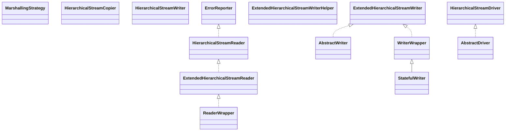

# xstream-1.4.9.jar

[Group index](README.md) | [All archives](../README.md)

## Scope and provenance

- **Donor:** `SQX_145_REFERENCE_ROOT/internal/libs/xstream-1.4.9.jar`.
- **SHA-256:** `381ea035b0e22eb1a02e5c09b60fb93293930516c4c79b43519f97a9ea9cbad3`; accessed 2026-10-06; captured `2026-10-06T18:54:51.906614+00:00`.
- **Classes:** 446 raw entries; 446 unique entry names. Duplicate occurrence indices are zero-based.
- **Inspection:** read-only ZIP hashing and class-file structural parsing; signatures/descriptors, modifiers, hierarchy and references only. Bytecode bodies are hashed, not published.
- **Allocation:** proposed `FEAT-HOST-XSTREAM`, P02; [roadmap](../../sqx-full-application-roadmap.md). Domain README registration remains required.
- **Repository:** `01067f00031428613c6394064ca1bcadc1ba00ee`; review state unreviewed. Download label 145-dev1; installed build/activation and runtime equivalence unverified.
- **Limit:** every class/member is inventoried; declaration coverage does not establish consumed calls, defaults, formulas, failure semantics or algorithm parity.
- **Archive/resource index:** [121.json](../../../evidence/sqx145/archives/145/121.json).

## Complete member declarations

Member shards contain exact JVM names/descriptors, access flags, generic signatures, throws types, declared fields/methods, superclass/interfaces and referenced class names. All classes, nested/synthetic members and overloads are retained. Code length/hash is structural evidence, not a normalized algorithm comparison.

- [001.json](../../../evidence/sqx145/members/121/001.json) — SHA-256 `7d09a655c02bd4a36135764a66fb0c1d45504092901fa721ca787745263c00ee`.
- [002.json](../../../evidence/sqx145/members/121/002.json) — SHA-256 `5eaf3142c6e66a34c976a9a5021e286a0e72bb47d1f52d1d0a427b8ccb1f9a9b`.
- [003.json](../../../evidence/sqx145/members/121/003.json) — SHA-256 `4e75414e3c5af5f314d58a89f14e1f0ee76f5fc6391aebc0926a70875bf46781`.
- [004.json](../../../evidence/sqx145/members/121/004.json) — SHA-256 `167082820180bfdd2df5d5a0112e689e2845368efa7251d7f5a2356e2c68f32a`.
- [005.json](../../../evidence/sqx145/members/121/005.json) — SHA-256 `efe31afa6a2e4a797986a8f04e30c9b434810bd73d271a69b753e5d6ed81b45a`.
- [006.json](../../../evidence/sqx145/members/121/006.json) — SHA-256 `73ea97d3ffc326a2cbfd08ac32fc3cfa4d649a238d598f01d06ef01d05ffaf4e`.

## Focused structural diagram

Up to twelve non-nested classes; arrows show declared inheritance/interfaces only. External type names are not evidence of an available body or an executed dependency.

## Class inventory

| Archive entry | Occurrence | Class SHA-256 | Fields | Methods |
| --- | ---: | --- | ---: | ---: |
| `com/thoughtworks/xstream/MarshallingStrategy.class` | 0 | `45e6f3788453052aa1affa1152123db13a6cd2297ea78ecb9f207de77f2b3978` | 0 | 2 |
| `com/thoughtworks/xstream/io/copy/HierarchicalStreamCopier.class` | 0 | `b65dbec5ef86fb396d59b7f77c98bef4967620fbf7cb526b078ef6ca7e91ca51` | 0 | 2 |
| `com/thoughtworks/xstream/io/WriterWrapper.class` | 0 | `3c572ceb5237778d4127066574596a61049efaa5b0b27164338d203785f7bafd` | 1 | 9 |
| `com/thoughtworks/xstream/io/HierarchicalStreamWriter.class` | 0 | `fb6269946140e11e7f9c6adf607f38de7a55fecf4c68fb5de29fd73437e839fe` | 0 | 7 |
| `com/thoughtworks/xstream/io/ExtendedHierarchicalStreamReader.class` | 0 | `c9d50e64e5e5e26e42f0bebab961b95674b2f6d45525c13bf15b4f5362e3bcbf` | 0 | 1 |
| `com/thoughtworks/xstream/io/HierarchicalStreamDriver.class` | 0 | `d40c3ef0557b9dabe0875e14d6677178df7b61b94d2dfb24eb0768ebd0090b35` | 0 | 6 |
| `com/thoughtworks/xstream/io/AbstractWriter.class` | 0 | `dca9d38b5f1643efc7e2f0ca8442fbca5d71183bcce0dfda0651ec07a46ad641` | 1 | 6 |
| `com/thoughtworks/xstream/io/ExtendedHierarchicalStreamWriterHelper.class` | 0 | `1b1aa735490efaabb88777632e55a868711d7457d3afbb4ba7ac8d6f00fb9114` | 0 | 2 |
| `com/thoughtworks/xstream/io/StatefulWriter.class` | 0 | `aea6ec095f2ab6f19433a02d6bedd45c392e0473a6c5b95dd727b37c18207bb5` | 8 | 13 |
| `com/thoughtworks/xstream/io/HierarchicalStreamReader.class` | 0 | `4d6a49e525f8b462aa2ff7e49ece2cea36469de58071a21132c071dc23a731c0` | 0 | 13 |
| `com/thoughtworks/xstream/io/ReaderWrapper.class` | 0 | `84fcc5bfa29cc291c5b3f5ad77eaaf974106f990714e2007dbc0ef3cdac946ac` | 1 | 15 |
| `com/thoughtworks/xstream/io/AbstractDriver.class` | 0 | `0ba5a9f459a1ba08901ac8f3362f6708345686b4eaec73ddf9fd42d726c6d48e` | 1 | 5 |
| `com/thoughtworks/xstream/io/json/AbstractJsonWriter$Type.class` | 0 | `ca2073ca858d2885de73a0a786e0e1c70f3c4c26cd84b5f9aa822d5740479940` | 4 | 2 |
| `com/thoughtworks/xstream/io/json/AbstractJsonWriter$StackElement.class` | 0 | `9ff09a48554f175c38384fe9c0aa298f093fda35920ceb12a940588e2ce9e4a6` | 2 | 1 |
| `com/thoughtworks/xstream/io/json/AbstractJsonWriter$IllegalWriterStateException.class` | 0 | `54be539862903b427837b1bb472a3a2c69f6a502cb00ca8219c87913b8f15492` | 0 | 2 |
| `com/thoughtworks/xstream/io/json/AbstractJsonWriter.class` | 0 | `048ed13ed1cb97502e5ffcebca3c9e8dc6ff98cdae7924fd42643e822046f4d0` | 18 | 21 |
| `com/thoughtworks/xstream/io/json/JsonWriter$Format.class` | 0 | `3def60373ba627c1cf94f41d0c3da177d3d237e89f6e94d626aff70e3d9b4461` | 6 | 8 |
| `com/thoughtworks/xstream/io/json/JettisonStaxWriter.class` | 0 | `339b9f4fa523a487fdd614829934f624eb72ca710e729fc52a707f2713e135d7` | 1 | 6 |
| `com/thoughtworks/xstream/io/json/JsonWriter.class` | 0 | `684c3a5997fa404cda2bbf8a00f91d7b77d85c7d9ae2c91f63bd75200989dc4b` | 4 | 24 |
| `com/thoughtworks/xstream/io/json/JsonHierarchicalStreamDriver.class` | 0 | `37346b07ddaed4acb132a5488eb0e31bc96fe4cfef51bc93a3a518b74682aa5e` | 0 | 8 |
| `com/thoughtworks/xstream/io/json/JsonHierarchicalStreamWriter.class` | 0 | `e4e7bcf89b9bebd090ac1a2cceb66dd1646349e0af7d04681cf3c1d576f04001` | 0 | 5 |
| `com/thoughtworks/xstream/io/json/JettisonMappedXmlDriver.class` | 0 | `ed3bf2814800f495daa436e2c7b38d39b726f9dcec03d85421e95d06adcbdcc0` | 4 | 9 |
| `com/thoughtworks/xstream/io/xml/JDomDriver.class` | 0 | `e0309797a5dd7d9e9469ae7e86b414e963f18206fe1ff0de93ef9371cefe1ed9` | 0 | 10 |
| `com/thoughtworks/xstream/io/xml/DocumentReader.class` | 0 | `0dbb7372fc9d697b7fc586cc84044fe848a889c11968122376a6e566a47e9ee0` | 0 | 1 |
| `com/thoughtworks/xstream/io/xml/StaxReader.class` | 0 | `e5e7f8bf16eec533844343aa2cb80fb430cac8dd546d7b02624e9b0e5149ae6c` | 2 | 12 |
| `com/thoughtworks/xstream/io/xml/SaxWriter.class` | 0 | `184c9f588c4889581959b6f07b30142c4db25b636151ce7a2aa4c86a5a5c2e7d` | 14 | 30 |
| `com/thoughtworks/xstream/io/xml/KXml2Driver.class` | 0 | `06778091681dd2ae5926381419ccb71c5b32badc5aa56a695afbba87f4509100` | 0 | 3 |
| `com/thoughtworks/xstream/io/xml/AbstractXmlDriver.class` | 0 | `4418cded9b636cb88c3f6330d0a6a0fd6a66179529d64653e1da8fd22c1362b8` | 0 | 4 |
| `com/thoughtworks/xstream/io/xml/JDomReader.class` | 0 | `32623e147e60e59624e26a2757fffb853f6cf468d9733d8718169c99080a742f` | 1 | 17 |
| `com/thoughtworks/xstream/io/xml/AbstractXppDomDriver.class` | 0 | `99107f933f23a28c38557a06da016d0e06d9720eae40261262f2bc10e77c9c89` | 0 | 6 |
| `com/thoughtworks/xstream/io/xml/AbstractXmlReader.class` | 0 | `09e52b01db22b4461bffde8a4b298e03f0148e7037dbe27a0b7235acd2db483c` | 0 | 5 |
| `com/thoughtworks/xstream/io/xml/XmlFriendlyNameCoder.class` | 0 | `92630ab1c4c6f576157cd683b2346bb11311e6d58f44436c6d0bab1997e47355` | 7 | 16 |
| `com/thoughtworks/xstream/io/xml/Dom4JWriter.class` | 0 | `aa33ce828fb1be866eaf05e83c05bcf2e28ec15a02455af697783a3218d8d48d` | 1 | 13 |
| `com/thoughtworks/xstream/io/xml/JDomWriter.class` | 0 | `1e3dd09266cb4f874d3d0dbe0c88b812e75352406d1026e0cfdc38a437d5a738` | 1 | 14 |
| `com/thoughtworks/xstream/io/xml/XomWriter.class` | 0 | `793721c83a10c8b3f0db9eda3792f87768f287bdd94a49c98e14ae53df2983a7` | 0 | 8 |
| `com/thoughtworks/xstream/io/xml/AbstractDocumentReader$Pointer.class` | 0 | `3fbc18bbc6ad746698ec2c2e23bc8494bff1ab47f45da84105f1bc3e1f2fabcd` | 1 | 2 |
| `com/thoughtworks/xstream/io/xml/JDom2Driver.class` | 0 | `c5e8e4c8f98bc86e3c44b7bb9d784859c7a4b4e5bcc68d04bf8903b667a49986` | 0 | 9 |
| `com/thoughtworks/xstream/io/xml/XmlFriendlyNameCoder$IntPair.class` | 0 | `d8e7351066db4e4d08f36c5a4da39abdef92eff8e313b94319d574f6afee57ce` | 2 | 1 |
| `com/thoughtworks/xstream/io/xml/QNameMap.class` | 0 | `6b6a3f921f1d1374bd2b97e30f244a09738e95221c243a8d27a6ffbe4450b597` | 4 | 9 |
| `com/thoughtworks/xstream/io/xml/XmlFriendlyWriter.class` | 0 | `72a57310702b49d09a337cb28d4f62cb81ea75d19c6194528266af80c42983cb` | 0 | 1 |
| `com/thoughtworks/xstream/io/xml/StandardStaxDriver.class` | 0 | `7371de8677ccd5bf07e16c9685ff50750c82be9067814320fe3ea5f18084f4a6` | 0 | 8 |
| `com/thoughtworks/xstream/io/xml/Dom4JDriver$1.class` | 0 | `73b6d57ee63997ab5984d7c99e500208ce1800368c956f7b55784e317635ad20` | 2 | 2 |
| `com/thoughtworks/xstream/io/xml/XppReader.class` | 0 | `e7a3b56341f0f2863c9aad85ac7ecc598969210cb3d5aba527b7058c58886fed` | 2 | 14 |
| `com/thoughtworks/xstream/io/xml/AbstractDocumentWriter.class` | 0 | `cbced780f6c33cf6305a0d066de34767345ed4ae5f57a7a2378758b361b233c5` | 2 | 10 |
| `com/thoughtworks/xstream/io/xml/XppDomWriter.class` | 0 | `c2ef869a837701290b39dfb9602cd208d22ba9318a788e47a91a21eccd139d11` | 0 | 11 |
| `com/thoughtworks/xstream/io/xml/StaxWriter.class` | 0 | `d80a1ec50f1ec41cf602cb52b510328fa7cc3e7cf2edb8761035a371b48547b6` | 5 | 14 |
| `com/thoughtworks/xstream/io/xml/StaxDriver$2.class` | 0 | `fbb958ce1c411781543b911730a10e40b9a963349a88d2fb0910caeb984367b0` | 2 | 2 |
| `com/thoughtworks/xstream/io/xml/BEAStaxDriver.class` | 0 | `4964c78e89a0fd3a0579642b085ca612d85cbf67f929fa581d2e3ca263d1bf85` | 0 | 8 |
| `com/thoughtworks/xstream/io/xml/XStream11XmlFriendlyReplacer.class` | 0 | `bdf2c7e33672403dc15d22c303175817f28ad5ab8e1f61434bb5e3d125810ef4` | 0 | 4 |
| `com/thoughtworks/xstream/io/xml/StaxDriver.class` | 0 | `1a1062aeba797b785655060eb054776a7697ab4bc2e03a42d855cce1aa7b7a6e` | 3 | 26 |
| `com/thoughtworks/xstream/io/xml/XmlFriendlyReader.class` | 0 | `499c1d2f3427d978bde720d7f822434bf52ccc4bc6e43161a0934f57153e8666` | 0 | 1 |
| `com/thoughtworks/xstream/io/xml/XppDriver.class` | 0 | `dc0e27330e0f64fd10ab6fe447ce9e4ad422af7034b68dfcb400bafb88fc6029` | 1 | 4 |
| `com/thoughtworks/xstream/io/xml/Xpp3DomDriver.class` | 0 | `f06f0fd383d88108a1a81a655b657a38ef2eef3f2edf8a69f3d064350098889a` | 0 | 3 |
| `com/thoughtworks/xstream/io/xml/DocumentWriter.class` | 0 | `89f9b2823c0545807b1f7db901e004f0672270b3149b5f8332b2793ec818a84b` | 0 | 1 |
| `com/thoughtworks/xstream/io/xml/SjsxpDriver.class` | 0 | `42e8920eea6ac4b312d2056843f63e58d17967a27b34e41482d287678b118c3e` | 0 | 6 |
| `com/thoughtworks/xstream/io/xml/CompactWriter.class` | 0 | `cfa172cddfde11cb586dc5d9ee2f13e985bcb1fe6297875b06b91d2faaf40b5a` | 0 | 7 |
| `com/thoughtworks/xstream/io/xml/XppDomReader.class` | 0 | `31d8913de3c97372acb55a1b289866c49dbd043356dacba888ad94b32cef72d7` | 1 | 14 |
| `com/thoughtworks/xstream/io/xml/Xpp3Driver.class` | 0 | `064bdc6641d07c7cf70d5204c54f0ef91a39bdbf1861964df0118bdd0d7f6704` | 0 | 3 |
| `com/thoughtworks/xstream/io/xml/JDom2Reader.class` | 0 | `ef81698405ed1d83ab7f7ea862337ef2f6c00bd4a2db0b2ead40b9c3faf79e69` | 1 | 15 |
| `com/thoughtworks/xstream/io/xml/Dom4JDriver.class` | 0 | `ff99ba3e90034546b45c764d8afc59c899f5d8f6438e7e6deafd4896ed749aa3` | 2 | 16 |
| `com/thoughtworks/xstream/io/xml/AbstractDocumentReader.class` | 0 | `9ddcad5db667fbfd0e6aea9b2598be9c1ed4f6a121f2b0e85f540b208df386f8` | 2 | 14 |
| `com/thoughtworks/xstream/io/xml/PrettyPrintWriter.class` | 0 | `a92e38691278482dc8d20c81a1cdadd51288b5fbb3f986cdb082f0429632b40d` | 20 | 30 |
| `com/thoughtworks/xstream/io/xml/DomReader.class` | 0 | `6dd723a4177e7f5ac68b09d0e172d2e760600001fe5942dc2939a4cc6cd74efe` | 3 | 17 |
| `com/thoughtworks/xstream/io/xml/DomWriter.class` | 0 | `3fe9465d29d6a945b629195b71776fa7b0846a36d460a40a6623fd1303651b23` | 2 | 12 |
| `com/thoughtworks/xstream/io/xml/XomReader.class` | 0 | `586c019cfffe4d3da43f84da2834daed67862806f10c611c262f5d7afdc99409` | 1 | 17 |
| `com/thoughtworks/xstream/io/xml/AbstractXmlWriter.class` | 0 | `5da5b76851e959ef10ca03418c2eb0c1c7574c9079913db69d61439a30140b27` | 0 | 4 |
| `com/thoughtworks/xstream/io/xml/XmlFriendlyReplacer.class` | 0 | `44a8a3c094b133be05fc7a9461b3ce09fe2eecd50a8f8d488c19e09e5ca93022` | 0 | 4 |
| `com/thoughtworks/xstream/io/xml/XomDriver.class` | 0 | `a375d66ac2c44071430cc76af29dffe0c505a85c8c85b88ca51bd72858d0e81e` | 1 | 14 |
| `com/thoughtworks/xstream/io/xml/AbstractPullReader$1.class` | 0 | `8bee1b1fc6aec4a37cbc9d0677ffd1bbc2c84bcb926e25f30fe7d73ce51f50ed` | 0 | 0 |
| `com/thoughtworks/xstream/io/xml/XmlFriendlyNameCoder$1IntPairList.class` | 0 | `0b20fc81a3b5f76d56ae5f2f259d315b646f94f4ee4b8c327ac4718459e2f514` | 0 | 3 |
| `com/thoughtworks/xstream/io/xml/AbstractDocumentReader$1.class` | 0 | `86ba85771c1281e33d520854db0533b36d7511562434ac57b37ebad552009e74` | 0 | 0 |
| `com/thoughtworks/xstream/io/xml/XStream11NameCoder.class` | 0 | `dd367fefa3414eb99dd4fa7dfb041fecdfa5c0698d937e8b2f111a018b737e57` | 0 | 3 |
| `com/thoughtworks/xstream/io/xml/JDom2Writer.class` | 0 | `297c20c7ca9285f2a113cbb9a60931a74254ad19b2afb6708920aac137322307` | 1 | 11 |
| `com/thoughtworks/xstream/io/xml/XppDomDriver.class` | 0 | `cce704c0486d9ab816bc1c4a82711760cfe19fe580ba83702314293cf4f9d665` | 1 | 4 |
| `com/thoughtworks/xstream/io/xml/Dom4JReader.class` | 0 | `da8fe6a2c45f62c7396bf98548e69696dea856555f56dc9c9dd618568f8a5a32` | 1 | 18 |
| `com/thoughtworks/xstream/io/xml/AbstractXppDriver.class` | 0 | `ea36c070afa332b5d169571582a92913c1796bd1f87494d01bbafd7da3a4fce7` | 0 | 6 |
| `com/thoughtworks/xstream/io/xml/AbstractPullReader$Event.class` | 0 | `e9ac626a71dc9b0b343880d0ccb40fa04f3811f5d73c4168866a4e4927a1dd30` | 2 | 2 |
| `com/thoughtworks/xstream/io/xml/TraxSource.class` | 0 | `470d864d16064fbe1943905e693a1af60e5fbe1e460a379adeb31d1f8c756c05` | 4 | 13 |
| `com/thoughtworks/xstream/io/xml/KXml2DomDriver.class` | 0 | `61c8d955fe047a39c1908b4672f75ab26105a4448b1fc689ec7565c3012c4764` | 0 | 3 |
| `com/thoughtworks/xstream/io/xml/StaxDriver$1.class` | 0 | `97701bc0039a9a3930a8bf9b075d37577ed8feb67cbb07101af436a0b187c499` | 2 | 2 |
| `com/thoughtworks/xstream/io/xml/WstxDriver.class` | 0 | `de529c1394146bd1eafa182e8e974f6fb2c3c1d2fb95b03ad65f6ba40ef42aaf` | 0 | 8 |
| `com/thoughtworks/xstream/io/xml/DomDriver.class` | 0 | `4266063ab896568e9aae1770537b1dc41daeec4d13fc4ea62d4fca9ca7705e6b` | 2 | 12 |
| `com/thoughtworks/xstream/io/xml/Dom4JXmlWriter.class` | 0 | `45d1f92f84fc4a27aa9df689bcc45691c61810f76a0259af111467a6dd3ad899` | 5 | 10 |
| `com/thoughtworks/xstream/io/xml/AbstractPullReader.class` | 0 | `bf5303ceadf7f057c91d1fdcf939e95432786656e9730fc5d8864a398c0f5534` | 10 | 17 |
| `com/thoughtworks/xstream/io/xml/xppdom/XppDom.class` | 0 | `5934e799d66d836ec43503f05a4708be9af0a5a04e9a9d8ce828bec739e8988a` | 7 | 17 |
| `com/thoughtworks/xstream/io/xml/xppdom/Xpp3DomBuilder.class` | 0 | `f6d3a8370188fcc4e07523b03995e123055463bf46e885bd179fb820343e7eab` | 0 | 2 |
| `com/thoughtworks/xstream/io/xml/xppdom/XppFactory.class` | 0 | `3032b151843e01d36392e0dbb5815825d29ce430be4a681b7f42ce19e79b4b75` | 0 | 5 |
| `com/thoughtworks/xstream/io/xml/xppdom/XppDomComparator.class` | 0 | `ee35fcbe15ffbf94d0a3c71d65254924d8b92078089ba4cd57935bb0610d5c56` | 1 | 4 |
| `com/thoughtworks/xstream/io/xml/xppdom/Xpp3Dom.class` | 0 | `a4cbe593f9cd30ebaa1118f542c6d5ae3d48023a6150b1c7df1069a6b19bd292` | 0 | 1 |
| `com/thoughtworks/xstream/io/naming/NoNameCoder.class` | 0 | `1de867b11cdf38d52be082b42855d43c3d5ceb0939e1e10c91006e2a442afcda` | 0 | 5 |
| `com/thoughtworks/xstream/io/naming/NameCoder.class` | 0 | `7f8b3631d3b9d590dc78d75fdd014f1ed49e02f1a3ea74bddc12ad658505052a` | 0 | 4 |
| `com/thoughtworks/xstream/io/naming/NameCoderWrapper.class` | 0 | `4bf486d9f0c7e9ce5c8fd3a157bdfca6956c62e59b95c74371b8a4fe579f6581` | 1 | 5 |
| `com/thoughtworks/xstream/io/naming/StaticNameCoder.class` | 0 | `4bb800e23f7c5df3ae6d564d2498b49a707a13aa25aaaaf338a8720e3c2e1948` | 4 | 7 |
| `com/thoughtworks/xstream/io/ExtendedHierarchicalStreamWriter.class` | 0 | `816461e76ef30d22ff7e194e2b745aeb67358a5aa60e2d4110cfce802b5662a4` | 0 | 1 |
| `com/thoughtworks/xstream/io/binary/BinaryStreamWriter$1.class` | 0 | `f85ee7c643bf7b3064482366467b1e65d1c0cbe4215053b2d3004b4d49d85bcd` | 0 | 0 |
| `com/thoughtworks/xstream/io/binary/Token$StartNode.class` | 0 | `a5f845f4d1a69cea07b62307a8d7a9e184e52ce8f53fe8347a50c75219746073` | 0 | 4 |
| `com/thoughtworks/xstream/io/binary/ReaderDepthState$1.class` | 0 | `446faa9f49643ea329b3c0c9c99ff443707f814f7d1cb036031906a796999f03` | 2 | 4 |
| `com/thoughtworks/xstream/io/binary/BinaryStreamDriver.class` | 0 | `202a00042a7b35ef7f5df974988a98627cbe05ee715053a3bf035971f7f2a0f3` | 0 | 5 |
| `com/thoughtworks/xstream/io/binary/ReaderDepthState.class` | 0 | `4740bb1c3e8865fb584dbbe175764802748ddb848e0ea54611facb884eab5e32` | 2 | 15 |
| `com/thoughtworks/xstream/io/binary/ReaderDepthState$State.class` | 0 | `046a5ed4d513f94f629de4cd089c63c22e01c2aa63e8903549cd41443ef9e15d` | 5 | 2 |
| `com/thoughtworks/xstream/io/binary/Token$MapIdToValue.class` | 0 | `8cba3942471d90a6bc204ae77750b32acc8586ebe9a25e2c4a060f02bb40824e` | 0 | 4 |
| `com/thoughtworks/xstream/io/binary/Token.class` | 0 | `cd3714563d9439ab336aa6fd538ff9bd95c2d021715320e011d024cd948596e0` | 17 | 13 |
| `com/thoughtworks/xstream/io/binary/BinaryStreamWriter.class` | 0 | `2c5420b3928943c90d2aa20411743996d0038b368305e60d6b3b2406ccf5256f` | 3 | 11 |
| `com/thoughtworks/xstream/io/binary/ReaderDepthState$Attribute.class` | 0 | `27e72d491c2f206b7163242eb1f68c809f9bb555302a4d3f22e086e1b6646270` | 2 | 2 |
| `com/thoughtworks/xstream/io/binary/BinaryStreamReader$IdRegistry.class` | 0 | `7244d28169a5689eb0afac90a64dd637f3cb7b354f41e6050faee41c966bcc5c` | 1 | 4 |
| `com/thoughtworks/xstream/io/binary/BinaryStreamReader.class` | 0 | `38af44f0cb19831f2887d0314967a429a516cc6c8da164c6e1ff349d0df77852` | 5 | 17 |
| `com/thoughtworks/xstream/io/binary/Token$Value.class` | 0 | `6248aaa452ba367688e8c018c74f92cf7a2203eef69fb6d734cc4ba102152cf0` | 0 | 4 |
| `com/thoughtworks/xstream/io/binary/BinaryStreamWriter$IdRegistry.class` | 0 | `582c8310225df4fc188d3039383452608b1b9db106afbb7f8c7d8efd78763b4a` | 3 | 3 |
| `com/thoughtworks/xstream/io/binary/Token$EndNode.class` | 0 | `731b62fe1485f22a2cce3d63b85899eb19b132e8f92d27071cecb07b636ce82f` | 0 | 3 |
| `com/thoughtworks/xstream/io/binary/Token$Formatter.class` | 0 | `ce4c6e6dcddffc2e26ff18393eaecfb215287b09f37134039700b091590cc4dc` | 0 | 4 |
| `com/thoughtworks/xstream/io/binary/Token$Attribute.class` | 0 | `83c68fb7be1b94fd6b5dffa02e42828dfdeaa749f9cbc7a75dca7526ce94bbd8` | 0 | 4 |
| `com/thoughtworks/xstream/io/binary/BinaryStreamReader$1.class` | 0 | `caa230627aade1b13295ca2b26df4c7e83cc250e0d7ad306ecfdb11a2cc48e6d` | 0 | 0 |
| `com/thoughtworks/xstream/io/StreamException.class` | 0 | `c2fbbae12cd56ceed533641785f3fba16bcaa9f19e3534cc0161ac11834b0831` | 0 | 3 |
| `com/thoughtworks/xstream/io/path/PathTracker.class` | 0 | `728149c6b0f0326ab9b9798507ce9e43cf09c57376fc5dbc5ebeb0634b4a261a` | 5 | 9 |
| `com/thoughtworks/xstream/io/path/PathTrackingReader.class` | 0 | `dce9eb3ae289b080400625af0ab42cda6ed0bfdc51db1bda27ec382f060e96cc` | 1 | 4 |
| `com/thoughtworks/xstream/io/path/Path.class` | 0 | `8b0042fe535d7c0bbbcde14a45e2e45e1e67ad4060225cbe5dd9fb04e61a4b44` | 4 | 12 |
| `com/thoughtworks/xstream/io/path/PathTrackingWriter.class` | 0 | `13631ec4c16e3ca6cc8a60e157b108734826fe30bc2b1fb5a3af1595c8df012f` | 2 | 4 |
| `com/thoughtworks/xstream/io/AbstractReader.class` | 0 | `34075f7a84ddd9bcca64cc3ed957c33ce88fdde407931f568e1fd990fce2412f` | 1 | 8 |
| `com/thoughtworks/xstream/io/AttributeNameIterator.class` | 0 | `0161e089e28aa7a3ef5458fc288131b33d9ad02dcf4b21a0960b24d6b0286965` | 3 | 4 |
| `com/thoughtworks/xstream/core/AbstractTreeMarshallingStrategy.class` | 0 | `8039808f993d5504a7cf7ded05fb42cc1093d5e09aabee4debf02f2a634c848b` | 0 | 5 |
| `com/thoughtworks/xstream/core/ReferenceByIdMarshallingStrategy.class` | 0 | `680a30ac4f097c8b40d90b990646f0b71409061b724b7a7c59ec8571778c220f` | 0 | 3 |
| `com/thoughtworks/xstream/core/AbstractReferenceMarshaller$Id.class` | 0 | `29786f9343af86d689057a4e37ebe0dbac585682a6aee31b72b9a6dda4adb1bb` | 2 | 3 |
| `com/thoughtworks/xstream/core/SequenceGenerator.class` | 0 | `2116446afe63b36aea793a3caa0d214aa66ce93bce9878e0ce3cfdbcda12ab8b` | 1 | 2 |
| `com/thoughtworks/xstream/core/ReferenceByIdMarshaller.class` | 0 | `1c784f35651a53445b7cf19a1041ac40c9cdc7154f03af944ac2dd5cac48a017` | 1 | 5 |
| `com/thoughtworks/xstream/core/ReferenceByXPathUnmarshaller.class` | 0 | `fcb8a39d5237b7e8930201f5a55c6736f4fa88bf7e8fd7533532eb0dfc8f7e6b` | 2 | 3 |
| `com/thoughtworks/xstream/core/ReferenceByXPathMarshallingStrategy.class` | 0 | `57350f05a41015276acbba67e4501ce2aa8dfbeda79c1c0ce10742aa1a305668` | 4 | 4 |
| `com/thoughtworks/xstream/core/util/CompositeClassLoader$1.class` | 0 | `3bee99160dbcbc7344288527555d528d194bc6b416f7b7a855324204661176b1` | 1 | 3 |
| `com/thoughtworks/xstream/core/util/SerializationMembers$1.class` | 0 | `caa21a49be88dcda74c17112c4a25825f030e4f3914bc2b1eb342db644225b6b` | 0 | 2 |
| `com/thoughtworks/xstream/core/util/FastStack.class` | 0 | `b369dd67c1e8b54b2599e7ccf3a91672029852c5af105264adfc7493dd888814` | 2 | 12 |
| `com/thoughtworks/xstream/core/util/PresortedSet.class` | 0 | `14d3de54174bf273af43e04dea7af9a9d7a7c184eeb06b216db4098865e6275a` | 2 | 25 |
| `com/thoughtworks/xstream/core/util/WeakCache$2.class` | 0 | `c953bbdf4dceb2168fcc1a01ebdb664ac30cca8aafc8f35acfe6e8d776f88db1` | 2 | 2 |
| `com/thoughtworks/xstream/core/util/Cloneables.class` | 0 | `62f3e16074dfb5013dd86a3228399bdc59a8789e0b01c8f3e98c0b6e2beb3901` | 0 | 3 |
| `com/thoughtworks/xstream/core/util/ObjectIdDictionary.class` | 0 | `97eabdbbc4ea616deba8a6cac247723cce18d351a51188281072b8d89d26f95d` | 2 | 8 |
| `com/thoughtworks/xstream/core/util/OrderRetainingMap$1.class` | 0 | `92ffb276c2c60ed9f767fa3b1a50ce1ec7b9ebf6129c50c1e09617f163c3a959` | 0 | 0 |
| `com/thoughtworks/xstream/core/util/ClassLoaderReference$Replacement.class` | 0 | `4d660181220862174bda5dc7bee30b7a35be50b6482e7fcb8a226b06ddf56014` | 0 | 2 |
| `com/thoughtworks/xstream/core/util/ThreadSafeSimpleDateFormat$1.class` | 0 | `f757263248da05db21686c87fdb37c2469119f86cd399bbdeab274442dc46c50` | 3 | 2 |
| `com/thoughtworks/xstream/core/util/WeakCache$4.class` | 0 | `49d20ab949e7d102251e1b7a51cb12f8a44a02e6e6e564b921b6c2c0cfa296ec` | 2 | 2 |
| `com/thoughtworks/xstream/core/util/ObjectIdDictionary$IdWrapper.class` | 0 | `36cd3db17fb68b0550624eabda17e38e21240ba043e72b6c89419e08a6c51b21` | 2 | 5 |
| `com/thoughtworks/xstream/core/util/Pool.class` | 0 | `97ecbfa744f258c16831d5dd0a53fc0c2b55f43c183d8be621669c9e72e03314` | 6 | 4 |
| `com/thoughtworks/xstream/core/util/PresortedMap.class` | 0 | `24f811a39c264088c2c7d8a64e457fa0434a017f172e31ee062e8599392fdd32` | 2 | 21 |
| `com/thoughtworks/xstream/core/util/HierarchicalStreams.class` | 0 | `14b4c1607ac956b0d3ebe4905a917d86df845236ee6a664acbad7445a4f115e8` | 0 | 3 |
| `com/thoughtworks/xstream/core/util/ObjectIdDictionary$WeakIdWrapper.class` | 0 | `a1c8887f6ad13dd7fb1ceef9851ef7da3b558c1cb8669a1e32c7667070c611f1` | 2 | 4 |
| `com/thoughtworks/xstream/core/util/PrioritizedList.class` | 0 | `0ce97501c275b72f46e40bb3a73143d2181fe625e5a042a441a16e1e00d69704` | 3 | 3 |
| `com/thoughtworks/xstream/core/util/ThreadSafeSimpleDateFormat.class` | 0 | `5058513c83233b7618c9b1c25c1ebb46b836aebfda55b52c415605ffaa82ebd2` | 3 | 7 |
| `com/thoughtworks/xstream/core/util/Fields.class` | 0 | `ca5d9541fb2f47bbe5ee103cdd2c47433bbc620985d0d0cab0521756e1ac4274` | 0 | 6 |
| `com/thoughtworks/xstream/core/util/PrioritizedList$PrioritizedItem.class` | 0 | `e0f0e61c66d296b483fe6fa959eedac01aaec6cbbc0e5fe9a473c3d315c9d4f0` | 3 | 3 |
| `com/thoughtworks/xstream/core/util/WeakCache$3.class` | 0 | `eff5660912d5a358cdd46420e94b10fd617a549b1a8b188b9502e2fc44c8facd` | 2 | 2 |
| `com/thoughtworks/xstream/core/util/PresortedMap$ArraySetComparator.class` | 0 | `7f543d987788ea94187e59254ba648aaa740394081dd7bfec44bfe574f3307b8` | 2 | 2 |
| `com/thoughtworks/xstream/core/util/ThreadSafePropertyEditor$1.class` | 0 | `1fd4248ae58d63eddd8de4687aadd0e3653f8157504f17f763050ba9e71e4a7c` | 1 | 2 |
| `com/thoughtworks/xstream/core/util/FastField.class` | 0 | `ffa5e13d49eb69540b2d820d07af2dd0d765e4dc79426db4752a46654d1b39b3` | 2 | 7 |
| `com/thoughtworks/xstream/core/util/PresortedMap$1.class` | 0 | `cd134cb2c8cbeab587f416606342b8fbe7d08b23c4461d92fa44ba8d39a56b46` | 3 | 4 |
| `com/thoughtworks/xstream/core/util/CustomObjectInputStream.class` | 0 | `03b31afdf0b13177b69e5e0a0e72d4ff24139833325d5d69ba650146e36adeac` | 3 | 39 |
| `com/thoughtworks/xstream/core/util/CustomObjectInputStream$StreamCallback.class` | 0 | `baf0722911e3b0fb5bf229d288ebbdde0e7bdcc137175a0cd8b84324683242cd` | 0 | 5 |
| `com/thoughtworks/xstream/core/util/CustomObjectOutputStream.class` | 0 | `df39cf33cb7ee200991b828a3dd3d2ef756e3bd44d53ae06795828f9bf1bb665` | 3 | 29 |
| `com/thoughtworks/xstream/core/util/OrderRetainingMap$ArraySet.class` | 0 | `664110accd360d1fe6c949648ae5afff3c83a430ad17a67c5f6a1d5487ad1d20` | 0 | 2 |
| `com/thoughtworks/xstream/core/util/ObjectIdDictionary$Wrapper.class` | 0 | `e0a2b89f6f928e5c81f3523e14b6b33eeab5ee7fbb65f5ae96bc9b061b2782e7` | 0 | 4 |
| `com/thoughtworks/xstream/core/util/CustomObjectInputStream$CustomGetField.class` | 0 | `41a9e9557449a1157e77a8851885d3ab607c79d1b818da16deaaf01c5a7b6a33` | 2 | 13 |
| `com/thoughtworks/xstream/core/util/Types.class` | 0 | `eb9145b6862a0af4ca4da2de9ae9b22558eb6ef4f1c8c93ca23b375b1b8d39c8` | 1 | 3 |
| `com/thoughtworks/xstream/core/util/CustomObjectOutputStream$1.class` | 0 | `7596461a29a498f065383def011e12e53f1148ca3b0e6a9087f83ff4fef09682` | 0 | 0 |
| `com/thoughtworks/xstream/core/util/SelfStreamingInstanceChecker.class` | 0 | `a3ede8c2c17448a31505cfd92dbb86c559cb403077e7c6c9bcd42ca9272f746f` | 3 | 6 |
| `com/thoughtworks/xstream/core/util/PresortedMap$ArraySet.class` | 0 | `6b507ec6790b2e16ab7c3fca525bcf6b46e098710478f15703da511c3e5247cb` | 0 | 2 |
| `com/thoughtworks/xstream/core/util/WeakCache.class` | 0 | `5b32e1864805f5f0a83b3f69fd9043fd3eb343919a71adb04aa1336646f44111` | 1 | 17 |
| `com/thoughtworks/xstream/core/util/CompositeClassLoader.class` | 0 | `6439448e1039587cc14b5468cc8bfd909c5fde4c1f48f2e6de15aa8880390788` | 2 | 6 |
| `com/thoughtworks/xstream/core/util/DependencyInjectionFactory$TypedValue.class` | 0 | `d406a2143c91d79d1c7114d10c3490dce68e3da4b021e318b6ac57d350f11c2f` | 2 | 2 |
| `com/thoughtworks/xstream/core/util/SerializationMembers.class` | 0 | `67d44d89b10df4d9ebd49b7ebcf99fac1b5e80f5d346bec261602eaaf65211a4` | 9 | 13 |
| `com/thoughtworks/xstream/core/util/Primitives.class` | 0 | `1e4041753c0cea71810dff541c414004e33cbcce2cb943b284c9d0403a1d5262` | 4 | 7 |
| `com/thoughtworks/xstream/core/util/XmlHeaderAwareReader.class` | 0 | `6542f8795616ef2d6584a816fc2eedd6ee16ac637e8918e5f9ed6cdaa6db9148` | 10 | 16 |
| `com/thoughtworks/xstream/core/util/WeakCache$1.class` | 0 | `395cebe1f175a81bdc2cc25f201c412c4cdc4de38b085d8cd0a4baa8f5239205` | 2 | 2 |
| `com/thoughtworks/xstream/core/util/DependencyInjectionFactory$1.class` | 0 | `84a7072d2dae33b9d89dc4fa1365e92bca8df36fe81216f4932a4a3bb5d1b22a` | 0 | 2 |
| `com/thoughtworks/xstream/core/util/Base64Encoder.class` | 0 | `8aebf2bb1b5c7de0e69e84698db2cacfc3eb58941a56ca585da0bead210fd35d` | 2 | 5 |
| `com/thoughtworks/xstream/core/util/OrderRetainingMap.class` | 0 | `d5d4c17d70ba4b9144e845f1832ae48112b335922bc52cc353576fb0604f8a45` | 2 | 9 |
| `com/thoughtworks/xstream/core/util/ThreadSafePropertyEditor.class` | 0 | `2491cca272a2731b00b64f1088d10f81d3cbb6fdab4fb39708ebc15de940204e` | 2 | 5 |
| `com/thoughtworks/xstream/core/util/ClassLoaderReference.class` | 0 | `3395a5219b76daeedbb4dbf93c0d8e60518d2938552c42995e9f6532604e76df` | 1 | 5 |
| `com/thoughtworks/xstream/core/util/DependencyInjectionFactory.class` | 0 | `4fab0f87305d0671c9fcf37181142ff3d6f0394785aee5b2d2cf9d09ab588263` | 0 | 3 |
| `com/thoughtworks/xstream/core/util/WeakCache$4$1.class` | 0 | `401231a1ff5a6af7a073a4fffa01d256d3574ca378d5c801c77dd10fedb8e7a0` | 2 | 4 |
| `com/thoughtworks/xstream/core/util/ArrayIterator.class` | 0 | `fc6dbdb742c7a26d4f3cc5240cdebf8cba4ba421d66f2e22f2133ca3f7ae779c` | 3 | 4 |
| `com/thoughtworks/xstream/core/util/CustomObjectOutputStream$StreamCallback.class` | 0 | `5ca66bdeca5086c46eb4420ffb80b6fe2b1e26e3e8e2d4a9350e5ee464a72cb6` | 0 | 5 |
| `com/thoughtworks/xstream/core/util/CustomObjectOutputStream$CustomPutField.class` | 0 | `49d628df8ece48793527b5a4e54de0774603cad0791c219c753aeed92b230795` | 2 | 13 |
| `com/thoughtworks/xstream/core/util/QuickWriter.class` | 0 | `3362271aa63df5603be0d328d99b0c203a7e2897c481bd53f5bb425ef1127868` | 3 | 9 |
| `com/thoughtworks/xstream/core/util/WeakCache$Visitor.class` | 0 | `5a68c23863c7de9010d93168d7c2778eb9c6074e072fa843997fed3062649fd8` | 0 | 1 |
| `com/thoughtworks/xstream/core/util/Pool$Factory.class` | 0 | `7b80820e9e3004b4ab1c7e2c80edba6365fd3feca432e1e1013f751efb194e18` | 0 | 1 |
| `com/thoughtworks/xstream/core/util/TypedNull.class` | 0 | `797eae793c714fe49d1dda932289854d0fe1b1f933d13f65311153e4fa499827` | 1 | 2 |
| `com/thoughtworks/xstream/core/util/PrioritizedList$PrioritizedItemIterator.class` | 0 | `6e16253d1f233d274e9d54e6ad27f1fb8371fbfc94bda9f6b53edd67892e592c` | 1 | 4 |
| `com/thoughtworks/xstream/core/ReferenceByIdUnmarshaller.class` | 0 | `df021584e3f34d6e16da16de21b8ba5d35ae2375604ede54e00640f2133a533d` | 0 | 3 |
| `com/thoughtworks/xstream/core/AbstractReferenceMarshaller.class` | 0 | `82d5e2caae723f91718c10f416c68a26076b06dff2e29689221e2a4e8ca386f2` | 4 | 8 |
| `com/thoughtworks/xstream/core/ReferencingMarshallingContext.class` | 0 | `34d6c5e2091ab0a8a2d7ca112e215080f674931068599577d447829589810886` | 0 | 4 |
| `com/thoughtworks/xstream/core/AbstractReferenceMarshaller$1.class` | 0 | `bea7f6fb19f88c218234de02f9ea5f11a5306f4148a01f75c9a55a1d3dabed74` | 3 | 10 |
| `com/thoughtworks/xstream/core/AbstractReferenceUnmarshaller.class` | 0 | `5a42cb859c35396da6229f36e8d46d2b7d694b21a1729ae7b179b4c832aab776` | 3 | 5 |
| `com/thoughtworks/xstream/core/TreeMarshaller$CircularReferenceException.class` | 0 | `c700f67966a0d705bcbe563d75253a1387fee7c8ff267ea419a831bcf96d1677` | 0 | 1 |
| `com/thoughtworks/xstream/core/ReferenceByXPathMarshaller.class` | 0 | `4aca88650149031424478766a7190b3b9ed385047e0e1fe2b461f47ee465f8a7` | 1 | 4 |
| `com/thoughtworks/xstream/core/MapBackedDataHolder.class` | 0 | `ea912a7ce332b3e9ae6fa8b33990ab085b4ffed1bc87a6bced2a47261c8d191f` | 1 | 5 |
| `com/thoughtworks/xstream/core/TreeMarshallingStrategy.class` | 0 | `69c6a837a58c9e7a91096678cc89e3909a2c75a273b0393495879bb55505319f` | 0 | 3 |
| `com/thoughtworks/xstream/core/JVM$1.class` | 0 | `59a3cc1163135ef2d136d1502ef254ed62ef0b6430e9b45c157786de5d3e18b2` | 0 | 2 |
| `com/thoughtworks/xstream/core/TreeUnmarshaller.class` | 0 | `99f33a4ef7ae226d9cdc41115ccc76c560748398f01a72e4b8193f8e9f1dcbd2` | 7 | 14 |
| `com/thoughtworks/xstream/core/AbstractReferenceMarshaller$ReferencedImplicitElementException.class` | 0 | `51ac05a95038582abe75a8e75bdfb8a753a0618cafdb71f26ea40e6e6106b38b` | 0 | 1 |
| `com/thoughtworks/xstream/core/TreeMarshaller.class` | 0 | `7cdd135eb6d6a7f9b28dad608fc5d813bfaee29307a815729d16509b8471acc1` | 5 | 10 |
| `com/thoughtworks/xstream/core/ReferenceByIdMarshaller$IDGenerator.class` | 0 | `846f808cc2cbc62501fbea248fa6f28e97f38d37f996228a034684147efae9f5` | 0 | 1 |
| `com/thoughtworks/xstream/core/JVM$Test.class` | 0 | `c0587f70d5e21f84bb8d1f9dc89962edef62cf98e0582c5f219caf1430042d7c` | 9 | 1 |
| `com/thoughtworks/xstream/core/ClassLoaderReference.class` | 0 | `6fa4790d76384dbd5e20376e3bd27d139c938b1720365c96b5d702b748c5e73f` | 1 | 4 |
| `com/thoughtworks/xstream/core/Caching.class` | 0 | `59867e55812ecf3b88ed6758c187a569ebe1c8cabe359b6d9dc7ac304c8784b8` | 0 | 1 |
| `com/thoughtworks/xstream/core/BaseException.class` | 0 | `9fbcf9a094a4c1914cd7071a69a76e7ae33e8efcab4f6e2b9b9fd6f6d8cfd87c` | 0 | 2 |
| `com/thoughtworks/xstream/core/DefaultConverterLookup.class` | 0 | `6cc416c432ddbfda0db42e7ef2486ca63d8a0f9b074e981e92b5d75cdc53ebf3` | 2 | 6 |
| `com/thoughtworks/xstream/core/JVM.class` | 0 | `203bcedc6a79bda8461f07e6aa415a1dd3403a6f05eb9fafddb86f4c8457b5ca` | 16 | 36 |
| `com/thoughtworks/xstream/XStream$1.class` | 0 | `8e0dcc8ae8e950977b06288c6f22520d0cb6efe261797b003780de46ddcde464` | 1 | 2 |
| `com/thoughtworks/xstream/annotations/XStreamOmitField.class` | 0 | `0ec76c96696562d0ab46ba64e7b31ed7c99a3c78f39771fde1d6f768c344d4f6` | 0 | 0 |
| `com/thoughtworks/xstream/annotations/XStreamConverter.class` | 0 | `8c905a9c9e4284822587904692c676bb5fb627061894d9cc12e4025c085433a3` | 0 | 14 |
| `com/thoughtworks/xstream/annotations/XStreamInclude.class` | 0 | `2d9c23db584214574d39d1ecfd6de16b0315d8100d2e71d6305b53e3b3c7f072` | 0 | 1 |
| `com/thoughtworks/xstream/annotations/AnnotationProvider.class` | 0 | `9a3f307a1382f3d63a7bc42aef3b23b64efd56ddd4f267e7850ff73cc4e8d749` | 0 | 2 |
| `com/thoughtworks/xstream/annotations/XStreamConverters.class` | 0 | `9060dad1f9ecdae3d581ab5b65f3faee39d58a910a8eea6fa0ad5a7bb6b15992` | 0 | 1 |
| `com/thoughtworks/xstream/annotations/XStreamContainedType.class` | 0 | `7e9bc24bde056abcb9b1fd0dd7d938f4f7b153b87ee2b6e7ee7797ce6aa9c072` | 0 | 0 |
| `com/thoughtworks/xstream/annotations/XStreamAliasType.class` | 0 | `ed1d0836d4765f547cb7b925be2d1605e001a12ad68434f5f3ead3d6cb316be9` | 0 | 1 |
| `com/thoughtworks/xstream/annotations/XStreamAsAttribute.class` | 0 | `e6e277b2cfa159f4b786881c1b8d837cc2761630697b35afb38102b8ef00f1fe` | 0 | 0 |
| `com/thoughtworks/xstream/annotations/XStreamImplicit.class` | 0 | `34118c08a675f9e4e43e05a6e6b88fcc55b57710a863cdcda34c47f7b68093ed` | 0 | 2 |
| `com/thoughtworks/xstream/annotations/Annotations.class` | 0 | `12e13dbd1da00ba2bd9d57442539eb34609396ca95268d47b29f91daf2739624` | 0 | 2 |
| `com/thoughtworks/xstream/annotations/XStreamAlias.class` | 0 | `74b20bf50f44111874098a15d5c4f34c63defc1d4ece5e691a7cb5d4d0332a72` | 0 | 2 |
| `com/thoughtworks/xstream/annotations/AnnotationReflectionConverter.class` | 0 | `a1b127a2fef9c7f264c219bceb3ef0cab06f0b58f9ded2454c59c11b8b5ee273` | 2 | 5 |
| `com/thoughtworks/xstream/annotations/XStreamImplicitCollection.class` | 0 | `c9894f78417fc43f33c1509957bc0aa95fe68b3a2286289ffb614185fd028229` | 0 | 2 |
| `com/thoughtworks/xstream/mapper/FieldAliasingMapper.class` | 0 | `f995df2af836c251a077d77191a8c8841374e9094a1f1d0737de7e154227696b` | 4 | 9 |
| `com/thoughtworks/xstream/mapper/ImplicitCollectionMapper.class` | 0 | `29c06a4198913156defad44d92231edf5245f889f54ac9e28329fd8bc2562e30` | 1 | 10 |
| `com/thoughtworks/xstream/mapper/SecurityMapper.class` | 0 | `1d37dfb17e68e02e718a7382c457d9998b5ea2a7b630ddf85d0ee02d9262e4e0` | 1 | 4 |
| `com/thoughtworks/xstream/mapper/SystemAttributeAliasingMapper.class` | 0 | `6d7adae545c9c5b49e89cb3449c2d441b581e68dfa0e1fbf6182a65770d9aaba` | 0 | 2 |
| `com/thoughtworks/xstream/mapper/AnnotationMapper$1.class` | 0 | `be0f5e7bc5fa89c95098e603c3634a7ced01a8ed4dfa971d1a4f834ef54cb868` | 3 | 3 |
| `com/thoughtworks/xstream/mapper/CachingMapper.class` | 0 | `b64ffc856c0c0c0b41dbd11479593f30103d760903b7c49dd60d65040c9e4027` | 1 | 4 |
| `com/thoughtworks/xstream/mapper/CGLIBMapper$Marker.class` | 0 | `502ea1c5f480f1a8e698466133b210ac38764d4705aa9c99a7da64111778c6a5` | 0 | 0 |
| `com/thoughtworks/xstream/mapper/MapperWrapper.class` | 0 | `1c5b8dea79bb65512fa4fdeed10e48cc2c872a2de3ac2addfbe1f4e1a264e5b7` | 1 | 25 |
| `com/thoughtworks/xstream/mapper/DefaultMapper.class` | 0 | `0742c0a0e28cdc108c57a71742e081a1550111dec23008405c4ec46c389ef613` | 2 | 29 |
| `com/thoughtworks/xstream/mapper/Mapper$ImplicitCollectionMapping.class` | 0 | `e0da8dfd94d7d6c30cebb53aab7531377a57aa0dc06f08dbf612e0ef79e9bf8b` | 0 | 4 |
| `com/thoughtworks/xstream/mapper/AttributeMapper.class` | 0 | `a967eacfdd07c951d088b9c7262428ebfbec4064f8b3e97631baeefd11c1765a` | 5 | 15 |
| `com/thoughtworks/xstream/mapper/DefaultImplementationsMapper.class` | 0 | `219988ea4b01168b60cefec761e48b771c937da47b2703cc46d00626dc46ef08` | 2 | 6 |
| `com/thoughtworks/xstream/mapper/ImplicitCollectionMapper$ImplicitCollectionMappingImpl.class` | 0 | `fc35ebb0779f6f245dd075a6721d375ea960217cdc5d929202109ad8e3801b29` | 4 | 6 |
| `com/thoughtworks/xstream/mapper/Mapper.class` | 0 | `b7a23167abe78abb8bede1e6d1d7472561f0e949f2abd7f0b8153ce604425f80` | 0 | 24 |
| `com/thoughtworks/xstream/mapper/ImplicitCollectionMapper$ImplicitCollectionMapperForClass.class` | 0 | `423adf9bd8f60c18a7f7d1849e9d259cc1919448b0f90f5cbec97626e64ee628` | 5 | 6 |
| `com/thoughtworks/xstream/mapper/XStream11XmlFriendlyMapper.class` | 0 | `52a90f7ba6c95808a368cd0cf8615e2cf1a28012f9936e80e4fc78c2943d27e1` | 0 | 4 |
| `com/thoughtworks/xstream/mapper/Mapper$Null.class` | 0 | `ed7ddde4aa7c1a2f7180d05b252bdff9d3237d599067802bb3a446e9fcbe259c` | 0 | 1 |
| `com/thoughtworks/xstream/mapper/DynamicProxyMapper$DynamicProxy.class` | 0 | `83229a4c5c193a458c19f6845b304356a89b68bba7b2a7bde447233253392024` | 0 | 1 |
| `com/thoughtworks/xstream/mapper/PackageAliasingMapper$1.class` | 0 | `0552238993624c2c745b7fb6a0ce6cd55951ac2d8c03a35580052a2ace3d4553` | 0 | 2 |
| `com/thoughtworks/xstream/mapper/LambdaMapper.class` | 0 | `96cc051223af2c5c9327f62e679456ad16bba0497d5797ecf0837328dcd446f2` | 0 | 2 |
| `com/thoughtworks/xstream/mapper/CGLIBMapper.class` | 0 | `865afdaef5f7747d02cae63a2487ba2dcbd29854f7f1693c064529d105689e05` | 2 | 5 |
| `com/thoughtworks/xstream/mapper/PackageAliasingMapper.class` | 0 | `1090979a2c334ffb0dc94b476573b7a3cfba9499e35317f25e6503d9b0c66aba` | 3 | 7 |
| `com/thoughtworks/xstream/mapper/ClassAliasingMapper.class` | 0 | `c39b415ea2146c6beef9fdd15c6e7416e6839d851b94b9f2e652700763401a5f` | 3 | 9 |
| `com/thoughtworks/xstream/mapper/AbstractAttributeAliasingMapper.class` | 0 | `a079e11f719f7aa7250ea3d585589af83ad1fc8edf589f6304286d35e77b0975` | 2 | 3 |
| `com/thoughtworks/xstream/mapper/AttributeAliasingMapper.class` | 0 | `c1ac2d86add22ae1b2944a2076441a8d55e39f868539cf67666eb30e476395e7` | 0 | 3 |
| `com/thoughtworks/xstream/mapper/EnumMapper.class` | 0 | `ed5b2cde87f4e3acd51f78eff18c4ee990c4ae0f3c142f4a75082993cdeef3d3` | 2 | 10 |
| `com/thoughtworks/xstream/mapper/ImmutableTypesMapper.class` | 0 | `015ee5392a228e7bec6369711f5116c671fdffb22cd4af99af42ee5f63871f72` | 2 | 5 |
| `com/thoughtworks/xstream/mapper/AnnotationMapper$UnprocessedTypesSet.class` | 0 | `ae7ccea1b39e78ba5a9dbe7070a09d528462d58814ff9070cff97d4ce598f798` | 1 | 4 |
| `com/thoughtworks/xstream/mapper/CannotResolveClassException.class` | 0 | `e0418652ac5c4e1a9d20d4c0fb3c856a3a0d255ee6bad96bc2d89ad1dccd3037` | 0 | 2 |
| `com/thoughtworks/xstream/mapper/LocalConversionMapper.class` | 0 | `6898d3500ce06ba570645d37c2b9f726b8d1b7e0e07837a2e6a327a2016b445c` | 2 | 7 |
| `com/thoughtworks/xstream/mapper/ArrayMapper.class` | 0 | `f581daa2eeea20edf3438ff5c2e28259211062f6f7c4cad4c926c3f0a6a8415e` | 0 | 5 |
| `com/thoughtworks/xstream/mapper/AnnotationMapper.class` | 0 | `ae91c77992cab74e9160e50e76c8ec99866c0732dee72d1143df5e82b89c7803` | 11 | 26 |
| `com/thoughtworks/xstream/mapper/DynamicProxyMapper.class` | 0 | `a46c1643ccbdd7586df7a4e68b08828315fbcdc925fe4a783dc72cf535d76195` | 1 | 6 |
| `com/thoughtworks/xstream/mapper/AbstractXmlFriendlyMapper.class` | 0 | `4a8fe25d4fcf96d439a995c385e32d35c10d1aa95383531cabf28470678de7d9` | 4 | 6 |
| `com/thoughtworks/xstream/mapper/OuterClassMapper.class` | 0 | `4d5664e601d5cfd5865ce1734765f6325123571d66f8db64cdd112a27a619fe3` | 3 | 7 |
| `com/thoughtworks/xstream/mapper/ImplicitCollectionMapper$NamedItemType.class` | 0 | `7056827aa483417ad8ca09cf12829ba861b7847c456d124db66b956a63ca2986` | 2 | 4 |
| `com/thoughtworks/xstream/mapper/AnnotationConfiguration.class` | 0 | `ca922f582a7a1090f2060c8f0274d69ef7a7d8687901e1c5e20a336dfd70ef84` | 0 | 2 |
| `com/thoughtworks/xstream/mapper/XmlFriendlyMapper.class` | 0 | `852822ca1a7ec2b9cee529dbb7ec5e3b951fa1fe67b60a30a33a209a1d05544a` | 0 | 7 |
| `com/thoughtworks/xstream/XStreamer.class` | 0 | `72ded47ad5f0a38af8ca2b48368226c206a931223cb6c23f382e38af9a7a4e66` | 1 | 13 |
| `com/thoughtworks/xstream/security/TypePermission.class` | 0 | `fefd56207fcfd6a5b9c6545d21a01231bc4ce14103f7fe569d5e5bed556ac631` | 0 | 1 |
| `com/thoughtworks/xstream/security/WildcardTypePermission.class` | 0 | `3fb3702c7477c38ba12dbee1baea9cea33b1ab97ca07a5e455de9c3e67cb4a46` | 0 | 2 |
| `com/thoughtworks/xstream/security/ProxyTypePermission.class` | 0 | `2420629c63523c44fd7f63167fef1ae97480b35bcf8875456f8f66537c8c0a72` | 1 | 5 |
| `com/thoughtworks/xstream/security/ExplicitTypePermission.class` | 0 | `8b4e8dda47226c5632f421283d3eb00f85d49a85da20125381ed217c044d3a12` | 1 | 3 |
| `com/thoughtworks/xstream/security/NullPermission.class` | 0 | `951d96a8ac906d099677a0bca69551a1304979a009f8d74f368febea245bcabd` | 1 | 3 |
| `com/thoughtworks/xstream/security/RegExpTypePermission.class` | 0 | `8123c93593236f68c517eefeadb6a6e68182b93335072e6c4a8f27b5aa9f9dc3` | 1 | 4 |
| `com/thoughtworks/xstream/security/AnyTypePermission.class` | 0 | `f7c55fc0d3bc23e7613cb28b3e096fc518adb6bafcc45bc49cfd4af8f0cd2841` | 1 | 5 |
| `com/thoughtworks/xstream/security/NoTypePermission.class` | 0 | `a2e5bfa112a7cb22e910f3e2734e6f710f9a2a97f283be13cfb4b0f2704e3da3` | 1 | 5 |
| `com/thoughtworks/xstream/security/NoPermission.class` | 0 | `82a71adb82b7f3a681697133a85f7c2211771240d45168c22abd0270942069c9` | 1 | 2 |
| `com/thoughtworks/xstream/security/TypeHierarchyPermission.class` | 0 | `2dd5b2b7d3a887f55d7099831d951a1216d327f352ad5e2d1cfe50c94138f9fd` | 1 | 2 |
| `com/thoughtworks/xstream/security/CGLIBProxyTypePermission.class` | 0 | `317dfa7606b30f5787ab86ed5c63244512ad94d8238d2cc8ac4ff82cb860d18e` | 1 | 5 |
| `com/thoughtworks/xstream/security/ForbiddenClassException.class` | 0 | `6c87cf871f1c0a10b6acc6924a445e60fa60b6c4061147355a45690f8be63733` | 0 | 1 |
| `com/thoughtworks/xstream/security/ArrayTypePermission.class` | 0 | `f84240b7d9ebd2f481c8a4d7a60be0e3f6653cb38b95d299bd5e50b60d4e85f3` | 1 | 5 |
| `com/thoughtworks/xstream/security/InterfaceTypePermission.class` | 0 | `367af6528eea01f6a93c6a7bf7c55cec9d03aefae7a69dcf26bbb7150959cfbd` | 1 | 5 |
| `com/thoughtworks/xstream/security/PrimitiveTypePermission.class` | 0 | `01819df71e7e27e7a148b0fb94c72d2a96d4c58d46e051d269b08429db7ce120` | 1 | 5 |
| `com/thoughtworks/xstream/security/ExplicitTypePermission$1.class` | 0 | `4b0d42e053eeb21f0c25f98afc1b7a83f3a71387b739e80347dd0524d7bbf24c` | 1 | 2 |
| `com/thoughtworks/xstream/XStream.class` | 0 | `b3937791cd3fd0df417fc1971abb6f745d41f671eea4cd982cb0d2223d6a0b52` | 31 | 111 |
| `com/thoughtworks/xstream/XStream$InitializationException.class` | 0 | `79326303cc9a33a93045130a55afc11a27d42e4c27c2c97e699fae33591979d7` | 0 | 2 |
| `com/thoughtworks/xstream/InitializationException.class` | 0 | `43d351234cae1905f5c600c6285d936744a8592c28a57fe44f6413edf9da896f` | 0 | 2 |
| `com/thoughtworks/xstream/XStream$2.class` | 0 | `1b2437e138f53f45982371fc80a356d9705669f796aa664154c3078f988cd763` | 1 | 2 |
| `com/thoughtworks/xstream/persistence/FilePersistenceStrategy.class` | 0 | `b8dd4a12d11e1e85e086b19f30e750eb11cf790e536ed15f61c0c6ce3073212f` | 1 | 8 |
| `com/thoughtworks/xstream/persistence/XmlMap.class` | 0 | `068a2f9f2256554dfd49a763f603789f6617a88fdfe255a1c2c44a5fbd26e3ae` | 1 | 7 |
| `com/thoughtworks/xstream/persistence/XmlArrayList.class` | 0 | `4a5614d26134083665b53d1c3b35fdef0111ed24fc7eb724615b792b214cea05` | 1 | 7 |
| `com/thoughtworks/xstream/persistence/AbstractFilePersistenceStrategy.class` | 0 | `25f15ecaa251843fe1c05ad0d82a3b21a75efb3e7f1a981d6fbe5307fc7218b4` | 4 | 18 |
| `com/thoughtworks/xstream/persistence/AbstractFilePersistenceStrategy$XmlMapEntriesIterator$1.class` | 0 | `f37e1c98c487cfc2e20754a2c956bbc3765191a993cd473d7e0c032f88635276` | 3 | 5 |
| `com/thoughtworks/xstream/persistence/XmlMap$XmlMapEntries.class` | 0 | `32eb1e434b1cf97799f8a6aa39d1e209a9f31d2c2c483b85996ce242d6fee54b` | 1 | 4 |
| `com/thoughtworks/xstream/persistence/AbstractFilePersistenceStrategy$ValidFilenameFilter.class` | 0 | `516985605f022fb484af288183e993d2b715b9c4bc666ae6e229a1c63d7b22ad` | 1 | 2 |
| `com/thoughtworks/xstream/persistence/StreamStrategy.class` | 0 | `46c28be4e44e84d1e296262511366995261680d9c3249e2f68a0ea238800de46` | 0 | 0 |
| `com/thoughtworks/xstream/persistence/AbstractFilePersistenceStrategy$XmlMapEntriesIterator.class` | 0 | `1fd36a3ae1fb405277c9e9ed09e37b4d95cdcd0d29279307a8a636ff8add4a00` | 4 | 7 |
| `com/thoughtworks/xstream/persistence/PersistenceStrategy.class` | 0 | `283828389920f4babe8365725198981aefc77998259f00ac5e9a02db005f4145` | 0 | 5 |
| `com/thoughtworks/xstream/persistence/FileStreamStrategy.class` | 0 | `b658f3a076a9fac8111caa223034af48ea08ace266318e70d33541062ad5e790` | 0 | 6 |
| `com/thoughtworks/xstream/persistence/XmlSet.class` | 0 | `1f09ac7f7b92bf34e558467a820b7f49b4c07693888d77514d0f849ce4cbb82b` | 1 | 5 |
| `com/thoughtworks/xstream/XStream$3.class` | 0 | `3ee97fa078d90647339adb80ad8451d1e27751f42862966b3fd999110a5a015b` | 2 | 6 |
| `com/thoughtworks/xstream/XStreamException.class` | 0 | `289d7d551b3184040912e2adae4641cf086df1f679f9fffc472a28d5cd0272e6` | 0 | 4 |
| `com/thoughtworks/xstream/XStream$4.class` | 0 | `3718db54770f5990414b3bf9abbda68bba479448977cd2f2bbdad6fb86d436b8` | 2 | 6 |
| `com/thoughtworks/xstream/converters/collections/TreeMapConverter$NullComparator.class` | 0 | `89cd62e81f7cd8a4a6033460030e2b4a2423b026bb115ac3833e21bfd2287711` | 0 | 3 |
| `com/thoughtworks/xstream/converters/collections/BitSetConverter.class` | 0 | `876d94ac153be2e84f95ff642666f7c34eb4f3bfe56035b1e376ab0a4c84a45a` | 0 | 4 |
| `com/thoughtworks/xstream/converters/collections/CharArrayConverter.class` | 0 | `c54d387c641492b6f8327a478f8a822b0a44c6de87db8bdb0e781d3eaef1acf3` | 0 | 4 |
| `com/thoughtworks/xstream/converters/collections/TreeMapConverter$1.class` | 0 | `b4fbb5438d42fb98efc36e2772fb4c9fb1661023c5f2b3e89c06800cfc55b934` | 0 | 0 |
| `com/thoughtworks/xstream/converters/collections/MapConverter.class` | 0 | `ba29abe9a81e518962922cfd35a05957459c567d4b212707621f19ac19a9fd06` | 1 | 9 |
| `com/thoughtworks/xstream/converters/collections/TreeMapConverter.class` | 0 | `7f3a68458f70fd4529b2b14c36f4aad3fc5325e0da59b1410dd56c6193650b21` | 2 | 7 |
| `com/thoughtworks/xstream/converters/collections/SingletonMapConverter.class` | 0 | `302036aaf2f25aa3b354dac3d665fbcc0fd66390bccde08d582fd8849af7d292` | 1 | 4 |
| `com/thoughtworks/xstream/converters/collections/AbstractCollectionConverter.class` | 0 | `919beb78621f1df574e2f85c84f45404b14378e006e13bc586485f8af86c4bc8` | 1 | 8 |
| `com/thoughtworks/xstream/converters/collections/TreeSetConverter.class` | 0 | `a3eb71bed5d573d1be225b65619aa14295baf2faf8d0a3119af845e69a1872d0` | 3 | 6 |
| `com/thoughtworks/xstream/converters/collections/TreeSetConverter$1$1.class` | 0 | `e31e578d2459ecc65d2bdf6b9a022878cc34c89be2a23b0ea03738b0d951e3f8` | 2 | 4 |
| `com/thoughtworks/xstream/converters/collections/PropertiesConverter.class` | 0 | `5ac78f85e5f9906e8a1a71870da01440ede4c7335f126eaa92e2d1ffe5ae2ff0` | 2 | 6 |
| `com/thoughtworks/xstream/converters/collections/CollectionConverter.class` | 0 | `acd2dd0f323622691701522016517913dbf3de55fabb5508ca23d63dafa6136c` | 1 | 9 |
| `com/thoughtworks/xstream/converters/collections/SingletonCollectionConverter.class` | 0 | `a402bb398dafd124b342069b58eca3e8ac55ac78fe2a0d1c757de4e9a77441ed` | 2 | 4 |
| `com/thoughtworks/xstream/converters/collections/ArrayConverter.class` | 0 | `5d341b4dad5d0a9608d257c28b5564f5f1a7df874c42195efc51044416eeef2e` | 0 | 4 |
| `com/thoughtworks/xstream/converters/collections/TreeSetConverter$1.class` | 0 | `e655d0580cb44b459820ba6c5d629b7fca4d42415a3d67a45feb0bbd9be426ae` | 1 | 3 |
| `com/thoughtworks/xstream/converters/Converter.class` | 0 | `13834b624504c382a335773679f353f55985fefc8b78b9e82603faab5eddf409` | 0 | 2 |
| `com/thoughtworks/xstream/converters/extended/UseAttributeForEnumMapper.class` | 0 | `2ad23b550128930192d9847cf42f034a4c1d6940c4683c93bc7c4717bd110e02` | 0 | 6 |
| `com/thoughtworks/xstream/converters/extended/CurrencyConverter.class` | 0 | `44de5ee3b6e2cc017913210d9b4aa9acc0f33aaed255788785a486714534e200` | 0 | 3 |
| `com/thoughtworks/xstream/converters/extended/ISO8601DateConverter.class` | 0 | `7bd0db784302ba8fe861b9788562bbef96735ad00fa3afb89a3a93220f7d36e3` | 0 | 4 |
| `com/thoughtworks/xstream/converters/extended/SubjectConverter.class` | 0 | `19712083a70751e7e589f999c977865e736d9797e3e8ea3f626eae58ee73d021` | 0 | 13 |
| `com/thoughtworks/xstream/converters/extended/ToStringConverter.class` | 0 | `e3a82ca62546a48e586be1a2254ec2c7677dfe14cace4afaa66a9f4b11af5bd1` | 3 | 5 |
| `com/thoughtworks/xstream/converters/extended/ISO8601GregorianCalendarConverter.class` | 0 | `89d892aec4ab2f2b5dd63c09b262132dbada7bf99e7fa4ae521b8a90b3423e99` | 2 | 5 |
| `com/thoughtworks/xstream/converters/extended/StackTraceElementFactory.class` | 0 | `86df8260094c6dcf45f220dbb5db1681c352afb2c05885fada389aa05a391830` | 0 | 7 |
| `com/thoughtworks/xstream/converters/extended/DurationConverter$1.class` | 0 | `389dc7f2aec889242528c6e889999a77546a7d50ec867febd9cb9e8cb76240a2` | 0 | 2 |
| `com/thoughtworks/xstream/converters/extended/SqlTimestampConverter.class` | 0 | `c1934c05e23a77c380398a0daf1ba0bee92052ac26b5ee3a1f195ceccd3ab7a6` | 1 | 4 |
| `com/thoughtworks/xstream/converters/extended/SqlTimeConverter.class` | 0 | `710cbfeeaa458cab414ac6306c0e047bc526c7ebc4e7895d585395add2554248` | 0 | 3 |
| `com/thoughtworks/xstream/converters/extended/NamedCollectionConverter.class` | 0 | `8ef7536001f83e774778fc1b568c35d4edfe82532eed679465c8e5add301a800` | 2 | 4 |
| `com/thoughtworks/xstream/converters/extended/ColorConverter.class` | 0 | `d5dfadaa410c5783e19e7b6a4c1f56c091f033703166d9ed1d47ce19d84c1adf` | 0 | 5 |
| `com/thoughtworks/xstream/converters/extended/LocaleConverter.class` | 0 | `63a8338d61dc119d007ced7538a28b94aa7a5efea3caad6be5651462dbe13ce5` | 0 | 4 |
| `com/thoughtworks/xstream/converters/extended/DynamicProxyConverter.class` | 0 | `1c25e2f90b454128485848a9bf258a659efc77c2d87bb7c3bba39177a3b186ca` | 4 | 8 |
| `com/thoughtworks/xstream/converters/extended/JavaClassConverter.class` | 0 | `37237473d0a7c65e5e10631ece0b5325b8d459ceb51ccfd87884e8607223fc51` | 1 | 6 |
| `com/thoughtworks/xstream/converters/extended/ISO8601SqlTimestampConverter.class` | 0 | `b0acd1ace200b0b609b1ccdf117ff88ea53d78f98603ccf6ea6d3e9b5766048b` | 1 | 4 |
| `com/thoughtworks/xstream/converters/extended/EncodedByteArrayConverter.class` | 0 | `4abd3ac1eeddad4f2600f28f2308734ea9cebf10c59882423086a3fd565a4814` | 2 | 8 |
| `com/thoughtworks/xstream/converters/extended/FontConverter.class` | 0 | `e48301e4629e12d9f78dbecd83fb93d6b35ebf80c2eb0486515c551d41644ccf` | 2 | 5 |
| `com/thoughtworks/xstream/converters/extended/CharsetConverter.class` | 0 | `6873b10bf9486e6d0c4b672f0c818a4438b1bb158a6c21c8b98d99258c8b6946` | 0 | 4 |
| `com/thoughtworks/xstream/converters/extended/ThrowableConverter.class` | 0 | `b19f565f4bd0412e08f6c96721a2a0b80c3056cf80e954023dcb9f579fad7c04` | 2 | 6 |
| `com/thoughtworks/xstream/converters/extended/StackTraceElementFactory15.class` | 0 | `cdc24eef3304118783a5dd3000ea7b30085995874dc2b004efe5398993f05d6e` | 0 | 2 |
| `com/thoughtworks/xstream/converters/extended/DynamicProxyConverter$1.class` | 0 | `51f5946d5e6d6fa5cfd099ba79f32c139b476570c14caa9c4276375b99f14cc4` | 0 | 2 |
| `com/thoughtworks/xstream/converters/extended/NamedMapConverter.class` | 0 | `8df938c4311b6e451e05f886bd439f847ec51926c70f5ebb780b47ea27664a45` | 9 | 9 |
| `com/thoughtworks/xstream/converters/extended/ActivationDataFlavorConverter.class` | 0 | `2de0b9b7a9ebd52ab7c76358f5274af4956bd47a4fbaedf3c558523d47abbb0b` | 0 | 4 |
| `com/thoughtworks/xstream/converters/extended/PathConverter.class` | 0 | `3cbc2d4dcf92dcfbbb4659d3a2688c1f546e87a1902748990afee2515b64c40b` | 0 | 4 |
| `com/thoughtworks/xstream/converters/extended/PropertyEditorCapableConverter.class` | 0 | `f8046c325514d7567cc6589765e16540f7a028e914cf559d21a28f1864daa887` | 2 | 4 |
| `com/thoughtworks/xstream/converters/extended/FileConverter.class` | 0 | `fe071e1869145193c81008f9c0a0ec226f87de8a7fa445ab504f97c7aa4a85fc` | 0 | 4 |
| `com/thoughtworks/xstream/converters/extended/ToAttributedValueConverter.class` | 0 | `aef5bb8f417c60143a32a2c0e02fe78244d208ec04324d47d465ee7bbb01374a` | 7 | 13 |
| `com/thoughtworks/xstream/converters/extended/JavaFieldConverter.class` | 0 | `9d93eb753dd7274b86ca6be5fc8cff1f3bd9b6fe098da2a2c22e600530a22764` | 2 | 6 |
| `com/thoughtworks/xstream/converters/extended/NamedArrayConverter.class` | 0 | `f28cf9e5f2f5720bc3dc7992331b06a4f948b1ec9811498b27faadf9c78b9b89` | 3 | 4 |
| `com/thoughtworks/xstream/converters/extended/DurationConverter.class` | 0 | `db3d3a2119319f134943b1fa642c92cf19a617cd6154f5bd43c12d49318d2687` | 1 | 4 |
| `com/thoughtworks/xstream/converters/extended/SqlDateConverter.class` | 0 | `b59992120d0815581d368971c07d46718b3ff8db25644cf5063f7396ede0658c` | 0 | 3 |
| `com/thoughtworks/xstream/converters/extended/LookAndFeelConverter.class` | 0 | `708843ee269f153b5d46b97811b6361cb4a58b322e448e1187596ac29173210a` | 0 | 2 |
| `com/thoughtworks/xstream/converters/extended/JavaMethodConverter.class` | 0 | `889a674982addc382c9c45b3ab307a09c9502f33ca67f983dfb92a3d32f69cdf` | 1 | 7 |
| `com/thoughtworks/xstream/converters/extended/RegexPatternConverter.class` | 0 | `64883e62814cb0a8221be698ee1efff9d34220cd40834cf90582589e742ee14e` | 0 | 5 |
| `com/thoughtworks/xstream/converters/extended/GregorianCalendarConverter.class` | 0 | `f8bb63ca632da7ccfce2659eafa874d3328ea79f2ee048130a756fc66908927c` | 0 | 4 |
| `com/thoughtworks/xstream/converters/extended/ToAttributedValueConverter$1.class` | 0 | `f8d9b49e018057732a618134fc74186480638b49094500452aab851f3c2f3e05` | 8 | 2 |
| `com/thoughtworks/xstream/converters/extended/TextAttributeConverter.class` | 0 | `812de1b6d9cb764dd694425f524349eac0349bb2e243fe70f4b67553ee9ff9ed` | 0 | 1 |
| `com/thoughtworks/xstream/converters/extended/StackTraceElementConverter.class` | 0 | `1134773e016117f739ae153391ca1731263bac9ebaace1963e30a6e0726363d7` | 2 | 5 |
| `com/thoughtworks/xstream/converters/SingleValueConverter.class` | 0 | `aaa947d4b822e1e538ad1e1c430f4cbb74d6123e4b84b99d04306f1e800ea56c` | 0 | 2 |
| `com/thoughtworks/xstream/converters/SingleValueConverterWrapper.class` | 0 | `68e1d2fc5bed5362416286ae18279a21f20723ebdda24ce56052c8c773ee5062` | 1 | 7 |
| `com/thoughtworks/xstream/converters/ConverterMatcher.class` | 0 | `40f3e2323358dc037ae0276652d5ffb17087a39e3aa6575dd3e0a664c6af7e06` | 0 | 1 |
| `com/thoughtworks/xstream/converters/ConversionException.class` | 0 | `da65ed8d265464ab0c330fff66797aad0ad7fc15e2729942011274361056830b` | 0 | 3 |
| `com/thoughtworks/xstream/converters/javabean/JavaBeanConverter$1.class` | 0 | `77e622fbb88720a45359f25d79d94124bac7b4a9756c5d629f48a0c26a154391` | 5 | 5 |
| `com/thoughtworks/xstream/converters/javabean/BeanProvider.class` | 0 | `5f74e5503437ac460819eb1c8aeddb1576640e6c5e4b3aa4dfdea395b60f6fd8` | 2 | 15 |
| `com/thoughtworks/xstream/converters/javabean/JavaBeanConverter$2.class` | 0 | `213c864a2839d590f66983a414b87d9e8dd9edb2bdbfb9ea3c6a6056ac06012f` | 1 | 2 |
| `com/thoughtworks/xstream/converters/javabean/PropertyDictionary.class` | 0 | `7d07bcfdc16d6bbfec6aab6229fb70007ec4c386905ff480cf2b46458c324792` | 2 | 8 |
| `com/thoughtworks/xstream/converters/javabean/JavaBeanProvider.class` | 0 | `d21b3870589ddba43c8039b1026c80a794a58baa8f778386ac443beb78e87903` | 0 | 6 |
| `com/thoughtworks/xstream/converters/javabean/JavaBeanConverter$DuplicateFieldException.class` | 0 | `66c61a9cd5a1477cfa688d7a17e10d017ea806c7928eb8f0d1ebcfdac0d7d526` | 0 | 1 |
| `com/thoughtworks/xstream/converters/javabean/JavaBeanConverter.class` | 0 | `c159709232be9f8827829e7945736aed380a95820ba7bd1e92b82fc42acedc34` | 4 | 10 |
| `com/thoughtworks/xstream/converters/javabean/JavaBeanProvider$Visitor.class` | 0 | `791323325f889a1604d93d1442b3dfbf476c30504965454ca63a8d987ec0cbc6` | 0 | 2 |
| `com/thoughtworks/xstream/converters/javabean/PropertySorter.class` | 0 | `4cb6c234c29199ce99027e780c7d46e5f5c38eec20169a23a10b898864c85b8f` | 0 | 1 |
| `com/thoughtworks/xstream/converters/javabean/NativePropertySorter.class` | 0 | `9b40e9c98c002961e6fb2a6cb3ce3e7534011079fabb25464b00ba78fc8238f6` | 0 | 2 |
| `com/thoughtworks/xstream/converters/javabean/BeanProvider$Visitor.class` | 0 | `a70a64073ee7974dd2403d19206a4fe9df38390dc331834e762113bc9ef914e8` | 0 | 0 |
| `com/thoughtworks/xstream/converters/javabean/ComparingPropertySorter.class` | 0 | `3a236138ad562be7064bccf2628119bfaa8d988a0cf2bd2f1cd15dfc09c2cc7a` | 1 | 2 |
| `com/thoughtworks/xstream/converters/javabean/JavaBeanConverter$DuplicatePropertyException.class` | 0 | `eb5d2b686b043538bfd90eee7adaf98ea147ec0550271ee5768ef168fe2ce099` | 0 | 1 |
| `com/thoughtworks/xstream/converters/javabean/BeanProperty.class` | 0 | `f5bd465ccba8a6be864529877e0d2b636016fe87ef9563848d36e31831dd053b` | 6 | 11 |
| `com/thoughtworks/xstream/converters/MarshallingContext.class` | 0 | `b3e52550ee17b67c67065804ae6410a5337a018dd50ccdcd2ce4c8e0af877be5` | 0 | 2 |
| `com/thoughtworks/xstream/converters/ConverterRegistry.class` | 0 | `1e9a2d039ef710a5556de016f189921f64306880c2de1d1dfcb8fe76200e5add` | 0 | 1 |
| `com/thoughtworks/xstream/converters/UnmarshallingContext.class` | 0 | `17168e188e69a920c085106d64c6a716663df5e974949efeb25ee63d45d12bb5` | 0 | 5 |
| `com/thoughtworks/xstream/converters/ConverterLookup.class` | 0 | `dfbed513ce3a4086ad9f1b78991bbcf986e071f6b8075354cae4b56f0545f539` | 0 | 1 |
| `com/thoughtworks/xstream/converters/ErrorWritingException.class` | 0 | `078fb1050ebec9d036edf7a37e011eeedb45c25cd8472fb11c38ac1aac623013` | 2 | 10 |
| `com/thoughtworks/xstream/converters/reflection/SortableFieldKeySorter.class` | 0 | `7e35abbd0787b4a89d25588c047456c680c57080851405e9a3be14f2380a730e` | 2 | 5 |
| `com/thoughtworks/xstream/converters/reflection/AbstractReflectionConverter$UnknownFieldException.class` | 0 | `d0264c04f860855b5769aa15a0427bcfebb810accbaea82caeb9de2fd018e63e` | 0 | 1 |
| `com/thoughtworks/xstream/converters/reflection/SunUnsafeReflectionProvider.class` | 0 | `37c258b6a2e9fa5e0b87a53caf62c0440a73b76365ae7e8422f8e1696afc5f44` | 1 | 7 |
| `com/thoughtworks/xstream/converters/reflection/NativeFieldKeySorter.class` | 0 | `c7c3ac3834629f8d64f349c056224b2950bad3dcd26e204c658916f7990ae60c` | 0 | 2 |
| `com/thoughtworks/xstream/converters/reflection/ObjectAccessException.class` | 0 | `3292ad9953846c0bc910c6628eff5d3c0db182c375ecc59c01852955598bf94a` | 0 | 2 |
| `com/thoughtworks/xstream/converters/reflection/AbstractReflectionConverter$FieldLocation.class` | 0 | `91da1bfa7522ebeff4ada49df844f05fc960f6a305de43837542d86459d3d9dc` | 2 | 3 |
| `com/thoughtworks/xstream/converters/reflection/ExternalizableConverter$2.class` | 0 | `33e213a7458f45e47d4cfaad704ee025debc9165689a507e5313f05bc3a8cfb9` | 4 | 6 |
| `com/thoughtworks/xstream/converters/reflection/SunLimitedUnsafeReflectionProvider.class` | 0 | `bf6ffefc05884734c5a6fe8d36040cd88af3bb4cf4d2ab73f5d280a6937e8e9f` | 2 | 6 |
| `com/thoughtworks/xstream/converters/reflection/SerializableConverter$UnserializableParentsReflectionProvider$1.class` | 0 | `00b7c712bf66355f1ac6c6510c65c4eaaeda77d331f4aeada1091690f6e0b724` | 2 | 2 |
| `com/thoughtworks/xstream/converters/reflection/ReflectionProvider.class` | 0 | `2259fb48d2625cd7da6fa9aef958dec16456bd5661cf92240f2200c15624c81f` | 0 | 7 |
| `com/thoughtworks/xstream/converters/reflection/CGLIBEnhancedConverter$ReverseEngineeringInvocationHandler.class` | 0 | `3561cc7c9d7b76e847e79d232f764e925bb7c59ec404a09f0ec5a586991750cd` | 2 | 2 |
| `com/thoughtworks/xstream/converters/reflection/SerializableConverter$2.class` | 0 | `a200312d29d616f02961040d01177752e722ecf0c166f7f61a49d5560de0e3da` | 5 | 6 |
| `com/thoughtworks/xstream/converters/reflection/LambdaConverter.class` | 0 | `0c16e508dac3dd8cd99b7de4d63f15b1ac9c2ce765f998ff7b331e8a3950949e` | 0 | 3 |
| `com/thoughtworks/xstream/converters/reflection/ExternalizableConverter.class` | 0 | `6fd22473de2e977295adaeef2721986067ff4aee3e6bb5726d3384e3453d8ac1` | 3 | 8 |
| `com/thoughtworks/xstream/converters/reflection/AbstractReflectionConverter$1.class` | 0 | `11997c5ff9ce10d9fde2696586fa1636fbffd2ff7bf6c5f62b0cac5a85226c2a` | 7 | 2 |
| `com/thoughtworks/xstream/converters/reflection/AbstractAttributedCharacterIteratorAttributeConverter.class` | 0 | `e86c5d865dd9a2addeeb44b047caf8aabbbd25aa882edd577e8a2ff09223b87f` | 4 | 7 |
| `com/thoughtworks/xstream/converters/reflection/ReflectionConverter.class` | 0 | `28813d138feb419dfb6b05b7078a1ea4063e872c3935ce72ddbe451b5a67c918` | 2 | 4 |
| `com/thoughtworks/xstream/converters/reflection/AbstractReflectionConverter$2.class` | 0 | `be9eb48f8241fe333886a672075dc6ff31b8ae1e86141c3645a06fef334ae26a` | 6 | 3 |
| `com/thoughtworks/xstream/converters/reflection/CGLIBEnhancedConverter$CGLIBFilteringReflectionProvider.class` | 0 | `d6b42a562d76a22caf0ca3780df1aeca4f1f6f60425674ccf56f956adcc4fa49` | 0 | 2 |
| `com/thoughtworks/xstream/converters/reflection/XStream12FieldKeySorter$1.class` | 0 | `3762d7bad32a70df1f45f04096a8c8e326a28d857d26747379d6f6d574946bf7` | 1 | 2 |
| `com/thoughtworks/xstream/converters/reflection/SerializableConverter.class` | 0 | `2868f5133671f5241ca2ca43255c29efebed8195362fbb29fe29b0969c8fc68d` | 10 | 13 |
| `com/thoughtworks/xstream/converters/reflection/AbstractReflectionConverter$3.class` | 0 | `5b05b9e1c9f90483c5f8a318a979b488cf4ea618941450cee500a8ce47295cd2` | 1 | 2 |
| `com/thoughtworks/xstream/converters/reflection/AbstractReflectionConverter$ArraysList.class` | 0 | `22884a449d5e0ec1a5593a48be178b16e4f2170959e8fb24cd417bec6e6f0035` | 1 | 2 |
| `com/thoughtworks/xstream/converters/reflection/AbstractReflectionConverter.class` | 0 | `2daee9615b90bbe0e7edc2a256a6f4a3158320c9c6be9a6c908c360f49205460` | 5 | 16 |
| `com/thoughtworks/xstream/converters/reflection/FieldDictionary.class` | 0 | `9f686011b264391cbcb4581225efe1c6df194c6c2926e6653a32090a2b12531d` | 3 | 13 |
| `com/thoughtworks/xstream/converters/reflection/XStream12FieldKeySorter.class` | 0 | `00ac627a5f6c008f3b9dc20c3de3069849cbe0880d51742eac8c7a4168e30dc3` | 0 | 2 |
| `com/thoughtworks/xstream/converters/reflection/CGLIBEnhancedConverter.class` | 0 | `9003c79faa0dea2eebcfdcc3c3e2c1fcd20c920f1d264186d2ca834b5142ca60` | 3 | 15 |
| `com/thoughtworks/xstream/converters/reflection/ExternalizableConverter$1.class` | 0 | `90d032550f75128657a45b5094f0da71507f15c4d75cd6e61eafdd4d797977f6` | 3 | 6 |
| `com/thoughtworks/xstream/converters/reflection/SortableFieldKeySorter$FieldComparator.class` | 0 | `ae6e57e9c055b27ae0d98c7dc4dc63e159a4085e36d3063a1cfad30a9d68f587` | 3 | 3 |
| `com/thoughtworks/xstream/converters/reflection/SerializableConverter$1.class` | 0 | `240bdc39b985111d8e1ec837bd4b7b4370d0be378197f7286c763876ef40a6ff` | 6 | 6 |
| `com/thoughtworks/xstream/converters/reflection/CGLIBEnhancedConverter$CGLIBFilteringReflectionProvider$1.class` | 0 | `6d191252a039aed03acc8beaa7a16959261b55f9e8672f0ef267874bd8658ea4` | 2 | 2 |
| `com/thoughtworks/xstream/converters/reflection/SerializableConverter$UnserializableParentsReflectionProvider.class` | 0 | `444936516f682b50f83264a733abfd1f420437b14f26bcdbedd5b01433e07295` | 0 | 2 |
| `com/thoughtworks/xstream/converters/reflection/CGLIBEnhancedConverter$ReverseEngineeredCallbackFilter.class` | 0 | `d593f290068b4fbaabf02338bd9565c1d835cb22731212a88e31cb524877b674` | 1 | 2 |
| `com/thoughtworks/xstream/converters/reflection/AbstractReflectionConverter$FieldInfo.class` | 0 | `d1954c602dd88522e6b0d097b16c65fc83292aa996b865949d124552ccc148b1` | 2 | 1 |
| `com/thoughtworks/xstream/converters/reflection/ReflectionProviderWrapper.class` | 0 | `9499ddd96bb96124ea770b5975353bf098962a2f01d7cbda78d0f4e86a88825f` | 1 | 8 |
| `com/thoughtworks/xstream/converters/reflection/AbstractReflectionConverter$DuplicateFieldException.class` | 0 | `517f9d78ed3a07b0174faf68366978d046dbfe74585c781b34af6b2e4a134963` | 0 | 1 |
| `com/thoughtworks/xstream/converters/reflection/FieldKey.class` | 0 | `39ce3307729f84ccc9e8857602fecd2b75588798469e6c5791ca67d6a189a62e` | 4 | 8 |
| `com/thoughtworks/xstream/converters/reflection/SelfStreamingInstanceChecker.class` | 0 | `62ac30c18fb1f4033d1b891e20c4333f3785059021f81f11fa37a2d3dfd0afa3` | 0 | 1 |
| `com/thoughtworks/xstream/converters/reflection/ReflectionProvider$Visitor.class` | 0 | `768d8f10e1dbd58ed7b183f562fd33686a1254301efb22c1f7d416daed09594b` | 0 | 1 |
| `com/thoughtworks/xstream/converters/reflection/PureJavaReflectionProvider$1.class` | 0 | `779732339e2c98c4b5d68b44354ecbcfd73b56a6e09b244533f5ec2691048180` | 2 | 2 |
| `com/thoughtworks/xstream/converters/reflection/PureJavaReflectionProvider.class` | 0 | `7a79a9789b545b5e939516aadad07e208c3c2a5d85cee4aa1da898e134457bb3` | 2 | 15 |
| `com/thoughtworks/xstream/converters/reflection/SerializableConverter$2$1.class` | 0 | `61876c5af794f8963e7a217e867a400bbc0bace495c837d19614be88dc4aef9c` | 2 | 2 |
| `com/thoughtworks/xstream/converters/reflection/AbstractReflectionConverter$MappingList.class` | 0 | `c6713c35d413fa6149fffb42ca550d61df22a4cf9258ec53991f2576198c7f00` | 4 | 4 |
| `com/thoughtworks/xstream/converters/reflection/ImmutableFieldKeySorter.class` | 0 | `0e493025c2aa5e2e4093a174183e157c16bc9763d8804a05f139e666b6dccf1c` | 0 | 2 |
| `com/thoughtworks/xstream/converters/reflection/MissingFieldException.class` | 0 | `d33d02799e0cbbaf683982842d6a7e1edd55c47ba2ec23bbaa743221c4e31ce4` | 2 | 3 |
| `com/thoughtworks/xstream/converters/reflection/SerializationMethodInvoker.class` | 0 | `1a0ac291edb4c749ba02aafb8f07d19fd25ce81a48c8dfd76d8e1db3288d5466` | 1 | 8 |
| `com/thoughtworks/xstream/converters/reflection/FieldKeySorter.class` | 0 | `ed0e7ded755e7de295d7f4aa3a04c3f0e94374fe5c12ef2e74ea77d2f6592ce4` | 0 | 1 |
| `com/thoughtworks/xstream/converters/reflection/NativeFieldKeySorter$1.class` | 0 | `fc8dc76122fb105122e162dc09f60b30c71973d1560d30042c1e8875c7be31a4` | 1 | 2 |
| `com/thoughtworks/xstream/converters/reflection/FieldDictionary$DictionaryEntry.class` | 0 | `5978522c96fcb47d66c569e91d7630787baa36c6b94c691f99452fc02ba6e286` | 2 | 3 |
| `com/thoughtworks/xstream/converters/reflection/Sun14ReflectionProvider.class` | 0 | `15229ad0ff5ef9c6e943efad5cfdc63cd840b1d0433f4a54991428a977bad5b6` | 0 | 3 |
| `com/thoughtworks/xstream/converters/basic/LongConverter.class` | 0 | `89746e140dbfdddd54eeaf64425159441c9c9f5d86b16cd3f85b2e81ca8cf342` | 0 | 3 |
| `com/thoughtworks/xstream/converters/basic/CharConverter.class` | 0 | `ae9033e210e56e0d5bff371713cba32bac8999b2261354d5428defe7d64065e3` | 0 | 6 |
| `com/thoughtworks/xstream/converters/basic/IntConverter.class` | 0 | `37b833443c5b9cf6d43c61cdadd3cf0f57efae9b316421c8eb053c58d2a97e62` | 0 | 3 |
| `com/thoughtworks/xstream/converters/basic/FloatConverter.class` | 0 | `276b7f69f1f962bb856710d68d54eee626962681d38554f98c0d9b8dcc759f75` | 0 | 3 |
| `com/thoughtworks/xstream/converters/basic/StringBufferConverter.class` | 0 | `807a0075531696cfc3a57d41c210ace435b19e52a49ffc2c84a79df421fb9764` | 0 | 3 |
| `com/thoughtworks/xstream/converters/basic/DoubleConverter.class` | 0 | `1bdfe3124fb34a711374b4b08457136a0d89ed134e9c6aadaf663eafdb69771b` | 0 | 3 |
| `com/thoughtworks/xstream/converters/basic/ShortConverter.class` | 0 | `37a896d1b3652b70d5629154e1f75ce92406684c58cd49009d9c444f778823fc` | 0 | 3 |
| `com/thoughtworks/xstream/converters/basic/AbstractSingleValueConverter.class` | 0 | `98a94c0f358e74aa442e86c686711179e9cbbae8ed51dfc84a947bdefb9522d3` | 0 | 4 |
| `com/thoughtworks/xstream/converters/basic/StringBuilderConverter.class` | 0 | `4be41a0b2a5cbc22b2119971b0323d74803580cdf6504f56458b308614c8cd4b` | 0 | 3 |
| `com/thoughtworks/xstream/converters/basic/StringConverter.class` | 0 | `08bf9ae157ae57ed230481c3989b1ff5892f060e910e9cd219e887d406674047` | 3 | 6 |
| `com/thoughtworks/xstream/converters/basic/URLConverter.class` | 0 | `da8fe16fb7d1dee093a730b6d6b681da786f4f05c4f5df297bbd48d2cc3351a0` | 0 | 3 |
| `com/thoughtworks/xstream/converters/basic/BooleanConverter.class` | 0 | `388146dac1d9b86dc9636c7960e633c6f72b68a7f010112c41a1960cc100129d` | 6 | 7 |
| `com/thoughtworks/xstream/converters/basic/BigIntegerConverter.class` | 0 | `3fad9dc05caa9d1b17c694aa26a7d42b8caaed20fb13fcb9f7fa6675c7b88ba1` | 0 | 3 |
| `com/thoughtworks/xstream/converters/basic/URIConverter.class` | 0 | `da3896ff0d1412b4e8bf734a3f3cd0980a567a1eef0d000dbcceafd74a8cad5f` | 0 | 3 |
| `com/thoughtworks/xstream/converters/basic/BigDecimalConverter.class` | 0 | `5a34ad923f99ff051685f1598ba97872e9c00ac88b2bce335e694c7b9ff402eb` | 0 | 3 |
| `com/thoughtworks/xstream/converters/basic/NullConverter.class` | 0 | `310fa0ac40cd0210860554db0acc28260f1aef8bc7811967141b6d3c9ed25ef0` | 0 | 4 |
| `com/thoughtworks/xstream/converters/basic/DateConverter.class` | 0 | `eb438d8b5681d067a0a6b873e7335cb9b0c4add44029c7d275fbedf5eee013b8` | 8 | 13 |
| `com/thoughtworks/xstream/converters/basic/UUIDConverter.class` | 0 | `db22457870096642b61a3c2891df3cb00d90fc471bcc36a155db439017662d90` | 0 | 3 |
| `com/thoughtworks/xstream/converters/basic/ByteConverter.class` | 0 | `6ca6a7fd33c9068a3d9bb4943541879fdd74e8f6c94f273f3ae128a31ccca3de` | 0 | 3 |
| `com/thoughtworks/xstream/converters/ErrorWriter.class` | 0 | `e22d7d50657f8d8fb3d2938516f0a190bf6498de8aa7cf63a9f2fa6c0105074d` | 0 | 4 |
| `com/thoughtworks/xstream/converters/DataHolder.class` | 0 | `722a36edacd76c090d945290e7b79a93646c408d31db48de80522ee073268d29` | 0 | 3 |
| `com/thoughtworks/xstream/converters/enums/EnumMapConverter.class` | 0 | `d4b5171bdb453df7cf7724c28726e670a0141fc1a1da4474c39489cc6dbeda87` | 1 | 5 |
| `com/thoughtworks/xstream/converters/enums/EnumConverter.class` | 0 | `757841facdd2103a0b951299b68dc79ca67924acb43a4c75d99e50312e0f9477` | 0 | 4 |
| `com/thoughtworks/xstream/converters/enums/EnumToStringConverter.class` | 0 | `6572a867b2660259e8034ecc20849f6d9f88b0cefa4243ea260c78e302606683` | 3 | 9 |
| `com/thoughtworks/xstream/converters/enums/EnumSetConverter.class` | 0 | `d332f23470abed00912388052d511fbf41e75fd3894a284277359c5ee45036b2` | 2 | 6 |
| `com/thoughtworks/xstream/converters/enums/EnumSingleValueConverter.class` | 0 | `3b0c5bed99bb3fb8b6510ba6479a99792c2900182eabae8543e9cefe6f172a12` | 1 | 4 |
| `com/thoughtworks/xstream/converters/ErrorReporter.class` | 0 | `fc13b33a4f9d38b697c6f1bc1706990cbf8de61663aaeefd19c2ad30cbf1d332` | 0 | 1 |
