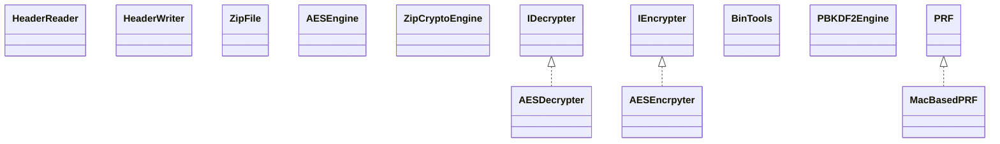

# zip4j-1.3.2.jar

[Group index](README.md) | [All archives](../README.md)

## Scope and provenance

- **Donor:** `SQX_145_REFERENCE_ROOT/internal/libs/zip4j-1.3.2.jar`.
- **SHA-256:** `c67098d430c574311432728ebd4c7c45672f9ccf5c64702eb6afb8816c22ad08`; accessed 2026-10-06; captured `2026-10-06T18:54:51.906614+00:00`.
- **Classes:** 60 raw entries; 60 unique entry names. Duplicate occurrence indices are zero-based.
- **Inspection:** read-only ZIP hashing and class-file structural parsing; signatures/descriptors, modifiers, hierarchy and references only. Bytecode bodies are hashed, not published.
- **Allocation:** proposed `FEAT-HOST-ZIP4J`, P02; [roadmap](../../sqx-full-application-roadmap.md). Domain README registration remains required.
- **Repository:** `01067f00031428613c6394064ca1bcadc1ba00ee`; review state unreviewed. Download label 145-dev1; installed build/activation and runtime equivalence unverified.
- **Limit:** every class/member is inventoried; declaration coverage does not establish consumed calls, defaults, formulas, failure semantics or algorithm parity.
- **Archive/resource index:** [123.json](../../../evidence/sqx145/archives/145/123.json).

## Complete member declarations

Member shards contain exact JVM names/descriptors, access flags, generic signatures, throws types, declared fields/methods, superclass/interfaces and referenced class names. All classes, nested/synthetic members and overloads are retained. Code length/hash is structural evidence, not a normalized algorithm comparison.

- [001.json](../../../evidence/sqx145/members/123/001.json) — SHA-256 `b3a2391cb01a1e9bf908196cc3db303a019e15a2b85f637dbe189304b398a684`.

## Focused structural diagram

Up to twelve non-nested classes; arrows show declared inheritance/interfaces only. External type names are not evidence of an available body or an executed dependency.

## Class inventory

| Archive entry | Occurrence | Class SHA-256 | Fields | Methods |
| --- | ---: | --- | ---: | ---: |
| `net/lingala/zip4j/core/HeaderReader.class` | 0 | `639e84b5d10d88c0c68f3bd9553bcfc9795c0c4866e41c664952f74fde07ba6d` | 2 | 20 |
| `net/lingala/zip4j/core/HeaderWriter.class` | 0 | `73469f8e67d8da6bf063ce811a9c90ebae0ccd35b33636a8dbc60cc2b22b7b28` | 1 | 17 |
| `net/lingala/zip4j/core/ZipFile.class` | 0 | `b17d4d0a5bc060af36e724f6dc03d6e517b6431bfef5e5b6b693ea8b1d5ec71c` | 7 | 45 |
| `net/lingala/zip4j/crypto/AESDecrypter.class` | 0 | `fba19b41bdc0113265117c2723a53bc77eae95eadaea37d6c8a2581afd93d6eb` | 15 | 10 |
| `net/lingala/zip4j/crypto/AESEncrpyter.class` | 0 | `763f2214ce1006eb9e4dfd8ebaae4e558aeb32e027e68fc06a01ce8fa7099964` | 17 | 13 |
| `net/lingala/zip4j/crypto/engine/AESEngine.class` | 0 | `ccaa0f662d254195dcb750f0724c596e9f795d0b669af6d8e9d154770a4778a1` | 9 | 11 |
| `net/lingala/zip4j/crypto/engine/ZipCryptoEngine.class` | 0 | `abdcf40a0ef05476fdfc18ce1a11a39c421e143c6ff762cd1da330d820e0642a` | 2 | 6 |
| `net/lingala/zip4j/crypto/IDecrypter.class` | 0 | `054c4c130a242bda3556039e7645108bd6056d1cb5bddfea5e1a8097cc143d16` | 0 | 2 |
| `net/lingala/zip4j/crypto/IEncrypter.class` | 0 | `4e07b26bc2353c162aae06ae2e14fbb5b0695ddd77856c822bf5364218f18d99` | 0 | 2 |
| `net/lingala/zip4j/crypto/PBKDF2/BinTools.class` | 0 | `a8a30256dc68cf6f27dc15c2a6fb70f1ad18b4c84507e1629d90af4b62bedcb0` | 1 | 4 |
| `net/lingala/zip4j/crypto/PBKDF2/MacBasedPRF.class` | 0 | `a531e302bd41ade49b58d0c15ef003aff50c1a04cbc2429f8caa3aa3b3bb1604` | 3 | 8 |
| `net/lingala/zip4j/crypto/PBKDF2/PBKDF2Engine.class` | 0 | `778c4250ef5379b48b7228b9171e301b930cec7b167f40247afb7e1fa009ab1a` | 2 | 16 |
| `net/lingala/zip4j/crypto/PBKDF2/PBKDF2HexFormatter.class` | 0 | `0008f6b2d5b0d3a9a0bcff41f38352fd32c7911ceeceed4a225b8c6ae45dfa7a` | 0 | 3 |
| `net/lingala/zip4j/crypto/PBKDF2/PBKDF2Parameters.class` | 0 | `c7067eb09dec3a39d28eccd4d08065dee569ea36aa570cb2d876b1a993b21512` | 5 | 13 |
| `net/lingala/zip4j/crypto/PBKDF2/PRF.class` | 0 | `4682903e482996142238a76cb912d549cddccfb306d3de47c257d40d9998d31c` | 0 | 3 |
| `net/lingala/zip4j/crypto/StandardDecrypter.class` | 0 | `068e2faab8bb9fdc25ad0bb6ed85e2999f81fe07033daab1566a2d18b4ae2ed4` | 3 | 4 |
| `net/lingala/zip4j/crypto/StandardEncrypter.class` | 0 | `1246072bbcc2033d3b0e4a9e37640894c6a398bd6c826d2b5eb04b2a8d682347` | 2 | 7 |
| `net/lingala/zip4j/exception/ZipException.class` | 0 | `8ffc7504694b0bb5c59be535a35078eff6fde5cd3b9e9a64dab82af13fdc97d4` | 2 | 8 |
| `net/lingala/zip4j/exception/ZipExceptionConstants.class` | 0 | `ce0d6ecb7f71ad2a357664d5ef1e2589fac772238c3580d53ec94fc66de7eaf1` | 5 | 0 |
| `net/lingala/zip4j/io/BaseInputStream.class` | 0 | `b42d033ff56b42f97001eedbb2c563532f6470035f12ff24b3b4b07b242334ef` | 0 | 5 |
| `net/lingala/zip4j/io/BaseOutputStream.class` | 0 | `bbd643ef7f80c99d2d4a9e952b8e6681aab2ceccbc0a23da643b96c3ae077f48` | 0 | 2 |
| `net/lingala/zip4j/io/CipherOutputStream.class` | 0 | `87095fea690d3bcee8602807cdb4f09c6e9b66bc7500c9d9503a22d135cb1982` | 13 | 20 |
| `net/lingala/zip4j/io/DeflaterOutputStream.class` | 0 | `6d5d0c9d557fbdb14495b582ac0fd167a43bfceee0616c69a2ecb41577728572` | 3 | 8 |
| `net/lingala/zip4j/io/InflaterInputStream.class` | 0 | `354e2c19bb754997077fb39025bfbefa6921a935f03da99596cd584bfa931f14` | 6 | 11 |
| `net/lingala/zip4j/io/PartInputStream.class` | 0 | `b452e0ad89353fb8f034f586467f6b80db53efc68ef7abde81d0c6464d87bc7e` | 10 | 10 |
| `net/lingala/zip4j/io/SplitOutputStream.class` | 0 | `142fd0d5f79b321eb24a8663940731bc8719d427163eccd18c9695f8f879e6db` | 6 | 18 |
| `net/lingala/zip4j/io/ZipInputStream.class` | 0 | `a7999525991b805e2aa1a2a8b180c65c7024a58ab80b5d07b752665b2e660e63` | 1 | 8 |
| `net/lingala/zip4j/io/ZipOutputStream.class` | 0 | `4511af6590fb12a1079b34c9ebaa9053b6e09e2873f288faaef8cffed55282ec` | 0 | 5 |
| `net/lingala/zip4j/model/AESExtraDataRecord.class` | 0 | `b817ca59c0f98ea38340b922cc819a92a8518d1d4061c99cc14aa3f64e6db5f9` | 6 | 13 |
| `net/lingala/zip4j/model/ArchiveExtraDataRecord.class` | 0 | `0cad42f31e58b7fa8c4011671dd182d8e3f6330006e5284a1d9e53e656fa48fd` | 3 | 7 |
| `net/lingala/zip4j/model/CentralDirectory.class` | 0 | `43cda727e3bfc563c84c3bff99767fe706ac1dee40fe5e03f25914a7769dfbe9` | 2 | 5 |
| `net/lingala/zip4j/model/DataDescriptor.class` | 0 | `e72329bbef8e5714fecd960250127f24e72047f73b7b13d0447d23e3788d835b` | 3 | 7 |
| `net/lingala/zip4j/model/DigitalSignature.class` | 0 | `adc793625dcff8dec06026291bcf9fe37017bd48a5daf15eb3b4a2793e5b22d4` | 3 | 7 |
| `net/lingala/zip4j/model/EndCentralDirRecord.class` | 0 | `5e7ba975eef80cba95f246e3dd9a764d78ff4669ce212e9906a0290c23118b65` | 10 | 21 |
| `net/lingala/zip4j/model/ExtraDataRecord.class` | 0 | `c23f4cb0d34b75e28f856bafd17b90c40c1c2ea2f8355c473ddb76731f8a3777` | 3 | 7 |
| `net/lingala/zip4j/model/FileHeader.class` | 0 | `3e763849684ee38754a2e0fb379e4d945f8a42cc4bfc1ce79bde94881d068eae` | 28 | 60 |
| `net/lingala/zip4j/model/LocalFileHeader.class` | 0 | `45a89879694c85bde8f8bc0c59028eb261ee51a0aabc265d2980135ac973638f` | 23 | 47 |
| `net/lingala/zip4j/model/UnzipEngineParameters.class` | 0 | `cb2eee67c5c25652530dd291b658e8491f899bf1881da41c0105f1bf9b7cfc3d` | 6 | 13 |
| `net/lingala/zip4j/model/UnzipParameters.class` | 0 | `345a52d5b209e67e566c40c3316c52a905df47905ee2ccd06d9d55f6805ebc08` | 6 | 13 |
| `net/lingala/zip4j/model/Zip64EndCentralDirLocator.class` | 0 | `64837c50bb85bf0ff9135d2a45ee999e90efc6edf36fa07a125802e04669e659` | 4 | 9 |
| `net/lingala/zip4j/model/Zip64EndCentralDirRecord.class` | 0 | `58cb0fcbf08692c946263d5b3ea958059cf75557bdde18df0022f57eb73b7680` | 11 | 23 |
| `net/lingala/zip4j/model/Zip64ExtendedInfo.class` | 0 | `24734671cb033a6fdc83c9e049b2f7455cddc5b0e511d19fcec3cf47ac0376a4` | 6 | 13 |
| `net/lingala/zip4j/model/ZipModel.class` | 0 | `c1ae09c598f7ec1fb28c13103d60559c51c898b5a5a1a521a90c36ec1001fc53` | 15 | 32 |
| `net/lingala/zip4j/model/ZipParameters.class` | 0 | `2bf584542d8240396427e9b4ac8be86ced207cf82ef191dd63daa39ce7ec9177` | 14 | 31 |
| `net/lingala/zip4j/progress/ProgressMonitor.class` | 0 | `1ecf3b5750327770fdf3becfd61851962a7071f2c42409e496e27a29da8ae11f` | 22 | 25 |
| `net/lingala/zip4j/unzip/Unzip$1.class` | 0 | `3569ca7180cee1c6dcca29f6ce16527f552ad54e40500958456ac3408dc6c512` | 5 | 2 |
| `net/lingala/zip4j/unzip/Unzip$2.class` | 0 | `de1e66b942f7228bc4e785756579e57aad6eb032d43715f1ee037cb552bbe8a6` | 6 | 2 |
| `net/lingala/zip4j/unzip/Unzip.class` | 0 | `30190289215aa5357b8f1fa6e17124371e3cfb5d486438346cce65ce0b4e9e7f` | 1 | 10 |
| `net/lingala/zip4j/unzip/UnzipEngine.class` | 0 | `e41c0c18172775fd6c525de9852f57175e42f9c7b5d1deb6fccaa478699edf94` | 6 | 23 |
| `net/lingala/zip4j/unzip/UnzipUtil.class` | 0 | `8803395d7d76e1e924261e5e37f0f349592774b7c16b32e6814d57841286432d` | 0 | 5 |
| `net/lingala/zip4j/util/ArchiveMaintainer$1.class` | 0 | `4430d4699fedf08f1881d1dbebe6b7f8a47b40f2477037b1794f71af33077731` | 4 | 2 |
| `net/lingala/zip4j/util/ArchiveMaintainer$2.class` | 0 | `871f4acbcb92a9876bf33998527ea300282f2765af459c03086fed4467e9681e` | 4 | 2 |
| `net/lingala/zip4j/util/ArchiveMaintainer.class` | 0 | `7aa6c31058131d664011b03fecfe576eb742a84a7b18e04a7c964a2b8dabfd1d` | 0 | 21 |
| `net/lingala/zip4j/util/CRCUtil.class` | 0 | `3ea3c9f9739e9467c0635e24fb60b6375129b05e8ec005d4b1a99367dabaf569` | 1 | 3 |
| `net/lingala/zip4j/util/InternalZipConstants.class` | 0 | `1a9294d31df6d5a5f477526bbf753aaabd3e72b06ffb1100ec984c852e699f0e` | 86 | 1 |
| `net/lingala/zip4j/util/Raw.class` | 0 | `5a514f5cc4b83be4a3e288d4d9145a703ca698ec87d986c3393c4e801d0b9120` | 0 | 15 |
| `net/lingala/zip4j/util/Zip4jConstants.class` | 0 | `4e63623490a00bbc8cc5d45b2686d39cf2535eabeec2a9237c3ab8b96a225d62` | 14 | 0 |
| `net/lingala/zip4j/util/Zip4jUtil.class` | 0 | `db3d2ddc89c7811ab7450eb5a110f61a23e498610bbbdb8ecf69a96cf64aa7f8` | 0 | 35 |
| `net/lingala/zip4j/zip/ZipEngine$1.class` | 0 | `037a9607d05477e5bc283012226661751f8a78eac0831cd28e3ff8d6c02aa490` | 4 | 2 |
| `net/lingala/zip4j/zip/ZipEngine.class` | 0 | `b66976d31c1df970e6ccc3008b503005ed595a3868178c2c506f4a595c6eb937` | 1 | 11 |
