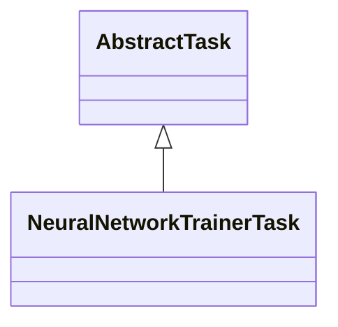

# TaskNeuralNetworkTrainer.jar

[Group index](README.md) | [All archives](../README.md)

## Scope and provenance

- **Donor:** `SQX_145_REFERENCE_ROOT/internal/plugins/TaskNeuralNetworkTrainer/TaskNeuralNetworkTrainer.jar`.
- **SHA-256:** `ae6ec1406158b23fc416b4e4d3d8e053ae128894aa4ac0c25cb12067920569e5`; accessed 2026-10-06; captured `2026-10-06T18:54:51.906614+00:00`.
- **Classes:** 1 raw entries; 1 unique entry names. Duplicate occurrence indices are zero-based.
- **Inspection:** read-only ZIP hashing and class-file structural parsing; signatures/descriptors, modifiers, hierarchy and references only. Bytecode bodies are hashed, not published.
- **Allocation:** proposed `FEAT-NEURAL-TASK-NEURAL-NETWORK-TRAINER`, P15; [roadmap](../../sqx-full-application-roadmap.md). Domain README registration remains required.
- **Repository:** `01067f00031428613c6394064ca1bcadc1ba00ee`; review state unreviewed. Download label 145-dev1; installed build/activation and runtime equivalence unverified.
- **Limit:** every class/member is inventoried; declaration coverage does not establish consumed calls, defaults, formulas, failure semantics or algorithm parity.
- **Archive/resource index:** [281.json](../../../evidence/sqx145/archives/145/281.json).

## Complete member declarations

Member shards contain exact JVM names/descriptors, access flags, generic signatures, throws types, declared fields/methods, superclass/interfaces and referenced class names. All classes, nested/synthetic members and overloads are retained. Code length/hash is structural evidence, not a normalized algorithm comparison.

- [001.json](../../../evidence/sqx145/members/281/001.json) — SHA-256 `7c9a559271a583255dd3e784d73ae7d88e9e945980080048d3686c3f8ba27713`.

## Focused structural diagram

Up to twelve non-nested classes; arrows show declared inheritance/interfaces only. External type names are not evidence of an available body or an executed dependency.

## Class inventory

| Archive entry | Occurrence | Class SHA-256 | Fields | Methods |
| --- | ---: | --- | ---: | ---: |
| `com/strategyquant/plugin/Task/impl/NeuralNetworkTrainer/NeuralNetworkTrainerTask.class` | 0 | `60af7e7758b6681aecafb7b1c3da21a9ab5cf076b1914474aa91ec6102261d02` | 0 | 13 |
