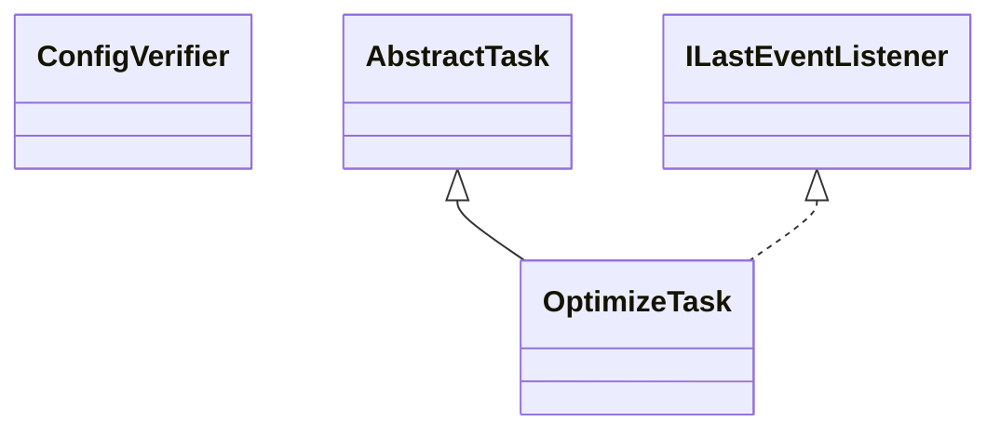

# TaskOptimize.jar

[Group index](README.md) | [All archives](../README.md)

## Scope and provenance

- **Donor:** `SQX_145_REFERENCE_ROOT/internal/plugins/TaskOptimize/TaskOptimize.jar`.
- **SHA-256:** `026673159e7365b15e877ecd9123bf4187f49218d4db3855a6c0fed6a3735bc5`; accessed 2026-10-06; captured `2026-10-06T18:54:51.906614+00:00`.
- **Classes:** 10 raw entries; 10 unique entry names. Duplicate occurrence indices are zero-based.
- **Inspection:** read-only ZIP hashing and class-file structural parsing; signatures/descriptors, modifiers, hierarchy and references only. Bytecode bodies are hashed, not published.
- **Allocation:** proposed `FEAT-OPTIMIZER-TASK-OPTIMIZE`, P10; [roadmap](../../sqx-full-application-roadmap.md). Domain README registration remains required.
- **Repository:** `01067f00031428613c6394064ca1bcadc1ba00ee`; review state unreviewed. Download label 145-dev1; installed build/activation and runtime equivalence unverified.
- **Limit:** every class/member is inventoried; declaration coverage does not establish consumed calls, defaults, formulas, failure semantics or algorithm parity.
- **Archive/resource index:** [283.json](../../../evidence/sqx145/archives/145/283.json).

## Complete member declarations

Member shards contain exact JVM names/descriptors, access flags, generic signatures, throws types, declared fields/methods, superclass/interfaces and referenced class names. All classes, nested/synthetic members and overloads are retained. Code length/hash is structural evidence, not a normalized algorithm comparison.

- [001.json](../../../evidence/sqx145/members/283/001.json) — SHA-256 `6f9e0ee522b2ffe151a4c4977b6b93ab32666cb15469866cd4da7c342da4fcef`.

## Focused structural diagram

Up to twelve non-nested classes; arrows show declared inheritance/interfaces only. External type names are not evidence of an available body or an executed dependency.

## Class inventory

| Archive entry | Occurrence | Class SHA-256 | Fields | Methods |
| --- | ---: | --- | ---: | ---: |
| `com/strategyquant/plugin/Task/impl/Optimize/ConfigVerifier.class` | 0 | `a22a72aea65c7dcf83621e06261a8600fce4ddb5a38d130acca731b714736a25` | 0 | 6 |
| `com/strategyquant/plugin/Task/impl/Optimize/OptimizeTask$1.class` | 0 | `a2472a6b024520e81b8954da8a732e13a03e502116ff2fdeffb5fb53e34c1184` | 2 | 2 |
| `com/strategyquant/plugin/Task/impl/Optimize/OptimizeTask$2.class` | 0 | `6a0bd132348766032a1f55cef96e91f11871b57b0859b3c08b3140f821d9c5e8` | 1 | 2 |
| `com/strategyquant/plugin/Task/impl/Optimize/OptimizeTask$3.class` | 0 | `8239021218b643e3af377cb063249b97bcd2c2a6b52e9d0533075d46954bc381` | 1 | 2 |
| `com/strategyquant/plugin/Task/impl/Optimize/OptimizeTask$4.class` | 0 | `d602fea00de389026ea25f2f174072fe9bf7ecbc3155443b52ea59d769a52496` | 2 | 2 |
| `com/strategyquant/plugin/Task/impl/Optimize/OptimizeTask$5.class` | 0 | `795ca01dd010879807cfe27b24d7a1c66389ebbf3d4064f39fd4bb0049c46ae7` | 1 | 2 |
| `com/strategyquant/plugin/Task/impl/Optimize/OptimizeTask$6.class` | 0 | `9e9402571d0f51dc9554b1085cb6524f26df7fcbd60dd5fcb51a85874ce446e3` | 1 | 2 |
| `com/strategyquant/plugin/Task/impl/Optimize/OptimizeTask$7.class` | 0 | `6431d87a07d46e6a82a1624e6686a8fbddcfb083e2a69dbfe69fb4e12981876c` | 3 | 2 |
| `com/strategyquant/plugin/Task/impl/Optimize/OptimizeTask$StrategyData.class` | 0 | `6acd3fc35bf43e904c518e5fb68bdbc14c6d5e37dde96f8b295a8e9ffab2a941` | 4 | 1 |
| `com/strategyquant/plugin/Task/impl/Optimize/OptimizeTask.class` | 0 | `fc084a144fff13724cdbd648b1af949d6588481f2ce6c31739006472b8cf0496` | 24 | 38 |
