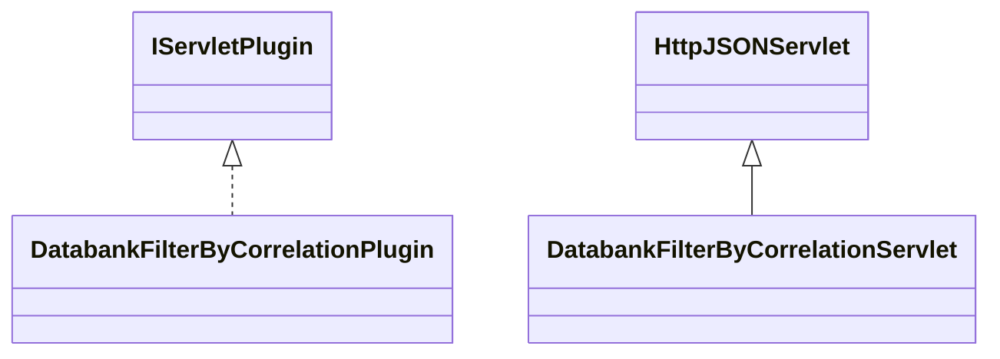

# DatabankFilterByCorrelation.jar

[Group index](README.md) | [All archives](../README.md)

## Scope and provenance

- **Donor:** `SQX_145_REFERENCE_ROOT/internal/plugins/DatabankFilterByCorrelation/DatabankFilterByCorrelation.jar`.
- **SHA-256:** `1fa17e5b51d414ec37aeee2e22480adb3f1d6f147ecade700806a0c787159918`; accessed 2026-10-06; captured `2026-10-06T18:54:51.906614+00:00`.
- **Classes:** 2 raw entries; 2 unique entry names. Duplicate occurrence indices are zero-based.
- **Inspection:** read-only ZIP hashing and class-file structural parsing; signatures/descriptors, modifiers, hierarchy and references only. Bytecode bodies are hashed, not published.
- **Allocation:** proposed `FEAT-RESULTS-DATABANK-FILTER-BY-CORRELATION`, P08; [roadmap](../../sqx-full-application-roadmap.md). Domain README registration remains required.
- **Repository:** `01067f00031428613c6394064ca1bcadc1ba00ee`; review state unreviewed. Download label 145-dev1; installed build/activation and runtime equivalence unverified.
- **Limit:** every class/member is inventoried; declaration coverage does not establish consumed calls, defaults, formulas, failure semantics or algorithm parity.
- **Archive/resource index:** [163.json](../../../evidence/sqx145/archives/145/163.json).

## Complete member declarations

Member shards contain exact JVM names/descriptors, access flags, generic signatures, throws types, declared fields/methods, superclass/interfaces and referenced class names. All classes, nested/synthetic members and overloads are retained. Code length/hash is structural evidence, not a normalized algorithm comparison.

- [001.json](../../../evidence/sqx145/members/163/001.json) — SHA-256 `2af69b0a4125553bae6853b5cc32db4fc5b0439f324d42ca96faa79ae86a70bf`.

## Focused structural diagram

Up to twelve non-nested classes; arrows show declared inheritance/interfaces only. External type names are not evidence of an available body or an executed dependency.

## Class inventory

| Archive entry | Occurrence | Class SHA-256 | Fields | Methods |
| --- | ---: | --- | ---: | ---: |
| `com/strategyquant/plugin/Databank/impl/FilterByCorrelation/DatabankFilterByCorrelationPlugin.class` | 0 | `d286c1f12ea7f3e0043efd11916c63039f0afd08be3d90f5ae4eb23d4bc98558` | 2 | 6 |
| `com/strategyquant/plugin/Databank/impl/FilterByCorrelation/DatabankFilterByCorrelationServlet.class` | 0 | `5f8f371dccdbf73722813134d744e4197cafbda0351ec855743da1bd751a6c46` | 1 | 4 |
