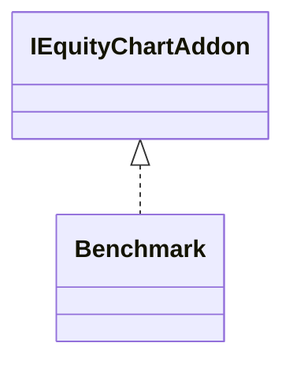

# EquityChartBenchmark.jar

[Group index](README.md) | [All archives](../README.md)

## Scope and provenance

- **Donor:** `SQX_145_REFERENCE_ROOT/internal/plugins/EquityChartBenchmark/EquityChartBenchmark.jar`.
- **SHA-256:** `c65c9be9aeb5d138615e44f463226419c856d192a6f309ba41c30cbcfa0261dc`; accessed 2026-10-06; captured `2026-10-06T18:54:51.906614+00:00`.
- **Classes:** 3 raw entries; 3 unique entry names. Duplicate occurrence indices are zero-based.
- **Inspection:** read-only ZIP hashing and class-file structural parsing; signatures/descriptors, modifiers, hierarchy and references only. Bytecode bodies are hashed, not published.
- **Allocation:** proposed `FEAT-RESULTS-EQUITY-CHART-BENCHMARK`, P08; [roadmap](../../sqx-full-application-roadmap.md). Domain README registration remains required.
- **Repository:** `01067f00031428613c6394064ca1bcadc1ba00ee`; review state unreviewed. Download label 145-dev1; installed build/activation and runtime equivalence unverified.
- **Limit:** every class/member is inventoried; declaration coverage does not establish consumed calls, defaults, formulas, failure semantics or algorithm parity.
- **Archive/resource index:** [183.json](../../../evidence/sqx145/archives/145/183.json).

## Complete member declarations

Member shards contain exact JVM names/descriptors, access flags, generic signatures, throws types, declared fields/methods, superclass/interfaces and referenced class names. All classes, nested/synthetic members and overloads are retained. Code length/hash is structural evidence, not a normalized algorithm comparison.

- [001.json](../../../evidence/sqx145/members/183/001.json) — SHA-256 `37cb7343edfd058c557222378ffa73e6144cca992e3f12b8b53e30868e733f47`.

## Focused structural diagram

Up to twelve non-nested classes; arrows show declared inheritance/interfaces only. External type names are not evidence of an available body or an executed dependency.

## Class inventory

| Archive entry | Occurrence | Class SHA-256 | Fields | Methods |
| --- | ---: | --- | ---: | ---: |
| `com/strategyquant/plugin/EquityChart/impl/Benchmark/Benchmark$1.class` | 0 | `c26a51016b2891733589728b2e730e2563b8ef5a218c1399b69e6001752e095a` | 0 | 0 |
| `com/strategyquant/plugin/EquityChart/impl/Benchmark/Benchmark$NormalizedData.class` | 0 | `e500cc1e9dfb324e344cd9ecde4a551279bc7905b93d43e9d2294de32ee700d4` | 10 | 3 |
| `com/strategyquant/plugin/EquityChart/impl/Benchmark/Benchmark.class` | 0 | `93a9cc82d35b7321d55cf068b95b6e62fdc8d61a85a25f2b36352dafc7f9e968` | 6 | 16 |
