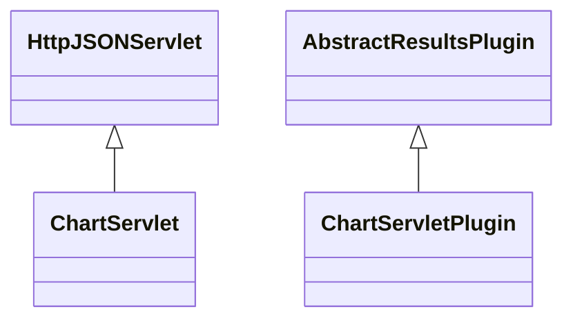

# ResultsChart.jar

[Group index](README.md) | [All archives](../README.md)

## Scope and provenance

- **Donor:** `SQX_145_REFERENCE_ROOT/internal/plugins/ResultsChart/ResultsChart.jar`.
- **SHA-256:** `e7806d3052e6f1d1df42c1237e7a28f443f42d66c44a526893de285635bde1e2`; accessed 2026-10-06; captured `2026-10-06T18:54:51.906614+00:00`.
- **Classes:** 2 raw entries; 2 unique entry names. Duplicate occurrence indices are zero-based.
- **Inspection:** read-only ZIP hashing and class-file structural parsing; signatures/descriptors, modifiers, hierarchy and references only. Bytecode bodies are hashed, not published.
- **Allocation:** proposed `FEAT-RESULTS-RESULTS-CHART`, P08; [roadmap](../../sqx-full-application-roadmap.md). Domain README registration remains required.
- **Repository:** `01067f00031428613c6394064ca1bcadc1ba00ee`; review state unreviewed. Download label 145-dev1; installed build/activation and runtime equivalence unverified.
- **Limit:** every class/member is inventoried; declaration coverage does not establish consumed calls, defaults, formulas, failure semantics or algorithm parity.
- **Archive/resource index:** [200.json](../../../evidence/sqx145/archives/145/200.json).

## Complete member declarations

Member shards contain exact JVM names/descriptors, access flags, generic signatures, throws types, declared fields/methods, superclass/interfaces and referenced class names. All classes, nested/synthetic members and overloads are retained. Code length/hash is structural evidence, not a normalized algorithm comparison.

- [001.json](../../../evidence/sqx145/members/200/001.json) — SHA-256 `9081517db10fe15da8c4baf123bd077ad8d29820a3f3b79b261a9db86f81bc14`.

## Focused structural diagram

Up to twelve non-nested classes; arrows show declared inheritance/interfaces only. External type names are not evidence of an available body or an executed dependency.

## Class inventory

| Archive entry | Occurrence | Class SHA-256 | Fields | Methods |
| --- | ---: | --- | ---: | ---: |
| `com/strategyquant/plugin/Results/impl/Chart/ChartServlet.class` | 0 | `cbc3b5927023cfebcd907de509c47d21547e13f7e25bf874d23da9c9d0e11b3d` | 4 | 5 |
| `com/strategyquant/plugin/Results/impl/Chart/ChartServletPlugin.class` | 0 | `210949208fc6e6f5723240607b8fe38cc69563b3d35822ffb8d1c77913aefb38` | 1 | 9 |
