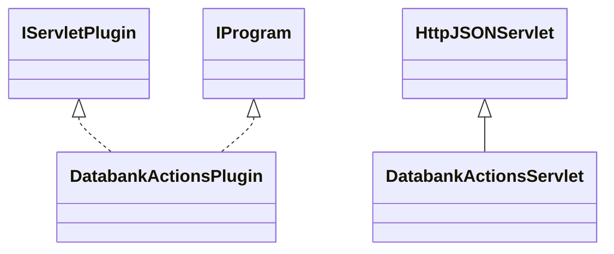

# ResultsDatabankActions.jar

[Group index](README.md) | [All archives](../README.md)

## Scope and provenance

- **Donor:** `SQX_145_REFERENCE_ROOT/internal/plugins/ResultsDatabankActions/ResultsDatabankActions.jar`.
- **SHA-256:** `b14b83a58c5191fb5a4b7d9b79ec0c81ae70b31263f07d12a19ea559aec8181f`; accessed 2026-10-06; captured `2026-10-06T18:54:51.906614+00:00`.
- **Classes:** 3 raw entries; 3 unique entry names. Duplicate occurrence indices are zero-based.
- **Inspection:** read-only ZIP hashing and class-file structural parsing; signatures/descriptors, modifiers, hierarchy and references only. Bytecode bodies are hashed, not published.
- **Allocation:** proposed `FEAT-RESULTS-RESULTS-DATABANK-ACTIONS`, P08; [roadmap](../../sqx-full-application-roadmap.md). Domain README registration remains required.
- **Repository:** `01067f00031428613c6394064ca1bcadc1ba00ee`; review state unreviewed. Download label 145-dev1; installed build/activation and runtime equivalence unverified.
- **Limit:** every class/member is inventoried; declaration coverage does not establish consumed calls, defaults, formulas, failure semantics or algorithm parity.
- **Archive/resource index:** [201.json](../../../evidence/sqx145/archives/145/201.json).

## Complete member declarations

Member shards contain exact JVM names/descriptors, access flags, generic signatures, throws types, declared fields/methods, superclass/interfaces and referenced class names. All classes, nested/synthetic members and overloads are retained. Code length/hash is structural evidence, not a normalized algorithm comparison.

- [001.json](../../../evidence/sqx145/members/201/001.json) — SHA-256 `c32db6e61ee6b1d67a5e9a5367d244c5c394c9e44019d3a7f83928f208961850`.

## Focused structural diagram

Up to twelve non-nested classes; arrows show declared inheritance/interfaces only. External type names are not evidence of an available body or an executed dependency.

## Class inventory

| Archive entry | Occurrence | Class SHA-256 | Fields | Methods |
| --- | ---: | --- | ---: | ---: |
| `com/strategyquant/plugin/Results/impl/DatabankActions/DatabankActionsPlugin.class` | 0 | `a2a6b612b727101da904c713743d9f95cc0240d38d9041f5928a74078a969e98` | 2 | 6 |
| `com/strategyquant/plugin/Results/impl/DatabankActions/DatabankActionsServlet$1.class` | 0 | `304644fee6605fc2d0a2bf9c44ca74bc9ba7127155b5ba6bd86f2740e4fffa8b` | 6 | 2 |
| `com/strategyquant/plugin/Results/impl/DatabankActions/DatabankActionsServlet.class` | 0 | `7ea8df108c7bb5fb33fe74f8166b4d5c0bbc7044b89df770f788e93924908363` | 2 | 13 |
