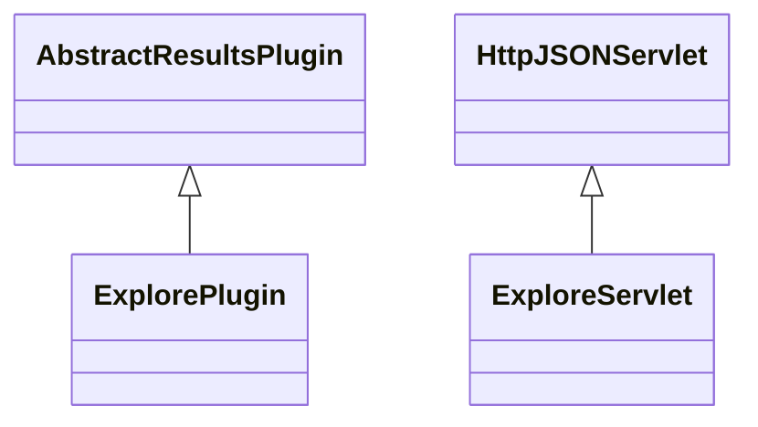

# ResultsExplore.jar

[Group index](README.md) | [All archives](../README.md)

## Scope and provenance

- **Donor:** `SQX_145_REFERENCE_ROOT/internal/plugins/ResultsExplore/ResultsExplore.jar`.
- **SHA-256:** `bb8f0211b555d30032a8807b0082d34adcb0291567b6a30c2950d0a1947120ef`; accessed 2026-10-06; captured `2026-10-06T18:54:51.906614+00:00`.
- **Classes:** 3 raw entries; 3 unique entry names. Duplicate occurrence indices are zero-based.
- **Inspection:** read-only ZIP hashing and class-file structural parsing; signatures/descriptors, modifiers, hierarchy and references only. Bytecode bodies are hashed, not published.
- **Allocation:** proposed `FEAT-RESULTS-RESULTS-EXPLORE`, P08; [roadmap](../../sqx-full-application-roadmap.md). Domain README registration remains required.
- **Repository:** `01067f00031428613c6394064ca1bcadc1ba00ee`; review state unreviewed. Download label 145-dev1; installed build/activation and runtime equivalence unverified.
- **Limit:** every class/member is inventoried; declaration coverage does not establish consumed calls, defaults, formulas, failure semantics or algorithm parity.
- **Archive/resource index:** [204.json](../../../evidence/sqx145/archives/145/204.json).

## Complete member declarations

Member shards contain exact JVM names/descriptors, access flags, generic signatures, throws types, declared fields/methods, superclass/interfaces and referenced class names. All classes, nested/synthetic members and overloads are retained. Code length/hash is structural evidence, not a normalized algorithm comparison.

- [001.json](../../../evidence/sqx145/members/204/001.json) — SHA-256 `a11060e9e0a26d84286661055f5ae56aaa6fe436bab6671a07f673d14b389210`.

## Focused structural diagram

Up to twelve non-nested classes; arrows show declared inheritance/interfaces only. External type names are not evidence of an available body or an executed dependency.

## Class inventory

| Archive entry | Occurrence | Class SHA-256 | Fields | Methods |
| --- | ---: | --- | ---: | ---: |
| `com/strategyquant/plugin/Results/impl/Explore/ExplorePlugin.class` | 0 | `9c1f973c76d38563d7e494770285db5be74c9bbfe6a94af8eab003f6c143a40b` | 2 | 8 |
| `com/strategyquant/plugin/Results/impl/Explore/ExploreServlet$DataCache.class` | 0 | `fd2619a7569e7f2557e6e1a1bd229a5e10460f787d2861d7e61312363cf97212` | 2 | 2 |
| `com/strategyquant/plugin/Results/impl/Explore/ExploreServlet.class` | 0 | `26a1bae8fc39889289af00f39ceaa5583bef93c521b5d963be7b4fe00886efeb` | 5 | 10 |
