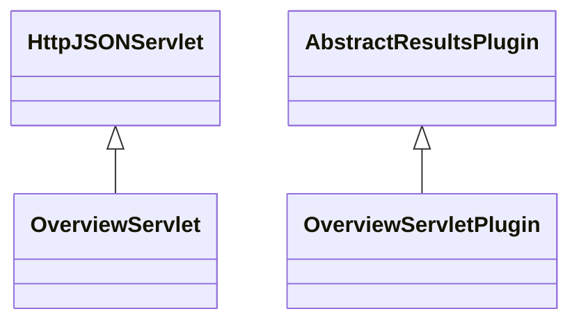

# ResultsOverview.jar

[Group index](README.md) | [All archives](../README.md)

## Scope and provenance

- **Donor:** `SQX_145_REFERENCE_ROOT/internal/plugins/ResultsOverview/ResultsOverview.jar`.
- **SHA-256:** `d728475561b669238963858dd91145cbc03ca0e4a4955445ce73f6a4c42c80aa`; accessed 2026-10-06; captured `2026-10-06T18:54:51.906614+00:00`.
- **Classes:** 2 raw entries; 2 unique entry names. Duplicate occurrence indices are zero-based.
- **Inspection:** read-only ZIP hashing and class-file structural parsing; signatures/descriptors, modifiers, hierarchy and references only. Bytecode bodies are hashed, not published.
- **Allocation:** proposed `FEAT-RESULTS-RESULTS-OVERVIEW`, P08; [roadmap](../../sqx-full-application-roadmap.md). Domain README registration remains required.
- **Repository:** `01067f00031428613c6394064ca1bcadc1ba00ee`; review state unreviewed. Download label 145-dev1; installed build/activation and runtime equivalence unverified.
- **Limit:** every class/member is inventoried; declaration coverage does not establish consumed calls, defaults, formulas, failure semantics or algorithm parity.
- **Archive/resource index:** [206.json](../../../evidence/sqx145/archives/145/206.json).

## Complete member declarations

Member shards contain exact JVM names/descriptors, access flags, generic signatures, throws types, declared fields/methods, superclass/interfaces and referenced class names. All classes, nested/synthetic members and overloads are retained. Code length/hash is structural evidence, not a normalized algorithm comparison.

- [001.json](../../../evidence/sqx145/members/206/001.json) — SHA-256 `28a9c4d3245e0cda57f664e982399723288e977f489e4288ee85c48ff9077791`.

## Focused structural diagram

Up to twelve non-nested classes; arrows show declared inheritance/interfaces only. External type names are not evidence of an available body or an executed dependency.

## Class inventory

| Archive entry | Occurrence | Class SHA-256 | Fields | Methods |
| --- | ---: | --- | ---: | ---: |
| `com/strategyquant/plugin/Results/impl/Overview/OverviewServlet.class` | 0 | `337feae255a60817c3784dd3f38e0276d98bbb335cb8cd7e8171b62fd7dfb2b3` | 3 | 6 |
| `com/strategyquant/plugin/Results/impl/Overview/OverviewServletPlugin.class` | 0 | `fb0f096ea4bac6af89023b428cd12276940942bc07337d1416296b457f3dbe52` | 2 | 8 |
