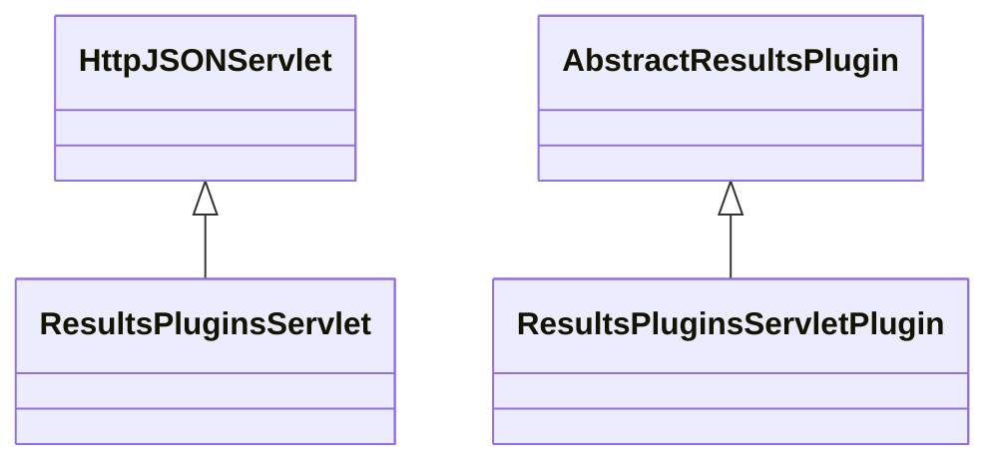

# ResultsPlugins.jar

[Group index](README.md) | [All archives](../README.md)

## Scope and provenance

- **Donor:** `SQX_145_REFERENCE_ROOT/internal/plugins/ResultsPlugins/ResultsPlugins.jar`.
- **SHA-256:** `f60cf40426b7786aa0a48e063ebe82ff2b9a060fa3234e5b51808e66694dfeb0`; accessed 2026-10-06; captured `2026-10-06T18:54:51.906614+00:00`.
- **Classes:** 2 raw entries; 2 unique entry names. Duplicate occurrence indices are zero-based.
- **Inspection:** read-only ZIP hashing and class-file structural parsing; signatures/descriptors, modifiers, hierarchy and references only. Bytecode bodies are hashed, not published.
- **Allocation:** proposed `FEAT-RESULTS-RESULTS-PLUGINS`, P08; [roadmap](../../sqx-full-application-roadmap.md). Domain README registration remains required.
- **Repository:** `01067f00031428613c6394064ca1bcadc1ba00ee`; review state unreviewed. Download label 145-dev1; installed build/activation and runtime equivalence unverified.
- **Limit:** every class/member is inventoried; declaration coverage does not establish consumed calls, defaults, formulas, failure semantics or algorithm parity.
- **Archive/resource index:** [207.json](../../../evidence/sqx145/archives/145/207.json).

## Complete member declarations

Member shards contain exact JVM names/descriptors, access flags, generic signatures, throws types, declared fields/methods, superclass/interfaces and referenced class names. All classes, nested/synthetic members and overloads are retained. Code length/hash is structural evidence, not a normalized algorithm comparison.

- [001.json](../../../evidence/sqx145/members/207/001.json) — SHA-256 `6539d3b4bc11d6417beb065d6f0ab9411f1abe8f706fbab505f2bf81fe2a9775`.

## Focused structural diagram

Up to twelve non-nested classes; arrows show declared inheritance/interfaces only. External type names are not evidence of an available body or an executed dependency.

## Class inventory

| Archive entry | Occurrence | Class SHA-256 | Fields | Methods |
| --- | ---: | --- | ---: | ---: |
| `com/strategyquant/plugin/Results/impl/Plugins/ResultsPluginsServlet.class` | 0 | `2b8ffa059b8ff7f59a1b0c47f31a07df9f03c68ee996ee95f2f8df1ebb92b9dd` | 6 | 24 |
| `com/strategyquant/plugin/Results/impl/Plugins/ResultsPluginsServletPlugin.class` | 0 | `4c2799d527e4eeccc37c09202bc76f338c23f6bc5c9096ca1a7acf93dfbcb8e5` | 1 | 8 |
