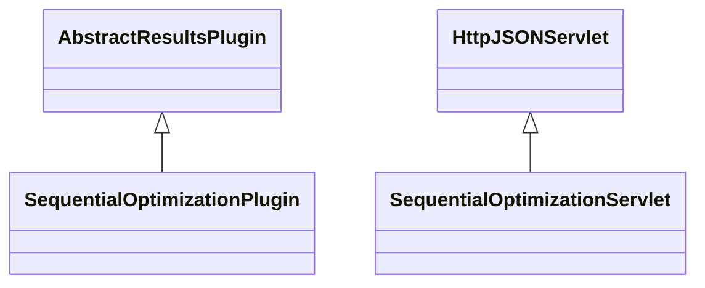

# ResultsSequentialOptimization.jar

[Group index](README.md) | [All archives](../README.md)

## Scope and provenance

- **Donor:** `SQX_145_REFERENCE_ROOT/internal/plugins/ResultsSequentialOptimization/ResultsSequentialOptimization.jar`.
- **SHA-256:** `7d5039a1c9d0868b8ed2e64913b46a0329bd79f8bc01d4546e899a7a26c6ee7e`; accessed 2026-10-06; captured `2026-10-06T18:54:51.906614+00:00`.
- **Classes:** 2 raw entries; 2 unique entry names. Duplicate occurrence indices are zero-based.
- **Inspection:** read-only ZIP hashing and class-file structural parsing; signatures/descriptors, modifiers, hierarchy and references only. Bytecode bodies are hashed, not published.
- **Allocation:** proposed `FEAT-OPTIMIZER-RESULTS-SEQUENTIAL-OPTIMIZATION`, P10; [roadmap](../../sqx-full-application-roadmap.md). Domain README registration remains required.
- **Repository:** `01067f00031428613c6394064ca1bcadc1ba00ee`; review state unreviewed. Download label 145-dev1; installed build/activation and runtime equivalence unverified.
- **Limit:** every class/member is inventoried; declaration coverage does not establish consumed calls, defaults, formulas, failure semantics or algorithm parity.
- **Archive/resource index:** [213.json](../../../evidence/sqx145/archives/145/213.json).

## Complete member declarations

Member shards contain exact JVM names/descriptors, access flags, generic signatures, throws types, declared fields/methods, superclass/interfaces and referenced class names. All classes, nested/synthetic members and overloads are retained. Code length/hash is structural evidence, not a normalized algorithm comparison.

- [001.json](../../../evidence/sqx145/members/213/001.json) — SHA-256 `529e01890b8e458af5c676ba5e66cacce3d6d57f8e48f6dbb8644f234c845242`.

## Focused structural diagram

Up to twelve non-nested classes; arrows show declared inheritance/interfaces only. External type names are not evidence of an available body or an executed dependency.

## Class inventory

| Archive entry | Occurrence | Class SHA-256 | Fields | Methods |
| --- | ---: | --- | ---: | ---: |
| `com/strategyquant/plugin/Results/impl/SequentialOptimization/SequentialOptimizationPlugin.class` | 0 | `35a3a053f93b6f04120ec795f701f98ffd3c86c0f03e3d6bfe72f6c3da4dfd6a` | 2 | 8 |
| `com/strategyquant/plugin/Results/impl/SequentialOptimization/SequentialOptimizationServlet.class` | 0 | `e845c418debb6cadaa8a86b951844f73823f089e029fffdce47c1e0bf8afea24` | 3 | 6 |
