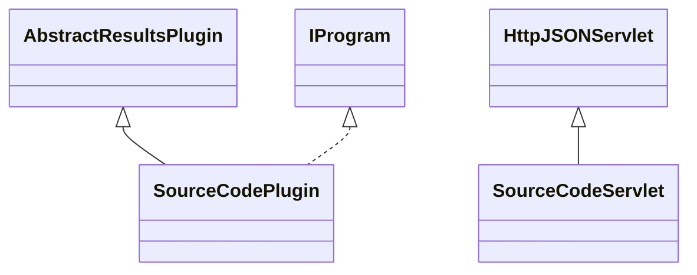

# ResultsSourceCode.jar

[Group index](README.md) | [All archives](../README.md)

## Scope and provenance

- **Donor:** `SQX_145_REFERENCE_ROOT/internal/plugins/ResultsSourceCode/ResultsSourceCode.jar`.
- **SHA-256:** `3e7fcf22b7a4c6e0b38875853ceefb14592837cd8f82ce71a43715aeaaa406e6`; accessed 2026-10-06; captured `2026-10-06T18:54:51.906614+00:00`.
- **Classes:** 2 raw entries; 2 unique entry names. Duplicate occurrence indices are zero-based.
- **Inspection:** read-only ZIP hashing and class-file structural parsing; signatures/descriptors, modifiers, hierarchy and references only. Bytecode bodies are hashed, not published.
- **Allocation:** proposed `FEAT-AUTHORING-RESULTS-SOURCE-CODE`, P07; [roadmap](../../sqx-full-application-roadmap.md). Domain README registration remains required.
- **Repository:** `01067f00031428613c6394064ca1bcadc1ba00ee`; review state unreviewed. Download label 145-dev1; installed build/activation and runtime equivalence unverified.
- **Limit:** every class/member is inventoried; declaration coverage does not establish consumed calls, defaults, formulas, failure semantics or algorithm parity.
- **Archive/resource index:** [214.json](../../../evidence/sqx145/archives/145/214.json).

## Complete member declarations

Member shards contain exact JVM names/descriptors, access flags, generic signatures, throws types, declared fields/methods, superclass/interfaces and referenced class names. All classes, nested/synthetic members and overloads are retained. Code length/hash is structural evidence, not a normalized algorithm comparison.

- [001.json](../../../evidence/sqx145/members/214/001.json) — SHA-256 `d4fbdc424ad5f8de03aee29fde20f2a44294866ccbc1044e731e57b596998c5d`.

## Focused structural diagram

Up to twelve non-nested classes; arrows show declared inheritance/interfaces only. External type names are not evidence of an available body or an executed dependency.

## Class inventory

| Archive entry | Occurrence | Class SHA-256 | Fields | Methods |
| --- | ---: | --- | ---: | ---: |
| `com/strategyquant/plugin/Results/impl/SourceCode/SourceCodePlugin.class` | 0 | `70bea8c0dd3b05d888ad6334b1910c662298af985a5817e1cd1d189737ba179b` | 2 | 10 |
| `com/strategyquant/plugin/Results/impl/SourceCode/SourceCodeServlet.class` | 0 | `6ff59e675d7b47cf98bc6afc4806f5c97c209c4eda24d0e03960f6b079e9c49f` | 7 | 22 |
