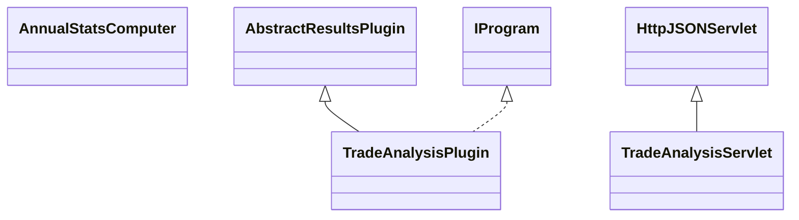

# ResultsTradeAnalysis.jar

[Group index](README.md) | [All archives](../README.md)

## Scope and provenance

- **Donor:** `SQX_145_REFERENCE_ROOT/internal/plugins/ResultsTradeAnalysis/ResultsTradeAnalysis.jar`.
- **SHA-256:** `9a1309f63797d1b206527f3bd32f43fca8011c64eb8d7c815384b6844c70e108`; accessed 2026-10-06; captured `2026-10-06T18:54:51.906614+00:00`.
- **Classes:** 3 raw entries; 3 unique entry names. Duplicate occurrence indices are zero-based.
- **Inspection:** read-only ZIP hashing and class-file structural parsing; signatures/descriptors, modifiers, hierarchy and references only. Bytecode bodies are hashed, not published.
- **Allocation:** proposed `FEAT-RESULTS-RESULTS-TRADE-ANALYSIS`, P08; [roadmap](../../sqx-full-application-roadmap.md). Domain README registration remains required.
- **Repository:** `01067f00031428613c6394064ca1bcadc1ba00ee`; review state unreviewed. Download label 145-dev1; installed build/activation and runtime equivalence unverified.
- **Limit:** every class/member is inventoried; declaration coverage does not establish consumed calls, defaults, formulas, failure semantics or algorithm parity.
- **Archive/resource index:** [219.json](../../../evidence/sqx145/archives/145/219.json).

## Complete member declarations

Member shards contain exact JVM names/descriptors, access flags, generic signatures, throws types, declared fields/methods, superclass/interfaces and referenced class names. All classes, nested/synthetic members and overloads are retained. Code length/hash is structural evidence, not a normalized algorithm comparison.

- [001.json](../../../evidence/sqx145/members/219/001.json) — SHA-256 `bbe556f6e3a0863aea6fde9b8e623c268e6720bde629de9344a451b67f5524f5`.

## Focused structural diagram

Up to twelve non-nested classes; arrows show declared inheritance/interfaces only. External type names are not evidence of an available body or an executed dependency.

## Class inventory

| Archive entry | Occurrence | Class SHA-256 | Fields | Methods |
| --- | ---: | --- | ---: | ---: |
| `com/strategyquant/plugin/Results/impl/TradeAnalysis/AnnualStatsComputer.class` | 0 | `48238041caaa8a169e852e4c507e9f6ac941d4ffe6275ade299ca93fd1e08fd1` | 2 | 2 |
| `com/strategyquant/plugin/Results/impl/TradeAnalysis/TradeAnalysisPlugin.class` | 0 | `fdbc5e6e725d101d68a589a4fc4b85a10bace9a6f00ddfa053a7b7b35a3bb057` | 2 | 9 |
| `com/strategyquant/plugin/Results/impl/TradeAnalysis/TradeAnalysisServlet.class` | 0 | `2574c3641d85cd1d2d102e7c0609e7be3e21e05fa991a112d935dd75fce9f1b7` | 6 | 9 |
