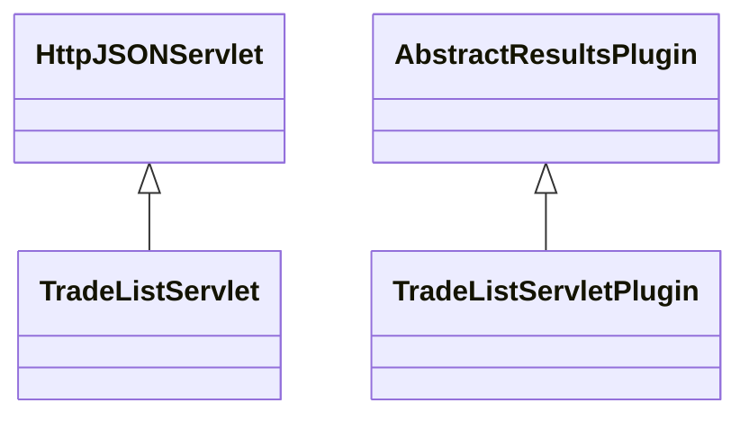

# ResultsTradeList.jar

[Group index](README.md) | [All archives](../README.md)

## Scope and provenance

- **Donor:** `SQX_145_REFERENCE_ROOT/internal/plugins/ResultsTradeList/ResultsTradeList.jar`.
- **SHA-256:** `e59bc5ef621f7b03c02ae1f096b16056db67fe4ac50f8ad553a7b554d59006b5`; accessed 2026-10-06; captured `2026-10-06T18:54:51.906614+00:00`.
- **Classes:** 2 raw entries; 2 unique entry names. Duplicate occurrence indices are zero-based.
- **Inspection:** read-only ZIP hashing and class-file structural parsing; signatures/descriptors, modifiers, hierarchy and references only. Bytecode bodies are hashed, not published.
- **Allocation:** proposed `FEAT-RESULTS-RESULTS-TRADE-LIST`, P08; [roadmap](../../sqx-full-application-roadmap.md). Domain README registration remains required.
- **Repository:** `01067f00031428613c6394064ca1bcadc1ba00ee`; review state unreviewed. Download label 145-dev1; installed build/activation and runtime equivalence unverified.
- **Limit:** every class/member is inventoried; declaration coverage does not establish consumed calls, defaults, formulas, failure semantics or algorithm parity.
- **Archive/resource index:** [220.json](../../../evidence/sqx145/archives/145/220.json).

## Complete member declarations

Member shards contain exact JVM names/descriptors, access flags, generic signatures, throws types, declared fields/methods, superclass/interfaces and referenced class names. All classes, nested/synthetic members and overloads are retained. Code length/hash is structural evidence, not a normalized algorithm comparison.

- [001.json](../../../evidence/sqx145/members/220/001.json) — SHA-256 `f7deecf5cc534851fa0c4eb3b4e1ea6fa8bb740eeaeb1ba619281c667d827af0`.

## Focused structural diagram

Up to twelve non-nested classes; arrows show declared inheritance/interfaces only. External type names are not evidence of an available body or an executed dependency.

## Class inventory

| Archive entry | Occurrence | Class SHA-256 | Fields | Methods |
| --- | ---: | --- | ---: | ---: |
| `com/strategyquant/plugin/Results/impl/TradeList/TradeListServlet.class` | 0 | `fd7a0c164928027a89d6563db96eff11bc5c5e3135453e7f0364dc9ca6028855` | 10 | 14 |
| `com/strategyquant/plugin/Results/impl/TradeList/TradeListServletPlugin.class` | 0 | `a78510e3a8218e10809ccc7e44aba739d40be8f6ff29d42ee99b8ab88dcbe1e6` | 2 | 8 |
