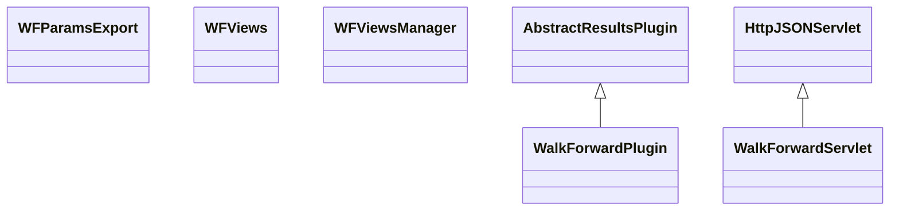

# ResultsWalkForward.jar

[Group index](README.md) | [All archives](../README.md)

## Scope and provenance

- **Donor:** `SQX_145_REFERENCE_ROOT/internal/plugins/ResultsWalkForward/ResultsWalkForward.jar`.
- **SHA-256:** `f35a0ece39d090656ace5996fadc12ae1c0ddfd028952054f2b8c6ddf801964a`; accessed 2026-10-06; captured `2026-10-06T18:54:51.906614+00:00`.
- **Classes:** 5 raw entries; 5 unique entry names. Duplicate occurrence indices are zero-based.
- **Inspection:** read-only ZIP hashing and class-file structural parsing; signatures/descriptors, modifiers, hierarchy and references only. Bytecode bodies are hashed, not published.
- **Allocation:** proposed `FEAT-OPTIMIZER-RESULTS-WALK-FORWARD`, P10; [roadmap](../../sqx-full-application-roadmap.md). Domain README registration remains required.
- **Repository:** `01067f00031428613c6394064ca1bcadc1ba00ee`; review state unreviewed. Download label 145-dev1; installed build/activation and runtime equivalence unverified.
- **Limit:** every class/member is inventoried; declaration coverage does not establish consumed calls, defaults, formulas, failure semantics or algorithm parity.
- **Archive/resource index:** [222.json](../../../evidence/sqx145/archives/145/222.json).

## Complete member declarations

Member shards contain exact JVM names/descriptors, access flags, generic signatures, throws types, declared fields/methods, superclass/interfaces and referenced class names. All classes, nested/synthetic members and overloads are retained. Code length/hash is structural evidence, not a normalized algorithm comparison.

- [001.json](../../../evidence/sqx145/members/222/001.json) — SHA-256 `195fb2cdc70d59b3413735276705efe5109da94f7eed4e7ef00b53120f984195`.

## Focused structural diagram

Up to twelve non-nested classes; arrows show declared inheritance/interfaces only. External type names are not evidence of an available body or an executed dependency.

## Class inventory

| Archive entry | Occurrence | Class SHA-256 | Fields | Methods |
| --- | ---: | --- | ---: | ---: |
| `com/strategyquant/plugin/Results/impl/WalkForward/WFParamsExport.class` | 0 | `e2263776eba7ed388f4d648d59f306c34b23153dcfbd3f92cc33ed83854ec507` | 1 | 5 |
| `com/strategyquant/plugin/Results/impl/WalkForward/WalkForwardPlugin.class` | 0 | `1f16a63c9821c627c9b4fc062a8fa109d10d6fec641319bc620163e6653a7b5b` | 2 | 8 |
| `com/strategyquant/plugin/Results/impl/WalkForward/WalkForwardServlet.class` | 0 | `4fda18764b4bf6c1ea20c0c7a6fdb8c9c92e8bf539140eab55d3f67139d79659` | 4 | 15 |
| `com/strategyquant/plugin/Results/impl/WalkForward/views/WFViews.class` | 0 | `fafc82b70dc0f116c2a4750c01dd060d5bdeabd1b93fed79724b02524861ecdb` | 2 | 10 |
| `com/strategyquant/plugin/Results/impl/WalkForward/views/WFViewsManager.class` | 0 | `a652ab385ec97f931705ceefd21397ad8a8f27605ebfaffd5342a6500efba408` | 6 | 13 |
