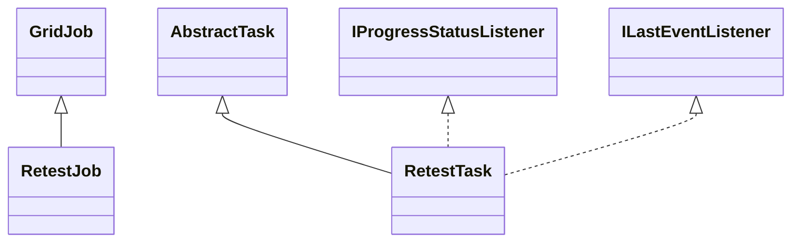

# TaskRetest.jar

[Group index](README.md) | [All archives](../README.md)

## Scope and provenance

- **Donor:** `SQX_145_REFERENCE_ROOT/internal/plugins/TaskRetest/TaskRetest.jar`.
- **SHA-256:** `a7957f8d46aa6b01be420af5970a63fed5b8ac9600beac6af95a28eab5cb5437`; accessed 2026-10-06; captured `2026-10-06T18:54:51.906614+00:00`.
- **Classes:** 4 raw entries; 4 unique entry names. Duplicate occurrence indices are zero-based.
- **Inspection:** read-only ZIP hashing and class-file structural parsing; signatures/descriptors, modifiers, hierarchy and references only. Bytecode bodies are hashed, not published.
- **Allocation:** proposed `FEAT-ROBUSTNESS-TASK-RETEST`, P11; [roadmap](../../sqx-full-application-roadmap.md). Domain README registration remains required.
- **Repository:** `01067f00031428613c6394064ca1bcadc1ba00ee`; review state unreviewed. Download label 145-dev1; installed build/activation and runtime equivalence unverified.
- **Limit:** every class/member is inventoried; declaration coverage does not establish consumed calls, defaults, formulas, failure semantics or algorithm parity.
- **Archive/resource index:** [284.json](../../../evidence/sqx145/archives/145/284.json).

## Complete member declarations

Member shards contain exact JVM names/descriptors, access flags, generic signatures, throws types, declared fields/methods, superclass/interfaces and referenced class names. All classes, nested/synthetic members and overloads are retained. Code length/hash is structural evidence, not a normalized algorithm comparison.

- [001.json](../../../evidence/sqx145/members/284/001.json) — SHA-256 `508046aefef1177b607fe6500017d53805b6acd9c1b8f881a1c5db7b8aeac65c`.

## Focused structural diagram

Up to twelve non-nested classes; arrows show declared inheritance/interfaces only. External type names are not evidence of an available body or an executed dependency.

## Class inventory

| Archive entry | Occurrence | Class SHA-256 | Fields | Methods |
| --- | ---: | --- | ---: | ---: |
| `com/strategyquant/plugin/Task/impl/Retest/RetestJob.class` | 0 | `97466cc61e3c5cc12c9db14f4cdd9624f227fa44e497df74a64f4c7480a623cc` | 5 | 5 |
| `com/strategyquant/plugin/Task/impl/Retest/RetestTask$1.class` | 0 | `23ef2d5a8bab0d69a172788536b8a43335b1a731b432521d7a5891c44746eced` | 1 | 2 |
| `com/strategyquant/plugin/Task/impl/Retest/RetestTask$2.class` | 0 | `fd963351a0805ec46f354b8002b38040e5f1689abec1c8e4bbdf6c3e75c1f21d` | 1 | 2 |
| `com/strategyquant/plugin/Task/impl/Retest/RetestTask.class` | 0 | `e2b5706690f2743b7d5a0d54efe3137d159c2d6dbca6b3176c7021228bcf307a` | 40 | 37 |
