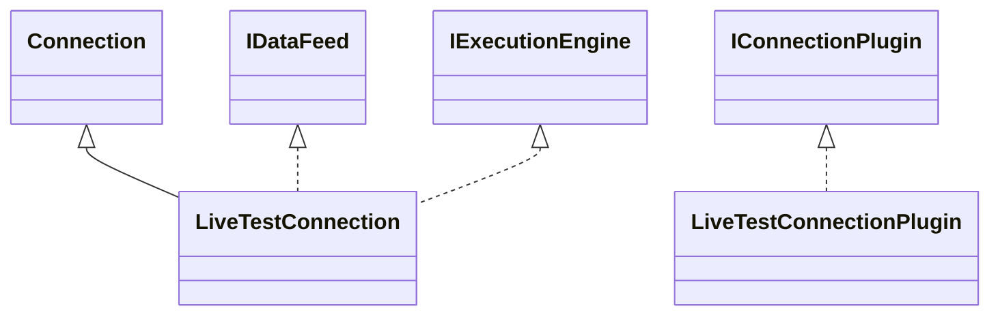

# ConnectionLiveTest.jar

[Group index](README.md) | [All archives](../README.md)

## Scope and provenance

- **Donor:** `SQX_145_REFERENCE_ROOT/internal/plugins/ConnectionLiveTest/ConnectionLiveTest.jar`.
- **SHA-256:** `9285422ca69b69efe92f72954b2c5e8f938ec4879f9b5b42819faa128b9c9bfe`; accessed 2026-10-06; captured `2026-10-06T18:54:51.906614+00:00`.
- **Classes:** 3 raw entries; 3 unique entry names. Duplicate occurrence indices are zero-based.
- **Inspection:** read-only ZIP hashing and class-file structural parsing; signatures/descriptors, modifiers, hierarchy and references only. Bytecode bodies are hashed, not published.
- **Allocation:** proposed `FEAT-CONNECTION-CONNECTION-LIVE-TEST`, P16; [roadmap](../../sqx-full-application-roadmap.md). Domain README registration remains required.
- **Repository:** `01067f00031428613c6394064ca1bcadc1ba00ee`; review state unreviewed. Download label 145-dev1; installed build/activation and runtime equivalence unverified.
- **Limit:** every class/member is inventoried; declaration coverage does not establish consumed calls, defaults, formulas, failure semantics or algorithm parity.
- **Archive/resource index:** [144.json](../../../evidence/sqx145/archives/145/144.json).

## Complete member declarations

Member shards contain exact JVM names/descriptors, access flags, generic signatures, throws types, declared fields/methods, superclass/interfaces and referenced class names. All classes, nested/synthetic members and overloads are retained. Code length/hash is structural evidence, not a normalized algorithm comparison.

- [001.json](../../../evidence/sqx145/members/144/001.json) — SHA-256 `157ec8b4a7bb8eba544a77f3e4826b22cb6743e6006c69b9ae570b1a04b3702f`.

## Focused structural diagram

Up to twelve non-nested classes; arrows show declared inheritance/interfaces only. External type names are not evidence of an available body or an executed dependency.

## Class inventory

| Archive entry | Occurrence | Class SHA-256 | Fields | Methods |
| --- | ---: | --- | ---: | ---: |
| `com/strategyquant/plugin/Connection/impl/LiveTest/LiveTestConnection$1.class` | 0 | `5ea3180e4769ec36e3ac879bcf993be6fa2f338a1d461f6b6f8e0683ee5c104a` | 6 | 2 |
| `com/strategyquant/plugin/Connection/impl/LiveTest/LiveTestConnection.class` | 0 | `93c3b747806985bcc5d1e772f7066e2726d484b892c2e140f9335d84203b79c9` | 2 | 33 |
| `com/strategyquant/plugin/Connection/impl/LiveTest/LiveTestConnectionPlugin.class` | 0 | `f2f8e71f1b3e6dae07633feb1e688029eb33b8f50d0631519fbc4e98e5d87f87` | 1 | 9 |
