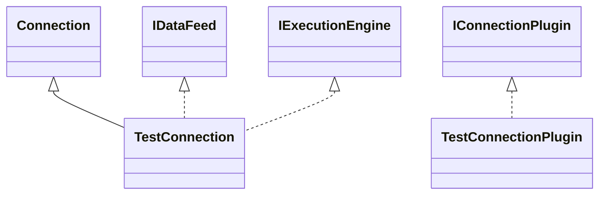

# ConnectionTest.jar

[Group index](README.md) | [All archives](../README.md)

## Scope and provenance

- **Donor:** `SQX_145_REFERENCE_ROOT/internal/plugins/ConnectionTest/ConnectionTest.jar`.
- **SHA-256:** `175ebc8fc349e53672ad787cf9f873591b70695af8fbbd4dab05c0d8779e5e26`; accessed 2026-10-06; captured `2026-10-06T18:54:51.906614+00:00`.
- **Classes:** 3 raw entries; 3 unique entry names. Duplicate occurrence indices are zero-based.
- **Inspection:** read-only ZIP hashing and class-file structural parsing; signatures/descriptors, modifiers, hierarchy and references only. Bytecode bodies are hashed, not published.
- **Allocation:** proposed `FEAT-CONNECTION-CONNECTION-TEST`, P16; [roadmap](../../sqx-full-application-roadmap.md). Domain README registration remains required.
- **Repository:** `01067f00031428613c6394064ca1bcadc1ba00ee`; review state unreviewed. Download label 145-dev1; installed build/activation and runtime equivalence unverified.
- **Limit:** every class/member is inventoried; declaration coverage does not establish consumed calls, defaults, formulas, failure semantics or algorithm parity.
- **Archive/resource index:** [146.json](../../../evidence/sqx145/archives/145/146.json).

## Complete member declarations

Member shards contain exact JVM names/descriptors, access flags, generic signatures, throws types, declared fields/methods, superclass/interfaces and referenced class names. All classes, nested/synthetic members and overloads are retained. Code length/hash is structural evidence, not a normalized algorithm comparison.

- [001.json](../../../evidence/sqx145/members/146/001.json) — SHA-256 `fe02ef43f51aeaa5abd464295a40965024f69b6076323d479fe1cae00cbe2f66`.

## Focused structural diagram

Up to twelve non-nested classes; arrows show declared inheritance/interfaces only. External type names are not evidence of an available body or an executed dependency.

## Class inventory

| Archive entry | Occurrence | Class SHA-256 | Fields | Methods |
| --- | ---: | --- | ---: | ---: |
| `com/strategyquant/plugin/Connection/impl/Test/TestConnection$1.class` | 0 | `5d5ba898ab7d2da0dfe6c16419f3ac8beaf47f805356e43af9f70f0f21256a91` | 5 | 2 |
| `com/strategyquant/plugin/Connection/impl/Test/TestConnection.class` | 0 | `70c2ddbbf1d28b68a8f52818fd29fce97ac4bcbe8f6001b9659dd42f969b87e1` | 2 | 33 |
| `com/strategyquant/plugin/Connection/impl/Test/TestConnectionPlugin.class` | 0 | `2425f0f2928fed31ccb6e3a34ad1577d38d9025faa5292f12259ca0776ba6061` | 1 | 9 |
