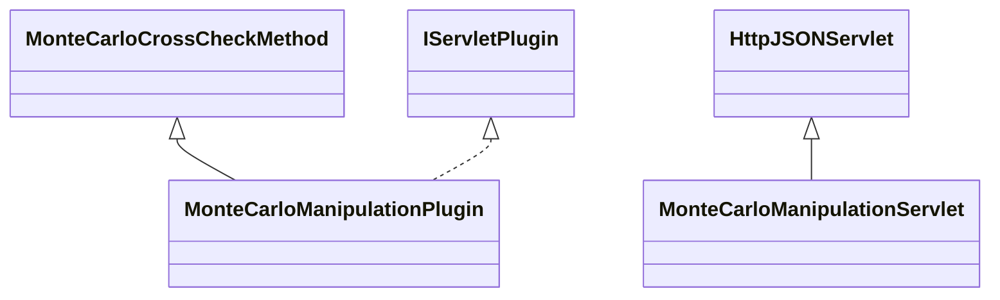

# CrossCheckMonteCarloManipulation.jar

[Group index](README.md) | [All archives](../README.md)

## Scope and provenance

- **Donor:** `SQX_145_REFERENCE_ROOT/internal/plugins/CrossCheckMonteCarloManipulation/CrossCheckMonteCarloManipulation.jar`.
- **SHA-256:** `9e1b43294ccf3a6fa2e9fbda63a6e1d2089982050dc3f31267793e16425e6688`; accessed 2026-10-06; captured `2026-10-06T18:54:51.906614+00:00`.
- **Classes:** 2 raw entries; 2 unique entry names. Duplicate occurrence indices are zero-based.
- **Inspection:** read-only ZIP hashing and class-file structural parsing; signatures/descriptors, modifiers, hierarchy and references only. Bytecode bodies are hashed, not published.
- **Allocation:** proposed `FEAT-ROBUSTNESS-CROSS-CHECK-MONTE-CARLO-MANIPULATION`, P11; [roadmap](../../sqx-full-application-roadmap.md). Domain README registration remains required.
- **Repository:** `01067f00031428613c6394064ca1bcadc1ba00ee`; review state unreviewed. Download label 145-dev1; installed build/activation and runtime equivalence unverified.
- **Limit:** every class/member is inventoried; declaration coverage does not establish consumed calls, defaults, formulas, failure semantics or algorithm parity.
- **Archive/resource index:** [147.json](../../../evidence/sqx145/archives/145/147.json).

## Complete member declarations

Member shards contain exact JVM names/descriptors, access flags, generic signatures, throws types, declared fields/methods, superclass/interfaces and referenced class names. All classes, nested/synthetic members and overloads are retained. Code length/hash is structural evidence, not a normalized algorithm comparison.

- [001.json](../../../evidence/sqx145/members/147/001.json) — SHA-256 `720e54d5ace1a8d16328b1085f5f16348f7e21861babef4b95470149b891ae64`.

## Focused structural diagram

Up to twelve non-nested classes; arrows show declared inheritance/interfaces only. External type names are not evidence of an available body or an executed dependency.

## Class inventory

| Archive entry | Occurrence | Class SHA-256 | Fields | Methods |
| --- | ---: | --- | ---: | ---: |
| `com/strategyquant/plugin/CrossCheck/impl/MonteCarloManipulation/MonteCarloManipulationPlugin.class` | 0 | `4875eb9583bc01fc996c63cdebe864e623a8c8eee342c190f4fd392bb49282f9` | 4 | 22 |
| `com/strategyquant/plugin/CrossCheck/impl/MonteCarloManipulation/MonteCarloManipulationServlet.class` | 0 | `37ffde6a1595a79567a5a11326a7993259c9309df6cc8b0ece561ebef5344dcf` | 1 | 6 |
