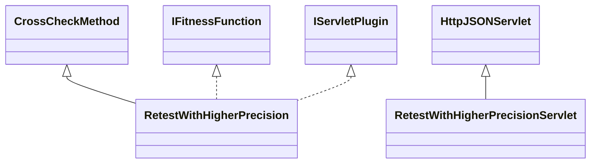

# CrossCheckRetestWithHigherPrecision.jar

[Group index](README.md) | [All archives](../README.md)

## Scope and provenance

- **Donor:** `SQX_145_REFERENCE_ROOT/internal/plugins/CrossCheckRetestWithHigherPrecision/CrossCheckRetestWithHigherPrecision.jar`.
- **SHA-256:** `a62e26f3efe6e7a087cc78203c49d038a1e90c96ed69037bcec70d01f73eb5ec`; accessed 2026-10-06; captured `2026-10-06T18:54:51.906614+00:00`.
- **Classes:** 4 raw entries; 4 unique entry names. Duplicate occurrence indices are zero-based.
- **Inspection:** read-only ZIP hashing and class-file structural parsing; signatures/descriptors, modifiers, hierarchy and references only. Bytecode bodies are hashed, not published.
- **Allocation:** proposed `FEAT-ROBUSTNESS-CROSS-CHECK-RETEST-WITH-HIGHER-PRECISION`, P11; [roadmap](../../sqx-full-application-roadmap.md). Domain README registration remains required.
- **Repository:** `01067f00031428613c6394064ca1bcadc1ba00ee`; review state unreviewed. Download label 145-dev1; installed build/activation and runtime equivalence unverified.
- **Limit:** every class/member is inventoried; declaration coverage does not establish consumed calls, defaults, formulas, failure semantics or algorithm parity.
- **Archive/resource index:** [151.json](../../../evidence/sqx145/archives/145/151.json).

## Complete member declarations

Member shards contain exact JVM names/descriptors, access flags, generic signatures, throws types, declared fields/methods, superclass/interfaces and referenced class names. All classes, nested/synthetic members and overloads are retained. Code length/hash is structural evidence, not a normalized algorithm comparison.

- [001.json](../../../evidence/sqx145/members/151/001.json) — SHA-256 `df8e08e4f42b4155b6f43ab4aeccdbbcd152fdb9783b4ca8c40edaa2c68bd873`.

## Focused structural diagram

Up to twelve non-nested classes; arrows show declared inheritance/interfaces only. External type names are not evidence of an available body or an executed dependency.

## Class inventory

| Archive entry | Occurrence | Class SHA-256 | Fields | Methods |
| --- | ---: | --- | ---: | ---: |
| `com/strategyquant/plugin/CrossCheck/impl/RetestWithHigherPrecision/RetestWithHigherPrecision$1.class` | 0 | `8aa26f85cfed125d6504aa0e6e6680b4485a53f63f39ef2a807e06ffcbbc94a5` | 1 | 3 |
| `com/strategyquant/plugin/CrossCheck/impl/RetestWithHigherPrecision/RetestWithHigherPrecision$Goal.class` | 0 | `a7d3d1fb3a99c2bdf315a75594fc429977e049251dcef620e84f3223aabd2d4d` | 6 | 2 |
| `com/strategyquant/plugin/CrossCheck/impl/RetestWithHigherPrecision/RetestWithHigherPrecision.class` | 0 | `5ada99d1486de4d71ee2ce40d3eb78b7100fe9c3d3a04ac92aeae16e3d872384` | 3 | 40 |
| `com/strategyquant/plugin/CrossCheck/impl/RetestWithHigherPrecision/RetestWithHigherPrecisionServlet.class` | 0 | `a9a6235e2de0ec3683252fb67f45a710c862b707d6a923a7292d167deb29f157` | 1 | 4 |
