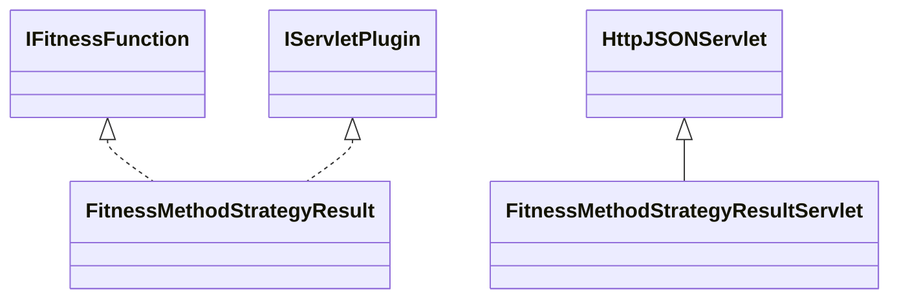

# FitnessMethodStrategyResult.jar

[Group index](README.md) | [All archives](../README.md)

## Scope and provenance

- **Donor:** `SQX_145_REFERENCE_ROOT/internal/plugins/FitnessMethodStrategyResult/FitnessMethodStrategyResult.jar`.
- **SHA-256:** `d2d109daf04075fe48e02fa888f53f938710744f1ab628fb7f011ea747cb0b0f`; accessed 2026-10-06; captured `2026-10-06T18:54:51.906614+00:00`.
- **Classes:** 4 raw entries; 4 unique entry names. Duplicate occurrence indices are zero-based.
- **Inspection:** read-only ZIP hashing and class-file structural parsing; signatures/descriptors, modifiers, hierarchy and references only. Bytecode bodies are hashed, not published.
- **Allocation:** proposed `FEAT-BUILDER-FITNESS-METHOD-STRATEGY-RESULT`, P09; [roadmap](../../sqx-full-application-roadmap.md). Domain README registration remains required.
- **Repository:** `01067f00031428613c6394064ca1bcadc1ba00ee`; review state unreviewed. Download label 145-dev1; installed build/activation and runtime equivalence unverified.
- **Limit:** every class/member is inventoried; declaration coverage does not establish consumed calls, defaults, formulas, failure semantics or algorithm parity.
- **Archive/resource index:** [189.json](../../../evidence/sqx145/archives/145/189.json).

## Complete member declarations

Member shards contain exact JVM names/descriptors, access flags, generic signatures, throws types, declared fields/methods, superclass/interfaces and referenced class names. All classes, nested/synthetic members and overloads are retained. Code length/hash is structural evidence, not a normalized algorithm comparison.

- [001.json](../../../evidence/sqx145/members/189/001.json) — SHA-256 `3e201a939ae3b6697afea0c4ba7b79b238d346d38760a4ccc9703192fdd3d4b5`.

## Focused structural diagram

Up to twelve non-nested classes; arrows show declared inheritance/interfaces only. External type names are not evidence of an available body or an executed dependency.

## Class inventory

| Archive entry | Occurrence | Class SHA-256 | Fields | Methods |
| --- | ---: | --- | ---: | ---: |
| `com/strategyquant/plugin/FitnessMethod/impl/StrategyResult/FitnessMethodStrategyResult$1.class` | 0 | `0a676d182c9a9d51b3b7b46ea41151a1089dc587a8da2edb51527cc9b90a6312` | 0 | 0 |
| `com/strategyquant/plugin/FitnessMethod/impl/StrategyResult/FitnessMethodStrategyResult$Goal.class` | 0 | `f6dec9576af4e7a0cf1f7ea42e360ac07a57aba1861d62c6e82552ba175339aa` | 6 | 2 |
| `com/strategyquant/plugin/FitnessMethod/impl/StrategyResult/FitnessMethodStrategyResult.class` | 0 | `a8e7a3bef40e7c48d6c90ac1c5915d48f1bd8e1c1ef999aba10e241d1c4eefbb` | 4 | 23 |
| `com/strategyquant/plugin/FitnessMethod/impl/StrategyResult/FitnessMethodStrategyResultServlet.class` | 0 | `17b1a8edd8ad0f01fdb8cc1de6e4733ecdb783244b644521ebbc49960c07c057` | 1 | 4 |
