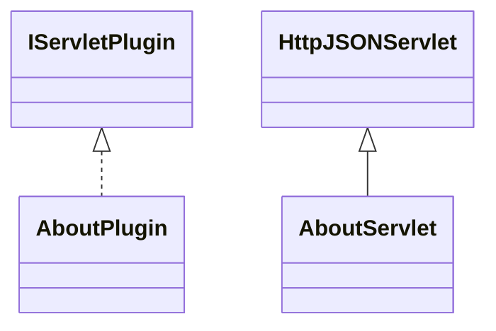

# HomeAbout.jar

[Group index](README.md) | [All archives](../README.md)

## Scope and provenance

- **Donor:** `SQX_145_REFERENCE_ROOT/internal/plugins/HomeAbout/HomeAbout.jar`.
- **SHA-256:** `950092f1f3abff3ca23295d9fccd464a05d3d4605d8b9d1c1162d03e8ad1b5bd`; accessed 2026-10-06; captured `2026-10-06T18:54:51.906614+00:00`.
- **Classes:** 2 raw entries; 2 unique entry names. Duplicate occurrence indices are zero-based.
- **Inspection:** read-only ZIP hashing and class-file structural parsing; signatures/descriptors, modifiers, hierarchy and references only. Bytecode bodies are hashed, not published.
- **Allocation:** proposed `FEAT-PRODUCT-HOME-ABOUT`, P17; [roadmap](../../sqx-full-application-roadmap.md). Domain README registration remains required.
- **Repository:** `01067f00031428613c6394064ca1bcadc1ba00ee`; review state unreviewed. Download label 145-dev1; installed build/activation and runtime equivalence unverified.
- **Limit:** every class/member is inventoried; declaration coverage does not establish consumed calls, defaults, formulas, failure semantics or algorithm parity.
- **Archive/resource index:** [191.json](../../../evidence/sqx145/archives/145/191.json).

## Complete member declarations

Member shards contain exact JVM names/descriptors, access flags, generic signatures, throws types, declared fields/methods, superclass/interfaces and referenced class names. All classes, nested/synthetic members and overloads are retained. Code length/hash is structural evidence, not a normalized algorithm comparison.

- [001.json](../../../evidence/sqx145/members/191/001.json) — SHA-256 `02fd6c27ab564883f82788347700f37afd79ab33e445a5c66abfa60862edcfc8`.

## Focused structural diagram

Up to twelve non-nested classes; arrows show declared inheritance/interfaces only. External type names are not evidence of an available body or an executed dependency.

## Class inventory

| Archive entry | Occurrence | Class SHA-256 | Fields | Methods |
| --- | ---: | --- | ---: | ---: |
| `com/strategyquant/plugin/Home/impl/About/AboutPlugin.class` | 0 | `32c7445c1773204adf2bf1b0bff531a6458bfed8898d3f68508756d5d1fbf991` | 1 | 5 |
| `com/strategyquant/plugin/Home/impl/About/AboutServlet.class` | 0 | `66e75d296f760b13429c99158fcc0c84c762ce4d54d79075ec88998aef87f8b0` | 1 | 6 |
