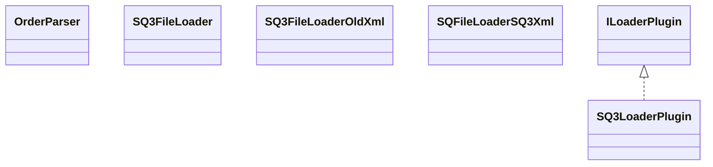

# LoaderSQ3.jar

[Group index](README.md) | [All archives](../README.md)

## Scope and provenance

- **Donor:** `SQX_145_REFERENCE_ROOT/internal/plugins/LoaderSQ3/LoaderSQ3.jar`.
- **SHA-256:** `5821dfc918051a68cb9e191209479d0041cf56271ac66f4588416525cdd57fe0`; accessed 2026-10-06; captured `2026-10-06T18:54:51.906614+00:00`.
- **Classes:** 5 raw entries; 5 unique entry names. Duplicate occurrence indices are zero-based.
- **Inspection:** read-only ZIP hashing and class-file structural parsing; signatures/descriptors, modifiers, hierarchy and references only. Bytecode bodies are hashed, not published.
- **Allocation:** proposed `FEAT-AUTHORING-LOADER-SQ3`, P07; [roadmap](../../sqx-full-application-roadmap.md). Domain README registration remains required.
- **Repository:** `01067f00031428613c6394064ca1bcadc1ba00ee`; review state unreviewed. Download label 145-dev1; installed build/activation and runtime equivalence unverified.
- **Limit:** every class/member is inventoried; declaration coverage does not establish consumed calls, defaults, formulas, failure semantics or algorithm parity.
- **Archive/resource index:** [192.json](../../../evidence/sqx145/archives/145/192.json).

## Complete member declarations

Member shards contain exact JVM names/descriptors, access flags, generic signatures, throws types, declared fields/methods, superclass/interfaces and referenced class names. All classes, nested/synthetic members and overloads are retained. Code length/hash is structural evidence, not a normalized algorithm comparison.

- [001.json](../../../evidence/sqx145/members/192/001.json) — SHA-256 `76343be13e0049a72c3b21e340bdb8874588e7e47e416e951c4c529acfd6dbdb`.

## Focused structural diagram

Up to twelve non-nested classes; arrows show declared inheritance/interfaces only. External type names are not evidence of an available body or an executed dependency.

## Class inventory

| Archive entry | Occurrence | Class SHA-256 | Fields | Methods |
| --- | ---: | --- | ---: | ---: |
| `com/strategyquant/plugin/Loader/impl/SQ3/OrderParser.class` | 0 | `c13428ab45ab36a2bc49221790aeec1adfa6b6066ead019d4a9447a15cd3c5f2` | 0 | 12 |
| `com/strategyquant/plugin/Loader/impl/SQ3/SQ3FileLoader.class` | 0 | `86ec07f3a76879e2502cb7d19b16e4ced3b122ed4bc7cc82973079fdbdd1fa1c` | 1 | 2 |
| `com/strategyquant/plugin/Loader/impl/SQ3/SQ3FileLoaderOldXml.class` | 0 | `28c0df5264fb06b5b47873ab608852895fd338c81a20ad2a5d3e38107a6552e0` | 1 | 3 |
| `com/strategyquant/plugin/Loader/impl/SQ3/SQ3LoaderPlugin.class` | 0 | `1e7deff017290f06e163954944030b257c64ab1b37907caefb936c5e1fd99b6e` | 2 | 8 |
| `com/strategyquant/plugin/Loader/impl/SQ3/SQFileLoaderSQ3Xml.class` | 0 | `006980d134abc254ab5d51e8486759ab4a6695920cac342d0ce264c70d5eead5` | 1 | 9 |
