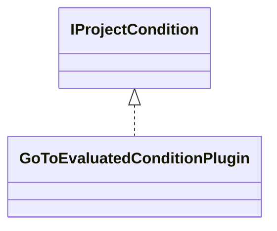

# ProjectConditionGoToEvaluated.jar

[Group index](README.md) | [All archives](../README.md)

## Scope and provenance

- **Donor:** `SQX_145_REFERENCE_ROOT/internal/plugins/ProjectConditionGoToEvaluated/ProjectConditionGoToEvaluated.jar`.
- **SHA-256:** `519f150819c222c443ffef6678eeb201a5114579db0aaf8c4dfda88cc058def8`; accessed 2026-10-06; captured `2026-10-06T18:54:51.906614+00:00`.
- **Classes:** 1 raw entries; 1 unique entry names. Duplicate occurrence indices are zero-based.
- **Inspection:** read-only ZIP hashing and class-file structural parsing; signatures/descriptors, modifiers, hierarchy and references only. Bytecode bodies are hashed, not published.
- **Allocation:** proposed `FEAT-PROJECT-PROJECT-CONDITION-GO-TO-EVALUATED`, P13; [roadmap](../../sqx-full-application-roadmap.md). Domain README registration remains required.
- **Repository:** `01067f00031428613c6394064ca1bcadc1ba00ee`; review state unreviewed. Download label 145-dev1; installed build/activation and runtime equivalence unverified.
- **Limit:** every class/member is inventoried; declaration coverage does not establish consumed calls, defaults, formulas, failure semantics or algorithm parity.
- **Archive/resource index:** [197.json](../../../evidence/sqx145/archives/145/197.json).

## Complete member declarations

Member shards contain exact JVM names/descriptors, access flags, generic signatures, throws types, declared fields/methods, superclass/interfaces and referenced class names. All classes, nested/synthetic members and overloads are retained. Code length/hash is structural evidence, not a normalized algorithm comparison.

- [001.json](../../../evidence/sqx145/members/197/001.json) — SHA-256 `c2eb083d392c9e13ac06c1531940517fffef8d2bc16b670418f982220b4f2fc7`.

## Focused structural diagram

Up to twelve non-nested classes; arrows show declared inheritance/interfaces only. External type names are not evidence of an available body or an executed dependency.

## Class inventory

| Archive entry | Occurrence | Class SHA-256 | Fields | Methods |
| --- | ---: | --- | ---: | ---: |
| `com/strategyquant/plugin/ProjectCondition/impl/GoToEvaluated/GoToEvaluatedConditionPlugin.class` | 0 | `85ba96ac33d9ee5f35462b0664f775e431ad27cc45829236cbbec1ccb82926c3` | 5 | 15 |
