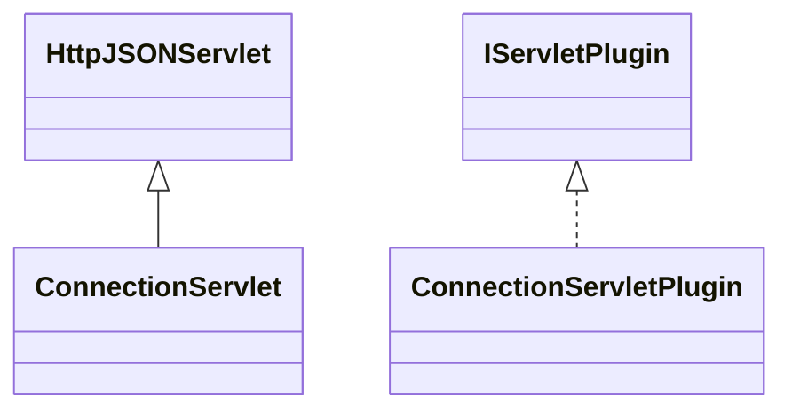

# ServletConnection.jar

[Group index](README.md) | [All archives](../README.md)

## Scope and provenance

- **Donor:** `SQX_145_REFERENCE_ROOT/internal/plugins/ServletConnection/ServletConnection.jar`.
- **SHA-256:** `37db7a764fe4988d227ecd49e3cee2318425655b0011a37bd0fa9adfa0065f90`; accessed 2026-10-06; captured `2026-10-06T18:54:51.906614+00:00`.
- **Classes:** 2 raw entries; 2 unique entry names. Duplicate occurrence indices are zero-based.
- **Inspection:** read-only ZIP hashing and class-file structural parsing; signatures/descriptors, modifiers, hierarchy and references only. Bytecode bodies are hashed, not published.
- **Allocation:** proposed `FEAT-CONNECTION-SERVLET-CONNECTION`, P16; [roadmap](../../sqx-full-application-roadmap.md). Domain README registration remains required.
- **Repository:** `01067f00031428613c6394064ca1bcadc1ba00ee`; review state unreviewed. Download label 145-dev1; installed build/activation and runtime equivalence unverified.
- **Limit:** every class/member is inventoried; declaration coverage does not establish consumed calls, defaults, formulas, failure semantics or algorithm parity.
- **Archive/resource index:** [231.json](../../../evidence/sqx145/archives/145/231.json).

## Complete member declarations

Member shards contain exact JVM names/descriptors, access flags, generic signatures, throws types, declared fields/methods, superclass/interfaces and referenced class names. All classes, nested/synthetic members and overloads are retained. Code length/hash is structural evidence, not a normalized algorithm comparison.

- [001.json](../../../evidence/sqx145/members/231/001.json) — SHA-256 `f98c75aa82b97ba7139aa513a6aa721dcef1b8c9a408fc19f59de63a3c9fcdbe`.

## Focused structural diagram

Up to twelve non-nested classes; arrows show declared inheritance/interfaces only. External type names are not evidence of an available body or an executed dependency.

## Class inventory

| Archive entry | Occurrence | Class SHA-256 | Fields | Methods |
| --- | ---: | --- | ---: | ---: |
| `com/strategyquant/plugin/Servlet/impl/Connection/ConnectionServlet.class` | 0 | `6f63d5a72b9d5fe5ba0440769f246fa3d72bf45f443398447b39441bfb79546b` | 3 | 12 |
| `com/strategyquant/plugin/Servlet/impl/Connection/ConnectionServletPlugin.class` | 0 | `a9dec411646c822af7c3a18a4530e3fcd408036561a49975687f2ce5cac30bcc` | 1 | 5 |
