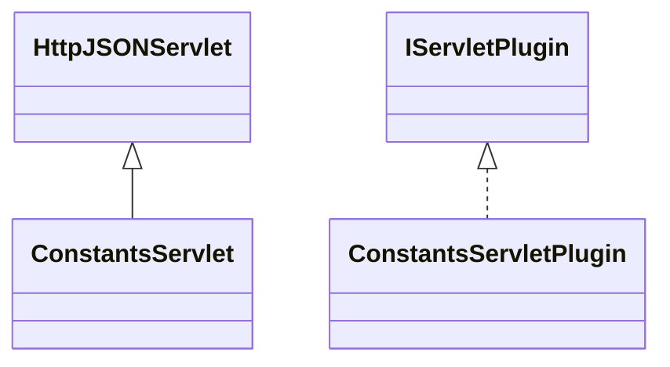

# ServletConstants.jar

[Group index](README.md) | [All archives](../README.md)

## Scope and provenance

- **Donor:** `SQX_145_REFERENCE_ROOT/internal/plugins/ServletConstants/ServletConstants.jar`.
- **SHA-256:** `188e5c2312faf36246d0c7d71a2312a9a51f21c2049bec9cd30b98fedec07e24`; accessed 2026-10-06; captured `2026-10-06T18:54:51.906614+00:00`.
- **Classes:** 2 raw entries; 2 unique entry names. Duplicate occurrence indices are zero-based.
- **Inspection:** read-only ZIP hashing and class-file structural parsing; signatures/descriptors, modifiers, hierarchy and references only. Bytecode bodies are hashed, not published.
- **Allocation:** proposed `FEAT-STRATEGY-SERVLET-CONSTANTS`, P05; [roadmap](../../sqx-full-application-roadmap.md). Domain README registration remains required.
- **Repository:** `01067f00031428613c6394064ca1bcadc1ba00ee`; review state unreviewed. Download label 145-dev1; installed build/activation and runtime equivalence unverified.
- **Limit:** every class/member is inventoried; declaration coverage does not establish consumed calls, defaults, formulas, failure semantics or algorithm parity.
- **Archive/resource index:** [232.json](../../../evidence/sqx145/archives/145/232.json).

## Complete member declarations

Member shards contain exact JVM names/descriptors, access flags, generic signatures, throws types, declared fields/methods, superclass/interfaces and referenced class names. All classes, nested/synthetic members and overloads are retained. Code length/hash is structural evidence, not a normalized algorithm comparison.

- [001.json](../../../evidence/sqx145/members/232/001.json) — SHA-256 `154b7f9e05eca1c052a9434082907b07d8563392e1b073ab82a66f688ce6bcea`.

## Focused structural diagram

Up to twelve non-nested classes; arrows show declared inheritance/interfaces only. External type names are not evidence of an available body or an executed dependency.

## Class inventory

| Archive entry | Occurrence | Class SHA-256 | Fields | Methods |
| --- | ---: | --- | ---: | ---: |
| `com/strategyquant/plugin/Servlet/impl/Constants/ConstantsServlet.class` | 0 | `c2681809ab6b6321efa4ec8f3a9303ecbb89716d14397e3d18d3681214103500` | 3 | 7 |
| `com/strategyquant/plugin/Servlet/impl/Constants/ConstantsServletPlugin.class` | 0 | `2fb754dc48192de6f8cd61f16d8602587665f33fd249dd284558803df97f4795` | 1 | 5 |
