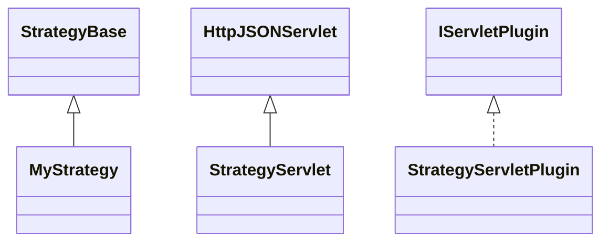

# ServletStrategy.jar

[Group index](README.md) | [All archives](../README.md)

## Scope and provenance

- **Donor:** `SQX_145_REFERENCE_ROOT/internal/plugins/ServletStrategy/ServletStrategy.jar`.
- **SHA-256:** `ad58850406ffb2bcdf01773459b48bae65a95737a30d023f0442f7fb35bbb5e6`; accessed 2026-10-06; captured `2026-10-06T18:54:51.906614+00:00`.
- **Classes:** 3 raw entries; 3 unique entry names. Duplicate occurrence indices are zero-based.
- **Inspection:** read-only ZIP hashing and class-file structural parsing; signatures/descriptors, modifiers, hierarchy and references only. Bytecode bodies are hashed, not published.
- **Allocation:** proposed `FEAT-AUTHORING-SERVLET-STRATEGY`, P07; [roadmap](../../sqx-full-application-roadmap.md). Domain README registration remains required.
- **Repository:** `01067f00031428613c6394064ca1bcadc1ba00ee`; review state unreviewed. Download label 145-dev1; installed build/activation and runtime equivalence unverified.
- **Limit:** every class/member is inventoried; declaration coverage does not establish consumed calls, defaults, formulas, failure semantics or algorithm parity.
- **Archive/resource index:** [237.json](../../../evidence/sqx145/archives/145/237.json).

## Complete member declarations

Member shards contain exact JVM names/descriptors, access flags, generic signatures, throws types, declared fields/methods, superclass/interfaces and referenced class names. All classes, nested/synthetic members and overloads are retained. Code length/hash is structural evidence, not a normalized algorithm comparison.

- [001.json](../../../evidence/sqx145/members/237/001.json) — SHA-256 `520d521b3a0a8af2afc9734d5ecd16062e9c409d42148db05c57647b3d796f5e`.

## Focused structural diagram

Up to twelve non-nested classes; arrows show declared inheritance/interfaces only. External type names are not evidence of an available body or an executed dependency.

## Class inventory

| Archive entry | Occurrence | Class SHA-256 | Fields | Methods |
| --- | ---: | --- | ---: | ---: |
| `com/strategyquant/plugin/Servlet/impl/Strategy/MyStrategy.class` | 0 | `a16a8ea83c68e4d7e168aff738903a0e46096de36a70f50839ca708076b2d33f` | 2 | 5 |
| `com/strategyquant/plugin/Servlet/impl/Strategy/StrategyServlet.class` | 0 | `b4ef6c5bfc2889c994a5ed4d99cb9325d87d83dac8e453bc89b7f3d23854bab9` | 3 | 9 |
| `com/strategyquant/plugin/Servlet/impl/Strategy/StrategyServletPlugin.class` | 0 | `3e7f99857d68dabb2c0a580fb5ac58aa961bd73149862ba94cf6742a1db60ba0` | 1 | 5 |
