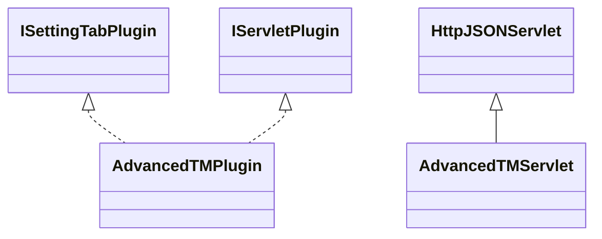

# SettingsAdvancedTM.jar

[Group index](README.md) | [All archives](../README.md)

## Scope and provenance

- **Donor:** `SQX_145_REFERENCE_ROOT/internal/plugins/SettingsAdvancedTM/SettingsAdvancedTM.jar`.
- **SHA-256:** `4a62d88b22f87eeeded005cd121990f373b30fc125a8fe608b1e8ae95b11e30f`; accessed 2026-10-06; captured `2026-10-06T18:54:51.906614+00:00`.
- **Classes:** 2 raw entries; 2 unique entry names. Duplicate occurrence indices are zero-based.
- **Inspection:** read-only ZIP hashing and class-file structural parsing; signatures/descriptors, modifiers, hierarchy and references only. Bytecode bodies are hashed, not published.
- **Allocation:** proposed `FEAT-SIMULATOR-SETTINGS-ADVANCED-TM`, P06; [roadmap](../../sqx-full-application-roadmap.md). Domain README registration remains required.
- **Repository:** `01067f00031428613c6394064ca1bcadc1ba00ee`; review state unreviewed. Download label 145-dev1; installed build/activation and runtime equivalence unverified.
- **Limit:** every class/member is inventoried; declaration coverage does not establish consumed calls, defaults, formulas, failure semantics or algorithm parity.
- **Archive/resource index:** [238.json](../../../evidence/sqx145/archives/145/238.json).

## Complete member declarations

Member shards contain exact JVM names/descriptors, access flags, generic signatures, throws types, declared fields/methods, superclass/interfaces and referenced class names. All classes, nested/synthetic members and overloads are retained. Code length/hash is structural evidence, not a normalized algorithm comparison.

- [001.json](../../../evidence/sqx145/members/238/001.json) — SHA-256 `ab5cae515c5c7f34d538e84c23895f2af4f0595a7b0283f8fed5296b964e7393`.

## Focused structural diagram

Up to twelve non-nested classes; arrows show declared inheritance/interfaces only. External type names are not evidence of an available body or an executed dependency.

## Class inventory

| Archive entry | Occurrence | Class SHA-256 | Fields | Methods |
| --- | ---: | --- | ---: | ---: |
| `com/strategyquant/plugin/Settings/impl/AdvancedTM/AdvancedTMPlugin.class` | 0 | `f043401390a2ab4ab85f612912a49970664f3c7dc03bb2d2c3de46dd8efb3c51` | 2 | 10 |
| `com/strategyquant/plugin/Settings/impl/AdvancedTM/AdvancedTMServlet.class` | 0 | `701f70398542ed4eae3cbf951bc70a211979c3174246db3b5bf20287e228a7bd` | 1 | 3 |
